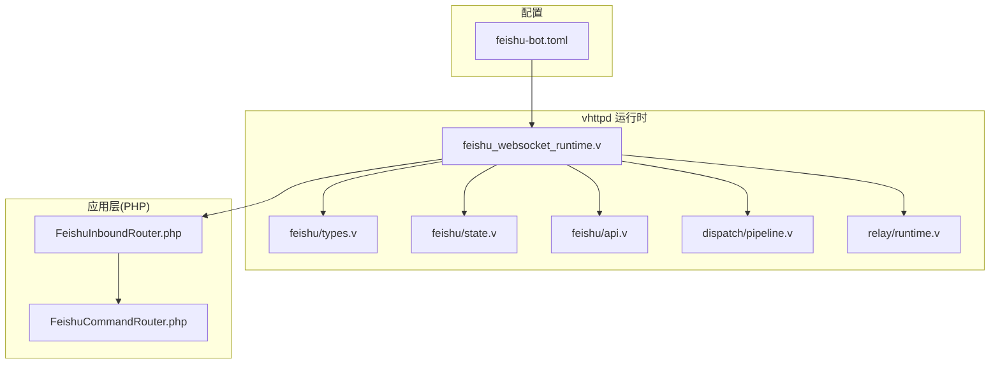
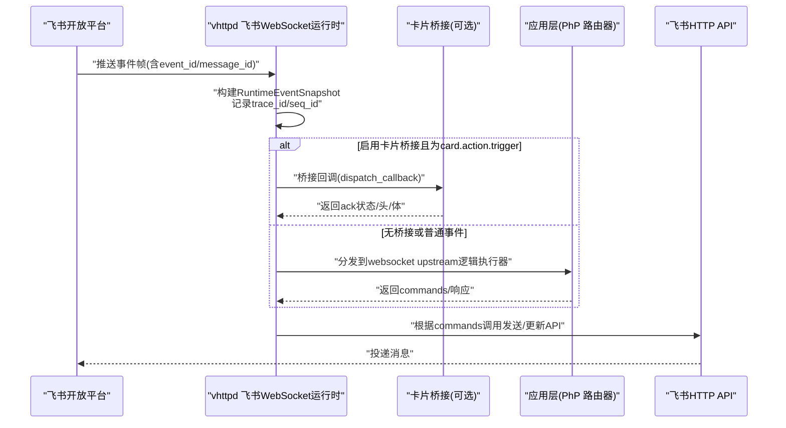
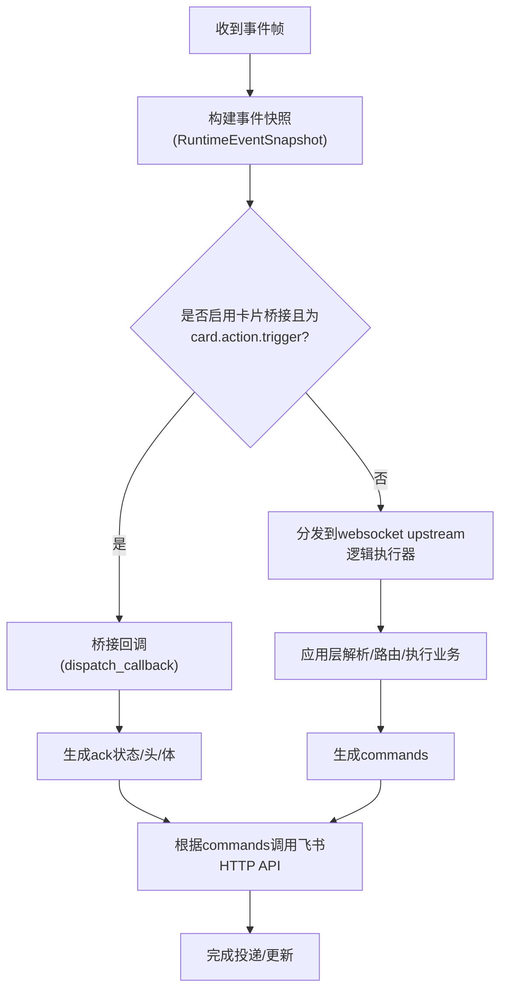
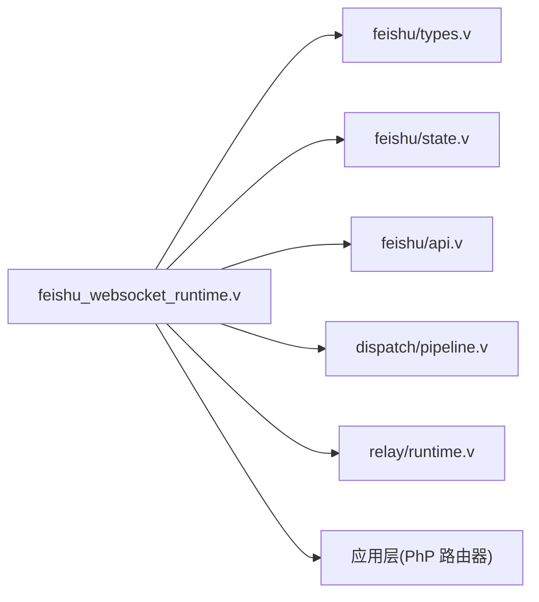

# 消息路由配置

<cite>
**本文引用的文件**   
- [feishu-bot.toml](file://examples/config/feishu-bot.toml)
- [types.v](file://src/feishu/types.v)
- [state.v](file://src/feishu/state.v)
- [api.v](file://src/feishu/api.v)
- [feishu_websocket_runtime.v](file://src/feishu_websocket_runtime.v)
- [pipeline.v](file://src/dispatch/pipeline.v)
- [runtime.v](file://src/relay/runtime.v)
- [07-feishu-bot.md](file://articles/07-feishu-bot.md)
- [09-codexbot.md](file://articles/09-codexbot.md)
- [11-observability.md](file://articles/11-observability.md)
</cite>

## 目录
1. [简介](#简介)
2. [项目结构](#项目结构)
3. [核心组件](#核心组件)
4. [架构总览](#架构总览)
5. [详细组件分析](#详细组件分析)
6. [依赖关系分析](#依赖关系分析)
7. [性能与可靠性](#性能与可靠性)
8. [故障排查指南](#故障排查指南)
9. [结论](#结论)
10. [附录：配置示例与最佳实践](#附录配置示例与最佳实践)

## 简介
本文件面向“飞书消息路由配置”，系统性说明事件订阅接入、消息处理管道、去重机制、路由规则与错误重试策略。内容覆盖从 vhttpd 的飞书 WebSocket 长连接接入，到应用层（PHP）的事件分发与命令路由，再到可观测性与运维能力，帮助读者快速搭建并稳定运行一个具备智能路由能力的飞书机器人。

## 项目结构
围绕飞书消息路由的关键代码与配置分布如下：
- 配置与示例
  - 示例配置：[feishu-bot.toml](file://examples/config/feishu-bot.toml)
- 运行时与协议类型
  - 飞书运行时类型与状态：[types.v](file://src/feishu/types.v)、[state.v](file://src/feishu/state.v)
  - 飞书 HTTP API 封装（发送/更新/上传/租户令牌）：[api.v](file://src/feishu/api.v)
  - 飞书 WebSocket 运行时入口（事件桥接与上游分发）：[feishu_websocket_runtime.v](file://src/feishu_websocket_runtime.v)
- 通用调度与中继
  - 管道与能力校验：[pipeline.v](file://src/dispatch/pipeline.v)
  - 中继运行时（会话/通道/载体）：[runtime.v](file://src/relay/runtime.v)
- 文档与实践
  - 飞书机器人入门与最佳实践：[07-feishu-bot.md](file://articles/07-feishu-bot.md)
  - CodexBot 示例中的消息路由与命令路由：[09-codexbot.md](file://articles/09-codexbot.md)
  - 可观测性与事件日志：[11-observability.md](file://articles/11-observability.md)

图表来源
- [feishu-bot.toml:1-40](file://examples/config/feishu-bot.toml#L1-L40)
- [feishu_websocket_runtime.v:113-141](file://src/feishu_websocket_runtime.v#L113-L141)
- [types.v:1-385](file://src/feishu/types.v#L1-L385)
- [state.v:1-357](file://src/feishu/state.v#L1-L357)
- [api.v:1-190](file://src/feishu/api.v#L1-L190)
- [pipeline.v:1-119](file://src/dispatch/pipeline.v#L1-L119)
- [runtime.v:1-187](file://src/relay/runtime.v#L1-L187)

章节来源
- [feishu-bot.toml:1-40](file://examples/config/feishu-bot.toml#L1-L40)
- [07-feishu-bot.md:50-110](file://articles/07-feishu-bot.md#L50-L110)

## 核心组件
- 飞书运行时类型与状态
  - ProviderRuntime：维护连接状态、指标统计、最近事件缓存等
  - FeishuState：多实例管理、缓冲管理、聊天快照聚合、默认实例解析
- 飞书 HTTP API 封装
  - 发送消息、更新消息、上传图片、获取租户访问令牌等
- WebSocket 运行时
  - 接收飞书事件帧，记录摘要，选择是否桥接到本地目标或上层逻辑执行器
- 通用调度与中继
  - Pipeline 描述符与能力校验
  - Relay Runtime 提供 Agent/Channel/Session/Carrier 生命周期与转发

章节来源
- [types.v:89-214](file://src/feishu/types.v#L89-L214)
- [state.v:9-148](file://src/feishu/state.v#L9-L148)
- [api.v:1-190](file://src/feishu/api.v#L1-L190)
- [feishu_websocket_runtime.v:113-141](file://src/feishu_websocket_runtime.v#L113-L141)
- [pipeline.v:1-119](file://src/dispatch/pipeline.v#L1-L119)
- [runtime.v:1-187](file://src/relay/runtime.v#L1-L187)

## 架构总览
下图展示从飞书平台到 vhttpd 再到应用层的端到端流程，包括事件桥接、业务执行与响应回写。

图表来源
- [feishu_websocket_runtime.v:113-141](file://src/feishu_websocket_runtime.v#L113-L141)
- [api.v:1-190](file://src/feishu/api.v#L1-L190)
- [types.v:59-87](file://src/feishu/types.v#L59-L87)

## 详细组件分析

### 事件订阅与接入配置
- 启用与基础参数
  - 通过配置文件启用飞书集成、设置重连延迟、token刷新提前量、最近事件限制等
- 多实例支持
  - 使用多个 [feishu.<name>] 块定义不同应用实例，运行时按名称区分
- 事件订阅地址
  - 采用长连接模式，无需公网地址；在飞书开放平台配置事件订阅后由 vhttpd 主动建连

章节来源
- [feishu-bot.toml:28-40](file://examples/config/feishu-bot.toml#L28-L40)
- [07-feishu-bot.md:50-110](file://articles/07-feishu-bot.md#L50-L110)

### 消息处理管道（事件分发、中间件、业务执行）
- 事件进入
  - WebSocket 运行时收到事件帧后，构造 RuntimeEventSnapshot，包含 event_id、message_id、chat_id、sender_id 等关键字段
- 桥接与分发
  - 若启用卡片桥接且事件类型为 card.action.trigger，优先走本地桥接回调；否则分发到 websocket upstream 逻辑执行器
- 业务执行
  - 应用层 PHP 侧进行消息解析、上下文加载与命令路由，最终生成 commands 列表
- 响应回写
  - 根据 commands 调用飞书 HTTP API 完成发送或更新操作

图表来源
- [feishu_websocket_runtime.v:113-141](file://src/feishu_websocket_runtime.v#L113-L141)
- [types.v:59-87](file://src/feishu/types.v#L59-L87)
- [api.v:1-190](file://src/feishu/api.v#L1-L190)

章节来源
- [feishu_websocket_runtime.v:113-141](file://src/feishu_websocket_runtime.v#L113-L141)
- [09-codexbot.md:185-315](file://articles/09-codexbot.md#L185-L315)

### 消息去重机制（event_id 与 message_id）
- 事件级去重
  - RuntimeEventSnapshot 携带 event_id，用于标识一次事件；结合 recent_events 窗口可辅助识别重复事件
- 消息级去重
  - 应用层可使用 message_id 进行幂等处理，避免重复执行
- 建议策略
  - 在应用层维护已处理的消息 ID 集合（带过期清理），对重复消息直接忽略并返回空 commands

章节来源
- [types.v:59-87](file://src/feishu/types.v#L59-L87)
- [07-feishu-bot.md:820-835](file://articles/07-feishu-bot.md#L820-L835)

### 路由规则配置示例（基于内容、发送者、群组）
- 入站路由（PHP）
  - 提取 event_type、tenant_key、sender(open_id)、chat_id、message_type、文本内容
  - 根据 chat_id 查找项目上下文，再按文本前缀/关键词路由到具体命令处理器
- 命令路由（PHP）
  - 支持帮助、创建/导入项目、设置、绑定、取消、工作线程管理、配置下发、默认会话等分支
- 扩展点
  - 可在入站路由中增加权限白名单、群组黑名单、消息长度/敏感词过滤等规则

章节来源
- [07-feishu-bot.md:228-274](file://articles/07-feishu-bot.md#L228-L274)
- [09-codexbot.md:185-315](file://articles/09-codexbot.md#L185-L315)

### 错误处理与重试机制
- 连接与重连
  - 配置项 reconnect_delay_ms 控制重连间隔；ProviderRuntime 维护连接尝试次数、成功次数、最近错误信息
- 发送失败与重试
  - 建议在应用层对发送/更新操作实现指数退避重试；结合 uuid 字段保证幂等
- 事件日志与可观测性
  - 开启 event_log 输出 NDJSON 事件日志，便于定位问题
- 卡片桥接异常
  - 当桥接回调失败时，记录错误并继续按常规路径处理

章节来源
- [feishu-bot.toml:28-33](file://examples/config/feishu-bot.toml#L28-L33)
- [types.v:161-193](file://src/feishu/types.v#L161-L193)
- [api.v:42-61](file://src/feishu/api.v#L42-L61)
- [11-observability.md:313-331](file://articles/11-observability.md#L313-L331)
- [feishu_websocket_runtime.v:113-141](file://src/feishu_websocket_runtime.v#L113-L141)

### 用户权限控制与群组限制
- 用户权限
  - 在入站路由中读取 sender.open_id，结合白名单/角色表进行鉴权
- 群组限制
  - 依据 chat_id 判断是否在允许群列表中，或在特定群内仅允许管理员触发
- 上下文绑定
  - 将 chat_id 映射到项目/会话上下文，确保路由与权限判定基于正确的上下文

章节来源
- [07-feishu-bot.md:228-274](file://articles/07-feishu-bot.md#L228-L274)
- [09-codexbot.md:185-315](file://articles/09-codexbot.md#L185-L315)

### 消息类型过滤
- 在入站路由中检查 message_type，仅处理文本或所需类型，其他类型直接返回空 commands
- 对于富媒体/卡片交互，可通过 event_type 与 action_tag/action_value 进一步细化

章节来源
- [07-feishu-bot.md:228-274](file://articles/07-feishu-bot.md#L228-L274)

## 依赖关系分析
- 运行时依赖
  - feishu_websocket_runtime.v 依赖 types.v/state.v 提供的类型与状态管理
  - 通过 api.v 调用飞书 REST API 完成消息发送/更新
  - 通过 dispatch/pipeline.v 的能力模型与 relay/runtime.v 的中继能力支撑更复杂的编排
- 外部依赖
  - 飞书开放平台（WebSocket 事件推送、REST API）
  - 应用层 PHP 程序（事件解析、命令路由、业务逻辑）

图表来源
- [feishu_websocket_runtime.v:113-141](file://src/feishu_websocket_runtime.v#L113-L141)
- [types.v:1-385](file://src/feishu/types.v#L1-L385)
- [state.v:1-357](file://src/feishu/state.v#L1-L357)
- [api.v:1-190](file://src/feishu/api.v#L1-L190)
- [pipeline.v:1-119](file://src/dispatch/pipeline.v#L1-L119)
- [runtime.v:1-187](file://src/relay/runtime.v#L1-L187)

章节来源
- [pipeline.v:1-119](file://src/dispatch/pipeline.v#L1-L119)
- [runtime.v:1-187](file://src/relay/runtime.v#L1-L187)

## 性能与可靠性
- 连接与心跳
  - 通过 RuntimeClientConfig 动态调整 ping_interval_seconds，保持链路健康
- 事件窗口
  - recent_event_limit 控制最近事件缓存大小，平衡内存占用与排障需求
- 缓冲与流式更新
  - StreamBuffer 支持按 message_id 聚合增量内容，减少频繁更新带来的开销
- 幂等与去重
  - 使用 uuid 与 message_id 保障发送幂等；应用层维护去重集合避免重复处理

章节来源
- [types.v:36-57](file://src/feishu/types.v#L36-L57)
- [types.v:216-233](file://src/feishu/types.v#L216-L233)
- [state.v:152-252](file://src/feishu/state.v#L152-L252)
- [api.v:42-61](file://src/feishu/api.v#L42-L61)

## 故障排查指南
- 常见问题
  - 无法连接：检查 app_id/app_secret、网络连通性与重连配置
  - 重复消息：确认应用层 message_id 去重逻辑是否生效
  - 卡片交互无响应：检查卡片桥接开关与 target_id 配置
- 可观测性
  - 查看 /admin/runtime/feishu/chats 获取最近聊天快照
  - 查看 /admin/runtime/feishu/messages 发送测试消息
  - 观察 event_log 中的 upstream.connect/error 等事件
- 日志定位
  - 关注 last_error、connect_attempts/connect_successes、send_errors 等指标

章节来源
- [11-observability.md:272-331](file://articles/11-observability.md#L272-L331)
- [types.v:131-159](file://src/feishu/types.v#L131-L159)
- [state.v:256-334](file://src/feishu/state.v#L256-L334)

## 结论
通过将飞书 WebSocket 接入、事件桥接、应用层路由与幂等去重有机结合，配合完善的可观测性与重试策略，可以构建出高可靠、易扩展的飞书消息路由系统。建议在入站路由中完善权限与群组策略，在应用层强化去重与异步处理，并在生产环境开启事件日志与监控告警。

## 附录：配置示例与最佳实践
- 关键配置项
  - [feishu].enabled：启用飞书集成
  - [feishu].reconnect_delay_ms：重连延迟
  - [feishu].token_refresh_skew_seconds：token 刷新提前量
  - [feishu].recent_event_limit：最近事件缓存上限
  - [feishu.<name>]：多实例配置（app_id/app_secret/verification_token/encrypt_key）
- 最佳实践
  - 事件处理：始终记录事件，使用 try-catch 捕获异常并反馈用户
  - 消息去重：基于 message_id 维护去重集合，重复消息直接忽略
  - 异步处理：先回复“思考中”消息，完成后更新为最终结果
  - 权限与群组：在入站路由中实施白名单/黑名单与角色校验
  - 幂等发送：为每次发送请求生成唯一 uuid，避免重复投递

章节来源
- [feishu-bot.toml:28-40](file://examples/config/feishu-bot.toml#L28-L40)
- [07-feishu-bot.md:798-845](file://articles/07-feishu-bot.md#L798-L845)