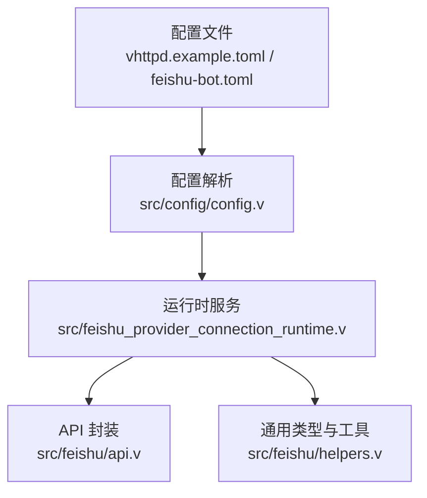
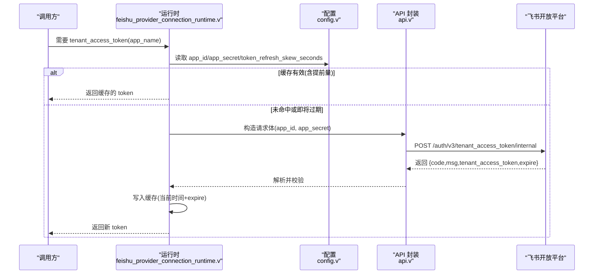
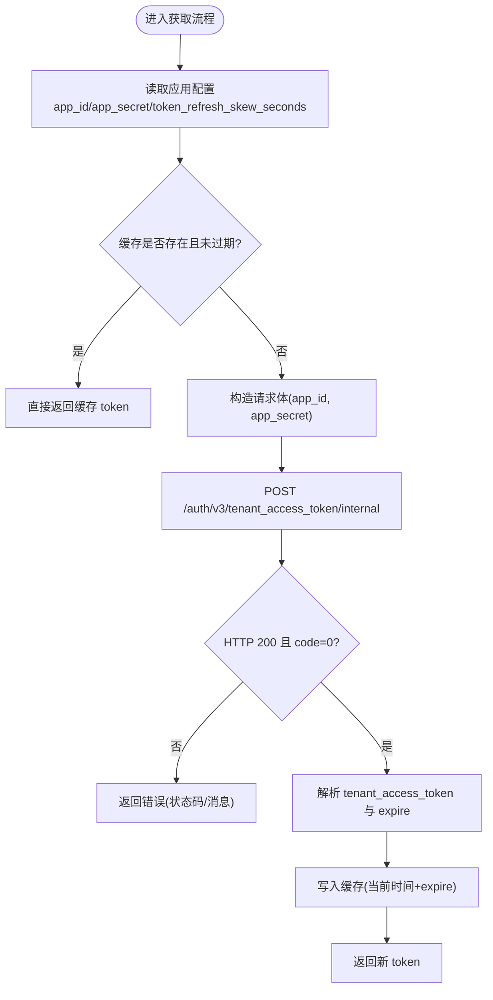
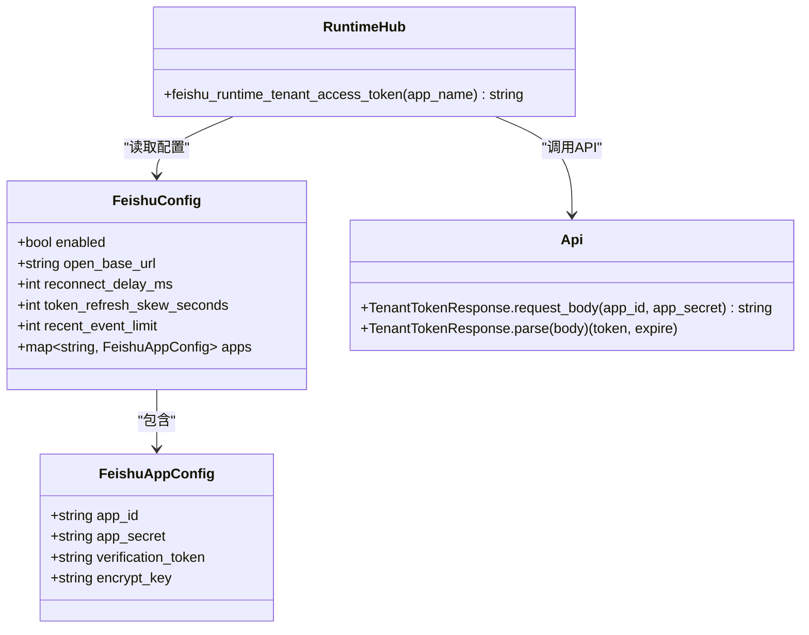

# 认证配置

<cite>
**本文引用的文件**
- [config/vhttpd.example.toml](file://config/vhttpd.example.toml)
- [examples/config/feishu-bot.toml](file://examples/config/feishu-bot.toml)
- [src/config/config.v](file://src/config/config.v)
- [src/feishu_provider_connection_runtime.v](file://src/feishu_provider_connection_runtime.v)
- [src/feishu/api.v](file://src/feishu/api.v)
- [src/feishu/helpers.v](file://src/feishu/helpers.v)
- [articles/07-feishu-bot.md](file://articles/07-feishu-bot.md)
</cite>

## 目录
1. [简介](#简介)
2. [项目结构](#项目结构)
3. [核心组件](#核心组件)
4. [架构总览](#架构总览)
5. [详细组件分析](#详细组件分析)
6. [依赖关系分析](#依赖关系分析)
7. [性能与刷新策略](#性能与刷新策略)
8. [故障排查指南](#故障排查指南)
9. [结论](#结论)
10. [附录：配置示例](#附录配置示例)

## 简介
本文件面向在 vhttpd 中启用飞书机器人能力的用户，聚焦“认证配置”的完整说明。内容涵盖：
- App ID、App Secret、Verification Token 的配置方法与获取步骤
- tenant_access_token 的自动刷新机制与 token_refresh_skew_seconds 的作用
- 多应用配置支持（静态配置）
- 不同环境下的认证配置方式
- 常见错误码与处理方法
- 调试技巧

## 项目结构
与认证相关的关键位置包括：
- 配置文件示例：根级示例与单应用示例
- 配置解析：FeishuConfig 与 FeishuAppConfig 的定义与解析逻辑
- 运行时：tenant_access_token 的获取、缓存与刷新
- API 封装：租户令牌请求体构建与响应解析

图表来源
- [config/vhttpd.example.toml:49-66](file://config/vhttpd.example.toml#L49-L66)
- [examples/config/feishu-bot.toml:28-39](file://examples/config/feishu-bot.toml#L28-L39)
- [src/config/config.v:181-214](file://src/config/config.v#L181-L214)
- [src/feishu_provider_connection_runtime.v:76-105](file://src/feishu_provider_connection_runtime.v#L76-L105)
- [src/feishu/api.v:164-189](file://src/feishu/api.v#L164-L189)
- [src/feishu/helpers.v:33-39](file://src/feishu/helpers.v#L33-L39)

章节来源
- [config/vhttpd.example.toml:49-66](file://config/vhttpd.example.toml#L49-L66)
- [examples/config/feishu-bot.toml:28-39](file://examples/config/feishu-bot.toml#L28-L39)
- [src/config/config.v:181-214](file://src/config/config.v#L181-L214)

## 核心组件
- 全局飞书配置项
  - enabled：是否启用飞书集成
  - open_base_url：开放平台基础地址
  - reconnect_delay_ms：重连延迟
  - token_refresh_skew_seconds：token 刷新提前量（秒）
  - recent_event_limit：最近事件拉取数量
- 应用级配置（每个 app_name 对应一个子段）
  - app_id：应用标识
  - app_secret：应用密钥
  - verification_token：事件回调验证令牌
  - encrypt_key：可选的事件加密密钥

上述字段定义与默认值位于配置结构体中，并在加载时从 TOML 解析到内存对象。

章节来源
- [src/config/config.v:181-214](file://src/config/config.v#L181-L214)
- [src/config/config.v:504-546](file://src/config/config.v#L504-L546)

## 架构总览
下图展示了从配置到运行时获取 tenant_access_token 的端到端流程。

图表来源
- [src/feishu_provider_connection_runtime.v:76-105](file://src/feishu_provider_connection_runtime.v#L76-L105)
- [src/feishu/api.v:164-189](file://src/feishu/api.v#L164-L189)
- [src/config/config.v:181-214](file://src/config/config.v#L181-L214)

## 详细组件分析

### 配置结构与解析
- 全局配置 FeishuConfig 包含开关、基础 URL、重连延迟、token 刷新提前量等
- 应用配置 FeishuAppConfig 包含 app_id、app_secret、verification_token、encrypt_key
- 解析器会扫描 [feishu] 下所有子段，将每个子段视为一个应用实例，并聚合为 map[string]FeishuAppConfig

要点
- 若 [feishu] 顶层存在 app_id/app_secret 等字段，会作为默认应用 main 使用
- 每个子段可独立配置凭证，实现多应用隔离

章节来源
- [src/config/config.v:181-214](file://src/config/config.v#L181-L214)
- [src/config/config.v:504-546](file://src/config/config.v#L504-L546)

### tenant_access_token 自动刷新机制
- 首次或过期时，通过 HTTP 调用开放平台接口获取
- 返回 expire 表示有效期（秒），运行时将其转换为绝对过期时间戳并缓存
- 每次获取前检查：当前时间 + token_refresh_skew_seconds < 过期时间则复用缓存，否则刷新
- 刷新失败时返回错误，由上层处理重试或告警

图表来源
- [src/feishu_provider_connection_runtime.v:76-105](file://src/feishu_provider_connection_runtime.v#L76-L105)
- [src/feishu/api.v:164-189](file://src/feishu/api.v#L164-L189)

章节来源
- [src/feishu_provider_connection_runtime.v:76-105](file://src/feishu_provider_connection_runtime.v#L76-L105)
- [src/feishu/api.v:164-189](file://src/feishu/api.v#L164-L189)

### 多应用配置支持（静态配置）
- 在 [feishu] 下定义多个子段，如 [feishu.main]、[feishu.openclaw] 等
- 每个子段拥有独立的 app_id、app_secret、verification_token、encrypt_key
- 运行时根据 app_name 选择对应配置进行 token 获取与缓存

章节来源
- [config/vhttpd.example.toml:56-66](file://config/vhttpd.example.toml#L56-L66)
- [src/config/config.v:504-546](file://src/config/config.v#L504-L546)

### Verification Token 与加密
- verification_token：用于事件回调 URL 验证
- encrypt_key：可选，用于事件载荷解密与签名校验
- 当开启加密时，需正确设置 encrypt_key，以便服务端完成解密与签名校验

章节来源
- [src/config/config.v:208-214](file://src/config/config.v#L208-L214)
- [src/feishu/helpers.v:469-516](file://src/feishu/helpers.v#L469-L516)

## 依赖关系分析
- 配置层：config.v 负责解析 TOML 到内存结构
- 运行层：feishu_provider_connection_runtime.v 负责 token 生命周期管理
- API 层：api.v 提供请求体构建与响应解析
- 工具层：helpers.v 提供通用数据结构与协议常量

图表来源
- [src/config/config.v:181-214](file://src/config/config.v#L181-L214)
- [src/feishu_provider_connection_runtime.v:76-105](file://src/feishu_provider_connection_runtime.v#L76-L105)
- [src/feishu/api.v:164-189](file://src/feishu/api.v#L164-L189)

章节来源
- [src/config/config.v:181-214](file://src/config/config.v#L181-L214)
- [src/feishu_provider_connection_runtime.v:76-105](file://src/feishu_provider_connection_runtime.v#L76-L105)
- [src/feishu/api.v:164-189](file://src/feishu/api.v#L164-L189)

## 性能与刷新策略
- token_refresh_skew_seconds 的作用
  - 避免在 token 临近过期时频繁刷新
  - 当当前时间 + skew < 过期时间时，直接复用缓存
  - 建议值：通常 60 秒即可；网络不稳定或高并发场景可适当增大
- 缓存粒度
  - 按应用名隔离缓存，避免跨应用互相影响
- 刷新时机
  - 仅在缓存缺失或即将过期时发起网络请求
  - 刷新失败时返回错误，由上层决定重试策略

章节来源
- [src/feishu_provider_connection_runtime.v:76-105](file://src/feishu_provider_connection_runtime.v#L76-L105)
- [config/vhttpd.example.toml:52-53](file://config/vhttpd.example.toml#L52-L53)
- [examples/config/feishu-bot.toml:31-32](file://examples/config/feishu-bot.toml#L31-L32)

## 故障排查指南
常见问题与定位方法：
- HTTP 非 200
  - 现象：获取 token 返回状态码异常
  - 处理：检查 open_base_url 是否正确、网络连通性、防火墙策略
- 返回 code != 0
  - 现象：响应体中包含错误码与消息
  - 处理：核对 app_id/app_secret 是否正确、应用是否启用机器人能力、权限是否开通
- 缺少必要字段
  - 现象：请求体缺少 app_id 或 app_secret
  - 处理：确认配置文件中对应字段已设置，或通过环境变量注入
- 事件回调验证失败
  - 现象：URL 验证或加密校验不通过
  - 处理：检查 verification_token 与 encrypt_key 是否与开放平台一致；注意签名与时间戳

参考日志与错误信息路径：
- 获取 token 失败的状态码与消息
- 解析响应失败时的错误提示

章节来源
- [src/feishu_provider_connection_runtime.v:97-100](file://src/feishu_provider_connection_runtime.v#L97-L100)
- [src/feishu/api.v:178-185](file://src/feishu/api.v#L178-L185)
- [src/feishu/helpers.v:469-516](file://src/feishu/helpers.v#L469-L516)

## 结论
- 通过 [feishu] 与 [feishu.<app_name>] 两段式配置，可实现多应用隔离的认证配置
- tenant_access_token 具备自动刷新与提前量机制，兼顾可用性与性能
- 合理设置 token_refresh_skew_seconds 可减少不必要的刷新开销
- 遇到认证问题时，优先检查凭证、权限与网络，再结合日志定位具体错误码

## 附录：配置示例

- 全局示例（多应用）
  - 参考路径：[config/vhttpd.example.toml](file://config/vhttpd.example.toml)
  - 关键段落：[feishu:49-54](file://config/vhttpd.example.toml#L49-L54)、[feishu.main:56-60](file://config/vhttpd.example.toml#L56-L60)、[feishu.openclaw:62-66](file://config/vhttpd.example.toml#L62-L66)

- 单应用示例（快速启动）
  - 参考路径：[examples/config/feishu-bot.toml](file://examples/config/feishu-bot.toml)
  - 关键段落：[feishu:28-33](file://examples/config/feishu-bot.toml#L28-L33)、[feishu.main:35-39](file://examples/config/feishu-bot.toml#L35-L39)

- 环境变量注入
  - 示例中使用 ${env.FEISHU_APP_ID:-} 等形式注入凭证，便于在不同环境切换
  - 参考：[config/vhttpd.example.toml:57-60](file://config/vhttpd.example.toml#L57-L60)

- 文档指引
  - 创建应用与获取凭证的步骤参见文章：[articles/07-feishu-bot.md](file://articles/07-feishu-bot.md)

章节来源
- [config/vhttpd.example.toml:49-66](file://config/vhttpd.example.toml#L49-L66)
- [examples/config/feishu-bot.toml:28-39](file://examples/config/feishu-bot.toml#L28-L39)
- [articles/07-feishu-bot.md:50-111](file://articles/07-feishu-bot.md#L50-L111)