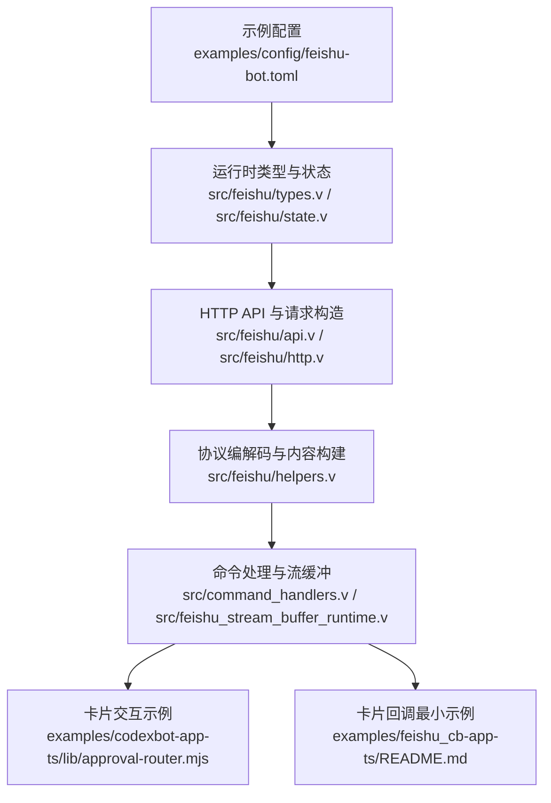
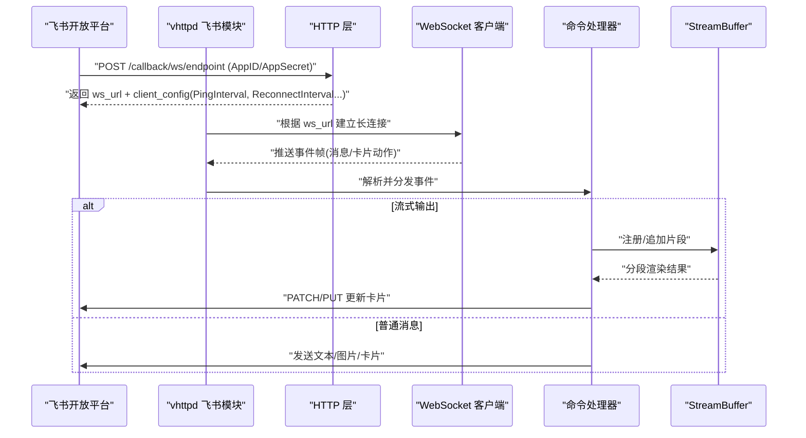
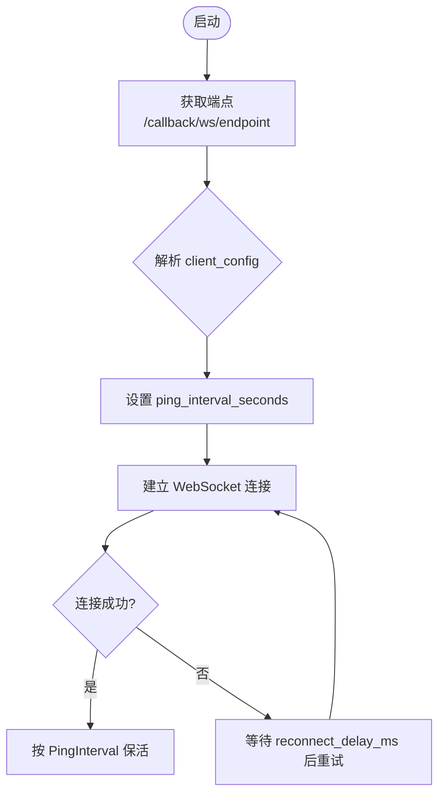
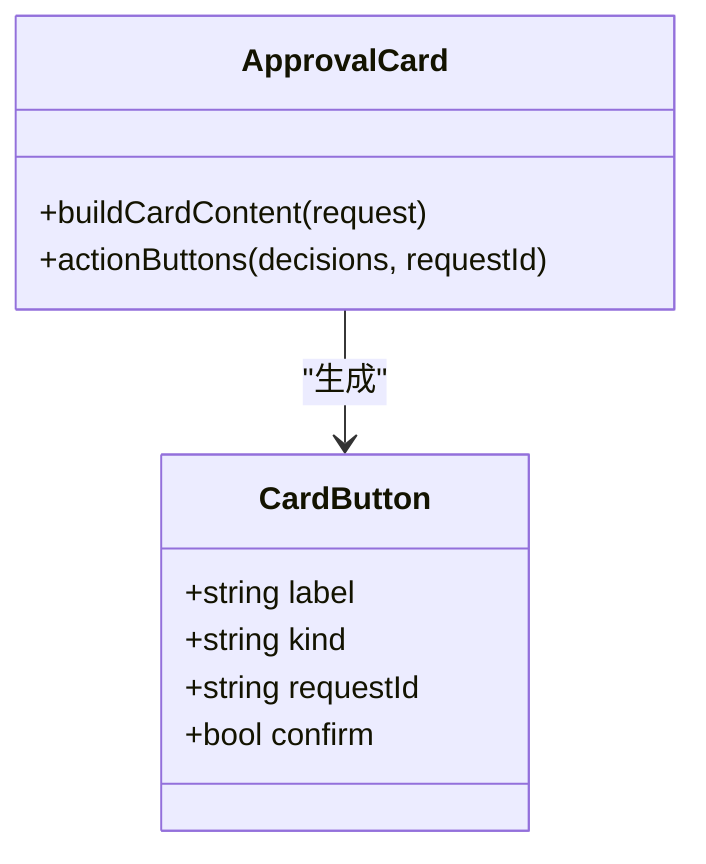
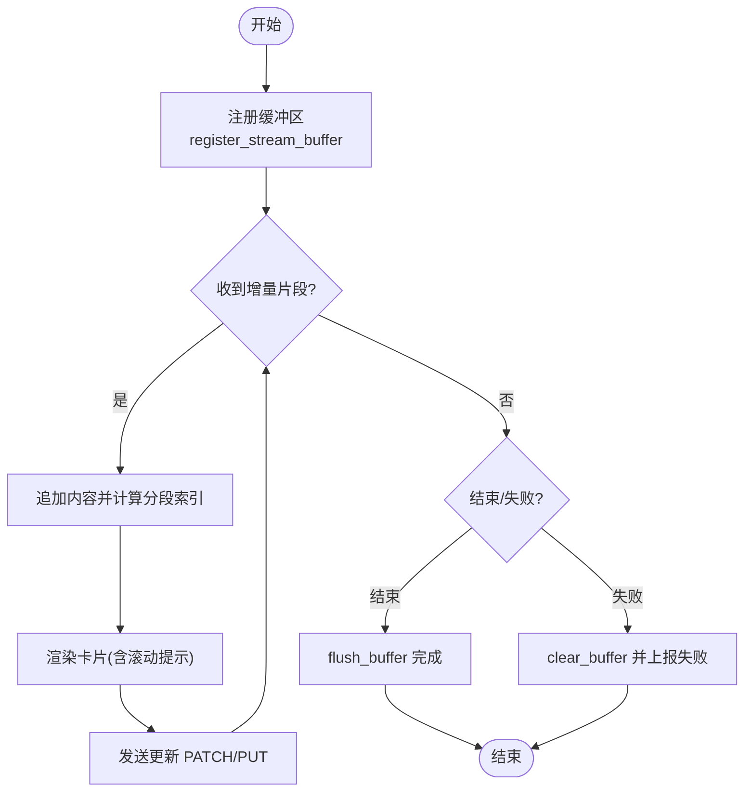
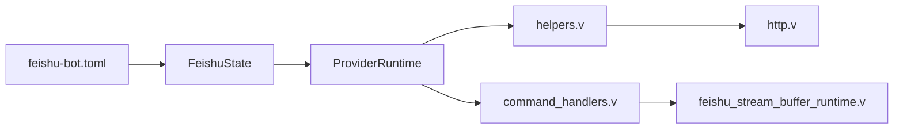

# 飞书机器人集成配置

<cite>
**本文引用的文件**   
- [examples/config/feishu-bot.toml](file://examples/config/feishu-bot.toml)
- [README.md](file://README.md)
- [src/feishu/types.v](file://src/feishu/types.v)
- [src/feishu/state.v](file://src/feishu/state.v)
- [src/feishu/api.v](file://src/feishu/api.v)
- [src/feishu/http.v](file://src/feishu/http.v)
- [src/feishu/helpers.v](file://src/feishu/helpers.v)
- [src/command_handlers.v](file://src/command_handlers.v)
- [src/feishu_stream_buffer_runtime.v](file://src/feishu_stream_buffer_runtime.v)
- [articles/07-feishu-bot.md](file://articles/07-feishu-bot.md)
- [examples/codexbot-app-ts/lib/approval-router.mjs](file://examples/codexbot-app-ts/lib/approval-router.mjs)
- [examples/feishu_cb-app-ts/README.md](file://examples/feishu_cb-app-ts/README.md)
</cite>

## 目录
1. [简介](#简介)
2. [项目结构](#项目结构)
3. [核心组件](#核心组件)
4. [架构总览](#架构总览)
5. [详细组件分析](#详细组件分析)
6. [依赖关系分析](#依赖关系分析)
7. [性能考虑](#性能考虑)
8. [故障排查指南](#故障排查指南)
9. [结论](#结论)
10. [附录](#附录)

## 简介
本文件面向需要在 vhttpd 中集成飞书机器人的开发者与运维人员，提供从应用认证、WebSocket 长连接、消息路由、卡片交互到流式响应与错误处理的完整配置说明。文档同时给出可运行的配置文件示例路径与常见问题定位方法，帮助快速落地生产环境。

## 项目结构
围绕飞书集成的关键位置：
- 示例配置：examples/config/feishu-bot.toml
- 运行时类型与状态：src/feishu/types.v、src/feishu/state.v
- HTTP API 与请求构造：src/feishu/api.v、src/feishu/http.v
- 协议编解码与内容构建：src/feishu/helpers.v
- 命令处理与流缓冲：src/command_handlers.v、src/feishu_stream_buffer_runtime.v
- 文章与示例：articles/07-feishu-bot.md、examples/feishu_cb-app-ts/README.md、examples/codexbot-app-ts/lib/approval-router.mjs

**图示来源** 
- [examples/config/feishu-bot.toml:1-40](file://examples/config/feishu-bot.toml#L1-L40)
- [src/feishu/types.v:1-385](file://src/feishu/types.v#L1-L385)
- [src/feishu/state.v:1-357](file://src/feishu/state.v#L1-L357)
- [src/feishu/api.v:1-190](file://src/feishu/api.v#L1-L190)
- [src/feishu/http.v:1-196](file://src/feishu/http.v#L1-L196)
- [src/feishu/helpers.v:1-800](file://src/feishu/helpers.v#L1-L800)
- [src/command_handlers.v:209-257](file://src/command_handlers.v#L209-L257)
- [src/feishu_stream_buffer_runtime.v:1-48](file://src/feishu_stream_buffer_runtime.v#L1-L48)
- [examples/codexbot-app-ts/lib/approval-router.mjs:154-213](file://examples/codexbot-app-ts/lib/approval-router.mjs#L154-L213)
- [examples/feishu_cb-app-ts/README.md:1-35](file://examples/feishu_cb-app-ts/README.md#L1-L35)

**章节来源**
- [examples/config/feishu-bot.toml:1-40](file://examples/config/feishu-bot.toml#L1-L40)
- [README.md:437-517](file://README.md#L437-L517)

## 核心组件
- 应用认证与多实例
  - 通过 TOML 的 [feishu] 与 [feishu.<app>] 定义多个应用实例，支持环境变量注入 App ID、App Secret、Verification Token 等。
- WebSocket 长连接
  - 运行时维护 ProviderRuntime，记录 ws_url、ping_interval_seconds、连接时间戳、最近事件等；支持客户端下发的 ping 间隔覆盖。
- 消息发送与更新
  - 统一封装发送/更新/图片上传接口，自动选择 message_id 或 token 模式，并生成对应 URL、方法与载荷。
- 卡片交互
  - 支持审批类卡片按钮、确认弹窗、action 事件桥接与本地转发。
- 流式响应
  - 基于 StreamBuffer 对增量内容进行分段渲染与追加更新，支持滚动段提示与失败回退。

**章节来源**
- [src/feishu/types.v:89-214](file://src/feishu/types.v#L89-L214)
- [src/feishu/state.v:9-100](file://src/feishu/state.v#L9-L100)
- [src/feishu/api.v:1-116](file://src/feishu/api.v#L1-L116)
- [src/feishu/helpers.v:238-379](file://src/feishu/helpers.v#L238-L379)
- [examples/codexbot-app-ts/lib/approval-router.mjs:154-213](file://examples/codexbot-app-ts/lib/approval-router.mjs#L154-L213)
- [src/feishu_stream_buffer_runtime.v:1-48](file://src/feishu_stream_buffer_runtime.v#L1-L48)

## 架构总览
vhttpd 将飞书作为“上游提供者”接入，使用 HTTP 获取端点与令牌，建立 WebSocket 长连接接收事件，并通过内部命令管道驱动业务逻辑（包括卡片交互与流式更新）。

**图示来源** 
- [src/feishu/helpers.v:402-432](file://src/feishu/helpers.v#L402-L432)
- [src/feishu/types.v:36-57](file://src/feishu/types.v#L36-L57)
- [src/feishu/state.v:78-88](file://src/feishu/state.v#L78-L88)
- [src/command_handlers.v:209-257](file://src/command_handlers.v#L209-L257)
- [src/feishu_stream_buffer_runtime.v:1-48](file://src/feishu_stream_buffer_runtime.v#L1-L48)

## 详细组件分析

### 认证与多实例配置
- 全局开关与基础参数
  - enabled：是否启用飞书集成
  - open_base_url：飞书开放 API 根地址
  - reconnect_delay_ms：重连延迟
  - token_refresh_skew_seconds：令牌刷新提前量
  - recent_event_limit：最近事件快照长度
- 应用实例
  - [feishu.main] 下设置 app_id、app_secret、verification_token、encrypt_key
  - 支持多实例命名，如 main、openclaw 等
- 环境变量注入
  - 使用 ${env.FEISHU_APP_ID:-} 等形式在 TOML 中引用环境变量

参考示例路径：[examples/config/feishu-bot.toml](file://examples/config/feishu-bot.toml)

**章节来源**
- [examples/config/feishu-bot.toml:28-40](file://examples/config/feishu-bot.toml#L28-L40)
- [README.md:503-517](file://README.md#L503-L517)
- [src/feishu/types.v:333-385](file://src/feishu/types.v#L333-L385)

### WebSocket 连接配置
- 端点获取
  - 调用 /callback/ws/endpoint，传入 AppID/AppSecret，返回 ws_url 与 client_config（含 PingInterval、ReconnectInterval、ReconnectCount）
- 心跳与重连
  - 运行时根据 client_config 动态调整 ping_interval_seconds
  - 断开后按 reconnect_delay_ms 进行指数退避式重试
- 连接状态监控
  - ProviderRuntime 暴露 connected、ws_url、last_connect_at_unix、last_disconnect_at_unix、last_error 等字段

**图示来源** 
- [src/feishu/helpers.v:402-432](file://src/feishu/helpers.v#L402-L432)
- [src/feishu/types.v:36-57](file://src/feishu/types.v#L36-L57)
- [src/feishu/state.v:78-88](file://src/feishu/state.v#L78-L88)

**章节来源**
- [src/feishu/types.v:89-199](file://src/feishu/types.v#L89-L199)
- [src/feishu/state.v:9-100](file://src/feishu/state.v#L9-L100)

### 消息路由与权限控制
- 事件订阅
  - 当前长连接用于事件订阅（例如 im.message.receive_v1），卡片互动回调走独立 HTTP 入口
- 消息类型过滤
  - 在应用侧路由器中按 message_type 与文本内容做分流处理
- 用户权限控制
  - 可在命令路由器中结合 sender/open_id 与租户 key 做鉴权与上下文加载

参考实现路径：
- 事件路由与命令分发：[articles/07-feishu-bot.md](file://articles/07-feishu-bot.md)
- 命令路由器示例：[articles/09-codexbot.md](file://articles/09-codexbot.md)

**章节来源**
- [README.md:692-706](file://README.md#L692-L706)
- [articles/07-feishu-bot.md:228-275](file://articles/07-feishu-bot.md#L228-L275)
- [articles/09-codexbot.md:185-315](file://articles/09-codexbot.md#L185-L315)

### 卡片交互配置
- 卡片模板
  - 支持 markdown 元素、note 分段提示、action 按钮组
- 按钮事件处理
  - 审批类卡片包含 accept/decline 等决策按钮，支持二次确认
- 表单提交
  - 通过 card.action.trigger 事件进入桥接通道，交由宿主桥能力转发至本地或远端服务

参考示例路径：
- 审批卡片按钮与确认弹窗：[examples/codexbot-app-ts/lib/approval-router.mjs](file://examples/codexbot-app-ts/lib/approval-router.mjs)
- 卡片回调最小示例与桥接说明：[examples/feishu_cb-app-ts/README.md](file://examples/feishu_cb-app-ts/README.md)

**图示来源** 
- [examples/codexbot-app-ts/lib/approval-router.mjs:154-213](file://examples/codexbot-app-ts/lib/approval-router.mjs#L154-L213)

**章节来源**
- [examples/codexbot-app-ts/lib/approval-router.mjs:154-213](file://examples/codexbot-app-ts/lib/approval-router.mjs#L154-L213)
- [examples/feishu_cb-app-ts/README.md:1-35](file://examples/feishu_cb-app-ts/README.md#L1-L35)

### 流式响应配置
- StreamBuffer 设置
  - register_stream_buffer：注册消息级缓冲区，关联 stream_id、receive_id 等
  - 追加片段：按 segment_index 分段渲染，超过阈值触发滚动提示
  - 完成/失败：flush_buffer 或 fail 时清理链式缓冲区并更新消息
- 增量更新策略
  - 非 interactive 类型自动包装为交互式卡片以承载增量内容
  - 支持延迟更新（token 模式）与即时更新（message_id 模式）

**图示来源** 
- [src/feishu/state.v:150-230](file://src/feishu/state.v#L150-L230)
- [src/feishu_stream_buffer_runtime.v:1-48](file://src/feishu_stream_buffer_runtime.v#L1-L48)
- [src/command_handlers.v:209-257](file://src/command_handlers.v#L209-L257)
- [src/feishu/helpers.v:138-160](file://src/feishu/helpers.v#L138-L160)

**章节来源**
- [src/feishu/state.v:150-230](file://src/feishu/state.v#L150-L230)
- [src/feishu_stream_buffer_runtime.v:1-48](file://src/feishu_stream_buffer_runtime.v#L1-L48)
- [src/command_handlers.v:209-257](file://src/command_handlers.v#L209-L257)
- [src/feishu/helpers.v:138-160](file://src/feishu/helpers.v#L138-L160)

### 错误处理与监控
- 重连机制
  - 基于 reconnect_delay_ms 与客户端 ReconnectInterval 协同工作
- 令牌刷新
  - 使用 tenant_access_token 并在过期前按 skew 提前刷新
- 连接状态监控
  - 通过 ProviderRuntime 快照查看连接次数、成功次数、最近错误、最近事件等
  - 提供 Admin 接口查询上游连接与事件

**章节来源**
- [src/feishu/types.v:89-214](file://src/feishu/types.v#L89-L214)
- [src/feishu/state.v:254-357](file://src/feishu/state.v#L254-L357)
- [README.md:674-706](file://README.md#L674-L706)

## 依赖关系分析
- 配置到运行时
  - feishu-bot.toml → FeishuState → ProviderRuntime
- 运行时到网络
  - ProviderRuntime → helpers（端点 URL 构建）→ http.fetch（HTTP 层）
- 运行时到命令
  - 事件到达 → command_handlers → StreamBuffer → 更新/发送

**图示来源** 
- [examples/config/feishu-bot.toml:1-40](file://examples/config/feishu-bot.toml#L1-L40)
- [src/feishu/types.v:333-385](file://src/feishu/types.v#L333-L385)
- [src/feishu/state.v:1-100](file://src/feishu/state.v#L1-L100)
- [src/feishu/helpers.v:402-432](file://src/feishu/helpers.v#L402-L432)
- [src/feishu/http.v:107-165](file://src/feishu/http.v#L107-L165)
- [src/command_handlers.v:209-257](file://src/command_handlers.v#L209-L257)
- [src/feishu_stream_buffer_runtime.v:1-48](file://src/feishu_stream_buffer_runtime.v#L1-L48)

**章节来源**
- [src/feishu/types.v:333-385](file://src/feishu/types.v#L333-L385)
- [src/feishu/state.v:1-100](file://src/feishu/state.v#L1-L100)
- [src/feishu/helpers.v:402-432](file://src/feishu/helpers.v#L402-L432)
- [src/feishu/http.v:107-165](file://src/feishu/http.v#L107-L165)
- [src/command_handlers.v:209-257](file://src/command_handlers.v#L209-L257)
- [src/feishu_stream_buffer_runtime.v:1-48](file://src/feishu_stream_buffer_runtime.v#L1-L48)

## 性能考虑
- 合理设置 reconnect_delay_ms 与 token_refresh_skew_seconds，避免频繁重连与令牌抖动
- 控制 recent_event_limit，平衡调试需求与内存占用
- 流式输出采用分段渲染与滚动提示，减少单次更新体积
- 使用 interactive 卡片承载增量内容，提升用户体验与渲染效率

## 故障排查指南
- 无法建立 WebSocket 连接
  - 检查 open_base_url 是否正确，验证 /callback/ws/endpoint 返回的 ws_url 与 client_config
  - 查看 ProviderRuntime.last_error 与 last_disconnect_at_unix
- 令牌无效或过期
  - 确认 App ID/Secret 正确，检查 tenant_access_token 缓存与刷新时间
- 卡片点击无响应
  - 核对 card.action.trigger 事件是否进入桥接通道，确认目标 id 与 token 配置
- 流式更新不生效
  - 确认已注册 StreamBuffer 且未过早关闭；检查 flush/fail 分支是否执行

**章节来源**
- [src/feishu/types.v:89-214](file://src/feishu/types.v#L89-L214)
- [src/feishu/state.v:254-357](file://src/feishu/state.v#L254-L357)
- [examples/feishu_cb-app-ts/README.md:1-35](file://examples/feishu_cb-app-ts/README.md#L1-L35)
- [src/command_handlers.v:209-257](file://src/command_handlers.v#L209-L257)

## 结论
通过 vhttpd 的飞书集成模块，可以在同一进程内统一管理多实例认证、WebSocket 长连接、事件路由、卡片交互与流式更新。配合完善的监控与错误处理机制，能够快速构建稳定可靠的飞书机器人服务。

## 附录

### 完整配置文件示例
- 示例路径：[examples/config/feishu-bot.toml](file://examples/config/feishu-bot.toml)
- 关键字段说明
  - [feishu].enabled、open_base_url、reconnect_delay_ms、token_refresh_skew_seconds、recent_event_limit
  - [feishu.main].app_id、app_secret、verification_token、encrypt_key

**章节来源**
- [examples/config/feishu-bot.toml:28-40](file://examples/config/feishu-bot.toml#L28-L40)
- [README.md:503-517](file://README.md#L503-L517)