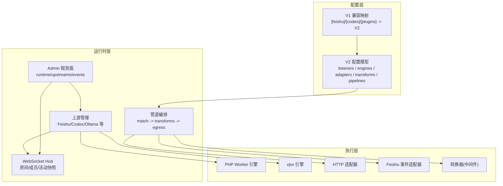
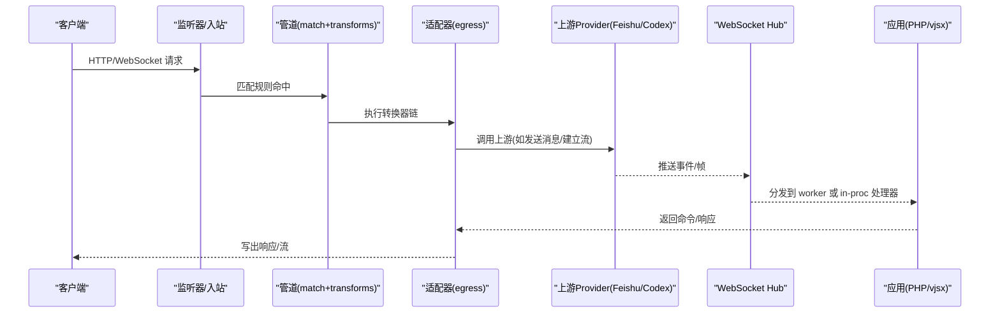
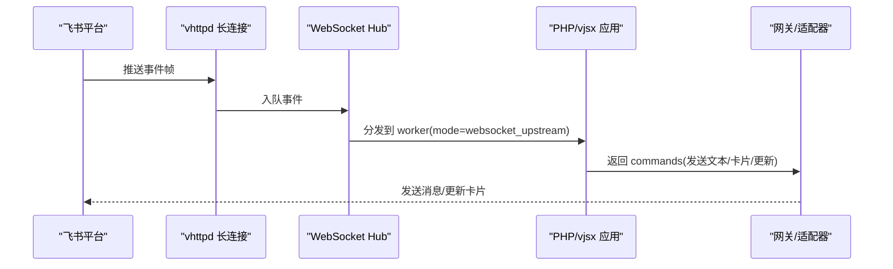
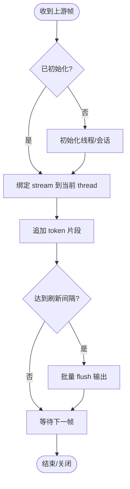
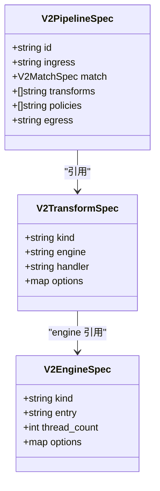
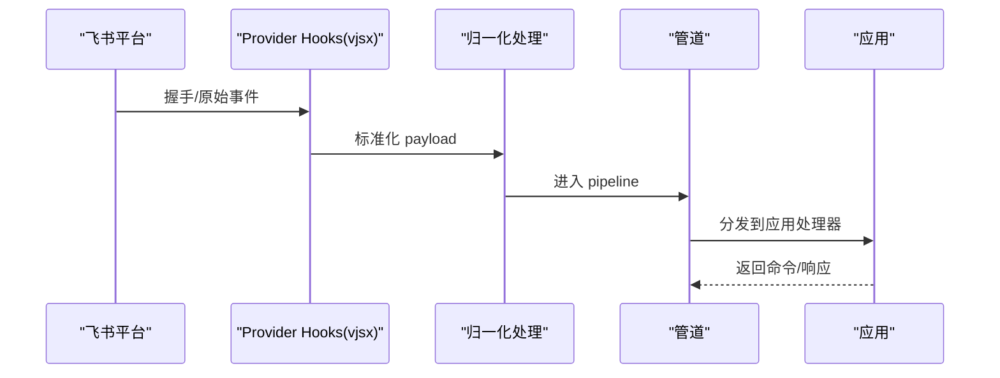
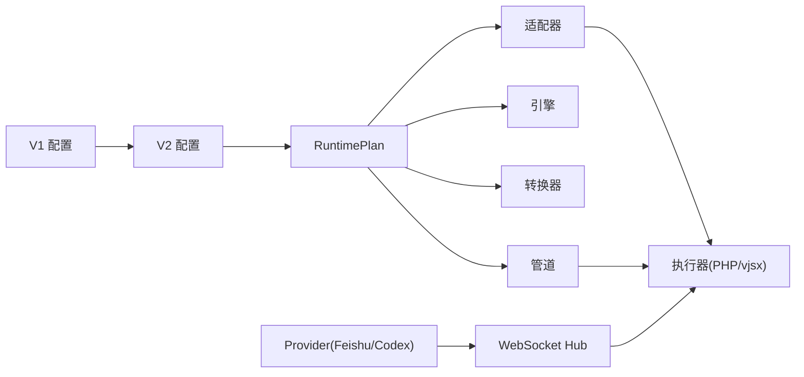

# 高级功能配置

<cite>
**本文引用的文件列表**
- [README.md](file://README.md)
- [config/vhttpd.example.toml](file://config/vhttpd.example.toml)
- [config/vhttpd.multi.example.toml](file://config/vhttpd.multi.example.toml)
- [config/vhttpd.vjsx.example.toml](file://config/vhttpd.vjsx.example.toml)
- [examples/config/feishu-bot.toml](file://examples/config/feishu-bot.toml)
- [examples/codexbot-app-ts/codexbot.toml](file://examples/codexbot-app-ts/codexbot.toml)
- [src/config/v2_config.v](file://src/config/v2_config.v)
- [src/config/runtime_plan_loader_test.v](file://src/config/runtime_plan_loader_test.v)
- [src/config/v1_plan_compat.v](file://src/config/v1_plan_compat.v)
- [src/config/runtime_config.v](file://src/config/runtime_config.v)
- [src/feishu/types.v](file://src/feishu/types.v)
- [src/websocket_upstream_provider_runtime.v](file://src/websocket_upstream_provider_runtime.v)
- [src/websocket_owner_runtime.v](file://src/websocket_owner_runtime.v)
- [src/provider_websocket_hook_runtime_test.v](file://src/provider_websocket_hook_runtime_test.v)
- [tests/e2e/config_acceptance_test.sh](file://tests/e2e/config_acceptance_test.sh)
- [articles/07-feishu-bot.md](file://articles/07-feishu-bot.md)
- [articles/09-codexbot.md](file://articles/09-codexbot.md)
- [articles/04-ai-streaming.md](file://articles/04-ai-streaming.md)
- [php/package/README.md](file://php/package/README.md)
</cite>

## 目录
1. [简介](#简介)
2. [项目结构](#项目结构)
3. [核心组件](#核心组件)
4. [架构总览](#架构总览)
5. [详细组件分析](#详细组件分析)
6. [依赖关系分析](#依赖关系分析)
7. [性能与实时通信配置](#性能与实时通信配置)
8. [故障排查指南](#故障排查指南)
9. [结论](#结论)
10. [附录：关键配置项速查](#附录关键配置项速查)

## 简介
本文件面向需要深度定制 vhttpd 的高级用户，聚焦以下能力的高级配置与实践：
- 飞书机器人集成：应用认证、消息路由、卡片交互、回调入口、长连接事件订阅
- Codex AI 服务：连接配置、流式响应、会话与线程绑定、重试与刷新策略
- 上游服务集成与插件系统：适配器、转换器、引擎、管道编排
- WebSocket/SSE 等实时通信：Hub、房间、活动快照、动态上游自动启动
- 自定义中间件与转换器：注册、选项类型、执行上下文
- 事件订阅与钩子函数：Provider 生命周期钩子、vjsx 处理器
- 复杂业务场景的组合配置模式与最佳实践

## 项目结构
vhttpd 采用“协议接入 + 运行时编排 + 可插拔执行器”的架构。TOML 配置驱动运行时计划（Runtime Plan），将监听器、引擎、适配器、转换器、策略、管道、中继和 Provider 组合起来，形成从请求到响应的完整流水线。

图表来源
- [src/config/v2_config.v:1-318](file://src/config/v2_config.v#L1-L318)
- [src/config/v1_plan_compat.v:456-502](file://src/config/v1_plan_compat.v#L456-L502)
- [src/websocket_owner_runtime.v:1-44](file://src/websocket_owner_runtime.v#L1-L44)
- [src/websocket_upstream_provider_runtime.v:1-38](file://src/websocket_upstream_provider_runtime.v#L1-L38)

章节来源
- [README.md:84-126](file://README.md#L84-L126)
- [src/config/v2_config.v:1-318](file://src/config/v2_config.v#L1-L318)

## 核心组件
- 配置模型（V2）：定义 listeners、engines、adapters、transforms、policies、providers、pipelines、relays 等，支持多类型 options（字符串、整型、布尔、列表、映射、记录）。
- 兼容层（V1->V2）：将旧版 [feishu]、[codex]、[plugins] 等映射为 V2 的 adapters/engines/transforms/pipelines。
- 运行时管线：按 match 条件匹配请求，依次执行 transforms，最终由 egress adapter 处理。
- Provider 与上游：内置 Feishu、Codex、Ollama 等 provider；通过适配器与引擎协作完成握手、事件归一化、消息发送与流式转发。
- WebSocket Hub：提供房间、成员、活动快照、动态上游自动启动等能力。
- Admin 观测面：暴露 runtime、upstreams、events、activities 等接口用于诊断与运维。

章节来源
- [src/config/v2_config.v:1-318](file://src/config/v2_config.v#L1-L318)
- [src/config/v1_plan_compat.v:456-502](file://src/config/v1_plan_compat.v#L456-L502)
- [src/websocket_owner_runtime.v:1-44](file://src/websocket_owner_runtime.v#L1-L44)
- [README.md:674-731](file://README.md#L674-L731)

## 架构总览
下图展示了典型的高阶工作流：外部客户端经由 HTTP/WebSocket 进入 vhttpd，被管道匹配并经过转换器处理后，交由对应适配器或上游 Provider 执行；同时，Provider 的长连接事件经 Hub 分发至应用侧（PHP 或 vjsx）。

图表来源
- [src/config/v2_config.v:279-318](file://src/config/v2_config.v#L279-L318)
- [src/websocket_upstream_provider_runtime.v:1-38](file://src/websocket_upstream_provider_runtime.v#L1-L38)
- [src/websocket_owner_runtime.v:1-44](file://src/websocket_owner_runtime.v#L1-L44)

## 详细组件分析

### 飞书机器人集成配置
- 应用认证与长连接
  - 全局开关与基础 URL、重连延迟、Token 刷新提前量、最近事件限制等位于全局 [feishu]。
  - 多应用实例通过 [feishu.<name>] 配置 app_id/app_secret/verification_token/encrypt_key。
  - 长连接用于事件订阅（例如 im.message.receive_v1），回调类交互走独立的 HTTP 回调入口。
- 回调入口与验证
  - 路径：POST /callbacks/feishu 与 POST /callbacks/feishu/:app
  - 支持 url_verification 挑战应答；当配置 verification_token 时进行校验。
- 消息路由与卡片交互
  - 事件经 Hub 分发到 PHP 或 vjsx 应用，应用侧解析事件类型、提取 chat_id/message_id 等上下文，组装 CommandBus 命令（发送文本/卡片、更新消息等）。
  - 卡片交互动作通过回调入口进入同一 worker 桥接通道，复用相同工具集。
- 运行态观测
  - Admin 暴露 upstreams/websocket、events、activities 以及 feishu/chats 等端点，便于发现聊天目标与调试。

章节来源
- [examples/config/feishu-bot.toml:1-40](file://examples/config/feishu-bot.toml#L1-L40)
- [README.md:674-731](file://README.md#L674-L731)
- [articles/07-feishu-bot.md:50-110](file://articles/07-feishu-bot.md#L50-L110)
- [src/feishu/types.v:333-385](file://src/feishu/types.v#L333-L385)

#### 飞书事件处理序列图

图表来源
- [README.md:799-800](file://README.md#L799-L800)
- [src/websocket_upstream_provider_runtime.v:1-38](file://src/websocket_upstream_provider_runtime.v#L1-L38)

### Codex AI 服务连接与流式响应
- 连接配置
  - 通过 [codex] 段配置 url/model/effort/cwd/approval_policy/sandbox/reconnect_delay_ms/flush_interval_ms。
  - 兼容层会将 V1 的 [codex] 映射为 V2 的 codex adapter，包含 int_options/bool_options 等。
- 流式响应与会话
  - 运行时维护 thread/stream 绑定、RPC 挂起表、错误风暴抑制与 flush 队列。
  - 支持 read fallback 机制，保障读取稳定性。
- 观察与诊断
  - Admin 暴露 config 与 runtime snapshot，包括连接状态、初始化状态、活跃 turn 数、最近错误等。

章节来源
- [examples/codexbot-app-ts/codexbot.toml:25-36](file://examples/codexbot-app-ts/codexbot.toml#L25-L36)
- [src/config/v1_plan_compat.v:456-475](file://src/config/v1_plan_compat.v#L456-L475)
- [src/codex/types.v:69-102](file://src/codex/types.v#L69-L102)
- [src/codex/types.v:244-292](file://src/codex/types.v#L244-L292)

#### Codex 流式处理流程图

图表来源
- [src/codex/types.v:192-209](file://src/codex/types.v#L192-L209)
- [src/codex/types.v:244-292](file://src/codex/types.v#L244-L292)

### 上游服务集成与插件系统
- 适配器与引擎
  - 使用 adapters 指定 kind/engine/options/int_options/bool_options/list_options/map_options/record_options。
  - engines 定义执行环境（php-worker、vjsx 等），支持 module_root/build_root/runtime_profile/thread_count 等。
- 插件系统（V1->V2）
  - [plugins] 中的每个条目会被编译为 engine + transform，handler 指向 vjsx 模块导出名。
  - 支持签名根、包含/排除、网络/进程/FS 权限控制等。
- 管道编排
  - pipelines 将 ingress/match/transforms/policies/egress 串联，实现细粒度路由与转换。

章节来源
- [src/config/v2_config.v:120-197](file://src/config/v2_config.v#L120-L197)
- [src/config/v1_plan_compat.v:477-502](file://src/config/v1_plan_compat.v#L477-L502)
- [src/config/runtime_plan_loader_test.v:263-286](file://src/config/runtime_plan_loader_test.v#L263-L286)

#### 插件与管道装配图

图表来源
- [src/config/v2_config.v:120-197](file://src/config/v2_config.v#L120-L197)
- [src/config/v2_config.v:279-318](file://src/config/v2_config.v#L279-L318)

### WebSocket/SSE 实时通信配置
- WebSocket Hub
  - 提供房间、成员、活动快照、动态上游自动启动、连接元数据等。
  - 支持 dispatch_mode 与 auto_start_dynamic_upstreams 开关。
- Provider Websocket Hook
  - 通过 providers.<id>.hooks 声明 handshake/normalize 等钩子，结合 vjsx 引擎处理握手与事件归一化。
- SSE 与流式
  - 在 veb 基础上提供 SSE 能力；AI 流式示例参考 Ollama 代理配置。

章节来源
- [src/websocket_owner_runtime.v:1-44](file://src/websocket_owner_runtime.v#L1-L44)
- [tests/e2e/config_acceptance_test.sh:1695-1753](file://tests/e2e/config_acceptance_test.sh#L1695-L1753)
- [articles/04-ai-streaming.md:318-343](file://articles/04-ai-streaming.md#L318-L343)

#### Provider 钩子与事件归一化时序

图表来源
- [tests/e2e/config_acceptance_test.sh:1716-1747](file://tests/e2e/config_acceptance_test.sh#L1716-L1747)
- [src/provider_websocket_hook_runtime_test.v:376-389](file://src/provider_websocket_hook_runtime_test.v#L376-L389)

### 自定义中间件与转换器
- 转换器（Transform）
  - 通过 transforms 定义，kind 可为 native 或 vjsx，engine 指向具体引擎，handler 为模块导出方法。
  - 支持多种 options 类型：strings/ints/bools/lists/maps/records。
- 中间件能力
  - 可在 warmup 阶段初始化资源，transform 阶段修改 exchange.headers/metadata，并决定继续或中断流水线。
- 测试用例覆盖
  - HeaderTransformer 示例展示如何注入 trace_id 与自定义头。

章节来源
- [src/dispatch/exchange_test.v:135-185](file://src/dispatch/exchange_test.v#L135-L185)
- [src/transformer_runtime_test.v:173-206](file://src/transformer_runtime_test.v#L173-L206)
- [src/config/v2_config.v:184-197](file://src/config/v2_config.v#L184-L197)

### 事件订阅与钩子函数
- Provider 生命周期钩子
  - hooks.handshake/hooks.normalize 等，配合 vjsx 引擎实现握手协商与事件归一化。
- 应用侧事件处理
  - 在 PHP 中通过 handleWebSocketUpstream 接收事件，解析 event_type/chat_id/message_id 等字段，构建命令。
- MCP 工具扩展
  - VSlim\Mcp\App 可直接注册 tool/resource，简化 initialize/tools/list/tools/call 的实现。

章节来源
- [tests/e2e/config_acceptance_test.sh:1716-1747](file://tests/e2e/config_acceptance_test.sh#L1716-L1747)
- [articles/07-feishu-bot.md:228-275](file://articles/07-feishu-bot.md#L228-L275)
- [php/package/README.md:195-258](file://php/package/README.md#L195-L258)

### 复杂业务场景的组合配置模式与最佳实践
- 多站点/多监听器
  - 使用 sites.<id> 与 listeners.<id> 组合，隔离不同站点的应用运行时与执行器选择。
- 多 Provider 实例
  - 通过 [feishu.main]/[feishu.openclaw] 等多实例配置，统一接入但独立鉴权与连接。
- 流式与长连接并存
  - 在同一进程中同时启用 HTTP 应用、Feishu 长连接与 MCP 工具，按需开启各表面。
- 安全与限流
  - 使用 policies.limits/response/security 对请求体大小、超时、必要头、CORS 等进行约束。
- 可观测性
  - 启用 observability.event_log 与 admin token，结合 /admin/runtime/upstreams/websocket/events 定位问题。

章节来源
- [config/vhttpd.multi.example.toml:554-598](file://config/vhttpd.multi.example.toml#L554-L598)
- [config/vhttpd.example.toml:503-517](file://config/vhttpd.example.toml#L503-L517)
- [README.md:733-758](file://README.md#L733-L758)
- [src/config/v2_config.v:199-259](file://src/config/v2_config.v#L199-L259)

## 依赖关系分析
- 配置到运行时
  - V2 配置编译为 RuntimePlan，确定 listener/adapter/engine/transform/pipeline 的拓扑。
  - V1 兼容层将 [feishu]/[codex]/[plugins] 映射为 V2 的 adapters/engines/transforms。
- 运行时到执行器
  - 管道将请求路由到适配器，适配器再调度到引擎（php-worker 或 vjsx）。
  - Provider 长连接事件经 Hub 分发到应用侧。
- 外部依赖
  - veb 提供 HTTP/SSE/RequestID 等基础能力；veb.sse 负责 SSE 格式化与头部。

图表来源
- [src/config/v2_config.v:1-318](file://src/config/v2_config.v#L1-L318)
- [src/config/v1_plan_compat.v:456-502](file://src/config/v1_plan_compat.v#L456-L502)
- [README.md:152-174](file://README.md#L152-L174)

章节来源
- [src/config/v2_config.v:1-318](file://src/config/v2_config.v#L1-L318)
- [src/config/v1_plan_compat.v:456-502](file://src/config/v1_plan_compat.v#L456-L502)
- [README.md:152-174](file://README.md#L152-L174)

## 性能与实时通信配置
- 流式优化
  - Codex flush_interval_ms 控制批量刷新频率；reconnect_delay_ms 控制重连退避。
  - 上游 Provider 的 reconnect_delay_ms 与 token_refresh_skew_seconds 影响长连接稳定性。
- 并发与队列
  - engines 的 pool_size/thread_count/queue_capacity/queue_timeout_ms 控制并发与背压。
  - policies.concurrency 支持 max_in_flight、affinity/actor 等高级特性。
- 观测与诊断
  - observability.event_log 与 admin token 配合 /admin/runtime/upstreams/websocket/events 快速定位丢帧/重连/错误。

章节来源
- [examples/codexbot-app-ts/codexbot.toml:25-36](file://examples/codexbot-app-ts/codexbot.toml#L25-L36)
- [examples/config/feishu-bot.toml:28-39](file://examples/config/feishu-bot.toml#L28-L39)
- [src/config/v2_config.v:120-155](file://src/config/v2_config.v#L120-L155)
- [src/config/v2_config.v:243-259](file://src/config/v2_config.v#L243-L259)
- [README.md:674-731](file://README.md#L674-L731)

## 故障排查指南
- 常见问题
  - 飞书回调未生效：检查 verification_token 是否配置，确认 /callbacks/feishu 路径可达且未被反向代理拦截。
  - 长连接频繁断开：调整 reconnect_delay_ms 与 token_refresh_skew_seconds，查看 last_error 与 connect_attempts。
  - Codex 无输出：检查 flush_interval_ms 与 model/effort 配置，关注 initialized 与 active_stream_id。
- 诊断手段
  - 使用 /admin/runtime/upstreams/websocket/events 拉取最近事件，核对 event_type/target/message_id。
  - 使用 /admin/runtime/feishu/chats 获取 chat_id，确保后续发送目标正确。
  - 观察 event_log 中的 pipeline 与 source 字段，确认事件流经的管道与处理器。

章节来源
- [README.md:674-731](file://README.md#L674-L731)
- [src/feishu/types.v:237-296](file://src/feishu/types.v#L237-L296)
- [src/codex/types.v:50-65](file://src/codex/types.v#L50-L65)
- [src/provider_websocket_hook_runtime_test.v:376-389](file://src/provider_websocket_hook_runtime_test.v#L376-L389)

## 结论
vhttpd 通过 V2 配置模型与兼容层，将传统 TOML 配置升级为可编程的运行时计划，使飞书机器人、Codex AI、WebSocket/SSE 等高级能力得以灵活组合。借助适配器、转换器与管道的编排，以及 Provider 钩子与 Hub 的事件分发，开发者可以在单一进程中实现复杂的实时业务场景。建议在生产环境中结合观测面与策略配置，持续优化流式吞吐与连接稳定性。

## 附录：关键配置项速查
- 飞书
  - [feishu].enabled/open_base_url/reconnect_delay_ms/token_refresh_skew_seconds/recent_event_limit
  - [feishu.<name>].app_id/app_secret/verification_token/encrypt_key
- Codex
  - [codex].enabled/url/model/effort/cwd/approval_policy/sandbox/reconnect_delay_ms/flush_interval_ms
- 引擎与管道
  - engines.kind/entry/module_root/build_root/runtime_profile/thread_count
  - transforms.kind/engine/handler/options/int_options/bool_options/list_options/map_options/record_options
  - pipelines.match.paths/methods/headers/query; transforms 列表; egress.adapter
- 实时通信
  - providers.<id>.runtime.driver/protocol/plugin/engine
  - providers.<id>.hooks.handshake/normalize
  - observability.event_log/admin.token

章节来源
- [examples/config/feishu-bot.toml:28-39](file://examples/config/feishu-bot.toml#L28-L39)
- [examples/codexbot-app-ts/codexbot.toml:25-36](file://examples/codexbot-app-ts/codexbot.toml#L25-L36)
- [src/config/v2_config.v:120-197](file://src/config/v2_config.v#L120-L197)
- [src/config/v2_config.v:279-318](file://src/config/v2_config.v#L279-L318)
- [tests/e2e/config_acceptance_test.sh:1716-1747](file://tests/e2e/config_acceptance_test.sh#L1716-L1747)