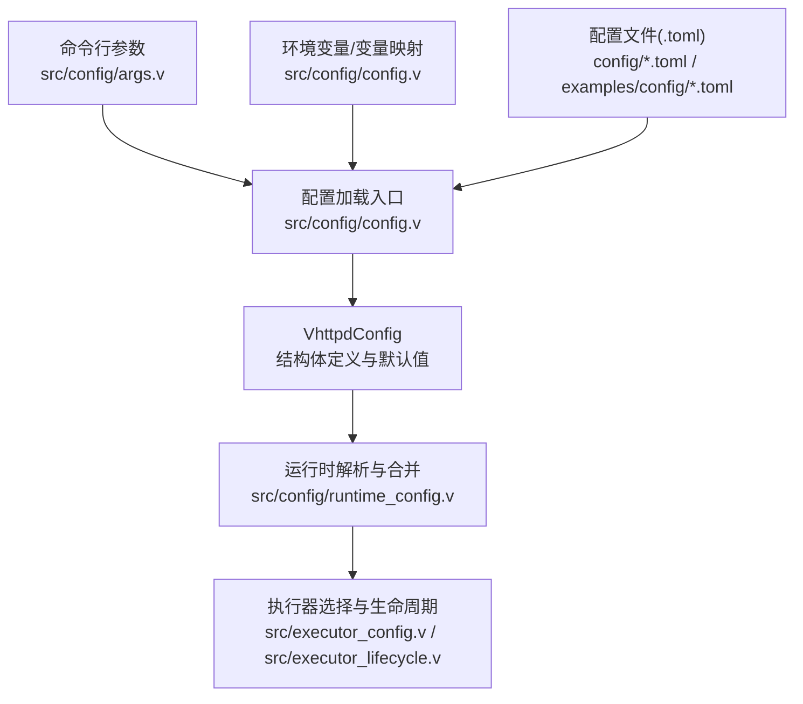
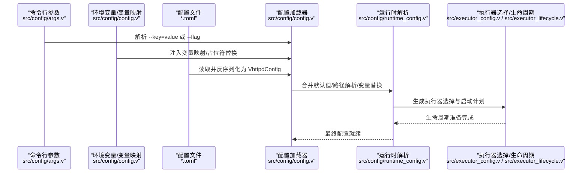
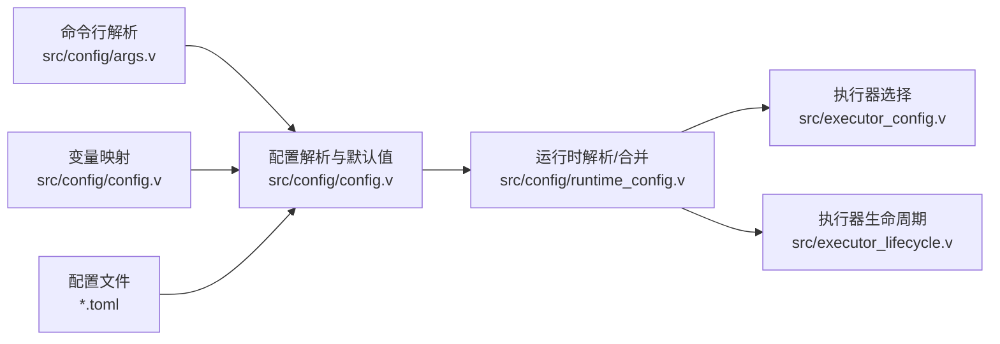

# 全局配置

<cite>
**本文引用的文件**
- [src/config/config.v](file://src/config/config.v)
- [src/config/args.v](file://src/config/args.v)
- [src/config/runtime_config.v](file://src/config/runtime_config.v)
- [src/executor_config.v](file://src/executor_config.v)
- [src/executor_lifecycle.v](file://src/executor_lifecycle.v)
- [config/vhttpd.example.toml](file://config/vhttpd.example.toml)
- [config/vhttpd.multi.example.toml](file://config/vhttpd.multi.example.toml)
- [config/vhttpd.vjsx.example.toml](file://config/vhttpd.vjsx.example.toml)
- [examples/config/hello.toml](file://examples/config/hello.toml)
- [examples/config/laravel.toml](file://examples/config/laravel.toml)
- [examples/config/symfony.toml](file://examples/config/symfony.toml)
- [examples/config/ai-stream.toml](file://examples/config/ai-stream.toml)
- [examples/config/openai-gateway.toml](file://examples/config/openai-gateway.toml)
- [examples/config/ollama-proxy.toml](file://examples/config/ollama-proxy.toml)
- [examples/config/feishu-bot.toml](file://examples/config/feishu-bot.toml)
- [examples/config/mcp.toml](file://examples/config/mcp.toml)
- [examples/config/stream-dispatch.toml](file://examples/config/stream-dispatch.toml)
- [examples/config/websocket-echo.toml](file://examples/config/websocket-echo.toml)
- [examples/config/stream-bench.toml](file://examples/config/stream-bench.toml)
- [examples/config/db-upstream.toml](file://examples/config/db-upstream.toml)
- [examples/config/db-upstream-pg.toml](file://examples/config/db-upstream-pg.toml)
- [examples/codexbot-app/codexbot.toml](file://examples/codexbot-app/codexbot.toml)
- [examples/codexbot-app-ts/codexbot.toml](file://examples/codexbot-app-ts/codexbot.toml)
- [vhttpd.toml](file://vhttpd.toml)
</cite>

## 目录
1. [简介](#简介)
2. [项目结构](#项目结构)
3. [核心组件](#核心组件)
4. [架构总览](#架构总览)
5. [详细组件分析](#详细组件分析)
6. [依赖关系分析](#依赖关系分析)
7. [性能考量](#性能考量)
8. [故障排查指南](#故障排查指南)
9. [结论](#结论)
10. [附录](#附录)

## 简介
本章节面向 vhttpd 的全局配置体系，聚焦于 VhttpdConfig 结构体及其子配置段（server、files、paths、worker、executor、admin、assets、runtime 等），系统阐述：
- 配置项的数据类型、默认值、作用域与典型使用场景
- 配置加载机制：命令行参数优先级、环境变量注入、配置文件解析流程
- 完整配置项参考表与多场景配置示例
- 配置验证规则与常见错误排查方法

## 项目结构
vhttpd 的配置由“配置文件 + 命令行参数 + 环境变量”三者共同构成，最终合并为 VhttpdConfig 对象。关键实现位于 src/config 下，示例配置位于 config 与 examples/config。

图表来源
- [src/config/config.v](file://src/config/config.v)
- [src/config/args.v](file://src/config/args.v)
- [src/config/runtime_config.v](file://src/config/runtime_config.v)
- [src/executor_config.v](file://src/executor_config.v)
- [src/executor_lifecycle.v](file://src/executor_lifecycle.v)

章节来源
- [src/config/config.v](file://src/config/config.v)
- [src/config/args.v](file://src/config/args.v)
- [src/config/runtime_config.v](file://src/config/runtime_config.v)
- [src/executor_config.v](file://src/executor_config.v)
- [src/executor_lifecycle.v](file://src/executor_lifecycle.v)

## 核心组件
本节概述 VhttpdConfig 及其核心子配置段的职责与数据模型。

- VhttpdConfig：全局配置根对象，包含 server、files、paths、worker、executor、admin、assets、runtime 等字段，以及多监听器、站点等扩展能力。
- 默认值：通过 default_vhttpd_config 提供，用于未显式设置时的回退。
- 加载顺序：命令行参数 > 环境变量/变量替换 > 配置文件，最终在运行时解析并合并。

章节来源
- [src/config/config.v](file://src/config/config.v)
- [src/config/runtime_config.v](file://src/config/runtime_config.v)

## 架构总览
下图展示了从配置输入到运行时生效的关键流程：

图表来源
- [src/config/args.v](file://src/config/args.v)
- [src/config/config.v](file://src/config/config.v)
- [src/config/runtime_config.v](file://src/config/runtime_config.v)
- [src/executor_config.v](file://src/executor_config.v)
- [src/executor_lifecycle.v](file://src/executor_lifecycle.v)

## 详细组件分析

### VhttpdConfig 结构体与字段概览
VhttpdConfig 是全局配置的核心载体，包含以下关键字段（按功能分组）：
- server：监听与网络相关配置（如端口、TLS、超时等）
- files：静态文件服务相关配置（如目录、缓存策略）
- paths：路径与工作目录相关配置（如 root、values）
- worker：工作线程/进程池相关配置（如并发、队列）
- executor：执行器模式与运行参数（如 PHP、VJSX、禁用等）
- admin：管理接口与安全配置
- assets：前端资源与缓存策略
- runtime：运行期行为控制（如日志级别、可观测性）

默认值与合并策略：
- default_vhttpd_config 提供基础默认值
- 运行时可对 paths 等子配置进行覆盖合并

章节来源
- [src/config/config.v](file://src/config/config.v)
- [src/config/runtime_config.v](file://src/config/runtime_config.v)

### 配置加载机制与优先级
- 命令行参数：支持 --key=value 与 --flag 形式；布尔值接受 1/true/yes/on 等变体
- 环境变量与变量映射：通过 build_config_variable_map 构建变量映射，在解析阶段进行占位符替换
- 配置文件：以 TOML 格式读取，使用 toml.decode 反序列化为 VhttpdConfig
- 合并策略：命令行 > 环境变量/变量替换 > 配置文件；运行时还可能进行路径解析与多监听器规格解析

章节来源
- [src/config/args.v](file://src/config/args.v)
- [src/config/config.v](file://src/config/config.v)
- [src/config/runtime_config.v](file://src/config/runtime_config.v)

### 多监听器与站点配置
- 多监听器：当 listeners 或 sites 非空时启用多监听器模式
- 站点配置：可将站点配置转换为独立的 VhttpdConfig，并进行规格解析与合并

章节来源
- [src/config/runtime_config.v](file://src/config/runtime_config.v)

### 执行器选择与生命周期
- 执行器推断：根据配置自动推断执行器类型（如 PHP、VJSX、禁用）
- 执行器运行时选择：结合命令行参数与配置，决定具体运行模式
- 生命周期准备：为不同执行器准备引导状态与启动序列

章节来源
- [src/executor_config.v](file://src/executor_config.v)
- [src/executor_lifecycle.v](file://src/executor_lifecycle.v)

### 配置项参考表（按功能分组）
以下为常见配置键的分类与说明（键名与语义来自源码中的 TOML 字段与注释）。为避免冗长，仅列出关键键与典型取值范围/说明。

- server
  - address：字符串，监听地址（如 ":8080"）
  - tls：布尔或嵌套对象，启用 TLS 与证书配置
  - timeouts：嵌套对象，请求/连接/空闲超时
  - cors：布尔或对象，跨域配置
  - gzip/minify：布尔，压缩与最小化开关
- files
  - dir：字符串，静态文件根目录
  - cache_control：字符串，缓存头策略
  - index：字符串数组，索引页列表
- paths
  - root：字符串，应用根目录
  - values：字典，路径别名与值映射
- worker
  - concurrency：整数，工作并发度
  - queue_limit：整数，队列上限
  - idle_timeout：整数，空闲超时秒
- executor
  - mode：字符串，执行器模式（php、vjsx、disabled 等）
  - php：嵌套对象，PHP 执行器参数（如 ini、env）
  - vjsx：嵌套对象，VJSX 执行器参数（如内存、线程）
- admin
  - enabled：布尔，是否启用管理接口
  - listen：字符串，管理接口监听地址
  - auth：嵌套对象，认证策略
- assets
  - cache_busting：布尔，缓存破坏策略
  - cdn：字符串，CDN 基础地址
- runtime
  - log_level：字符串，日志级别
  - observability：布尔或对象，可观测性开关与参数
  - multi_listener：布尔，多监听器模式开关
  - sites：数组，站点级配置集合

说明：
- 以上键名与结构来源于源码中对 TOML 字段的解析与默认值处理
- 具体字段的默认值与更细粒度的取值约束，请参阅对应源码文件

章节来源
- [src/config/config.v](file://src/config/config.v)
- [src/config/runtime_config.v](file://src/config/runtime_config.v)

### 配置示例（按场景）
以下示例来自仓库中的示例配置文件，展示不同场景下的配置写法与关注点。请根据实际需求调整键值。

- Hello 应用
  - 示例路径：[examples/config/hello.toml](file://examples/config/hello.toml)
  - 关注点：server 监听、executor 模式、静态资源
- Laravel/Symfony
  - 示例路径：[examples/config/laravel.toml](file://examples/config/laravel.toml) | [examples/config/symfony.toml](file://examples/config/symfony.toml)
  - 关注点：PHP 执行器、路径映射、静态文件
- AI 流式/网关/代理
  - 示例路径：[examples/config/ai-stream.toml](file://examples/config/ai-stream.toml) | [examples/config/openai-gateway.toml](file://examples/config/openai-gateway.toml) | [examples/config/ollama-proxy.toml](file://examples/config/ollama-proxy.toml)
  - 关注点：流式传输、上游代理、超时与缓冲
- 飞书机器人/MCP/流派发/WebSocket
  - 示例路径：[examples/config/feishu-bot.toml](file://examples/config/feishu-bot.toml) | [examples/config/mcp.toml](file://examples/config/mcp.toml) | [examples/config/stream-dispatch.toml](file://examples/config/stream-dispatch.toml) | [examples/config/websocket-echo.toml](file://examples/config/websocket-echo.toml)
  - 关注点：事件/消息桥接、会话与权限
- 数据库上游
  - 示例路径：[examples/config/db-upstream.toml](file://examples/config/db-upstream.toml) | [examples/config/db-upstream-pg.toml](file://examples/config/db-upstream-pg.toml)
  - 关注点：连接池、事务隔离、只读副本
- CodexBot（TS/PHP）
  - 示例路径：[examples/codexbot-app/codexbot.toml](file://examples/codexbot-app/codexbot.toml) | [examples/codexbot-app-ts/codexbot.toml](file://examples/codexbot-app-ts/codexbot.toml)
  - 关注点：多模块/多站点、权限与会话

章节来源
- [examples/config/hello.toml](file://examples/config/hello.toml)
- [examples/config/laravel.toml](file://examples/config/laravel.toml)
- [examples/config/symfony.toml](file://examples/config/symfony.toml)
- [examples/config/ai-stream.toml](file://examples/config/ai-stream.toml)
- [examples/config/openai-gateway.toml](file://examples/config/openai-gateway.toml)
- [examples/config/ollama-proxy.toml](file://examples/config/ollama-proxy.toml)
- [examples/config/feishu-bot.toml](file://examples/config/feishu-bot.toml)
- [examples/config/mcp.toml](file://examples/config/mcp.toml)
- [examples/config/stream-dispatch.toml](file://examples/config/stream-dispatch.toml)
- [examples/config/websocket-echo.toml](file://examples/config/websocket-echo.toml)
- [examples/config/db-upstream.toml](file://examples/config/db-upstream.toml)
- [examples/config/db-upstream-pg.toml](file://examples/config/db-upstream-pg.toml)
- [examples/codexbot-app/codexbot.toml](file://examples/codexbot-app/codexbot.toml)
- [examples/codexbot-app-ts/codexbot.toml](file://examples/codexbot-app-ts/codexbot.toml)

### 配置验证规则与常见错误
- 类型不匹配：TOML 反序列化失败或字段类型不符
- 路径无效：paths.root 或 files.dir 不存在或无权限
- 执行器模式冲突：executor.mode 与命令行参数冲突
- 多监听器规格错误：listeners/servers 配置不合法
- 变量未替换：占位符未被变量映射替换导致空值
- 端口占用：server.address 已被占用

排查建议：
- 使用最小化配置逐步增加字段定位问题
- 检查变量映射构建与占位符替换逻辑
- 校验路径存在性与权限
- 对照示例配置逐项比对

章节来源
- [src/config/config.v](file://src/config/config.v)
- [src/config/runtime_config.v](file://src/config/runtime_config.v)

## 依赖关系分析
- 配置加载依赖：args.v 提供命令行解析，config.v 负责 TOML 解析与默认值，runtime_config.v 负责运行时解析与合并
- 执行器依赖：executor_config.v 与 executor_lifecycle.v 依赖 VhttpdConfig 推断与选择执行器

图表来源
- [src/config/args.v](file://src/config/args.v)
- [src/config/config.v](file://src/config/config.v)
- [src/config/runtime_config.v](file://src/config/runtime_config.v)
- [src/executor_config.v](file://src/executor_config.v)
- [src/executor_lifecycle.v](file://src/executor_lifecycle.v)

章节来源
- [src/config/args.v](file://src/config/args.v)
- [src/config/config.v](file://src/config/config.v)
- [src/config/runtime_config.v](file://src/config/runtime_config.v)
- [src/executor_config.v](file://src/executor_config.v)
- [src/executor_lifecycle.v](file://src/executor_lifecycle.v)

## 性能考量
- 并发与队列：worker.concurrency 与 queue_limit 决定吞吐与背压
- 超时设置：server.timeouts 控制请求与连接生命周期，避免资源泄漏
- 静态资源：files.cache_control 与 assets.cache_busting 影响缓存命中率
- 执行器模式：executor.mode 与 PHP/VJSX 参数影响冷启动与峰值性能
- 多监听器：合理拆分 listeners/servers，避免单点瓶颈

## 故障排查指南
- 启动失败：检查 server.address 是否被占用，executor.mode 是否有效
- 访问异常：核对 files.dir 与 paths.root 权限，确认 CORS 与 gzip 设置
- 执行器问题：对比命令行参数与配置文件，确认变量映射是否正确替换
- 多监听器问题：核对 listeners/servers 规格，确保端口与域名唯一性

章节来源
- [src/config/config.v](file://src/config/config.v)
- [src/config/runtime_config.v](file://src/config/runtime_config.v)

## 结论
vhttpd 的全局配置体系以 VhttpdConfig 为核心，通过命令行、环境变量与配置文件三层输入，结合默认值与运行时解析，形成可扩展、可维护的配置模型。建议在生产环境中采用最小化默认配置，按需增量调整，并借助示例配置快速落地。

## 附录
- 示例配置文件清单（按用途）
  - 基础示例：[examples/config/hello.toml](file://examples/config/hello.toml)
  - 框架示例：[examples/config/laravel.toml](file://examples/config/laravel.toml) | [examples/config/symfony.toml](file://examples/config/symfony.toml)
  - 流式与网关：[examples/config/ai-stream.toml](file://examples/config/ai-stream.toml) | [examples/config/openai-gateway.toml](file://examples/config/openai-gateway.toml) | [examples/config/ollama-proxy.toml](file://examples/config/ollama-proxy.toml)
  - 业务集成：[examples/config/feishu-bot.toml](file://examples/config/feishu-bot.toml) | [examples/config/mcp.toml](file://examples/config/mcp.toml) | [examples/config/stream-dispatch.toml](file://examples/config/stream-dispatch.toml) | [examples/config/websocket-echo.toml](file://examples/config/websocket-echo.toml)
  - 数据库：[examples/config/db-upstream.toml](file://examples/config/db-upstream.toml) | [examples/config/db-upstream-pg.toml](file://examples/config/db-upstream-pg.toml)
  - 应用示例：[examples/codexbot-app/codexbot.toml](file://examples/codexbot-app/codexbot.toml) | [examples/codexbot-app-ts/codexbot.toml](file://examples/codexbot-app-ts/codexbot.toml)
- 全局示例与多实例
  - 单实例示例：[config/vhttpd.example.toml](file://config/vhttpd.example.toml)
  - 多实例示例：[config/vhttpd.multi.example.toml](file://config/vhttpd.multi.example.toml)
  - VJSX 示例：[config/vhttpd.vjsx.example.toml](file://config/vhttpd.vjsx.example.toml)
- 实际运行配置文件
  - [vhttpd.toml](file://vhttpd.toml)