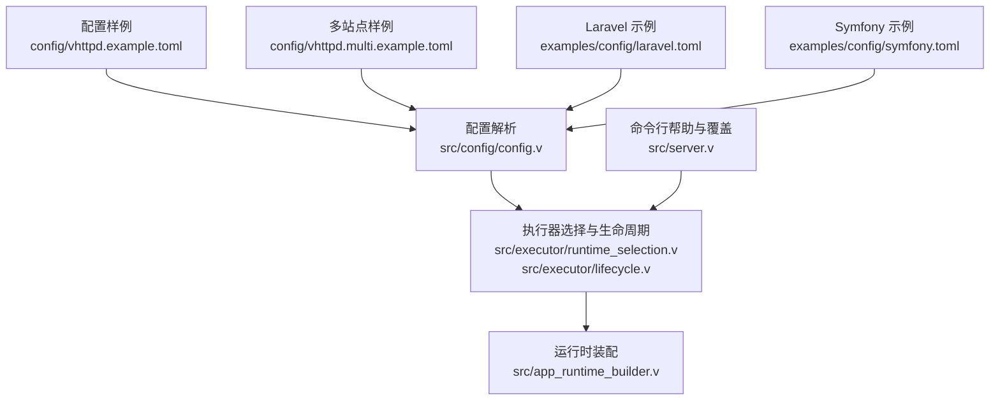
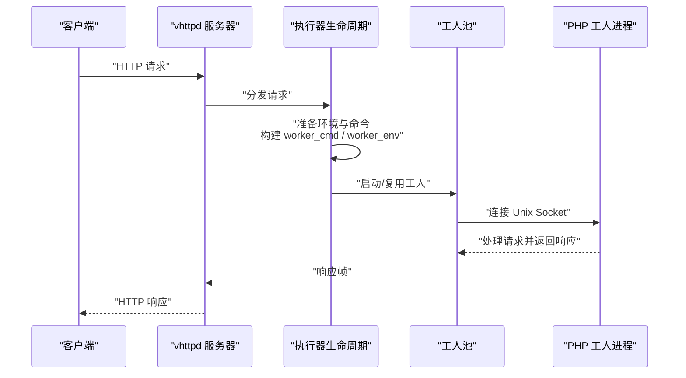
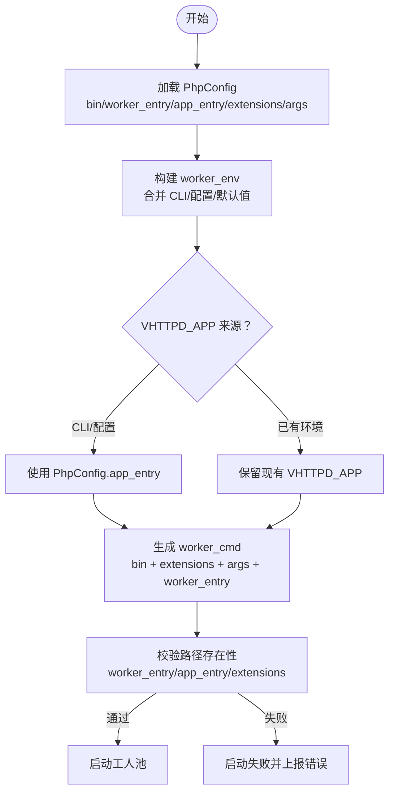
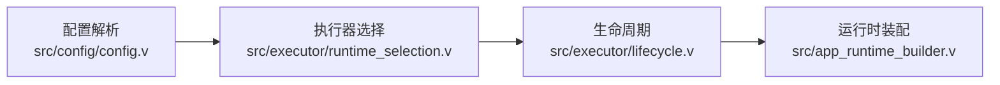

# PHP 执行器配置

<cite>
**本文引用的文件**
- [vhttpd.example.toml](file://config/vhttpd.example.toml)
- [vhttpd.multi.example.toml](file://config/vhttpd.multi.example.toml)
- [laravel.toml](file://examples/config/laravel.toml)
- [symfony.toml](file://examples/config/symfony.toml)
- [config.v](file://src/config/config.v)
- [types.v](file://src/executor/types.v)
- [lifecycle.v](file://src/executor/lifecycle.v)
- [runtime_selection.v](file://src/executor/runtime_selection.v)
- [app_runtime_builder.v](file://src/app_runtime_builder.v)
- [server.v](file://src/server.v)
- [EXECUTOR_MODES.md](file://docs/EXECUTOR_MODES.md)
- [README.md](file://README.md)
- [server_logic_test.v](file://src/server_logic_test.v)
</cite>

## 目录
1. [简介](#简介)
2. [项目结构](#项目结构)
3. [核心组件](#核心组件)
4. [架构总览](#架构总览)
5. [详细组件分析](#详细组件分析)
6. [依赖关系分析](#依赖关系分析)
7. [性能考虑](#性能考虑)
8. [故障排查指南](#故障排查指南)
9. [结论](#结论)
10. [附录](#附录)

## 简介
本文件面向 vhttpd 的 PHP 执行器配置，系统性阐述 PhpConfig 结构体的各项配置项：bin（PHP 可执行文件路径）、worker_entry（工作进程入口文件）、app_entry（应用入口文件）、extensions（PHP 扩展列表）、args（启动参数），并结合实际示例与测试用例，说明其作用、默认行为、校验规则与最佳实践。同时给出针对 Laravel、Symfony 等主流框架的适配建议，并提供性能优化、安全配置与错误处理的指导及常见问题排查方案。

## 项目结构
围绕 PHP 执行器的关键位置与文件如下：
- 配置样例：config/vhttpd.example.toml、config/vhttpd.multi.example.toml
- 框架示例：examples/config/laravel.toml、examples/config/symfony.toml
- 配置解析与类型定义：src/config/config.v
- 执行器生命周期与选择：src/executor/lifecycle.v、src/executor/runtime_selection.v
- 运行时装配：src/app_runtime_builder.v
- 命令行帮助与 CLI 覆盖：src/server.v
- 文档参考：docs/EXECUTOR_MODES.md、README.md
- 行为验证与测试：src/server_logic_test.v

**图表来源**
- [vhttpd.example.toml:31-36](file://config/vhttpd.example.toml#L31-L36)
- [vhttpd.multi.example.toml:44-55](file://config/vhttpd.multi.example.toml#L44-L55)
- [laravel.toml:1-23](file://examples/config/laravel.toml#L1-L23)
- [symfony.toml:1-22](file://examples/config/symfony.toml#L1-L22)
- [config.v:552-566](file://src/config/config.v#L552-L566)
- [runtime_selection.v:12-21](file://src/executor/runtime_selection.v#L12-L21)
- [lifecycle.v:84-96](file://src/executor/lifecycle.v#L84-L96)
- [app_runtime_builder.v:32-57](file://src/app_runtime_builder.v#L32-L57)
- [server.v:126-131](file://src/server.v#L126-L131)

**章节来源**
- [vhttpd.example.toml:1-67](file://config/vhttpd.example.toml#L1-L67)
- [vhttpd.multi.example.toml:1-73](file://config/vhttpd.multi.example.toml#L1-L73)
- [laravel.toml:1-23](file://examples/config/laravel.toml#L1-L23)
- [symfony.toml:1-22](file://examples/config/symfony.toml#L1-L22)
- [config.v:552-566](file://src/config/config.v#L552-L566)
- [runtime_selection.v:12-21](file://src/executor/runtime_selection.v#L12-L21)
- [lifecycle.v:84-96](file://src/executor/lifecycle.v#L84-L96)
- [app_runtime_builder.v:32-57](file://src/app_runtime_builder.v#L32-L57)
- [server.v:126-131](file://src/server.v#L126-L131)
- [EXECUTOR_MODES.md:25-77](file://docs/EXECUTOR_MODES.md#L25-L77)
- [README.md:605-610](file://README.md#L605-L610)

## 核心组件
- PhpConfig 结构体由配置解析模块负责从 TOML 映射到结构化配置，包含以下字段：
  - bin：PHP 可执行文件路径（默认值来自示例配置）
  - worker_entry：PHP 工作进程入口脚本（必需项）
  - app_entry：PHP 应用入口脚本（注入为 VHTTPD_APP 环境变量）
  - extensions：扩展列表（映射为多次 -d extension=...）
  - args：额外 PHP CLI 参数（如内存限制等）

- 配置解析逻辑：
  - decode_php_config_map 将 TOML 中的 php 段落映射到 PhpConfig
  - 支持通过 CLI 覆盖上述字段（--php-bin、--php-worker-entry、--php-app-entry、--php-extension、--php-arg）

- 生命周期与生成命令：
  - 当 worker.cmd 为空时，vhttpd 会基于 PhpConfig 自动生成 worker 命令
  - 启动阶段对 worker_entry、app_entry、extensions 路径进行存在性校验，失败则直接报错

**章节来源**
- [config.v:552-566](file://src/config/config.v#L552-L566)
- [server.v:126-131](file://src/server.v#L126-L131)
- [server_logic_test.v:941-961](file://src/server_logic_test.v#L941-L961)
- [server_logic_test.v:1022-1032](file://src/server_logic_test.v#L1022-L1032)

## 架构总览
vhttpd 的 PHP 执行器采用“外部 PHP 工人进程”模型，HTTP 请求经由 veb 传输层进入，再由执行器生命周期准备环境与命令，最终通过 Unix Socket 与 PHP 工人通信。

**图表来源**
- [lifecycle.v:84-96](file://src/executor/lifecycle.v#L84-L96)
- [app_runtime_builder.v:32-57](file://src/app_runtime_builder.v#L32-L57)
- [types.v:66-74](file://src/executor/types.v#L66-L74)

**章节来源**
- [lifecycle.v:84-96](file://src/executor/lifecycle.v#L84-L96)
- [app_runtime_builder.v:32-57](file://src/app_runtime_builder.v#L32-L57)
- [types.v:66-74](file://src/executor/types.v#L66-L74)

## 详细组件分析

### PhpConfig 字段详解与默认值
- bin
  - 作用：指定 PHP CLI 可执行文件路径
  - 默认值：来自示例配置中的 php.bin
  - CLI 覆盖：--php-bin
  - 注意：若使用自定义路径，请确保可执行权限与依赖库可用

- worker_entry
  - 作用：PHP 工人引导脚本（必需）
  - 默认值：示例中指向 php/package/bin/php-worker
  - 必需性：启动前强制校验是否存在；缺失将导致启动失败
  - CLI 覆盖：--php-worker-entry

- app_entry
  - 作用：应用引导入口，会被注入为 VHTTPD_APP 环境变量
  - 默认值：示例中指向 examples/hello-app.php
  - CLI 覆盖：--php-app-entry
  - 注入优先级：当 worker.env 中已存在 VHTTPD_APP 时，以 PhpConfig.app_entry 为准

- extensions
  - 作用：扩展列表，将被映射为多次 -d extension=...
  - 默认值：示例中包含 vslim 扩展
  - CLI 覆盖：--php-extension（可重复）

- args
  - 作用：额外 PHP CLI 参数（如内存限制、日志级别等）
  - 默认值：空数组
  - CLI 覆盖：--php-arg（可重复）

- 关键行为与校验
  - 生成命令时，会按顺序拼接 bin、extensions、args、worker_entry
  - 启动前校验 worker_entry、app_entry、extensions 路径存在性
  - CLI 覆盖优先于配置文件

**章节来源**
- [vhttpd.example.toml:31-36](file://config/vhttpd.example.toml#L31-L36)
- [config.v:552-566](file://src/config/config.v#L552-L566)
- [server.v:126-131](file://src/server.v#L126-L131)
- [server_logic_test.v:941-950](file://src/server_logic_test.v#L941-L950)
- [server_logic_test.v:952-961](file://src/server_logic_test.v#L952-L961)
- [server_logic_test.v:963-974](file://src/server_logic_test.v#L963-L974)
- [server_logic_test.v:1022-1032](file://src/server_logic_test.v#L1022-L1032)

### 多站点与路径别名
- 在多站点模式下，可通过 [paths] 定义别名，php_app、php_worker、vslim_ext 等可基于 root 解析
- sites.<name> 下可直接设置 php.bin、php.extensions 等，覆盖全局 [php] 段

**章节来源**
- [vhttpd.multi.example.toml:1-73](file://config/vhttpd.multi.example.toml#L1-L73)

### 框架适配建议

#### Laravel
- 入口与环境
  - 使用 worker.env.VHTTPD_APP 指向 Laravel 应用入口（如 app.php）
  - 可在 worker.cmd 中显式传入扩展路径（通过环境变量或绝对路径）
- 示例要点
  - 示例配置展示了通过 worker.env 设置 VHTTPD_APP
  - worker.cmd 中显式传入扩展路径，便于在容器或非标准环境中定位扩展

**章节来源**
- [laravel.toml:1-23](file://examples/config/laravel.toml#L1-L23)

#### Symfony
- 入口与环境
  - 与 Laravel 类似，通过 worker.env.VHTTPD_APP 指向 Symfony 应用入口
  - worker.cmd 中同样可显式传入扩展路径
- 示例要点
  - 示例配置展示了通过 worker.env 设置 VHTTPD_APP
  - worker.cmd 中显式传入扩展路径，便于在容器或非标准环境中定位扩展

**章节来源**
- [symfony.toml:1-22](file://examples/config/symfony.toml#L1-L22)

### 命令生成与环境注入流程

**图表来源**
- [lifecycle.v:84-96](file://src/executor/lifecycle.v#L84-L96)
- [server_logic_test.v:941-950](file://src/server_logic_test.v#L941-L950)
- [server_logic_test.v:952-961](file://src/server_logic_test.v#L952-L961)
- [server_logic_test.v:963-974](file://src/server_logic_test.v#L963-L974)

**章节来源**
- [lifecycle.v:84-96](file://src/executor/lifecycle.v#L84-L96)
- [server_logic_test.v:941-974](file://src/server_logic_test.v#L941-L974)
- [server_logic_test.v:1022-1032](file://src/server_logic_test.v#L1022-L1032)

## 依赖关系分析
- 配置层
  - config.v 负责将 TOML 映射到 PhpConfig
  - 支持路径展开与环境变量替换
- 执行器层
  - runtime_selection.v 根据配置推断执行器种类（php/vjsx）
  - lifecycle.v 负责准备 worker_cmd 与 worker_env，并在必要时生成命令
- 运行时层
  - app_runtime_builder.v 将执行器计划转换为运行时状态，包含工人后端、队列容量、超时等

**图表来源**
- [config.v:552-566](file://src/config/config.v#L552-L566)
- [runtime_selection.v:12-21](file://src/executor/runtime_selection.v#L12-L21)
- [lifecycle.v:84-96](file://src/executor/lifecycle.v#L84-L96)
- [app_runtime_builder.v:32-57](file://src/app_runtime_builder.v#L32-L57)

**章节来源**
- [config.v:552-566](file://src/config/config.v#L552-L566)
- [runtime_selection.v:12-21](file://src/executor/runtime_selection.v#L12-L21)
- [lifecycle.v:84-96](file://src/executor/lifecycle.v#L84-L96)
- [app_runtime_builder.v:32-57](file://src/app_runtime_builder.v#L32-L57)

## 性能考虑
- 扩展与参数
  - 仅加载必要的扩展，避免不必要的内存占用
  - 使用 args 为特定应用设置合理的内存限制与日志级别
- 工人池与队列
  - 根据并发与请求特征调整 worker.pool_size、queue_capacity、queue_timeout_ms
  - 合理设置 max_requests 以平衡内存回收与稳定性
- 超时与重启
  - read_timeout_ms 与 restart_backoff_ms 需结合业务延迟与重试策略调优
- 多站点与路径
  - 利用 [paths] 别名统一管理相对路径，减少拼接错误与 IO 开销

[本节为通用建议，无需具体文件引用]

## 故障排查指南
- 启动即失败：缺少 worker_entry 或 app_entry
  - 现象：启动时报错，提示缺少工作进程入口或路径不存在
  - 排查：确认 php.worker_entry 是否存在；检查路径是否正确
  - 参考：启动前路径校验逻辑

- 启动成功但无工人可用
  - 现象：工人池为空，服务仍保持但不处理请求
  - 排查：检查 worker.autostart、worker.cmd、worker.sockets 配置；查看日志告警
  - 参考：生命周期启动后的空池检测

- 扩展加载失败
  - 现象：PHP 抛出扩展相关错误
  - 排查：确认 extensions 列表中的扩展路径存在且与 PHP 版本匹配；优先使用绝对路径
  - 参考：命令生成时对 extensions 的处理

- VHTTPD_APP 注入冲突
  - 现象：应用读取到的入口与预期不符
  - 排查：确认 CLI 覆盖优先级高于环境变量；检查 worker.env 中是否已存在 VHTTPD_APP
  - 参考：环境注入优先级测试

- CLI 覆盖未生效
  - 现象：命令行参数未影响生成的 worker_cmd
  - 排查：确认未显式设置 worker.cmd；否则 CLI 覆盖将被忽略
  - 参考：README 对 CLI 覆盖的说明

**章节来源**
- [server_logic_test.v:941-961](file://src/server_logic_test.v#L941-L961)
- [server_logic_test.v:1022-1032](file://src/server_logic_test.v#L1022-L1032)
- [lifecycle.v:97-112](file://src/executor/lifecycle.v#L97-L112)
- [server.v:126-131](file://src/server.v#L126-L131)
- [README.md:607-610](file://README.md#L607-L610)

## 结论
PhpConfig 提供了对 PHP 执行器的细粒度控制：bin 控制运行时、worker_entry/app_entry 决定工人的引导与应用入口、extensions/args 则用于扩展与运行参数的精确配置。配合 CLI 覆盖与启动前路径校验，vhttpd 能够在多框架场景下稳定地生成并启动 PHP 工人。建议在生产环境中严格校验路径、最小化扩展集、合理设置队列与超时，并通过多站点配置统一管理路径别名。

[本节为总结，无需具体文件引用]

## 附录

### 配置项速查表
- php.bin：PHP 可执行文件路径（默认来自示例）
- php.worker_entry：工作进程入口脚本（必需）
- php.app_entry：应用入口脚本（注入为 VHTTPD_APP）
- php.extensions：扩展列表（多次 -d extension=...）
- php.args：额外 PHP CLI 参数（如内存限制）
- CLI 覆盖：--php-bin、--php-worker-entry、--php-app-entry、--php-extension、--php-arg

**章节来源**
- [vhttpd.example.toml:31-36](file://config/vhttpd.example.toml#L31-L36)
- [server.v:126-131](file://src/server.v#L126-L131)
- [EXECUTOR_MODES.md:58-77](file://docs/EXECUTOR_MODES.md#L58-L77)