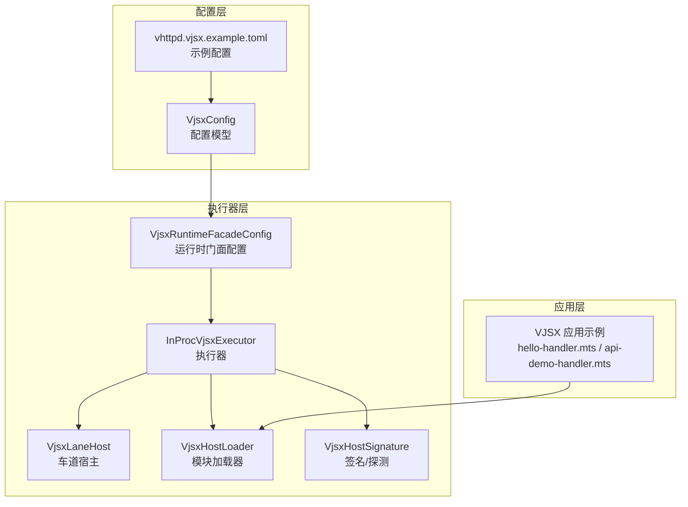
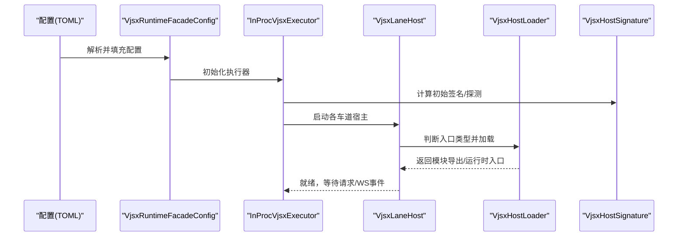
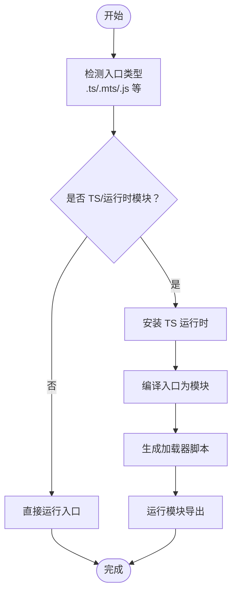
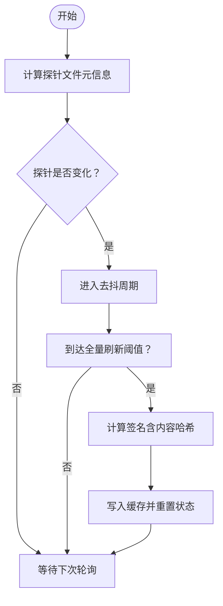
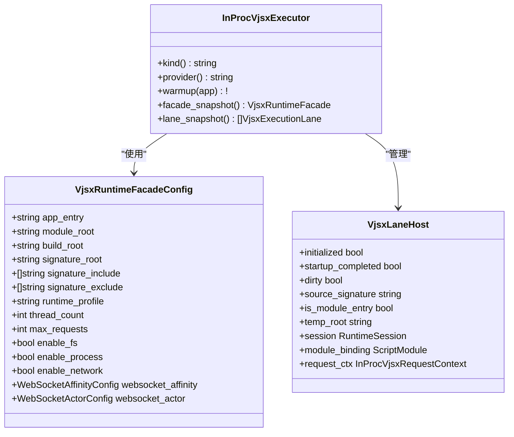
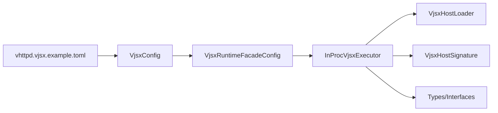

# VJSX 执行器配置

<cite>
**本文档引用的文件**
- [inproc_vjsx_executor.v](file://src/executor/inproc_vjsx_executor.v)
- [vjsx_host_loader.v](file://src/executor/vjsx_host_loader.v)
- [vjsx_host_signature.v](file://src/executor/vjsx_host_signature.v)
- [types.v](file://src/executor/types.v)
- [config.v](file://src/config/config.v)
- [runtime_config.v](file://src/config/runtime_config.v)
- [vhttpd.vjsx.example.toml](file://config/vhttpd.vjsx.example.toml)
- [hello-handler.mts](file://examples/vjsx/hello-handler.mts)
- [api-demo-handler.mts](file://examples/vjsx/api-demo-handler.mts)
- [bot-entry.mts](file://examples/vjsx/bot-entry.mts)
</cite>

## 目录
1. [简介](#简介)
2. [项目结构](#项目结构)
3. [核心组件](#核心组件)
4. [架构总览](#架构总览)
5. [详细组件分析](#详细组件分析)
6. [依赖关系分析](#依赖关系分析)
7. [性能考量](#性能考量)
8. [故障排查指南](#故障排查指南)
9. [结论](#结论)
10. [附录](#附录)

## 简介
本文件面向 vhttpd 的 VJSX 执行器配置与使用，系统性阐述 VjsxRuntimeFacadeConfig 结构体的各项配置项，解析 VJSX 内嵌 JavaScript/TypeScript 执行、沙箱与权限控制机制，并提供开发与生产环境的最佳实践、性能调优与故障排查建议。读者无需深入源码即可理解如何正确配置与运维 VJSX 应用。

## 项目结构
围绕 VJSX 执行器的关键代码与示例分布如下：
- 执行器实现与运行时门面：src/executor/inproc_vjsx_executor.v
- 模块加载与入口处理：src/executor/vjsx_host_loader.v
- 签名与变更探测：src/executor/vjsx_host_signature.v
- 类型与管理接口：src/executor/types.v
- 配置模型与合并逻辑：src/config/config.v、src/config/runtime_config.v
- 示例配置与应用：config/vhttpd.vjsx.example.toml、examples/vjsx/*.mts

**图表来源**
- [config.v:57-71](file://src/config/config.v#L57-L71)
- [vjsx_host_loader.v:1-112](file://src/executor/vjsx_host_loader.v#L1-L112)
- [vjsx_host_signature.v:1-296](file://src/executor/vjsx_host_signature.v#L1-L296)
- [inproc_vjsx_executor.v:78-171](file://src/executor/inproc_vjsx_executor.v#L78-L171)

**章节来源**
- [config.v:57-71](file://src/config/config.v#L57-L71)
- [vhttpd.vjsx.example.toml:21-26](file://config/vhttpd.vjsx.example.toml#L21-L26)

## 核心组件
本节聚焦 VJSX 执行器的核心数据结构与职责划分：
- VjsxRuntimeFacadeConfig：承载执行器运行期所需的所有配置项，是配置与执行之间的桥梁。
- InProcVjsxExecutor：进程内 VJSX 执行器，负责多车道调度、热更新探测、会话与任务队列管理。
- VjsxHostLoader：负责入口文件类型判断、模块编译与运行时注入。
- VjsxHostSignature：负责源码签名与探测，用于检测应用变更以触发重建或重启。

关键字段与含义（来自 VjsxRuntimeFacadeConfig）：
- app_entry：应用入口文件路径（支持 .js/.mjs/.cjs/.ts/.mts/.cts）
- module_root：模块根目录，影响模块解析与文件系统可见范围
- build_root：构建缓存根目录，用于存放临时构建产物
- signature_root/signature_include/exclude：签名扫描根目录及包含/排除规则
- runtime_profile：运行时配置文件标识（如 node）
- thread_count：执行车道数（线程池大小）
- max_requests：单实例最大请求数（生命周期上限）
- enable_fs/process/network：功能开关，分别控制文件系统、子进程、网络访问能力
- websocket_*：WebSocket 连接亲和与演员配置（高级特性）

**章节来源**
- [inproc_vjsx_executor.v:78-95](file://src/executor/inproc_vjsx_executor.v#L78-L95)
- [vjsx_host_loader.v:17-29](file://src/executor/vjsx_host_loader.v#L17-L29)
- [vjsx_host_signature.v:47-79](file://src/executor/vjsx_host_signature.v#L47-L79)

## 架构总览
下图展示 VJSX 执行器从配置到运行的端到端流程：

**图表来源**
- [vhttpd.vjsx.example.toml:21-26](file://config/vhttpd.vjsx.example.toml#L21-L26)
- [inproc_vjsx_executor.v:442-513](file://src/executor/inproc_vjsx_executor.v#L442-L513)
- [vjsx_host_loader.v:93-111](file://src/executor/vjsx_host_loader.v#L93-L111)
- [vjsx_host_signature.v:255-295](file://src/executor/vjsx_host_signature.v#L255-L295)

## 详细组件分析

### VjsxRuntimeFacadeConfig 配置详解
- app_entry
  - 必填；支持 TypeScript 与多种 JS 模块格式；用于确定入口与是否作为 ES 模块加载。
  - 变更会触发签名探测与可能的重建。
- module_root
  - 影响模块解析与文件系统可见范围；可与 app_entry 所在目录共同构成 FS 根。
- build_root
  - 临时构建产物存放目录；默认值由加载器提供。
- signature_root/signature_include/exclude
  - 签名扫描根目录与包含/排除规则；默认排除常见目录与扩展名集合。
  - 通过探测与签名算法生成稳定哈希，用于判断是否需要重建或重启。
- runtime_profile
  - 运行时配置文件标识，影响运行时行为（如 node）。
- thread_count
  - 车道数量；每个车道对应一个独立的运行时上下文与工作线程。
- max_requests
  - 单实例生命周期内允许的最大请求数；达到上限后可触发重启策略。
- enable_fs/process/network
  - 功能开关：文件系统访问、子进程执行、网络访问；生产环境建议最小化授权。
- websocket_affinity/websocket_actor
  - WebSocket 连接亲和与演员决策配置（高级特性），用于跨帧状态保持与优先级控制。

**章节来源**
- [config.v:57-71](file://src/config/config.v#L57-L71)
- [vjsx_host_loader.v:31-41](file://src/executor/vjsx_host_loader.v#L31-L41)
- [vjsx_host_signature.v:47-79](file://src/executor/vjsx_host_signature.v#L47-L79)
- [types.v:76-90](file://src/executor/types.v#L76-L90)

### 入口加载与模块运行
- 入口类型判定：根据扩展名判断是否为 TS 或模块文件，决定是否安装 TS 运行时与模块编译。
- 模块编译：TS/运行时模块入口会被编译为中间模块，再通过运行时入口执行。
- 加载器还负责计算相对导入路径与生成加载器脚本，确保模块导出可用。

**图表来源**
- [vjsx_host_loader.v:17-29](file://src/executor/vjsx_host_loader.v#L17-L29)
- [vjsx_host_loader.v:93-111](file://src/executor/vjsx_host_loader.v#L93-L111)

**章节来源**
- [vjsx_host_loader.v:17-111](file://src/executor/vjsx_host_loader.v#L17-L111)

### 签名与变更探测
- 探测与签名
  - 探针（probe）仅包含文件元信息（时间戳、大小），用于快速判断是否发生变更。
  - 签名（signature）包含文件内容哈希，用于精确判断是否需要重建。
- 根目录与规则
  - 默认扫描根优先级：显式 signature_root > module_root > app_entry 所在目录。
  - 包含/排除规则支持通配符与双星（**），默认排除常见目录与构建产物。
- 周期刷新
  - 执行器后台循环定期探测，满足去抖与全量刷新条件时才更新缓存。

**图表来源**
- [vjsx_host_signature.v:255-295](file://src/executor/vjsx_host_signature.v#L255-L295)
- [inproc_vjsx_executor.v:620-681](file://src/executor/inproc_vjsx_executor.v#L620-L681)

**章节来源**
- [vjsx_host_signature.v:255-295](file://src/executor/vjsx_host_signature.v#L255-L295)
- [inproc_vjsx_executor.v:620-681](file://src/executor/inproc_vjsx_executor.v#L620-L681)

### 执行器初始化与车道管理
- 初始化
  - 根据 thread_count 创建多个执行车道，每个车道对应一个 lane_host。
  - 启动签名刷新循环，预计算初始探针与签名。
- 热更新
  - 当签名变化时，执行器会触发重建或重启流程，确保新代码生效。
- 管理接口
  - 提供快照、暖启动、亲和与演员决策等高级能力，便于运维与可观测性。

**图表来源**
- [inproc_vjsx_executor.v:78-171](file://src/executor/inproc_vjsx_executor.v#L78-L171)
- [types.v:76-90](file://src/executor/types.v#L76-L90)

**章节来源**
- [inproc_vjsx_executor.v:442-513](file://src/executor/inproc_vjsx_executor.v#L442-L513)
- [inproc_vjsx_executor.v:115-152](file://src/executor/inproc_vjsx_executor.v#L115-L152)

### VJSX 应用开发与示例
- hello-handler.mts：最简 HTTP 处理器示例，演示如何返回 JSON 响应与读取查询参数。
- api-demo-handler.mts：展示多种响应模式（JSON/HTML/Accepted/Problem）与运行时快照。
- bot-entry.mts：展示 WebSocket 上游事件处理与命令回传。

这些示例展示了 VJSX 应用的典型入口形态与上下文 API 使用方式。

**章节来源**
- [hello-handler.mts:1-16](file://examples/vjsx/hello-handler.mts#L1-L16)
- [api-demo-handler.mts:1-91](file://examples/vjsx/api-demo-handler.mts#L1-L91)
- [bot-entry.mts:1-43](file://examples/vjsx/bot-entry.mts#L1-L43)

## 依赖关系分析
- 配置来源
  - vhttpd.vjsx.example.toml 提供示例配置，包含 app_entry、module_root、thread_count 等关键项。
  - config.v 定义了 VjsxConfig 结构体及其默认值，runtime_config.v 提供合并与路径解析逻辑。
- 执行器依赖
  - InProcVjsxExecutor 依赖 VjsxRuntimeFacadeConfig 进行初始化与运行。
  - VjsxHostLoader 依赖 vjsx.runtimejs 与 vjsx.Context 实现模块加载与运行。
  - VjsxHostSignature 依赖文件系统与哈希算法实现签名与探测。

**图表来源**
- [vhttpd.vjsx.example.toml:21-26](file://config/vhttpd.vjsx.example.toml#L21-L26)
- [config.v:57-71](file://src/config/config.v#L57-L71)
- [runtime_config.v:113-153](file://src/config/runtime_config.v#L113-L153)
- [inproc_vjsx_executor.v:442-513](file://src/executor/inproc_vjsx_executor.v#L442-L513)

**章节来源**
- [config.v:57-71](file://src/config/config.v#L57-L71)
- [runtime_config.v:113-153](file://src/config/runtime_config.v#L113-L153)

## 性能考量
- 线程与车道
  - thread_count 建议根据 CPU 核心数与并发特征设置；过小导致排队，过大导致上下文切换开销。
- 构建缓存
  - 合理设置 build_root，避免频繁磁盘 IO；在 CI 中复用缓存可显著提升启动速度。
- 签名探测
  - 适当调整 signature_include/exclude，减少不必要的文件扫描；生产环境建议仅包含必要目录。
- 请求上限
  - max_requests 用于控制生命周期内的请求数，结合重启策略实现平滑滚动更新。
- 文件系统与网络
  - 生产环境关闭 enable_fs/process/network 未使用的开关，降低攻击面与资源占用。

[本节为通用指导，不直接分析具体文件]

## 故障排查指南
- 入口类型错误
  - 现象：加载失败并提示不支持的入口类型。
  - 排查：确认 app_entry 是否为 .js/.mjs/.cjs/.ts/.mts/.cts 支持的扩展名。
- 签名未更新
  - 现象：修改源码后未触发重建。
  - 排查：检查 signature_root/signature_include/exclude 是否正确；确认探针/签名计算逻辑是否被忽略。
- 权限不足
  - 现象：访问文件系统/网络/子进程失败。
  - 排查：核对 enable_fs/process/network 开关；必要时开启并限定作用域。
- 热更新不生效
  - 现象：变更后仍使用旧代码。
  - 排查：查看签名刷新循环日志；确认去抖与全量刷新阈值是否满足；检查 lane_hosts 状态。
- WebSocket 亲和异常
  - 现象：跨帧状态丢失或消息乱序。
  - 排查：检查 websocket_affinity/websocket_actor 配置；确认亲和键与演员类名一致性。

**章节来源**
- [vjsx_host_loader.v:17-29](file://src/executor/vjsx_host_loader.v#L17-L29)
- [vjsx_host_signature.v:255-295](file://src/executor/vjsx_host_signature.v#L255-L295)
- [inproc_vjsx_executor.v:620-681](file://src/executor/inproc_vjsx_executor.v#L620-L681)

## 结论
VJSX 执行器通过清晰的配置模型与稳健的签名探测机制，实现了对内嵌 JavaScript/TypeScript 应用的高效运行与安全隔离。合理设置 app_entry、module_root、build_root、signature_*、runtime_profile、thread_count、max_requests 以及 enable_fs/process/network 等关键参数，可在开发与生产环境中获得良好的性能与稳定性。配合示例应用与最佳实践，可快速搭建可靠的 VJSX 应用。

[本节为总结性内容，不直接分析具体文件]

## 附录

### 配置最佳实践
- 开发环境
  - app_entry/module_root 指向本地源码目录；启用细粒度签名包含规则，便于增量编译。
  - thread_count 可设为较小值（如 1-2），便于调试。
  - enable_fs/process/network 按需开启，避免过度授权。
- 生产环境
  - 固定 app_entry 与 module_root，使用只读文件系统权限。
  - 设置合理的 thread_count 与 max_requests，结合健康检查与滚动重启策略。
  - 关闭未使用的功能开关，最小化攻击面。
  - 使用稳定的 signature_root 与明确的 include/exclude 规则，确保签名稳定且高效。

### 配置项对照表
- app_entry：应用入口文件（必填）
- module_root：模块根目录
- build_root：构建缓存根目录
- signature_root：签名扫描根目录
- signature_include/exclude：签名包含/排除规则
- runtime_profile：运行时配置文件标识
- thread_count：执行车道数
- max_requests：最大请求数
- enable_fs/process/network：功能开关

**章节来源**
- [config.v:57-71](file://src/config/config.v#L57-L71)
- [vjsx_host_signature.v:47-79](file://src/executor/vjsx_host_signature.v#L47-L79)
- [vhttpd.vjsx.example.toml:21-26](file://config/vhttpd.vjsx.example.toml#L21-L26)