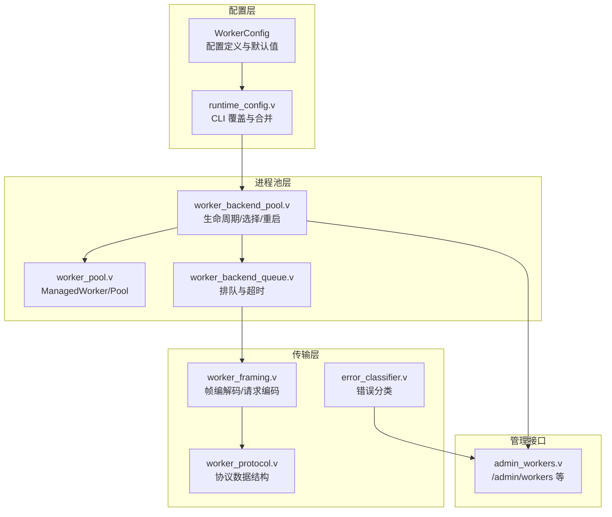
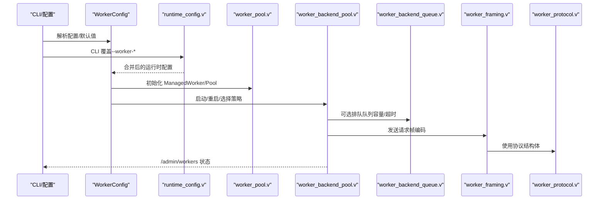
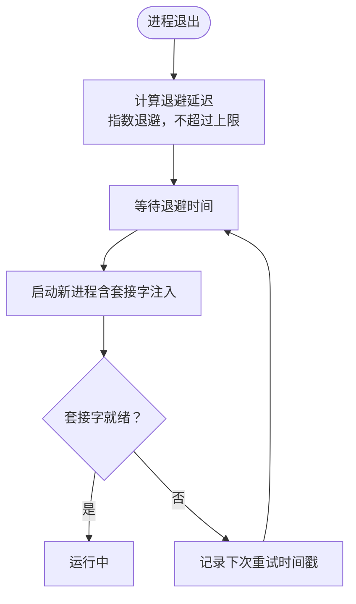
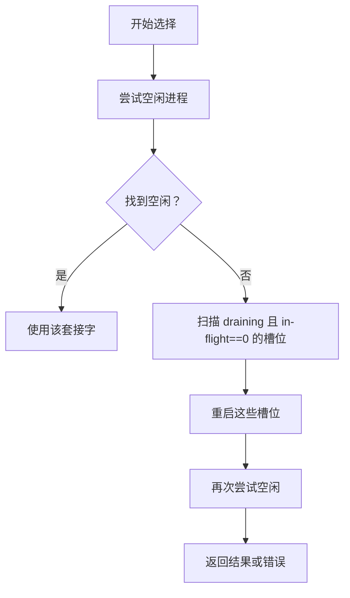
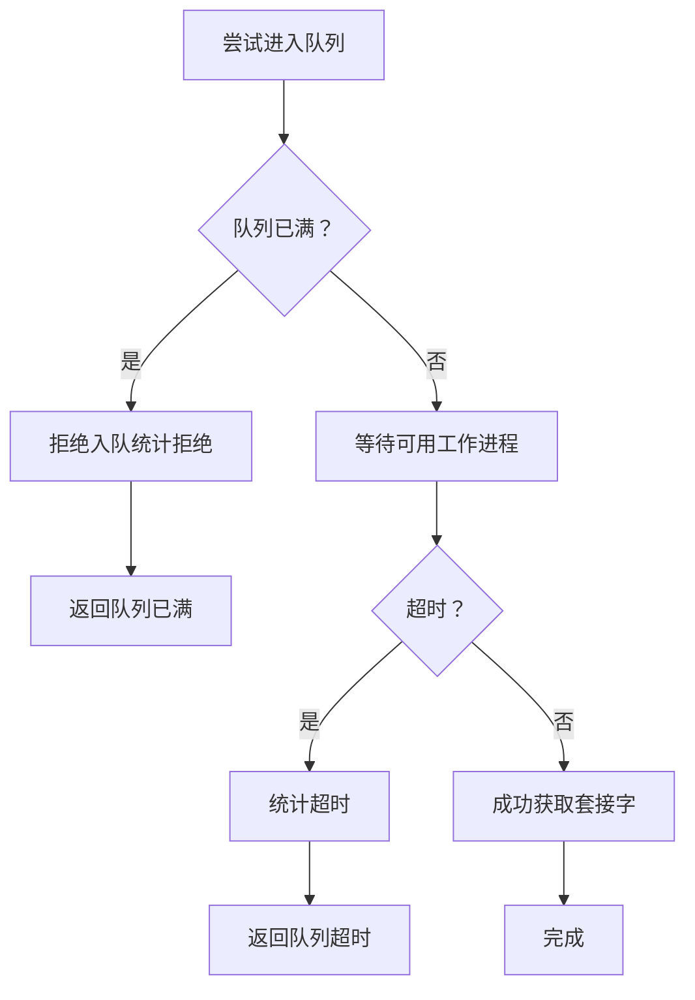
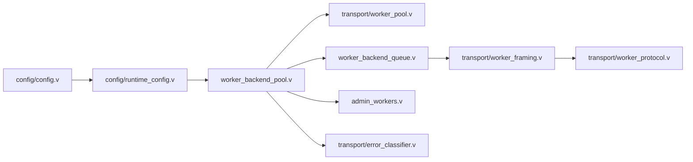

# 工作进程配置

<cite>
**本文引用的文件**
- [src/config/config.v](file://src/config/config.v)
- [src/config/runtime_config.v](file://src/config/runtime_config.v)
- [src/server_lifecycle/runtime_config.v](file://src/server_lifecycle/runtime_config.v)
- [src/transport/worker_pool.v](file://src/transport/worker_pool.v)
- [src/worker_backend_pool.v](file://src/worker_backend_pool.v)
- [src/worker_backend_queue.v](file://src/worker_backend_queue.v)
- [src/transport/worker_framing.v](file://src/transport/worker_framing.v)
- [src/transport/worker_protocol.v](file://src/transport/worker_protocol.v)
- [src/transport/error_classifier.v](file://src/transport/error_classifier.v)
- [src/admin_workers.v](file://src/admin_workers.v)
- [articles/11-observability.md](file://articles/11-observability.md)
- [README.md](file://README.md)
- [config/vhttpd.example.toml](file://config/vhttpd.example.toml)
- [config/vhttpd.multi.example.toml](file://config/vhttpd.multi.example.toml)
</cite>

## 目录
1. [简介](#简介)
2. [项目结构](#项目结构)
3. [核心组件](#核心组件)
4. [架构总览](#架构总览)
5. [详细组件分析](#详细组件分析)
6. [依赖关系分析](#依赖关系分析)
7. [性能考虑与调优](#性能考虑与调优)
8. [故障排查指南](#故障排查指南)
9. [结论](#结论)
10. [附录](#附录)

## 简介
本文面向 vhttpd 的工作进程（Worker）配置与运行时管理，系统化阐述 WorkerConfig 结构体的各项配置项及其语义，解析工作进程池的生命周期、负载均衡策略、故障恢复机制，并提供性能调优建议与监控排障方法。读者无需深入源码即可理解如何正确配置与运维工作进程。

## 项目结构
围绕工作进程配置与运行的关键模块如下：
- 配置定义与合并：WorkerConfig 结构体、默认值与 CLI 覆盖
- 进程池管理：自动启动、重启退避、最大请求数重启、空闲/忙碌选择
- 请求排队：队列容量与超时控制
- 协议与帧格式：请求编码、帧编解码
- 管理接口：/admin/workers、/admin/stats 等

**图表来源**
- [src/config/config.v:24-41](file://src/config/config.v#L24-L41)
- [src/config/runtime_config.v:19-68](file://src/config/runtime_config.v#L19-L68)
- [src/transport/worker_pool.v:8-183](file://src/transport/worker_pool.v#L8-L183)
- [src/worker_backend_pool.v:145-383](file://src/worker_backend_pool.v#L145-L383)
- [src/worker_backend_queue.v:9-92](file://src/worker_backend_queue.v#L9-L92)
- [src/transport/worker_framing.v:164-197](file://src/transport/worker_framing.v#L164-L197)
- [src/transport/worker_protocol.v:48-115](file://src/transport/worker_protocol.v#L48-L115)
- [src/transport/error_classifier.v:1-18](file://src/transport/error_classifier.v#L1-L18)
- [src/admin_workers.v:8-50](file://src/admin_workers.v#L8-L50)

**章节来源**
- [src/config/config.v:24-41](file://src/config/config.v#L24-L41)
- [src/config/runtime_config.v:19-68](file://src/config/runtime_config.v#L19-L68)
- [src/transport/worker_pool.v:8-183](file://src/transport/worker_pool.v#L8-L183)
- [src/worker_backend_pool.v:145-383](file://src/worker_backend_pool.v#L145-L383)
- [src/worker_backend_queue.v:9-92](file://src/worker_backend_queue.v#L9-L92)
- [src/transport/worker_framing.v:164-197](file://src/transport/worker_framing.v#L164-L197)
- [src/transport/worker_protocol.v:48-115](file://src/transport/worker_protocol.v#L48-L115)
- [src/transport/error_classifier.v:1-18](file://src/transport/error_classifier.v#L1-L18)
- [src/admin_workers.v:8-50](file://src/admin_workers.v#L8-L50)

## 核心组件
本节聚焦 WorkerConfig 的全部字段与行为，以及与之配套的运行时配置与 CLI 覆盖机制。

- read_timeout_ms（读取超时）
  - 含义：工作进程读取响应的超时时间（毫秒）。用于流式/上游/WS 等场景的读取阶段。
  - 默认值：3000
  - 来源：结构体字段与 CLI 覆盖
  - 参考：[src/config/config.v:26](file://src/config/config.v#L26)，[src/server_lifecycle/runtime_config.v:55-56](file://src/server_lifecycle/runtime_config.v#L55-L56)

- autostart（自动启动）
  - 含义：是否在启动时自动拉起工作进程池。
  - 默认值：false
  - 参考：[src/config/config.v:27](file://src/config/config.v#L27)

- cmd（命令）
  - 含义：工作进程执行命令；支持占位符 {socket} 或 --socket 注入。
  - 参考：[src/config/config.v:28](file://src/config/config.v#L28)，[src/transport/worker_pool.v:47-64](file://src/transport/worker_pool.v#L47-L64)

- stream_dispatch（流式分发）
  - 含义：是否启用流式分发模式。
  - 默认值：false
  - 参考：[src/config/config.v:29](file://src/config/config.v#L29)

- queue_capacity（队列容量）
  - 含义：当所有工作进程繁忙时，允许排队等待的最大请求数。
  - 默认值：0（禁用排队）
  - 参考：[src/config/config.v:30](file://src/config/config.v#L30)，[src/worker_backend_queue.v:10-13](file://src/worker_backend_queue.v#L10-L13)

- queue_timeout_ms（队列超时）
  - 含义：排队等待最长容忍时间（毫秒），超时后返回 504。
  - 默认值：0（禁用排队）
  - 参考：[src/config/config.v:31](file://src/config/config.v#L31)，[src/worker_backend_queue.v:72-76](file://src/worker_backend_queue.v#L72-L76)

- restart_backoff_ms（重启退避）
  - 含义：进程退出后的指数退避基础时长（毫秒）。
  - 默认值：500
  - 参考：[src/config/config.v:32-33](file://src/config/config.v#L32-L33)，[src/transport/worker_pool.v:168-182](file://src/transport/worker_pool.v#L168-L182)

- restart_backoff_max_ms（最大重启退避）
  - 含义：重启退避的最大上限（毫秒）。
  - 默认值：8000
  - 参考：[src/config/config.v:32-33](file://src/config/config.v#L32-L33)

- max_requests（最大请求数）
  - 含义：单个工作进程服务达到该数量后进入“draining”并择机重启，以避免内存泄漏累积。
  - 默认值：0（禁用）
  - 参考：[src/config/config.v:34](file://src/config/config.v#L34)，[src/worker_backend_pool.v:179-188](file://src/worker_backend_pool.v#L179-L188)

- socket/socket_prefix/sockets（套接字配置）
  - 含义：单套接字路径、前缀自动生成多套接字、或显式列出多个套接字。
  - 行为：pool_size>1 时可自动生成带索引的套接字；也可通过 sockets 显式指定。
  - 参考：[src/config/config.v:35-39](file://src/config/config.v#L35-L39)，[src/transport/worker_pool.v:142-166](file://src/transport/worker_pool.v#L142-L166)

- env（环境变量）
  - 含义：传递给工作进程的环境变量，支持与系统环境合并。
  - 参考：[src/config/config.v:40](file://src/config/config.v#L40)，[src/transport/worker_pool.v:66-72](file://src/transport/worker_pool.v#L66-L72)

- pool_size（进程池大小）
  - 含义：工作进程数量；配合 socket_prefix 自动生成多套接字。
  - 默认值：1
  - 参考：[src/config/config.v:36](file://src/config/config.v#L36)，[src/transport/worker_pool.v:142-166](file://src/transport/worker_pool.v#L142-L166)

- websocket_dispatch（WebSocket 上游分发）
  - 含义：是否启用 WebSocket 上游分发模式。
  - 默认值：false
  - 参考：[src/config/config.v:37](file://src/config/config.v#L37)

CLI 覆盖与默认合并
- CLI 参数可覆盖配置文件中的 worker.* 字段，最终注入到运行时构建配置中。
- WorkerConfig.merge 支持按需覆盖字段，未指定则保留默认值。
- 参考：[src/server_lifecycle/runtime_config.v:52-126](file://src/server_lifecycle/runtime_config.v#L52-L126)，[src/config/runtime_config.v:19-68](file://src/config/runtime_config.v#L19-L68)

**章节来源**
- [src/config/config.v:24-41](file://src/config/config.v#L24-L41)
- [src/server_lifecycle/runtime_config.v:52-126](file://src/server_lifecycle/runtime_config.v#L52-L126)
- [src/config/runtime_config.v:19-68](file://src/config/runtime_config.v#L19-L68)
- [src/transport/worker_pool.v:47-64](file://src/transport/worker_pool.v#L47-L64)
- [src/transport/worker_pool.v:142-166](file://src/transport/worker_pool.v#L142-L166)
- [src/worker_backend_queue.v:10-13](file://src/worker_backend_queue.v#L10-L13)
- [src/worker_backend_queue.v:72-76](file://src/worker_backend_queue.v#L72-L76)
- [src/worker_backend_pool.v:179-188](file://src/worker_backend_pool.v#L179-L188)

## 架构总览
工作进程配置与运行时的整体交互如下：

**图表来源**
- [src/config/config.v:24-41](file://src/config/config.v#L24-L41)
- [src/server_lifecycle/runtime_config.v:52-126](file://src/server_lifecycle/runtime_config.v#L52-L126)
- [src/transport/worker_pool.v:74-97](file://src/transport/worker_pool.v#L74-L97)
- [src/worker_backend_pool.v:306-383](file://src/worker_backend_pool.v#L306-L383)
- [src/worker_backend_queue.v:59-92](file://src/worker_backend_queue.v#L59-L92)
- [src/transport/worker_framing.v:164-197](file://src/transport/worker_framing.v#L164-L197)
- [src/transport/worker_protocol.v:48-115](file://src/transport/worker_protocol.v#L48-L115)

## 详细组件分析

### WorkerConfig 结构体与字段详解
- 字段与默认值
  - read_timeout_ms: 3000
  - autostart: false
  - cmd: 空字符串
  - stream_dispatch: false
  - queue_capacity: 0
  - queue_timeout_ms: 0
  - restart_backoff_ms: 500
  - restart_backoff_max_ms: 8000
  - max_requests: 0
  - socket: 空字符串
  - pool_size: 1
  - websocket_dispatch: false
  - socket_prefix: 空字符串
  - sockets: 空数组
  - env: 空映射
- TOML 映射与解析
  - 通过 toml 标签将字段映射到配置键名，如 read_timeout_ms、queue_capacity 等。
- 参考：[src/config/config.v:24-41](file://src/config/config.v#L24-L41)，[src/config/config.v:495-531](file://src/config/config.v#L495-L531)

**章节来源**
- [src/config/config.v:24-41](file://src/config/config.v#L24-L41)
- [src/config/config.v:495-531](file://src/config/config.v#L495-L531)

### 进程池生命周期与重启策略
- 自动启动与命令拼装
  - 当启用 autostart 且提供 socket 时，根据 pool_size 生成多套接字并启动对应数量的工作进程。
  - 命令中若包含 {socket} 则替换为具体套接字；否则追加 --socket 参数。
- 重启退避
  - 采用指数退避，上限受 restart_backoff_max_ms 控制。
- 最大请求数重启
  - 达到 max_requests 后标记 draining，待 in-flight 请求数归零后择机重启。
- 参考：[src/transport/worker_pool.v:47-64](file://src/transport/worker_pool.v#L47-L64)，[src/transport/worker_pool.v:168-182](file://src/transport/worker_pool.v#L168-L182)，[src/worker_backend_pool.v:179-194](file://src/worker_backend_pool.v#L179-L194)

**图表来源**
- [src/transport/worker_pool.v:168-182](file://src/transport/worker_pool.v#L168-L182)
- [src/worker_backend_pool.v:49-63](file://src/worker_backend_pool.v#L49-L63)

**章节来源**
- [src/transport/worker_pool.v:47-64](file://src/transport/worker_pool.v#L47-L64)
- [src/transport/worker_pool.v:168-182](file://src/transport/worker_pool.v#L168-L182)
- [src/worker_backend_pool.v:49-63](file://src/worker_backend_pool.v#L49-L63)

### 负载均衡与工作进程选择
- 轮询索引 rr_index
  - 通过 next_worker_socket 与 next_idle_worker_socket 实现轮询与空闲优先。
- 选择策略
  - 优先选择空闲且存活的工作进程；若无空闲，则返回“全部忙碌”并触发诊断。
- 诊断与恢复
  - 对于 draining 且 in-flight 为 0 的槽位，触发重启以恢复服务能力。
- 参考：[src/worker_backend_pool.v:206-246](file://src/worker_backend_pool.v#L206-L246)，[src/worker_backend_pool.v:306-383](file://src/worker_backend_pool.v#L306-L383)

**图表来源**
- [src/worker_backend_pool.v:206-246](file://src/worker_backend_pool.v#L206-L246)
- [src/worker_backend_pool.v:306-383](file://src/worker_backend_pool.v#L306-L383)

**章节来源**
- [src/worker_backend_pool.v:206-246](file://src/worker_backend_pool.v#L206-L246)
- [src/worker_backend_pool.v:306-383](file://src/worker_backend_pool.v#L306-L383)

### 队列机制与超时控制
- 入队条件
  - queue_capacity > 0 且 queue_timeout_ms > 0 时启用排队。
- 等待与轮询
  - 使用 queue_timeout_ms 作为等待上限，poll_ms 作为轮询间隔（默认 10ms）。
- 统计指标
  - 等待计数、拒绝计数、超时计数。
- 参考：[src/worker_backend_queue.v:9-23](file://src/worker_backend_queue.v#L9-L23)，[src/worker_backend_queue.v:59-92](file://src/worker_backend_queue.v#L59-L92)

**图表来源**
- [src/worker_backend_queue.v:59-92](file://src/worker_backend_queue.v#L59-L92)

**章节来源**
- [src/worker_backend_queue.v:9-23](file://src/worker_backend_queue.v#L9-L23)
- [src/worker_backend_queue.v:59-92](file://src/worker_backend_queue.v#L59-L92)

### 协议与帧格式
- 请求编码
  - 将 HTTP 请求转换为 WorkerRequestPayload 并序列化为 JSON。
- 帧编解码
  - 固定 4 字节长度头 + 负载，支持读取精确字节数与错误处理。
- 协议结构
  - 包含 StreamDispatchResponse、WorkerUpstreamPlanFrame、WorkerRequestPayload 等。
- 参考：[src/transport/worker_framing.v:164-197](file://src/transport/worker_framing.v#L164-L197)，[src/transport/worker_framing.v:10-60](file://src/transport/worker_framing.v#L10-L60)，[src/transport/worker_protocol.v:48-115](file://src/transport/worker_protocol.v#L48-L115)

**章节来源**
- [src/transport/worker_framing.v:164-197](file://src/transport/worker_framing.v#L164-L197)
- [src/transport/worker_framing.v:10-60](file://src/transport/worker_framing.v#L10-L60)
- [src/transport/worker_protocol.v:48-115](file://src/transport/worker_protocol.v#L48-L115)

### 管理接口与可观测性
- /admin/workers
  - 返回工作进程池快照（每个进程的 id、socket、存活、重启次数、in-flight、已服务请求数等）。
- /admin/stats
  - 返回运行时统计（请求总量/成功率/错误类型分布、延迟分位等）。
- 错误分类
  - 将“全部忙碌/队列满/队列超时/超时”等错误映射为 503/504/502。
- 参考：[src/admin_workers.v:8-50](file://src/admin_workers.v#L8-L50)，[src/transport/error_classifier.v:1-18](file://src/transport/error_classifier.v#L1-L18)，[articles/11-observability.md:77-140](file://articles/11-observability.md#L77-L140)

**章节来源**
- [src/admin_workers.v:8-50](file://src/admin_workers.v#L8-L50)
- [src/transport/error_classifier.v:1-18](file://src/transport/error_classifier.v#L1-L18)
- [articles/11-observability.md:77-140](file://articles/11-observability.md#L77-L140)

## 依赖关系分析
- 配置层
  - WorkerConfig 定义字段与默认值；runtime_config.v 提供 CLI 覆盖与合并逻辑。
- 进程池层
  - worker_pool.v 负责进程生命周期与命令拼装；worker_backend_pool.v 负责选择、重启、draining 与诊断。
- 传输层
  - worker_framing.v 负责帧编解码与请求编码；worker_protocol.v 定义协议数据结构。
- 管理接口
  - admin_workers.v 暴露 /admin/workers；error_classifier.v 用于错误分类。

**图表来源**
- [src/config/config.v:24-41](file://src/config/config.v#L24-L41)
- [src/config/runtime_config.v:19-68](file://src/config/runtime_config.v#L19-L68)
- [src/worker_backend_pool.v:145-383](file://src/worker_backend_pool.v#L145-L383)
- [src/transport/worker_pool.v:74-97](file://src/transport/worker_pool.v#L74-L97)
- [src/worker_backend_queue.v:59-92](file://src/worker_backend_queue.v#L59-L92)
- [src/transport/worker_framing.v:164-197](file://src/transport/worker_framing.v#L164-L197)
- [src/transport/worker_protocol.v:48-115](file://src/transport/worker_protocol.v#L48-L115)
- [src/admin_workers.v:8-50](file://src/admin_workers.v#L8-L50)
- [src/transport/error_classifier.v:1-18](file://src/transport/error_classifier.v#L1-L18)

**章节来源**
- [src/config/config.v:24-41](file://src/config/config.v#L24-L41)
- [src/config/runtime_config.v:19-68](file://src/config/runtime_config.v#L19-L68)
- [src/worker_backend_pool.v:145-383](file://src/worker_backend_pool.v#L145-L383)
- [src/transport/worker_pool.v:74-97](file://src/transport/worker_pool.v#L74-L97)
- [src/worker_backend_queue.v:59-92](file://src/worker_backend_queue.v#L59-L92)
- [src/transport/worker_framing.v:164-197](file://src/transport/worker_framing.v#L164-L197)
- [src/transport/worker_protocol.v:48-115](file://src/transport/worker_protocol.v#L48-L115)
- [src/admin_workers.v:8-50](file://src/admin_workers.v#L8-L50)
- [src/transport/error_classifier.v:1-18](file://src/transport/error_classifier.v#L1-L18)

## 性能考虑与调优
- 进程池大小（pool_size）
  - 建议 CPU 核心数的 2 倍起步，结合峰值并发与请求特征评估。
  - 参考：[config/vhttpd.example.toml:22](file://config/vhttpd.example.toml#L22)，[articles/11-observability.md:624-632](file://articles/11-observability.md#L624-L632)

- 最大请求数（max_requests）
  - 设置合理上限（如 5000）定期重启，缓解内存泄漏风险。
  - 参考：[config/vhttpd.example.toml:24](file://config/vhttpd.example.toml#L24)，[articles/11-observability.md:611-613](file://articles/11-observability.md#L611-L613)

- 重启退避（restart_backoff_ms / restart_backoff_max_ms）
  - 基础退避与上限应平衡快速恢复与系统压力。
  - 参考：[config/vhttpd.example.toml:25-26](file://config/vhttpd.example.toml#L25-L26)，[src/transport/worker_pool.v:168-182](file://src/transport/worker_pool.v#L168-L182)

- 读取超时（read_timeout_ms）
  - 普通请求：3000ms；AI 流式请求：建议 60000ms。
  - 参考：[config/vhttpd.example.toml:20](file://config/vhttpd.example.toml#L20)，[articles/11-observability.md:634-646](file://articles/11-observability.md#L634-L646)

- 队列配置（queue_capacity / queue_timeout_ms）
  - 在高并发突发场景下启用排队，设置合理容量与超时，避免雪崩。
  - 参考：[articles/11-observability.md:648-654](file://articles/11-observability.md#L648-L654)

- 监控与观测
  - 使用 /admin/workers 与 /admin/stats 获取实时状态与统计。
  - 参考：[articles/11-observability.md:77-140](file://articles/11-observability.md#L77-L140)，[README.md:1147-1185](file://README.md#L1147-L1185)

**章节来源**
- [config/vhttpd.example.toml:20-26](file://config/vhttpd.example.toml#L20-L26)
- [articles/11-observability.md:611-613](file://articles/11-observability.md#L611-L613)
- [articles/11-observability.md:624-632](file://articles/11-observability.md#L624-L632)
- [articles/11-observability.md:634-646](file://articles/11-observability.md#L634-L646)
- [articles/11-observability.md:648-654](file://articles/11-observability.md#L648-L654)
- [articles/11-observability.md:77-140](file://articles/11-observability.md#L77-L140)
- [README.md:1147-1185](file://README.md#L1147-L1185)

## 故障排查指南
- 常见症状与定位
  - 全部忙碌/队列满/队列超时：检查 pool_size、queue_capacity、queue_timeout_ms。
  - 超时错误：检查 read_timeout_ms 与上游响应时间。
  - 内存持续增长：设置较小 max_requests 并观察重启频率。
- 排查步骤
  - 查看 /admin/workers 快照，确认进程存活、in-flight、重启次数。
  - 查看 /admin/stats 中错误类型分布（如 worker_timeout、worker_queue_full）。
  - 使用事件日志过滤 worker.error 类型定位根因。
  - 必要时通过 /admin/workers/restart 或 /admin/workers/restart/all 触发重启。
- 参考：[articles/11-observability.md:536-552](file://articles/11-observability.md#L536-L552)，[src/transport/error_classifier.v:1-18](file://src/transport/error_classifier.v#L1-L18)

**章节来源**
- [articles/11-observability.md:536-552](file://articles/11-observability.md#L536-L552)
- [src/transport/error_classifier.v:1-18](file://src/transport/error_classifier.v#L1-L18)

## 结论
通过合理配置 WorkerConfig 的各项参数，并结合进程池的生命周期管理、负载均衡策略与排队机制，可以实现稳定高效的 PHP 工作进程池。建议以 pool_size 与 max_requests 为核心调优点，辅以 read_timeout_ms 与 queue_* 参数应对不同业务场景的稳定性与吞吐需求。配合 /admin/* 接口与事件日志进行持续观测与快速修复。

## 附录
- 示例配置
  - 单站点示例：[config/vhttpd.example.toml:19-26](file://config/vhttpd.example.toml#L19-L26)
  - 多站点示例（PHP 站点）：[config/vhttpd.multi.example.toml:44-55](file://config/vhttpd.multi.example.toml#L44-L55)
- CLI 关键参数
  - --worker-pool-size、--worker-socket、--worker-sockets、--worker-max-requests、--worker-restart-backoff-ms、--worker-restart-backoff-max-ms
  - 参考：[README.md:1065-1090](file://README.md#L1065-L1090)

**章节来源**
- [config/vhttpd.example.toml:19-26](file://config/vhttpd.example.toml#L19-L26)
- [config/vhttpd.multi.example.toml:44-55](file://config/vhttpd.multi.example.toml#L44-L55)
- [README.md:1065-1090](file://README.md#L1065-L1090)