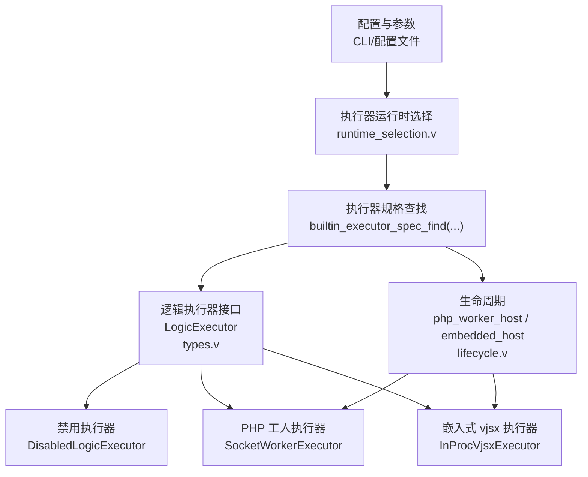
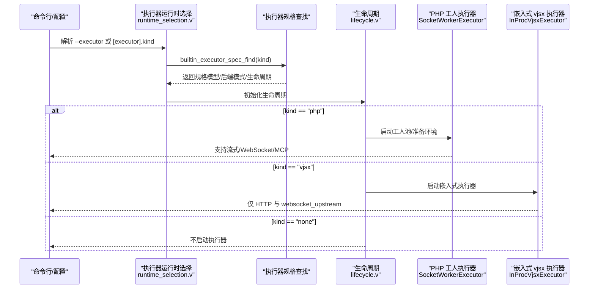
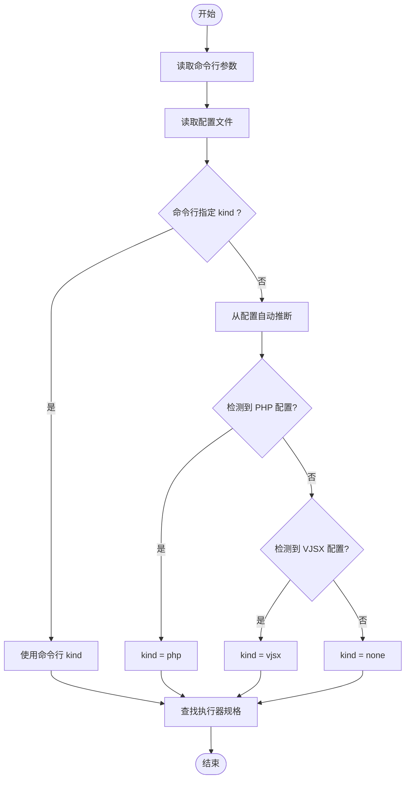
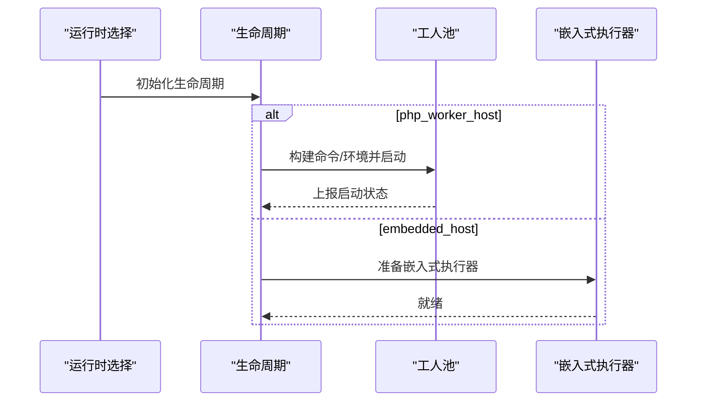
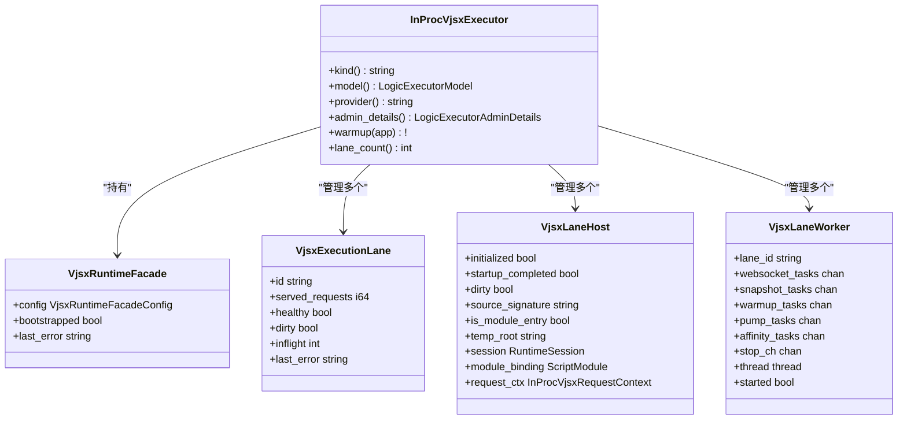
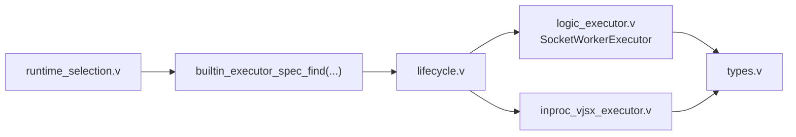

# 执行器类型

<cite>
**本文引用的文件**
- [EXECUTOR_MODES.md](file://docs/EXECUTOR_MODES.md)
- [runtime_selection.v](file://src/executor/runtime_selection.v)
- [types.v](file://src/executor/types.v)
- [logic_executor.v](file://src/executor/logic_executor.v)
- [inproc_vjsx_executor.v](file://src/executor/inproc_vjsx_executor.v)
- [lifecycle.v](file://src/executor/lifecycle.v)
- [vhttpd.example.toml](file://config/vhttpd.example.toml)
- [server_logic_test.v](file://src/server_logic_test.v)
- [executor_registry.v](file://src/executor_registry.v)
</cite>

## 目录
1. [简介](#简介)
2. [项目结构](#项目结构)
3. [核心组件](#核心组件)
4. [架构总览](#架构总览)
5. [详细组件分析](#详细组件分析)
6. [依赖分析](#依赖分析)
7. [性能考量](#性能考量)
8. [故障排查指南](#故障排查指南)
9. [结论](#结论)
10. [附录](#附录)

## 简介
本文件系统化阐述 vhttpd 的“执行器类型”（ExecutorConfig 中的 kind 字段）及其运行时行为，重点覆盖以下内容：
- kind 取值与含义：php、vjsx、none
- 每种执行器的本质差异：worker 模型 vs embedded 模型；后端工作进程是否必需
- 各执行器的适用场景、性能特征与限制
- 选择原则：资源消耗、启动时间、隔离性、能力覆盖
- 配置示例与最佳实践
- 与站点配置的匹配关系与选型建议

## 项目结构
围绕执行器类型的关键代码与文档分布如下：
- 文档层：EXECUTOR_MODES.md 提供两种内置执行器的使用说明与行为差异
- 运行时选择：runtime_selection.v 负责从命令行或配置推断 kind，并解析具体执行器规格
- 类型与接口：types.v 定义执行器模型枚举、后端模式枚举与通用调度类型
- 执行器实现：logic_executor.v 定义逻辑执行器接口及内置实现（禁用、PHP 工人、嵌入式）
- 嵌入式执行器：inproc_vjsx_executor.v 实现 vjsx 嵌入式执行器，含多 lane 并发与签名刷新机制
- 生命周期：lifecycle.v 定义两类生命周期（php_worker_host、embedded_host），分别处理工人池与嵌入式启动/停止
- 示例配置：vhttpd.example.toml 展示 php 执行器的最小配置形态
- 测试与注册：server_logic_test.v 与 executor_registry.v 验证与暴露执行器规格

**图表来源**
- [runtime_selection.v:12-30](file://src/executor/runtime_selection.v#L12-L30)
- [types.v:66-74](file://src/executor/types.v#L66-L74)
- [logic_executor.v:8-21](file://src/executor/logic_executor.v#L8-L21)
- [lifecycle.v:84-159](file://src/executor/lifecycle.v#L84-L159)

**章节来源**
- [EXECUTOR_MODES.md:1-136](file://docs/EXECUTOR_MODES.md#L1-L136)
- [runtime_selection.v:1-31](file://src/executor/runtime_selection.v#L1-L31)
- [types.v:66-74](file://src/executor/types.v#L66-L74)

## 核心组件
- kind 取值与映射
  - php：对应 worker 模型，需要后端工作进程（Unix socket），支持流式、WebSocket、MCP 等
  - vjsx：对应 embedded 模型，无需后端工作进程，仅在进程内执行，当前覆盖 HTTP 与 websocket_upstream
  - none：禁用逻辑执行器，不启动任何执行路径
- 逻辑执行器模型与后端模式
  - 模型：worker 或 embedded
  - 后端模式：required 或 disabled
- 生命周期标签
  - php_worker_host：PHP 工人宿主生命周期
  - embedded_host：嵌入式宿主生命周期

这些定义与行为在以下文件中明确给出：
- kind 推断与解析：runtime_selection.v
- 枚举与接口：types.v
- 具体实现：logic_executor.v、inproc_vjsx_executor.v
- 生命周期：lifecycle.v
- 行为说明：EXECUTOR_MODES.md

**章节来源**
- [runtime_selection.v:12-30](file://src/executor/runtime_selection.v#L12-L30)
- [types.v:66-74](file://src/executor/types.v#L66-L74)
- [logic_executor.v:8-21](file://src/executor/logic_executor.v#L8-L21)
- [EXECUTOR_MODES.md:1-136](file://docs/EXECUTOR_MODES.md#L1-L136)
- [lifecycle.v:84-159](file://src/executor/lifecycle.v#L84-L159)

## 架构总览
下图展示执行器选择与生命周期的关系，以及两种执行器在运行时的差异：

**图表来源**
- [runtime_selection.v:23-30](file://src/executor/runtime_selection.v#L23-L30)
- [lifecycle.v:84-159](file://src/executor/lifecycle.v#L84-L159)
- [logic_executor.v:100-233](file://src/executor/logic_executor.v#L100-L233)
- [inproc_vjsx_executor.v:442-513](file://src/executor/inproc_vjsx_executor.v#L442-L513)

## 详细组件分析

### 执行器类型与行为对比
- php（worker 模型，后端必需）
  - 特点：通过 Unix socket 与 PHP 工人通信；支持流式、WebSocket 会话、MCP、上游计划等
  - 适用场景：已有 PHP 应用生态、需要与现有扩展/运行时兼容
  - 性能特征：启动时间受工人进程影响；并发通过工人池与队列管理；隔离性较好
- vjsx（embedded 模型，后端禁用）
  - 特点：在进程内直接执行，无外部工人；当前覆盖 HTTP 与 websocket_upstream
  - 适用场景：轻量逻辑、快速迭代、减少进程间开销
  - 性能特征：启动快、无跨进程通信；受限于嵌入式运行时能力与线程数
- none（禁用）
  - 特点：不启动任何执行器；用于纯代理/转发或仅启用其他能力
  - 适用场景：仅需路由/静态资源/上游转发

以上差异由文档与实现共同定义。

**章节来源**
- [EXECUTOR_MODES.md:25-136](file://docs/EXECUTOR_MODES.md#L25-L136)
- [logic_executor.v:100-233](file://src/executor/logic_executor.v#L100-L233)
- [inproc_vjsx_executor.v:519-544](file://src/executor/inproc_vjsx_executor.v#L519-L544)

### 执行器选择流程
执行器选择由运行时选择模块完成，优先级为：命令行覆盖 > 配置项 > 自动推断。

**图表来源**
- [runtime_selection.v:12-30](file://src/executor/runtime_selection.v#L12-L30)

**章节来源**
- [runtime_selection.v:12-30](file://src/executor/runtime_selection.v#L12-L30)

### 生命周期与后端模式
- php_worker_host
  - 准备阶段：构建工人命令与环境变量（注入应用入口）
  - 启动阶段：按 socket 列表启动工人池，记录启动事件
  - 停止阶段：停止工人池
- embedded_host
  - 准备阶段：清空工人 socket、禁用流式分发、禁用工人自动启动
  - 启动/停止：空操作（嵌入式执行器自管理）

**图表来源**
- [lifecycle.v:84-159](file://src/executor/lifecycle.v#L84-L159)

**章节来源**
- [lifecycle.v:84-159](file://src/executor/lifecycle.v#L84-L159)

### vjsx 嵌入式执行器内部结构
- 多 lane 并发：每个 lane 对应一个执行主机与工作线程
- 签名刷新：基于源码探针与签名的增量刷新循环
- WebSocket 亲和与任务队列：连接到 lane 的亲和决策与消息投递
- 热身与监控：按 lane 热身、统计活跃请求数与错误

**图表来源**
- [inproc_vjsx_executor.v:180-186](file://src/executor/inproc_vjsx_executor.v#L180-L186)
- [inproc_vjsx_executor.v:78-95](file://src/executor/inproc_vjsx_executor.v#L78-L95)
- [inproc_vjsx_executor.v:104-152](file://src/executor/inproc_vjsx_executor.v#L104-L152)
- [inproc_vjsx_executor.v:429-440](file://src/executor/inproc_vjsx_executor.v#L429-L440)

**章节来源**
- [inproc_vjsx_executor.v:442-513](file://src/executor/inproc_vjsx_executor.v#L442-L513)
- [inproc_vjsx_executor.v:519-544](file://src/executor/inproc_vjsx_executor.v#L519-L544)

### 执行器规格与别名测试
- 规格暴露：/admin/executors 返回内置执行器规格快照
- 别名映射：php-worker/php_worker → php；none/disabled/noop → none；vjsx → vjsx
- 模型与后端模式：php 为 worker + required；vjsx 为 embedded + disabled；none 为 worker + disabled

**章节来源**
- [server_logic_test.v:1129-1151](file://src/server_logic_test.v#L1129-L1151)
- [server_logic_test.v:1054-1061](file://src/server_logic_test.v#L1054-L1061)
- [server_logic_test.v:1063-1088](file://src/server_logic_test.v#L1063-L1088)

## 依赖分析
- 运行时选择依赖执行器规格查找函数，后者返回模型、后端模式与生命周期
- 生命周期决定是否启动工人池与如何准备环境变量
- 执行器实现依赖传输层协议与运行时（如 vjsx 运行时）

**图表来源**
- [runtime_selection.v:23-30](file://src/executor/runtime_selection.v#L23-L30)
- [lifecycle.v:84-159](file://src/executor/lifecycle.v#L84-L159)
- [logic_executor.v:100-233](file://src/executor/logic_executor.v#L100-L233)
- [inproc_vjsx_executor.v:442-513](file://src/executor/inproc_vjsx_executor.v#L442-L513)

**章节来源**
- [runtime_selection.v:23-30](file://src/executor/runtime_selection.v#L23-L30)
- [lifecycle.v:84-159](file://src/executor/lifecycle.v#L84-L159)

## 性能考量
- 资源消耗
  - php：额外进程与 socket 通信带来一定内存与上下文切换开销
  - vjsx：单进程内执行，减少进程间通信，但受嵌入式运行时与线程数限制
- 启动时间
  - php：受工人进程冷启动与扩展加载影响
  - vjsx：嵌入式启动更快，但首次热身与签名刷新可能有延迟
- 隔离性
  - php：进程隔离，崩溃不影响主进程
  - vjsx：与主进程共享地址空间，需注意异常传播与资源竞争
- 能力覆盖
  - php：完整支持流式、WebSocket、MCP、上游计划
  - vjsx：当前聚焦 HTTP 与 websocket_upstream，流式与 MCP 在此模式下被禁用

**章节来源**
- [EXECUTOR_MODES.md:69-121](file://docs/EXECUTOR_MODES.md#L69-L121)
- [lifecycle.v:139-159](file://src/executor/lifecycle.v#L139-L159)

## 故障排查指南
- 执行器未启用
  - 确认 [executor].kind 设置正确；可通过 /admin/executors 查看规格快照
- php 执行器无法启动工人
  - 检查 [worker].autostart、socket 前缀与权限；查看生命周期事件日志
- vjsx 执行器无响应
  - 检查 [vjsx].app_entry/module_root/build_root 是否正确；确认线程数与运行时配置
- 能力不可用
  - 若使用 vjsx，流式/WebSocket 会话与 MCP 在此模式下被禁用，需切换到 php

**章节来源**
- [server_logic_test.v:1129-1151](file://src/server_logic_test.v#L1129-L1151)
- [EXECUTOR_MODES.md:17](file://docs/EXECUTOR_MODES.md#L17)
- [EXECUTOR_MODES.md:115-121](file://docs/EXECUTOR_MODES.md#L115-L121)

## 结论
- php 执行器适合需要与现有 PHP 生态深度集成、需要完整能力集（流式/WebSocket/MCP）的场景
- vjsx 执行器适合轻量逻辑、快速迭代与低开销的嵌入式执行
- none 执行器用于完全禁用逻辑执行器的场景
- 选择执行器类型时应综合考虑：资源消耗、启动时间、隔离性与能力覆盖

## 附录

### 配置示例与最佳实践
- php 执行器（最小形态）
  - 参考：[vhttpd.example.toml:28-46](file://config/vhttpd.example.toml#L28-L46)
  - 关键字段：[executor].kind = "php"；[php].worker_entry、[php].app_entry、[php].extensions；[worker].autostart、pool_size、socket_prefix
- vjsx 执行器（最小形态）
  - 参考：[EXECUTOR_MODES.md:86-104](file://docs/EXECUTOR_MODES.md#L86-L104)
  - 关键字段：[executor].kind = "vjsx"；[vjsx].app_entry、module_root、build_root、runtime_profile、thread_count
- 快速切换规则
  - 保持通用配置不变，仅变更 [executor].kind；php 保留 [worker]，vjsx 保留 [vjsx]

**章节来源**
- [vhttpd.example.toml:28-46](file://config/vhttpd.example.toml#L28-L46)
- [EXECUTOR_MODES.md:25-136](file://docs/EXECUTOR_MODES.md#L25-L136)