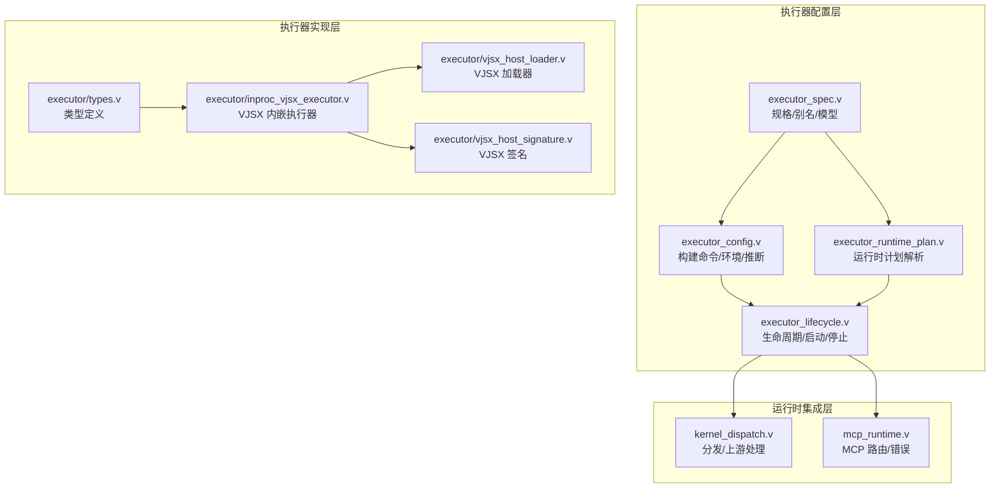
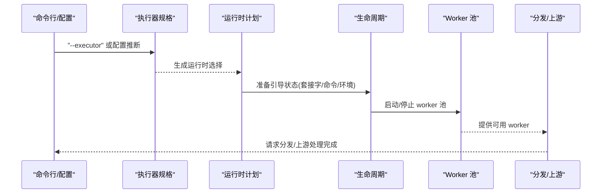
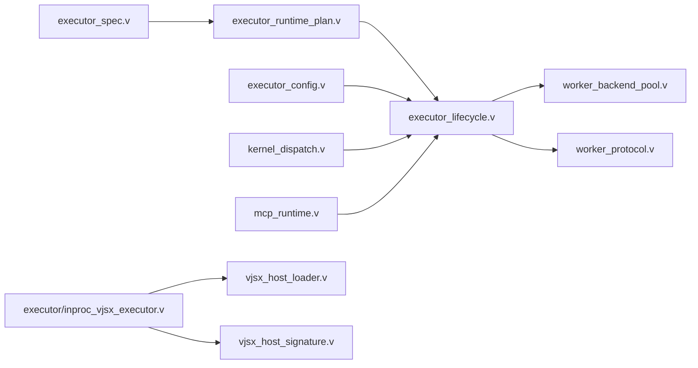

# 执行器配置

<cite>
**本文引用的文件**
- [executor_config.v](file://src/executor_config.v)
- [executor_lifecycle.v](file://src/executor_lifecycle.v)
- [executor_runtime_plan.v](file://src/executor_runtime_plan.v)
- [executor_spec.v](file://src/executor_spec.v)
- [types.v](file://src/executor/types.v)
- [inproc_vjsx_executor.v](file://src/executor/inproc_vjsx_executor.v)
- [mcp_runtime.v](file://src/mcp_runtime.v)
- [kernel_dispatch.v](file://src/kernel_dispatch.v)
- [server_logic_test.v](file://src/server_logic_test.v)
- [vjsx_host_loader.v](file://src/executor/vjsx_host_loader.v)
- [vjsx_host_signature.v](file://src/executor/vjsx_host_signature.v)
- [vhttpd.example.toml](file://config/vhttpd.example.toml)
- [vjsx.example.toml](file://config/vjsx.example.toml)
- [multi.example.toml](file://config/vhttpd.multi.example.toml)
</cite>

## 目录
1. [简介](#简介)
2. [项目结构](#项目结构)
3. [核心组件](#核心组件)
4. [架构总览](#架构总览)
5. [详细组件分析](#详细组件分析)
6. [依赖关系分析](#依赖关系分析)
7. [性能考虑](#性能考虑)
8. [故障排查指南](#故障排查指南)
9. [结论](#结论)
10. [附录](#附录)

## 简介
本文件系统性阐述 vhttpd 的执行器配置，重点围绕 ExecutorConfig 结构体与不同执行器类型（PHP Worker、VJSX 内嵌执行器、MCP 执行器）的配置差异，解释执行器模式选择原则（direct、dispatch、upstream_plan），说明执行器级别的 worker 设置（进程池大小、超时、重启策略），并提供面向不同应用场景的最佳实践配置示例。同时阐明执行器配置与站点配置的关系及优先级规则，并给出性能调优与故障排查的实用建议。

## 项目结构
围绕执行器配置的关键源码分布在以下模块：
- 配置构建与推断：src/executor_config.v
- 生命周期与启动控制：src/executor_lifecycle.v
- 运行时计划解析：src/executor_runtime_plan.v
- 执行器规格与别名：src/executor_spec.v
- 执行器类型定义：src/executor/types.v
- VJSX 内嵌执行器实现：src/executor/inproc_vjsx_executor.v
- VJSX 主机加载与签名：src/executor/vjsx_host_loader.v、src/executor/vjsx_host_signature.v
- MCP 路由与错误处理：src/mcp_runtime.v
- 分发与上游处理入口：src/kernel_dispatch.v
- 示例配置：config/vhttpd.example.toml、config/vjsx.example.toml、config/vhttpd.multi.example.toml
- 行为验证测试：src/server_logic_test.v

图表来源
- [executor_config.v:45-100](file://src/executor_config.v#L45-L100)
- [executor_lifecycle.v:17-113](file://src/executor_lifecycle.v#L17-L113)
- [executor_runtime_plan.v](file://src/executor_runtime_plan.v)
- [executor_spec.v](file://src/executor_spec.v)
- [types.v](file://src/executor/types.v)
- [inproc_vjsx_executor.v](file://src/executor/inproc_vjsx_executor.v)
- [vjsx_host_loader.v](file://src/executor/vjsx_host_loader.v)
- [vjsx_host_signature.v](file://src/executor/vjsx_host_signature.v)
- [kernel_dispatch.v:99-121](file://src/kernel_dispatch.v#L99-L121)
- [mcp_runtime.v:493-531](file://src/mcp_runtime.v#L493-L531)

章节来源
- [executor_config.v:45-100](file://src/executor_config.v#L45-L100)
- [executor_lifecycle.v:17-113](file://src/executor_lifecycle.v#L17-L113)
- [executor_runtime_plan.v](file://src/executor_runtime_plan.v)
- [executor_spec.v](file://src/executor_spec.v)
- [types.v](file://src/executor/types.v)
- [inproc_vjsx_executor.v](file://src/executor/inproc_vjsx_executor.v)
- [vjsx_host_loader.v](file://src/executor/vjsx_host_loader.v)
- [vjsx_host_signature.v](file://src/executor/vjsx_host_signature.v)
- [kernel_dispatch.v:99-121](file://src/kernel_dispatch.v#L99-L121)
- [mcp_runtime.v:493-531](file://src/mcp_runtime.v#L493-L531)

## 核心组件
- ExecutorConfig 与配置构建
  - PHP Worker 命令构建：根据可执行路径、扩展、参数与工作入口拼装命令行，支持环境变量注入。
  - 推断执行器类型：依据配置中 PHP/VJSX 字段是否存在，自动推断执行器种类。
  - 运行时选择：通过 --executor 指定或从配置推断，结合内置规格生成运行时选择结果。
- 执行器生命周期
  - DisabledExecutorLifecycle：禁用模式，不启动 worker 后端。
  - PhpWorkerExecutorLifecycle：PHP Worker 模式，准备环境与命令，按需启动 worker 池。
  - EmbeddedExecutorLifecycle：内嵌主机模式（如 VJSX），不依赖外部 worker。
- 运行时计划
  - 解析逻辑执行器运行时计划，决定执行器种类、生命周期、worker 后端模式、引导状态（套接字、流分发、WS 分发、自动启动、命令与环境）。
- 执行器规格
  - 内置规格暴露逻辑模型（worker/embedded）、后端模式（required/disabled）、提供者名称、配置表面字段（如 app_entry、worker_entry、thread_count 等）与别名映射。

章节来源
- [executor_config.v:45-100](file://src/executor_config.v#L45-L100)
- [executor_lifecycle.v:17-113](file://src/executor_lifecycle.v#L17-L113)
- [executor_runtime_plan.v](file://src/executor_runtime_plan.v)
- [executor_spec.v](file://src/executor_spec.v)
- [server_logic_test.v:1042-1101](file://src/server_logic_test.v#L1042-L1101)
- [server_logic_test.v:1210-1282](file://src/server_logic_test.v#L1210-L1282)

## 架构总览
下图展示了执行器配置在启动流程中的关键交互：从命令行与配置推断执行器种类，到构建命令与环境，再到生命周期驱动 worker 启停与分发路由。

图表来源
- [executor_spec.v](file://src/executor_spec.v)
- [executor_runtime_plan.v](file://src/executor_runtime_plan.v)
- [executor_lifecycle.v:59-106](file://src/executor_lifecycle.v#L59-L106)
- [kernel_dispatch.v:99-121](file://src/kernel_dispatch.v#L99-L121)

## 详细组件分析

### ExecutorConfig 结构体与配置差异
- PHP Worker 配置要点
  - 可执行路径与扩展：支持指定 PHP 可执行文件与扩展路径列表，扩展以 -d extension=... 注入。
  - 参数与应用入口：支持传入额外参数；应用入口通过环境变量注入。
  - 命令构建：将二进制、扩展、参数与工作入口拼接为最终命令行。
- VJSX 内嵌执行器配置要点
  - 应用入口与模块根：通过 app_entry、module_root、build_root、signature_root 等字段控制运行时行为。
  - 线程数与运行时配置：thread_count 控制并发线程数，runtime_profile 控制运行时特性（如 node）。
  - 不启用外部 worker：worker_backend_mode 为 disabled，不参与 worker 池管理。
- MCP 执行器配置要点
  - 通过 /mcp 路由接入，要求已配置逻辑执行器；若未配置 worker，返回 501 错误。
  - 方法限制为 POST，非 POST 返回 405；跨域来源校验失败返回 403。
- 配置优先级与推断
  - 命令行 --executor 优先于配置推断；若两者均为空，则根据 PHP/VJSX 字段存在与否进行推断。
  - 测试覆盖了默认禁用、PHP Worker 默认、VJSX 内嵌等场景的行为断言。

章节来源
- [executor_config.v:45-100](file://src/executor_config.v#L45-L100)
- [executor_lifecycle.v:59-106](file://src/executor_lifecycle.v#L59-L106)
- [mcp_runtime.v:493-531](file://src/mcp_runtime.v#L493-L531)
- [server_logic_test.v:1042-1101](file://src/server_logic_test.v#L1042-L1101)
- [server_logic_test.v:1210-1282](file://src/server_logic_test.v#L1210-L1282)

### 执行器模式选择原则
- direct 模式
  - 适用于无需外部 worker 的内嵌执行器（如 VJSX）。worker_backend_mode 为 disabled，不启动 worker 池。
- dispatch 模式
  - 适用于需要 worker 池承载请求的执行器（如 PHP Worker）。worker_backend_mode 为 required，启动 worker 池并进行请求分发。
- upstream_plan 模式
  - 通过上游计划进行请求路由与处理，常见于 WebSocket 上游分发场景。入口位于 kernel_dispatch 中的上游处理函数。

章节来源
- [executor_spec.v](file://src/executor_spec.v)
- [executor_runtime_plan.v](file://src/executor_runtime_plan.v)
- [kernel_dispatch.v:117-121](file://src/kernel_dispatch.v#L117-L121)

### 执行器级别的 worker 设置
- 进程池大小
  - 由 worker_backend.sockets 数量与启动参数共同决定；启动时会尝试按套接字数量创建对应 worker。
- 超时配置
  - 在 worker 协议与传输层定义，具体数值取决于运行时计划与配置；可通过命令行参数调整。
- 重启策略
  - 生命周期在启动阶段记录重启调度事件；若初始启动失败，会安排后续重试并发出事件通知。
- 自动启动
  - 受 worker_autostart 控制；禁用模式下不会自动启动。

章节来源
- [executor_lifecycle.v:69-106](file://src/executor_lifecycle.v#L69-L106)
- [server_logic_test.v:1210-1282](file://src/server_logic_test.v#L1210-L1282)

### 执行器与站点配置的关系
- 配置来源
  - 服务器运行时配置由 resolve_server_runtime_config 解析，结合命令行参数与配置文件生成最终计划。
- 优先级规则
  - 命令行参数优先于配置文件；若命令行未显式指定执行器，则根据配置文件中的 PHP/VJSX 字段进行推断。
- 配置片段示例
  - vhttpd.example.toml：基础示例，包含通用服务器配置与执行器节段。
  - vjsx.example.toml：VJSX 执行器专用示例，展示 app_entry、module_root、build_root、thread_count 等字段。
  - vhttpd.multi.example.toml：多实例或多站点示例，体现执行器在多配置场景下的组织方式。

章节来源
- [server_logic_test.v:1477-1499](file://src/server_logic_test.v#L1477-L1499)
- [vhttpd.example.toml](file://config/vhttpd.example.toml)
- [vjsx.example.toml](file://config/vjsx.example.toml)
- [multi.example.toml](file://config/vhttpd.multi.example.toml)

### 配置示例与最佳实践
- PHP Worker 场景
  - 适用：传统 PHP 应用，需要稳定进程隔离与扩展支持。
  - 关键配置：php.bin、php.extensions、php.args、php.worker_entry、php.app_entry。
  - 最佳实践：将扩展路径与参数集中管理；通过环境变量注入应用入口；确保 worker 套接字可用且权限正确。
- VJSX 内嵌场景
  - 适用：前端/脚本语言应用，追求低延迟与高并发线程模型。
  - 关键配置：vjsx.app_entry、vjsx.module_root、vjsx.build_root、vjsx.signature_root、vjsx.thread_count、vjsx.runtime_profile。
  - 最佳实践：合理设置线程数；开启文件系统访问需谨慎评估安全与性能；构建缓存目录独立管理。
- MCP 场景
  - 适用：需要通过 /mcp 路由接入的工具/能力服务。
  - 关键配置：确保已配置逻辑执行器；严格限制方法为 POST；校验来源策略。
  - 最佳实践：仅允许受信来源；对非 POST 请求及时拒绝；错误响应包含 trace_id 便于追踪。

章节来源
- [executor_config.v:45-100](file://src/executor_config.v#L45-L100)
- [executor_lifecycle.v:59-106](file://src/executor_lifecycle.v#L59-L106)
- [mcp_runtime.v:493-531](file://src/mcp_runtime.v#L493-L531)
- [vjsx.example.toml](file://config/vjsx.example.toml)

## 依赖关系分析
- 组件耦合
  - executor_spec 与 executor_runtime_plan 共同决定执行器种类与生命周期。
  - executor_config 为 executor_lifecycle 提供命令与环境准备。
  - kernel_dispatch 与 mcp_runtime 依赖已配置的逻辑执行器与 worker 后端。
- 外部依赖
  - PHP Worker 依赖 PHP 可执行文件与扩展；VJSX 依赖模块/构建/签名根目录；MCP 依赖正确的路由与来源校验。

图表来源
- [executor_spec.v](file://src/executor_spec.v)
- [executor_runtime_plan.v](file://src/executor_runtime_plan.v)
- [executor_lifecycle.v:59-106](file://src/executor_lifecycle.v#L59-L106)
- [executor_config.v:45-100](file://src/executor_config.v#L45-L100)
- [kernel_dispatch.v:99-121](file://src/kernel_dispatch.v#L99-L121)
- [mcp_runtime.v:493-531](file://src/mcp_runtime.v#L493-L531)
- [inproc_vjsx_executor.v](file://src/executor/inproc_vjsx_executor.v)
- [vjsx_host_loader.v](file://src/executor/vjsx_host_loader.v)
- [vjsx_host_signature.v](file://src/executor/vjsx_host_signature.v)

## 性能考虑
- 并发与线程
  - VJSX 通过 thread_count 控制并发线程数；应结合 CPU 核心数与任务类型进行权衡。
- 进程池规模
  - PHP Worker 的进程池大小与套接字数量一致；过多套接字可能增加上下文切换开销。
- 超时与资源
  - 合理设置请求超时与 worker 超时，避免长时间阻塞导致资源耗尽。
- 缓存与构建
  - VJSX 的 build_root 与 signature_root 应置于高性能存储；定期清理过期缓存。
- 分发策略
  - upstream_plan 适合长连接/实时场景；dispatch 适合短请求/高吞吐场景。

## 故障排查指南
- MCP 路由问题
  - 若返回 501，请确认已配置逻辑执行器；若返回 405，请检查请求方法是否为 POST；若返回 403，请检查来源校验策略。
- Worker 启动失败
  - 生命周期会在启动后发出事件，包含 worker_id、socket、restart_count 等信息；检查命令行、环境变量与套接字权限。
- VJSX 内嵌异常
  - 检查 app_entry 是否可读；module_root/build_root/signature_root 是否存在且权限正确；线程数是否过高导致资源不足。
- 配置优先级误判
  - 确认命令行 --executor 是否被正确传递；若为空，检查配置文件中 PHP/VJSX 字段是否存在。

章节来源
- [mcp_runtime.v:493-531](file://src/mcp_runtime.v#L493-L531)
- [executor_lifecycle.v:69-106](file://src/executor_lifecycle.v#L69-L106)
- [server_logic_test.v:1210-1282](file://src/server_logic_test.v#L1210-L1282)

## 结论
执行器配置是 vhttpd 运行时的核心，直接影响性能、稳定性与可维护性。通过明确不同执行器类型的配置差异、选择合适的执行器模式、合理设置 worker 与线程参数，并遵循配置优先级规则，可以在多种应用场景下获得最优效果。配合 MCP 与上游分发机制，可进一步提升系统的扩展性与可观测性。

## 附录
- 配置文件参考
  - vhttpd.example.toml：通用服务器与执行器示例
  - vjsx.example.toml：VJSX 执行器专用示例
  - vhttpd.multi.example.toml：多站点/多实例示例
- 关键实现参考
  - executor_config.v：命令构建与环境注入
  - executor_lifecycle.v：生命周期与 worker 启停
  - executor_runtime_plan.v：运行时计划解析
  - executor_spec.v：执行器规格与别名
  - inproc_vjsx_executor.v：VJSX 内嵌执行器
  - vjsx_host_loader.v、vjsx_host_signature.v：VJSX 主机加载与签名
  - mcp_runtime.v：MCP 路由与错误处理
  - kernel_dispatch.v：上游分发入口