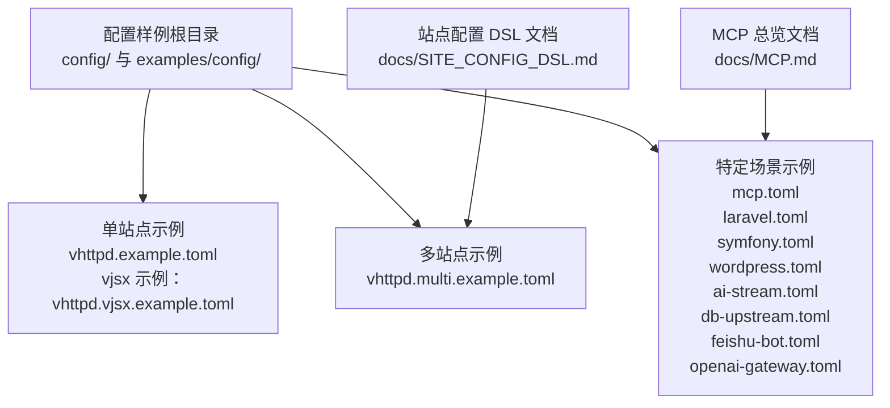
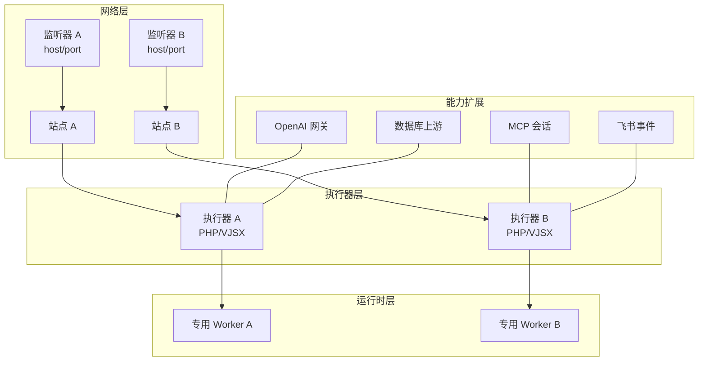
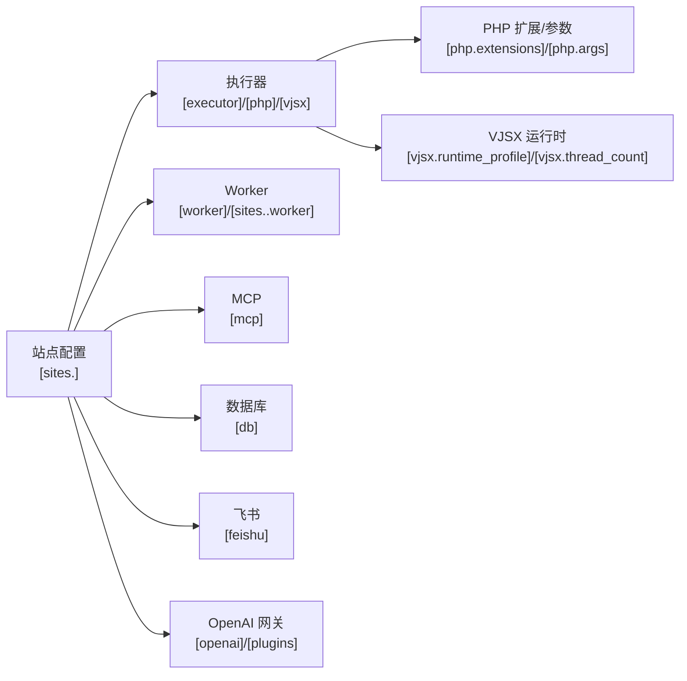
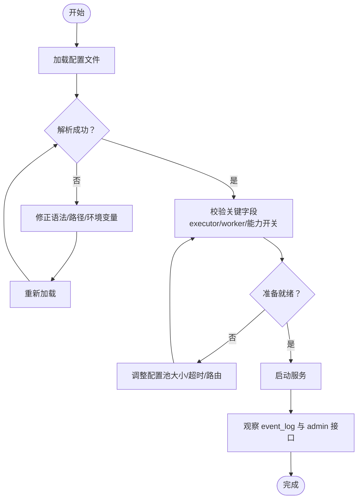

# 执行器配置示例

<cite>
**本文引用的文件**
- [vhttpd.example.toml](file://config/vhttpd.example.toml)
- [vhttpd.multi.example.toml](file://config/vhttpd.multi.example.toml)
- [vhttpd.vjsx.example.toml](file://config/vhttpd.vjsx.example.toml)
- [hello.toml](file://examples/config/hello.toml)
- [mcp.toml](file://examples/config/mcp.toml)
- [laravel.toml](file://examples/config/laravel.toml)
- [symfony.toml](file://examples/config/symfony.toml)
- [wordpress.toml](file://examples/config/wordpress.toml)
- [ai-stream.toml](file://examples/config/ai-stream.toml)
- [db-upstream.toml](file://examples/config/db-upstream.toml)
- [feishu-bot.toml](file://examples/config/feishu-bot.toml)
- [openai-gateway.toml](file://examples/config/openai-gateway.toml)
- [SITE_CONFIG_DSL.md](file://docs/SITE_CONFIG_DSL.md)
- [MCP.md](file://docs/MCP.md)
</cite>

## 目录
1. [简介](#简介)
2. [项目结构](#项目结构)
3. [核心组件](#核心组件)
4. [架构总览](#架构总览)
5. [详细组件分析](#详细组件分析)
6. [依赖关系分析](#依赖关系分析)
7. [性能考量](#性能考量)
8. [故障排查指南](#故障排查指南)
9. [结论](#结论)
10. [附录](#附录)

## 简介
本文件面向 vhttpd 执行器的使用者，提供从入门到进阶的配置示例与最佳实践，涵盖 PHP 应用、VJSX 应用、MCP 应用以及混合场景（多站点、多监听器）的配置方法。内容包括：
- 配置模板与快速开始步骤
- 开发与生产环境差异
- 多站点与多监听器的组织方式
- 配置验证与调试方法
- 常见错误识别与修复
- 配置迁移与升级策略

## 项目结构
vhttpd 提供多种配置样例，分别位于 config 与 examples/config 目录中。这些样例展示了单站点与多站点模式、PHP 与 VJSX 执行器、以及集成 MCP、数据库上游、飞书机器人、OpenAI 网关等能力的配置方式。

图表来源
- [vhttpd.example.toml:1-67](file://config/vhttpd.example.toml#L1-L67)
- [vhttpd.multi.example.toml:1-73](file://config/vhttpd.multi.example.toml#L1-L73)
- [vhttpd.vjsx.example.toml:1-37](file://config/vhttpd.vjsx.example.toml#L1-L37)
- [mcp.toml:1-39](file://examples/config/mcp.toml#L1-L39)
- [laravel.toml:1-23](file://examples/config/laravel.toml#L1-L23)
- [symfony.toml:1-22](file://examples/config/symfony.toml#L1-L22)
- [wordpress.toml:1-23](file://examples/config/wordpress.toml#L1-L23)
- [ai-stream.toml:1-22](file://examples/config/ai-stream.toml#L1-L22)
- [db-upstream.toml:1-45](file://examples/config/db-upstream.toml#L1-L45)
- [feishu-bot.toml:1-40](file://examples/config/feishu-bot.toml#L1-L40)
- [openai-gateway.toml:1-65](file://examples/config/openai-gateway.toml#L1-L65)
- [SITE_CONFIG_DSL.md:1-182](file://docs/SITE_CONFIG_DSL.md#L1-L182)
- [MCP.md:1-185](file://docs/MCP.md#L1-L185)

章节来源
- [vhttpd.example.toml:1-67](file://config/vhttpd.example.toml#L1-L67)
- [vhttpd.multi.example.toml:1-73](file://config/vhttpd.multi.example.toml#L1-L73)
- [vhttpd.vjsx.example.toml:1-37](file://config/vhttpd.vjsx.example.toml#L1-L37)
- [SITE_CONFIG_DSL.md:1-182](file://docs/SITE_CONFIG_DSL.md#L1-L182)

## 核心组件
- 执行器类型
  - PHP 执行器：通过 PHP Worker 进程承载 PHP 应用逻辑，支持扩展加载与参数传递。
  - VJSX 执行器：通过 Node 风格的运行时承载 TypeScript/JavaScript 应用，支持线程数与模块根路径等配置。
- 多站点与多监听器
  - 单站点：使用 [server] 与 [executor] 等顶层键即可。
  - 多站点：使用 [sites.<id>] 组织多个站点，支持每个站点独立的监听地址、执行器入口与专用 worker。
- 特定能力开关
  - MCP：通过 [mcp] 与相关路由/后端配置启用流式 HTTP 传输与会话管理。
  - 数据库上游：通过 [db] 与驱动配置启用数据库连接池与路由。
  - 飞书：通过 [feishu] 与子段配置启用事件接收与重连策略。
  - OpenAI 网关：通过 [openai] 与 [plugins] 定义后端与路由映射。

章节来源
- [vhttpd.example.toml:28-37](file://config/vhttpd.example.toml#L28-L37)
- [vhttpd.vjsx.example.toml:18-26](file://config/vhttpd.vjsx.example.toml#L18-L26)
- [vhttpd.multi.example.toml:44-72](file://config/vhttpd.multi.example.toml#L44-L72)
- [mcp.toml:24-32](file://examples/config/mcp.toml#L24-L32)
- [db-upstream.toml:15-27](file://examples/config/db-upstream.toml#L15-L27)
- [feishu-bot.toml:28-39](file://examples/config/feishu-bot.toml#L28-L39)
- [openai-gateway.toml:5-44](file://examples/config/openai-gateway.toml#L5-L44)

## 架构总览
下图展示 vhttpd 在多站点模式下的关键交互：每个站点绑定独立监听器，选择执行器（PHP 或 VJSX），并由专用 worker 承载应用逻辑；同时可叠加 MCP、数据库、飞书、OpenAI 等能力。

图表来源
- [vhttpd.multi.example.toml:44-72](file://config/vhttpd.multi.example.toml#L44-L72)
- [openai-gateway.toml:11-44](file://examples/config/openai-gateway.toml#L11-L44)
- [mcp.toml:24-32](file://examples/config/mcp.toml#L24-L32)
- [db-upstream.toml:15-27](file://examples/config/db-upstream.toml#L15-L27)
- [feishu-bot.toml:28-39](file://examples/config/feishu-bot.toml#L28-L39)

## 详细组件分析

### PHP 应用配置（单站点）
- 适用场景
  - 快速启动 PHP 应用（如 Hello、Laravel、Symfony、WordPress 等）
  - 需要扩展加载与参数透传
- 关键要点
  - [executor] 指定 kind=php
  - [php] 指定 bin、worker_entry、app_entry、extensions
  - [worker] 控制 autostart、pool_size、socket_prefix、max_requests 等
- 示例参考
  - [vhttpd.example.toml:28-37](file://config/vhttpd.example.toml#L28-L37)
  - [hello.toml:9-17](file://examples/config/hello.toml#L9-L17)
  - [laravel.toml:9-17](file://examples/config/laravel.toml#L9-L17)
  - [symfony.toml:9-16](file://examples/config/symfony.toml#L9-L16)
  - [wordpress.toml:9-17](file://examples/config/wordpress.toml#L9-L17)

章节来源
- [vhttpd.example.toml:28-37](file://config/vhttpd.example.toml#L28-L37)
- [hello.toml:9-17](file://examples/config/hello.toml#L9-L17)
- [laravel.toml:9-17](file://examples/config/laravel.toml#L9-L17)
- [symfony.toml:9-16](file://examples/config/symfony.toml#L9-L16)
- [wordpress.toml:9-17](file://examples/config/wordpress.toml#L9-L17)

### VJSX 应用配置（单站点）
- 适用场景
  - TypeScript/JavaScript 应用，需 Node 风格运行时与线程控制
- 关键要点
  - [executor] 指定 kind=vjsx
  - [vjsx] 指定 app_entry、module_root、runtime_profile、thread_count
- 示例参考
  - [vhttpd.vjsx.example.toml:18-26](file://config/vhttpd.vjsx.example.toml#L18-L26)

章节来源
- [vhttpd.vjsx.example.toml:18-26](file://config/vhttpd.vjsx.example.toml#L18-L26)

### 多站点与多监听器（混合配置）
- 适用场景
  - 同机多域名/多端口部署不同应用（PHP + VJSX 混合）
  - 需要为不同站点设置独立 worker、扩展或能力开关
- 关键要点
  - 使用 [sites.<id>] 定义站点，每个站点可独立指定 host/port/root/executor
  - 支持 app 作为执行器入口的快捷别名
  - worker.entry、worker.autostart、worker.pool_size 等可按站点细化
  - VJSX 的 module_root 默认跟随站点 root
- 示例参考
  - [vhttpd.multi.example.toml:44-72](file://config/vhttpd.multi.example.toml#L44-L72)
  - [SITE_CONFIG_DSL.md:38-91](file://docs/SITE_CONFIG_DSL.md#L38-L91)

章节来源
- [vhttpd.multi.example.toml:44-72](file://config/vhttpd.multi.example.toml#L44-L72)
- [SITE_CONFIG_DSL.md:91-148](file://docs/SITE_CONFIG_DSL.md#L91-L148)

### MCP 应用配置
- 适用场景
  - 需要通过 HTTP/SSE 管理会话与采样请求的 MCP 客户端/服务端
- 关键要点
  - [mcp] 控制会话上限、队列长度、TTL、跨域白名单与采样策略
  - 通过 [admin] 暴露运行时状态查询接口
  - PHP 侧通过 VSlim\Mcp\App 注册工具/资源/提示词
- 示例参考
  - [mcp.toml:24-32](file://examples/config/mcp.toml#L24-L32)
  - [MCP.md:1-185](file://docs/MCP.md#L1-L185)

章节来源
- [mcp.toml:24-32](file://examples/config/mcp.toml#L24-L32)
- [MCP.md:12-96](file://docs/MCP.md#L12-L96)

### 数据库上游配置
- 适用场景
  - 将 vhttpd 作为数据库代理/上游，集中管理连接与路由
- 关键要点
  - [db] 启用并配置 socket、驱动类型
  - [db.<driver>] 配置具体驱动参数（如 MySQL）
  - 多站点模式下，可在站点层复用 worker 与扩展
- 示例参考
  - [db-upstream.toml:15-27](file://examples/config/db-upstream.toml#L15-L27)
  - [db-upstream.toml:33-44](file://examples/config/db-upstream.toml#L33-L44)

章节来源
- [db-upstream.toml:15-27](file://examples/config/db-upstream.toml#L15-L27)
- [db-upstream.toml:33-44](file://examples/config/db-upstream.toml#L33-L44)

### 飞书机器人配置
- 适用场景
  - 集成飞书开放平台事件、重连与安全校验
- 关键要点
  - [feishu] 启用并配置 open_base_url、重连延迟、令牌刷新偏移、事件数量限制
  - [feishu.<name>] 配置各应用的 app_id、secret、verification_token、encrypt_key
- 示例参考
  - [feishu-bot.toml:28-39](file://examples/config/feishu-bot.toml#L28-L39)

章节来源
- [feishu-bot.toml:28-39](file://examples/config/feishu-bot.toml#L28-L39)

### OpenAI 网关配置
- 适用场景
  - 将 vhttpd 作为 OpenAI 兼容网关，路由到不同后端（OpenAI/Ollama/自定义）
- 关键要点
  - [openai] 启用并设置 base_path、默认后端、插件
  - [plugins.<name>] 定义执行器型插件（如 openai_gateway、custom_executor）
  - [openai.backends.*] 定义后端类型、URL、超时
  - [openai.routes.*] 将模型名映射到后端
- 示例参考
  - [openai-gateway.toml:5-65](file://examples/config/openai-gateway.toml#L5-L65)

章节来源
- [openai-gateway.toml:5-65](file://examples/config/openai-gateway.toml#L5-L65)

## 依赖关系分析
- 配置层级依赖
  - 多站点模式下，[sites.<id>] 依赖 [server] 的 host/port 与 [executor] 的 kind
  - PHP 执行器依赖 [php] 的 bin/worker_entry/app_entry/extensions
  - VJSX 执行器依赖 [vjsx] 的 app_entry/module_root/runtime_profile/thread_count
  - 能力模块（MCP/DB/飞书/OpenAI）在各自命名空间内配置
- 运行时依赖
  - Worker 进程由 [worker] 或 [sites.<id>.worker] 启动，负责承载执行器与应用
  - 多站点可共享同一进程池，也可按站点隔离

图表来源
- [vhttpd.multi.example.toml:44-72](file://config/vhttpd.multi.example.toml#L44-L72)
- [vhttpd.example.toml:28-37](file://config/vhttpd.example.toml#L28-L37)
- [vhttpd.vjsx.example.toml:18-26](file://config/vhttpd.vjsx.example.toml#L18-L26)
- [mcp.toml:24-32](file://examples/config/mcp.toml#L24-L32)
- [db-upstream.toml:15-27](file://examples/config/db-upstream.toml#L15-L27)
- [feishu-bot.toml:28-39](file://examples/config/feishu-bot.toml#L28-L39)
- [openai-gateway.toml:5-44](file://examples/config/openai-gateway.toml#L5-L44)

## 性能考量
- Worker 池大小与重启退避
  - pool_size、restart_backoff_ms、restart_backoff_max_ms 影响稳定性与重启成本
- 请求生命周期
  - read_timeout_ms 控制读取超时；max_requests 控制长生命周期进程的重启阈值
- 并发与线程
  - VJSX 的 thread_count 与 PHP 的扩展/参数共同决定并发处理能力
- 多站点隔离
  - 通过站点级 worker.entry/autostart/pool_size 实现资源隔离与弹性伸缩

章节来源
- [vhttpd.example.toml:19-26](file://config/vhttpd.example.toml#L19-L26)
- [vhttpd.multi.example.toml:44-72](file://config/vhttpd.multi.example.toml#L44-L72)
- [vhttpd.vjsx.example.toml:21-26](file://config/vhttpd.vjsx.example.toml#L21-L26)

## 故障排查指南
- 常见问题与定位
  - Worker 启动失败：检查 [worker] 的 cmd/entry 与环境变量（如 VSLIM 扩展路径）
  - 执行器入口错误：核对 [php].app_entry 或 [vjsx].app_entry 是否正确
  - 多站点冲突：确认每个站点的 host/port 与 socket_prefix 唯一
  - MCP 会话异常：检查 [mcp] 的 allowed_origins、session_ttl_seconds、sampling_capability_policy
  - 数据库连接失败：核对 [db.mysql] 的主机、端口、账号、密码
  - 飞书事件未达：检查 [feishu] 的 open_base_url、重连与令牌配置
  - OpenAI 路由不生效：核对 [openai.routes.*] 到 [openai.backends.*] 的映射
- 调试建议
  - 查看 event_log 输出，定位阶段与错误上下文
  - 使用 [admin] 接口查看运行时状态（如 MCP 会话列表）
  - 逐步缩小配置范围，先单站点验证，再合并多站点

章节来源
- [hello.toml:13-17](file://examples/config/hello.toml#L13-L17)
- [mcp.toml:24-32](file://examples/config/mcp.toml#L24-L32)
- [db-upstream.toml:20-27](file://examples/config/db-upstream.toml#L20-L27)
- [feishu-bot.toml:28-39](file://examples/config/feishu-bot.toml#L28-L39)
- [openai-gateway.toml:46-65](file://examples/config/openai-gateway.toml#L46-L65)

## 结论
通过上述配置示例与最佳实践，用户可以在 vhttpd 上快速搭建 PHP/VJSX 应用，并根据场景叠加 MCP、数据库、飞书、OpenAI 等能力。多站点与多监听器模式提供了灵活的组织方式，配合 worker 隔离与能力开关，能够满足从开发到生产的多样化需求。

## 附录

### 快速开始模板
- PHP 单站点模板
  - 参考：[vhttpd.example.toml:28-37](file://config/vhttpd.example.toml#L28-L37)
- VJSX 单站点模板
  - 参考：[vhttpd.vjsx.example.toml:18-26](file://config/vhttpd.vjsx.example.toml#L18-L26)
- 多站点模板
  - 参考：[vhttpd.multi.example.toml:44-72](file://config/vhttpd.multi.example.toml#L44-L72)
  - DSL 快捷规则参考：[SITE_CONFIG_DSL.md:91-148](file://docs/SITE_CONFIG_DSL.md#L91-L148)
- MCP 模板
  - 参考：[mcp.toml:24-32](file://examples/config/mcp.toml#L24-L32)
- 数据库上游模板
  - 参考：[db-upstream.toml:15-27](file://examples/config/db-upstream.toml#L15-L27)
- 飞书机器人模板
  - 参考：[feishu-bot.toml:28-39](file://examples/config/feishu-bot.toml#L28-L39)
- OpenAI 网关模板
  - 参考：[openai-gateway.toml:5-65](file://examples/config/openai-gateway.toml#L5-L65)

### 开发与生产环境差异建议
- 开发环境
  - 较小的 pool_size 与较短的 restart_backoff_ms，便于快速迭代
  - 启用较宽松的 allowed_origins（本地调试）
  - 使用本地数据库或轻量后端
- 生产环境
  - 合理设置 pool_size 与 max_requests，平衡吞吐与稳定性
  - 严格限制 allowed_origins，开启采样策略为 error 或 drop
  - 使用高可用数据库与飞书生产环境地址

### 配置验证与调试流程

图表来源
- [vhttpd.example.toml:1-67](file://config/vhttpd.example.toml#L1-L67)
- [vhttpd.multi.example.toml:1-73](file://config/vhttpd.multi.example.toml#L1-L73)
- [mcp.toml:1-39](file://examples/config/mcp.toml#L1-L39)
- [openai-gateway.toml:1-65](file://examples/config/openai-gateway.toml#L1-L65)

### 配置迁移与升级指引
- 从旧写法迁移到新 DSL
  - 旧写法仍兼容，但推荐逐步拍平为 [sites.<id>] 的简洁形态
  - 注意 app、worker.entry、root 的别名与默认行为
- 迁移步骤
  - 逐个站点检查 host/port/root/executor/app/worker.* 字段
  - 将重复的 php/vjsx 子段保留在命名空间内，便于扩展
  - 逐步替换 project_root 为 root，避免歧义
- 升级注意事项
  - 新增能力（如 MCP、OpenAI 网关）时，先在独立站点验证
  - 更新后对比 event_log，确认无异常重启或会话中断

章节来源
- [SITE_CONFIG_DSL.md:150-182](file://docs/SITE_CONFIG_DSL.md#L150-L182)