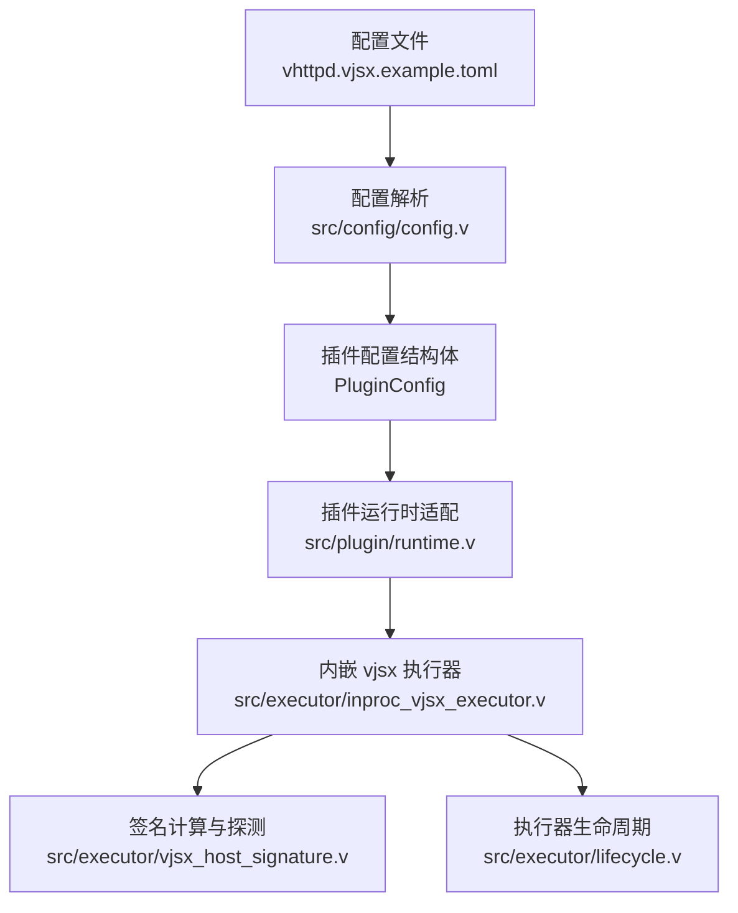
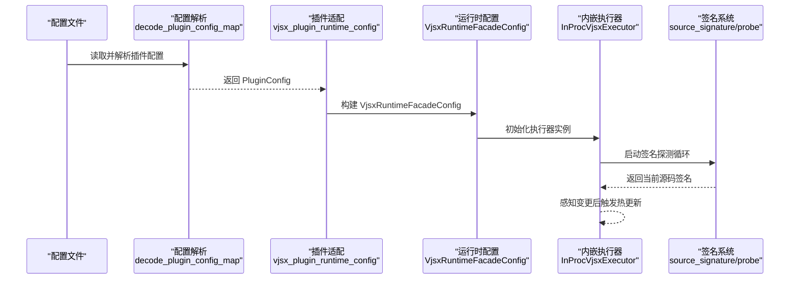
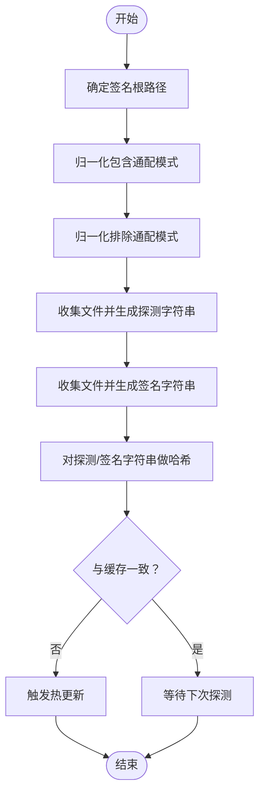
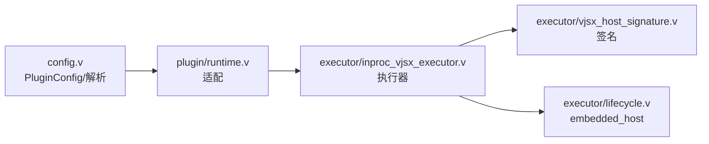

# 插件执行器配置

<cite>
**本文引用的文件列表**
- [config.v](file://src/config/config.v)
- [runtime.v](file://src/plugin/runtime.v)
- [vjsx_host_signature.v](file://src/executor/vjsx_host_signature.v)
- [inproc_vjsx_executor.v](file://src/executor/inproc_vjsx_executor.v)
- [types.v](file://src/executor/types.v)
- [lifecycle.v](file://src/executor/lifecycle.v)
- [vjsx.example.toml](file://config/vhttpd.vjsx.example.toml)
- [hello-handler.mts](file://examples/vjsx/hello-handler.mts)
</cite>

## 目录
1. [简介](#简介)
2. [项目结构](#项目结构)
3. [核心组件](#核心组件)
4. [架构总览](#架构总览)
5. [详细组件分析](#详细组件分析)
6. [依赖关系分析](#依赖关系分析)
7. [性能考量](#性能考量)
8. [故障排查指南](#故障排查指南)
9. [结论](#结论)
10. [附录](#附录)

## 简介
本文件面向 vhttpd 插件执行器的配置与使用，重点围绕 PluginConfig 结构体展开，逐项解释其所有配置项的含义、默认值、解析流程与运行时行为，并结合插件签名验证、执行器生命周期与隔离策略，给出最佳实践与常见问题处理建议。读者无需深入源码即可理解如何正确配置与扩展 vjsx 插件。

## 项目结构
与插件执行器配置相关的核心模块与文件：
- 配置解析与结构体定义：src/config/config.v
- 插件运行时适配与构建：src/plugin/runtime.v
- 插件签名计算与探测：src/executor/vjsx_host_signature.v
- 内嵌 vjsx 执行器与状态机：src/executor/inproc_vjsx_executor.v
- 执行器类型与生命周期接口：src/executor/types.v、src/executor/lifecycle.v
- 示例配置与示例插件入口：config/vhttpd.vjsx.example.toml、examples/vjsx/hello-handler.mts

图表来源
- [vjsx.example.toml:1-37](file://config/vhttpd.vjsx.example.toml#L1-L37)
- [config.v:73-89](file://src/config/config.v#L73-L89)
- [runtime.v:14-46](file://src/plugin/runtime.v#L14-L46)
- [inproc_vjsx_executor.v:442-513](file://src/executor/inproc_vjsx_executor.v#L442-L513)
- [vjsx_host_signature.v:276-295](file://src/executor/vjsx_host_signature.v#L276-L295)
- [lifecycle.v:139-159](file://src/executor/lifecycle.v#L139-L159)

章节来源
- [vjsx.example.toml:1-37](file://config/vhttpd.vjsx.example.toml#L1-L37)
- [config.v:73-89](file://src/config/config.v#L73-L89)

## 核心组件
- PluginConfig：插件执行器的配置载体，支持多种插件类型（默认 vjsx），并包含入口、模块根、构建缓存、签名根与签名规则、运行时配置、线程数、最大请求数以及功能开关等。
- 插件运行时适配：将 PluginConfig 转换为内嵌 vjsx 执行器所需的 VjsxRuntimeFacadeConfig，并创建 InProcVjsxExecutor 实例。
- 签名系统：基于文件内容与时间戳生成稳定哈希，用于检测插件源码变更并触发热更新。
- 执行器生命周期：定义“embedded_host”生命周期，适合内嵌 vjsx 执行器的启动/停止逻辑。

章节来源
- [config.v:73-89](file://src/config/config.v#L73-L89)
- [runtime.v:14-46](file://src/plugin/runtime.v#L14-L46)
- [vjsx_host_signature.v:276-295](file://src/executor/vjsx_host_signature.v#L276-L295)
- [lifecycle.v:139-159](file://src/executor/lifecycle.v#L139-L159)

## 架构总览
下图展示从配置到插件运行时的整体流程：配置文件被解析为 PluginConfig，随后转换为 VjsxRuntimeFacadeConfig 并初始化 InProcVjsxExecutor；执行器内部维护多条“车道”（线程），通过签名探测与刷新机制感知源码变化，实现热更新。

图表来源
- [config.v:605-649](file://src/config/config.v#L605-L649)
- [runtime.v:14-46](file://src/plugin/runtime.v#L14-L46)
- [inproc_vjsx_executor.v:442-513](file://src/executor/inproc_vjsx_executor.v#L442-L513)
- [vjsx_host_signature.v:255-295](file://src/executor/vjsx_host_signature.v#L255-L295)

## 详细组件分析

### PluginConfig 结构体与配置项详解
- kind：插件类型，默认为 vjsx，用于区分不同类型的插件执行器。
- entry：插件入口文件路径，必须存在且可解析。
- app_entry：应用入口文件路径，若未设置则回退到 entry。
- module_root：模块根目录，用于定位依赖与模块解析。
- build_root：构建缓存根目录，用于存放编译产物与缓存。
- signature_root：签名根目录，用于参与签名计算的文件集合根路径。
- signature_include：签名包含的通配模式列表，默认按扩展名匹配 JS/TS 等。
- signature_exclude：签名排除的通配模式列表，默认包含常见忽略目录。
- runtime_profile：运行时配置档，如 script/node 等，影响运行时行为。
- thread_count：执行器线程数（即“车道”数量），决定并发能力。
- max_requests：单个执行器实例的最大请求数限制。
- enable_fs：是否允许插件访问文件系统。
- enable_process：是否允许插件创建子进程。
- enable_network：是否允许插件发起网络请求。

解析与默认值来源：
- 解析函数：decode_plugin_config_map
- 默认值：kind、thread_count、runtime_profile 等
- 路径解析：resolve_config_path
- 变量展开：resolve_config_variables/expand_config_string

章节来源
- [config.v:73-89](file://src/config/config.v#L73-L89)
- [config.v:605-649](file://src/config/config.v#L605-L649)
- [config.v:1415-1456](file://src/config/config.v#L1415-L1456)
- [config.v:1122-1383](file://src/config/config.v#L1122-L1383)

### 插件运行时适配与构建
- 插件入口选择：若 app_entry 为空则回退到 entry。
- 运行时配置映射：将 PluginConfig 字段映射到 VjsxRuntimeFacadeConfig，包括 app_entry、module_root、build_root、signature_root、signature_include/exclude、runtime_profile、thread_count、max_requests、enable_fs/process/network。
- 执行器实例化：new_inproc_vjsx_executor 接收 VjsxRuntimeFacadeConfig 并初始化多车道、工作线程与签名探测状态。

章节来源
- [runtime.v:7-12](file://src/plugin/runtime.v#L7-L12)
- [runtime.v:14-46](file://src/plugin/runtime.v#L14-L46)
- [inproc_vjsx_executor.v:442-513](file://src/executor/inproc_vjsx_executor.v#L442-L513)

### 插件签名验证与热更新
- 签名根路径确定：优先 signature_root，其次 module_root，最后 app_entry 所在目录。
- 包含/排除规则：默认包含 JS/TS 等源文件，排除常见构建与版本控制目录。
- 探测与签名：source_probe 仅收集元信息与文件相对路径，source_signature 还包含文件内容哈希，两者共同构成稳定签名。
- 刷新策略：定期探测（probe）与全量签名（signature）结合，带去抖与全量刷新阈值，避免频繁重建。

图表来源
- [vjsx_host_signature.v:47-58](file://src/executor/vjsx_host_signature.v#L47-L58)
- [vjsx_host_signature.v:60-79](file://src/executor/vjsx_host_signature.v#L60-L79)
- [vjsx_host_signature.v:255-295](file://src/executor/vjsx_host_signature.v#L255-L295)

章节来源
- [vjsx_host_signature.v:276-295](file://src/executor/vjsx_host_signature.v#L276-L295)
- [inproc_vjsx_executor.v:620-681](file://src/executor/inproc_vjsx_executor.v#L620-L681)

### 执行器生命周期与隔离策略
- 生命周期模型：embedded_host 适用于内嵌 vjsx 执行器，不启动外部 worker，仅维护内部状态。
- 隔离策略：每个执行器实例拥有独立的车道（线程池）、会话存储与签名状态，彼此隔离；WebSocket 连接与亲和键通过执行器内部映射进行管理。
- 权限控制：通过 enable_fs/process/network 开关控制插件能力边界，避免越权操作。

章节来源
- [lifecycle.v:139-159](file://src/executor/lifecycle.v#L139-L159)
- [inproc_vjsx_executor.v:115-152](file://src/executor/inproc_vjsx_executor.v#L115-L152)
- [types.v:76-90](file://src/executor/types.v#L76-L90)

### 配置示例与入口文件
- 示例配置：vjsx.example.toml 展示了如何设置 paths、server、files、executor、vjsx、admin、assets 等字段。
- 示例入口：hello-handler.mts 提供了一个最小可用的 vjsx 处理器入口，便于验证配置生效。

章节来源
- [vjsx.example.toml:1-37](file://config/vhttpd.vjsx.example.toml#L1-L37)
- [hello-handler.mts:1-16](file://examples/vjsx/hello-handler.mts#L1-L16)

## 依赖关系分析
- 配置层：config.v 定义 PluginConfig 并提供解析与路径解析、变量展开能力。
- 插件层：plugin/runtime.v 将 PluginConfig 映射为执行器所需配置。
- 执行器层：executor/inproc_vjsx_executor.v 维护执行器状态、车道与签名刷新循环。
- 签名层：executor/vjsx_host_signature.v 提供文件扫描、通配匹配与哈希计算。
- 生命周期层：executor/lifecycle.v 定义 embedded_host 生命周期。

图表来源
- [config.v:73-89](file://src/config/config.v#L73-L89)
- [runtime.v:14-46](file://src/plugin/runtime.v#L14-L46)
- [inproc_vjsx_executor.v:442-513](file://src/executor/inproc_vjsx_executor.v#L442-L513)
- [vjsx_host_signature.v:276-295](file://src/executor/vjsx_host_signature.v#L276-L295)
- [lifecycle.v:139-159](file://src/executor/lifecycle.v#L139-L159)

章节来源
- [config.v:1122-1456](file://src/config/config.v#L1122-L1456)
- [runtime.v:48-61](file://src/plugin/runtime.v#L48-L61)
- [inproc_vjsx_executor.v:115-152](file://src/executor/inproc_vjsx_executor.v#L115-L152)

## 性能考量
- 线程数（thread_count）：根据 CPU 与 I/O 密集程度调整，过多线程可能带来上下文切换开销。
- 最大请求数（max_requests）：用于限制单实例承载的请求数，避免资源耗尽。
- 签名探测频率：执行器内置探测轮询与去抖策略，避免频繁全量扫描导致的 I/O 压力。
- 文件系统访问：启用 enable_fs 会增加磁盘 I/O 与权限检查成本，建议仅在必要时开启。
- 网络访问：启用 enable_network 会引入网络延迟与连接管理成本，建议配合超时与重试策略。

## 故障排查指南
- 插件入口缺失：若 app_entry 与 entry 均为空，执行器无法引导，需检查配置。
- 路径解析失败：确保 paths.root 与各目录路径可解析，必要时使用变量占位符并在运行前完成变量展开。
- 签名未更新：确认 signature_root/module_root/app_entry 设置正确，检查签名包含/排除规则是否覆盖到目标文件。
- 热更新不生效：检查签名探测循环是否正常运行，确认文件变更后去抖与全量刷新阈值是否满足预期。
- 权限受限：当 enable_fs/process/network 关闭时，插件相关调用会被拒绝，需根据需要开启相应开关。

章节来源
- [inproc_vjsx_executor.v:592-618](file://src/executor/inproc_vjsx_executor.v#L592-L618)
- [vjsx_host_signature.v:255-295](file://src/executor/vjsx_host_signature.v#L255-L295)
- [config.v:1122-1383](file://src/config/config.v#L1122-L1383)

## 结论
PluginConfig 为 vhttpd 插件执行器提供了统一而灵活的配置入口，结合内嵌 vjsx 执行器与签名系统，实现了从配置到运行时的完整闭环。通过合理设置入口、根目录、签名规则与执行器参数，并遵循权限与性能最佳实践，可在保证安全与稳定的前提下获得良好的运行表现。

## 附录

### 配置项速查表
- kind：插件类型，默认 vjsx
- entry：插件入口文件
- app_entry：应用入口文件（可选，空则回退到 entry）
- module_root：模块根目录
- build_root：构建缓存根目录
- signature_root：签名根目录
- signature_include：签名包含通配模式列表
- signature_exclude：签名排除通配模式列表
- runtime_profile：运行时配置档
- thread_count：执行器线程数
- max_requests：最大请求数
- enable_fs：允许文件系统访问
- enable_process：允许子进程
- enable_network：允许网络访问

章节来源
- [config.v:73-89](file://src/config/config.v#L73-L89)
- [config.v:605-649](file://src/config/config.v#L605-L649)