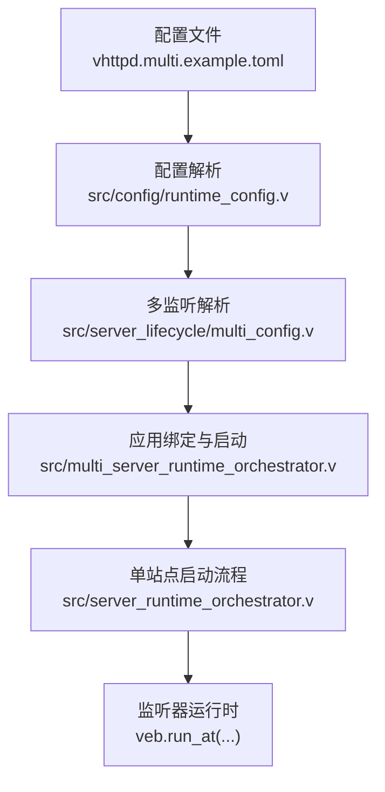
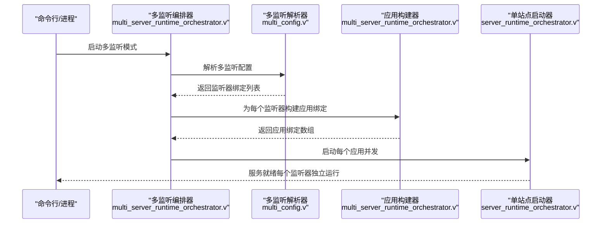
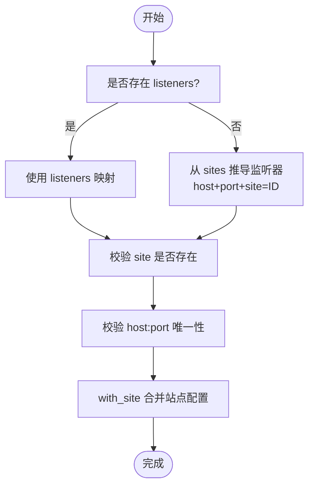
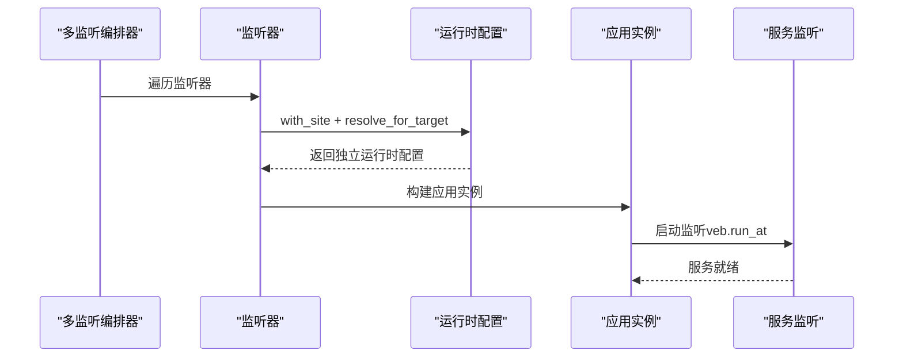

# 多站点管理

<cite>
**本文引用的文件**
- [config/vhttpd.multi.example.toml](file://config/vhttpd.multi.example.toml)
- [config/vhttpd.example.toml](file://config/vhttpd.example.toml)
- [README.md](file://README.md)
- [src/config/config.v](file://src/config/config.v)
- [src/config/runtime_config.v](file://src/config/runtime_config.v)
- [src/server_lifecycle/multi_config.v](file://src/server_lifecycle/multi_config.v)
- [src/multi_server_runtime_orchestrator.v](file://src/multi_server_runtime_orchestrator.v)
- [src/server_runtime_orchestrator.v](file://src/server_runtime_orchestrator.v)
- [src/server_logic_test.v](file://src/server_logic_test.v)
</cite>

## 目录
1. [简介](#简介)
2. [项目结构](#项目结构)
3. [核心组件](#核心组件)
4. [架构总览](#架构总览)
5. [详细组件分析](#详细组件分析)
6. [依赖关系分析](#依赖关系分析)
7. [性能考量](#性能考量)
8. [故障排查指南](#故障排查指南)
9. [结论](#结论)
10. [附录：多站点配置示例与最佳实践](#附录多站点配置示例与最佳实践)

## 简介
本文件系统性阐述 vhttpd 的多站点（多监听）管理机制，重点覆盖以下方面：
- 多站点配置模型：sites 映射与 listeners 映射的关系
- 虚拟主机与路由：基于 host 与 port 的站点分离
- 配置加载顺序与优先级：全局配置与站点配置的合并策略
- 运行时编排：从配置到监听器绑定、应用构建与启动
- 最佳实践：端口分配、域名绑定、SSL 证书配置
- 示例场景：同机多站、跨机多站、以及资源隔离与性能优化建议

## 项目结构
围绕多站点管理的关键文件与职责如下：
- 配置定义与解析：src/config/config.v 定义了 VhttpdConfig、SiteConfig、ListenerConfig 等结构；src/config/runtime_config.v 提供 with_site 合并与 resolve_multi_listeners 解析逻辑
- 多监听运行时编排：src/server_lifecycle/multi_config.v 将 listeners 与 sites 绑定，生成每个监听器对应的运行时配置
- 运行时启动流程：src/multi_server_runtime_orchestrator.v 负责构建多站点应用绑定并启动；src/server_runtime_orchestrator.v 负责单站点应用的初始化与服务启动
- 示例与文档：config/vhttpd.multi.example.toml 展示多站点配置；README.md 对多监听模式进行概述

图表来源
- [config/vhttpd.multi.example.toml](file://config/vhttpd.multi.example.toml)
- [src/config/runtime_config.v](file://src/config/runtime_config.v)
- [src/server_lifecycle/multi_config.v](file://src/server_lifecycle/multi_config.v)
- [src/multi_server_runtime_orchestrator.v](file://src/multi_server_runtime_orchestrator.v)
- [src/server_runtime_orchestrator.v](file://src/server_runtime_orchestrator.v)

章节来源
- [config/vhttpd.multi.example.toml](file://config/vhttpd.multi.example.toml)
- [src/config/config.v](file://src/config/config.v)
- [src/config/runtime_config.v](file://src/config/runtime_config.v)
- [src/server_lifecycle/multi_config.v](file://src/server_lifecycle/multi_config.v)
- [src/multi_server_runtime_orchestrator.v](file://src/multi_server_runtime_orchestrator.v)
- [src/server_runtime_orchestrator.v](file://src/server_runtime_orchestrator.v)

## 核心组件
- 配置模型
  - VhttpdConfig：全局配置容器，包含 paths、files、server、worker、executor、php、vjsx、plugins、websocket_*、admin、assets、runtime、mcp、feishu、codex、openai、db、listeners、sites 等
  - SiteConfig：站点级配置，支持 host、port、project_root、executor、php/vjsx 子配置、插件、websocket_*、assets、runtime、mcp、feishu、codex、openai、db 等
  - ListenerConfig：监听器配置，包含 host、port、site 指向
- 合并与派生
  - with_site：将站点配置与全局配置合并，生成该站点的最终运行时配置
  - resolve_multi_listeners：若未显式声明 listeners，则从 sites 中推导监听器（host+port），否则直接使用 listeners
- 运行时绑定
  - resolve_multi_server_runtime_config：校验 listeners 与 sites 的一致性，去重绑定，为每个监听器生成独立的运行时配置，并确定 admin 权限归属

章节来源
- [src/config/config.v](file://src/config/config.v)
- [src/config/runtime_config.v](file://src/config/runtime_config.v)
- [src/server_lifecycle/multi_config.v](file://src/server_lifecycle/multi_config.v)

## 架构总览
多站点运行时由“监听器-站点-应用”三层构成：
- 监听器层：每个监听器绑定一个唯一的 host:port
- 站点层：每个站点拥有独立的项目根目录、执行器类型与子配置
- 应用层：每个监听器对应一个独立的应用实例，拥有独立的执行器生命周期、静态资源挂载、中间件安装、上游提供者启动等

图表来源
- [src/multi_server_runtime_orchestrator.v](file://src/multi_server_runtime_orchestrator.v)
- [src/server_lifecycle/multi_config.v](file://src/server_lifecycle/multi_config.v)
- [src/server_runtime_orchestrator.v](file://src/server_runtime_orchestrator.v)

## 详细组件分析

### 配置模型与合并策略
- 全局与站点的合并
  - with_site 将站点配置与全局配置逐项合并，优先使用站点配置覆盖全局配置
  - 特殊字段如 project_root 会解析为绝对路径，确保各站点工作目录正确
  - executor.kind 可由站点配置显式指定或根据站点内 php/vjsx/app 等字段自动推断
- 监听器与站点的映射
  - 若存在 listeners 则按 listeners 显式绑定；否则从 sites 推导监听器（host+port），site 指向站点 ID
  - 校验：每个监听器必须指向存在的站点；同一 host:port 绑定不能重复

图表来源
- [src/config/runtime_config.v](file://src/config/runtime_config.v)
- [src/server_lifecycle/multi_config.v](file://src/server_lifecycle/multi_config.v)

章节来源
- [src/config/runtime_config.v](file://src/config/runtime_config.v)
- [src/server_lifecycle/multi_config.v](file://src/server_lifecycle/multi_config.v)

### 运行时编排与启动流程
- 多监听编排
  - 若无 listeners 且无 sites，报错“缺少站点”
  - 解析 listeners 并逐个校验 site 存在性与 host:port 唯一性
  - 为每个监听器调用 with_site 生成站点运行时配置，并调用 ServerRuntimeConfig.resolve_for_target 生成独立运行时参数
  - 第一个监听器可被选为 admin 权限拥有者（当全局 admin.port > 0）
- 单站点启动
  - 初始化应用运行时、启动执行器生命周期、预热执行器、挂载静态资源、安装中间件、启动 admin 平面、启动上游提供者
  - 使用 veb.run_at 在指定 host:port 上启动服务

图表来源
- [src/multi_server_runtime_orchestrator.v](file://src/multi_server_runtime_orchestrator.v)
- [src/server_runtime_orchestrator.v](file://src/server_runtime_orchestrator.v)

章节来源
- [src/multi_server_runtime_orchestrator.v](file://src/multi_server_runtime_orchestrator.v)
- [src/server_runtime_orchestrator.v](file://src/server_runtime_orchestrator.v)

### 虚拟主机与路由规则
- 当前阶段
  - 多监听模式下，vhttpd 以“监听器维度”的路由为主，即按 host:port 分发请求
  - 文档明确“阶段 1 是监听器级路由，不是同端口 host 基于的虚拟主机路由”
- 实践建议
  - 通过不同 port 或不同 host 实现站点隔离
  - 如需基于 host 的虚拟主机，请在反向代理层（如 Nginx/Traefik）进行 host 路由后再转发至 vhttpd 的不同监听器

章节来源
- [README.md](file://README.md)

### 配置加载顺序与优先级
- 加载顺序
  - 读取配置文件 → 解析 paths/feishu/openai/plugins 等根级扩展 → 解析多监听配置（listeners/sites）→ 变量展开（resolve_config_variables）
- 优先级规则
  - 站点配置优先覆盖全局配置
  - 若站点未显式设置某些字段，将回退到全局默认值
  - executor.kind 由站点配置决定，或根据站点内 php/vjsx/app 等字段推断

章节来源
- [src/config/config.v](file://src/config/config.v)
- [src/config/runtime_config.v](file://src/config/runtime_config.v)

## 依赖关系分析
- 组件耦合
  - multi_server_runtime_orchestrator 依赖 server_lifecycle.multi_config 提供的监听器绑定与运行时配置
  - server_runtime_orchestrator 依赖 server_lifecycle.ServerRuntimeConfig（单站点）进行应用初始化与服务启动
  - config.runtime_config 与 config.config 提供配置模型与合并逻辑
- 关键依赖链
  - 配置文件 → config.runtime_config → server_lifecycle.multi_config → multi_server_runtime_orchestrator → server_runtime_orchestrator → veb.run_at

图表来源
- [src/config/config.v](file://src/config/config.v)
- [src/config/runtime_config.v](file://src/config/runtime_config.v)
- [src/server_lifecycle/multi_config.v](file://src/server_lifecycle/multi_config.v)
- [src/multi_server_runtime_orchestrator.v](file://src/multi_server_runtime_orchestrator.v)
- [src/server_runtime_orchestrator.v](file://src/server_runtime_orchestrator.v)

章节来源
- [src/config/config.v](file://src/config/config.v)
- [src/config/runtime_config.v](file://src/config/runtime_config.v)
- [src/server_lifecycle/multi_config.v](file://src/server_lifecycle/multi_config.v)
- [src/multi_server_runtime_orchestrator.v](file://src/multi_server_runtime_orchestrator.v)
- [src/server_runtime_orchestrator.v](file://src/server_runtime_orchestrator.v)

## 性能考量
- 资源隔离
  - 每个监听器对应独立应用实例，避免站点间相互影响
  - 执行器生命周期独立，可按站点分别预热与重启
- 并发启动
  - 多监听模式下，应用绑定构建完成后并行启动，缩短整体启动时间
- I/O 与连接
  - 不同监听器使用不同 host:port，避免端口冲突带来的阻塞
- 建议
  - 为高负载站点分配独立端口与资源池
  - 合理设置 worker_backend 参数（如 pool_size、max_requests）以平衡吞吐与稳定性

[本节为通用指导，不直接分析具体文件]

## 故障排查指南
- 常见错误与定位
  - “缺少站点”：未提供 listeners 且 sites 为空
  - “未知站点”：监听器指向的 site 不存在
  - “重复绑定”：同一 host:port 出现在多个监听器
  - “缺失端口”：从 sites 推导监听器时，站点未设置 port
- 定位方法
  - 检查 listeners 与 sites 的键名一致性
  - 确认每个站点的 host:port 唯一
  - 使用测试用例风格的最小配置验证解析与运行时绑定是否正常

章节来源
- [src/server_lifecycle/multi_config.v](file://src/server_lifecycle/multi_config.v)
- [src/server_logic_test.v](file://src/server_logic_test.v)

## 结论
vhttpd 的多站点管理通过“监听器-站点-应用”三层解耦，实现了在同一进程中对多个站点的独立运行与资源隔离。当前阶段以监听器级路由为主，未来可结合反向代理实现更灵活的虚拟主机路由。通过 with_site 与 resolve_multi_listeners 的组合，vhttpd 提供了清晰的全局与站点配置合并策略，便于在复杂部署场景中实现端口分配、域名绑定与 SSL 证书配置。

[本节为总结性内容，不直接分析具体文件]

## 附录：多站点配置示例与最佳实践

### 多站点配置示例
- 同机多站（不同端口）
  - 示例参考：config/vhttpd.multi.example.toml
  - 关键点：每个站点设置 host、port；若省略 listeners，将从 sites 推导监听器
- 单机多站（不同 host:port）
  - 示例参考：README.md 中的“Minimal multi-listener example”
  - 关键点：显式声明 listeners，每个监听器绑定一个站点
- 跨机多站（不同机器）
  - 建议：在反向代理后将不同域名映射到 vhttpd 的不同监听器，再由 vhttpd 按监听器分发

章节来源
- [config/vhttpd.multi.example.toml](file://config/vhttpd.multi.example.toml)
- [README.md](file://README.md)

### 端口分配与域名绑定
- 端口分配
  - 每个站点使用唯一 host:port；避免端口冲突
  - 高可用场景可为每个站点预留一组相邻端口
- 域名绑定
  - 建议在反向代理层（Nginx/Traefik/Caddy）进行域名到 vhttpd 监听器的映射
  - vhttpd 当前阶段不内置基于 host 的虚拟主机路由

章节来源
- [README.md](file://README.md)

### SSL 证书配置
- 建议在反向代理层统一处理 TLS 终止与证书管理，vhttpd 仅负责业务路由
- 反向代理将 HTTPS 请求转发至 vhttpd 的不同监听器，实现站点级隔离

[本节为通用指导，不直接分析具体文件]

### 全局配置与站点配置的合并策略
- 合并范围
  - paths、worker、executor、php、vjsx、plugins、websocket_*、assets、runtime、mcp、feishu、codex、openai、db 等均可按站点覆盖
- 合并规则
  - 站点配置优先；未设置的字段回退到全局默认值
  - project_root 会被解析为绝对路径
  - executor.kind 可由站点配置显式指定或自动推断

章节来源
- [src/config/runtime_config.v](file://src/config/runtime_config.v)
- [src/config/config.v](file://src/config/config.v)

### 资源隔离与性能优化建议
- 隔离
  - 每个监听器独立应用实例，避免共享状态干扰
  - 执行器生命周期独立，可按站点分别预热与重启
- 性能
  - 并行启动多个监听器，缩短整体启动时间
  - 为高负载站点分配独立端口与资源池，合理设置 worker_backend 参数

章节来源
- [src/multi_server_runtime_orchestrator.v](file://src/multi_server_runtime_orchestrator.v)
- [src/server_runtime_orchestrator.v](file://src/server_runtime_orchestrator.v)