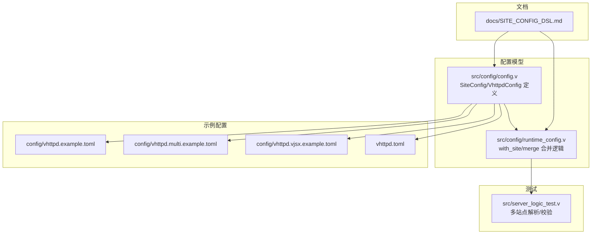
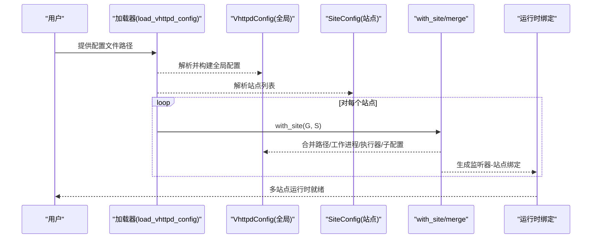
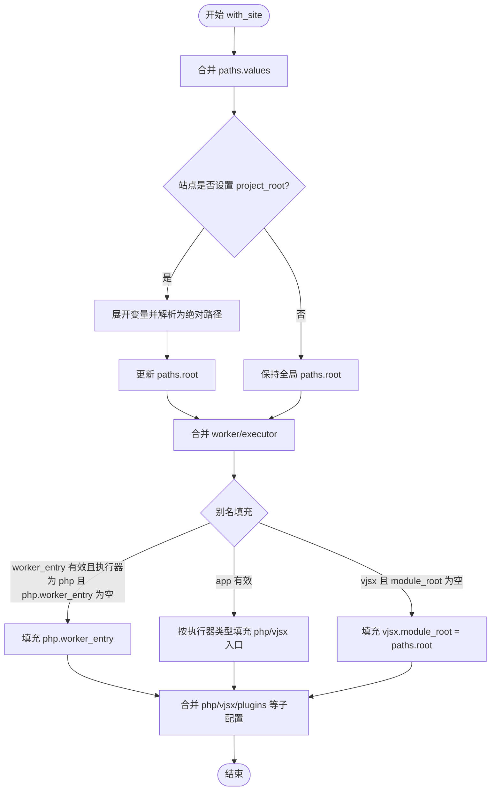
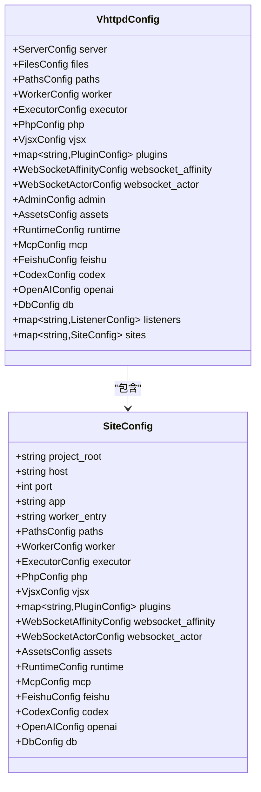

# 站点 DSL 概念

<cite>
**本文引用的文件**   
- [SITE_CONFIG_DSL.md](file://docs/SITE_CONFIG_DSL.md)
- [config.v](file://src/config/config.v)
- [runtime_config.v](file://src/config/runtime_config.v)
- [vhttpd.example.toml](file://config/vhttpd.example.toml)
- [vhttpd.multi.example.toml](file://config/vhttpd.multi.example.toml)
- [vhttpd.vjsx.example.toml](file://config/vhttpd.vjsx.example.toml)
- [vhttpd.toml](file://vhttpd.toml)
- [server_logic_test.v](file://src/server_logic_test.v)
</cite>

## 目录
1. [简介](#简介)
2. [项目结构](#项目结构)
3. [核心组件](#核心组件)
4. [架构总览](#架构总览)
5. [详细组件分析](#详细组件分析)
6. [依赖分析](#依赖分析)
7. [性能考虑](#性能考虑)
8. [故障排查指南](#故障排查指南)
9. [结论](#结论)
10. [附录：字段参考表](#附录字段参考表)

## 简介
本文件系统化阐述 vhttpd 的“站点 DSL”（Domain Specific Language）概念与实现，聚焦 SiteConfig 结构体的设计原理、字段语义、继承与覆盖规则、以及在多站点/多监听模式下的使用方式。文档同时给出字段参考表、最佳实践与常见问题排查建议，帮助读者快速、正确地编写与维护站点配置。

## 项目结构
围绕站点 DSL 的关键代码与示例分布如下：
- 文档层：站点 DSL 说明与示例
- 配置模型层：SiteConfig、VhttpdConfig 等结构体定义与合并逻辑
- 示例层：单站点、多站点、vjsx 站点等配置示例
- 测试层：验证多站点解析、变量展开、路径解析等行为

图表来源
- [config.v](file://src/config/config.v)
- [runtime_config.v](file://src/config/runtime_config.v)
- [SITE_CONFIG_DSL.md](file://docs/SITE_CONFIG_DSL.md)
- [vhttpd.example.toml](file://config/vhttpd.example.toml)
- [vhttpd.multi.example.toml](file://config/vhttpd.multi.example.toml)
- [vhttpd.vjsx.example.toml](file://config/vhttpd.vjsx.example.toml)
- [vhttpd.toml](file://vhttpd.toml)
- [server_logic_test.v](file://src/server_logic_test.v)

章节来源
- [config.v](file://src/config/config.v)
- [runtime_config.v](file://src/config/runtime_config.v)
- [SITE_CONFIG_DSL.md](file://docs/SITE_CONFIG_DSL.md)

## 核心组件
- SiteConfig：描述单个站点的配置，包含基础信息、执行器、工作进程、执行器专属参数等。
- VhttpdConfig：顶层配置容器，包含全局服务器、文件、路径、工作进程、执行器、插件、资产、运行时、MCP、飞书、Codex、OpenAI、数据库、监听器、站点等。
- with_site：将全局配置与站点配置进行合并，实现“站点级配置覆盖全局配置”的继承机制。
- merge 系列函数：对 Worker、Executor、Php、Vjsx、Assets、Runtime、MCP、Feishu、Codex、OpenAI 等子配置进行逐字段覆盖或智能推断。

章节来源
- [config.v](file://src/config/config.v)
- [runtime_config.v](file://src/config/runtime_config.v)

## 架构总览
站点 DSL 的核心流程是：解析 TOML → 构建 VhttpdConfig → 将每个站点通过 with_site 合并到全局配置 → 生成运行时绑定（监听器-站点）→ 执行器计划与资源初始化。

图表来源
- [config.v](file://src/config/config.v)
- [runtime_config.v](file://src/config/runtime_config.v)

## 详细组件分析

### SiteConfig 字段设计与语义
- project_root：站点项目根目录，支持变量展开与相对路径解析；与 DSL 中的 root 等价。
- host/port：站点监听地址与端口；多站点模式下可省略 listeners 节点，由站点直接声明 host/port 自动生成监听器。
- app：执行器入口的统一别名，根据执行器类型映射到具体入口：
  - PHP：映射到 php.app_entry
  - vjsx：映射到 vjsx.app_entry
  - 未显式指定执行器时，可通过 app 文件后缀推断（*.php 推断为 php，否则推断为 vjsx）。
- worker_entry：PHP 工作进程入口的统一别名，映射到 php.worker_entry。
- paths：站点级路径别名集合，用于在站点内复用。
- worker：工作进程通用参数（如 autostart、pool_size、socket_prefix、env 等）。
- executor：执行器类型（kind），可被智能推断（基于 app 或 php/vjsx 子配置存在性）。
- php/vjsx：执行器专属参数（如 php.bin、php.extensions、vjsx.module_root、vjsx.build_root 等）。
- websocket_affinity/websocket_actor：WebSocket 相关策略与源配置。
- assets/runtime/mcp/feishu/codex/openai/db：各子系统的全局配置，可在站点层按需覆盖。

章节来源
- [config.v](file://src/config/config.v)
- [runtime_config.v](file://src/config/runtime_config.v)
- [SITE_CONFIG_DSL.md](file://docs/SITE_CONFIG_DSL.md)

### 继承与覆盖机制
- with_site 合并顺序与优先级：
  1) 路径合并：站点 paths 覆盖全局 paths.values；若站点设置 project_root，则替换全局 paths.root 并解析为绝对路径。
  2) 工作进程与执行器：站点 worker/executor 覆盖全局对应配置。
  3) 执行器子配置：php/vjsx/plugins 等按字段覆盖。
  4) 别名与默认值：
     - 若站点设置了 worker_entry 且执行器为 php，但 php.worker_entry 为空，则用站点 worker_entry 填充。
     - 若站点设置了 app，且执行器为 php，则填充 php.app_entry；若为 vjsx，则填充 vjsx.app_entry。
     - 若执行器未显式指定，将根据 app 后缀或 php/vjsx 子配置的存在性进行推断。
     - 若执行器为 vjsx 且未设置 vjsx.module_root，则默认等于站点 paths.root。
- 多站点监听器自动生成：当未显式提供 listeners 时，系统会基于每个站点的 host/port 自动合成监听器条目。

图表来源
- [runtime_config.v](file://src/config/runtime_config.v)

章节来源
- [runtime_config.v](file://src/config/runtime_config.v)
- [server_logic_test.v](file://src/server_logic_test.v)

### 语义规则与约束条件
- 必填字段
  - 多站点模式下，每个站点必须提供 port；若未显式提供 listeners，系统会基于站点的 host/port 自动生成监听器。
- 可选字段
  - host 默认回退为 127.0.0.1（当站点未设置时）。
  - app、worker_entry、php/vjsx 子配置等均为可选，可通过别名与推断机制自动补全。
- 字段间依赖关系
  - app 与执行器类型强相关：app 映射到 php.app_entry 或 vjsx.app_entry，取决于执行器类型。
  - worker_entry 仅在执行器为 php 时生效，并可作为 php.worker_entry 的别名。
  - vjsx.module_root 默认跟随站点 root，避免重复声明。
- 变量展开与路径解析
  - 支持 ${var} 与 ${env.KEY:-default} 语法；变量作用域包含 paths.*、server.*、worker.*、php.*、vjsx.*、plugins.*、assets.*、runtime.*、mcp.*、feishu.*、openai.* 等。
  - 路径解析遵循：先展开变量，再将相对路径基于 paths.root 解析为绝对路径。

章节来源
- [config.v](file://src/config/config.v)
- [runtime_config.v](file://src/config/runtime_config.v)
- [server_logic_test.v](file://src/server_logic_test.v)

### 最佳实践
- 命名规范
  - 使用 root 作为 project_root 的别名，提升可读性与一致性。
  - 在 PHP 站点中使用 worker.entry 作为统一入口别名，便于与 autostart、pool_size 等参数组合。
  - 在 vjsx 站点中，若 module_root 未显式设置，通常无需重复声明，因其默认跟随 root。
- 配置组织原则
  - 将站点级配置集中在 [sites.<id>] 下，避免分散在多个节中。
  - 将通用参数放在全局节（如 [worker]、[executor]、[php]、[vjsx]），在站点层仅声明差异部分。
  - 使用 [paths] 统一管理常用路径别名，减少重复与歧义。
- 可观测性与调试
  - 通过 [files] 设置 pid_file 与 event_log，便于启动与运行期排障。
  - 在多站点场景下，确保每个站点的 port 唯一，避免绑定冲突。

章节来源
- [SITE_CONFIG_DSL.md](file://docs/SITE_CONFIG_DSL.md)
- [vhttpd.multi.example.toml](file://config/vhttpd.multi.example.toml)
- [vhttpd.example.toml](file://config/vhttpd.example.toml)

## 依赖分析
- 配置模型依赖
  - SiteConfig 依赖 PathsConfig、WorkerConfig、ExecutorConfig、PhpConfig、VjsxConfig、AssetsConfig、RuntimeConfig、McpConfig、FeishuConfig、CodexConfig、OpenAIConfig、DbConfig 等。
  - VhttpdConfig 包含上述所有配置，并额外包含 listeners 与 sites。
- 合并逻辑依赖
  - with_site 依赖 build_config_variable_map、resolve_config_path 等工具函数完成变量展开与路径解析。
  - merge 系列函数负责逐字段覆盖与默认值处理，保证“站点级配置优先”。

图表来源
- [config.v](file://src/config/config.v)

章节来源
- [config.v](file://src/config/config.v)
- [runtime_config.v](file://src/config/runtime_config.v)

## 性能考虑
- 工作进程池大小（worker.pool_size）与请求上限（worker.max_requests）直接影响吞吐与资源占用，应结合业务峰值合理设置。
- vjsx 线程数（vjsx.thread_count）与构建根目录（vjsx.build_root）影响冷启动与热更新成本，建议在开发与生产环境分别优化。
- 资源路径解析与变量展开在启动阶段完成，尽量避免在运行期频繁变更路径与变量，减少运行时开销。

## 故障排查指南
- 多站点监听器缺失
  - 症状：提示缺少站点或端口缺失。
  - 排查：确认每个站点是否提供 port；若未提供 listeners，系统会尝试自动生成，但要求站点具备 host/port。
- 执行器类型推断失败
  - 症状：执行器类型不符合预期。
  - 排查：检查 app 是否以 .php 结尾；或是否提供了 php/vjsx 子配置；必要时显式设置 executor.kind。
- 路径解析异常
  - 症状：路径不正确或找不到文件。
  - 排查：确认 paths.root 与 paths.values 的变量是否正确展开；检查相对路径是否基于正确的根目录解析。
- 变量循环引用
  - 症状：变量展开超过最大轮次或提示未知变量。
  - 排查：检查变量表达式是否正确，是否存在环形依赖；必要时使用默认值语法提供兜底。

章节来源
- [server_logic_test.v](file://src/server_logic_test.v)
- [config.v](file://src/config/config.v)

## 结论
站点 DSL 通过简洁的分层与别名机制，显著降低了多站点配置的复杂度。借助 with_site 的继承与覆盖能力，既能复用全局默认值，又能灵活定制站点差异。配合变量展开与路径解析，可实现高度可移植与可维护的配置体系。建议在团队内统一命名与组织规范，充分利用别名与推断，减少冗余配置，提升可读性与可维护性。

## 附录：字段参考表
以下表格汇总了站点 DSL 关键字段（含别名与默认值），并标注数据类型与典型取值范围。注意：默认值来自结构体定义与合并逻辑，实际行为可能受全局配置与变量展开影响。

- 基础信息
  - project_root/root：字符串；别名关系：root 等价于 project_root；默认值来自全局 paths.root；支持变量展开与相对路径解析。
  - host：字符串；默认值 127.0.0.1（若站点未设置）。
  - port：整数；必填（多站点模式下每个站点必须提供）。
  - executor：字符串；可选；默认空；可通过 app 或 php/vjsx 子配置推断。
  - app：字符串；执行器入口别名；映射规则：
    - PHP：映射到 php.app_entry
    - vjsx：映射到 vjsx.app_entry
    - 未显式指定执行器时：app 以 *.php 结尾推断为 php，否则推断为 vjsx。

- 工作进程与入口
  - worker_entry：字符串；PHP 工作进程入口别名；映射到 php.worker_entry。
  - worker.autostart：布尔；默认空；可覆盖全局。
  - worker.pool_size：整数；默认 1；可覆盖全局。
  - worker.socket_prefix：字符串；默认空；可覆盖全局。
  - worker.env：字典；键值对；可覆盖全局。

- 执行器专属
  - php.bin：字符串；默认 php；可覆盖全局。
  - php.worker_entry：字符串；默认空；可覆盖全局。
  - php.app_entry：字符串；默认空；可覆盖全局。
  - php.extensions：字符串数组；默认空；可覆盖全局。
  - php.args：字符串数组；默认空；可覆盖全局。
  - vjsx.app_entry：字符串；默认空；可覆盖全局。
  - vjsx.module_root：字符串；默认空；若未设置且执行器为 vjsx，默认等于站点 root。
  - vjsx.build_root：字符串；默认空；可覆盖全局。
  - vjsx.runtime_profile：字符串；默认 script；可覆盖全局。
  - vjsx.thread_count：整数；默认 1；可覆盖全局。
  - vjsx.enable_fs/vjsx.enable_process/vjsx.enable_network：布尔；默认 false；可覆盖全局。

- 子系统配置（可按需覆盖）
  - assets.enabled/prefix/root/cache_control：布尔/字符串；默认启用、前缀 /assets、根目录空、缓存控制字符串。
  - runtime.timezone：字符串；默认 Asia/Shanghai。
  - mcp.max_sessions/max_pending_messages/session_ttl_seconds/sampling_capability_policy：整数/字符串；默认策略与数值见结构体。
  - feishu.enabled/open_base_url/reconnect_delay_ms/token_refresh_skew_seconds/recent_event_limit/apps/bridge：布尔/字符串/整数/字典；默认值见结构体。
  - codex.enabled/url/model/effort/cwd/approval_policy/sandbox/reconnect_delay_ms/flush_interval_ms：布尔/字符串/整数；默认值见结构体。
  - openai.enabled/base_path/default_backend/plugin/endpoints/backends/routes：布尔/字符串/字典；默认值见结构体。
  - db.enabled/socket/driver/mysql/pgsql：布尔/字符串/字典；默认值见结构体。

章节来源
- [config.v](file://src/config/config.v)
- [runtime_config.v](file://src/config/runtime_config.v)
- [SITE_CONFIG_DSL.md](file://docs/SITE_CONFIG_DSL.md)
- [vhttpd.example.toml](file://config/vhttpd.example.toml)
- [vhttpd.multi.example.toml](file://config/vhttpd.multi.example.toml)
- [vhttpd.vjsx.example.toml](file://config/vhttpd.vjsx.example.toml)
- [vhttpd.toml](file://vhttpd.toml)