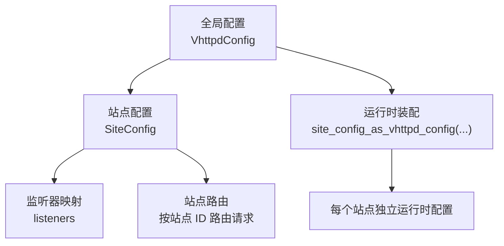
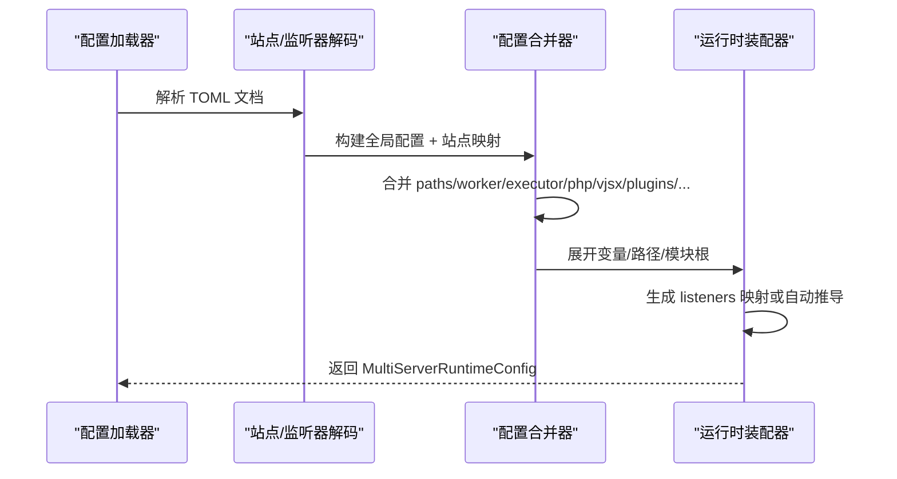
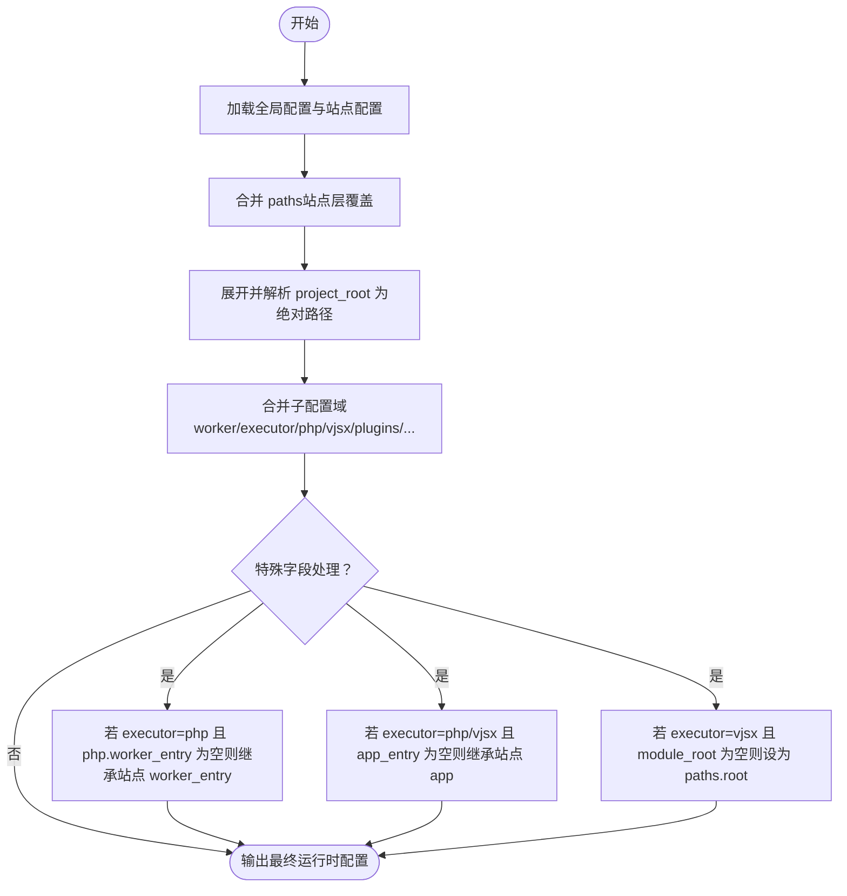
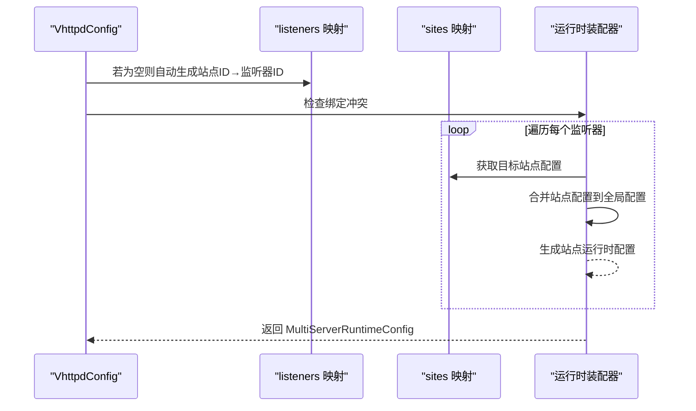
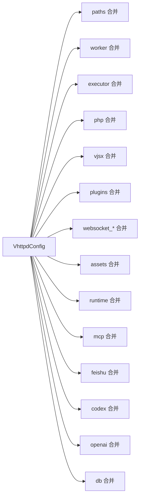

# 站点配置

<cite>
**本文引用的文件**
- [src/config/config.v](file://src/config/config.v)
- [src/config/runtime_config.v](file://src/config/runtime_config.v)
- [src/multi_server_runtime_config.v](file://src/multi_server_runtime_config.v)
- [config/vhttpd.example.toml](file://config/vhttpd.example.toml)
- [config/vhttpd.multi.example.toml](file://config/vhttpd.multi.example.toml)
- [config/vhttpd.vjsx.example.toml](file://config/vhttpd.vjsx.example.toml)
- [examples/config/hello.toml](file://examples/config/hello.toml)
- [examples/config/laravel.toml](file://examples/config/laravel.toml)
- [examples/config/symfony.toml](file://examples/config/symfony.toml)
- [examples/config/wordpress.toml](file://examples/config/wordpress.toml)
- [examples/config/ai-stream.toml](file://examples/config/ai-stream.toml)
- [examples/config/websocket-echo.toml](file://examples/config/websocket-echo.toml)
- [examples/config/openai-gateway.toml](file://examples/config/openai-gateway.toml)
- [examples/config/mcp.toml](file://examples/config/mcp.toml)
- [examples/config/feishu-bot.toml](file://examples/config/feishu-bot.toml)
- [examples/config/db-upstream.toml](file://examples/config/db-upstream.toml)
- [examples/config/stream-dispatch.toml](file://examples/config/stream-dispatch.toml)
- [examples/config/stream-bench.toml](file://examples/config/stream-bench.toml)
- [examples/config/ollama-proxy.toml](file://examples/config/ollama-proxy.toml)
- [examples/config/openai-gateway-dashscope-coding.toml](file://examples/config/openai-gateway-dashscope-coding.toml)
- [docs/SITE_CONFIG_DSL.md](file://docs/SITE_CONFIG_DSL.md)
</cite>

## 目录
1. [简介](#简介)
2. [项目结构](#项目结构)
3. [核心组件](#核心组件)
4. [架构总览](#架构总览)
5. [详细组件分析](#详细组件分析)
6. [依赖分析](#依赖分析)
7. [性能考虑](#性能考虑)
8. [故障排查指南](#故障排查指南)
9. [结论](#结论)
10. [附录](#附录)

## 简介
本文件系统性阐述 vhttpd 的“站点配置”与“站点 DSL”。围绕 SiteConfig 结构体与站点级配置的解析、合并与运行时装配，解释以下关键主题：
- 项目根目录、主机绑定、端口配置、应用入口等关键配置项
- 多站点配置的实现机制：listeners 映射与站点路由规则
- 站点级别 worker、executor、php、vjsx、plugins 等如何覆盖全局设置
- 配置继承关系与优先级规则
- 性能优化与安全配置要点
- 完整示例（单站点、多站点、混合部署）

## 项目结构
vhttpd 的站点配置由两部分组成：
- 全局配置：定义默认行为与通用参数
- 站点配置：按站点维度覆盖或扩展全局配置

站点 DSL 将“监听器”与“站点”映射到具体运行时实例，支持单机多站点并行运行。

图示来源
- [src/config/runtime_config.v:366-439](file://src/config/runtime_config.v#L366-L439)
- [src/config/config.v:1092-1113](file://src/config/config.v#L1092-L1113)

章节来源
- [src/config/config.v:1092-1113](file://src/config/config.v#L1092-L1113)
- [src/config/runtime_config.v:366-439](file://src/config/runtime_config.v#L366-L439)

## 核心组件
- SiteConfig：站点级配置主体，包含项目根目录、主机、端口、应用入口、路径、工作进程、执行器、PHP/VJSX 运行时、插件、WebSocket、静态资源、运行时、MCP、飞书、Codex、OpenAI、数据库等子配置。
- ListenerConfig：监听器配置，用于将特定主机:端口绑定到某个站点 ID。
- VhttpdConfig：最终运行时配置，由全局配置与站点配置合并生成。

章节来源
- [src/config/config.v:260-282](file://src/config/config.v#L260-L282)
- [src/config/config.v:253-258](file://src/config/config.v#L253-L258)
- [src/config/runtime_config.v:366-415](file://src/config/runtime_config.v#L366-L415)

## 架构总览
站点配置在加载后，通过“站点配置 → 运行时配置”的转换函数完成合并与变量展开，随后根据 listeners 或自动推导生成每个监听器与其对应的站点运行时。

图示来源
- [src/config/config.v:1092-1113](file://src/config/config.v#L1092-L1113)
- [src/config/runtime_config.v:366-439](file://src/config/runtime_config.v#L366-L439)
- [src/multi_server_runtime_config.v:58-80](file://src/multi_server_runtime_config.v#L58-L80)

## 详细组件分析

### SiteConfig 结构体与关键字段
- 项目根目录：支持变量展开与相对路径解析，最终固化到 paths.root
- 主机与端口：决定监听地址与端口；多站点时可由 listeners 或自动推导
- 应用入口：executor 类型为 php 时对应 PHP 应用入口；为 vjsx 时对应 VJSX 应用入口
- worker_entry：工作进程入口（当 executor=php 且未显式设置 php.worker_entry 时，可从站点层继承）
- 子配置域：worker、executor、php、vjsx、plugins、websocket_affinity、websocket_actor、assets、runtime、mcp、feishu、codex、openai、db 等

章节来源
- [src/config/config.v:260-282](file://src/config/config.v#L260-L282)
- [src/config/config.v:997-1043](file://src/config/config.v#L997-L1043)

### 站点 DSL 设计原理
- listeners 映射：显式声明每个监听器 ID 到站点 ID 的映射，确保请求按监听器绑定到指定站点
- 自动监听器推导：若未显式配置 listeners，则以站点 ID 作为监听器 ID，并基于站点的 host/port 自动生成监听器
- 站点路由：运行时根据监听器 ID 将请求路由到对应站点的运行时配置

章节来源
- [src/config/runtime_config.v:417-439](file://src/config/runtime_config.v#L417-L439)
- [src/config/config.v:1092-1113](file://src/config/config.v#L1092-L1113)

### 配置合并与继承规则
- 合并策略：逐子配置域进行合并，站点层仅覆盖非空值；paths.root 支持变量展开与路径解析
- 变量展开：支持 ${VAR} 形式的变量表达式，可在全局变量表与环境变量中解析
- 优先级规则：
  - 站点层配置优先于全局配置
  - paths.root 在站点层被解析为绝对路径后再写入最终配置
  - 当站点层未设置某些字段时，保留全局默认值
  - 特殊字段如 worker_entry/app 在特定 executor 类型下有默认回退逻辑

图示来源
- [src/config/runtime_config.v:366-415](file://src/config/runtime_config.v#L366-L415)
- [src/config/config.v:1541-1576](file://src/config/config.v#L1541-L1576)

章节来源
- [src/config/runtime_config.v:366-415](file://src/config/runtime_config.v#L366-L415)
- [src/config/config.v:1541-1576](file://src/config/config.v#L1541-L1576)

### 多站点配置实现机制
- listeners 映射：键为监听器 ID，值为目标站点 ID；用于精确控制请求路由
- 自动推导：当未配置 listeners 时，系统以站点 ID 作为监听器 ID，并根据站点 host/port 生成监听器
- 冲突检测：同一主机:端口不可重复绑定
- 运行时装配：对每个监听器生成独立的站点运行时配置

图示来源
- [src/config/runtime_config.v:417-439](file://src/config/runtime_config.v#L417-L439)
- [src/multi_server_runtime_config.v:58-80](file://src/multi_server_runtime_config.v#L58-L80)

章节来源
- [src/config/runtime_config.v:417-439](file://src/config/runtime_config.v#L417-L439)
- [src/multi_server_runtime_config.v:58-80](file://src/multi_server_runtime_config.v#L58-L80)

### 站点级别配置覆盖全局设置
- paths：站点层仅覆盖非空值，支持变量展开
- worker：站点层覆盖全局 worker 设置
- executor：站点层可直接赋值字符串或嵌套对象；若为字符串则写入 kind 字段
- php/vjsx：站点层覆盖相应子配置
- plugins：站点层与全局层合并（键冲突时站点层优先）
- websocket_affinity/actor：站点层覆盖
- assets/runtime/mcp/feishu/codex/openai/db：站点层覆盖

章节来源
- [src/config/config.v:997-1043](file://src/config/config.v#L997-L1043)
- [src/config/runtime_config.v:366-415](file://src/config/runtime_config.v#L366-L415)

### 配置变量与路径解析
- 变量表达式：${VAR}，支持在字符串中出现
- 作用域：变量解析时会根据键的命名空间选择作用域
- 展开过程：递归替换直到无变化为止
- 路径解析：project_root 在站点层被解析为绝对路径

章节来源
- [src/config/config.v:1541-1576](file://src/config/config.v#L1541-L1576)

## 依赖分析
- 配置加载依赖：TOML 文档解析器
- 合并依赖：各子配置域的合并函数（paths/worker/executor/php/vjsx/plugins/websocket/assets/runtime/mcp/feishu/codex/openai/db）
- 运行时依赖：监听器 ID 与站点 ID 的映射关系、绑定冲突检测

图示来源
- [src/config/runtime_config.v:1-17](file://src/config/runtime_config.v#L1-L17)
- [src/config/runtime_config.v:366-415](file://src/config/runtime_config.v#L366-L415)

章节来源
- [src/config/runtime_config.v:1-17](file://src/config/runtime_config.v#L1-L17)
- [src/config/runtime_config.v:366-415](file://src/config/runtime_config.v#L366-L415)

## 性能考虑
- 监听器复用：多站点共享监听器可减少端口占用与内核负担
- 资源隔离：站点层独立的 worker/executor/php/vjsx/plugins 等配置有助于按站点进行资源配额与隔离
- 路径解析：尽量在站点层使用绝对路径或明确的变量，避免运行时多次解析
- 执行器选择：根据业务类型选择合适的 executor（php/vjsx），并合理设置 worker 数量与内存上限
- 插件管理：仅启用必要插件，避免不必要的初始化开销

## 故障排查指南
- 监听器缺失端口：当自动推导监听器时，若站点未设置 port，将报错
- 绑定冲突：同一主机:端口重复绑定将报错
- 变量表达式错误：变量表达式格式不正确或缺少闭合括号将导致解析失败
- 站点层覆盖无效：确认站点层字段是否为空（空值不会覆盖全局配置）

章节来源
- [src/config/runtime_config.v:417-439](file://src/config/runtime_config.v#L417-L439)
- [src/config/config.v:1541-1576](file://src/config/config.v#L1541-L1576)

## 结论
vhttpd 的站点配置通过清晰的 DSL 与严格的合并/继承规则，实现了灵活而可控的多站点部署能力。借助 listeners 映射与自动推导机制，既能满足简单场景的快速部署，也能支持复杂场景下的精细路由与资源隔离。

## 附录

### 站点配置最佳实践
- 单站点：直接设置 host/port/app/executor 等关键字段，无需 listeners
- 多站点：显式配置 listeners，确保每个监听器绑定唯一站点；或使用自动推导（需为每个站点设置不同 port）
- 混合部署：在同一配置中同时包含 php 与 vjsx 应用，分别在站点层设置 executor 与 app_entry
- 安全配置：限制监听地址（host）、启用必要的认证与鉴权插件、最小权限原则配置数据库与外部服务
- 性能优化：按站点划分 worker 数量与内存上限；启用必要的缓存与静态资源压缩

### 完整站点配置示例（路径索引）
- 单站点示例
  - [hello.toml](file://examples/config/hello.toml)
  - [laravel.toml](file://examples/config/laravel.toml)
  - [symfony.toml](file://examples/config/symfony.toml)
  - [wordpress.toml](file://examples/config/wordpress.toml)
- 多站点示例
  - [vhttpd.multi.example.toml](file://config/vhttpd.multi.example.toml)
- 混合部署示例
  - [vhttpd.example.toml](file://config/vhttpd.example.toml)
  - [vhttpd.vjsx.example.toml](file://config/vhttpd.vjsx.example.toml)
  - [ai-stream.toml](file://examples/config/ai-stream.toml)
  - [websocket-echo.toml](file://examples/config/websocket-echo.toml)
  - [openai-gateway.toml](file://examples/config/openai-gateway.toml)
  - [mcp.toml](file://examples/config/mcp.toml)
  - [feishu-bot.toml](file://examples/config/feishu-bot.toml)
  - [db-upstream.toml](file://examples/config/db-upstream.toml)
  - [stream-dispatch.toml](file://examples/config/stream-dispatch.toml)
  - [stream-bench.toml](file://examples/config/stream-bench.toml)
  - [ollama-proxy.toml](file://examples/config/ollama-proxy.toml)
  - [openai-gateway-dashscope-coding.toml](file://examples/config/openai-gateway-dashscope-coding.toml)

### 站点 DSL 规范参考
- [SITE_CONFIG_DSL.md](file://docs/SITE_CONFIG_DSL.md)