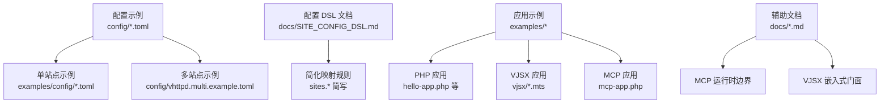
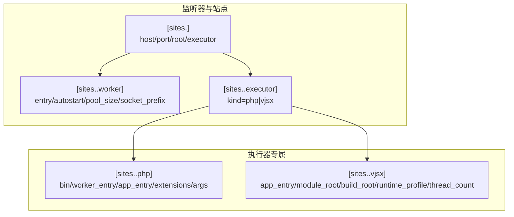
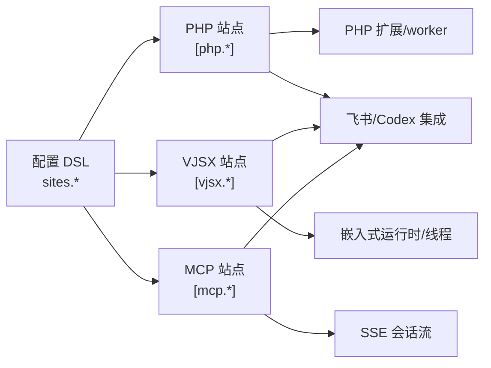

# 站点配置示例

<cite>
**本文引用的文件**
- [vhttpd.example.toml](file://config/vhttpd.example.toml)
- [vhttpd.multi.example.toml](file://config/vhttpd.multi.example.toml)
- [vhttpd.vjsx.example.toml](file://config/vhttpd.vjsx.example.toml)
- [SITE_CONFIG_DSL.md](file://docs/SITE_CONFIG_DSL.md)
- [vhttpd.toml](file://vhttpd.toml)
- [hello.toml](file://examples/config/hello.toml)
- [laravel.toml](file://examples/config/laravel.toml)
- [symfony.toml](file://examples/config/symfony.toml)
- [mcp.toml](file://examples/config/mcp.toml)
- [wordpress.toml](file://examples/config/wordpress.toml)
- [codexbot.toml](file://examples/codexbot-app/codexbot.toml)
- [ws-min.toml](file://examples/ws-min/ws-min.toml)
- [local.example.toml](file://examples/feishu_cb-app-ts/local.example.toml)
- [remote.example.toml](file://examples/feishu_cb-app-ts/remote.example.toml)
- [MCP.md](file://docs/MCP.md)
- [VJSX_FACADE_REFERENCE.md](file://docs/VJSX_FACADE_REFERENCE.md)
</cite>

## 目录
1. [简介](#简介)
2. [项目结构](#项目结构)
3. [核心组件](#核心组件)
4. [架构总览](#架构总览)
5. [详细组件分析](#详细组件分析)
6. [依赖关系分析](#依赖关系分析)
7. [性能考虑](#性能考虑)
8. [故障排查指南](#故障排查指南)
9. [结论](#结论)
10. [附录](#附录)

## 简介
本文件面向 vhttpd 的站点配置示例，提供从单站点到多站点、混合部署（PHP、VJSX、MCP）的完整配置样例集合。文档不仅解释每个示例的用途与适用场景，还阐述配置参数选择原则、性能优化建议、配置模板与脚手架思路、配置验证与测试方法，以及变更影响评估与回滚策略。

## 项目结构
vhttpd 提供了多种配置示例与文档，覆盖不同运行模式与应用场景：
- 单站点示例：标准 PHP 应用、VJSX 应用、WordPress、Laravel、Symfony、MCP 等
- 多站点示例：在同一进程内监听多个站点，分别承载 PHP 与 VJSX 应用
- 配置 DSL 文档：简化多站点配置的书写方式与映射规则
- 辅助文档：MCP 运行时边界与能力、VJSX 嵌入式门面接口参考

**图表来源**
- [vhttpd.example.toml:1-67](file://config/vhttpd.example.toml#L1-L67)
- [vhttpd.multi.example.toml:1-73](file://config/vhttpd.multi.example.toml#L1-L73)
- [SITE_CONFIG_DSL.md:1-182](file://docs/SITE_CONFIG_DSL.md#L1-L182)

**章节来源**
- [vhttpd.example.toml:1-67](file://config/vhttpd.example.toml#L1-L67)
- [vhttpd.multi.example.toml:1-73](file://config/vhttpd.multi.example.toml#L1-L73)
- [vhttpd.vjsx.example.toml:1-37](file://config/vhttpd.vjsx.example.toml#L1-L37)
- [SITE_CONFIG_DSL.md:1-182](file://docs/SITE_CONFIG_DSL.md#L1-L182)

## 核心组件
- 服务器与运行时
  - server：监听地址与端口
  - runtime：时区等运行时环境
  - files：PID 文件与事件日志路径
- 工作线程池
  - worker：读超时、自动启动、池大小、套接字前缀、最大请求数、重启退避策略
- 执行器与入口
  - executor.kind：php 或 vjsx
  - php.*：二进制、worker 入口、应用入口、扩展列表、启动参数
  - vjsx.*：应用入口、模块根目录、运行时 profile、线程数、构建根目录等
- 管理与静态资源
  - admin：管理服务主机、端口、令牌
  - assets：静态资源开关、前缀、根目录、缓存控制
- 第三方集成
  - feishu：飞书开放平台接入开关、基础 URL、重连延迟、令牌刷新偏移、最近事件上限、各应用凭据
  - codex：Codex 连接、模型、努力级别、工作目录、审批策略、沙箱、重连延迟、刷新间隔
  - mcp：会话上限、待处理消息上限、会话 TTL、采样能力策略、允许的 Origin 列表等

**章节来源**
- [vhttpd.example.toml:8-67](file://config/vhttpd.example.toml#L8-L67)
- [vhttpd.vjsx.example.toml:7-37](file://config/vhttpd.vjsx.example.toml#L7-L37)
- [vhttpd.multi.example.toml:15-73](file://config/vhttpd.multi.example.toml#L15-L73)
- [codexbot.toml:15-70](file://examples/codexbot-app/codexbot.toml#L15-L70)
- [mcp.toml:24-39](file://examples/config/mcp.toml#L24-L39)

## 架构总览
vhttpd 的站点配置围绕“监听器 + 站点 + 执行器”的层次化结构组织。多站点模式下，可通过 sites.<id> 定义多个站点，每个站点独立指定 host、port、root、executor、worker 与执行器专属配置。配置 DSL 提供了拍平字段的映射规则，使配置更简洁易读。

**图表来源**
- [SITE_CONFIG_DSL.md:38-182](file://docs/SITE_CONFIG_DSL.md#L38-L182)
- [vhttpd.multi.example.toml:44-73](file://config/vhttpd.multi.example.toml#L44-L73)

**章节来源**
- [SITE_CONFIG_DSL.md:1-182](file://docs/SITE_CONFIG_DSL.md#L1-L182)
- [vhttpd.multi.example.toml:37-73](file://config/vhttpd.multi.example.toml#L37-L73)

## 详细组件分析

### 单站点：PHP 应用（Hello）
- 适用场景：最小可用 PHP 站点，演示 worker 自动启动、基于 socket 的通信、管理员端口与令牌
- 关键要点
  - server：本地回环地址与端口
  - worker：自动启动、读超时、socket 路径、命令行中注入扩展
  - worker.env：传递应用入口
  - admin：本地管理端口与令牌
- 参数选择原则
  - pool_size：根据并发访问量与 CPU 核数设定；此处使用默认值
  - read_timeout_ms：根据请求处理复杂度调整
  - socket：避免冲突，建议按端口命名
- 性能优化建议
  - 将扩展路径置于环境变量，便于跨环境复用
  - 控制 worker 数量与最大请求数，平衡内存占用与吞吐

**章节来源**
- [hello.toml:1-22](file://examples/config/hello.toml#L1-L22)
- [vhttpd.example.toml:19-36](file://config/vhttpd.example.toml#L19-L36)

### 单站点：Laravel 应用
- 适用场景：主流 PHP 框架示例，强调 worker 池大小与应用入口分离
- 关键要点
  - worker.pool_size：提升并发处理能力
  - worker.socket：独立 socket，避免与其他站点冲突
  - worker.env.VHTTPD_APP：指向框架入口文件
- 参数选择原则
  - pool_size：根据框架特性与负载峰值估算
  - socket：与 server.port 对应，避免冲突
- 性能优化建议
  - 结合框架自身缓存与预热策略，减少冷启动开销

**章节来源**
- [laravel.toml:1-23](file://examples/config/laravel.toml#L1-L23)

### 单站点：Symfony 应用
- 适用场景：另一个主流 PHP 框架示例
- 关键要点
  - 与 Laravel 类似，强调 worker 池与 socket 配置
- 参数选择原则
  - 保持与框架生态一致的并发与资源限制

**章节来源**
- [symfony.toml:1-22](file://examples/config/symfony.toml#L1-L22)

### 单站点：WordPress 应用
- 适用场景：需要额外 WP 根目录环境变量的站点
- 关键要点
  - worker.env.VSLIM_WP_ROOT：指向 WordPress 安装根目录
- 参数选择原则
  - 严格保证路径一致性与权限可读性

**章节来源**
- [wordpress.toml:1-23](file://examples/config/wordpress.toml#L1-L23)

### 单站点：MCP 应用
- 适用场景：需要启用 MCP 传输与会话管理的站点
- 关键要点
  - mcp.*：会话上限、待处理消息上限、会话 TTL、采样能力策略、允许的 Origin 列表
  - assets.*：静态资源缓存控制
- 参数选择原则
  - max_sessions：结合后端资源与安全策略
  - allowed_origins：仅放行可信来源
  - sampling_capability_policy：根据客户端能力与安全策略选择 warn/drop/error
- 性能优化建议
  - 合理设置 max_pending_messages，避免队列积压
  - 通过 Origin 白名单降低跨域攻击面

**章节来源**
- [mcp.toml:24-39](file://examples/config/mcp.toml#L24-L39)
- [MCP.md:1-185](file://docs/MCP.md#L1-L185)

### 单站点：VJSX 应用（嵌入式）
- 适用场景：纯前端/TS 编写的嵌入式 vjsx 应用
- 关键要点
  - executor.kind = vjsx
  - vjsx.*：app_entry、module_root、runtime_profile、thread_count
  - assets.*：静态资源开关与缓存控制
- 参数选择原则
  - thread_count：根据并发与 I/O 密集程度调整
  - runtime_profile：选择 node 等适配的运行时
- 性能优化建议
  - 合理设置 module_root，避免重复扫描
  - 控制线程数量，避免过度上下文切换

**章节来源**
- [vhttpd.vjsx.example.toml:18-37](file://config/vhttpd.vjsx.example.toml#L18-L37)
- [VJSX_FACADE_REFERENCE.md:1-280](file://docs/VJSX_FACADE_REFERENCE.md#L1-L280)

### 单站点：VJSX WebSocket 最小示例
- 适用场景：仅需 WebSocket 能力的最小站点
- 关键要点
  - worker.websocket_dispatch = true
  - sites.*：host/port/root/executor/app/vjsx.* 参数
- 参数选择原则
  - 线程数与运行时 profile 按实际需求配置

**章节来源**
- [ws-min.toml:1-16](file://examples/ws-min/ws-min.toml#L1-L16)

### 多站点：PHP + VJSX 混合
- 适用场景：在同一进程内同时托管 PHP 与 VJSX 应用，共享部分全局配置
- 关键要点
  - paths.*：项目根、PHP 与 TS 应用路径、构建根目录
  - assets.*：静态资源开关与根目录
  - sites.php_demo：host/port/root/executor/worker.php.php.* 等
  - sites.codexbot：host/port/root/executor/app/vjsx.* 与飞书、Codex 集成
- 参数选择原则
  - 不同站点使用独立的 socket_prefix 或 socket，避免冲突
  - executor.kind 与 app 字段按站点类型自动推断或显式指定
- 性能优化建议
  - 合理分配各站点的 worker.pool_size，避免资源争抢
  - 统一管理时区与事件日志路径，便于集中观测

**章节来源**
- [vhttpd.multi.example.toml:1-73](file://config/vhttpd.multi.example.toml#L1-L73)
- [SITE_CONFIG_DSL.md:38-182](file://docs/SITE_CONFIG_DSL.md#L38-L182)

### 典型场景：CodexBot（PHP + 飞书 + Codex）
- 适用场景：需要飞书机器人与 Codex 会话能力的综合应用
- 关键要点
  - feishu.*：启用飞书、基础 URL、重连延迟、令牌刷新偏移、最近事件上限
  - codex.*：连接、模型、努力级别、工作目录、审批策略、沙箱、刷新间隔
  - worker.env.*：时区、管理端基础 URL、管理令牌
- 参数选择原则
  - approval_policy 与 sandbox：根据安全策略选择
  - reconnect_delay_ms 与 flush_interval_ms：平衡实时性与资源消耗
- 性能优化建议
  - 合理设置 flush_interval_ms，避免频繁刷新造成抖动
  - 通过管理端口与令牌进行受控运维

**章节来源**
- [codexbot.toml:47-70](file://examples/codexbot-app/codexbot.toml#L47-L70)

### 典型场景：飞书桥接（本地/远端）
- 适用场景：本地开发与远端部署的桥接配置
- 关键要点
  - local.example.toml：启用飞书与 Codex，配置桥接 WS 地址与令牌
  - remote.example.toml：启用飞书桥接，配置目标 ID 与令牌
- 参数选择原则
  - 桥接令牌与 WS 地址需与对端一致
  - 远端站点可关闭文件系统访问以增强安全性

**章节来源**
- [local.example.toml:1-53](file://examples/feishu_cb-app-ts/local.example.toml#L1-L53)
- [remote.example.toml:1-44](file://examples/feishu_cb-app-ts/remote.example.toml#L1-L44)

## 依赖关系分析
- 配置层依赖
  - 多站点配置依赖站点 DSL 的拍平映射规则
  - PHP 与 VJSX 站点分别依赖各自执行器专属配置块
- 运行时依赖
  - PHP 站点依赖 PHP 扩展与 worker 进程
  - VJSX 站点依赖嵌入式运行时与线程模型
  - MCP 站点依赖会话管理与 SSE 传输
- 第三方依赖
  - 飞书与 Codex 配置影响运行时能力与安全策略

**图表来源**
- [SITE_CONFIG_DSL.md:38-182](file://docs/SITE_CONFIG_DSL.md#L38-L182)
- [vhttpd.multi.example.toml:44-73](file://config/vhttpd.multi.example.toml#L44-L73)
- [MCP.md:29-96](file://docs/MCP.md#L29-L96)

**章节来源**
- [SITE_CONFIG_DSL.md:1-182](file://docs/SITE_CONFIG_DSL.md#L1-L182)
- [vhttpd.multi.example.toml:37-73](file://config/vhttpd.multi.example.toml#L37-L73)
- [MCP.md:1-185](file://docs/MCP.md#L1-L185)

## 性能考虑
- worker 数量
  - PHP：根据并发与 CPU 核数设定 pool_size；结合 max_requests 控制生命周期
  - VJSX：根据 I/O 与并发需求设定 thread_count；runtime_profile 选择 node
- 超时与稳定性
  - read_timeout_ms：根据请求处理复杂度调整
  - restart_backoff_ms/restart_backoff_max_ms：避免频繁重启
- 资源限制
  - socket/socket_prefix：避免端口与套接字冲突
  - assets.cache_control：合理设置静态资源缓存
- MCP
  - max_sessions/max_pending_messages/session_ttl_seconds：平衡会话压力与资源占用
  - sampling_capability_policy：按安全策略选择 warn/drop/error

**章节来源**
- [vhttpd.example.toml:19-36](file://config/vhttpd.example.toml#L19-L36)
- [vhttpd.vjsx.example.toml:18-26](file://config/vhttpd.vjsx.example.toml#L18-L26)
- [mcp.toml:24-39](file://examples/config/mcp.toml#L24-L39)

## 故障排查指南
- 配置验证
  - 使用最小站点配置（如 hello.toml）先行验证监听与 worker 启动
  - 逐步引入第三方集成（飞书、Codex、MCP），定位问题范围
- 日志与 PID
  - 检查 files.pid_file 与 files.event_log 路径是否可写
- 端口与套接字
  - 确认 server.port 与 worker.socket/socket_prefix 未被占用
- MCP 会话
  - 通过 /admin/runtime/mcp 观察会话状态与压力指标
- 回滚策略
  - 采用版本化的配置文件命名（如 .bak），变更前备份
  - 逐项回退可疑参数，确认问题是否消失
  - 多站点场景下，先停用有问题的站点，再恢复其他站点

**章节来源**
- [hello.toml:5-7](file://examples/config/hello.toml#L5-L7)
- [mcp.toml:24-39](file://examples/config/mcp.toml#L24-L39)
- [MCP.md:89-96](file://docs/MCP.md#L89-L96)

## 结论
通过本指南提供的配置示例与最佳实践，开发者可以在 vhttpd 上快速搭建单站点与多站点环境，覆盖 PHP、VJSX、MCP 等多种应用形态。遵循参数选择原则与性能优化建议，结合完善的验证与回滚流程，可显著提升配置质量与上线成功率。

## 附录

### 配置模板与脚手架思路
- PHP 单站点模板
  - server.host/port、files.pid_file/event_log、worker.autostart/pool_size、php.bin/worker_entry/app_entry/extensions
- VJSX 单站点模板
  - server.host/port、executor.kind=vjsx、vjsx.app_entry/module_root/runtime_profile/thread_count
- 多站点模板
  - paths.*、assets.*、sites.<id>.*（host/port/root/executor/worker.*、php.* 或 vjsx.*）

**章节来源**
- [vhttpd.example.toml:1-67](file://config/vhttpd.example.toml#L1-L67)
- [vhttpd.vjsx.example.toml:1-37](file://config/vhttpd.vjsx.example.toml#L1-L37)
- [vhttpd.multi.example.toml:1-73](file://config/vhttpd.multi.example.toml#L1-L73)
- [SITE_CONFIG_DSL.md:38-182](file://docs/SITE_CONFIG_DSL.md#L38-L182)

### 配置参数速查
- 服务器与运行时
  - server.host/port、runtime.timezone、files.pid_file/event_log
- 工作线程池
  - worker.read_timeout_ms、autostart、pool_size、socket/socket_prefix、max_requests、restart_backoff_ms、restart_backoff_max_ms
- 执行器
  - executor.kind、php.bin/worker_entry/app_entry/extensions/args、vjsx.app_entry/module_root/build_root/runtime_profile/thread_count
- 管理与静态资源
  - admin.host/port/token、assets.enabled/prefix/root/cache_control
- 第三方集成
  - feishu.enabled/open_base_url/reconnect_delay_ms/token_refresh_skew_seconds/recent_event_limit、feishu.main.*、codex.*、mcp.*

**章节来源**
- [vhttpd.example.toml:8-67](file://config/vhttpd.example.toml#L8-L67)
- [vhttpd.vjsx.example.toml:7-37](file://config/vhttpd.vjsx.example.toml#L7-L37)
- [vhttpd.multi.example.toml:15-73](file://config/vhttpd.multi.example.toml#L15-L73)
- [codexbot.toml:47-70](file://examples/codexbot-app/codexbot.toml#L47-L70)
- [mcp.toml:24-39](file://examples/config/mcp.toml#L24-L39)