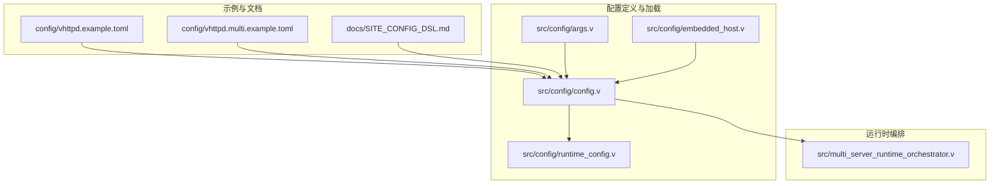
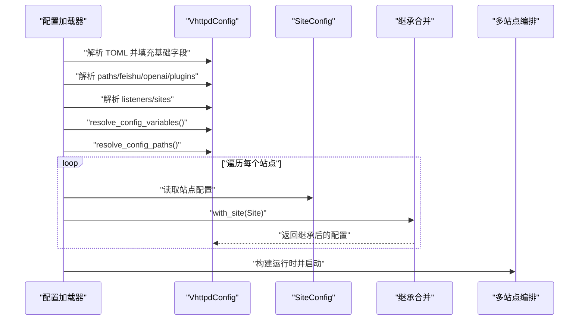
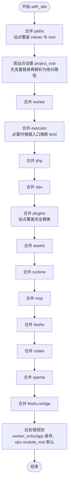
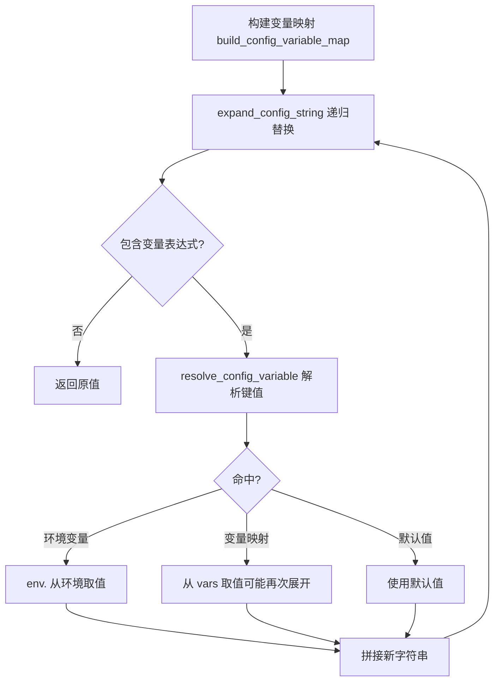
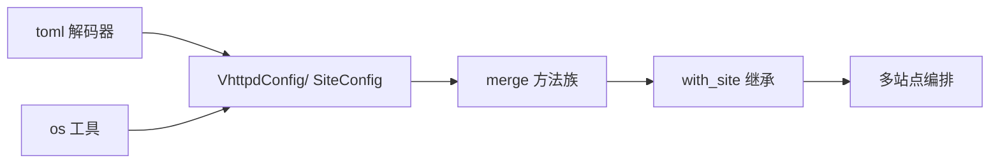

# 配置继承与覆盖

<cite>
**本文引用的文件**
- [config.v](file://src/config/config.v)
- [runtime_config.v](file://src/config/runtime_config.v)
- [args.v](file://src/config/args.v)
- [embedded_host.v](file://src/config/embedded_host.v)
- [multi_server_runtime_orchestrator.v](file://src/multi_server_runtime_orchestrator.v)
- [vhttpd.example.toml](file://config/vhttpd.example.toml)
- [vhttpd.multi.example.toml](file://config/vhttpd.multi.example.toml)
- [SITE_CONFIG_DSL.md](file://docs/SITE_CONFIG_DSL.md)
</cite>

## 目录
1. [简介](#简介)
2. [项目结构](#项目结构)
3. [核心组件](#核心组件)
4. [架构总览](#架构总览)
5. [详细组件分析](#详细组件分析)
6. [依赖分析](#依赖分析)
7. [性能考量](#性能考量)
8. [故障排查指南](#故障排查指南)
9. [结论](#结论)
10. [附录](#附录)

## 简介
本文系统化阐述 vhttpd 的“配置继承与覆盖”机制，聚焦以下关键点：
- 全局配置与站点配置的继承关系与字段级继承规则
- 配置优先级体系与合并算法
- 冲突解决与默认值策略
- 配置变量替换与环境变量注入的实现原理
- 实际应用场景与使用模式（共享配置、差异化配置、条件配置）
- 调试技巧与常见问题排查
- 配置验证与错误处理建议

## 项目结构
围绕配置继承与覆盖，vhttpd 的关键实现分布在如下模块：
- 配置模型与加载：src/config/config.v
- 运行时合并与继承：src/config/runtime_config.v
- 多站点运行时编排：src/multi_server_runtime_orchestrator.v
- CLI 参数辅助：src/config/args.v
- 嵌入式宿主配置解析：src/config/embedded_host.v
- 示例配置：config/vhttpd.example.toml、config/vhttpd.multi.example.toml
- 站点配置 DSL 文档：docs/SITE_CONFIG_DSL.md

**图示来源**
- [config.v](file://src/config/config.v)
- [runtime_config.v](file://src/config/runtime_config.v)
- [args.v](file://src/config/args.v)
- [embedded_host.v](file://src/config/embedded_host.v)
- [multi_server_runtime_orchestrator.v](file://src/multi_server_runtime_orchestrator.v)
- [vhttpd.example.toml](file://config/vhttpd.example.toml)
- [vhttpd.multi.example.toml](file://config/vhttpd.multi.example.toml)
- [SITE_CONFIG_DSL.md](file://docs/SITE_CONFIG_DSL.md)

**章节来源**
- [config.v](file://src/config/config.v)
- [runtime_config.v](file://src/config/runtime_config.v)
- [args.v](file://src/config/args.v)
- [embedded_host.v](file://src/config/embedded_host.v)
- [multi_server_runtime_orchestrator.v](file://src/multi_server_runtime_orchestrator.v)
- [vhttpd.example.toml](file://config/vhttpd.example.toml)
- [vhttpd.multi.example.toml](file://config/vhttpd.multi.example.toml)
- [SITE_CONFIG_DSL.md](file://docs/SITE_CONFIG_DSL.md)

## 核心组件
- 全局配置模型：VhttpdConfig 包含 server、files、paths、worker、executor、php、vjsx、plugins、websocket_*、admin、assets、runtime、mcp、feishu、codex、openai、db、listeners、sites 等字段。
- 站点配置模型：SiteConfig 包含 project_root、host、port、app、worker_entry、paths、worker、executor、php、vjsx、plugins、websocket_*、assets、runtime、mcp、feishu、codex、openai、db 等字段。
- 合并函数族：各子配置类型均提供 merge 方法，用于将“站点覆盖配置”应用于“全局基础配置”，并结合 with_site 完成整体继承。
- 变量替换与路径解析：resolve_config_variables 构建变量映射，expand_config_string 递归替换表达式；resolve_config_paths 将相对路径解析为绝对路径。

**章节来源**
- [config.v](file://src/config/config.v)
- [runtime_config.v](file://src/config/runtime_config.v)

## 架构总览
vhttpd 在加载配置后，执行以下流程：
1) 解析 TOML 并构建 VhttpdConfig；
2) 解析 paths、feishu、openai、plugins 等根级结构；
3) 解析多监听器与站点定义；
4) 执行变量替换与路径解析；
5) 对每个站点调用 with_site，完成全局到站点的继承与覆盖；
6) 多站点模式下由运行时编排器构建各站点应用实例。

**图示来源**
- [config.v](file://src/config/config.v)
- [runtime_config.v](file://src/config/runtime_config.v)
- [multi_server_runtime_orchestrator.v](file://src/multi_server_runtime_orchestrator.v)

## 详细组件分析

### 继承与覆盖优先级与合并算法
- 优先级原则
  - 站点级配置优先覆盖全局配置；
  - 字段级覆盖遵循“非空即覆盖”的策略；
  - 列表类字段通常采用完全替换（如 plugins），而非逐项合并；
  - 特殊字段（如 executor.kind）在站点存在入口时进行推断与覆盖。
- 合并算法要点
  - 数值/布尔/字符串：当站点覆盖值非默认值时生效；
  - 列表：站点提供则整体替换；
  - 嵌套对象：逐字段比较并覆盖；
  - 特殊逻辑：当站点未显式设置 executor.kind 且存在入口（php/vjsx），则根据入口类型推断；
  - 路径与变量：先变量替换，再路径解析，最后应用站点覆盖。

**图示来源**
- [runtime_config.v](file://src/config/runtime_config.v)

**章节来源**
- [runtime_config.v](file://src/config/runtime_config.v)

### 字段级继承规则与覆盖策略
- 路径与变量
  - paths.root 与 paths.values 支持变量替换与路径规范化；
  - 路径解析时以 config 文件所在目录为基底，相对路径转绝对路径。
- 执行器推断
  - 若站点未显式设置 executor.kind，但提供了 php/vjsx 入口或 app，则根据入口类型推断；
  - 若站点设置了 worker.entry 或 app，且当前 executor.kind 为 php 且 php.worker_entry 为空，则用站点值填充。
- 默认值策略
  - 合并时以 default_vhttpd_config() 生成的默认值作为“是否覆盖”的判断基准；
  - 列表字段仅在站点提供非空列表时才覆盖。

**章节来源**
- [runtime_config.v](file://src/config/runtime_config.v)
- [config.v](file://src/config/config.v)

### 配置变量替换与环境变量注入
- 变量表达式语法
  - 支持 `${key}` 与 `${key:-default}` 两种形式；
  - 支持 env.<key> 注入环境变量，缺失时可回退默认值。
- 替换流程
  - build_config_variable_map 构建变量映射（含 paths.*、php.*、vjsx.*、feishu.*、openai.*、plugins.* 等）；
  - expand_config_string 递归展开表达式，支持跨字段引用；
  - resolve_config_variable 解析具体键值，优先作用域内同名变量，其次全局变量，最后环境变量。
- 路径解析
  - resolve_config_paths 将所有相对路径基于 paths.root 或配置文件目录解析为绝对路径；
  - 支持对数组字段（如 php.extensions、php.args、vjsx.signature_* 等）逐一展开。

**图示来源**
- [config.v](file://src/config/config.v)

**章节来源**
- [config.v](file://src/config/config.v)

### 多站点模式与站点 DSL
- 站点 DSL 提供“拍平写法”与“命名空间写法”两种形态，二者等价；
- 省略规则：
  - 可省略 listeners，自动按 sites.<id> 的 host/port 合成；
  - root 与 project_root 等价，推荐使用 root；
  - app 为 executor 入口的统一别名；
  - worker.entry 为 PHP worker 入口别名；
  - vjsx.module_root 默认等于 root。
- 多站点运行时由编排器解析 listeners 并构建各站点应用。

**章节来源**
- [SITE_CONFIG_DSL.md](file://docs/SITE_CONFIG_DSL.md)
- [config.v](file://src/config/config.v)
- [multi_server_runtime_orchestrator.v](file://src/multi_server_runtime_orchestrator.v)

### 实际应用场景与使用模式
- 共享配置
  - 将公共参数置于全局（如 paths、worker、runtime、assets 等），在各站点仅声明差异字段；
  - 使用变量表达式统一管理端口、路径等，便于批量修改。
- 差异化配置
  - PHP 站点与 vjsx 站点分别在 php.* 与 vjsx.* 下定制参数；
  - 不同站点的 executor.kind 可不同，入口别名 app 自动映射至对应入口。
- 条件配置
  - 通过 env.* 注入敏感参数（如密钥、令牌），在站点层提供默认回退；
  - 使用 ${key:-default} 在不同环境间切换。

**章节来源**
- [vhttpd.example.toml](file://config/vhttpd.example.toml)
- [vhttpd.multi.example.toml](file://config/vhttpd.multi.example.toml)
- [config.v](file://src/config/config.v)

### 配置验证与错误处理机制
- 加载阶段
  - load_vhttpd_config 返回默认配置或解析错误；
  - resolve_config_variables 在最大轮次内递归展开，检测循环引用并报错；
  - resolve_config_paths 将相对路径解析为绝对路径，避免运行时找不到资源。
- 运行时阶段
  - 多监听器解析时，若站点缺少 port 将报错；
  - 嵌入式宿主解析 CLI 覆盖项时，缺失必要入口将报错。
- 建议增强
  - 在 load_vhttpd_config 之后增加 validate_config 阶段，检查互斥项、端口冲突、路径可写性等，尽早失败并提供清晰错误信息。

**章节来源**
- [config.v](file://src/config/config.v)
- [runtime_config.v](file://src/config/runtime_config.v)
- [embedded_host.v](file://src/config/embedded_host.v)

## 依赖分析
- 配置模型依赖 toml 解码器与 os 工具；
- 合并逻辑依赖 default_vhttpd_config() 提供的默认值集合；
- 变量替换依赖 build_config_variable_map 生成的变量表；
- 多站点编排依赖 listeners 与 sites 的解析结果。

**图示来源**
- [config.v](file://src/config/config.v)
- [runtime_config.v](file://src/config/runtime_config.v)
- [multi_server_runtime_orchestrator.v](file://src/multi_server_runtime_orchestrator.v)

**章节来源**
- [config.v](file://src/config/config.v)
- [runtime_config.v](file://src/config/runtime_config.v)
- [multi_server_runtime_orchestrator.v](file://src/multi_server_runtime_orchestrator.v)

## 性能考量
- 变量替换轮次控制：resolve_config_variables 限制最大轮次，防止循环引用导致无限展开；
- 路径解析一次性完成：resolve_config_paths 在变量替换完成后集中处理，减少重复计算；
- 列表覆盖策略：plugins 等列表采用完全替换，避免深层合并带来的复杂度与性能开销；
- 合并函数按需覆盖：仅在站点提供非默认值时才进行赋值，降低不必要的内存拷贝。

[本节为通用指导，无需特定文件分析]

## 故障排查指南
- 循环引用与变量未定义
  - 现象：变量替换报错，提示超出最大轮次或未知变量；
  - 排查：检查变量表达式是否自引用，确认 env.* 是否正确设置。
- 路径不可达
  - 现象：运行时报找不到扩展、入口文件或构建目录；
  - 排查：确认 paths.root 与 paths.values 的变量已正确替换，使用 resolve_config_paths 后的绝对路径是否有效。
- 端口冲突或多监听器缺失
  - 现象：多站点启动时报缺少 port 或监听器配置无效；
  - 排查：为每个站点明确 host/port，或省略 listeners 让系统自动生成。
- 执行器入口推断失败
  - 现象：executor.kind 与期望不符；
  - 排查：显式设置 executor.kind 或提供 app/php/vjsx 入口以便自动推断。

**章节来源**
- [config.v](file://src/config/config.v)
- [runtime_config.v](file://src/config/runtime_config.v)

## 结论
vhttpd 的配置继承与覆盖以“站点覆盖全局”为核心原则，通过字段级覆盖、特殊推断与严格的变量替换/路径解析，实现了灵活而可控的多站点配置管理。配合站点 DSL 与运行时编排，用户可在保持全局一致性的同时，快速实现差异化部署。建议在生产环境中增加配置验证阶段，进一步提升健壮性与可观测性。

[本节为总结，无需特定文件分析]

## 附录
- 示例参考
  - 单实例示例：config/vhttpd.example.toml
  - 多站点示例：config/vhttpd.multi.example.toml
  - 站点 DSL 说明：docs/SITE_CONFIG_DSL.md

**章节来源**
- [vhttpd.example.toml](file://config/vhttpd.example.toml)
- [vhttpd.multi.example.toml](file://config/vhttpd.multi.example.toml)
- [SITE_CONFIG_DSL.md](file://docs/SITE_CONFIG_DSL.md)