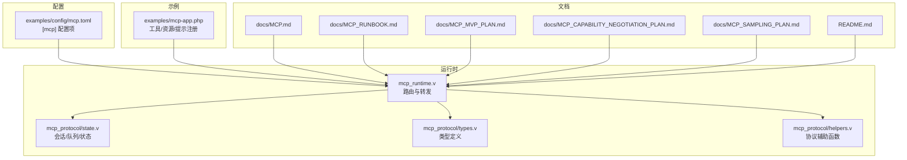
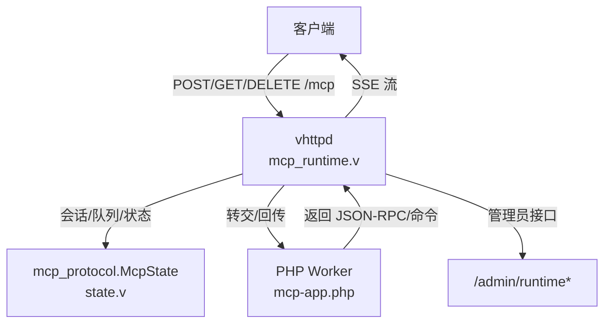
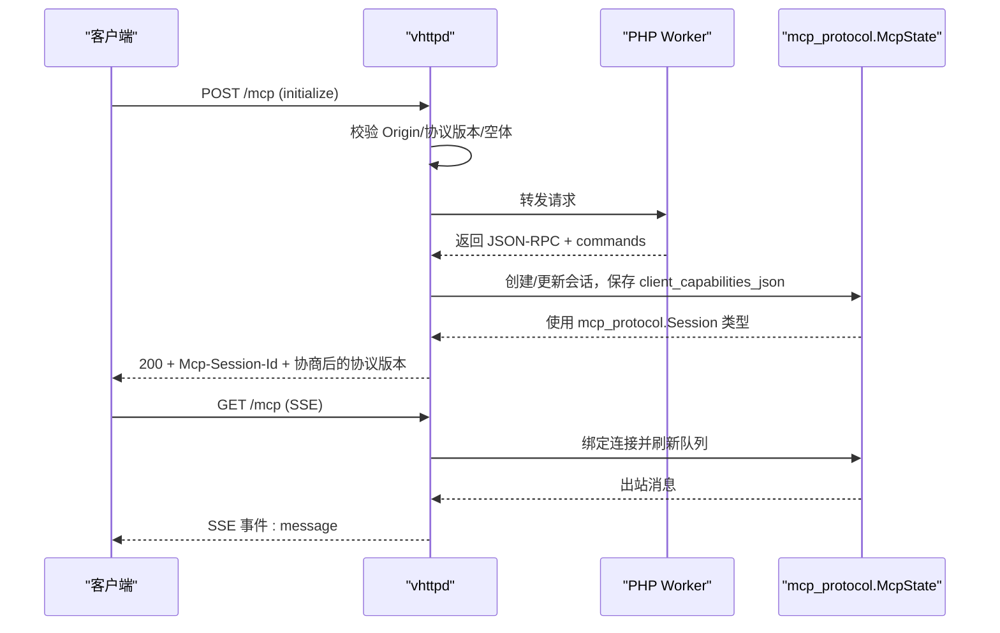
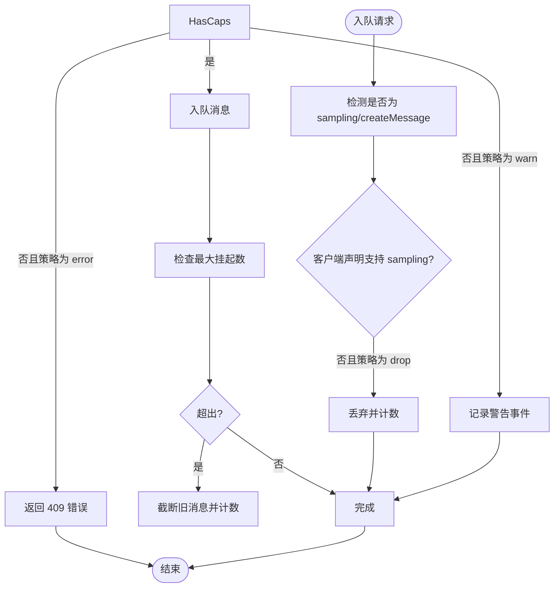
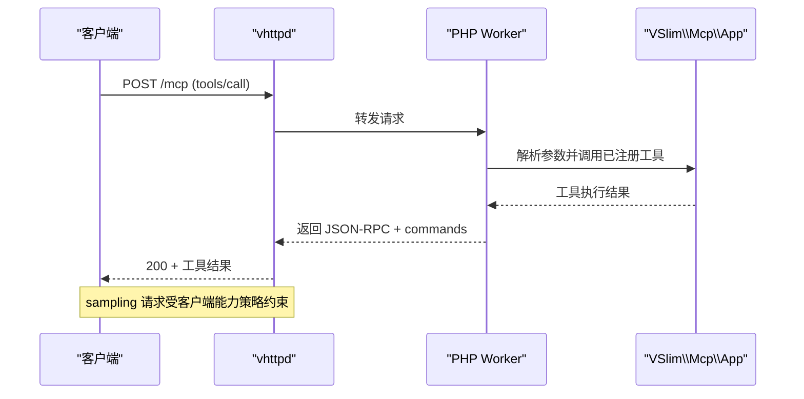
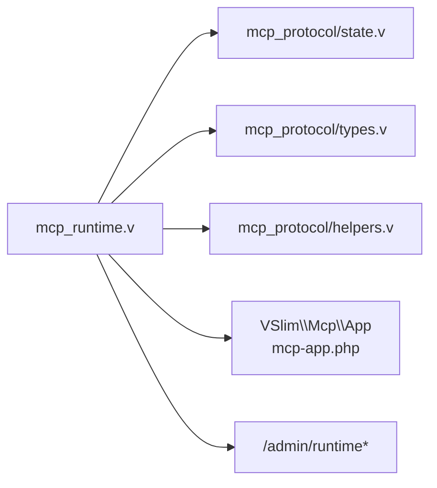

# MCP 运行时配置

<cite>
**本文引用的文件**
- [src/mcp_runtime.v](file://src/mcp_runtime.v)
- [src/mcp_protocol/state.v](file://src/mcp_protocol/state.v)
- [src/mcp_protocol/types.v](file://src/mcp_protocol/types.v)
- [src/mcp_protocol/helpers.v](file://src/mcp_protocol/helpers.v)
- [docs/MCP.md](file://docs/MCP.md)
- [docs/MCP_RUNBOOK.md](file://docs/MCP_RUNBOOK.md)
- [docs/MCP_MVP_PLAN.md](file://docs/MCP_MVP_PLAN.md)
- [docs/MCP_CAPABILITY_NEGOTIATION_PLAN.md](file://docs/MCP_CAPABILITY_NEGOTIATION_PLAN.md)
- [docs/MCP_SAMPLING_PLAN.md](file://docs/MCP_SAMPLING_PLAN.md)
- [examples/config/mcp.toml](file://examples/config/mcp.toml)
- [examples/mcp-app.php](file://examples/mcp-app.php)
- [README.md](file://README.md)
</cite>

## 目录
1. [简介](#简介)
2. [项目结构](#项目结构)
3. [核心组件](#核心组件)
4. [架构总览](#架构总览)
5. [详细组件分析](#详细组件分析)
6. [依赖关系分析](#依赖关系分析)
7. [性能考量](#性能考量)
8. [故障排查指南](#故障排查指南)
9. [结论](#结论)
10. [附录](#附录)

## 简介
本文件面向 vhttpd 的 MCP（Model Context Protocol）运行时配置，系统性阐述以下主题：
- MCP 协议配置：协议版本、能力协商、认证与来源校验、消息格式与传输模式
- 分布式特性：服务发现、健康检查、负载均衡与故障转移（结合 vhttpd 的会话与 SSE 管理）
- 工具调用配置：工具注册、参数校验、结果处理、错误传播
- 安全配置：身份验证、授权控制、数据保护、审计追踪
- 运维监控：协议统计、工具使用情况、性能指标、错误分析

vhttpd 将 MCP 的职责限定在 transport/runtime 层面，应用语义（如 tools/resources/prompts/sampling 等）由 PHP worker 负责。

**更新** 类型系统重构已完成，MCP 运行时中的类型别名已移除，直接使用模块限定名（如 `mcp_protocol.Session`、`mcp_protocol.McpState`、`mcp_protocol.QueueResult`）。

章节来源
- [docs/MCP.md:1-185](file://docs/MCP.md#L1-L185)

## 项目结构
围绕 MCP 运行时的关键代码与配置分布如下：
- 运行时入口与路由：src/mcp_runtime.v
- 会话与队列状态管理：src/mcp_protocol/state.v
- 类型定义与协议规范：src/mcp_protocol/types.v
- 协议辅助函数：src/mcp_protocol/helpers.v
- 配置示例：examples/config/mcp.toml
- 示例应用与工具注册：examples/mcp-app.php
- 文档与验证流程：docs/MCP*.md、docs/MCP_RUNBOOK.md
- 项目背景与集成说明：README.md

图示来源
- [src/mcp_runtime.v:114-331](file://src/mcp_runtime.v#L114-L331)
- [src/mcp_protocol/state.v:57-100](file://src/mcp_protocol/state.v#L57-L100)
- [src/mcp_protocol/types.v:1-99](file://src/mcp_protocol/types.v#L1-L99)
- [src/mcp_protocol/helpers.v:1-56](file://src/mcp_protocol/helpers.v#L1-L56)
- [examples/config/mcp.toml:24-32](file://examples/config/mcp.toml#L24-L32)
- [examples/mcp-app.php:7-139](file://examples/mcp-app.php#L7-L139)
- [docs/MCP.md:1-185](file://docs/MCP.md#L1-L185)
- [docs/MCP_RUNBOOK.md:1-200](file://docs/MCP_RUNBOOK.md#L1-L200)
- [docs/MCP_MVP_PLAN.md:430-487](file://docs/MCP_MVP_PLAN.md#L430-L487)
- [docs/MCP_CAPABILITY_NEGOTIATION_PLAN.md:1-262](file://docs/MCP_CAPABILITY_NEGOTIATION_PLAN.md#L1-L262)
- [docs/MCP_SAMPLING_PLAN.md:1-64](file://docs/MCP_SAMPLING_PLAN.md#L1-L64)
- [README.md:722-744](file://README.md#L722-L744)

## 核心组件
- 运行时路由与转发
  - POST /mcp：JSON-RPC 请求处理、协议版本校验、Origin 校验、会话创建与能力快照、消息入队与 SSE 推送
  - GET /mcp：SSE 会话流，长连接推送队列消息
  - DELETE /mcp：会话终止
- 会话与队列状态
  - 会话生命周期管理（创建、更新、修剪、驱逐）
  - 消息队列与出站刷新（带最大挂起数截断）
  - 客户端能力快照存储与查询
- 类型系统重构
  - 所有 MCP 相关类型直接使用模块限定名（如 `mcp_protocol.Session`、`mcp_protocol.McpState`）
  - 移除了类型别名，提高了类型引用的清晰度
- 配置与策略
  - 最大会话数、最大挂起消息数、会话 TTL
  - Origin 白名单
  - sampling 能力策略（warn/drop/error）

**更新** 类型系统重构后，所有类型引用都使用完整的模块限定名，提高了代码的可读性和维护性。

章节来源
- [src/mcp_runtime.v:114-331](file://src/mcp_runtime.v#L114-L331)
- [src/mcp_protocol/state.v:57-100](file://src/mcp_protocol/state.v#L57-L100)
- [src/mcp_protocol/state.v:170-197](file://src/mcp_protocol/state.v#L170-L197)
- [src/mcp_protocol/state.v:229-306](file://src/mcp_protocol/state.v#L229-L306)
- [src/mcp_protocol/types.v:1-99](file://src/mcp_protocol/types.v#L1-L99)
- [examples/config/mcp.toml:24-32](file://examples/config/mcp.toml#L24-L32)

## 架构总览
vhttpd 的 MCP 运行时采用"传输/运行时"与"应用语义"分离的设计：
- vhttpd 负责：HTTP/SSE 传输、会话管理、Origin 校验、协议版本校验、消息队列与出站、管理员可见性
- PHP worker 负责：MCP 方法处理、能力声明、工具/资源/提示注册、sampling 请求构造与结果处理

**更新** 类型系统重构后，运行时组件间的类型交互更加清晰，所有类型都通过模块限定名明确标识。

图示来源
- [src/mcp_runtime.v:114-331](file://src/mcp_runtime.v#L114-L331)
- [src/mcp_protocol/state.v:57-100](file://src/mcp_protocol/state.v#L57-L100)
- [examples/mcp-app.php:7-139](file://examples/mcp-app.php#L7-L139)

章节来源
- [docs/MCP.md:29-46](file://docs/MCP.md#L29-L46)
- [src/mcp_runtime.v:114-331](file://src/mcp_runtime.v#L114-L331)
- [src/mcp_protocol/state.v:57-100](file://src/mcp_protocol/state.v#L57-L100)

## 详细组件分析

### 协议与消息配置
- 协议版本
  - 默认协议版本由会话类型提供；若请求未携带则使用默认值
  - 响应头返回协商后的协议版本
- 消息格式
  - JSON-RPC 2.0
  - SSE 事件体为标准 JSON 文本，事件名为 message
- 能力协商
  - 客户端在 initialize.params.capabilities 中声明能力
  - vhttpd 将客户端能力快照保存至会话，并在管理员接口可见
  - 对 sampling 等特定方法进行能力策略校验（warn/drop/error）

**更新** 类型系统重构后，消息处理中对类型引用更加明确，如 `mcp_protocol.QueueResult`、`mcp_protocol.Session` 等。

图示来源
- [src/mcp_runtime.v:114-331](file://src/mcp_runtime.v#L114-L331)
- [src/mcp_protocol/state.v:57-100](file://src/mcp_protocol/state.v#L57-L100)
- [docs/MCP_CAPABILITY_NEGOTIATION_PLAN.md:121-136](file://docs/MCP_CAPABILITY_NEGOTIATION_PLAN.md#L121-L136)

章节来源
- [src/mcp_runtime.v:165-187](file://src/mcp_runtime.v#L165-L187)
- [src/mcp_runtime.v:222-240](file://src/mcp_runtime.v#L222-L240)
- [src/mcp_protocol/state.v:343-354](file://src/mcp_protocol/state.v#L343-L354)
- [docs/MCP_CAPABILITY_NEGOTIATION_PLAN.md:121-136](file://docs/MCP_CAPABILITY_NEGOTIATION_PLAN.md#L121-L136)

### 会话与队列管理
- 会话生命周期
  - 创建：首次出现 initialize 或带会话 ID 的请求时
  - 更新：最后活动时间、协议版本、路径、trace/request ID
  - 修剪：按 TTL 清理过期会话
  - 驱逐：超过最大会话数时按最久未活跃驱逐
- 队列与出站
  - 入队：限制最大挂起消息数，超出则丢弃旧消息
  - 出站：SSE 连接持续刷新，定时保活
- 管理员可见性
  - /admin/runtime/mcp 支持摘要与详情、过滤与分页
  - 暴露会话数、挂起数、协议版本、配置上限与白名单

**更新** 类型系统重构后，会话管理中对类型引用更加明确，如 `mcp_protocol.Session`、`mcp_protocol.QueueResult` 等。

图示来源
- [src/mcp_runtime.v:18-112](file://src/mcp_runtime.v#L18-L112)
- [src/mcp_protocol/state.v:170-197](file://src/mcp_protocol/state.v#L170-L197)
- [docs/MCP_MVP_PLAN.md:457-468](file://docs/MCP_MVP_PLAN.md#L457-L468)

章节来源
- [src/mcp_protocol/state.v:8-30](file://src/mcp_protocol/state.v#L8-L30)
- [src/mcp_protocol/state.v:32-53](file://src/mcp_protocol/state.v#L32-L53)
- [src/mcp_protocol/state.v:170-197](file://src/mcp_protocol/state.v#L170-L197)
- [docs/MCP_MVP_PLAN.md:457-468](file://docs/MCP_MVP_PLAN.md#L457-L468)

### 认证与来源校验
- Origin 白名单
  - 若配置了 allowed_origins，则所有 /mcp 请求（POST/GET/DELETE）均需匹配
- 协议版本校验
  - 缺失时使用默认协议版本
- 管理令牌
  - 管理平面（/admin/*）支持令牌校验（示例配置中 admin.token 为空）

章节来源
- [src/mcp_runtime.v:150-164](file://src/mcp_runtime.v#L150-L164)
- [src/mcp_protocol/state.v:310-324](file://src/mcp_protocol/state.v#L310-L324)
- [examples/config/mcp.toml:29-32](file://examples/config/mcp.toml#L29-L32)
- [docs/MCP_MVP_PLAN.md:427-431](file://docs/MCP_MVP_PLAN.md#L427-L431)

### 工具调用配置
- 工具注册与参数校验
  - PHP 应用通过 VSlim\Mcp\App 注册工具，内置 tools/list 与 tools/call
  - 参数 schema 由注册时声明，调用时进行校验
- 结果处理与错误传播
  - 工具调用返回内容作为 MCP 工具结果
  - vhttpd 将 PHP worker 返回的内部 commands 与 mcp 结果一并处理
- sampling 请求
  - 仅在客户端声明支持 sampling 时才允许发送 sampling/createMessage
  - 策略可配置为 warn/drop/error

**更新** 类型系统重构后，工具调用配置中对类型引用更加明确，如 `mcp_protocol.McpState.normalize_sampling_capability_policy()` 等。

图示来源
- [examples/mcp-app.php:13-31](file://examples/mcp-app.php#L13-L31)
- [examples/mcp-app.php:66-79](file://examples/mcp-app.php#L66-L79)
- [docs/MCP_CAPABILITY_NEGOTIATION_PLAN.md:141-149](file://docs/MCP_CAPABILITY_NEGOTIATION_PLAN.md#L141-L149)
- [docs/MCP_SAMPLING_PLAN.md:41-64](file://docs/MCP_SAMPLING_PLAN.md#L41-L64)

章节来源
- [examples/mcp-app.php:13-31](file://examples/mcp-app.php#L13-L31)
- [examples/mcp-app.php:66-79](file://examples/mcp-app.php#L66-L79)
- [docs/MCP_CAPABILITY_NEGOTIATION_PLAN.md:141-149](file://docs/MCP_CAPABILITY_NEGOTIATION_PLAN.md#L141-L149)
- [docs/MCP_SAMPLING_PLAN.md:41-64](file://docs/MCP_SAMPLING_PLAN.md#L41-L64)
- [README.md:722-744](file://README.md#L722-L744)

### 分布式特性（服务发现/健康/负载/故障）
- 服务发现与健康检查
  - vhttpd 通过 /admin/runtime 与 /admin/runtime/mcp 暴露运行时概览与会话详情
  - 会话修剪与驱逐确保资源可控
- 负载均衡与故障转移
  - vhttpd 本身不承担多实例间会话亲和或故障转移
  - 建议通过外部负载均衡器（如反向代理）将 /mcp 请求分发至多个 vhttpd 实例
  - 客户端通过会话 ID 绑定到特定实例；实例重启后会话不可恢复

章节来源
- [docs/MCP_MVP_PLAN.md:381-396](file://docs/MCP_MVP_PLAN.md#L381-L396)
- [src/mcp_protocol/state.v:8-30](file://src/mcp_protocol/state.v#L8-L30)
- [src/mcp_protocol/state.v:32-53](file://src/mcp_protocol/state.v#L32-L53)

### 安全配置
- 身份验证与授权
  - 管理平面支持令牌校验（示例配置中 admin.token 为空，表示未启用）
  - 数据平面通过 Origin 白名单限制来源
- 数据保护与审计
  - 通过管理员接口查看会话与能力快照，便于审计
  - sampling 能力缺失时记录软警告事件，便于追踪

章节来源
- [examples/config/mcp.toml:22](file://examples/config/mcp.toml#L22)
- [src/mcp_runtime.v:150-164](file://src/mcp_runtime.v#L150-L164)
- [src/mcp_runtime.v:66-108](file://src/mcp_runtime.v#L66-L108)

### 监控配置
- 运行时可见性
  - /admin/runtime：显示 mcp_enabled、active_mcp_sessions 等
  - /admin/runtime/mcp：支持摘要/详情、过滤、分页
- 指标与事件
  - 会话过期/驱逐计数
  - 挂起消息丢弃计数
  - sampling 能力软警告计数
  - 事件日志：capability.warning/capability.drop/capability.error

章节来源
- [docs/MCP_MVP_PLAN.md:435-450](file://docs/MCP_MVP_PLAN.md#L435-L450)
- [src/mcp_runtime.v:66-108](file://src/mcp_runtime.v#L66-L108)
- [src/mcp_protocol/state.v:184-188](file://src/mcp_protocol/state.v#L184-L188)

## 依赖关系分析
- 组件耦合
  - mcp_runtime.v 依赖 mcp_protocol/state.v 提供会话与队列能力
  - 所有类型引用都使用模块限定名，如 `mcp_protocol.Session`、`mcp_protocol.McpState`、`mcp_protocol.QueueResult`
  - PHP 应用通过 VSlim\Mcp\App 注册能力，由 vhttpd 在初始化时保存客户端能力快照
- 外部依赖
  - 管理平面依赖 admin.token（可选）
  - SSE 依赖 TCP 连接与超时设置

**更新** 类型系统重构后，依赖关系更加清晰，所有类型引用都通过模块限定名明确标识，提高了代码的可读性和维护性。

图示来源
- [src/mcp_runtime.v:114-331](file://src/mcp_runtime.v#L114-L331)
- [src/mcp_protocol/state.v:57-100](file://src/mcp_protocol/state.v#L57-L100)
- [src/mcp_protocol/types.v:1-99](file://src/mcp_protocol/types.v#L1-L99)
- [src/mcp_protocol/helpers.v:1-56](file://src/mcp_protocol/helpers.v#L1-L56)
- [examples/mcp-app.php:7-139](file://examples/mcp-app.php#L7-L139)

章节来源
- [src/mcp_runtime.v:114-331](file://src/mcp_runtime.v#L114-L331)
- [src/mcp_protocol/state.v:57-100](file://src/mcp_protocol/state.v#L57-L100)
- [src/mcp_protocol/types.v:1-99](file://src/mcp_protocol/types.v#L1-L99)
- [src/mcp_protocol/helpers.v:1-56](file://src/mcp_protocol/helpers.v#L1-L56)
- [examples/mcp-app.php:7-139](file://examples/mcp-app.php#L7-L139)

## 性能考量
- 会话与队列压力控制
  - 通过 max_sessions、max_pending_messages、session_ttl_seconds 控制内存占用
  - 过期与驱逐机制避免资源泄漏
- 传输效率
  - SSE 无缓冲写入，长连接保活减少空闲连接成本
- 调优建议
  - 根据并发与消息量调整 max_sessions 与 max_pending_messages
  - 合理设置 session_ttl_seconds 以平衡资源与可用性

**更新** 类型系统重构后，性能考量保持不变，但类型引用的明确化有助于更好的性能分析和调试。

章节来源
- [docs/MCP_MVP_PLAN.md:387-392](file://docs/MCP_MVP_PLAN.md#L387-L392)
- [src/mcp_protocol/state.v:8-30](file://src/mcp_protocol/state.v#L8-L30)
- [src/mcp_protocol/state.v:184-188](file://src/mcp_protocol/state.v#L184-L188)

## 故障排查指南
- 常见问题与定位
  - 403 Forbidden Origin：检查 allowed_origins 配置与请求头 Origin
  - 400 Empty JSON-RPC Body：确认请求体非空
  - 409 Sampling capability required：客户端未声明 sampling，检查 sampling_capability_policy
  - 404 Unknown Mcp-Session-Id：会话不存在或已过期
- 验证步骤
  - 使用 runbook 中的 curl 步骤验证 initialize、SSE、队列消息与 sampling 请求
  - 通过 /admin/runtime 与 /admin/runtime/mcp 查看会话与能力快照
- 相关文档
  - MCP Runbook、MCP MVP 计划、能力协商计划

**更新** 类型系统重构后，故障排查中涉及的类型引用更加明确，如 `mcp_protocol.McpState`、`mcp_protocol.Session` 等，有助于更精确的问题定位。

章节来源
- [docs/MCP_RUNBOOK.md:1-200](file://docs/MCP_RUNBOOK.md#L1-L200)
- [docs/MCP_MVP_PLAN.md:435-450](file://docs/MCP_MVP_PLAN.md#L435-L450)
- [src/mcp_runtime.v:150-164](file://src/mcp_runtime.v#L150-L164)
- [src/mcp_runtime.v:244-261](file://src/mcp_runtime.v#L244-L261)

## 结论
vhttpd 的 MCP 运行时聚焦于传输与运行时的正确性与可观测性，将应用语义下沉至 PHP worker，形成清晰的职责边界。通过 Origin 白名单、协议版本校验、会话与队列限流、能力策略与管理员可见性，实现了安全、稳定、可观测的 MCP 数据面与管理面。

**更新** 类型系统重构进一步提升了运行时的清晰度和可维护性，所有类型引用都通过模块限定名明确标识，为系统的长期演进奠定了良好的基础。

## 附录

### 配置项速查表
- [mcp].max_sessions：最大会话数
- [mcp].max_pending_messages：最大挂起消息数
- [mcp].session_ttl_seconds：会话 TTL（秒）
- [mcp].sampling_capability_policy：sampling 能力策略（warn/drop/error）
- [mcp].allowed_origins：允许的 Origin 列表
- [admin].token：管理平面访问令牌（可选）

**更新** 类型系统重构后，配置项保持不变，但相关的类型定义更加清晰明确。

章节来源
- [examples/config/mcp.toml:24-32](file://examples/config/mcp.toml#L24-L32)
- [docs/MCP_MVP_PLAN.md:457-468](file://docs/MCP_MVP_PLAN.md#L457-L468)

### 类型系统重构说明
- **重构内容**：移除 MCP 运行时中的类型别名，直接使用模块限定名
- **影响范围**：所有 MCP 相关类型引用，如 `mcp_protocol.Session`、`mcp_protocol.McpState`、`mcp_protocol.QueueResult`
- **改进效果**：提高代码可读性、增强类型引用的明确性、便于维护和调试

**更新** 新增类型系统重构说明章节，详细解释重构内容和影响。

章节来源
- [src/mcp_runtime.v:13-107](file://src/mcp_runtime.v#L13-L107)
- [src/mcp_protocol/types.v:1-99](file://src/mcp_protocol/types.v#L1-L99)
- [src/mcp_protocol/state.v:83-98](file://src/mcp_protocol/state.v#L83-L98)