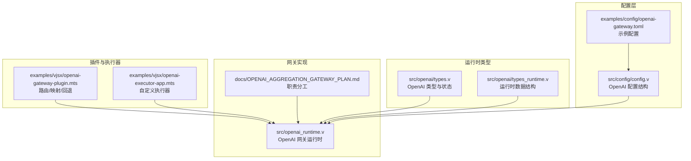
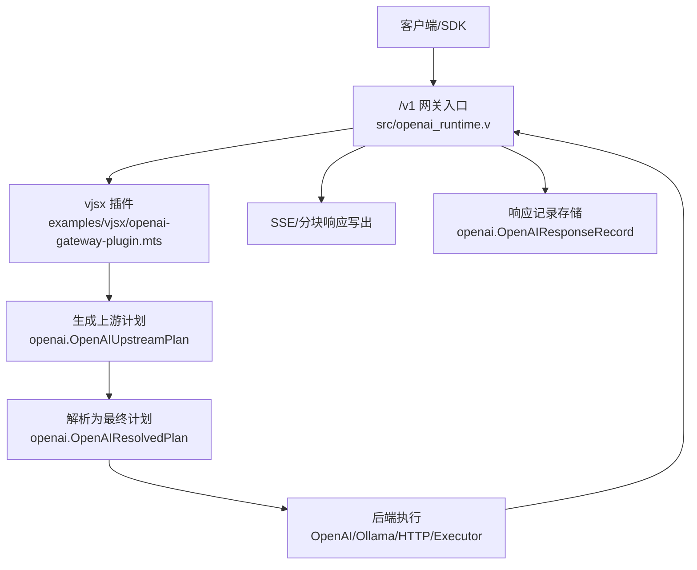
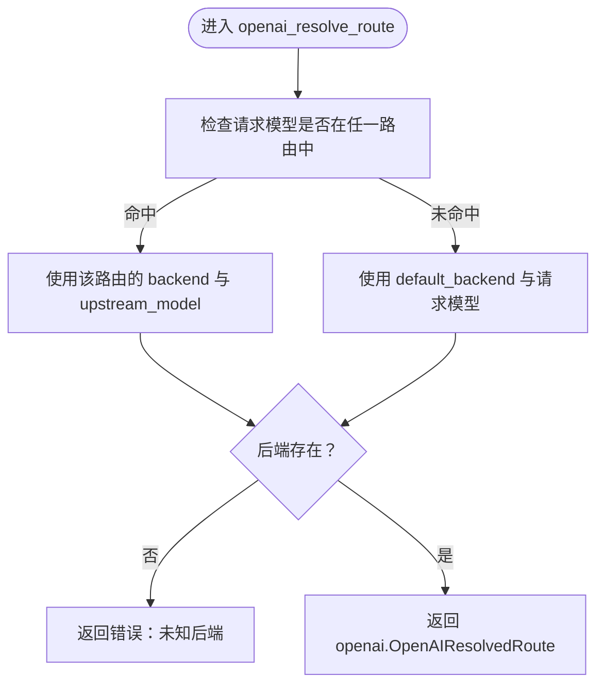
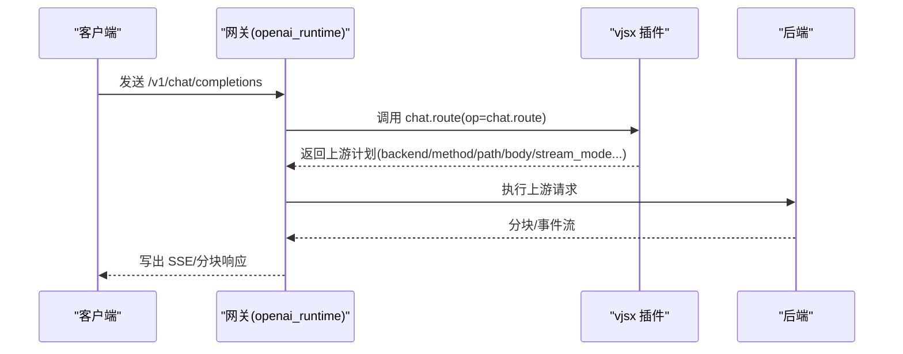
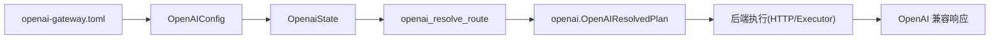

# OpenAI 运行时配置

<cite>
**本文引用的文件**   
- [src/config/config.v](file://src/config/config.v)
- [src/openai/types.v](file://src/openai/types.v)
- [src/openai/types_runtime.v](file://src/openai/types_runtime.v)
- [src/openai_runtime.v](file://src/openai_runtime.v)
- [examples/config/openai-gateway.toml](file://examples/config/openai-gateway.toml)
- [examples/vjsx/openai-gateway-plugin.mts](file://examples/vjsx/openai-gateway-plugin.mts)
- [examples/vjsx/openai-executor-app.mts](file://examples/vjsx/openai-executor-app.mts)
- [config/vhttpd.example.toml](file://config/vhttpd.example.toml)
- [docs/OPENAI_AGGREGATION_GATEWAY_PLAN.md](file://docs/OPENAI_AGGREGATION_GATEWAY_PLAN.md)
- [articles/12-advanced-patterns.md](file://articles/12-advanced-patterns.md)
</cite>

## 更新摘要
**变更内容**   
- 类型系统重构：OpenAI 运行时中的多个类型别名已移除，改用 `openai.*` 模块限定名
- 更新了所有涉及 OpenAI 类型引用的代码示例，确保使用完整的模块限定名
- 修正了类型定义和使用方式，反映新的模块化结构

## 目录
1. [简介](#简介)
2. [项目结构](#项目结构)
3. [核心组件](#核心组件)
4. [架构总览](#架构总览)
5. [详细组件分析](#详细组件分析)
6. [依赖关系分析](#依赖关系分析)
7. [性能考虑](#性能考虑)
8. [故障排查指南](#故障排查指南)
9. [结论](#结论)
10. [附录](#附录)

## 简介
本文件面向 vhttpd 的 OpenAI 运行时配置，系统性阐述以下内容：
- OpenAI API 的配置项：API 密钥管理、模型选择、请求参数、响应格式等
- 网关运行时的配置参数：代理设置、负载均衡、缓存策略、限流控制等
- 认证与安全：API 密钥轮换、多账户管理、权限控制等
- 性能优化：并发请求限制、超时设置、重试策略、错误处理
- 成本控制：使用量监控、预算限制、成本分析等财务管控

## 项目结构
围绕 OpenAI 运行时的关键目录与文件如下：
- 配置定义与解析：src/config/config.v（定义 OpenAI 各类配置结构）
- 运行时类型与状态：src/openai/types.v、src/openai/types_runtime.v
- 网关运行时实现：src/openai_runtime.v
- 示例配置与插件：examples/config/openai-gateway.toml、examples/vjsx/openai-gateway-plugin.mts、examples/vjsx/openai-executor-app.mts
- 通用示例配置：config/vhttpd.example.toml
- 架构设计文档：docs/OPENAI_AGGREGATION_GATEWAY_PLAN.md
- 速率限制参考实现：articles/12-advanced-patterns.md

**图表来源**
- [src/config/config.v:178-213](file://src/config/config.v#L178-L213)
- [src/openai/types.v:22-43](file://src/openai/types.v#L22-L43)
- [src/openai/types_runtime.v:1-174](file://src/openai/types_runtime.v#L1-L174)
- [src/openai_runtime.v:1-1566](file://src/openai_runtime.v#L1-L1566)
- [examples/config/openai-gateway.toml:1-65](file://examples/config/openai-gateway.toml#L1-L65)
- [examples/vjsx/openai-gateway-plugin.mts:1-213](file://examples/vjsx/openai-gateway-plugin.mts#L1-L213)
- [examples/vjsx/openai-executor-app.mts:1-102](file://examples/vjsx/openai-executor-app.mts#L1-L102)
- [docs/OPENAI_AGGREGATION_GATEWAY_PLAN.md:45-68](file://docs/OPENAI_AGGREGATION_GATEWAY_PLAN.md#L45-L68)

**章节来源**
- [src/config/config.v:178-213](file://src/config/config.v#L178-L213)
- [src/openai/types.v:22-43](file://src/openai/types.v#L22-L43)
- [src/openai/types_runtime.v:1-174](file://src/openai/types_runtime.v#L1-L174)
- [src/openai_runtime.v:1-1566](file://src/openai_runtime.v#L1-L1566)
- [examples/config/openai-gateway.toml:1-65](file://examples/config/openai-gateway.toml#L1-L65)
- [examples/vjsx/openai-gateway-plugin.mts:1-213](file://examples/vjsx/openai-gateway-plugin.mts#L1-L213)
- [examples/vjsx/openai-executor-app.mts:1-102](file://examples/vjsx/openai-executor-app.mts#L1-L102)
- [docs/OPENAI_AGGREGATION_GATEWAY_PLAN.md:45-68](file://docs/OPENAI_AGGREGATION_GATEWAY_PLAN.md#L45-L68)

## 核心组件
- OpenAI 配置结构
  - OpenAIEndpointsConfig：启用/禁用 endpoints（models、chat_completions、responses、embeddings）
  - OpenAIBackendConfig：后端类型、基础地址、执行器、API 密钥、密钥环境变量、超时
  - OpenAIRouteConfig：模型到后端的路由映射，支持上游模型别名
  - OpenAIConfig：顶层开关、base_path、默认后端、插件、后端与路由集合
- 运行时类型
  - OpenaiState：运行时持有的配置与内存状态存储
  - OpenAIResolvedRoute：解析后的路由与后端
  - OpenAIUpstreamPlan/OpenAIResolvedPlan：插件输出的上游计划与最终解析计划
  - OpenAIResponseRecord：完成响应的记录与 TTL 存储
- 运行时实现
  - 路由解析、插件调用、流式代理、响应记录与查询

**章节来源**
- [src/config/config.v:178-213](file://src/config/config.v#L178-L213)
- [src/openai/types.v:22-43](file://src/openai/types.v#L22-L43)
- [src/openai/types_runtime.v:6-41](file://src/openai/types_runtime.v#L6-L41)
- [src/openai_runtime.v:106-163](file://src/openai_runtime.v#L106-L163)

## 架构总览
vhttpd 将 OpenAI 兼容接口作为 /v1* 的网关入口，通过 vjsx 插件进行路由、映射与回退决策，再由具体后端（OpenAI、Ollama、自定义 HTTP、自定义执行器）执行请求，并负责客户端的 SSE/分块传输写入、取消、超时与日志。

**图表来源**
- [src/openai_runtime.v:165-200](file://src/openai_runtime.v#L165-L200)
- [src/openai/types.v:45-89](file://src/openai/types.v#L45-L89)
- [examples/vjsx/openai-gateway-plugin.mts:89-112](file://examples/vjsx/openai-gateway-plugin.mts#L89-L112)
- [docs/OPENAI_AGGREGATION_GATEWAY_PLAN.md:45-68](file://docs/OPENAI_AGGREGATION_GATEWAY_PLAN.md#L45-L68)

## 详细组件分析

### OpenAI 配置项详解
- 顶层开关与路径
  - enabled：是否启用 OpenAI 运行时
  - base_path：对外暴露的 OpenAI 兼容路径前缀，默认 /v1
  - default_backend：未命中路由时的默认后端名称
  - plugin：使用的 vjsx 插件名
- endpoints
  - models：是否开放模型列表
  - chat_completions：是否开放聊天补全
  - responses：是否开放 responses 接口
  - embeddings：是否开放嵌入接口
- backends
  - kind：后端类型（如 openai_http、http、executor）
  - base_url：上游基础地址
  - executor：当 kind=executor 时指定执行器名称
  - api_key / api_key_env：静态密钥或环境变量名
  - timeout_ms：上游请求超时
- routes
  - model：单模型直连
  - models：模型数组
  - backend：后端名称
  - upstream_model：上游实际使用的模型名（可为空则与请求模型一致）

示例配置要点（来自示例 TOML）：
- 启用 openai 模块、设置 base_path、默认后端为 openai
- 定义多个后端：openai、ollama、custom、custom_executor
- 定义多条路由：按模型名映射到不同后端
- 插件配置：vjsx 插件入口、线程数、网络能力等

**章节来源**
- [src/config/config.v:178-213](file://src/config/config.v#L178-L213)
- [examples/config/openai-gateway.toml:5-65](file://examples/config/openai-gateway.toml#L5-L65)

### 路由与后端解析流程
- 解析步骤
  - 从请求模型名匹配 routes 中的 models 或 model
  - 若未命中，回落到 default_backend
  - 根据 route.upstream_model 或请求模型决定上游模型
  - 返回 OpenAIResolvedRoute 与后端配置
- 关键函数
  - openai_resolve_route：解析路由
  - openai_call_plugin：调用 vjsx 插件以获取计划
  - openai_resolved_plan_from_plugin_result_with_defaults：从插件结果生成默认计划

**图表来源**
- [src/openai_runtime.v:119-163](file://src/openai_runtime.v#L119-L163)

**章节来源**
- [src/openai_runtime.v:119-163](file://src/openai_runtime.v#L119-L163)

### 插件路由、映射与回退
- 能力范围
  - models：返回公开模型列表
  - chat.route：根据模型选择 passthrough/mapped/executor
  - responses.route：根据模型选择对应后端
  - chat.map_frame：将上游帧映射为 OpenAI 兼容格式
  - chat.fallback：在特定失败条件下回退到替代后端
- 映射策略
  - passthrough：直接透传
  - mapped：NDJSON 流，response_codec=ndjson，output_protocol=openai.chat.completion
  - executor：由自定义执行器生成帧/事件

**图表来源**
- [examples/vjsx/openai-gateway-plugin.mts:89-112](file://examples/vjsx/openai-gateway-plugin.mts#L89-L112)
- [src/openai_runtime.v:165-200](file://src/openai_runtime.v#L165-L200)

**章节来源**
- [examples/vjsx/openai-gateway-plugin.mts:1-213](file://examples/vjsx/openai-gateway-plugin.mts#L1-L213)
- [src/openai_runtime.v:165-200](file://src/openai_runtime.v#L165-L200)

### 执行器模式
- 自定义执行器
  - 通过 kind=executor 指定 executor 名称
  - 插件返回 stream_mode=executor，由执行器产生帧/事件
  - 支持 responses.execute 与 chat.execute
- 示例执行器
  - openai-executor-app：模拟生成内容与用量统计，支持流式与非流式

**章节来源**
- [examples/vjsx/openai-executor-app.mts:1-102](file://examples/vjsx/openai-executor-app.mts#L1-L102)
- [examples/config/openai-gateway.toml:41-44](file://examples/config/openai-gateway.toml#L41-L44)

### 响应记录与查询
- 记录存储
  - 完成响应体中提取 response_id，写入内存存储并设置 TTL
- 查询接口
  - openai_store_response_record：写入
  - openai_models：汇总可用模型
  - openai_resolve_route：解析路由

**章节来源**
- [src/openai_runtime.v:96-117](file://src/openai_runtime.v#L96-L117)
- [src/openai/types_runtime.v:37-41](file://src/openai/types_runtime.v#L37-L41)

## 依赖关系分析
- 配置到运行时
  - OpenAIConfig 通过解析 TOML 注入到运行时状态
  - OpenaiState 持有 backends 与 routes，供路由解析使用
- 插件到运行时
  - vjsx 插件输出的 OpenAIResolvedPlan 由运行时进一步执行
- 后端到执行
  - 后端类型决定执行方式：HTTP、Executor
  - 执行器负责将内部帧/事件标准化为 OpenAI 兼容格式

**图表来源**
- [examples/config/openai-gateway.toml:5-65](file://examples/config/openai-gateway.toml#L5-L65)
- [src/config/config.v:204-213](file://src/config/config.v#L204-L213)
- [src/openai/types.v:22-43](file://src/openai/types.v#L22-L43)
- [src/openai_runtime.v:119-163](file://src/openai_runtime.v#L119-L163)

**章节来源**
- [src/config/config.v:204-213](file://src/config/config.v#L204-L213)
- [src/openai/types.v:22-43](file://src/openai/types.v#L22-L43)
- [src/openai_runtime.v:119-163](file://src/openai_runtime.v#L119-L163)

## 性能考虑
- 并发与队列
  - 工作进程池与队列容量、超时、重启退避等通用运行时参数可影响 OpenAI 请求的排队与执行稳定性
  - 参考通用配置项：worker.pool_size、worker.queue_capacity、worker.queue_timeout_ms、worker.restart_backoff_ms 等
- 超时与重试
  - 后端超时：OpenAIBackendConfig.timeout_ms 控制上游请求超时
  - 插件/执行器侧可结合回退策略（fallback）在 5xx 场景下切换后端
- 流式传输
  - 运行时负责 SSE/分块写入，需关注客户端断开检测与取消
- 日志与可观测性
  - 运行时记录请求/响应事件，便于定位性能瓶颈

**章节来源**
- [src/config/config.v:186-194](file://src/config/config.v#L186-L194)
- [examples/vjsx/openai-gateway-plugin.mts:171-195](file://examples/vjsx/openai-gateway-plugin.mts#L171-L195)
- [src/openai_runtime.v:14-15](file://src/openai_runtime.v#L14-L15)

## 故障排查指南
- 常见问题定位
  - 无匹配路由：检查 routes 配置与模型名是否一致
  - 未知后端：确认 backend 名称正确且存在于 backends
  - 插件未配置：确保 openai.plugin 设置为有效插件名
  - 回退生效：观察 fallback 条件（如 failed_backend=“openai”且 status_code>=500）
- 错误处理
  - 运行时将上游错误映射为 OpenAI 兼容错误体
  - 对于流式场景，确保 done 标记与 chunk 解码正确
- 日志与指标
  - 利用运行时事件与 admin 接口查看请求详情与错误分类

**章节来源**
- [src/openai_runtime.v:165-196](file://src/openai_runtime.v#L165-L196)
- [examples/vjsx/openai-gateway-plugin.mts:171-195](file://examples/vjsx/openai-gateway-plugin.mts#L171-L195)
- [src/openai/types_runtime.v:23-33](file://src/openai/types_runtime.v#L23-L33)

## 结论
vhttpd 的 OpenAI 运行时通过清晰的配置层、灵活的 vjsx 插件与多后端执行能力，实现了 OpenAI 兼容接口的统一网关。借助路由、映射与回退机制，可在多供应商与自定义执行器之间平滑切换；配合通用运行时参数与可观测性，可满足生产环境的性能与可靠性要求。

## 附录

### OpenAI 配置清单与建议
- API 密钥管理
  - 优先使用 api_key_env 指向环境变量，避免硬编码
  - 多后端可分别配置不同密钥或环境变量
- 模型选择与路由
  - 使用 routes.models 数组精确控制模型归属
  - 通过 upstream_model 实现模型别名或兼容映射
- 请求参数与响应格式
  - 通过插件的 stream_mode 与 response_codec 控制流式行为
  - 输出协议统一为 OpenAI 兼容格式
- 代理与执行器
  - HTTP 后端：配置 base_url 与超时
  - Executor 后端：通过插件返回 stream_mode=executor
- 限流与配额
  - 可在应用层使用 Redis 实现速率限制（参考文章中的示例）
  - 结合后端自身的配额与重试策略

**章节来源**
- [src/config/config.v:186-202](file://src/config/config.v#L186-L202)
- [examples/config/openai-gateway.toml:25-44](file://examples/config/openai-gateway.toml#L25-L44)
- [examples/vjsx/openai-gateway-plugin.mts:42-112](file://examples/vjsx/openai-gateway-plugin.mts#L42-L112)
- [articles/12-advanced-patterns.md:822-915](file://articles/12-advanced-patterns.md#L822-L915)

### 类型系统重构说明
**更新** 由于类型系统重构，OpenAI 运行时中的多个类型别名已移除，改用 `openai.*` 模块限定名。这意味着：

- 所有 OpenAI 相关类型现在必须使用完整限定名，如 `openai.OpenAIResolvedRoute` 而不是简化的 `OpenAIResolvedRoute`
- 类型定义位于 `src/openai/types.v` 和 `src/openai/types_runtime.v` 文件中，每个类型都明确声明了 `module openai`
- 运行时代码中对这些类型的引用都需要更新为模块限定形式
- 这种重构提高了代码的模块化程度，避免了类型冲突，并使代码意图更加清晰

**章节来源**
- [src/openai/types.v:1-89](file://src/openai/types.v#L1-L89)
- [src/openai/types_runtime.v:1-174](file://src/openai/types_runtime.v#L1-L174)
- [src/openai_runtime.v:136-167](file://src/openai_runtime.v#L136-L167)