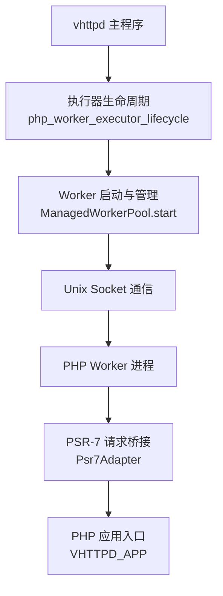
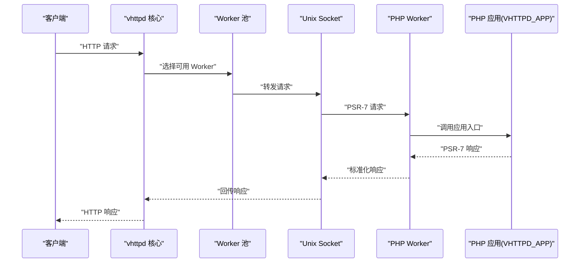
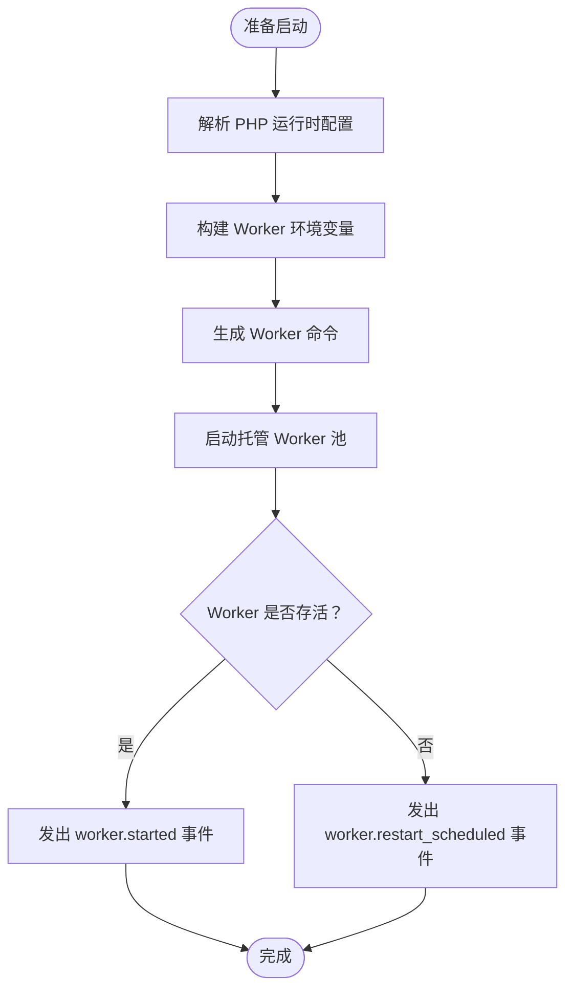
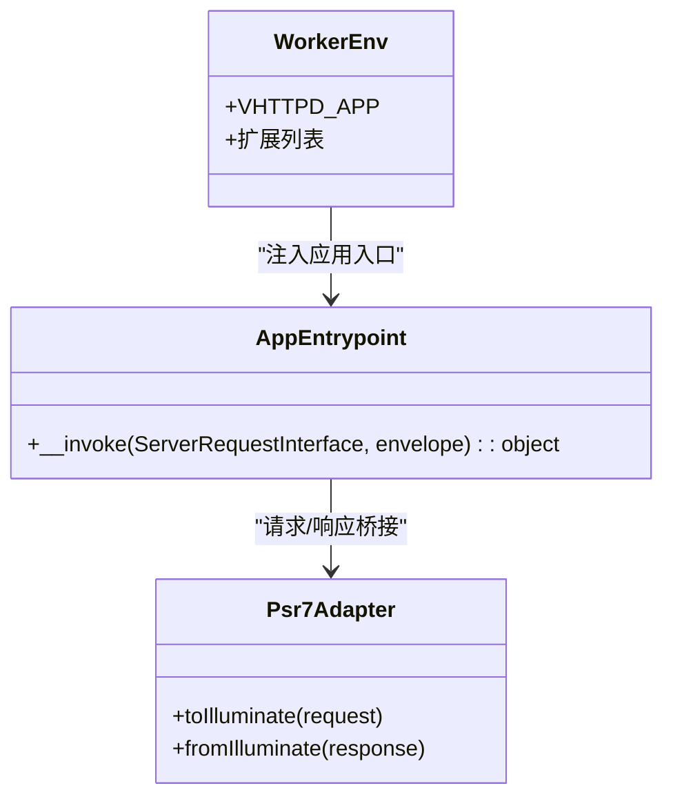
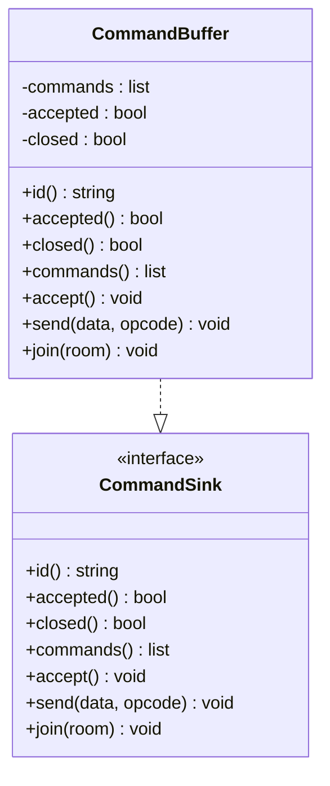
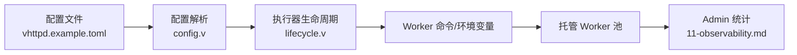

# PHP Worker 配置

<cite>
**本文引用的文件**
- [vhttpd.example.toml](file://config/vhttpd.example.toml)
- [EXECUTOR_MODES.md](file://docs/EXECUTOR_MODES.md)
- [03-php-apps.md](file://articles/03-php-apps.md)
- [11-observability.md](file://articles/11-observability.md)
- [lifecycle.v](file://src/executor/lifecycle.v)
- [config.v](file://src/config/config.v)
- [types.v](file://src/stats/types.v)
- [vhttpd.toml](file://vhttpd.toml)
- [app.php (Laravel 示例)](file://examples/laravel/app.php)
- [app.php (Symfony 示例)](file://examples/symfony/app.php)
- [CommandBuffer.php](file://php/package/src/VHttpd/PhpWorker/WebSocket/CommandBuffer.php)
</cite>

## 目录
1. [简介](#简介)
2. [项目结构](#项目结构)
3. [核心组件](#核心组件)
4. [架构总览](#架构总览)
5. [详细组件分析](#详细组件分析)
6. [依赖关系分析](#依赖关系分析)
7. [性能考虑](#性能考虑)
8. [故障排查指南](#故障排查指南)
9. [结论](#结论)
10. [附录](#附录)

## 简介
本文面向 vhttpd 的 PHP Worker 配置，系统性阐述 PHP 执行器的配置要点与最佳实践，覆盖以下主题：
- PHP 执行器与 Worker 生命周期
- PHP 应用集成（应用路径、自动加载、中间件、路由）
- 进程管理（进程池大小、生命周期、资源回收、错误处理）
- 安全配置（沙箱、权限、输入校验、输出过滤）
- 性能监控（执行时间、内存、错误日志、瓶颈定位）

## 项目结构
围绕 PHP Worker 的关键配置与实现分布在如下位置：
- 配置模板与示例：config/vhttpd.example.toml、vhttpd.toml
- 执行器与生命周期：src/executor/lifecycle.v
- 配置解析与扩展：src/config/config.v
- 文档与示例：docs/EXECUTOR_MODES.md、articles/03-php-apps.md、articles/11-observability.md
- PHP 应用示例：examples/laravel/app.php、examples/symfony/app.php
- PHP Worker WebSocket 命令缓冲：php/package/src/VHttpd/PhpWorker/WebSocket/CommandBuffer.php

图表来源
- [lifecycle.v:84-134](file://src/executor/lifecycle.v#L84-L134)

章节来源
- [vhttpd.example.toml:1-67](file://config/vhttpd.example.toml#L1-L67)
- [EXECUTOR_MODES.md:25-76](file://docs/EXECUTOR_MODES.md#L25-L76)

## 核心组件
- PHP 执行器与 Worker 生命周期
  - 通过逻辑执行器生命周期函数准备启动参数并启动 Worker 池。
  - 生命周期负责生成 Worker 命令、注入环境变量、启动托管 Worker 并发出事件。

- PHP 应用集成
  - 通过 VHTTPD_APP 注入应用入口，配合 PSR-7 适配器完成请求/响应转换。
  - 示例应用展示路由与控制器集成模式。

- 进程管理
  - 进程池大小、最大请求数、重启退避策略、读超时、队列容量与超时等参数集中于 [worker] 段落。

- 监控与可观测性
  - 提供 Admin 接口查询 Worker 状态、运行时统计、上游连接状态与错误事件。
  - 支持 Prometheus 指标导出与日志轮转。

章节来源
- [lifecycle.v:84-134](file://src/executor/lifecycle.v#L84-L134)
- [03-php-apps.md:51-110](file://articles/03-php-apps.md#L51-L110)
- [11-observability.md:77-140](file://articles/11-observability.md#L77-L140)

## 架构总览
vhttpd 以统一的协议层/运行时承载 PHP Worker，Worker 通过 Unix Socket 与主进程交互，应用层遵循 PSR-7 标准进行请求/响应转换。

图表来源
- [lifecycle.v:97-130](file://src/executor/lifecycle.v#L97-L130)
- [03-php-apps.md:51-110](file://articles/03-php-apps.md#L51-L110)

## 详细组件分析

### PHP 执行器与 Worker 生命周期
- 生命周期职责
  - 解析 PHP 运行时配置，生成 Worker 环境变量与命令。
  - 启动托管 Worker 池，监听 Worker 启动/重启事件，确保可用性。
- 关键行为
  - 若未显式配置命令，基于 [php] 段落生成；否则使用显式命令。
  - 当存在套接字但 Worker 数为 0 时发出“空池”告警并持续重试。

图表来源
- [lifecycle.v:84-134](file://src/executor/lifecycle.v#L84-L134)

章节来源
- [lifecycle.v:84-134](file://src/executor/lifecycle.v#L84-L134)

### PHP 应用集成配置
- 应用路径与入口
  - [php] 段落指定 worker_entry 与 app_entry，分别对应 Worker 引导脚本与应用入口。
  - VHTTPD_APP 环境变量注入应用入口路径。
- 自动加载与桥接
  - 应用入口通过 PSR-7 适配器将 vhttpd 的请求转换为框架可消费的请求对象，并将框架响应转换为 PSR-7 响应。
- 中间件与路由
  - 示例应用展示了在 Worker 生命周期内缓存路由器/内核实例，以提升性能。
  - 路由定义可内嵌或复用框架既有配置。

图表来源
- [03-php-apps.md:51-110](file://articles/03-php-apps.md#L51-L110)

章节来源
- [EXECUTOR_MODES.md:41-76](file://docs/EXECUTOR_MODES.md#L41-L76)
- [03-php-apps.md:51-110](file://articles/03-php-apps.md#L51-L110)

### 进程管理配置
- 进程池大小与套接字
  - pool_size 控制 Worker 数量；socket 或 socket_prefix 指定 Unix Socket。
- 生命周期与资源回收
  - max_requests 限制单个 Worker 处理的最大请求数，到期后按退避策略重启。
  - restart_backoff_ms 与 restart_backoff_max_ms 控制重试退避。
- 超时与队列
  - read_timeout_ms 控制读超时；队列容量与等待超时由 queue_capacity 与 queue_timeout_ms 控制。
- 示例配置
  - 参考 vhttpd.example.toml 与 vhttpd.toml 中的 [worker] 段落。

章节来源
- [vhttpd.example.toml:19-26](file://config/vhttpd.example.toml#L19-L26)
- [vhttpd.toml:8-12](file://vhttpd.toml#L8-L12)
- [EXECUTOR_MODES.md:48-56](file://docs/EXECUTOR_MODES.md#L48-L56)

### 安全配置
- 沙箱与权限
  - 通过沙箱模式与工作区写权限控制 Worker 的文件系统访问范围。
  - 示例：workspace-write、read-only、danger-full-access。
- 输入验证与输出过滤
  - 建议在应用入口对输入进行严格校验与清理，输出前进行必要的 HTML/JSON 过滤。
- 管理令牌与访问控制
  - Admin 接口需携带有效令牌，避免未授权操作。

章节来源
- [11-observability.md:536-552](file://articles/11-observability.md#L536-L552)

### WebSocket 命令缓冲（PHP Worker）
- 功能概述
  - CommandBuffer 用于在 WebSocket 连接建立后缓冲命令，支持 join、send 等事件。
  - 通过 accepted/closed 状态控制命令发送时机。
- 典型用途
  - 在 Worker 初始化阶段延迟发送消息，确保连接已接受后再推送。

图表来源
- [CommandBuffer.php:7-71](file://php/package/src/VHttpd/PhpWorker/WebSocket/CommandBuffer.php#L7-L71)

章节来源
- [CommandBuffer.php:1-71](file://php/package/src/VHttpd/PhpWorker/WebSocket/CommandBuffer.php#L1-L71)

## 依赖关系分析
- 配置解析链路
  - 配置文件经解析后，扩展变量与路径，再传递给执行器生命周期。
- 执行器与 Worker
  - 执行器生命周期根据配置生成 Worker 命令与环境变量，交由托管池管理。
- 监控与可观测性
  - Admin 接口聚合运行时状态、Worker 统计与上游连接信息，便于运维与排障。

图表来源
- [config.v:1242-1279](file://src/config/config.v#L1242-L1279)
- [lifecycle.v:84-134](file://src/executor/lifecycle.v#L84-L134)
- [11-observability.md:77-140](file://articles/11-observability.md#L77-L140)

章节来源
- [config.v:1242-1279](file://src/config/config.v#L1242-L1279)
- [lifecycle.v:84-134](file://src/executor/lifecycle.v#L84-L134)

## 性能考虑
- Worker 池规模
  - 建议 pool_size ≈ CPU 核心数 × 2，结合实际负载压测确定。
- 请求生命周期
  - 合理设置 read_timeout_ms，长连接/流式场景可适当增大。
- 资源回收
  - 通过 max_requests 定期重启 Worker，缓解内存泄漏风险。
- 队列与背压
  - queue_capacity 与 queue_timeout_ms 用于防止过载，避免雪崩效应。
- 监控指标
  - 使用 Admin 接口获取 Worker 状态、运行时统计与上游连接状态，结合 Prometheus 导出指标进行趋势分析。

章节来源
- [11-observability.md:622-666](file://articles/11-observability.md#L622-L666)
- [types.v:1-36](file://src/stats/types.v#L1-L36)

## 故障排查指南
- 常见症状与排查步骤
  - Worker 状态异常：通过 Admin 接口查看 workers 与 runtime。
  - 内存持续增长：设置 max_requests 并观察 Worker 内存变化。
  - 上游连接频繁断开：检查上游服务连通性与认证信息。
  - MCP 会话创建失败：查看 MCP 状态与事件日志。
- 建议的解决路径
  - 调整 Worker 池大小与重启策略。
  - 优化应用代码，减少内存占用。
  - 增加队列容量与超时阈值以应对突发流量。

章节来源
- [11-observability.md:536-619](file://articles/11-observability.md#L536-L619)

## 结论
vhttpd 的 PHP Worker 配置围绕“执行器生命周期 + Worker 池 + PSR-7 桥接”的架构展开。通过合理设置进程池、超时、队列与重启策略，结合完善的监控与可观测性，可在保证稳定性的同时获得良好的性能表现。安全方面，建议启用合适的沙箱与权限控制，并在应用层落实输入校验与输出过滤。

## 附录
- 配置要点速查
  - [php] 段落：bin、worker_entry、app_entry、extensions、args
  - [worker] 段落：autostart、pool_size、socket/socket_prefix、read_timeout_ms、max_requests、restart_backoff_ms、restart_backoff_max_ms、queue_capacity、queue_timeout_ms
  - [admin] 段落：host、port、token
- 示例参考
  - vhttpd.example.toml、vhttpd.toml
  - Laravel/Symfony 应用入口示例

章节来源
- [vhttpd.example.toml:1-67](file://config/vhttpd.example.toml#L1-L67)
- [vhttpd.toml:1-31](file://vhttpd.toml#L1-L31)
- [03-php-apps.md:51-110](file://articles/03-php-apps.md#L51-L110)