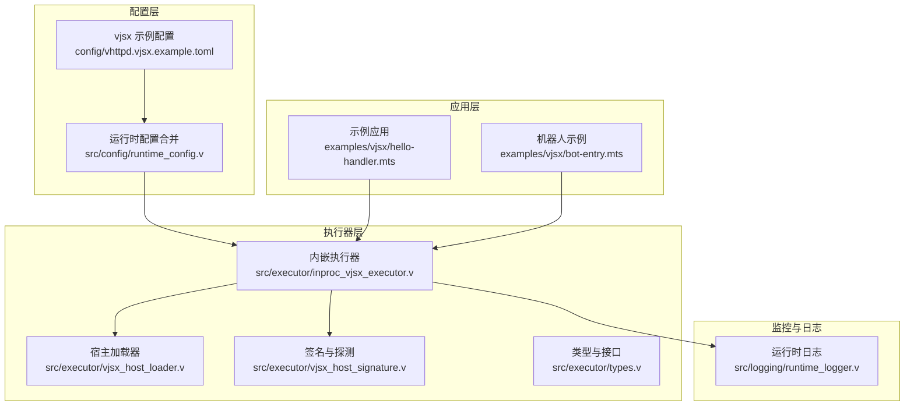
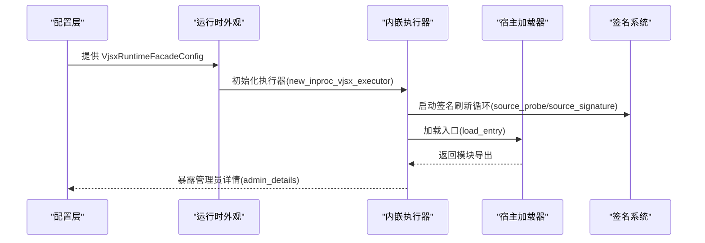
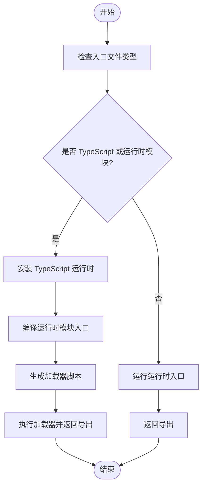
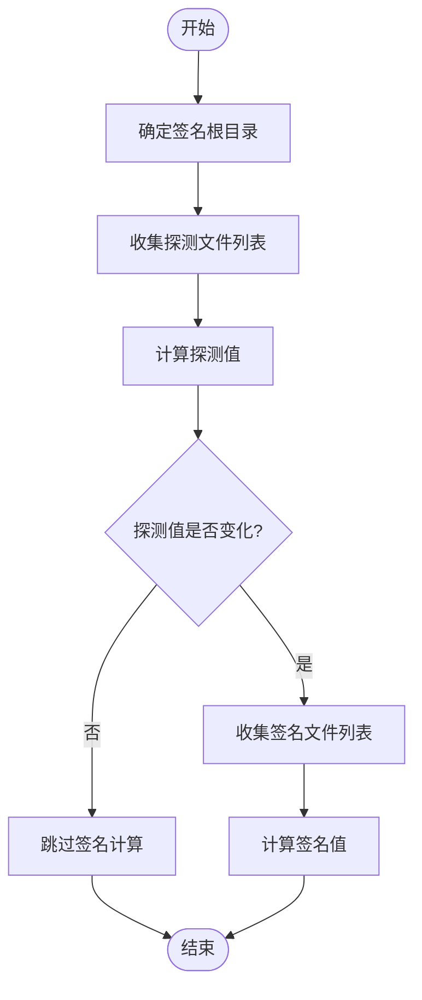
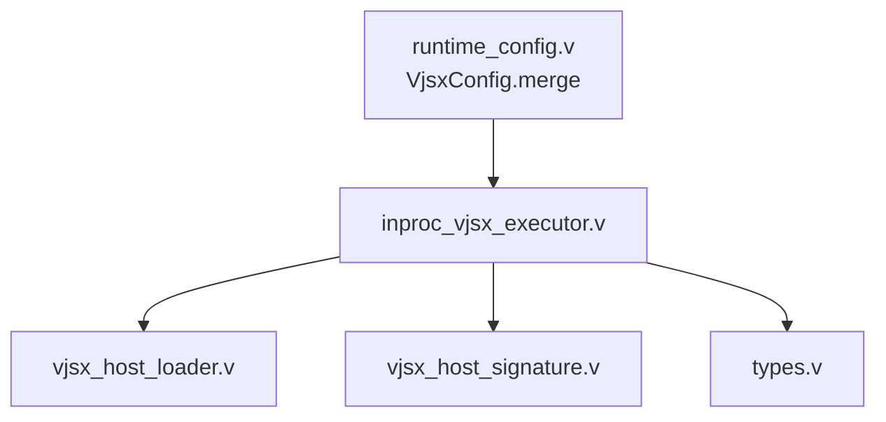

# VJSX 运行时配置

<cite>
**本文档引用的文件**
- [inproc_vjsx_executor.v](file://src/executor/inproc_vjsx_executor.v)
- [vjsx_host_loader.v](file://src/executor/vjsx_host_loader.v)
- [types.v](file://src/executor/types.v)
- [runtime_config.v](file://src/config/runtime_config.v)
- [vjsx_host_signature.v](file://src/executor/vjsx_host_signature.v)
- [runtime_logger.v](file://src/logging/runtime_logger.v)
- [vhttpd.vjsx.example.toml](file://config/vhttpd.vjsx.example.toml)
- [hello-handler.mts](file://examples/vjsx/hello-handler.mts)
- [bot-entry.mts](file://examples/vjsx/bot-entry.mts)
</cite>

## 目录
1. [简介](#简介)
2. [项目结构](#项目结构)
3. [核心组件](#核心组件)
4. [架构概览](#架构概览)
5. [详细组件分析](#详细组件分析)
6. [依赖关系分析](#依赖关系分析)
7. [性能考虑](#性能考虑)
8. [故障排除指南](#故障排除指南)
9. [结论](#结论)
10. [附录](#附录)

## 简介
本文件为 vhttpd 的 VJSX 运行时配置提供全面的技术文档。重点涵盖以下方面：
- VJSX 内嵌执行器的配置选项：JavaScript/TypeScript 运行时、模块加载、依赖管理、内存限制等
- VJSX 应用的执行配置：入口点设置、全局变量、环境配置、调试模式等
- VJSX 运行时的宿主加载配置：模块解析、缓存策略、热重载、版本管理等机制
- VJSX 集成的安全配置：沙箱隔离、权限控制、代码注入防护、资源访问限制等
- VJSX 运行时的性能监控配置：执行性能分析、内存使用监控、错误追踪、性能优化建议等

## 项目结构
与 VJSX 运行时配置直接相关的目录与文件：
- 配置示例：config/vhttpd.vjsx.example.toml
- 执行器实现：src/executor/inproc_vjsx_executor.v、src/executor/vjsx_host_loader.v、src/executor/vjsx_host_signature.v
- 类型定义：src/executor/types.v
- 运行时配置合并：src/config/runtime_config.v
- 日志与监控：src/logging/runtime_logger.v
- 示例应用：examples/vjsx/hello-handler.mts、examples/vjsx/bot-entry.mts

**图表来源**
- [vhttpd.vjsx.example.toml:1-37](file://config/vhttpd.vjsx.example.toml#L1-L37)
- [runtime_config.v:113-153](file://src/config/runtime_config.v#L113-L153)
- [inproc_vjsx_executor.v:442-513](file://src/executor/inproc_vjsx_executor.v#L442-L513)
- [vjsx_host_loader.v:93-112](file://src/executor/vjsx_host_loader.v#L93-L112)
- [vjsx_host_signature.v:255-296](file://src/executor/vjsx_host_signature.v#L255-L296)
- [types.v:76-90](file://src/executor/types.v#L76-L90)
- [runtime_logger.v:36-42](file://src/logging/runtime_logger.v#L36-L42)

**章节来源**
- [vhttpd.vjsx.example.toml:1-37](file://config/vhttpd.vjsx.example.toml#L1-L37)
- [runtime_config.v:113-153](file://src/config/runtime_config.v#L113-L153)

## 核心组件
本节概述 VJSX 运行时的关键配置对象与职责。

- VjsxRuntimeFacadeConfig（运行时外观配置）
  - 关键字段：app_entry、module_root、build_root、signature_root、signature_include、signature_exclude、runtime_profile、thread_count、max_requests、enable_fs、enable_process、enable_network、websocket_affinity、websocket_actor
  - 职责：承载 VJSX 应用的执行配置，包括入口点、模块根路径、构建根路径、签名范围、线程数、请求上限以及能力开关等

- VjsxRuntimeFacade（运行时外观）
  - 关键字段：config、bootstrapped、last_error
  - 职责：封装执行器状态与配置快照，提供运行时元数据查询与生命周期管理

- InProcVjsxExecutor（内嵌执行器）
  - 关键字段：provider_name、kind_name、state
  - 职责：管理多车道（lane）执行、签名刷新循环、热启动与会话管理、WebSocket 任务调度与亲和性决策

- VjsxHostLoader（宿主加载器）
  - 关键函数：asset_root、entry_runs_as_module、build_root_path、lane_temp_root、load_entry
  - 职责：解析入口文件类型、生成临时构建目录、安装 TypeScript 运行时、编译模块入口并注入导出

- VjsxHostSignature（宿主签名）
  - 关键函数：source_probe、source_signature、collect_source_signature、collect_source_probe
  - 职责：基于文件内容、时间戳、大小与哈希生成源码探测与签名，支持包含/排除规则与通配符匹配

- 类型系统（types.v）
  - 关键结构：LogicExecutorAdminDetails、WebSocketAffinityConfig、WebSocketActorConfig
  - 职责：定义管理员详情、WebSocket 亲和性与演员配置的数据结构

**章节来源**
- [inproc_vjsx_executor.v:78-102](file://src/executor/inproc_vjsx_executor.v#L78-L102)
- [inproc_vjsx_executor.v:180-186](file://src/executor/inproc_vjsx_executor.v#L180-L186)
- [vjsx_host_loader.v:9-112](file://src/executor/vjsx_host_loader.v#L9-L112)
- [vjsx_host_signature.v:255-296](file://src/executor/vjsx_host_signature.v#L255-L296)
- [types.v:76-90](file://src/executor/types.v#L76-L90)

## 架构概览
下图展示 VJSX 运行时从配置到执行的整体流程，包括签名探测、模块加载与执行器调度。

**图表来源**
- [inproc_vjsx_executor.v:442-513](file://src/executor/inproc_vjsx_executor.v#L442-L513)
- [vjsx_host_loader.v:93-112](file://src/executor/vjsx_host_loader.v#L93-L112)
- [vjsx_host_signature.v:255-296](file://src/executor/vjsx_host_signature.v#L255-L296)
- [types.v:76-90](file://src/executor/types.v#L76-L90)

## 详细组件分析

### VJSX 内嵌执行器配置
- 入口点与模块根
  - app_entry：应用入口文件路径（支持 .js/.mjs/.cjs/.ts/.mts/.cts）
  - module_root：模块根目录，用于解析相对导入
  - build_root：构建缓存根目录，默认使用临时目录，可通过环境变量覆盖
- 并发与容量
  - thread_count：执行车道数量，决定并发执行能力
  - max_requests：单进程最大请求数，用于生命周期重启控制
- 能力开关
  - enable_fs、enable_process、enable_network：分别控制文件系统、进程与网络能力
- WebSocket 配置
  - websocket_affinity：连接亲和性配置（启用、来源、键、作用域、回退策略）
  - websocket_actor：演员队列配置（启用、事件来源、回退、超时、每键队列上限）

- 关键常量与行为
  - 等待与超时：车道等待轮询、任务超时、WebSocket 队列等待、签名刷新轮询与去抖
  - 启动序列：占位引导、签名刷新循环、热启动与会话初始化

**章节来源**
- [inproc_vjsx_executor.v:17-26](file://src/executor/inproc_vjsx_executor.v#L17-L26)
- [inproc_vjsx_executor.v:78-95](file://src/executor/inproc_vjsx_executor.v#L78-L95)
- [inproc_vjsx_executor.v:515-544](file://src/executor/inproc_vjsx_executor.v#L515-L544)

### VJSX 宿主加载配置
- 入口文件类型判断
  - 支持 TypeScript 文件与模块扩展名（.mts/.cts），自动安装 TypeScript 运行时
- 构建与临时目录
  - 通过 lane_temp_root 生成每个车道的独立构建目录，避免并发冲突
- 模块入口生成
  - 使用 runtimejs.build_runtime_module_entry 编译入口模块，并生成加载器脚本注入导出

**图表来源**
- [vjsx_host_loader.v:17-29](file://src/executor/vjsx_host_loader.v#L17-L29)
- [vjsx_host_loader.v:93-112](file://src/executor/vjsx_host_loader.v#L93-L112)

**章节来源**
- [vjsx_host_loader.v:13-15](file://src/executor/vjsx_host_loader.v#L13-L15)
- [vjsx_host_loader.v:74-91](file://src/executor/vjsx_host_loader.v#L74-L91)
- [vjsx_host_loader.v:93-112](file://src/executor/vjsx_host_loader.v#L93-L112)

### VJSX 签名与版本管理
- 探测与签名
  - source_probe：仅基于文件元信息（路径、修改时间、大小）生成探测值，用于快速检测变更
  - source_signature：包含文件内容哈希，用于完整版本校验
- 规则与范围
  - signature_root：签名根目录优先级：显式配置 > module_root > app_entry 所在目录
  - signature_include/signature_exclude：支持通配符与双星（**）匹配，内置默认排除列表（.git、node_modules、dist 等）
- 刷新策略
  - 去抖与全量刷新：根据探测变更与时间阈值触发全量签名计算，减少频繁 I/O

**图表来源**
- [vjsx_host_signature.v:47-58](file://src/executor/vjsx_host_signature.v#L47-L58)
- [vjsx_host_signature.v:60-79](file://src/executor/vjsx_host_signature.v#L60-L79)
- [vjsx_host_signature.v:255-274](file://src/executor/vjsx_host_signature.v#L255-L274)
- [vjsx_host_signature.v:276-296](file://src/executor/vjsx_host_signature.v#L276-L296)

**章节来源**
- [vjsx_host_signature.v:6-20](file://src/executor/vjsx_host_signature.v#L6-L20)
- [vjsx_host_signature.v:255-296](file://src/executor/vjsx_host_signature.v#L255-L296)

### VJSX 应用执行配置
- 入口点设置
  - app_entry：支持 .js/.mjs/.cjs/.ts/.mts/.cts，TypeScript 将自动安装运行时
- 全局变量与环境
  - 通过环境变量 VJSX_ASSET_ROOT 控制资产根目录
  - 通过 VHTTPD_LOG_LEVEL 控制运行时日志级别
- 调试模式
  - 可通过增加日志级别或启用更详细的运行时元数据进行调试

**章节来源**
- [vjsx_host_loader.v:7-15](file://src/executor/vjsx_host_loader.v#L7-L15)
- [runtime_logger.v:27-34](file://src/logging/runtime_logger.v#L27-L34)
- [hello-handler.mts:1-16](file://examples/vjsx/hello-handler.mts#L1-L16)
- [bot-entry.mts:1-43](file://examples/vjsx/bot-entry.mts#L1-L43)

### VJSX 集成的安全配置
- 权限控制
  - enable_fs、enable_process、enable_network：按需开启能力，最小化攻击面
- 资源访问限制
  - 通过 signature_root 与签名规则限制可扫描的文件范围，避免无关目录被纳入
- 代码注入防护
  - 严格区分模块入口与普通脚本入口，TypeScript 自动安装运行时以确保类型安全
- 沙箱隔离
  - 通过 lane_count 与 max_requests 实现进程级隔离与生命周期重启，降低持久化风险

**章节来源**
- [inproc_vjsx_executor.v:78-95](file://src/executor/inproc_vjsx_executor.v#L78-L95)
- [vjsx_host_signature.v:47-58](file://src/executor/vjsx_host_signature.v#L47-L58)
- [vjsx_host_loader.v:93-112](file://src/executor/vjsx_host_loader.v#L93-L112)

### 性能监控配置
- 执行性能分析
  - 通过 runtime_profile（如 "node"）选择合适的运行时配置，结合线程数与队列容量优化吞吐
- 内存使用监控
  - 结合 max_requests 与 lane_count 控制内存占用；必要时调整线程数与队列深度
- 错误追踪
  - 使用运行时日志记录关键事件与错误，通过 VHTTPD_LOG_LEVEL 调整详细程度
- 性能优化建议
  - 合理设置 signature_root 与 include/exclude，减少签名计算开销
  - 在开发阶段启用更严格的日志级别，在生产环境使用 warn 或更高级别

**章节来源**
- [runtime_config.v:113-153](file://src/config/runtime_config.v#L113-L153)
- [runtime_logger.v:8-13](file://src/logging/runtime_logger.v#L8-L13)
- [inproc_vjsx_executor.v:17-26](file://src/executor/inproc_vjsx_executor.v#L17-L26)

## 依赖关系分析
- 配置合并
  - runtime_config.v 中的 VjsxConfig.merge 负责将站点配置与全局配置合并，优先使用站点配置
- 执行器与加载器
  - inproc_vjsx_executor.v 依赖 vjsx_host_loader.v 与 vjsx_host_signature.v 提供的加载与签名能力
- 类型契约
  - types.v 中的 LogicExecutorAdminDetails 与 WebSocket 配置结构为管理员界面与调度提供统一数据模型

**图表来源**
- [runtime_config.v:113-153](file://src/config/runtime_config.v#L113-L153)
- [inproc_vjsx_executor.v:442-513](file://src/executor/inproc_vjsx_executor.v#L442-L513)
- [vjsx_host_loader.v:93-112](file://src/executor/vjsx_host_loader.v#L93-L112)
- [vjsx_host_signature.v:255-296](file://src/executor/vjsx_host_signature.v#L255-L296)
- [types.v:76-90](file://src/executor/types.v#L76-L90)

**章节来源**
- [runtime_config.v:113-153](file://src/config/runtime_config.v#L113-L153)
- [types.v:76-90](file://src/executor/types.v#L76-L90)

## 性能考虑
- 并发与队列
  - thread_count 与各任务通道容量（WebSocket、快照、热启动、泵任务、亲和性任务）直接影响吞吐与延迟
- 签名与缓存
  - 通过 source_probe 与 source_signature 的组合，减少不必要的全量签名计算
- 资源限制
  - enable_fs/enable_process/enable_network 与 max_requests 共同构成资源使用的边界

[本节为通用指导，无需特定文件分析]

## 故障排除指南
- 常见问题定位
  - 入口文件类型不支持：检查扩展名与文件类型判断逻辑
  - 签名未更新：确认 signature_root 与 include/exclude 规则是否正确
  - 日志级别过低：通过 VHTTPD_LOG_LEVEL 提升日志级别
- 监控与诊断
  - 使用管理员详情接口查看当前配置与运行状态
  - 结合事件日志与运行时元数据定位异常

**章节来源**
- [inproc_vjsx_executor.v:592-618](file://src/executor/inproc_vjsx_executor.v#L592-L618)
- [runtime_logger.v:27-34](file://src/logging/runtime_logger.v#L27-L34)
- [types.v:76-90](file://src/executor/types.v#L76-L90)

## 结论
VJSX 运行时配置围绕“最小权限、可控并发、可观测性”三大原则设计。通过明确的入口点与模块根配置、精细的能力开关、智能的签名与缓存策略，以及完善的日志与监控机制，能够在保证安全性的同时提供良好的性能与可维护性。建议在生产环境中严格控制能力开关、合理设置线程数与队列容量，并通过签名规则限制扫描范围以提升稳定性。

[本节为总结性内容，无需特定文件分析]

## 附录

### 配置项总览（按类别）
- 基础路径与入口
  - paths.root、paths.vjsx_app、paths.vjsx_root、paths.web_root
- 服务器与文件
  - server.host、server.port、files.pid_file、files.event_log
- 运行时与执行器
  - runtime.timezone、executor.kind、vjsx.app_entry、vjsx.module_root、vjsx.build_root、vjsx.signature_root、vjsx.signature_include、vjsx.signature_exclude、vjsx.runtime_profile、vjsx.thread_count、vjsx.max_requests、vjsx.enable_fs、vjsx.enable_process、vjsx.enable_network、websocket_affinity.*、websocket_actor.*
- 管理与静态资源
  - admin.host、admin.port、admin.token、assets.enabled、assets.prefix、assets.root、assets.cache_control

**章节来源**
- [vhttpd.vjsx.example.toml:1-37](file://config/vhttpd.vjsx.example.toml#L1-L37)