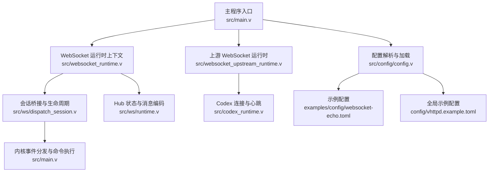
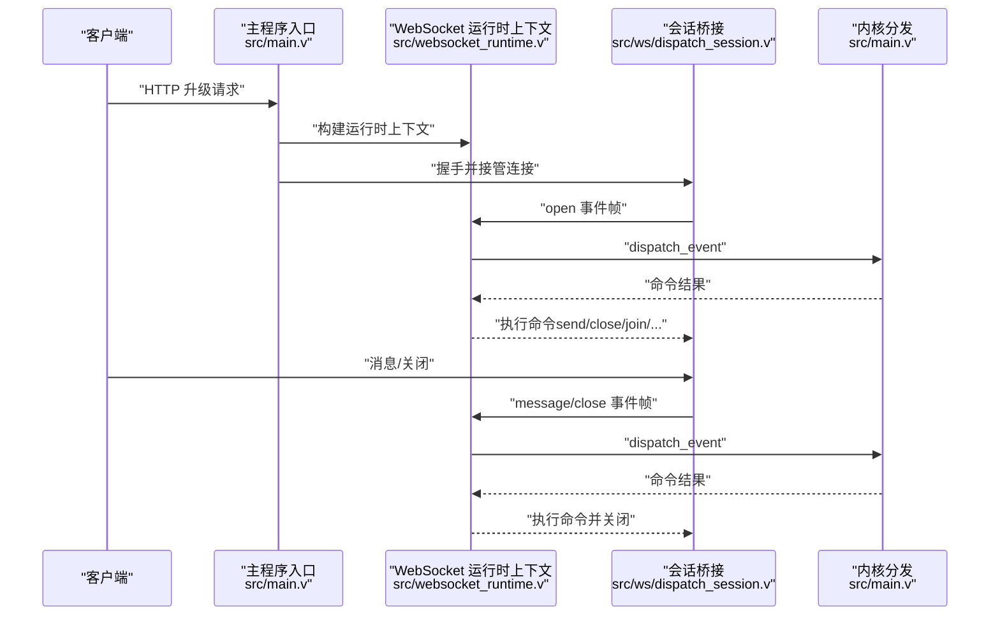
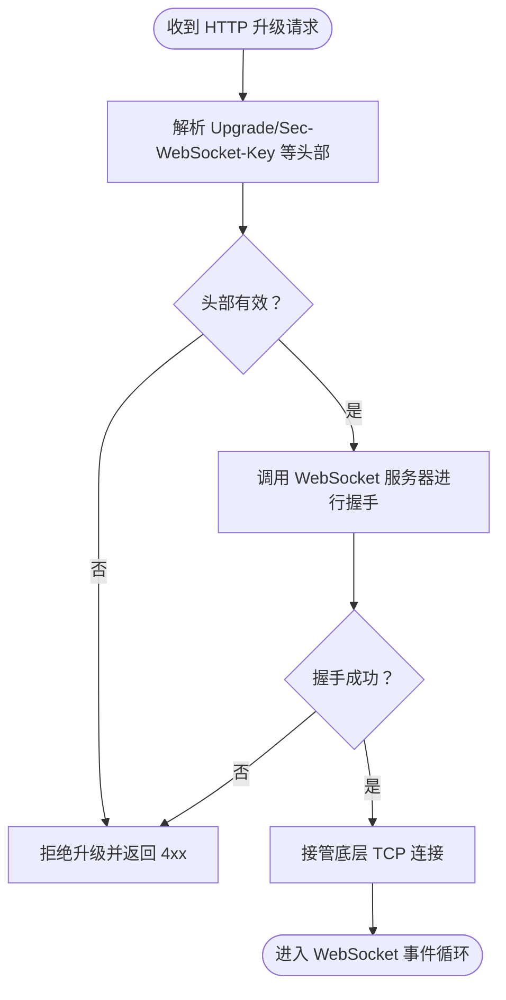
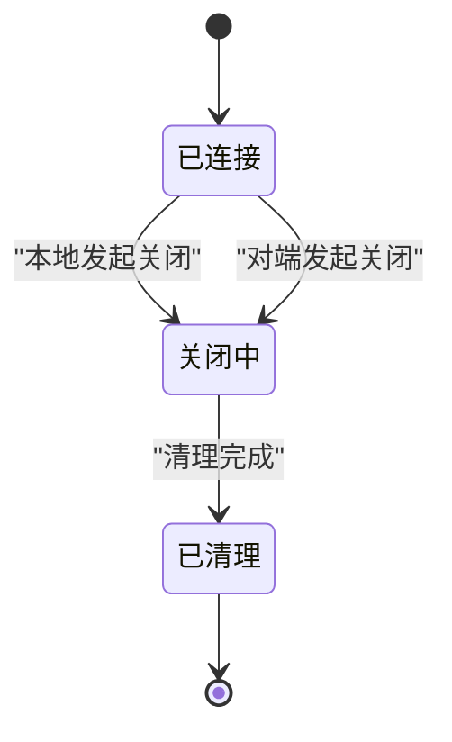
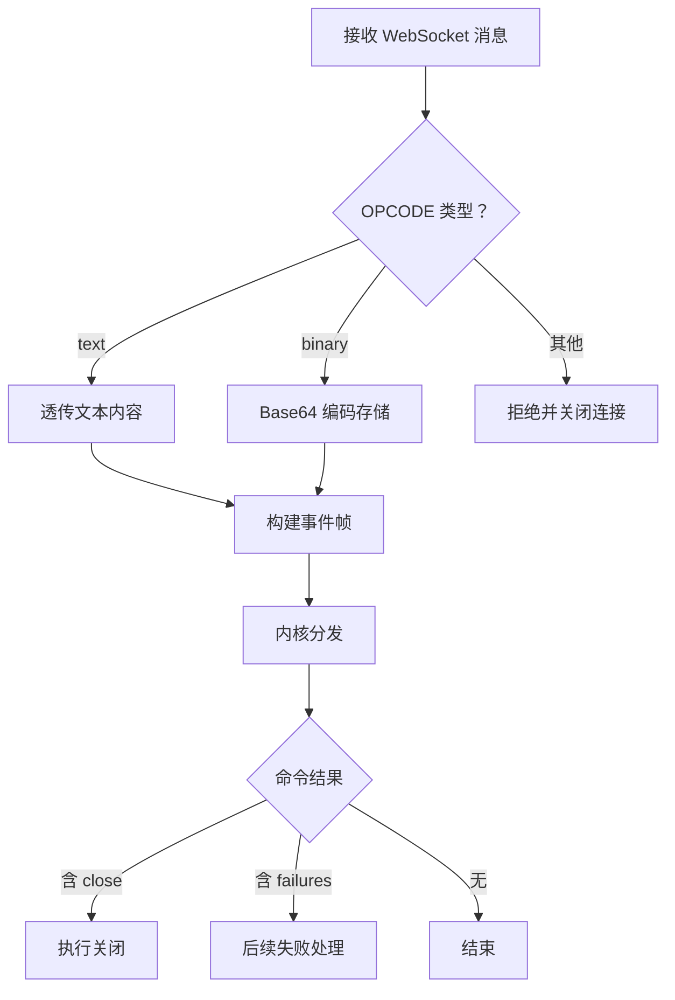
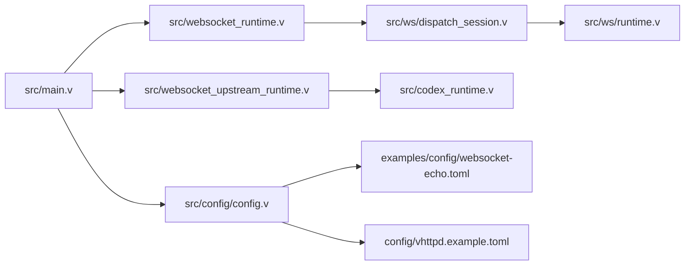

# WebSocket 运行时配置

<cite>
**本文档引用的文件**
- [src/websocket_runtime.v](file://src/websocket_runtime.v)
- [src/websocket_upstream_runtime.v](file://src/websocket_upstream_runtime.v)
- [src/ws/dispatch_session.v](file://src/ws/dispatch_session.v)
- [src/ws/runtime.v](file://src/ws/runtime.v)
- [src/ws/types.v](file://src/ws/types.v)
- [src/ws/hub_runtime.v](file://src/ws/hub_runtime.v)
- [src/config/config.v](file://src/config/config.v)
- [src/main.v](file://src/main.v)
- [config/vhttpd.example.toml](file://config/vhttpd.example.toml)
- [examples/config/websocket-echo.toml](file://examples/config/websocket-echo.toml)
- [docs/WEBSOCKET_MVP_PLAN.md](file://docs/WEBSOCKET_MVP_PLAN.md)
- [docs/WEBSOCKET_MESSAGE_DISPATCH_PLAN.md](file://docs/WEBSOCKET_MESSAGE_DISPATCH_PLAN.md)
- [docs/WEBSOCKET_PHASE2_IMPLEMENTATION_PLAN.md](file://docs/WEBSOCKET_PHASE2_IMPLEMENTATION_PLAN.md)
- [src/admin_runtime.v](file://src/admin_runtime.v)
- [src/websocket_binary_support_test.v](file://src/websocket_binary_support_test.v)
- [src/codex_runtime.v](file://src/codex_runtime.v)
- [src/executor/inproc_vjsx_executor.v](file://src/executor/inproc_vjsx_executor.v)
- [src/websocket_dispatch_lifecycle_test.v](file://src/websocket_dispatch_lifecycle_test.v)
</cite>

## 更新摘要
**变更内容**
- 更新类型系统重构部分，反映类型别名移除和模块限定名的使用
- 新增类型系统重构章节，详细说明 `ws.HubConn`、`ws.DispatchConnState`、`ws.HubPendingMessage` 等类型的直接引用
- 更新架构图和代码示例，确保与新的类型系统保持一致
- 修正上游运行时中的类型别名问题

## 目录
1. [简介](#简介)
2. [项目结构](#项目结构)
3. [核心组件](#核心组件)
4. [架构总览](#架构总览)
5. [详细组件分析](#详细组件分析)
6. [类型系统重构](#类型系统重构)
7. [依赖关系分析](#依赖关系分析)
8. [性能考虑](#性能考虑)
9. [故障排查指南](#故障排查指南)
10. [结论](#结论)
11. [附录](#附录)

## 简介
本文件面向 vhttpd 的 WebSocket 运行时配置，系统性阐述握手参数、协议版本、子协议选择、连接管理、消息处理、安全配置与性能优化等关键主题。文档基于仓库中的源码与设计文档，结合示例配置文件，帮助读者在生产环境中正确部署与调优 WebSocket 能力。

**更新** 本版本特别关注类型系统重构，其中大部分类型别名已被移除，所有类型现在直接使用模块限定名进行引用。目前仅在上游运行时中存在一个类型别名，这是唯一需要关注的例外情况。

## 项目结构
围绕 WebSocket 的运行时配置与实现，主要涉及以下模块：
- 运行时上下文与会话桥接：构建 WebSocket 事件到内核分发的桥接层
- 会话生命周期与消息分发：负责握手、消息处理、关闭流程与命令执行
- 上游 WebSocket 连接：对上游服务（如飞书、Codex）的 WebSocket 连接管理与重连策略
- 配置解析：从 TOML 加载 WebSocket 相关配置项
- 示例与文档：提供最小可用示例与阶段化演进规划



**图表来源**
- [src/main.v:428-461](file://src/main.v#L428-L461)
- [src/websocket_runtime.v:25-100](file://src/websocket_runtime.v#L25-L100)
- [src/ws/dispatch_session.v:11-35](file://src/ws/dispatch_session.v#L11-L35)
- [src/ws/runtime.v:8-20](file://src/ws/runtime.v#L8-L20)
- [src/websocket_upstream_runtime.v:36-75](file://src/websocket_upstream_runtime.v#L36-L75)
- [src/codex_runtime.v:318-352](file://src/codex_runtime.v#L318-L352)
- [src/config/config.v:528-542](file://src/config/config.v#L528-L542)
- [examples/config/websocket-echo.toml:1-28](file://examples/config/websocket-echo.toml#L1-L28)
- [config/vhttpd.example.toml:1-67](file://config/vhttpd.example.toml#L1-L67)

**章节来源**
- [src/main.v:428-461](file://src/main.v#L428-L461)
- [src/websocket_runtime.v:25-100](file://src/websocket_runtime.v#L25-L100)
- [src/ws/dispatch_session.v:11-35](file://src/ws/dispatch_session.v#L11-L35)
- [src/ws/runtime.v:8-20](file://src/ws/runtime.v#L8-L20)
- [src/websocket_upstream_runtime.v:36-75](file://src/websocket_upstream_runtime.v#L36-L75)
- [src/codex_runtime.v:318-352](file://src/codex_runtime.v#L318-L352)
- [src/config/config.v:528-542](file://src/config/config.v#L528-L542)
- [examples/config/websocket-echo.toml:1-28](file://examples/config/websocket-echo.toml#L1-L28)
- [config/vhttpd.example.toml:1-67](file://config/vhttpd.example.toml#L1-L67)

## 核心组件
- WebSocket 运行时上下文：封装注册连接、房间管理、元数据、广播、帧构建、事件分发、命令结果执行等回调，作为内核与会话桥接的纽带
- 会话桥接与生命周期：负责握手、消息分发、关闭流程、错误处理与清理
- Hub 状态与消息编码：维护连接、房间、元数据与待发送消息；提供二进制负载的编码/解码辅助
- 上游 WebSocket 运行时：封装上游提供商（如飞书、Codex、Fixture）的连接状态、URL 拉取、消息处理、重连策略与活动记录
- 配置解析：支持 WebSocket Actor 相关配置（启用、回退策略、队列超时、每键最大队列、事件列表、来源类型）

**章节来源**
- [src/websocket_runtime.v:25-100](file://src/websocket_runtime.v#L25-L100)
- [src/ws/dispatch_session.v:11-35](file://src/ws/dispatch_session.v#L11-L35)
- [src/ws/runtime.v:8-20](file://src/ws/runtime.v#L8-L20)
- [src/websocket_upstream_runtime.v:36-75](file://src/websocket_upstream_runtime.v#L36-L75)
- [src/config/config.v:697-725](file://src/config/config.v#L697-L725)

## 架构总览
WebSocket 在 vhttpd 中采用"升级后由 vhttpd 接管"的模式，复用 V 标准库的 WebSocket 服务器能力，通过内核桥接将事件转发给 PHP 工作者或 VJSX 执行器，并支持命令式响应（send/close/join/broadcast/set_meta 等）。



**图表来源**
- [src/main.v:428-461](file://src/main.v#L428-L461)
- [src/websocket_runtime.v:86-95](file://src/websocket_runtime.v#L86-L95)
- [src/ws/dispatch_session.v:11-35](file://src/ws/dispatch_session.v#L11-L35)
- [src/ws/dispatch_session.v:126-168](file://src/ws/dispatch_session.v#L126-L168)

**章节来源**
- [src/main.v:428-461](file://src/main.v#L428-L461)
- [src/websocket_runtime.v:86-95](file://src/websocket_runtime.v#L86-L95)
- [src/ws/dispatch_session.v:11-35](file://src/ws/dispatch_session.v#L11-L35)
- [src/ws/dispatch_session.v:126-168](file://src/ws/dispatch_session.v#L126-L168)

## 详细组件分析

### 握手参数与协议版本
- 协议版本：vhttpd 复用 V 标准库的 WebSocket 服务器，支持标准握手流程
- 握手参数：从 HTTP 请求中提取 Upgrade、Sec-WebSocket-Key 等头部，完成升级
- 子协议选择：当前实现未显式解析子协议字段，保持与标准库一致的行为



**图表来源**
- [docs/WEBSOCKET_MVP_PLAN.md:40-48](file://docs/WEBSOCKET_MVP_PLAN.md#L40-L48)
- [src/main.v:428-436](file://src/main.v#L428-L436)

**章节来源**
- [docs/WEBSOCKET_MVP_PLAN.md:40-48](file://docs/WEBSOCKET_MVP_PLAN.md#L40-L48)
- [src/main.v:428-436](file://src/main.v#L428-L436)

### 连接管理配置
- 最大连接数：当前未在配置中暴露显式的最大连接数阈值，实际受工作池与系统资源限制
- 空闲超时：未见专用的空闲超时配置项；可通过读写超时与内核命令控制生命周期
- 心跳检测：上游提供商（如 Codex）在连接建立后启动心跳循环；本地会话未内置心跳逻辑
- 断线重连：上游提供商支持重连延迟配置；本地会话关闭后由客户端自行决定重连策略



**图表来源**
- [src/ws/dispatch_session.v:50-53](file://src/ws/dispatch_session.v#L50-L53)
- [src/ws/dispatch_session.v:184-200](file://src/ws/dispatch_session.v#L184-L200)
- [src/websocket_upstream_runtime.v:310-315](file://src/websocket_upstream_runtime.v#L310-L315)
- [src/codex_runtime.v:318-321](file://src/codex_runtime.v#L318-L321)

**章节来源**
- [src/ws/dispatch_session.v:50-53](file://src/ws/dispatch_session.v#L50-L53)
- [src/ws/dispatch_session.v:184-200](file://src/ws/dispatch_session.v#L184-L200)
- [src/websocket_upstream_runtime.v:310-315](file://src/websocket_upstream_runtime.v#L310-L315)
- [src/codex_runtime.v:318-321](file://src/codex_runtime.v#L318-L321)

### 消息处理配置
- 消息类型支持：文本帧与二进制帧；二进制帧在 Hub 层以 Base64 编码存储，再在发送前解码
- 消息大小限制：未在配置中提供显式上限；可通过上游提供商的刷新间隔与队列容量间接约束
- 批量处理：通过命令结果聚合多条命令一次性执行，减少往返
- 压缩选项：未发现内置压缩配置；二进制帧按 Base64 存储，可能带来额外开销
- 二进制数据处理：二进制帧在 Hub 层转换为 Base64 字符串，发送时再解码为原始字节



**图表来源**
- [src/ws/dispatch_session.v:170-182](file://src/ws/dispatch_session.v#L170-L182)
- [src/ws/runtime.v:8-20](file://src/ws/runtime.v#L8-L20)
- [src/websocket_binary_support_test.v:18-28](file://src/websocket_binary_support_test.v#L18-L28)

**章节来源**
- [src/ws/dispatch_session.v:170-182](file://src/ws/dispatch_session.v#L170-L182)
- [src/ws/runtime.v:8-20](file://src/ws/runtime.v#L8-L20)
- [src/websocket_binary_support_test.v:18-28](file://src/websocket_binary_support_test.v#L18-L28)

### 安全配置
- CORS 设置：未在 WebSocket 运行时中提供专门的 CORS 配置项；通常由上层 HTTP 层或应用侧处理
- 认证机制：未在 WebSocket 运行时中提供内置认证；可通过 HTTP 层认证后升级，或在应用侧实现
- 访问控制列表：未提供针对 WebSocket 的 ACL 配置；可通过应用侧逻辑与内核命令实现细粒度控制

**章节来源**
- [docs/WEBSOCKET_MVP_PLAN.md:265-276](file://docs/WEBSOCKET_MVP_PLAN.md#L265-L276)

### 性能优化配置
- 缓冲区大小：未提供显式的缓冲区大小配置；二进制帧以 Base64 存储，可能影响内存占用
- 并发处理：通过内核命令聚合与批处理减少往返；上游提供商的心跳与重连策略可降低抖动
- 内存管理：Hub 清理连接时删除房间成员、元数据与待发送队列，避免泄漏

**章节来源**
- [src/ws/runtime.v:24-47](file://src/ws/runtime.v#L24-L47)
- [src/websocket_upstream_runtime.v:310-315](file://src/websocket_upstream_runtime.v#L310-L315)

## 类型系统重构

**更新** 本节详细介绍 vhttpd WebSocket 运行时的类型系统重构，重点说明类型别名的移除和模块限定名的直接使用。

### 类型别名移除进展
在最新的类型系统重构中，大部分类型别名已被完全移除。所有类型现在都直接使用模块限定名进行引用，这提供了更清晰的类型来源和更好的代码可读性。

**重要发现**：目前仅在上游运行时中存在一个类型别名，这是一个需要关注的例外情况：

```v
// ── Type alias: main → ws ──
type WebSocketUpstreamSendRequest = ws.UpstreamSendRequest
```

### 模块限定名的使用
重构后的类型系统要求所有类型都使用 `ws.` 前缀进行直接引用，包括：

- **DispatchConnState**：连接状态机类型，现在直接引用为 `ws.DispatchConnState`
- **HubConn**：Hub 连接类型，现在直接引用为 `ws.HubConn`
- **HubPendingMessage**：待发送消息类型，现在直接引用为 `ws.HubPendingMessage`
- **HubState**：Hub 状态类型，现在直接引用为 `ws.HubState`
- **DispatchBridgeState**：调度桥接状态类型，现在直接引用为 `ws.DispatchBridgeState`
- **RuntimeContext**：运行时上下文类型，现在直接引用为 `ws.RuntimeContext`

### 类型引用示例
重构后的代码中，类型引用变得更加明确和直接：

```v
// 重构前（类型别名）
type HubConn = ws.HubConn
type DispatchConnState = ws.DispatchConnState

// 重构后（直接引用）
mut lifecycle := &ws.DispatchConnState{}
app.ws_hub.conns['conn_dispatch'] = ws.HubConn{
    id:        'conn_dispatch'
    lifecycle: lifecycle
}
```

### 当前重构状态
- **已完成**：大部分类型系统重构已完成，所有主要类型都使用直接引用
- **待完成**：上游运行时中的 `WebSocketUpstreamSendRequest` 类型别名仍需移除
- **影响范围**：主要影响 `src/websocket_upstream_runtime.v` 文件

### 类型系统改进
- **类型来源清晰**：每个类型都有明确的模块来源，便于调试和维护
- **避免歧义**：消除了类型别名可能带来的命名冲突
- **代码可读性提升**：直接引用模块限定名使代码意图更加明确
- **维护成本降低**：减少了类型别名的维护工作

### 影响范围
这种类型系统重构影响了以下文件和功能：

- **WebSocket 运行时上下文**：`src/websocket_runtime.v`
- **会话生命周期管理**：`src/ws/dispatch_session.v`
- **Hub 状态管理**：`src/ws/runtime.v`
- **类型定义**：`src/ws/types.v`
- **测试用例**：`src/websocket_dispatch_lifecycle_test.v`
- **上游运行时**：`src/websocket_upstream_runtime.v`（包含一个类型别名）

**章节来源**
- [src/ws/types.v:17-127](file://src/ws/types.v#L17-L127)
- [src/websocket_runtime.v:30-82](file://src/websocket_runtime.v#L30-L82)
- [src/ws/dispatch_session.v:13-47](file://src/ws/dispatch_session.v#L13-L47)
- [src/ws/runtime.v:49-67](file://src/ws/runtime.v#L49-L67)
- [src/websocket_dispatch_lifecycle_test.v:26-44](file://src/websocket_dispatch_lifecycle_test.v#L26-L44)
- [src/websocket_upstream_runtime.v:17-21](file://src/websocket_upstream_runtime.v#L17-L21)

## 依赖关系分析
- 主程序入口依赖 WebSocket 运行时上下文与会话桥接
- WebSocket 运行时上下文依赖 Hub 状态与内核分发
- 上游 WebSocket 运行时依赖提供商实现（如 Codex）与心跳循环
- 配置解析为各模块提供统一的配置模型



**图表来源**
- [src/main.v:428-461](file://src/main.v#L428-L461)
- [src/websocket_runtime.v:25-100](file://src/websocket_runtime.v#L25-L100)
- [src/ws/dispatch_session.v:11-35](file://src/ws/dispatch_session.v#L11-L35)
- [src/ws/runtime.v:8-20](file://src/ws/runtime.v#L8-L20)
- [src/websocket_upstream_runtime.v:36-75](file://src/websocket_upstream_runtime.v#L36-L75)
- [src/codex_runtime.v:318-352](file://src/codex_runtime.v#L318-L352)
- [src/config/config.v:528-542](file://src/config/config.v#L528-L542)
- [examples/config/websocket-echo.toml:1-28](file://examples/config/websocket-echo.toml#L1-L28)
- [config/vhttpd.example.toml:1-67](file://config/vhttpd.example.toml#L1-L67)

**章节来源**
- [src/main.v:428-461](file://src/main.v#L428-L461)
- [src/websocket_runtime.v:25-100](file://src/websocket_runtime.v#L25-L100)
- [src/ws/dispatch_session.v:11-35](file://src/ws/dispatch_session.v#L11-L35)
- [src/ws/runtime.v:8-20](file://src/ws/runtime.v#L8-L20)
- [src/websocket_upstream_runtime.v:36-75](file://src/websocket_upstream_runtime.v#L36-L75)
- [src/codex_runtime.v:318-352](file://src/codex_runtime.v#L318-L352)
- [src/config/config.v:528-542](file://src/config/config.v#L528-L542)
- [examples/config/websocket-echo.toml:1-28](file://examples/config/websocket-echo.toml#L1-L28)
- [config/vhttpd.example.toml:1-67](file://config/vhttpd.example.toml#L1-L67)

## 性能考虑
- 文本帧优先：当前 Phase 2 的 MVP 仅支持文本帧，减少二进制处理开销
- 命令批处理：通过命令结果聚合，减少与内核的交互次数
- 心跳与重连：上游提供商的心跳与重连策略有助于维持长连接稳定性
- 队列与超时：WebSocket Actor 支持队列超时与每键最大队列，避免过载

**章节来源**
- [docs/WEBSOCKET_PHASE2_IMPLEMENTATION_PLAN.md:410-431](file://docs/WEBSOCKET_PHASE2_IMPLEMENTATION_PLAN.md#L410-L431)
- [src/config/config.v:697-725](file://src/config/config.v#L697-L725)

## 故障排查指南
- 握手失败：检查 Upgrade/Sec-WebSocket-Key 头部是否完整；确认主程序已接管连接
- 消息被拒绝：仅支持文本与二进制帧；控制帧会被拒绝并关闭连接
- 关闭流程：本地或对端发起关闭时，会触发内核分发与命令执行；若出现异常，查看日志与命令结果
- 上游连接问题：查看重连延迟与连接状态快照；Codex 提供心跳循环与连接统计
- 类型系统问题：如果遇到类型引用错误，检查是否使用了正确的模块限定名格式（如 `ws.HubConn` 而非简化的类型别名）。注意上游运行时中的 `WebSocketUpstreamSendRequest` 类型别名仍需移除。

**章节来源**
- [src/ws/dispatch_session.v:126-168](file://src/ws/dispatch_session.v#L126-L168)
- [src/websocket_upstream_runtime.v:284-308](file://src/websocket_upstream_runtime.v#L284-L308)
- [src/codex_runtime.v:335-352](file://src/codex_runtime.v#L335-L352)

## 结论
vhttpd 的 WebSocket 运行时以"升级接管 + 内核桥接 + 命令式响应"为核心设计，既复用标准库能力，又通过 Hub 与内核协作实现灵活的消息处理与连接管理。当前配置层面未提供大量显式开关，更多能力通过阶段化演进与上游提供商扩展实现。

**更新** 最新的类型系统重构进一步提升了代码的清晰度和可维护性，通过直接使用模块限定名引用类型，消除了类型别名可能带来的复杂性和歧义。目前大部分重构已完成，仅剩上游运行时中的一个类型别名需要移除。建议在生产环境关注消息类型约束、命令批处理与上游心跳/重连策略，以及新类型系统的正确使用，以获得稳定与高性能的 WebSocket 体验。

## 附录
- 配置示例路径
  - [examples/config/websocket-echo.toml](file://examples/config/websocket-echo.toml)
  - [config/vhttpd.example.toml](file://config/vhttpd.example.toml)
- 设计文档参考
  - [docs/WEBSOCKET_MVP_PLAN.md](file://docs/WEBSOCKET_MVP_PLAN.md)
  - [docs/WEBSOCKET_MESSAGE_DISPATCH_PLAN.md](file://docs/WEBSOCKET_MESSAGE_DISPATCH_PLAN.md)
  - [docs/WEBSOCKET_PHASE2_IMPLEMENTATION_PLAN.md](file://docs/WEBSOCKET_PHASE2_IMPLEMENTATION_PLAN.md)
- 类型系统重构参考
  - [src/ws/types.v](file://src/ws/types.v)
  - [src/websocket_runtime.v](file://src/websocket_runtime.v)
  - [src/websocket_dispatch_lifecycle_test.v](file://src/websocket_dispatch_lifecycle_test.v)
  - [src/websocket_upstream_runtime.v](file://src/websocket_upstream_runtime.v)