# 数据库运行时配置

<cite>
**本文档引用的文件**
- [db_runtime.v](file://src/db_runtime.v)
- [db_driver.v](file://dbsrc/db_driver.v)
- [config.v](file://src/config/config.v)
- [db_upstream.toml](file://examples/config/db-upstream.toml)
- [db_upstream_pg.toml](file://examples/config/db-upstream-pg.toml)
- [vhttpd.example.toml](file://config/vhttpd.example.toml)
- [runtime.v](file://src/dbx/runtime.v)
</cite>

## 更新摘要
**变更内容**
- 更新类型系统重构：DbProviderRuntime 类型别名已移除，改用 dbx.Runtime 模块限定名
- 更新模块结构：数据库运行时现在位于 src/dbx/runtime.v
- 更新架构图和代码示例以反映新的类型系统
- 更新配置和集成示例

## 目录
1. [简介](#简介)
2. [项目结构](#项目结构)
3. [核心组件](#核心组件)
4. [架构概览](#架构概览)
5. [详细组件分析](#详细组件分析)
6. [依赖关系分析](#依赖关系分析)
7. [性能考虑](#性能考虑)
8. [故障排除指南](#故障排除指南)
9. [结论](#结论)

## 简介

vhttpd 的数据库运行时配置系统提供了完整的数据库连接管理和查询执行能力。该系统支持 MySQL 和 PostgreSQL 两种主流数据库引擎，通过连接池管理、事务处理、参数化查询等功能，为应用程序提供高性能的数据库访问服务。

**更新** 数据库运行时现在使用 `dbx.Runtime` 模块限定名，替代了之前的 `DbProviderRuntime` 类型别名，提供更好的模块化和类型安全性。

## 项目结构

数据库运行时配置相关的文件组织如下：

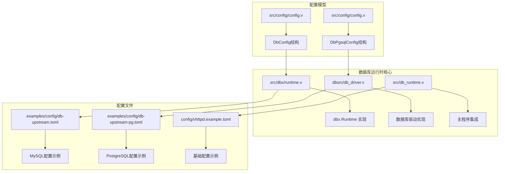

**图表来源**
- [runtime.v:47-71](file://src/dbx/runtime.v#L47-L71)
- [db_driver.v:1-421](file://dbsrc/db_driver.v#L1-L421)
- [config.v:234-282](file://src/config/config.v#L234-L282)

**章节来源**
- [runtime.v:47-71](file://src/dbx/runtime.v#L47-L71)
- [db_driver.v:1-421](file://dbsrc/db_driver.v#L1-L421)
- [config.v:234-282](file://src/config/config.v#L234-L282)

## 核心组件

### 数据库配置结构

系统采用分层配置结构，支持多种数据库引擎的统一管理：

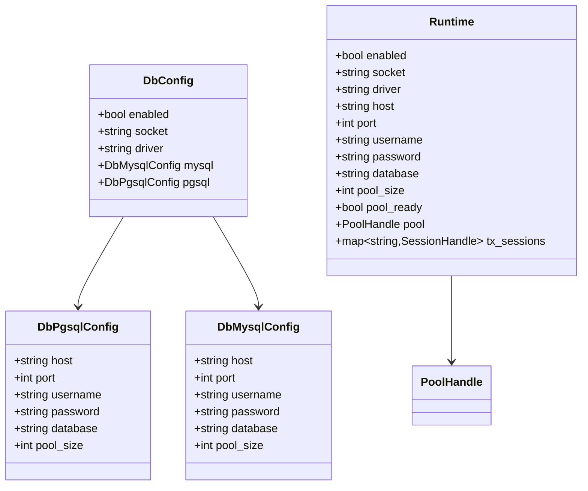

**更新** 类型别名已移除，现在使用 `dbx.Runtime` 替代 `DbProviderRuntime`，提供更好的模块化支持。

**图表来源**
- [config.v:234-282](file://src/config/config.v#L234-L282)
- [runtime.v:47-71](file://src/dbx/runtime.v#L47-L71)

### 连接池管理

系统实现了高效的连接池管理机制，支持动态连接获取和释放：

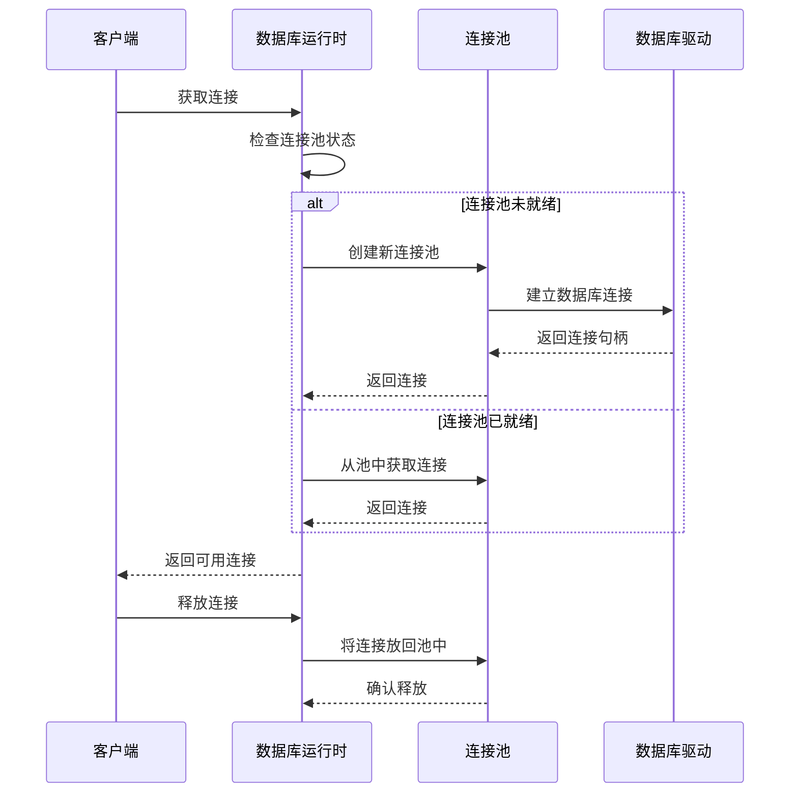

**图表来源**
- [runtime.v:814-836](file://src/dbx/runtime.v#L814-L836)
- [db_driver.v:89-144](file://dbsrc/db_driver.v#L89-L144)

**章节来源**
- [config.v:234-282](file://src/config/config.v#L234-L282)
- [runtime.v:47-71](file://src/dbx/runtime.v#L47-L71)
- [db_driver.v:28-40](file://dbsrc/db_driver.v#L28-L40)

## 架构概览

### 数据库运行时架构

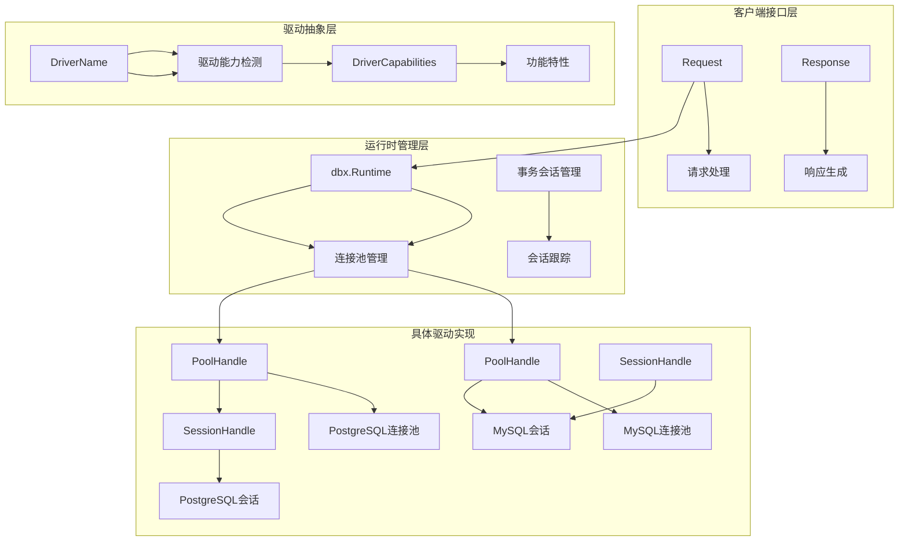

**更新** 架构现在使用 `dbx.Runtime` 作为核心运行时类型，提供更好的模块化和类型安全性。

**图表来源**
- [runtime.v:188-207](file://src/dbx/runtime.v#L188-L207)
- [db_driver.v:42-87](file://dbsrc/db_driver.v#L42-L87)
- [db_driver.v:28-40](file://dbsrc/db_driver.v#L28-L40)

### 查询执行流程

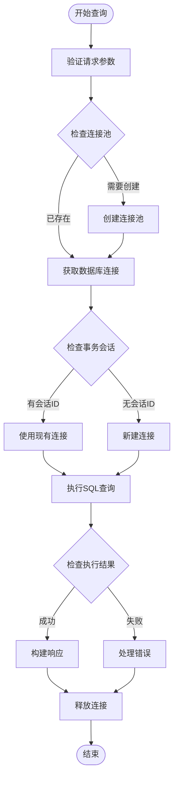

**图表来源**
- [runtime.v:268-379](file://src/dbx/runtime.v#L268-L379)
- [db_driver.v:329-378](file://dbsrc/db_driver.v#L329-L378)

**章节来源**
- [runtime.v:188-207](file://src/dbx/runtime.v#L188-L207)
- [runtime.v:268-379](file://src/dbx/runtime.v#L268-L379)
- [db_driver.v:329-378](file://dbsrc/db_driver.v#L329-L378)

## 详细组件分析

### 数据库连接配置

#### 基础连接参数

系统支持以下核心连接配置参数：

| 参数名称 | 类型 | 默认值 | 描述 | 示例值 |
|---------|------|--------|------|--------|
| enabled | bool | false | 是否启用数据库运行时 | true |
| socket | string | tmp/vhttpd-db.sock | Unix域套接字路径 | /tmp/vhttpd-db.sock |
| driver | string | mysql | 数据库驱动类型 | mysql/pgsql |
| host | string | 127.0.0.1 | 数据库主机地址 | 127.0.0.1 |
| port | int | 3306/5432 | 数据库端口号 | 3306/5432 |
| username | string | 无 | 数据库用户名 | root/postgres |
| password | string | 无 | 数据库密码 | 密码 |
| database | string | mysql/postgres | 数据库名称 | 应用数据库名 |
| pool_size | int | 5 | 连接池大小 | 5 |

#### 配置示例对比

**MySQL配置示例：**
```toml
[db]
enabled = true
socket = "/tmp/vhttpd_db.sock"
driver = "mysql"

[db.mysql]
host = "127.0.0.1"
port = 3306
username = "root"
password = "Abcd.1234"
database = "kaikuhang"
pool_size = 5
```

**PostgreSQL配置示例：**
```toml
[db]
enabled = true
socket = "/tmp/vhttpd_db_pg.sock"
driver = "pgsql"

[db.pgsql]
host = "127.0.0.1"
port = 5432
username = "postgres"
password = "change-me"
database = "postgres"
pool_size = 5
```

**章节来源**
- [db_upstream.toml:15-26](file://examples/config/db-upstream.toml#L15-L26)
- [db_upstream_pg.toml:15-26](file://examples/config/db-upstream-pg.toml#L15-L26)
- [config.v:244-251](file://src/config/config.v#L244-L251)

### 连接池配置

#### 连接池参数详解

| 参数名称 | 类型 | 默认值 | 描述 | 性能影响 |
|---------|------|--------|------|----------|
| pool_size | int | 5 | 连接池中的最大连接数 | 高连接数提高并发但增加内存占用 |
| max_open_conns | int | 5 | PostgreSQL连接池最大连接数 | 与pool_size对应 |
| min_connections | int | 2 | 最小空闲连接数 | 影响启动时间和资源占用 |
| idle_timeout_seconds | int | 300 | 连接空闲超时时间 | 控制资源回收时机 |
| max_lifetime_seconds | int | 3600 | 连接最大生命周期 | 防止连接泄漏 |

#### 连接池管理策略

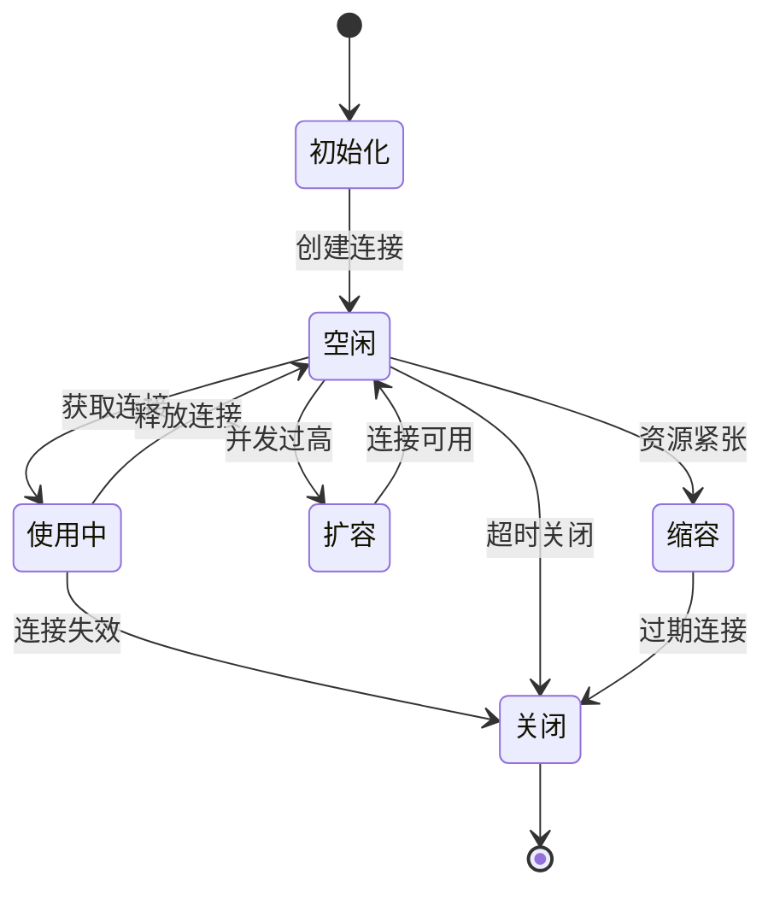

**图表来源**
- [db_driver.v:89-144](file://dbsrc/db_driver.v#L89-L144)
- [runtime.v:814-836](file://src/dbx/runtime.v#L814-L836)

**章节来源**
- [db_driver.v:89-144](file://dbsrc/db_driver.v#L89-L144)
- [runtime.v:814-836](file://src/dbx/runtime.v#L814-L836)

### 事务管理配置

#### 事务特性支持

系统支持完整的事务管理功能，包括：

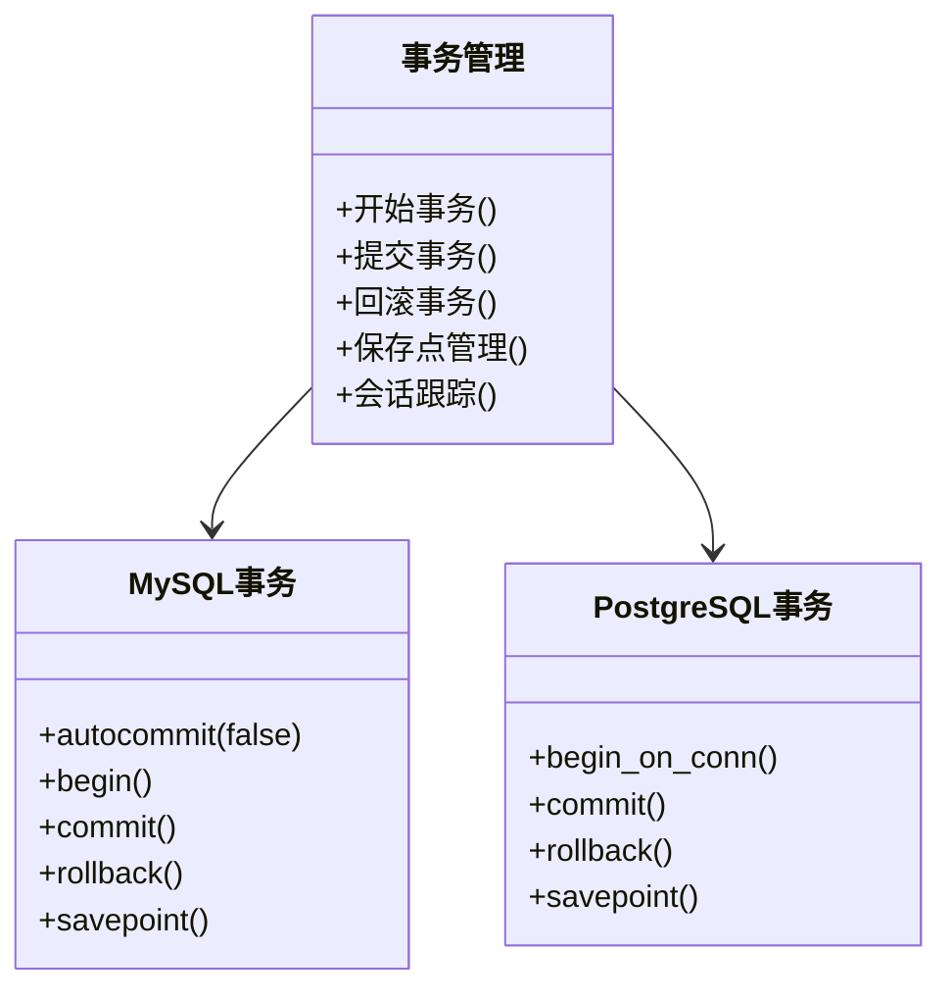

**图表来源**
- [db_driver.v:211-252](file://dbsrc/db_driver.v#L211-L252)

#### 事务会话管理

系统为每个事务会话维护独立的连接管理：

| 特性 | MySQL支持 | PostgreSQL支持 | 功能描述 |
|------|-----------|----------------|----------|
| 事务开始 | ✓ | ✓ | 支持BEGIN语句 |
| 事务提交 | ✓ | ✓ | 支持COMMIT语句 |
| 事务回滚 | ✓ | ✓ | 支持ROLLBACK语句 |
| 保存点 | ✓ | ✓ | 支持SAVEPOINT功能 |
| 会话跟踪 | ✓ | ✓ | 跟踪活跃事务数量 |
| 连接复用 | ✓ | ✓ | 事务结束后重置连接 |

**章节来源**
- [db_driver.v:211-252](file://dbsrc/db_driver.v#L211-L252)
- [runtime.v:759-763](file://src/dbx/runtime.v#L759-L763)

### 查询执行配置

#### 查询优化特性

系统提供多种查询优化配置选项：

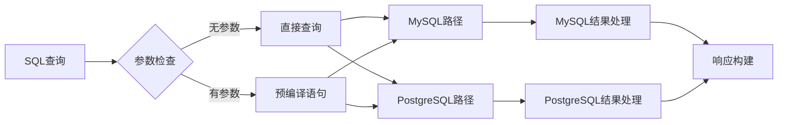

**图表来源**
- [db_driver.v:329-378](file://dbsrc/db_driver.v#L329-L378)

#### 参数化查询支持

系统支持参数化查询以防止SQL注入攻击：

| 功能 | MySQL支持 | PostgreSQL支持 | 描述 |
|------|-----------|----------------|------|
| 参数绑定 | ✓ | ✓ | 支持参数占位符 |
| 预编译语句 | ✓ | ✓ | 提高查询性能 |
| 类型转换 | ✓ | ✓ | 自动类型处理 |
| 批量执行 | ✓ | ✓ | 支持多参数执行 |

**章节来源**
- [db_driver.v:329-378](file://dbsrc/db_driver.v#L329-L378)
- [db_driver.v:380-420](file://dbsrc/db_driver.v#L380-L420)

### 驱动配置

#### 驱动能力矩阵

| 驱动类型 | 连接池 | 事务 | 参数化 | 预编译 | 保存点 |
|----------|--------|------|--------|--------|--------|
| MySQL | ✓ | ✓ | ✓ | ✓ | ✓ |
| PostgreSQL | ✓ | ✓ | ✓ | ✓ | ✓ |

#### 驱动规范化处理

系统对驱动名称进行标准化处理：

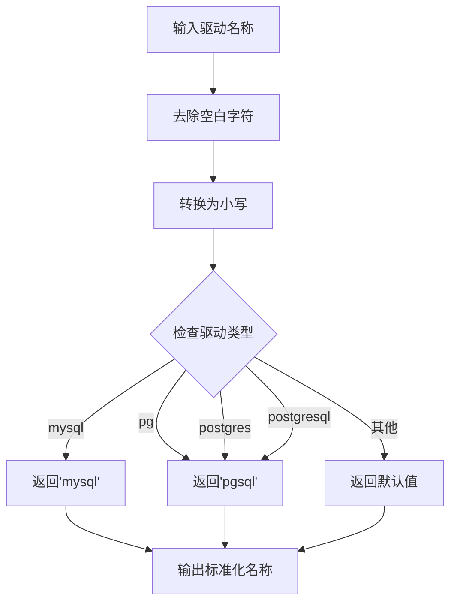

**图表来源**
- [db_driver.v:44-61](file://dbsrc/db_driver.v#L44-L61)

**章节来源**
- [db_driver.v:44-87](file://dbsrc/db_driver.v#L44-L87)

## 依赖关系分析

### 组件依赖图

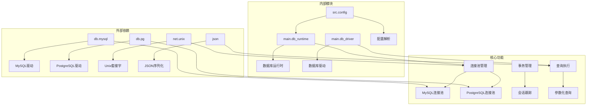

**图表来源**
- [runtime.v:1-11](file://src/dbx/runtime.v#L1-L11)
- [db_driver.v:3-4](file://dbsrc/db_driver.v#L3-L4)
- [config.v:1-5](file://src/config/config.v#L1-L5)

### 配置依赖关系

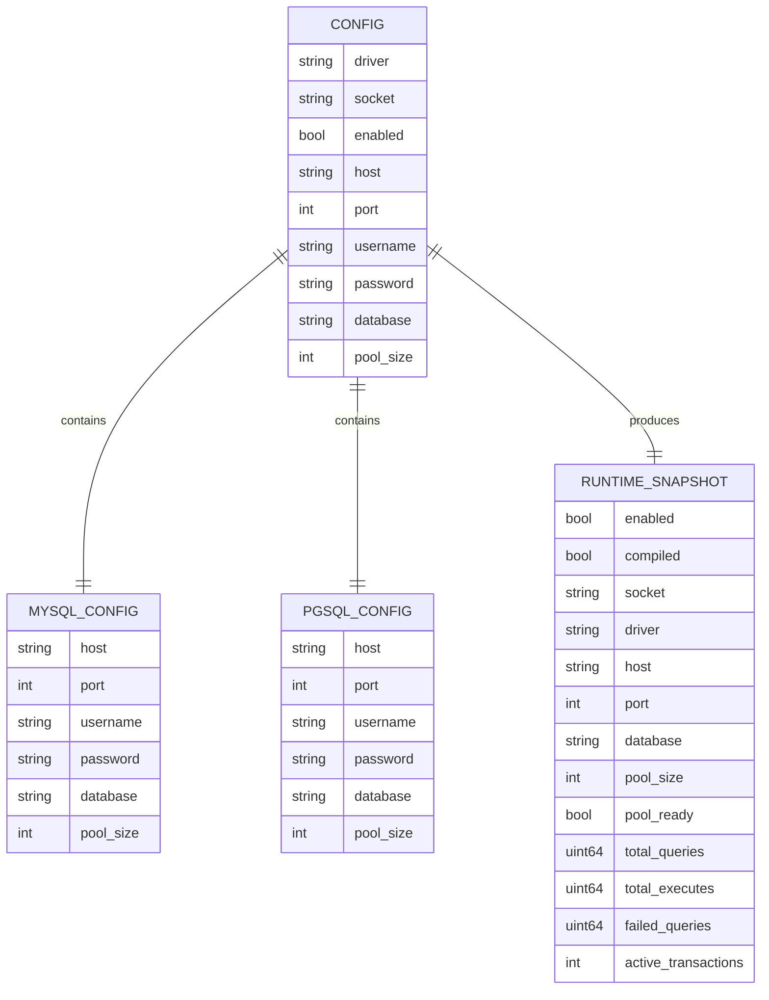

**图表来源**
- [config.v:244-251](file://src/config/config.v#L244-L251)
- [runtime.v:16-36](file://src/dbx/runtime.v#L16-L36)

**章节来源**
- [runtime.v:1-11](file://src/dbx/runtime.v#L1-L11)
- [db_driver.v:3-4](file://dbsrc/db_driver.v#L3-L4)
- [config.v:244-251](file://src/config/config.v#L244-L251)

## 性能考虑

### 连接池优化

#### 连接池大小调优

连接池大小的选择需要平衡以下因素：

- **高并发场景**：建议设置为CPU核心数的2-4倍
- **内存限制**：每个连接约占用1-10MB内存
- **数据库限制**：考虑数据库的最大连接数限制
- **网络带宽**：过多连接可能造成网络拥塞

#### 连接复用策略

系统通过连接复用减少连接建立开销：

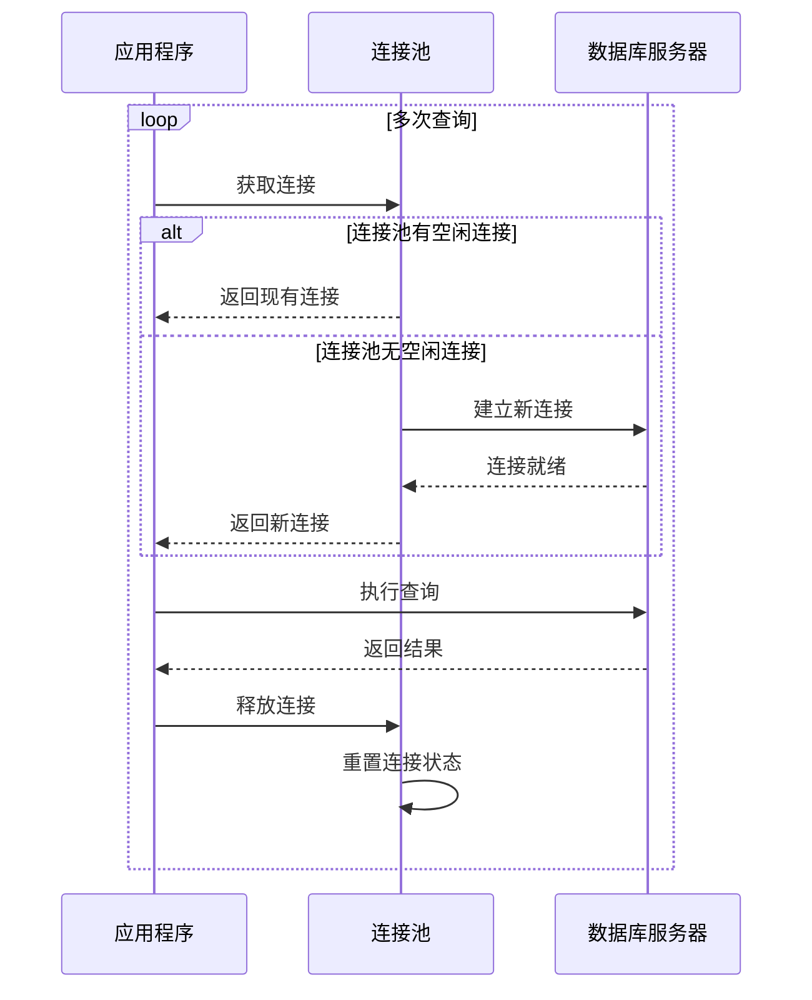

**图表来源**
- [runtime.v:182-197](file://src/dbx/runtime.v#L182-L197)
- [db_driver.v:166-180](file://dbsrc/db_driver.v#L166-L180)

### 查询性能优化

#### 预编译语句优化

系统自动识别参数化查询并使用预编译语句：

| 优化级别 | 性能提升 | 内存占用 | 安全性 |
|----------|----------|----------|--------|
| 直接查询 | 低 | 低 | 低 |
| 预编译语句 | 高 | 中等 | 高 |
| 批量执行 | 最高 | 高 | 最高 |

#### 结果集处理优化

系统采用流式处理减少内存占用：

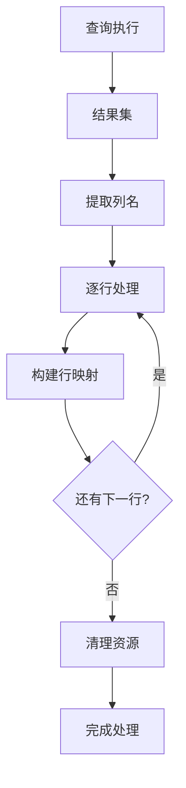

**图表来源**
- [db_driver.v:329-378](file://dbsrc/db_driver.v#L329-L378)

**章节来源**
- [runtime.v:182-197](file://src/dbx/runtime.v#L182-L197)
- [db_driver.v:329-378](file://dbsrc/db_driver.v#L329-L378)

## 故障排除指南

### 常见连接问题

#### 连接池相关问题

| 问题类型 | 症状 | 可能原因 | 解决方案 |
|----------|------|----------|----------|
| 连接池不可用 | unsupported_driver错误 | 驱动不支持连接池 | 检查驱动能力和配置 |
| 连接获取超时 | 连接池耗尽 | 连接池过小或连接泄漏 | 增大连接池或检查代码 |
| 连接复用失败 | 连接状态异常 | 事务未正确结束 | 确保事务正确提交或回滚 |

#### 事务相关问题

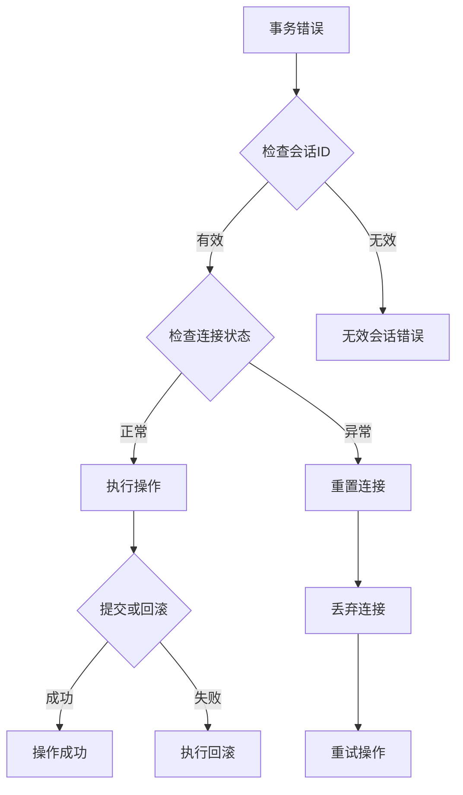

**图表来源**
- [runtime.v:307-346](file://src/dbx/runtime.v#L307-L346)

### 监控和诊断

#### 运行时状态监控

系统提供详细的运行时状态信息：

| 监控指标 | 数据类型 | 描述 | 更新频率 |
|----------|----------|------|----------|
| total_queries | uint64 | 总查询次数 | 每次查询后更新 |
| total_executes | uint64 | 总执行次数 | 每次执行后更新 |
| failed_queries | uint64 | 失败查询次数 | 每次错误后更新 |
| active_transactions | int | 活跃事务数量 | 实时更新 |
| pool_ready | bool | 连接池就绪状态 | 实时更新 |

#### 错误处理机制

系统采用分级错误处理策略：

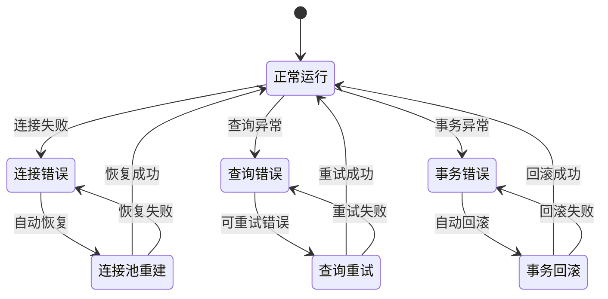

**图表来源**
- [runtime.v:739-742](file://src/dbx/runtime.v#L739-L742)
- [runtime.v:307-346](file://src/dbx/runtime.v#L307-L346)

**章节来源**
- [runtime.v:739-742](file://src/dbx/runtime.v#L739-L742)
- [runtime.v:307-346](file://src/dbx/runtime.v#L307-L346)

## 结论

vhttpd 的数据库运行时配置系统提供了完整的企业级数据库访问解决方案。通过模块化的架构设计、完善的连接池管理、灵活的事务处理机制，以及全面的性能优化特性，系统能够满足各种规模的应用需求。

**更新** 类型系统重构引入了 `dbx.Runtime` 模块限定名，替代了之前的 `DbProviderRuntime` 类型别名，提供了更好的模块化和类型安全性。新的架构更加清晰地分离了运行时逻辑和配置管理。

关键优势包括：
- **多数据库支持**：统一接口支持MySQL和PostgreSQL
- **高性能连接池**：智能连接管理和复用
- **完整的事务支持**：ACID特性保证数据一致性
- **安全的查询执行**：参数化查询防止SQL注入
- **全面的监控能力**：实时状态监控和故障诊断
- **模块化设计**：清晰的类型系统和命名空间

建议在生产环境中根据实际负载情况调整连接池大小、监控指标和日志级别，以达到最佳的性能和稳定性平衡。