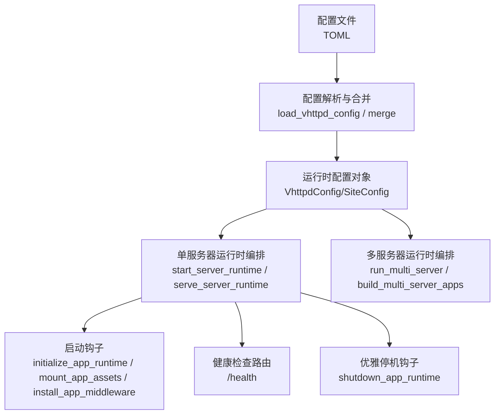
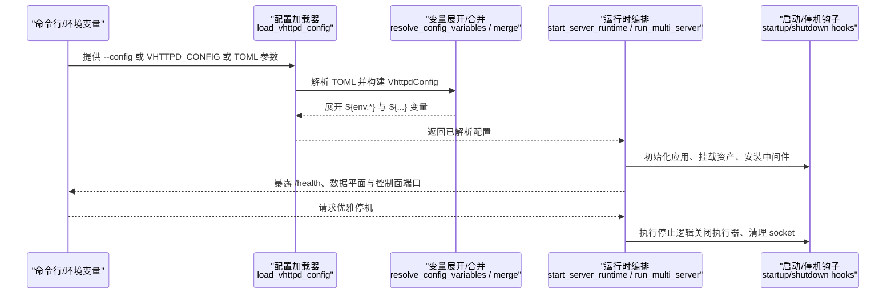
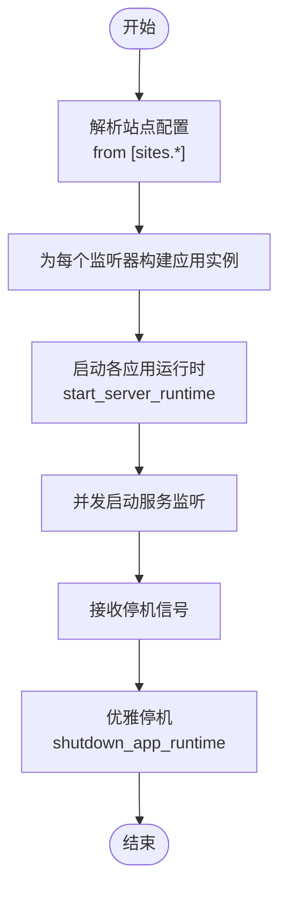
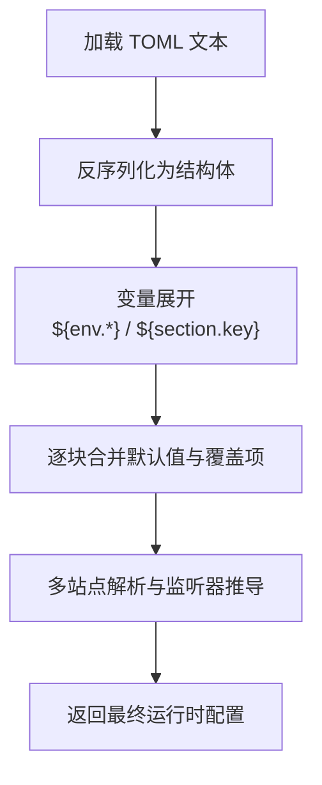
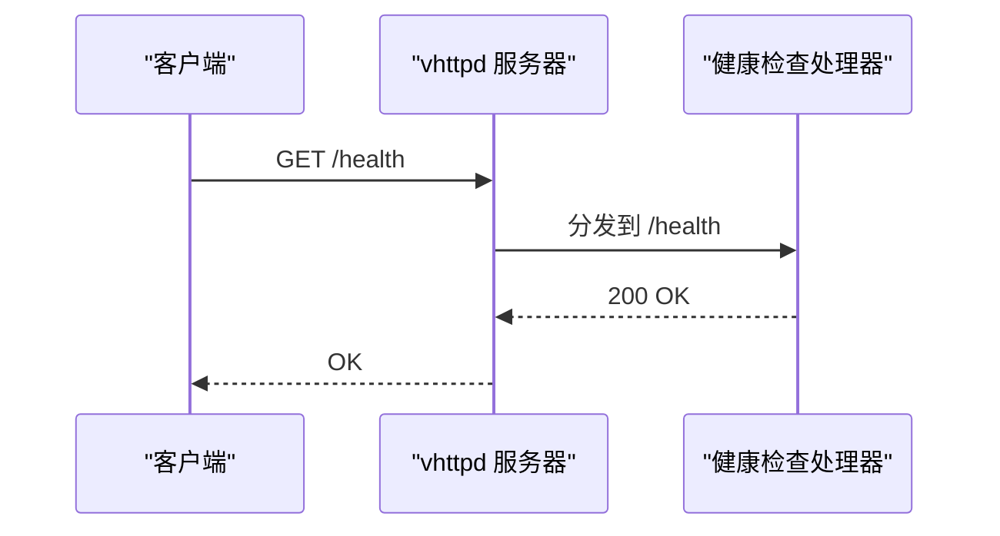
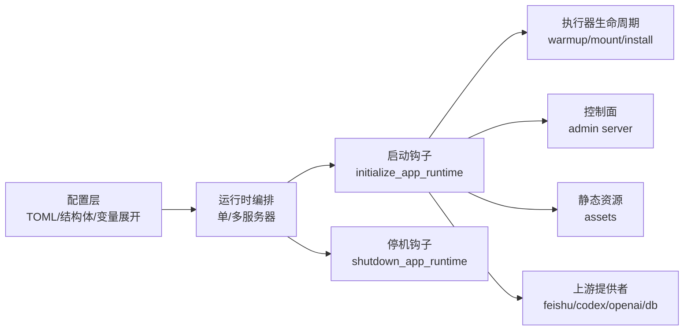

# 服务器运行时配置

<cite>
**本文档引用的文件**
- [config/vhttpd.example.toml](file://config/vhttpd.example.toml)
- [config/vhttpd.multi.example.toml](file://config/vhttpd.multi.example.toml)
- [config/vhttpd.vjsx.example.toml](file://config/vhttpd.vjsx.example.toml)
- [src/config/config.v](file://src/config/config.v)
- [src/config/runtime_config.v](file://src/config/runtime_config.v)
- [src/config/args.v](file://src/config/args.v)
- [src/main.v](file://src/main.v)
- [src/server_runtime_orchestrator.v](file://src/server_runtime_orchestrator.v)
- [src/multi_server_runtime_orchestrator.v](file://src/multi_server_runtime_orchestrator.v)
- [src/server_startup_hooks.v](file://src/server_startup_hooks.v)
- [src/server_shutdown_hooks.v](file://src/server_shutdown_hooks.v)
</cite>

## 目录
1. [简介](#简介)
2. [项目结构](#项目结构)
3. [核心组件](#核心组件)
4. [架构总览](#架构总览)
5. [详细组件分析](#详细组件分析)
6. [依赖关系分析](#依赖关系分析)
7. [性能考虑](#性能考虑)
8. [故障排查指南](#故障排查指南)
9. [结论](#结论)
10. [附录](#附录)

## 简介
本文件面向 vhttpd 服务器的运行时配置，系统性阐述服务器级配置项（监听端口、网络绑定、进程与工作器管理、资源限制等），并覆盖单服务器与多服务器模式下的配置差异与高级特性（如多站点监听、负载均衡与集群管理思路）。同时，文档解释启动参数、环境变量注入、安全策略（管理员令牌、跨域策略等）以及运维层面的健康检查、重启策略与优雅停机等最佳实践。

## 项目结构
vhttpd 的运行时配置由三部分组成：
- 配置文件：以 TOML 格式定义路径、服务器、文件、运行时、工作器、执行器、PHP/VJSX、资产、飞书、Codex、OpenAI 等配置块。
- 运行时解析与合并：在加载配置后进行变量展开、默认值合并、站点级覆盖与多监听器解析。
- 启动与生命周期：根据解析后的运行时配置初始化应用、启动执行器、挂载静态资源、启动控制面与上游服务，并提供健康检查与优雅停机钩子。

**图表来源**
- [src/config/config.v](file://src/config/config.v)
- [src/config/runtime_config.v](file://src/config/runtime_config.v)
- [src/server_runtime_orchestrator.v](file://src/server_runtime_orchestrator.v)
- [src/multi_server_runtime_orchestrator.v](file://src/multi_server_runtime_orchestrator.v)
- [src/server_startup_hooks.v](file://src/server_startup_hooks.v)
- [src/server_shutdown_hooks.v](file://src/server_shutdown_hooks.v)
- [src/main.v](file://src/main.v)

**章节来源**
- [config/vhttpd.example.toml](file://config/vhttpd.example.toml)
- [config/vhttpd.multi.example.toml](file://config/vhttpd.multi.example.toml)
- [config/vhttpd.vjsx.example.toml](file://config/vhttpd.vjsx.example.toml)
- [src/config/config.v](file://src/config/config.v)
- [src/config/runtime_config.v](file://src/config/runtime_config.v)

## 核心组件
- 路径与文件
  - paths：根目录与常用路径别名（如 PHP 应用入口、扩展、Web 根目录等）
  - files：PID 文件、事件日志文件位置
- 服务器与监听
  - server：主数据平面监听地址与端口
  - listeners/servers：多监听器或多站点配置（多服务器模式）
- 运行时与资源
  - runtime：时区等运行时环境
  - worker：工作器超时、自动启动、池大小、socket 前缀、最大请求数、重启退避策略等
  - executor：执行器类型（php/vjsx）
  - php/vjsx：可执行程序、入口、模块根、线程数、启用能力（FS/进程/网络）、签名根等
- 安全与控制面
  - admin：控制面主机、端口、访问令牌
  - mcp：会话上限、待处理消息上限、会话 TTL、允许的来源、采样策略
- 资产与静态资源
  - assets：是否启用、前缀、根目录、缓存控制头
- 第三方集成
  - feishu：启用开关、开放平台基础 URL、重连延迟、令牌刷新偏移、最近事件限制、应用配置
  - codex：启用开关、URL、模型、努力级别、工作目录、审批策略、沙箱策略、重连延迟、刷新间隔
  - openai：启用开关、基础路径、默认后端、端点开关、后端列表与路由映射
  - db：数据库驱动（mysql/pg）、socket、池大小等

**章节来源**
- [config/vhttpd.example.toml](file://config/vhttpd.example.toml)
- [config/vhttpd.multi.example.toml](file://config/vhttpd.multi.example.toml)
- [config/vhttpd.vjsx.example.toml](file://config/vhttpd.vjsx.example.toml)
- [src/config/config.v](file://src/config/config.v)

## 架构总览
vhttpd 的运行时配置解析与应用流程如下：

**图表来源**
- [src/config/config.v](file://src/config/config.v)
- [src/config/runtime_config.v](file://src/config/runtime_config.v)
- [src/server_runtime_orchestrator.v](file://src/server_runtime_orchestrator.v)
- [src/multi_server_runtime_orchestrator.v](file://src/multi_server_runtime_orchestrator.v)
- [src/server_startup_hooks.v](file://src/server_startup_hooks.v)
- [src/server_shutdown_hooks.v](file://src/server_shutdown_hooks.v)

## 详细组件分析

### 单服务器配置（单监听器）
- 监听与绑定
  - 使用 [server] 主机与端口作为数据平面监听；控制面（admin）独立监听。
- 工作器与进程管理
  - 通过 [worker] 控制读超时、自动启动、池大小、socket 前缀、最大请求数、重启退避策略。
  - 通过 [executor] 指定执行器类型（php/vjsx）。
  - PHP 模式下使用 [php] 指定二进制、工作器入口、应用入口与扩展；VJSX 模式下使用 [vjsx] 指定入口、模块根、线程数与能力开关。
- 资源与静态资源
  - [assets] 控制静态资源启用、前缀、根目录与缓存控制头。
- 安全与控制面
  - [admin] 提供独立控制面主机、端口与访问令牌。
- 运行时与第三方
  - [runtime] 设置时区。
  - [feishu]/[codex]/[openai]/[db] 等按需启用与配置。

**章节来源**
- [config/vhttpd.example.toml](file://config/vhttpd.example.toml)
- [config/vhttpd.vjsx.example.toml](file://config/vhttpd.vjsx.example.toml)
- [src/config/config.v](file://src/config/config.v)

### 多服务器配置（多监听器/多站点）
- 多监听器模式
  - 不显式配置 [listeners] 时，系统从 [sites.<id>] 推导监听器，每个站点拥有独立 host/port/site 映射。
  - 支持在同一进程内为不同站点提供独立的执行器与工作器配置。
- 多站点差异
  - 每个站点可覆盖路径、执行器、PHP/VJSX 入口、工作器池大小与 socket 前缀等。
  - 可为不同站点启用不同的第三方集成（如飞书多应用）。
- 运行时编排
  - 多服务器编排器负责为每个监听器构建应用实例并启动服务，支持优雅停机与资源回收。

**图表来源**
- [src/config/runtime_config.v](file://src/config/runtime_config.v)
- [src/multi_server_runtime_orchestrator.v](file://src/multi_server_runtime_orchestrator.v)
- [src/server_runtime_orchestrator.v](file://src/server_runtime_orchestrator.v)
- [src/server_shutdown_hooks.v](file://src/server_shutdown_hooks.v)

**章节来源**
- [config/vhttpd.multi.example.toml](file://config/vhttpd.multi.example.toml)
- [src/config/runtime_config.v](file://src/config/runtime_config.v)
- [src/multi_server_runtime_orchestrator.v](file://src/multi_server_runtime_orchestrator.v)

### 配置解析与变量展开
- 配置加载
  - 支持通过命令行参数、环境变量（VHTTPD_CONFIG）或直接传入 TOML 文件路径加载配置。
- 变量展开
  - 支持 ${env.VAR} 与 ${section.key} 表达式，支持默认值 ${env.VAR:-default}。
  - 展开过程递归替换，确保路径与字符串中的占位符被正确解析。
- 默认值与合并
  - 对 Worker、Executor、Php、Vjsx、Assets、Runtime、Mcp、Feishu、Codex、OpenAI、Bridge 等配置块提供默认值与选择性覆盖。
  - 多站点场景下，站点配置可覆盖全局配置，且自动推断执行器类型（php/vjsx）。

**图表来源**
- [src/config/config.v](file://src/config/config.v)
- [src/config/runtime_config.v](file://src/config/runtime_config.v)

**章节来源**
- [src/config/config.v](file://src/config/config.v)
- [src/config/runtime_config.v](file://src/config/runtime_config.v)

### 启动参数与环境变量
- 启动参数
  - 支持 --config 指定配置文件路径；未指定时尝试读取环境变量 VHTTPD_CONFIG；否则使用默认配置。
  - 支持布尔、整型、字符串列表等多种参数解析方式。
- 环境变量
  - 配置中广泛使用 ${env.VAR} 注入敏感信息（如令牌、密钥、数据库凭据）。
  - 变量展开失败时可提供默认值，避免启动中断。

**章节来源**
- [src/config/args.v](file://src/config/args.v)
- [src/config/config.v](file://src/config/config.v)

### 安全策略与控制面
- 管理员令牌
  - [admin] 提供访问令牌，用于控制面鉴权。
- 跨域与会话
  - [mcp] 允许配置最大会话数、待处理消息数、会话 TTL 与允许来源列表，以及采样策略。
- 飞书与卡片桥接
  - [feishu] 支持多应用配置、重连与令牌刷新策略；可启用卡片桥接客户端。

**章节来源**
- [config/vhttpd.example.toml](file://config/vhttpd.example.toml)
- [src/config/config.v](file://src/config/config.v)

### 健康检查与运维配置
- 健康检查
  - 提供 /health 路由，支持 GET 方法返回 200 OK。
- 重启策略
  - 工作器重启退避策略（初始与最大退避时间）可配置，避免雪崩效应。
- 优雅停机
  - 停机时触发事件记录、关闭执行器、清理内部 admin socket 与 PID 文件。

**图表来源**
- [src/main.v](file://src/main.v)

**章节来源**
- [src/main.v](file://src/main.v)
- [src/server_shutdown_hooks.v](file://src/server_shutdown_hooks.v)

## 依赖关系分析
- 配置层
  - TOML 配置 → 结构体定义 → 变量展开 → 默认值合并 → 多监听器推导
- 运行时层
  - 单服务器：启动钩子 → 启动执行器生命周期 → 挂载静态资源 → 启动控制面 → 启动上游提供者
  - 多服务器：为每个监听器构建应用 → 并发启动 → 统一优雅停机
- 关键耦合点
  - worker.backend 与 executor 生命周期强相关
  - 多站点共享 paths 但各自覆盖 worker/php/vjsx 配置
  - 控制面与数据平面分离，通过独立端口暴露

**图表来源**
- [src/config/config.v](file://src/config/config.v)
- [src/server_runtime_orchestrator.v](file://src/server_runtime_orchestrator.v)
- [src/multi_server_runtime_orchestrator.v](file://src/multi_server_runtime_orchestrator.v)
- [src/server_startup_hooks.v](file://src/server_startup_hooks.v)
- [src/server_shutdown_hooks.v](file://src/server_shutdown_hooks.v)

**章节来源**
- [src/config/config.v](file://src/config/config.v)
- [src/server_runtime_orchestrator.v](file://src/server_runtime_orchestrator.v)
- [src/multi_server_runtime_orchestrator.v](file://src/multi_server_runtime_orchestrator.v)
- [src/server_startup_hooks.v](file://src/server_startup_hooks.v)
- [src/server_shutdown_hooks.v](file://src/server_shutdown_hooks.v)

## 性能考虑
- 工作器池大小与请求上限
  - 通过 [worker.pool_size] 与 [worker.max_requests] 控制吞吐与资源占用，建议结合业务峰值与 GC 行为调优。
- 重启退避策略
  - [worker.restart_backoff_ms] 与 [worker.restart_backoff_max_ms] 降低瞬时重启对系统的影响。
- 执行器线程与能力
  - [vjsx.thread_count] 与 enable_fs/process/network 决定 VJSX 执行器的并发与能力边界，建议按实际需求开启。
- 静态资源缓存
  - [assets.cache_control] 提升静态资源命中率，减少带宽与 CPU 开销。
- 会话与队列
  - [mcp.max_pending_messages]、[mcp.max_sessions]、[websocket_actor.queue_timeout_ms] 等参数影响上游交互的稳定性与延迟。

[本节为通用指导，无需特定文件引用]

## 故障排查指南
- 配置加载失败
  - 检查配置文件路径是否通过 --config 或 VHTTPD_CONFIG 正确传递；确认 TOML 语法与字段拼写。
- 变量展开错误
  - 若出现“缺少环境变量”或“未知配置变量”，检查 ${env.VAR} 与 ${section.key} 是否存在默认值或正确设置。
- 多监听器缺失端口
  - 多站点模式下若某站点未设置 port，将导致监听器解析失败；请为每个站点配置 host/port。
- 健康检查异常
  - 确认 /health 路由可用，检查服务器启动日志与事件日志文件。
- 优雅停机问题
  - 若停机后残留 socket/PID 文件，检查停机钩子是否正常执行；必要时手动清理。

**章节来源**
- [src/config/config.v](file://src/config/config.v)
- [src/config/runtime_config.v](file://src/config/runtime_config.v)
- [src/main.v](file://src/main.v)
- [src/server_shutdown_hooks.v](file://src/server_shutdown_hooks.v)

## 结论
vhttpd 的运行时配置体系以 TOML 为中心，通过严格的默认值与选择性覆盖机制，支持单服务器与多服务器两种部署形态。借助变量展开、多站点差异化配置与完善的启动/停机钩子，用户可在生产环境中实现高可用、可观测与可维护的运行时管理。建议在生产部署中优先明确环境变量注入、健康检查与优雅停机策略，并结合业务特征调整工作器池大小与执行器能力。

[本节为总结，无需特定文件引用]

## 附录

### A. 配置项速查表
- 路径与文件
  - paths.root、paths.*、files.pid_file、files.event_log
- 服务器与监听
  - server.host、server.port、listeners.*、sites.*.host、sites.*.port
- 运行时与资源
  - runtime.timezone、worker.*、executor.kind、php.*、vjsx.*
- 安全与控制面
  - admin.host、admin.port、admin.token、mcp.*
- 资产与静态资源
  - assets.enabled、assets.prefix、assets.root、assets.cache_control
- 第三方集成
  - feishu.*、codex.*、openai.*、db.*

**章节来源**
- [config/vhttpd.example.toml](file://config/vhttpd.example.toml)
- [config/vhttpd.multi.example.toml](file://config/vhttpd.multi.example.toml)
- [config/vhttpd.vjsx.example.toml](file://config/vhttpd.vjsx.example.toml)
- [src/config/config.v](file://src/config/config.v)