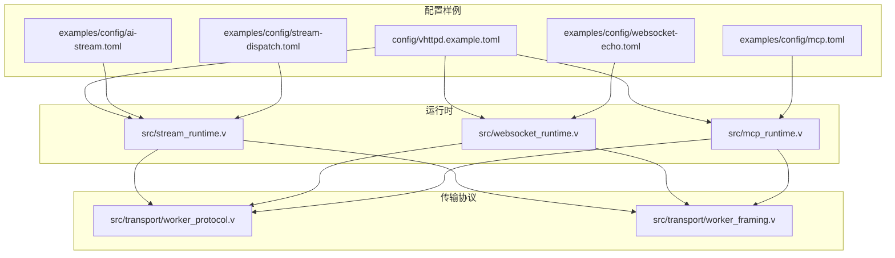
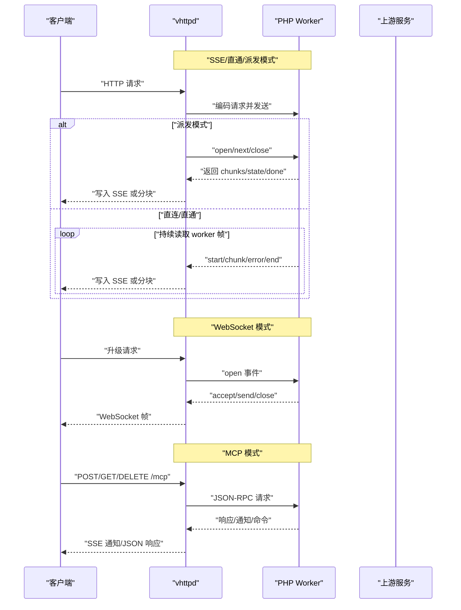
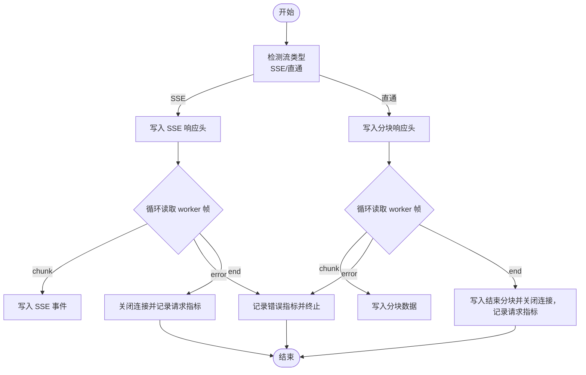
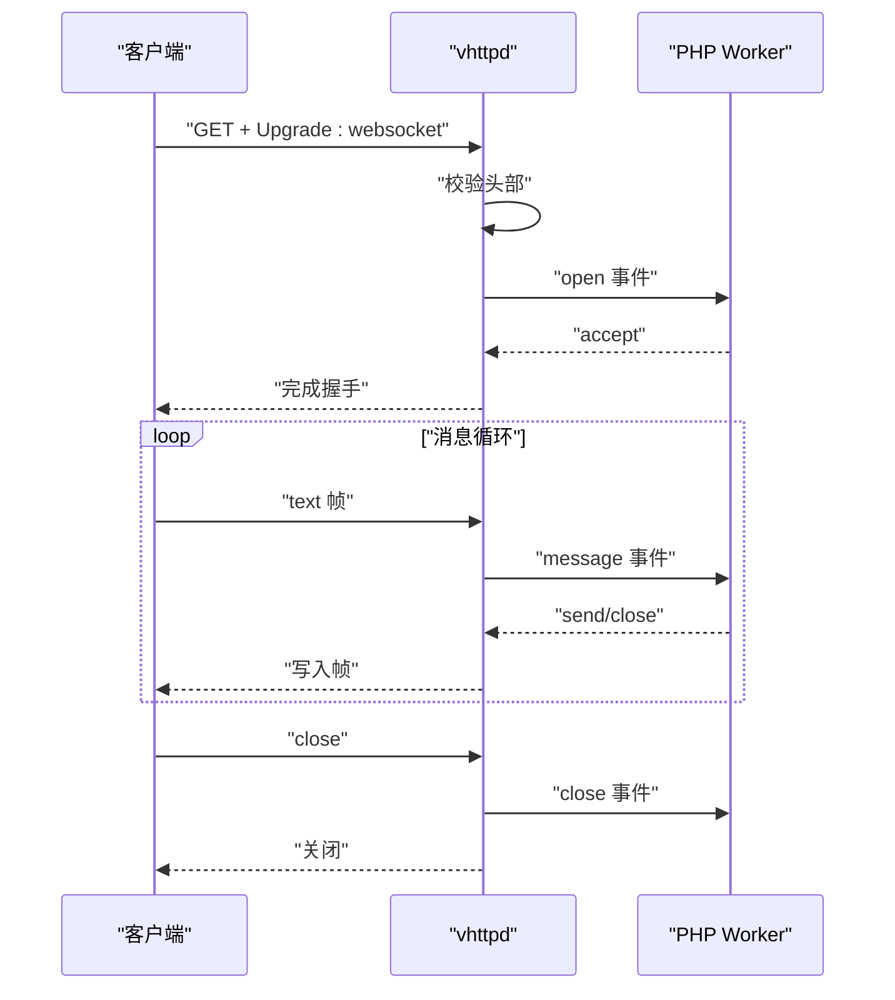
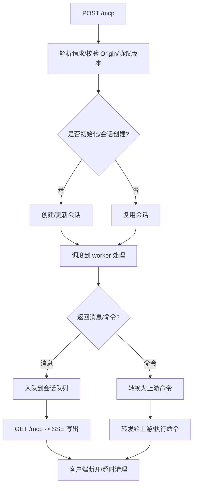
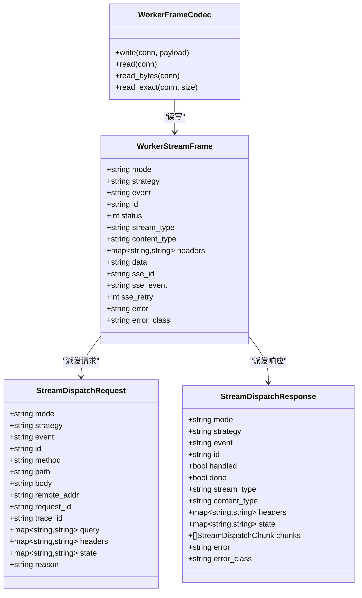
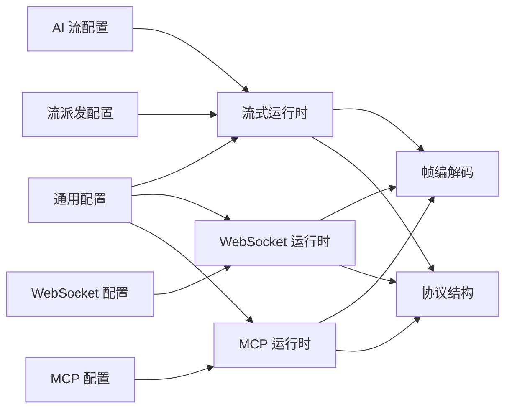

# 流式运行时配置

<cite>
**本文引用的文件**
- [src/stream_runtime.v](file://src/stream_runtime.v)
- [src/websocket_runtime.v](file://src/websocket_runtime.v)
- [src/mcp_runtime.v](file://src/mcp_runtime.v)
- [src/transport/worker_protocol.v](file://src/transport/worker_protocol.v)
- [src/transport/worker_framing.v](file://src/transport/worker_framing.v)
- [config/vhttpd.example.toml](file://config/vhttpd.example.toml)
- [examples/config/ai-stream.toml](file://examples/config/ai-stream.toml)
- [examples/config/mcp.toml](file://examples/config/mcp.toml)
- [examples/config/websocket-echo.toml](file://examples/config/websocket-echo.toml)
- [examples/config/stream-dispatch.toml](file://examples/config/stream-dispatch.toml)
- [docs/MCP.md](file://docs/MCP.md)
- [docs/WEBSOCKET_MVP_PLAN.md](file://docs/WEBSOCKET_MVP_PLAN.md)
- [docs/STREAM_RUNTIME_PHASES.md](file://docs/STREAM_RUNTIME_PHASES.md)
- [docs/STREAM_PHASE2_IMPLEMENTATION_PLAN.md](file://docs/STREAM_PHASE2_IMPLEMENTATION_PLAN.md)
</cite>

## 目录
1. [简介](#简介)
2. [项目结构](#项目结构)
3. [核心组件](#核心组件)
4. [架构总览](#架构总览)
5. [详细组件分析](#详细组件分析)
6. [依赖关系分析](#依赖关系分析)
7. [性能考虑](#性能考虑)
8. [故障排查指南](#故障排查指南)
9. [结论](#结论)
10. [附录](#附录)

## 简介
本文件面向 vhttpd 的“流式运行时”配置，系统性阐述三类流式通道：SSE 流、WebSocket 流、MCP 流的配置要点与运行机制；涵盖缓冲区大小、超时设置、重连机制、错误处理策略；解释传输协议（帧格式、编码方式、压缩选项）；给出性能调优建议（并发连接数、带宽限制、QoS 设置）以及监控指标采集方案。

## 项目结构
围绕流式运行时的关键代码与配置分布如下：
- 运行时入口与路由：SSE/直通/派发模式在流式运行时模块中实现
- 协议与帧编解码：统一的 Worker 协议与帧头封装
- 配置样例：多套示例配置展示不同运行时的参数差异
- 文档：MCP/WebSocket/流式阶段演进文档，明确各阶段职责与边界

图表来源
- [src/stream_runtime.v:1-316](file://src/stream_runtime.v#L1-L316)
- [src/websocket_runtime.v:1-121](file://src/websocket_runtime.v#L1-L121)
- [src/mcp_runtime.v:1-498](file://src/mcp_runtime.v#L1-L498)
- [src/transport/worker_protocol.v:1-276](file://src/transport/worker_protocol.v#L1-L276)
- [src/transport/worker_framing.v:1-225](file://src/transport/worker_framing.v#L1-L225)
- [config/vhttpd.example.toml:1-67](file://config/vhttpd.example.toml#L1-L67)
- [examples/config/ai-stream.toml:1-22](file://examples/config/ai-stream.toml#L1-L22)
- [examples/config/mcp.toml:1-39](file://examples/config/mcp.toml#L1-L39)
- [examples/config/websocket-echo.toml:1-28](file://examples/config/websocket-echo.toml#L1-L28)
- [examples/config/stream-dispatch.toml:1-30](file://examples/config/stream-dispatch.toml#L1-L30)

章节来源
- [src/stream_runtime.v:1-316](file://src/stream_runtime.v#L1-L316)
- [src/websocket_runtime.v:1-121](file://src/websocket_runtime.v#L1-L121)
- [src/mcp_runtime.v:1-498](file://src/mcp_runtime.v#L1-L498)
- [src/transport/worker_protocol.v:1-276](file://src/transport/worker_protocol.v#L1-L276)
- [src/transport/worker_framing.v:1-225](file://src/transport/worker_framing.v#L1-L225)
- [config/vhttpd.example.toml:1-67](file://config/vhttpd.example.toml#L1-L67)
- [examples/config/ai-stream.toml:1-22](file://examples/config/ai-stream.toml#L1-L22)
- [examples/config/mcp.toml:1-39](file://examples/config/mcp.toml#L1-L39)
- [examples/config/websocket-echo.toml:1-28](file://examples/config/websocket-echo.toml#L1-L28)
- [examples/config/stream-dispatch.toml:1-30](file://examples/config/stream-dispatch.toml#L1-L30)

## 核心组件
- 流式运行时上下文与路由
  - SSE 直连模式：直接写入 SSE 事件消息，适用于短尾或实时性要求高的场景
  - 直通模式：按 HTTP 分块写入原始数据，适用于非结构化流
  - 派发模式：由 vhttpd 主动拉取 worker 的下一批 chunk，降低 worker 占用
- WebSocket 运行时
  - 将 HTTP 升级后的连接交由内置 WebSocket 库处理，桥接 worker 的双向事件
- MCP 运行时
  - 提供 JSON-RPC over HTTP 的 MCP 传输，支持会话管理、SSE 通知队列、采样能力策略

章节来源
- [src/stream_runtime.v:41-58](file://src/stream_runtime.v#L41-L58)
- [src/stream_runtime.v:66-121](file://src/stream_runtime.v#L66-L121)
- [src/stream_runtime.v:129-184](file://src/stream_runtime.v#L129-L184)
- [src/stream_runtime.v:211-315](file://src/stream_runtime.v#L211-L315)
- [src/websocket_runtime.v:25-100](file://src/websocket_runtime.v#L25-L100)
- [src/mcp_runtime.v:114-331](file://src/mcp_runtime.v#L114-L331)
- [src/mcp_runtime.v:338-448](file://src/mcp_runtime.v#L338-L448)

## 架构总览
vhttpd 的流式运行时遵循“连接归属 vhttpd、worker 短生命周期”的原则，通过统一的帧协议与派发策略实现高扩展的流式传输。

图表来源
- [src/stream_runtime.v:66-121](file://src/stream_runtime.v#L66-L121)
- [src/stream_runtime.v:129-184](file://src/stream_runtime.v#L129-L184)
- [src/stream_runtime.v:211-315](file://src/stream_runtime.v#L211-L315)
- [src/websocket_runtime.v:25-100](file://src/websocket_runtime.v#L25-L100)
- [src/mcp_runtime.v:114-331](file://src/mcp_runtime.v#L114-L331)
- [src/mcp_runtime.v:338-448](file://src/mcp_runtime.v#L338-L448)

## 详细组件分析

### SSE 流配置
- 运行模式
  - 直连模式：设置响应头指示反向代理不缓存，使用 SSE 事件格式写入
  - 直通模式：按分块写入，适用于非结构化数据
- 关键配置点
  - 响应头：请求 ID、追踪 ID、流模式标记、SSE 缓冲控制
  - 写入策略：根据事件类型选择 SSE 或分块写入
  - 错误处理：遇到 error 事件时记录指标并终止
- 典型用途
  - 实时 token 流、日志流、事件推送

图表来源
- [src/stream_runtime.v:66-121](file://src/stream_runtime.v#L66-L121)
- [src/stream_runtime.v:129-184](file://src/stream_runtime.v#L129-L184)

章节来源
- [src/stream_runtime.v:66-121](file://src/stream_runtime.v#L66-L121)
- [src/stream_runtime.v:129-184](file://src/stream_runtime.v#L129-L184)

### WebSocket 流配置
- 升级与握手
  - 严格校验 Upgrade/Connection/Sec-WebSocket-Key 等头部
  - 成功后接管 TCP 连接，交由内置 WebSocket 库处理
- 事件桥接
  - vhttpd 向 worker 发送 open/message/close 事件
  - worker 向 vhttpd 发送 accept/send/close/error 事件
- 生命周期
  - 接受后建立双向事件循环，支持文本帧
  - 关闭时清理本地状态并通知 worker

图表来源
- [src/websocket_runtime.v:25-100](file://src/websocket_runtime.v#L25-L100)
- [docs/WEBSOCKET_MVP_PLAN.md:112-122](file://docs/WEBSOCKET_MVP_PLAN.md#L112-L122)
- [docs/WEBSOCKET_MVP_PLAN.md:277-305](file://docs/WEBSOCKET_MVP_PLAN.md#L277-L305)

章节来源
- [src/websocket_runtime.v:25-100](file://src/websocket_runtime.v#L25-L100)
- [docs/WEBSOCKET_MVP_PLAN.md:112-122](file://docs/WEBSOCKET_MVP_PLAN.md#L112-L122)
- [docs/WEBSOCKET_MVP_PLAN.md:277-305](file://docs/WEBSOCKET_MVP_PLAN.md#L277-L305)

### MCP 流配置
- 传输与会话
  - POST/GET/DELETE /mcp，SSE 会话流，支持会话 ID 与协议版本
  - 会话队列支持采样能力策略（告警/丢弃/报错）
- 安全与策略
  - Origin 白名单校验
  - 会话 TTL、最大会话数、最大待处理消息数
- 事件与命令
  - worker 可返回 JSON-RPC 响应体、通知消息、命令
  - vhttpd 将通知写入 SSE 流，或将命令转译为 WebSocket 上游命令

图表来源
- [src/mcp_runtime.v:114-331](file://src/mcp_runtime.v#L114-L331)
- [src/mcp_runtime.v:338-448](file://src/mcp_runtime.v#L338-L448)
- [examples/config/mcp.toml:24-32](file://examples/config/mcp.toml#L24-L32)
- [docs/MCP.md:47-96](file://docs/MCP.md#L47-L96)

章节来源
- [src/mcp_runtime.v:114-331](file://src/mcp_runtime.v#L114-L331)
- [src/mcp_runtime.v:338-448](file://src/mcp_runtime.v#L338-L448)
- [examples/config/mcp.toml:24-32](file://examples/config/mcp.toml#L24-L32)
- [docs/MCP.md:47-96](file://docs/MCP.md#L47-L96)

### 流式传输协议与帧格式
- 帧编解码
  - 固定 4 字节大端长度 + JSON 负载
  - 读取时进行长度校验与 EOF 检测
- 请求编码
  - 统一编码 HTTP 请求元信息（方法、路径、查询、头部、Cookies、远端地址等）
- 流帧结构
  - 包含 mode、event、id、状态、内容类型、SSE 字段、错误信息等
- 派发响应
  - 包含流类型、内容类型、响应头、状态快照、分片集合、完成标志、错误信息

图表来源
- [src/transport/worker_framing.v:10-60](file://src/transport/worker_framing.v#L10-L60)
- [src/transport/worker_protocol.v:12-71](file://src/transport/worker_protocol.v#L12-L71)

章节来源
- [src/transport/worker_framing.v:10-60](file://src/transport/worker_framing.v#L10-L60)
- [src/transport/worker_protocol.v:12-71](file://src/transport/worker_protocol.v#L12-L71)

## 依赖关系分析
- 运行时对协议层的依赖
  - 流式运行时依赖统一的帧编解码与请求编码
  - WebSocket 运行时依赖帧结构与事件桥接
  - MCP 运行时依赖 JSON-RPC 结构与会话管理
- 配置对运行时的影响
  - worker 配置影响读超时、进程池规模、自动启动
  - 特定运行时配置（如 stream_dispatch、mcp 参数）决定行为边界

图表来源
- [src/stream_runtime.v:1-316](file://src/stream_runtime.v#L1-L316)
- [src/websocket_runtime.v:1-121](file://src/websocket_runtime.v#L1-L121)
- [src/mcp_runtime.v:1-498](file://src/mcp_runtime.v#L1-L498)
- [src/transport/worker_protocol.v:1-276](file://src/transport/worker_protocol.v#L1-L276)
- [src/transport/worker_framing.v:1-225](file://src/transport/worker_framing.v#L1-L225)
- [config/vhttpd.example.toml:1-67](file://config/vhttpd.example.toml#L1-L67)
- [examples/config/ai-stream.toml:1-22](file://examples/config/ai-stream.toml#L1-L22)
- [examples/config/mcp.toml:1-39](file://examples/config/mcp.toml#L1-L39)
- [examples/config/websocket-echo.toml:1-28](file://examples/config/websocket-echo.toml#L1-L28)
- [examples/config/stream-dispatch.toml:1-30](file://examples/config/stream-dispatch.toml#L1-L30)

章节来源
- [src/stream_runtime.v:1-316](file://src/stream_runtime.v#L1-L316)
- [src/websocket_runtime.v:1-121](file://src/websocket_runtime.v#L1-L121)
- [src/mcp_runtime.v:1-498](file://src/mcp_runtime.v#L1-L498)
- [src/transport/worker_protocol.v:1-276](file://src/transport/worker_protocol.v#L1-L276)
- [src/transport/worker_framing.v:1-225](file://src/transport/worker_framing.v#L1-L225)
- [config/vhttpd.example.toml:1-67](file://config/vhttpd.example.toml#L1-L67)
- [examples/config/ai-stream.toml:1-22](file://examples/config/ai-stream.toml#L1-L22)
- [examples/config/mcp.toml:1-39](file://examples/config/mcp.toml#L1-L39)
- [examples/config/websocket-echo.toml:1-28](file://examples/config/websocket-echo.toml#L1-L28)
- [examples/config/stream-dispatch.toml:1-30](file://examples/config/stream-dispatch.toml#L1-L30)

## 性能考虑
- 并发连接与工作池
  - worker 池大小与读超时直接影响并发处理能力与资源占用
  - 流式派发模式可显著降低 worker 占用，提升并发度
- 带宽与写入节奏
  - SSE/分块写入策略需结合下游网络状况调整
  - 对于长尾流，建议采用派发模式并配合背压策略
- QoS 与优先级
  - 通过会话 TTL、最大会话数、最大待处理消息数控制资源占用
  - MCP 的采样能力策略可在压力下选择告警/丢弃/报错，保障稳定性

章节来源
- [examples/config/mcp.toml:24-32](file://examples/config/mcp.toml#L24-L32)
- [docs/STREAM_RUNTIME_PHASES.md:90-109](file://docs/STREAM_RUNTIME_PHASES.md#L90-L109)
- [docs/STREAM_PHASE2_IMPLEMENTATION_PLAN.md:398-418](file://docs/STREAM_PHASE2_IMPLEMENTATION_PLAN.md#L398-L418)

## 故障排查指南
- SSE/直通写入失败
  - 检查客户端连接是否提前关闭
  - 查看错误事件指标与请求耗时
- WebSocket 握手失败
  - 校验 Upgrade/Connection/Sec-WebSocket-Key 头部
  - 确认 worker 是否正确返回 accept
- MCP 会话异常
  - 检查 Origin 白名单与协议版本
  - 关注采样能力策略触发的告警/错误
- 超时与背压
  - 调整 worker 读超时与派发轮询节奏
  - 控制会话 TTL 与最大待处理消息数

章节来源
- [src/stream_runtime.v:93-102](file://src/stream_runtime.v#L93-L102)
- [src/stream_runtime.v:155-164](file://src/stream_runtime.v#L155-L164)
- [src/websocket_runtime.v:25-100](file://src/websocket_runtime.v#L25-L100)
- [src/mcp_runtime.v:150-164](file://src/mcp_runtime.v#L150-L164)
- [src/mcp_runtime.v:242-261](file://src/mcp_runtime.v#L242-L261)
- [examples/config/mcp.toml:24-32](file://examples/config/mcp.toml#L24-L32)

## 结论
vhttpd 的流式运行时通过统一的帧协议与派发策略，实现了 SSE、WebSocket、MCP 三类流的标准化接入。配置层面，建议结合业务特征选择合适的流模式，并通过会话/连接参数、超时与背压策略实现稳定与高性能的运行。

## 附录

### 配置项速览与建议
- 通用 worker 配置
  - 读超时：影响长流稳定性
  - 自动启动/池大小：影响并发承载
  - 最大请求数/重启退避：影响稳定性与恢复速度
- AI 流配置
  - 指定应用入口与 socket，启用派发模式可提升并发
- WebSocket 配置
  - 适当延长读超时以适配长连接
- MCP 配置
  - 会话 TTL、最大会话数、最大待处理消息数
  - 采样能力策略（warn/drop/error）
  - Origin 白名单

章节来源
- [config/vhttpd.example.toml:16-27](file://config/vhttpd.example.toml#L16-L27)
- [examples/config/ai-stream.toml:9-16](file://examples/config/ai-stream.toml#L9-L16)
- [examples/config/websocket-echo.toml:9-16](file://examples/config/websocket-echo.toml#L9-L16)
- [examples/config/mcp.toml:24-32](file://examples/config/mcp.toml#L24-L32)