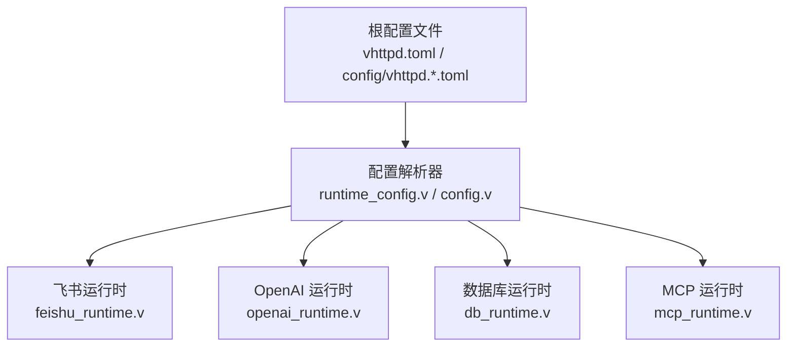
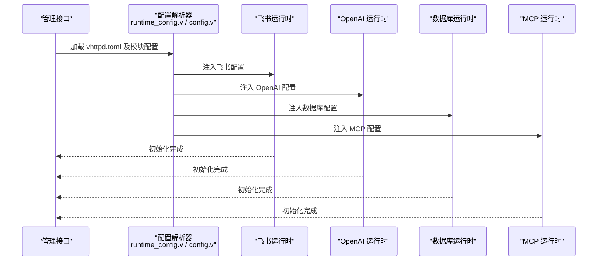
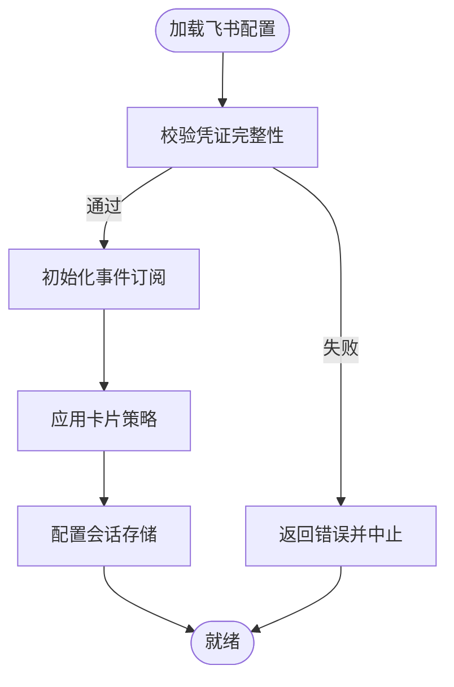
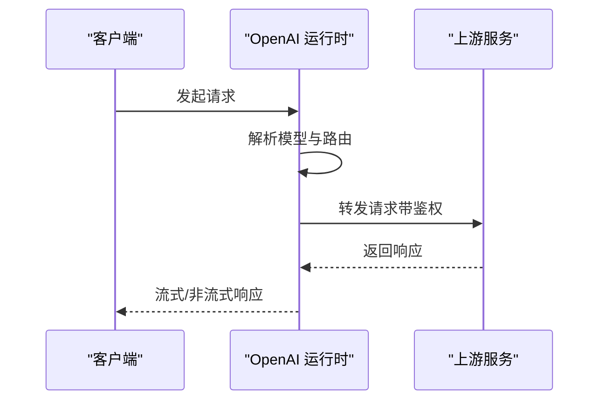
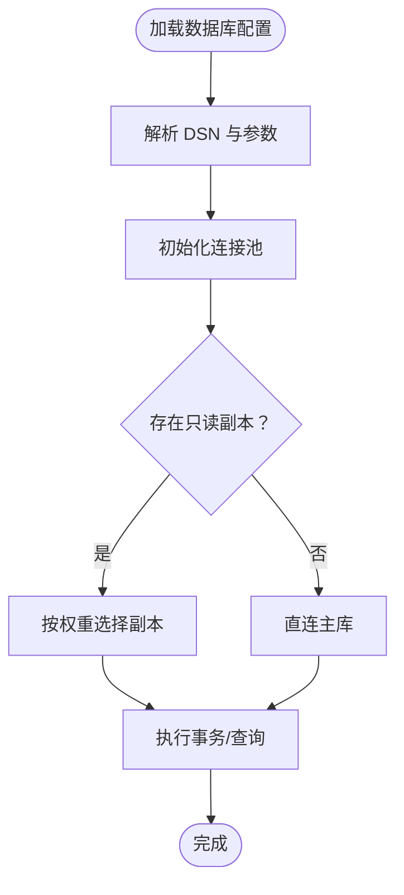
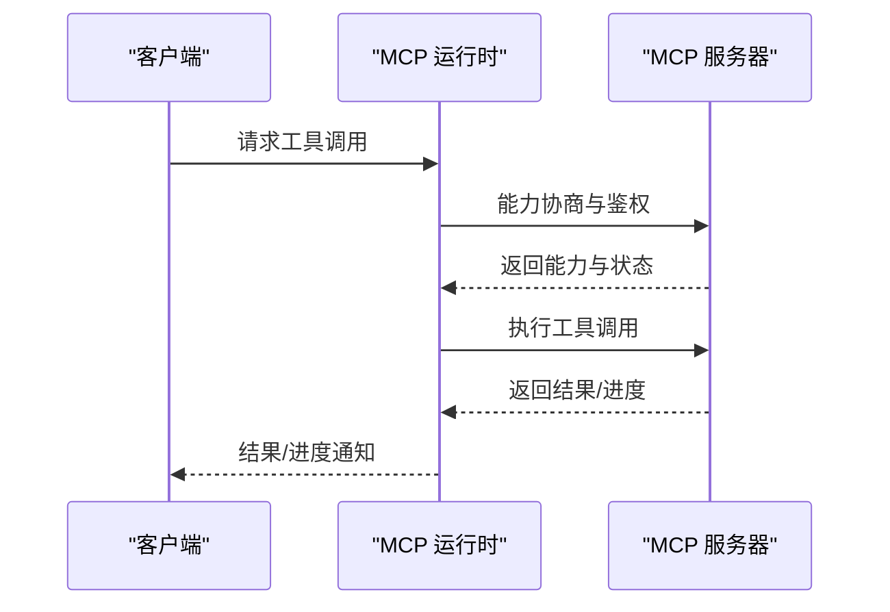
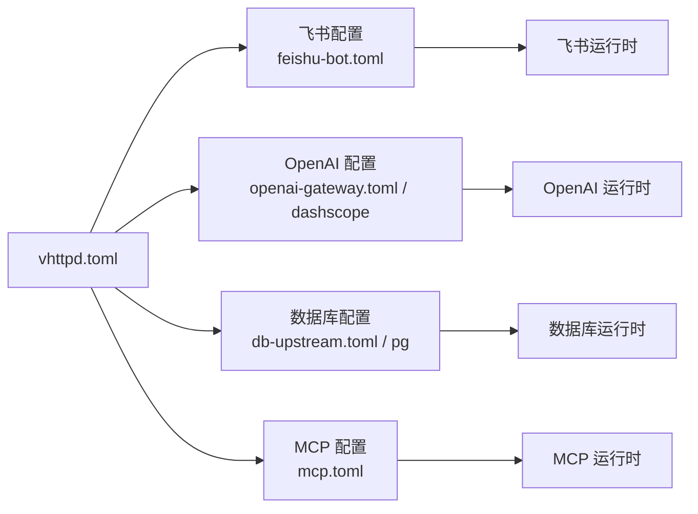

# 运行时配置

<cite>
**本文引用的文件**
- [vhttpd.toml](file://vhttpd.toml)
- [vhttpd.example.toml](file://config/vhttpd.example.toml)
- [vhttpd.multi.example.toml](file://config/vhttpd.multi.example.toml)
- [vhttpd.vjsx.example.toml](file://config/vhttpd.vjsx.example.toml)
- [runtime_config.v](file://src/config/runtime_config.v)
- [config.v](file://src/config/config.v)
- [mcp_runtime.v](file://src/mcp_runtime.v)
- [feishu_runtime.v](file://src/feishu_runtime.v)
- [openai_runtime.v](file://src/openai_runtime.v)
- [db_runtime.v](file://src/db_runtime.v)
- [db_runtime.v](file://dbsrc/db_runtime.v)
- [feishu-bot.toml](file://examples/config/feishu-bot.toml)
- [mcp.toml](file://examples/config/mcp.toml)
- [openai-gateway.toml](file://examples/config/openai-gateway.toml)
- [openai-gateway-dashscope-coding.toml](file://examples/config/openai-gateway-dashscope-coding.toml)
- [db-upstream.toml](file://examples/config/db-upstream.toml)
- [db-upstream-pg.toml](file://examples/config/db-upstream-pg.toml)
- [ai-stream.toml](file://examples/config/ai-stream.toml)
- [stream-dispatch.toml](file://examples/config/stream-dispatch.toml)
- [codexbot.toml](file://examples/codexbot-app/codexbot.toml)
- [codexbot.toml](file://examples/codexbot-app-ts/codexbot.toml)
</cite>

## 目录
1. [简介](#简介)
2. [项目结构](#项目结构)
3. [核心组件](#核心组件)
4. [架构总览](#架构总览)
5. [详细组件分析](#详细组件分析)
6. [依赖关系分析](#依赖关系分析)
7. [性能考量](#性能考量)
8. [故障排查指南](#故障排查指南)
9. [结论](#结论)
10. [附录](#附录)

## 简介
本文件系统性梳理 vhttpd 的运行时配置，覆盖以下关键运行时模块：飞书机器人、OpenAI 集成、数据库运行时、MCP 协议等。内容包括：
- 各运行时模块的配置结构与字段语义
- 认证信息、连接参数、超时与重试策略
- 安全考虑（密钥管理、令牌轮换、网络访问控制）
- 企业级集成示例与最佳实践
- 动态更新与热重载机制
- 监控指标与故障诊断方法

## 项目结构
vhttpd 的运行时配置主要由三部分构成：
- 根配置文件：vhttpd.toml 及其示例模板（config/vhttpd.*.toml）
- 运行时配置解析器：src/config/runtime_config.v、src/config/config.v
- 各运行时模块实现：src/feishu_runtime.v、src/openai_runtime.v、src/db_runtime.v、src/mcp_runtime.v

图表来源
- [vhttpd.example.toml](file://config/vhttpd.example.toml)
- [runtime_config.v](file://src/config/runtime_config.v)
- [config.v](file://src/config/config.v)
- [feishu_runtime.v](file://src/feishu_runtime.v)
- [openai_runtime.v](file://src/openai_runtime.v)
- [db_runtime.v](file://src/db_runtime.v)
- [mcp_runtime.v](file://src/mcp_runtime.v)

章节来源
- [vhttpd.example.toml](file://config/vhttpd.example.toml)
- [vhttpd.multi.example.toml](file://config/vhttpd.multi.example.toml)
- [vhttpd.vjsx.example.toml](file://config/vhttpd.vjsx.example.toml)
- [runtime_config.v](file://src/config/runtime_config.v)
- [config.v](file://src/config/config.v)

## 核心组件
本节概述各运行时模块的配置要点与职责边界。

- 飞书运行时（Feishu Runtime）
  - 负责接收飞书消息、卡片交互、回调处理与状态持久化
  - 关键配置项：机器人凭证、事件订阅、卡片渲染策略、会话上下文存储
  - 示例参考：examples/config/feishu-bot.toml

- OpenAI 运行时（OpenAI Runtime）
  - 负责代理与聚合 OpenAI 接口，支持多上游、模型路由与流式传输
  - 关键配置项：上游 API 密钥、端点、模型映射、超时与重试、流式分发策略
  - 示例参考：examples/config/openai-gateway.toml、openai-gateway-dashscope-coding.toml

- 数据库运行时（DB Runtime）
  - 负责数据库连接池、查询执行、事务与迁移
  - 关键配置项：连接字符串、池大小、超时、只读副本、SSL/TLS
  - 示例参考：examples/config/db-upstream.toml、db-upstream-pg.toml

- MCP 运行时（Model Context Protocol Runtime）
  - 负责与 MCP 服务器协商能力、工具调用与状态同步
  - 关键配置项：MCP 服务器地址、认证方式、能力协商、工具清单、心跳与重连
  - 示例参考：examples/config/mcp.toml

章节来源
- [feishu_runtime.v](file://src/feishu_runtime.v)
- [openai_runtime.v](file://src/openai_runtime.v)
- [db_runtime.v](file://src/db_runtime.v)
- [mcp_runtime.v](file://src/mcp_runtime.v)
- [feishu-bot.toml](file://examples/config/feishu-bot.toml)
- [openai-gateway.toml](file://examples/config/openai-gateway.toml)
- [openai-gateway-dashscope-coding.toml](file://examples/config/openai-gateway-dashscope-coding.toml)
- [db-upstream.toml](file://examples/config/db-upstream.toml)
- [db-upstream-pg.toml](file://examples/config/db-upstream-pg.toml)
- [mcp.toml](file://examples/config/mcp.toml)

## 架构总览
下图展示 vhttpd 运行时配置在启动阶段的装配流程与模块间耦合关系。

图表来源
- [runtime_config.v](file://src/config/runtime_config.v)
- [config.v](file://src/config/config.v)
- [feishu_runtime.v](file://src/feishu_runtime.v)
- [openai_runtime.v](file://src/openai_runtime.v)
- [db_runtime.v](file://src/db_runtime.v)
- [mcp_runtime.v](file://src/mcp_runtime.v)

## 详细组件分析

### 飞书运行时配置
- 配置结构要点
  - 机器人凭证：应用 ID、应用密钥、加密密钥、事件密钥
  - 事件订阅：事件类型、回调地址、校验与解密
  - 卡片策略：去重策略、渲染模式、权限控制
  - 会话与状态：会话存储后端、过期时间、清理策略
- 典型字段与含义
  - app_id、app_secret、encrypt_key、verification_token
  - event_subscriptions、callback_url、decrypt_events
  - card_policy、dedup、render_mode
  - session_store、ttl、cleanup
- 安全建议
  - 使用环境变量或密钥管理服务注入敏感字段
  - 回调地址启用 TLS 并限制来源 IP
  - 事件解密与签名验证必须开启
- 示例参考
  - examples/config/feishu-bot.toml

图表来源
- [feishu_runtime.v](file://src/feishu_runtime.v)
- [feishu-bot.toml](file://examples/config/feishu-bot.toml)

章节来源
- [feishu_runtime.v](file://src/feishu_runtime.v)
- [feishu-bot.toml](file://examples/config/feishu-bot.toml)

### OpenAI 运行时配置
- 配置结构要点
  - 上游密钥与端点：多个上游的 API Key、Base URL、区域
  - 模型映射与路由：默认模型、按租户/项目路由规则
  - 流式传输：分发策略、缓冲区大小、超时与重试
  - 速率限制与熔断：QPS、并发上限、退避策略
- 典型字段与含义
  - upstreams[].api_key、base_url、region
  - model_mapping、route_by_tenant、route_by_project
  - streaming.dispatch、buffer_size、timeout_ms
  - rate_limit.qps、rate_limit.concurrency、retry.backoff
- 安全建议
  - 不同租户使用独立密钥；定期轮换
  - 仅允许内网或受控出口访问上游
  - 对上游响应进行最小必要字段透传
- 示例参考
  - examples/config/openai-gateway.toml
  - examples/config/openai-gateway-dashscope-coding.toml

图表来源
- [openai_runtime.v](file://src/openai_runtime.v)
- [openai-gateway.toml](file://examples/config/openai-gateway.toml)
- [openai-gateway-dashscope-coding.toml](file://examples/config/openai-gateway-dashscope-coding.toml)

章节来源
- [openai_runtime.v](file://src/openai_runtime.v)
- [openai-gateway.toml](file://examples/config/openai-gateway.toml)
- [openai-gateway-dashscope-coding.toml](file://examples/config/openai-gateway-dashscope-coding.toml)

### 数据库运行时配置
- 配置结构要点
  - 连接参数：DSN、用户名、密码、SSL、超时
  - 连接池：最大连接数、空闲连接、生命周期
  - 只读副本：权重、延迟阈值、切换策略
  - 事务与隔离：自动提交、隔离级别、超时
- 典型字段与含义
  - dsn、username、password、sslmode、connect_timeout
  - pool.max_idle、pool.max_open、pool.conn_max_lifetime
  - readonly_replicas[].dsn、weight、latency_threshold
  - tx.isolation、tx.timeout
- 安全建议
  - 敏感字段使用密钥管理；启用 TLS
  - 限制数据库账号权限；审计慢查询
  - 读写分离需考虑一致性与延迟
- 示例参考
  - examples/config/db-upstream.toml
  - examples/config/db-upstream-pg.toml

图表来源
- [db_runtime.v](file://src/db_runtime.v)
- [db-upstream.toml](file://examples/config/db-upstream.toml)
- [db-upstream-pg.toml](file://examples/config/db-upstream-pg.toml)

章节来源
- [db_runtime.v](file://src/db_runtime.v)
- [db-upstream.toml](file://examples/config/db-upstream.toml)
- [db-upstream-pg.toml](file://examples/config/db-upstream-pg.toml)

### MCP 运行时配置
- 配置结构要点
  - 服务器地址与协议：HTTP/HTTPS、路径、端口
  - 认证与授权：Bearer Token、OAuth、证书链
  - 能力协商：支持的工具列表、能力版本、特性开关
  - 心跳与重连：心跳间隔、失败重试次数、退避策略
- 典型字段与含义
  - server.url、server.tls、server.path
  - auth.bearer、auth.oauth、auth.certificate
  - capabilities.tools、capabilities.version
  - healthcheck.interval、reconnect.max_attempts、reconnect.backoff
- 安全建议
  - 使用 mTLS 或强 Token；限制回调来源
  - 仅暴露必要工具；对工具调用结果做最小化透传
- 示例参考
  - examples/config/mcp.toml

图表来源
- [mcp_runtime.v](file://src/mcp_runtime.v)
- [mcp.toml](file://examples/config/mcp.toml)

章节来源
- [mcp_runtime.v](file://src/mcp_runtime.v)
- [mcp.toml](file://examples/config/mcp.toml)

## 依赖关系分析
运行时配置解析器负责从根配置文件与模块配置中提取并校验各运行时模块的参数，随后驱动对应运行时模块初始化。

图表来源
- [vhttpd.example.toml](file://config/vhttpd.example.toml)
- [feishu-bot.toml](file://examples/config/feishu-bot.toml)
- [openai-gateway.toml](file://examples/config/openai-gateway.toml)
- [openai-gateway-dashscope-coding.toml](file://examples/config/openai-gateway-dashscope-coding.toml)
- [db-upstream.toml](file://examples/config/db-upstream.toml)
- [db-upstream-pg.toml](file://examples/config/db-upstream-pg.toml)
- [mcp.toml](file://examples/config/mcp.toml)

章节来源
- [runtime_config.v](file://src/config/runtime_config.v)
- [config.v](file://src/config/config.v)

## 性能考量
- 连接池与并发
  - 数据库：合理设置最大连接数与空闲连接，避免过度占用资源
  - OpenAI：根据上游 QPS 限制与自身限流策略配置并发上限
- 超时与重试
  - 统一设置连接超时、读写超时与整体请求超时
  - 采用指数退避与抖动，避免雪崩效应
- 流式传输
  - 控制缓冲区大小与背压策略，防止内存压力
  - 对上游流式响应进行节拍与合并优化
- 监控与告警
  - 关键指标：请求延迟、错误率、连接池利用率、上游 QPS
  - 建议使用采样日志与分布式追踪定位瓶颈

## 故障排查指南
- 飞书运行时
  - 症状：事件无法接收、卡片渲染异常、会话丢失
  - 排查：检查回调 URL 可达性、事件解密与签名、会话存储可用性
- OpenAI 运行时
  - 症状：上游 5xx、超时、流中断
  - 排查：确认上游密钥与端点、网络连通性、重试与熔断策略
- 数据库运行时
  - 症状：连接失败、慢查询、只读副本不生效
  - 排查：检查 DSN 与 SSL、连接池参数、副本健康状态
- MCP 运行时
  - 症状：能力协商失败、工具调用超时、心跳中断
  - 排查：核对认证凭据、服务器可达性、重连策略与退避

章节来源
- [feishu_runtime.v](file://src/feishu_runtime.v)
- [openai_runtime.v](file://src/openai_runtime.v)
- [db_runtime.v](file://src/db_runtime.v)
- [mcp_runtime.v](file://src/mcp_runtime.v)

## 结论
vhttpd 的运行时配置以模块化设计为核心，通过统一的配置解析器将根配置与各模块配置装配到对应的运行时模块。围绕安全、性能与可观测性的最佳实践，可支撑企业级 AI 与协作平台的稳定运行。建议结合实际业务场景，细化认证与网络策略，完善监控与告警体系，并持续评估与优化配置参数。

## 附录
- 配置示例清单
  - 飞书机器人：examples/config/feishu-bot.toml
  - OpenAI 网关：examples/config/openai-gateway.toml、openai-gateway-dashscope-coding.toml
  - 数据库上游：examples/config/db-upstream.toml、db-upstream-pg.toml
  - MCP：examples/config/mcp.toml
  - AI 流式：examples/config/ai-stream.toml、stream-dispatch.toml
  - Codex 应用：examples/codexbot-app/codexbot.toml、examples/codexbot-app-ts/codexbot.toml
- 多服务器与 VJSX 示例
  - 多服务器：config/vhttpd.multi.example.toml
  - VJSX：config/vhttpd.vjsx.example.toml
- 根配置文件
  - vhttpd.toml（生产使用）
  - config/vhttpd.example.toml（开发/演示）

章节来源
- [vhttpd.toml](file://vhttpd.toml)
- [vhttpd.example.toml](file://config/vhttpd.example.toml)
- [vhttpd.multi.example.toml](file://config/vhttpd.multi.example.toml)
- [vhttpd.vjsx.example.toml](file://config/vhttpd.vjsx.example.toml)
- [feishu-bot.toml](file://examples/config/feishu-bot.toml)
- [openai-gateway.toml](file://examples/config/openai-gateway.toml)
- [openai-gateway-dashscope-coding.toml](file://examples/config/openai-gateway-dashscope-coding.toml)
- [db-upstream.toml](file://examples/config/db-upstream.toml)
- [db-upstream-pg.toml](file://examples/config/db-upstream-pg.toml)
- [ai-stream.toml](file://examples/config/ai-stream.toml)
- [stream-dispatch.toml](file://examples/config/stream-dispatch.toml)
- [codexbot.toml](file://examples/codexbot-app/codexbot.toml)
- [codexbot.toml](file://examples/codexbot-app-ts/codexbot.toml)