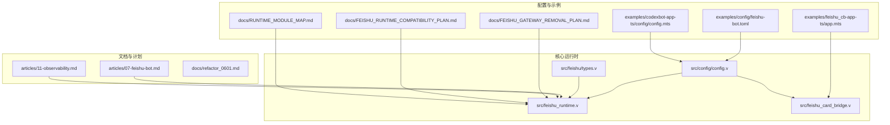
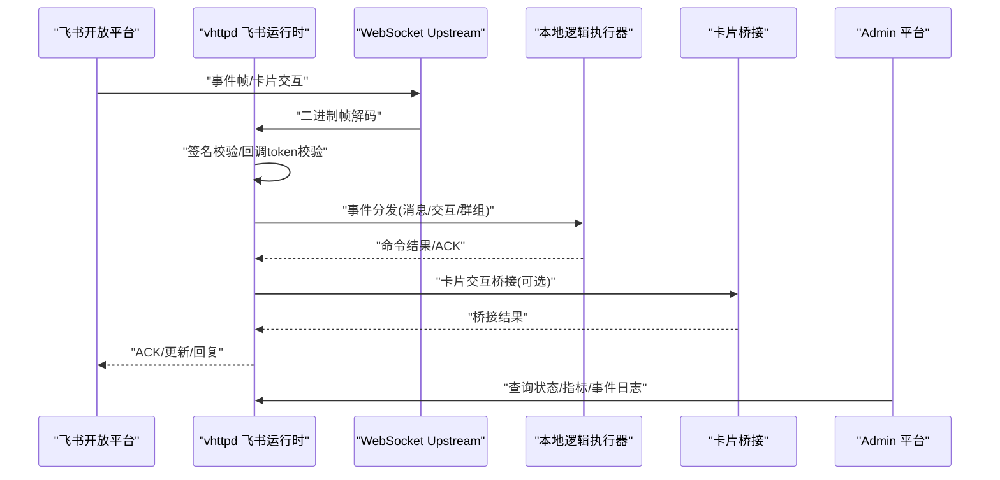
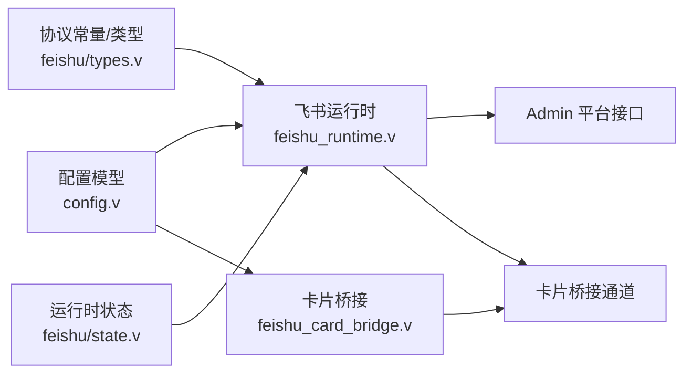
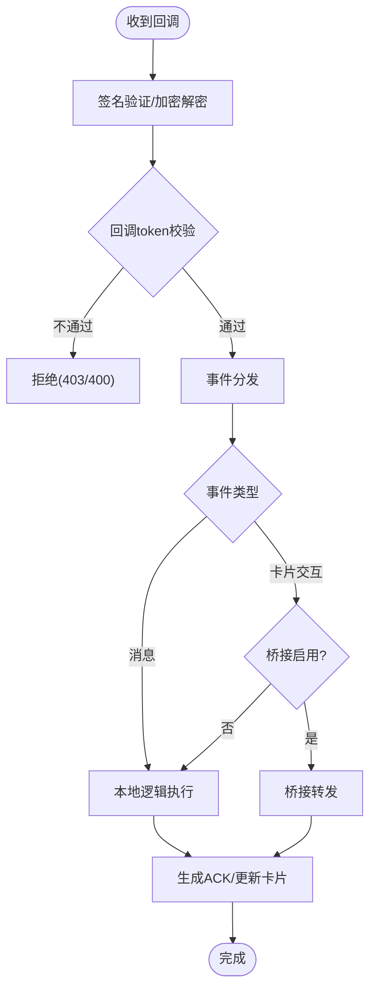

# 飞书运行时配置

<cite>
**本文引用的文件**
- [feishu-bot.toml](file://examples/config/feishu-bot.toml)
- [config.v](file://src/config/config.v)
- [feishu_runtime.v](file://src/feishu_runtime.v)
- [feishu_card_bridge.v](file://src/feishu_card_bridge.v)
- [feishu/types.v](file://src/feishu/types.v)
- [helpers.v](file://src/feishu/helpers.v)
- [state.v](file://src/feishu/state.v)
- [app.mts](file://examples/feishu_cb-app-ts/app.mts)
- [config.mts](file://examples/codexbot-app-ts/config/config.mts)
- [07-feishu-bot.md](file://articles/07-feishu-bot.md)
- [11-observability.md](file://articles/11-observability.md)
- [FEISHU_GATEWAY_REMOVAL_PLAN.md](file://docs/FEISHU_GATEWAY_REMOVAL_PLAN.md)
- [FEISHU_RUNTIME_COMPATIBILITY_PLAN.md](file://docs/FEISHU_RUNTIME_COMPATIBILITY_PLAN.md)
- [RUNTIME_MODULE_MAP.md](file://docs/RUNTIME_MODULE_MAP.md)
</cite>

## 更新摘要
**变更内容**
- 更新了类型别名清理的影响：移除了大量未使用的类型别名（如 FeishuRuntimeProtoHeader、FeishuRuntimeProtoFrame、FeishuRuntimeSendMessageRequest 等16个类型别名）
- 更新了函数签名使用直接的 feishu 包类型而非包装类型
- 反映了飞书运行时命名迁移的最终状态（feishu_gateway → feishu_runtime）

## 目录
1. [简介](#简介)
2. [项目结构](#项目结构)
3. [核心组件](#核心组件)
4. [架构总览](#架构总览)
5. [详细组件分析](#详细组件分析)
6. [依赖关系分析](#依赖关系分析)
7. [性能考虑](#性能考虑)
8. [故障排除指南](#故障排除指南)
9. [结论](#结论)
10. [附录](#附录)

## 简介
本文面向 vhttpd 飞书运行时配置，系统性阐述飞书机器人的配置选项、卡片桥接参数、事件处理规则、安全配置以及监控运维指标。内容基于仓库中的 TOML 配置、源码实现与官方文章，帮助读者快速搭建并安全运维飞书机器人。

**更新** 本版本反映了代码清理中移除的类型别名和函数签名更新，现在直接使用 `feishu` 包中的原生类型。

## 项目结构
围绕飞书运行时的关键文件与目录如下：
- 配置示例：examples/config/feishu-bot.toml
- 飞书运行时实现：src/feishu_runtime.v
- 卡片桥接实现：src/feishu_card_bridge.v
- 飞书协议常量与类型：src/feishu/types.v
- 配置模型定义：src/config/config.v
- 飞书卡片回调示例应用：examples/feishu_cb-app-ts/app.mts
- 飞书默认配置读取：examples/codexbot-app-ts/config/config.mts
- 飞书机器人实战文章：articles/07-feishu-bot.md
- 可观测性与监控文章：articles/11-observability.md
- 飞书运行时命名迁移计划：docs/FEISHU_GATEWAY_REMOVAL_PLAN.md
- 飞书运行时兼容性计划：docs/FEISHU_RUNTIME_COMPATIBILITY_PLAN.md
- 运行时模块映射：docs/RUNTIME_MODULE_MAP.md

图表来源
- [feishu-bot.toml:1-40](file://examples/config/feishu-bot.toml#L1-L40)
- [config.v:146-163](file://src/config/config.v#L146-L163)
- [feishu_runtime.v:1-120](file://src/feishu_runtime.v#L1-L120)
- [feishu_card_bridge.v:1-120](file://src/feishu_card_bridge.v#L1-L120)
- [types.v:1-74](file://src/feishu/types.v#L1-L74)
- [state.v:1-100](file://src/feishu/state.v#L1-L100)
- [app.mts:1-120](file://examples/feishu_cb-app-ts/app.mts#L1-L120)
- [config.mts:34-77](file://examples/codexbot-app-ts/config/config.mts#L34-L77)
- [07-feishu-bot.md:50-110](file://articles/07-feishu-bot.md#L50-L110)
- [11-observability.md:272-468](file://articles/11-observability.md#L272-L468)
- [FEISHU_GATEWAY_REMOVAL_PLAN.md:54-95](file://docs/FEISHU_GATEWAY_REMOVAL_PLAN.md#L54-L95)
- [FEISHU_RUNTIME_COMPATIBILITY_PLAN.md:1-65](file://docs/FEISHU_RUNTIME_COMPATIBILITY_PLAN.md#L1-L65)
- [RUNTIME_MODULE_MAP.md:219-261](file://docs/RUNTIME_MODULE_MAP.md#L219-L261)

章节来源
- [feishu-bot.toml:1-40](file://examples/config/feishu-bot.toml#L1-L40)
- [config.v:146-163](file://src/config/config.v#L146-L163)
- [feishu_runtime.v:1-120](file://src/feishu_runtime.v#L1-L120)
- [feishu_card_bridge.v:1-120](file://src/feishu_card_bridge.v#L1-L120)
- [types.v:1-74](file://src/feishu/types.v#L1-L74)
- [state.v:1-100](file://src/feishu/state.v#L1-L100)
- [app.mts:1-120](file://examples/feishu_cb-app-ts/app.mts#L1-L120)
- [config.mts:34-77](file://examples/codexbot-app-ts/config/config.mts#L34-L77)
- [07-feishu-bot.md:50-110](file://articles/07-feishu-bot.md#L50-L110)
- [11-observability.md:272-468](file://articles/11-observability.md#L272-L468)
- [FEISHU_GATEWAY_REMOVAL_PLAN.md:54-95](file://docs/FEISHU_GATEWAY_REMOVAL_PLAN.md#L54-L95)
- [FEISHU_RUNTIME_COMPATIBILITY_PLAN.md:1-65](file://docs/FEISHU_RUNTIME_COMPATIBILITY_PLAN.md#L1-L65)
- [RUNTIME_MODULE_MAP.md:219-261](file://docs/RUNTIME_MODULE_MAP.md#L219-L261)

## 核心组件
- 飞书配置模型：定义 enabled、open_base_url、reconnect_delay_ms、token_refresh_skew_seconds、recent_event_limit、apps、bridge 等字段。
- 飞书应用配置：app_id、app_secret、verification_token、encrypt_key。
- 飞书运行时：负责与飞书开放平台建立 WebSocket 连接、事件接收与分发、消息发送与更新、卡片流式渲染、心跳与重连。
- 卡片桥接：支持本地/远程双向通信，转发卡片交互事件到本地或远端执行器，并支持心跳保活。
- 安全校验：回调签名验证、加密解密、回调 token 校验。
- 监控与可观测性：Admin 平台接口、事件日志、指标导出、日志轮转。

**更新** 类型别名已清理，现在直接使用 `feishu` 包中的类型，如 `feishu.RuntimeProtoHeader`、`feishu.RuntimeProtoFrame` 等。

章节来源
- [config.v:146-163](file://src/config/config.v#L146-L163)
- [config.v:374-416](file://src/config/config.v#L374-L416)
- [feishu_runtime.v:302-356](file://src/feishu_runtime.v#L302-L356)
- [feishu_card_bridge.v:118-120](file://src/feishu_card_bridge.v#L118-L120)
- [types.v:17-34](file://src/feishu/types.v#L17-L34)
- [types.v:218-233](file://src/feishu/types.v#L218-L233)

## 架构总览
vhttpd 通过 WebSocket upstream 与飞书开放平台连接，自动处理认证、事件路由与消息发送。飞书回调通过签名校验后进入统一事件分发，支持本地逻辑执行与卡片桥接转发。

**更新** 架构现在使用直接的 `feishu` 包类型，不再依赖中间类型别名层。

图表来源
- [feishu_runtime.v:1000-1191](file://src/feishu_runtime.v#L1000-L1191)
- [feishu_runtime.v:1243-1458](file://src/feishu_runtime.v#L1243-L1458)
- [feishu_card_bridge.v:530-577](file://src/feishu_card_bridge.v#L530-L577)
- [feishu_card_bridge.v:730-769](file://src/feishu_card_bridge.v#L730-L769)

章节来源
- [feishu_runtime.v:1000-1191](file://src/feishu_runtime.v#L1000-L1191)
- [feishu_runtime.v:1243-1458](file://src/feishu_runtime.v#L1243-L1458)
- [feishu_card_bridge.v:530-577](file://src/feishu_card_bridge.v#L530-L577)
- [feishu_card_bridge.v:730-769](file://src/feishu_card_bridge.v#L730-L769)

## 详细组件分析

### 飞书机器人配置选项
- 基础开关与端点
  - enabled：启用飞书集成
  - open_base_url：飞书开放平台基础 URL，默认 https://open.feishu.cn/open-apis
  - reconnect_delay_ms：断线重连延迟
  - token_refresh_skew_seconds：token 刷新提前量（秒）
  - recent_event_limit：最近事件缓存上限
- 应用配置
  - app_id、app_secret：应用凭证（建议从环境变量注入）
  - verification_token：回调 token 校验
  - encrypt_key：回调加密密钥（用于 AES-CBC 解密）
- 多实例支持
  - [feishu.main]、[feishu.<name>] 支持多应用实例，分别配置 app_id/app_secret/verification_token/encrypt_key

**更新** 配置结构保持不变，但内部实现现在直接使用 `feishu` 包类型。

章节来源
- [feishu-bot.toml:28-40](file://examples/config/feishu-bot.toml#L28-L40)
- [config.v:146-163](file://src/config/config.v#L146-L163)
- [config.v:374-416](file://src/config/config.v#L374-L416)
- [config.mts:66-69](file://examples/codexbot-app-ts/config/config.mts#L66-L69)

### 飞书卡片桥接配置参数
- 本地桥接开关与目标
  - enabled：启用卡片桥接
  - ws_url：桥接服务器 WebSocket 地址
  - client_id：客户端标识（可从环境变量 VHTTPD_FEISHU_CARD_BRIDGE_CLIENT_ID 注入）
  - token：鉴权令牌（可从环境变量 VHTTPD_FEISHU_CARD_BRIDGE_TOKEN 注入）
  - target_id：目标运行时实例标识（默认等于 client_id）
- 本地桥接服务端
  - /bridge/ws：WebSocket 服务端，校验 client_id 与 token
  - /gateway/bridge/dispatch：网关入口，触发本地回调分发
- 远程桥接客户端
  - run_feishu_card_bridge_client：自动连接 ws_url，附加 client_id 与 token 查询参数
  - 心跳保活：定时发送心跳帧，接收 PONG

**更新** 桥接配置参数保持不变，但内部类型现在直接使用 `feishu` 包中的 `BridgeProxyResult` 类型。

章节来源
- [config.v:215-222](file://src/config/config.v#L215-L222)
- [feishu_card_bridge.v:95-116](file://src/feishu_card_bridge.v#L95-L116)
- [feishu_card_bridge.v:530-577](file://src/feishu_card_bridge.v#L530-L577)
- [feishu_card_bridge.v:730-769](file://src/feishu_card_bridge.v#L730-L769)

### 飞书运行时事件处理配置
- 事件类型识别
  - im.message.receive_v1：消息事件
  - card.action.trigger：卡片交互事件
  - 其他群组/会话事件由协议常量与事件快照识别
- 事件路由
  - 本地逻辑执行器：根据 event_kind/event_type 分发到命令总线
  - 卡片桥接：对 card.action.trigger 事件可转发至本地运行时目标
- 流式卡片渲染
  - 消息缓冲与预览刷新：400ms 刷新周期
  - 分段卡片：超过阈值自动分段发送
  - 完整卡片：finish 时合并并发送最终卡片

**更新** 事件处理现在直接使用 `feishu` 包中的 `RuntimeProtoFrame` 和 `RuntimeEventSnapshot` 类型。

章节来源
- [types.v:17-34](file://src/feishu/types.v#L17-L34)
- [feishu_runtime.v:1000-1191](file://src/feishu_runtime.v#L1000-L1191)
- [feishu_runtime.v:839-895](file://src/feishu_runtime.v#L839-L895)
- [feishu_runtime.v:897-998](file://src/feishu_runtime.v#L897-L998)

### 飞书集成安全配置
- 回调签名验证
  - x-lark-signature/x-lark-request-signature：基于时间戳、随机数、密钥与原始负载计算 SHA-256
  - 未提供签名但存在 encrypt_key 时视为无效
- 加密解密
  - encrypt 字段存在时，使用 AES-CBC 解密负载
  - 密钥为 encrypt_key 的 SHA-256，IV 为密钥前 16 字节
- 回调 token 校验
  - verification_token 非空时，payload 中 token 必须匹配
- Admin 平台鉴权
  - /admin/* 接口需要管理员令牌

**更新** 安全配置保持不变，但内部实现现在直接使用 `feishu` 包中的类型和常量。

章节来源
- [feishu_runtime.v:1277-1316](file://src/feishu_runtime.v#L1277-L1316)
- [feishu_runtime.v:1346-1380](file://src/feishu_runtime.v#L1346-L1380)
- [types.v:17-34](file://src/feishu/types.v#L17-L34)
- [app.mts:49-95](file://examples/feishu_cb-app-ts/app.mts#L49-L95)

### 飞书运行时监控配置
- Admin 平台接口
  - GET /admin/runtime/feishu：飞书运行时快照
  - GET /admin/runtime/feishu/chats：群聊列表与统计
  - POST /admin/runtime/feishu/messages：直接发送消息
- 事件日志
  - 配置 files.event_log，输出 NDJSON 格式事件
  - 包含上游连接、错误、请求等事件
- 指标导出与日志级别
  - /admin/metrics：Prometheus 文本格式指标端点
  - VHTTPD_LOG_FORMAT=json：结构化日志
  - VHTTPD_LOG_LEVEL_*：模块级日志级别控制
- 日志轮转
  - 建议使用 logrotate 或外部工具进行轮转与归档

**更新** 监控配置保持不变，但内部实现现在直接使用 `feishu` 包中的 `RuntimeSnapshot` 和 `RuntimeChatSnapshot` 类型。

章节来源
- [feishu_runtime.v:1193-1241](file://src/feishu_runtime.v#L1193-L1241)
- [feishu_runtime.v:1460-1531](file://src/feishu_runtime.v#L1460-L1531)
- [11-observability.md:272-468](file://articles/11-observability.md#L272-L468)
- [FEISHU_GATEWAY_REMOVAL_PLAN.md:366-379](file://docs/FEISHU_GATEWAY_REMOVAL_PLAN.md#L366-L379)

## 依赖关系分析
飞书运行时与卡片桥接的依赖关系如下：

**更新** 依赖关系现在更加简洁，直接使用 `feishu` 包中的类型，移除了中间类型别名层。

图表来源
- [config.v:146-163](file://src/config/config.v#L146-L163)
- [feishu_runtime.v:1-120](file://src/feishu_runtime.v#L1-L120)
- [feishu_card_bridge.v:1-120](file://src/feishu_card_bridge.v#L1-L120)
- [types.v:1-74](file://src/feishu/types.v#L1-L74)
- [state.v:1-100](file://src/feishu/state.v#L1-L100)

章节来源
- [config.v:146-163](file://src/config/config.v#L146-L163)
- [feishu_runtime.v:1-120](file://src/feishu_runtime.v#L1-L120)
- [feishu_card_bridge.v:1-120](file://src/feishu_card_bridge.v#L1-L120)
- [types.v:1-74](file://src/feishu/types.v#L1-L74)
- [state.v:1-100](file://src/feishu/state.v#L1-L100)

## 性能考虑
- 心跳与重连
  - 通过 ping/pong 保持连接活跃，失败时按 reconnect_delay_ms 退避重连
- 消息发送与更新
  - 使用租户级 access token，自动刷新并带 skew 预留
  - 支持消息回复与交互卡片更新
- 流式卡片
  - 400ms 刷新窗口，避免频繁网络开销
  - 分段卡片避免超长消息一次性传输
- 并发与限流
  - worker 池与请求限制由 worker 配置控制
  - 事件队列与最近事件缓存受 recent_event_limit 控制

**更新** 性能考虑保持不变，但内部实现现在更加高效，因为移除了类型别名层的额外开销。

章节来源
- [feishu_runtime.v:394-415](file://src/feishu_runtime.v#L394-L415)
- [feishu_runtime.v:458-493](file://src/feishu_runtime.v#L458-L493)
- [feishu_runtime.v:839-895](file://src/feishu_runtime.v#L839-L895)
- [config.v:146-163](file://src/config/config.v#L146-L163)

## 故障排除指南
- 回调 403/400
  - 检查 x-lark-signature 是否正确，encrypt_key 是否配置
  - verification_token 是否与 payload 中 token 匹配
- 连接失败
  - 检查 open_base_url、reconnect_delay_ms
  - 确认 app_id/app_secret 正确且未过期
- 卡片交互无响应
  - 确认 /bridge/ws 已鉴权（client_id/token）
  - 检查本地逻辑执行器是否处理 card.action.trigger
- 指标与日志
  - 使用 /admin/runtime/feishu 与 /admin/runtime/feishu/chats 检查状态
  - 查看 files.event_log 定位异常事件

**更新** 故障排除指南保持不变，但内部错误处理现在更加直接，因为移除了类型别名层。

章节来源
- [feishu_runtime.v:1277-1316](file://src/feishu_runtime.v#L1277-L1316)
- [feishu_runtime.v:1346-1380](file://src/feishu_runtime.v#L1346-L1380)
- [feishu_card_bridge.v:756-769](file://src/feishu_card_bridge.v#L756-L769)
- [11-observability.md:272-468](file://articles/11-observability.md#L272-L468)

## 结论
vhttpd 提供了完整的飞书机器人运行时：从配置、安全校验、事件路由到卡片桥接与可观测性，均可通过配置文件与 Admin 平台进行统一管理。**更新** 最新的代码清理移除了大量未使用的类型别名，现在直接使用 `feishu` 包中的原生类型，使代码更加简洁高效。建议在生产环境中启用回调签名与加密、配置合理的重连与刷新参数，并结合 Admin 指标与事件日志进行持续监控。

## 附录

### 飞书回调与卡片交互流程

图表来源
- [feishu_runtime.v:1243-1458](file://src/feishu_runtime.v#L1243-L1458)
- [feishu_card_bridge.v:264-315](file://src/feishu_card_bridge.v#L264-L315)

### 飞书运行时命名迁移状态
**新增** 飞书运行时命名迁移已完成，所有 `feishu_gateway_*` 符号已迁移到 `feishu_runtime_*`：

- **结构类型**：`FeishuGateway*` → `FeishuRuntime*`（22个类型）
- **函数**：`feishu_gateway_*` → `feishu_runtime_*`（所有函数）
- **常量**：`feishu_gateway_*` → `feishu_runtime_*`（所有常量）
- **应用方法**：`admin_feishu_gateway_chats_snapshot` → `feishu_runtime_chats_snapshot`
- **删除的别名**：8个自引用包装器、13个重复常量别名、3个重复包装函数

章节来源
- [FEISHU_GATEWAY_REMOVAL_PLAN.md:54-95](file://docs/FEISHU_GATEWAY_REMOVAL_PLAN.md#L54-L95)
- [FEISHU_RUNTIME_COMPATIBILITY_PLAN.md:1-65](file://docs/FEISHU_RUNTIME_COMPATIBILITY_PLAN.md#L1-L65)