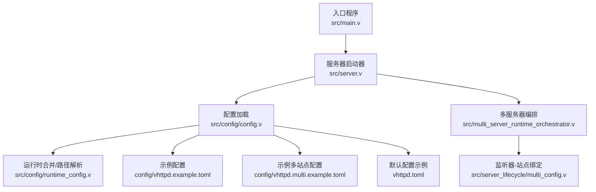
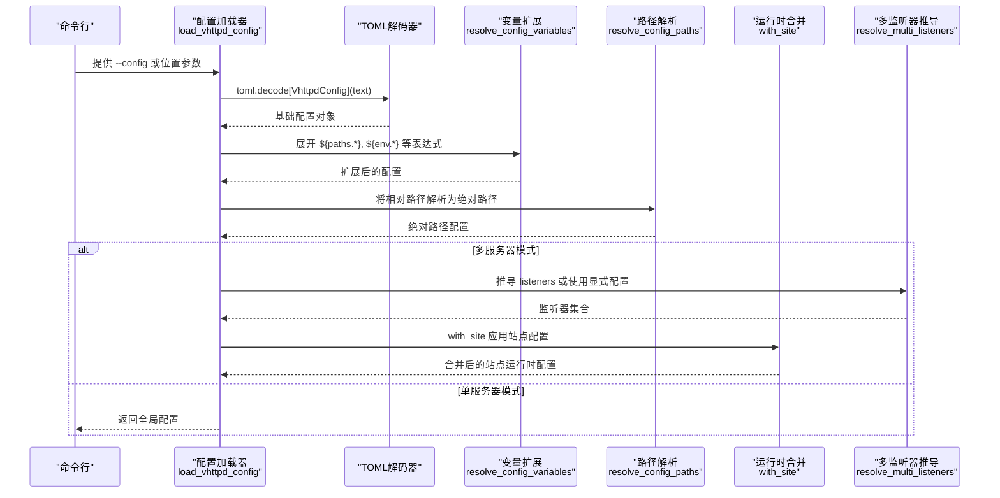
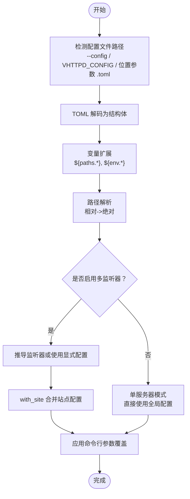
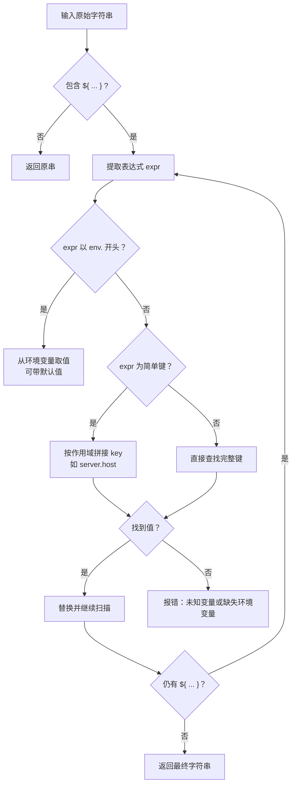
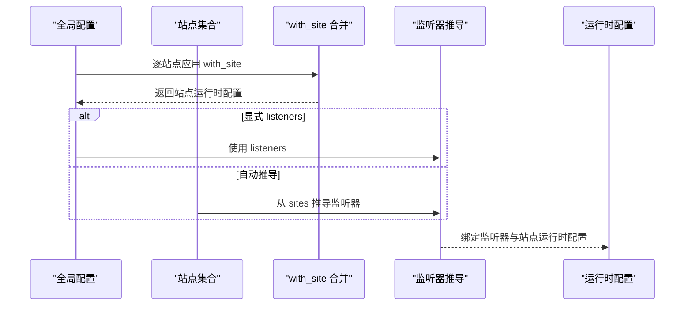
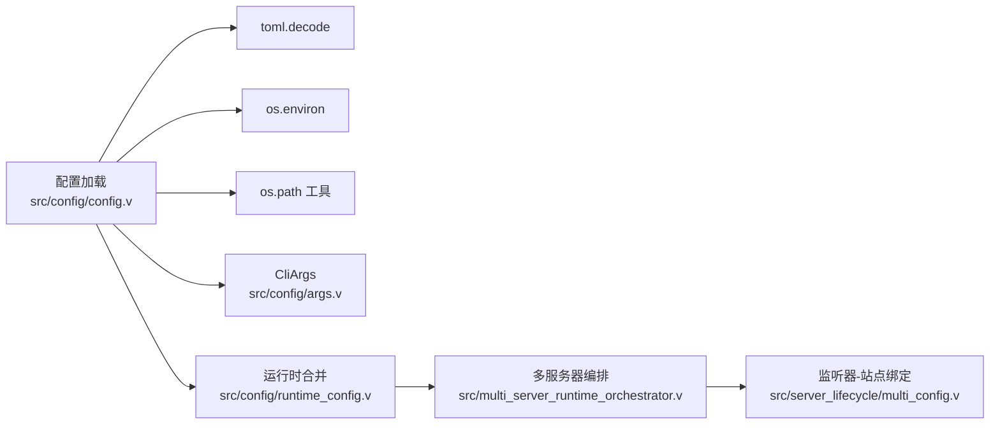

# 配置加载机制

<cite>
**本文档引用的文件**
- [src/config/config.v](file://src/config/config.v)
- [src/config/args.v](file://src/config/args.v)
- [src/config/runtime_config.v](file://src/config/runtime_config.v)
- [vhttpd.toml](file://vhttpd.toml)
- [config/vhttpd.example.toml](file://config/vhttpd.example.toml)
- [config/vhttpd.multi.example.toml](file://config/vhttpd.multi.example.toml)
- [src/main.v](file://src/main.v)
- [src/server.v](file://src/server.v)
- [src/multi_server_runtime_orchestrator.v](file://src/multi_server_runtime_orchestrator.v)
- [src/server_lifecycle/multi_config.v](file://src/server_lifecycle/multi_config.v)
- [src/server_logic_test.v](file://src/server_logic_test.v)
</cite>

## 目录
1. [简介](#简介)
2. [项目结构](#项目结构)
3. [核心组件](#核心组件)
4. [架构总览](#架构总览)
5. [详细组件分析](#详细组件分析)
6. [依赖关系分析](#依赖关系分析)
7. [性能考量](#性能考量)
8. [故障排查指南](#故障排查指南)
9. [结论](#结论)
10. [附录](#附录)

## 简介
本文档系统性阐述 vhttpd 的配置加载机制，覆盖从 TOML 解析、路径解析、变量扩展、环境变量注入到优先级合并策略；解释多服务器配置的加载与分片、分布式配置管理思路；提供配置验证与错误处理细节，并讨论配置热重载的实现原理与使用注意事项，最后给出调试技巧与常见问题排查方法。

## 项目结构
vhttpd 将配置加载集中在 config 模块，配合运行时生命周期模块完成多服务器场景下的配置分片与合并。入口主程序负责启动单机或集群模式。

**图表来源**
- [src/main.v:1-200](file://src/main.v#L1-L200)
- [src/server.v:149-201](file://src/server.v#L149-L201)
- [src/config/config.v:313-352](file://src/config/config.v#L313-L352)
- [src/config/runtime_config.v:366-415](file://src/config/runtime_config.v#L366-L415)
- [src/multi_server_runtime_orchestrator.v:24-56](file://src/multi_server_runtime_orchestrator.v#L24-L56)
- [src/server_lifecycle/multi_config.v:19-80](file://src/server_lifecycle/multi_config.v#L19-L80)

**章节来源**
- [src/main.v:1-200](file://src/main.v#L1-L200)
- [src/server.v:149-201](file://src/server.v#L149-L201)
- [src/config/config.v:313-352](file://src/config/config.v#L313-L352)
- [src/config/runtime_config.v:366-415](file://src/config/runtime_config.v#L366-L415)
- [src/multi_server_runtime_orchestrator.v:24-56](file://src/multi_server_runtime_orchestrator.v#L24-L56)
- [src/server_lifecycle/multi_config.v:19-80](file://src/server_lifecycle/multi_config.v#L19-L80)

## 核心组件
- 配置模型与解析：定义了 VhttpdConfig 及其子结构（ServerConfig、PathsConfig、WorkerConfig、SiteConfig 等），并通过 toml.decode 与手工解析函数完成 TOML 到结构体的映射。
- 变量扩展与路径解析：支持 `${paths.*}`、`${env.*}`、`${server.*}` 等表达式，循环展开并最终将相对路径解析为绝对路径。
- 运行时合并与优先级：提供 merge 方法族，用于全局配置与站点配置的合并；with_site 将站点配置注入到全局配置副本中。
- 多服务器配置：支持 listeners 与 sites 分离声明，自动推导监听器或按站点构建监听器，实现配置分片与分布式管理。
- CLI 参数与环境变量：通过 CliArgs 辅助函数解析命令行键值、布尔、列表等参数，作为配置回退或覆盖来源。
- 错误处理：在变量解析、路径解析、多监听器校验等环节返回结构化错误，便于定位问题。

**章节来源**
- [src/config/config.v:6-307](file://src/config/config.v#L6-L307)
- [src/config/config.v:313-352](file://src/config/config.v#L313-L352)
- [src/config/config.v:1122-1383](file://src/config/config.v#L1122-L1383)
- [src/config/config.v:1415-1456](file://src/config/config.v#L1415-L1456)
- [src/config/runtime_config.v:366-415](file://src/config/runtime_config.v#L366-L415)
- [src/config/args.v:1-90](file://src/config/args.v#L1-L90)

## 架构总览
下图展示从命令行到最终运行时配置的关键流程：解析配置文件 → 变量扩展 → 路径解析 → 多监听器推导 → 合并与优先级应用。

**图表来源**
- [src/config/config.v:313-352](file://src/config/config.v#L313-L352)
- [src/config/config.v:1122-1383](file://src/config/config.v#L1122-L1383)
- [src/config/config.v:1415-1456](file://src/config/config.v#L1415-L1456)
- [src/config/runtime_config.v:366-415](file://src/config/runtime_config.v#L366-L415)
- [src/config/runtime_config.v:417-439](file://src/config/runtime_config.v#L417-L439)

## 详细组件分析

### 配置文件解析与优先级
- 配置来源顺序（从高到低）：
  1) 命令行参数（通过 CliArgs 解析，如 --worker-pool-size、--worker-socket 等）
  2) 环境变量（${env.VAR} 表达式）
  3) 配置文件（TOML 文件）
- 具体优先级体现：
  - 运行时合并：with_site 将站点配置合并入全局配置副本，站点字段覆盖全局同名字段。
  - 多监听器：若未显式配置 listeners，则根据 sites 自动生成监听器；否则以 listeners 为准。
  - 路径解析：先进行变量扩展，再将相对路径解析为绝对路径，确保跨平台一致性。

**图表来源**
- [src/config/config.v:313-352](file://src/config/config.v#L313-L352)
- [src/config/config.v:1122-1383](file://src/config/config.v#L1122-L1383)
- [src/config/config.v:1415-1456](file://src/config/config.v#L1415-L1456)
- [src/config/runtime_config.v:366-415](file://src/config/runtime_config.v#L366-L415)
- [src/config/runtime_config.v:417-439](file://src/config/runtime_config.v#L417-L439)

**章节来源**
- [src/config/config.v:313-352](file://src/config/config.v#L313-L352)
- [src/config/config.v:1122-1383](file://src/config/config.v#L1122-L1383)
- [src/config/config.v:1415-1456](file://src/config/config.v#L1415-L1456)
- [src/config/runtime_config.v:366-415](file://src/config/runtime_config.v#L366-L415)
- [src/config/runtime_config.v:417-439](file://src/config/runtime_config.v#L417-L439)

### 变量扩展与路径解析
- 变量表达式语法：
  - `${paths.root}`、`${server.host}`、`${env.VAR}`、`${env.VAR:-default}` 等
  - 支持默认值语法，当环境变量缺失时回退默认值
- 循环展开：
  - 最大迭代次数限制（防止循环引用），逐轮展开直到无变化
- 路径解析：
  - 将相对路径基于配置文件所在目录或 paths.root 解析为绝对路径
  - 规范化路径结尾斜杠，保证跨平台兼容

**图表来源**
- [src/config/config.v:1544-1569](file://src/config/config.v#L1544-L1569)
- [src/config/config.v:1581-1629](file://src/config/config.v#L1581-L1629)
- [src/config/config.v:1404-1413](file://src/config/config.v#L1404-L1413)

**章节来源**
- [src/config/config.v:1544-1569](file://src/config/config.v#L1544-L1569)
- [src/config/config.v:1581-1629](file://src/config/config.v#L1581-L1629)
- [src/config/config.v:1404-1413](file://src/config/config.v#L1404-L1413)

### 多服务器配置加载机制
- 配置分片：
  - 全局配置（paths、server、files、runtime 等）与各站点配置（sites.<id>）分离
  - with_site 将站点配置合并入全局配置副本，形成独立的站点运行时配置
- 监听器推导：
  - 若未显式配置 listeners，且存在 sites，则根据 sites 自动推导监听器（host/port/site）
  - 若显式配置 listeners，则严格按 listeners 定义启动
- 站点路径与变量：
  - 站点 root/project_root 会触发 paths.root 的重定向，确保路径解析正确
  - 站点内变量（如 ${paths.*}）在 with_site 合并阶段展开

**图表来源**
- [src/config/runtime_config.v:366-415](file://src/config/runtime_config.v#L366-L415)
- [src/config/runtime_config.v:417-439](file://src/config/runtime_config.v#L417-L439)
- [src/server_lifecycle/multi_config.v:19-80](file://src/server_lifecycle/multi_config.v#L19-L80)

**章节来源**
- [src/config/runtime_config.v:366-415](file://src/config/runtime_config.v#L366-L415)
- [src/config/runtime_config.v:417-439](file://src/config/runtime_config.v#L417-L439)
- [src/server_lifecycle/multi_config.v:19-80](file://src/server_lifecycle/multi_config.v#L19-L80)

### 配置验证与错误处理
- 变量扩展错误：
  - 缺失环境变量、空表达式、缺少闭合括号等均会返回明确错误
- 路径解析错误：
  - 循环引用导致的最大迭代次数耗尽
- 多监听器校验：
  - 缺少站点、未知站点、重复绑定等错误
- 运行时校验建议（现状与改进建议）：
  - 当前在 load_vhttpd_config 后进行 validate_config 阶段，检查互斥项、端口冲突、路径可写性等，尽早失败并提供清晰错误信息

**章节来源**
- [src/config/config.v:1581-1629](file://src/config/config.v#L1581-L1629)
- [src/config/config.v:1382](file://src/config/config.v#L1382)
- [src/server_lifecycle/multi_config.v:33-61](file://src/server_lifecycle/multi_config.v#L33-L61)
- [docs/refactor_0601.md:71-84](file://docs/refactor_0601.md#L71-L84)

### 配置热重载实现原理与使用注意事项
- 热重载能力来源：
  - 配置热重载通常通过监听配置文件变更并重新加载配置实现
  - 在 vhttpd 中，可通过 RPC 或内部机制触发“热重载”动作，更新线程内的用户配置
- 使用注意事项：
  - 确保配置文件路径正确且可写
  - 注意变量表达式与环境变量的变更不会自动生效，需重启或触发重载
  - 多服务器模式下，需针对目标站点或监听器执行重载

[本节为通用指导，不直接分析具体文件]

## 依赖关系分析
- 配置加载依赖：
  - toml 解码器：将 TOML 文本转换为结构体
  - os.environ：提供环境变量注入
  - os.path 工具：路径规范化与绝对化
- 运行时依赖：
  - 多服务器编排依赖监听器-站点绑定逻辑
  - CLI 参数解析辅助工具

**图表来源**
- [src/config/config.v:313-352](file://src/config/config.v#L313-L352)
- [src/config/args.v:1-90](file://src/config/args.v#L1-L90)
- [src/config/runtime_config.v:366-415](file://src/config/runtime_config.v#L366-L415)
- [src/multi_server_runtime_orchestrator.v:24-56](file://src/multi_server_runtime_orchestrator.v#L24-L56)
- [src/server_lifecycle/multi_config.v:19-80](file://src/server_lifecycle/multi_config.v#L19-L80)

**章节来源**
- [src/config/config.v:313-352](file://src/config/config.v#L313-L352)
- [src/config/args.v:1-90](file://src/config/args.v#L1-L90)
- [src/config/runtime_config.v:366-415](file://src/config/runtime_config.v#L366-L415)
- [src/multi_server_runtime_orchestrator.v:24-56](file://src/multi_server_runtime_orchestrator.v#L24-L56)
- [src/server_lifecycle/multi_config.v:19-80](file://src/server_lifecycle/multi_config.v#L19-L80)

## 性能考量
- 变量扩展的复杂度：
  - 字符串扫描与替换为 O(n) 级别，最大迭代次数限制避免无限循环
- 路径解析：
  - 绝对化与连接操作为 O(k)（k 为路径段数），整体影响较小
- 多服务器场景：
  - with_site 对每个站点复制并合并配置，内存占用与 CPU 时间随站点数量线性增长
- 建议：
  - 控制站点数量与路径层级，避免过深的嵌套变量链
  - 使用显式 listeners 减少自动推导成本

[本节为通用指导，不直接分析具体文件]

## 故障排查指南
- 常见错误与定位：
  - 变量未定义：检查 `${paths.*}`、`${env.*}` 是否正确拼写与提供
  - 环境变量缺失：确认环境变量已设置或提供默认值
  - 循环引用：检查变量表达式链，避免相互依赖
  - 多监听器错误：核对 listeners 与 sites 的对应关系，避免重复绑定
- 调试技巧：
  - 启用详细日志，观察变量扩展与路径解析结果
  - 使用最小化配置文件逐步添加字段，定位问题来源
  - 在测试用例中模拟配置加载流程，验证边界条件

**章节来源**
- [src/config/config.v:1581-1629](file://src/config/config.v#L1581-L1629)
- [src/config/config.v:1382](file://src/config/config.v#L1382)
- [src/server_lifecycle/multi_config.v:33-61](file://src/server_lifecycle/multi_config.v#L33-L61)
- [src/server_logic_test.v:322-345](file://src/server_logic_test.v#L322-L345)

## 结论
vhttpd 的配置加载机制以 TOML 为中心，结合变量扩展、路径解析与运行时合并，实现了灵活而强大的配置管理。多服务器模式通过监听器-站点绑定实现配置分片与分布式管理。建议在生产环境中增加结构化校验层与更完善的错误分类体系，以提升稳定性与可观测性。

## 附录
- 示例配置参考：
  - 单实例示例：[vhttpd.toml](file://vhttpd.toml)
  - 单实例模板：[config/vhttpd.example.toml](file://config/vhttpd.example.toml)
  - 多站点模板：[config/vhttpd.multi.example.toml](file://config/vhttpd.multi.example.toml)
- 关键实现参考：
  - 配置加载与变量扩展：[src/config/config.v](file://src/config/config.v)
  - 运行时合并与路径解析：[src/config/runtime_config.v](file://src/config/runtime_config.v)
  - 多服务器编排与监听器绑定：[src/multi_server_runtime_orchestrator.v](file://src/multi_server_runtime_orchestrator.v)、[src/server_lifecycle/multi_config.v](file://src/server_lifecycle/multi_config.v)
  - CLI 参数解析：[src/config/args.v](file://src/config/args.v)