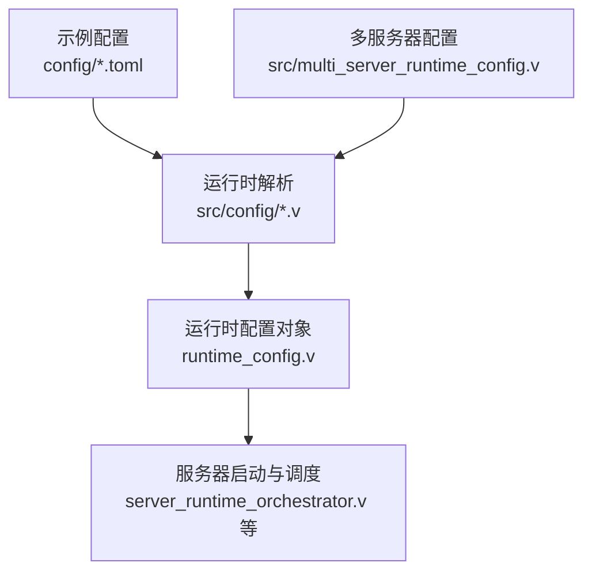
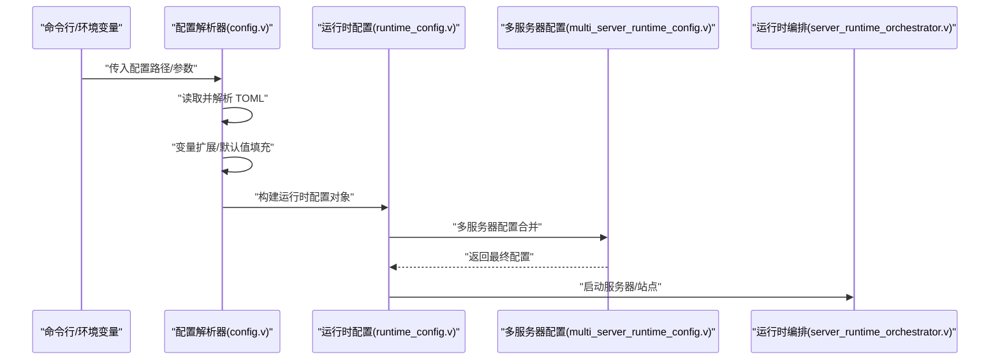
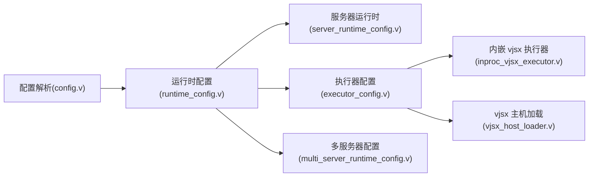

# 配置管理

<cite>
**本文引用的文件**
- [vhttpd.example.toml](file://config/vhttpd.example.toml)
- [vhttpd.multi.example.toml](file://config/vhttpd.multi.example.toml)
- [vhttpd.vjsx.example.toml](file://config/vhttpd.vjsx.example.toml)
- [config.v](file://src/config/config.v)
- [runtime_config.v](file://src/config/runtime_config.v)
- [embedded_host.v](file://src/config/embedded_host.v)
- [multi_server_runtime_config.v](file://src/multi_server_runtime_config.v)
- [args.v](file://src/config/args.v)
- [SITE_CONFIG_DSL.md](file://docs/SITE_CONFIG_DSL.md)
- [EXECUTOR_MODES.md](file://docs/EXECUTOR_MODES.md)
- [MCP.md](file://docs/MCP.md)
- [INPROC_VJSX_RUNBOOK.md](file://docs/INPROC_VJSX_RUNBOOK.md)
- [hello.toml](file://examples/config/hello.toml)
- [laravel.toml](file://examples/config/laravel.toml)
- [symfony.toml](file://examples/config/symfony.toml)
- [openai-gateway.toml](file://examples/config/openai-gateway.toml)
- [openai-gateway-dashscope-coding.toml](file://examples/config/openai-gateway-dashscope-coding.toml)
- [ai-stream.toml](file://examples/config/ai-stream.toml)
- [stream-dispatch.toml](file://examples/config/stream-dispatch.toml)
- [mcp.toml](file://examples/config/mcp.toml)
- [feishu-bot.toml](file://examples/config/feishu-bot.toml)
- [codexbot.toml](file://examples/codexbot-app/codexbot.toml)
- [codexbot-ts.toml](file://examples/codexbot-app-ts/codexbot.toml)
</cite>

## 目录
1. [简介](#简介)
2. [项目结构](#项目结构)
3. [核心组件](#核心组件)
4. [架构总览](#架构总览)
5. [详细组件分析](#详细组件分析)
6. [依赖关系分析](#依赖关系分析)
7. [性能考量](#性能考量)
8. [故障排查指南](#故障排查指南)
9. [结论](#结论)
10. [附录](#附录)

## 简介
本文件系统性阐述 vhttpd 的配置管理，覆盖 TOML 配置格式与语法规则、全局配置、站点配置、执行器配置与运行时配置的层次结构；提供完整配置项参考（server、worker、executor、php、vjsx、admin、assets、feishu、mcp 等）；解释配置加载顺序与优先级、变量扩展与环境变量注入；给出多监听器模式配置示例、站点 DSL 说明、不同执行器模式的配置差异；并提供最佳实践与常见问题排查方法。

## 项目结构
vhttpd 的配置体系由“示例配置”“运行时解析”“多服务器配置”三部分构成：
- 示例配置：位于 config/ 与 examples/config/，展示各类场景的 TOML 配置样例
- 运行时解析：src/config/ 下的模块负责解析 TOML 并生成运行时配置对象
- 多服务器配置：支持多监听器模式，通过独立配置或合并配置实现

图表来源
- [config.v](file://src/config/config.v)
- [runtime_config.v](file://src/config/runtime_config.v)
- [multi_server_runtime_config.v](file://src/multi_server_runtime_config.v)

章节来源
- [vhttpd.example.toml](file://config/vhttpd.example.toml)
- [vhttpd.multi.example.toml](file://config/vhttpd.multi.example.toml)
- [config.v](file://src/config/config.v)
- [runtime_config.v](file://src/config/runtime_config.v)
- [multi_server_runtime_config.v](file://src/multi_server_runtime_config.v)

## 核心组件
- 配置解析器：负责读取 TOML 文件、校验结构、应用默认值与变量扩展
- 运行时配置模型：将解析后的 TOML 映射为强类型结构，供运行时使用
- 多服务器配置编排：在多监听器模式下合并与分派配置
- 命令行参数与环境变量：作为配置加载的补充与覆盖

章节来源
- [config.v](file://src/config/config.v)
- [runtime_config.v](file://src/config/runtime_config.v)
- [args.v](file://src/config/args.v)
- [embedded_host.v](file://src/config/embedded_host.v)

## 架构总览
vhttpd 的配置加载流程如下：
- 读取命令行参数与环境变量
- 解析主配置文件（TOML）
- 应用默认值与变量扩展
- 根据多服务器配置进行合并
- 生成运行时配置对象，驱动服务启动与站点路由

图表来源
- [config.v](file://src/config/config.v)
- [runtime_config.v](file://src/config/runtime_config.v)
- [multi_server_runtime_config.v](file://src/multi_server_runtime_config.v)

## 详细组件分析

### TOML 配置格式与语法规则
- 使用 TOML 表与数组表组织层级
- 支持字符串、整数、布尔、数组、表等基础类型
- 支持注释与键名规范（小写、中划线、下划线）
- 建议使用显式类型与默认值，避免运行时缺省导致的歧义

章节来源
- [vhttpd.example.toml](file://config/vhttpd.example.toml)
- [vhttpd.multi.example.toml](file://config/vhttpd.multi.example.toml)

### 全局配置（Global）
- server：监听地址、端口、TLS、超时、并发限制等
- worker：工作进程数量、队列大小、空闲回收策略等
- admin：管理端口、鉴权、访问控制等
- assets：静态资源目录、缓存策略、压缩开关等
- 日志：日志级别、输出目标、轮转策略等

章节来源
- [vhttpd.example.toml](file://config/vhttpd.example.toml)
- [config.v](file://src/config/config.v)

### 站点配置（Site）
- 站点 DSL：定义路由前缀、上游、执行器绑定、中间件链、安全策略等
- 支持按域名/路径匹配，支持通配与正则
- 支持多站点共存与优先级排序

章节来源
- [SITE_CONFIG_DSL.md](file://docs/SITE_CONFIG_DSL.md)
- [laravel.toml](file://examples/config/laravel.toml)
- [symfony.toml](file://examples/config/symfony.toml)
- [hello.toml](file://examples/config/hello.toml)

### 执行器配置（Executor）
- executor：统一的执行器声明，可绑定到站点
- 支持多种执行器模式（如 PHP、vjsx 内嵌、逻辑执行器等）
- 可配置执行器生命周期、资源限制、热更新策略

章节来源
- [EXECUTOR_MODES.md](file://docs/EXECUTOR_MODES.md)
- [vjsx-host-loader.v](file://src/executor/vjsx_host_loader.v)
- [inproc_vjsx_executor.v](file://src/executor/inproc_vjsx_executor.v)

### 运行时配置（Runtime）
- 将解析后的 TOML 转换为运行时对象，供内核调度使用
- 包含服务器句柄、站点映射、执行器实例、上游连接池等
- 支持动态刷新与热重载（视具体模块）

章节来源
- [runtime_config.v](file://src/config/runtime_config.v)
- [server_runtime_config.v](file://src/server_runtime_config.v)

### 多监听器模式（Multi-Listener）
- 通过独立配置文件或合并配置实现多端口/多协议监听
- 每个监听器可绑定不同站点集合与执行器
- 支持负载均衡、健康检查与故障转移

章节来源
- [vhttpd.multi.example.toml](file://config/vhttpd.multi.example.toml)
- [multi_server_runtime_config.v](file://src/multi_server_runtime_config.v)

### 站点 DSL 详解
- 路由匹配：基于路径前缀、正则、方法等
- 上游代理：支持 HTTP/HTTPS、Unix Socket、内部通道
- 中间件：请求/响应拦截、鉴权、限流、日志
- 安全：CORS、HSTS、CSRF、速率限制
- 扩展：自定义处理器、插件化能力

章节来源
- [SITE_CONFIG_DSL.md](file://docs/SITE_CONFIG_DSL.md)
- [laravel.toml](file://examples/config/laravel.toml)
- [symfony.toml](file://examples/config/symfony.toml)

### 不同执行器模式的配置差异
- PHP 执行器：绑定 PHP 应用入口、运行时参数、内存限制
- vjsx 内嵌执行器：启用内嵌 vjsx 主机、脚本路径、权限与沙箱
- 逻辑执行器：声明业务逻辑处理函数、状态机与事件驱动

章节来源
- [EXECUTOR_MODES.md](file://docs/EXECUTOR_MODES.md)
- [vjsx-host-loader.v](file://src/executor/vjsx_host_loader.v)
- [inproc_vjsx_executor.v](file://src/executor/inproc_vjsx_executor.v)

### 配置加载顺序与优先级
- 命令行参数 > 环境变量 > 配置文件
- 多服务器模式下，监听器配置按序合并，后出现的键覆盖先出现的同名键
- 默认值在解析阶段填充，确保最小可用配置

章节来源
- [args.v](file://src/config/args.v)
- [embedded_host.v](file://src/config/embedded_host.v)
- [config.v](file://src/config/config.v)

### 变量扩展与环境变量注入
- 支持在 TOML 中引用环境变量（如 ${ENV_VAR}）
- 注入时机：解析阶段完成变量替换后再进行类型校验
- 建议对敏感变量使用环境注入，避免硬编码

章节来源
- [embedded_host.v](file://src/config/embedded_host.v)
- [config.v](file://src/config/config.v)

### 完整配置项参考（按模块）
- server
  - 监听地址与端口、TLS 证书与密钥、超时、并发限制、背压策略
- worker
  - 工作进程数、队列长度、空闲回收、信号处理
- executor
  - 执行器类型、脚本/二进制路径、运行时参数、资源上限
- php
  - PHP-FPM 地址、池配置、请求超时、错误日志
- vjsx
  - 内嵌主机启用、脚本根目录、权限白名单、沙箱策略
- admin
  - 管理端口、鉴权令牌、访问白名单、审计日志
- assets
  - 静态目录、缓存头、ETag、Gzip/Brotli、CDN 域名
- feishu
  - 企业机器人配置、回调地址、加密与签名、卡片模板
- mcp
  - 服务器发现、能力协商、凭据注入、流式传输策略

章节来源
- [vhttpd.example.toml](file://config/vhttpd.example.toml)
- [vjsx-host-loader.v](file://src/executor/vjsx_host_loader.v)
- [MCP.md](file://docs/MCP.md)

### 配置示例与场景
- Hello 应用：最简站点配置，演示路由与静态资源
- Laravel/Symfony：框架应用的站点 DSL 与上游代理
- OpenAI 网关：代理与聚合、流式传输、鉴权
- AI 流式与分发：长连接、事件分发、缓冲策略
- MCP：能力协商与上游集成
- 飞书机器人：回调、卡片、去重与会话管理
- Codex/CodexTS：复杂业务场景下的多模块协同

章节来源
- [hello.toml](file://examples/config/hello.toml)
- [laravel.toml](file://examples/config/laravel.toml)
- [symfony.toml](file://examples/config/symfony.toml)
- [openai-gateway.toml](file://examples/config/openai-gateway.toml)
- [openai-gateway-dashscope-coding.toml](file://examples/config/openai-gateway-dashscope-coding.toml)
- [ai-stream.toml](file://examples/config/ai-stream.toml)
- [stream-dispatch.toml](file://examples/config/stream-dispatch.toml)
- [mcp.toml](file://examples/config/mcp.toml)
- [feishu-bot.toml](file://examples/config/feishu-bot.toml)
- [codexbot.toml](file://examples/codexbot-app/codexbot.toml)
- [codexbot-ts.toml](file://examples/codexbot-app-ts/codexbot.toml)

## 依赖关系分析
- 配置解析依赖于 TOML 解析库与类型系统
- 运行时配置依赖于服务器与执行器模块
- 多服务器配置依赖于监听器与站点映射
- vjsx 内嵌执行器依赖于宿主签名与加载器

图表来源
- [config.v](file://src/config/config.v)
- [runtime_config.v](file://src/config/runtime_config.v)
- [multi_server_runtime_config.v](file://src/multi_server_runtime_config.v)
- [inproc_vjsx_executor.v](file://src/executor/inproc_vjsx_executor.v)
- [vjsx_host_loader.v](file://src/executor/vjsx_host_loader.v)

## 性能考量
- 合理设置 worker 数量与队列长度，避免过载与阻塞
- 对静态资源启用缓存与压缩，降低带宽与延迟
- 在多监听器模式下按流量特征拆分监听器，提升隔离度
- 执行器资源限制与回收策略应与业务峰值匹配
- 流式传输场景下注意缓冲区大小与背压策略

## 故障排查指南
- 配置语法错误：检查 TOML 语法与键名拼写，使用最小化配置逐步定位
- 端口占用与权限：确认监听端口可用与权限足够
- 环境变量未生效：检查变量名与注入位置，确认解析顺序
- 多监听器冲突：核对监听器绑定的站点集合，避免路由重复
- 执行器启动失败：检查路径、权限、依赖与资源限制
- vjsx 内嵌异常：核对主机签名、脚本路径与沙箱策略
- MCP 能力协商失败：检查凭据、能力列表与上游连通性

章节来源
- [config.v](file://src/config/config.v)
- [args.v](file://src/config/args.v)
- [embedded_host.v](file://src/config/embedded_host.v)

## 结论
vhttpd 的配置体系以 TOML 为核心，结合命令行与环境变量，形成灵活、可组合且可扩展的配置模型。通过清晰的模块划分与运行时映射，既能满足单体应用的快速部署，也能支撑多监听器与复杂业务场景。建议在生产环境中采用最小可用配置、严格的变量注入与完善的监控告警，并遵循本文的最佳实践与排查方法。

## 附录
- 站点 DSL 与执行器模式的更多细节请参阅相关文档
- 示例配置可作为新项目的起点，按需裁剪与扩展

章节来源
- [SITE_CONFIG_DSL.md](file://docs/SITE_CONFIG_DSL.md)
- [EXECUTOR_MODES.md](file://docs/EXECUTOR_MODES.md)
- [INPROC_VJSX_RUNBOOK.md](file://docs/INPROC_VJSX_RUNBOOK.md)
- [MCP.md](file://docs/MCP.md)