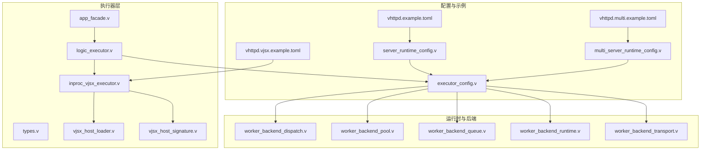
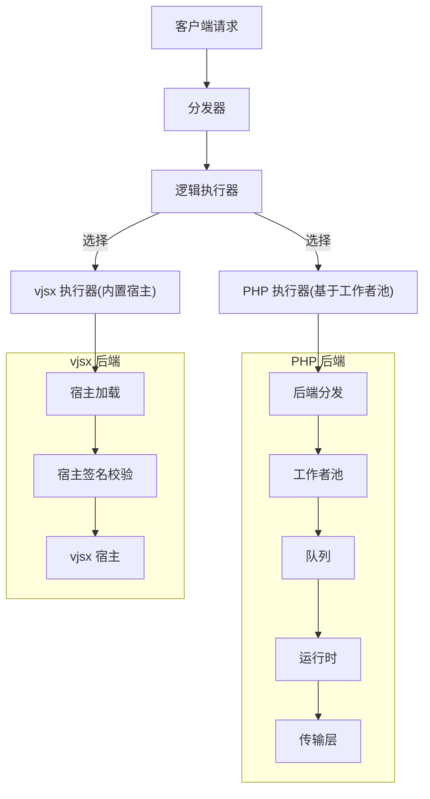
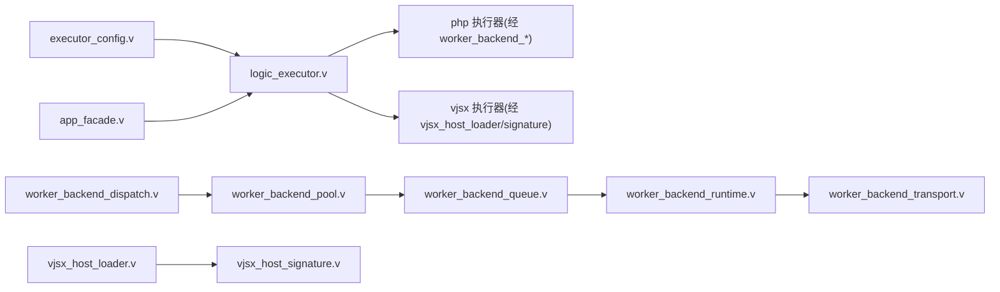

# 多执行器支持

<cite>
**本文引用的文件**
- [README.md](file://README.md)
- [EXECUTOR_MODES.md](file://docs/EXECUTOR_MODES.md)
- [logic_executor.v](file://src/executor/logic_executor.v)
- [inproc_vjsx_executor.v](file://src/executor/inproc_vjsx_executor.v)
- [types.v](file://src/executor/types.v)
- [vjsx_host_loader.v](file://src/executor/vjsx_host_loader.v)
- [vjsx_host_signature.v](file://src/executor/vjsx_host_signature.v)
- [app_facade.v](file://src/executor/app_facade.v)
- [executor_config.v](file://src/executor_config.v)
- [executor_lifecycle.v](file://src/executor_lifecycle.v)
- [worker_backend_dispatch.v](file://src/worker_backend_dispatch.v)
- [worker_backend_pool.v](file://src/worker_backend_pool.v)
- [worker_backend_queue.v](file://src/worker_backend_queue.v)
- [worker_backend_runtime.v](file://src/worker_backend_runtime.v)
- [worker_backend_transport.v](file://src/worker_backend_transport.v)
- [server_runtime_config.v](file://src/server_runtime_config.v)
- [multi_server_runtime_config.v](file://src/multi_server_runtime_config.v)
- [vhttpd.example.toml](file://config/vhttpd.example.toml)
- [vhttpd.multi.example.toml](file://config/vhttpd.multi.example.toml)
- [vhttpd.vjsx.example.toml](file://config/vhttpd.vjsx.example.toml)
- [articles/08-vjsx-intro.md](file://articles/08-vjsx-intro.md)
- [articles/01-overview.md](file://articles/01-overview.md)
</cite>

## 目录
1. [引言](#引言)
2. [项目结构](#项目结构)
3. [核心组件](#核心组件)
4. [架构总览](#架构总览)
5. [详细组件分析](#详细组件分析)
6. [依赖关系分析](#依赖关系分析)
7. [性能考量](#性能考量)
8. [故障排查指南](#故障排查指南)
9. [结论](#结论)
10. [附录](#附录)

## 引言
本文件系统化阐述 vhttpd 的“多执行器支持”能力与运行机制，重点说明以下关键点：
- 将请求处理逻辑从“永久绑定到 PHP 工作者”的固有范式中解耦，转而以“执行器”为核心抽象，使逻辑执行与运行时后端可灵活组合。
- 当前已支持的执行器类型：php（基于现有 PHP 工作者模型的逻辑执行器）、vjsx（内置的嵌入式逻辑执行器）。
- 在运行时/管理面可见的两类模型：logic_executor_model 与 logic_executor_lifecycle，用于区分“设计上的执行器形态”与“生命周期状态”。
- worker_backend_mode 的作用与语义，帮助运维人员快速区分“按设计禁用”与“意外不可用”的情况。
- 对未来扩展（如 Lua 执行器）如何融入同一执行器模型的思路与接口建议。
- 基于上述理解给出执行器选择的决策指南与最佳实践。

## 项目结构
围绕多执行器支持的相关目录与文件组织如下：
- 源码核心位于 src/executor 下，包含逻辑执行器、vjsx 内嵌执行器、类型定义、宿主加载与签名等模块。
- 运行时配置与多服务器配置位于 src/ 下，配合 config/ 中的示例 TOML 文件使用。
- 文档 docs/EXECUTOR_MODES.md 提供了执行器模式与行为的高层说明。
- 示例应用与文章 articles/ 提供了 vjsx 等执行器的实际使用背景与场景。

**图表来源**
- [logic_executor.v](file://src/executor/logic_executor.v)
- [inproc_vjsx_executor.v](file://src/executor/inproc_vjsx_executor.v)
- [types.v](file://src/executor/types.v)
- [vjsx_host_loader.v](file://src/executor/vjsx_host_loader.v)
- [vjsx_host_signature.v](file://src/executor/vjsx_host_signature.v)
- [app_facade.v](file://src/executor/app_facade.v)
- [executor_config.v](file://src/executor_config.v)
- [worker_backend_dispatch.v](file://src/worker_backend_dispatch.v)
- [worker_backend_pool.v](file://src/worker_backend_pool.v)
- [worker_backend_queue.v](file://src/worker_backend_queue.v)
- [worker_backend_runtime.v](file://src/worker_backend_runtime.v)
- [worker_backend_transport.v](file://src/worker_backend_transport.v)
- [server_runtime_config.v](file://src/server_runtime_config.v)
- [multi_server_runtime_config.v](file://src/multi_server_runtime_config.v)
- [vhttpd.example.toml](file://config/vhttpd.example.toml)
- [vhttpd.multi.example.toml](file://config/vhttpd.multi.example.toml)
- [vhttpd.vjsx.example.toml](file://config/vhttpd.vjsx.example.toml)

**章节来源**
- [README.md](file://README.md)
- [EXECUTOR_MODES.md](file://docs/EXECUTOR_MODES.md)
- [articles/01-overview.md](file://articles/01-overview.md)

## 核心组件
- logic_executor.v：定义逻辑执行器的核心抽象与调度策略，是“请求处理逻辑”与“执行后端”的粘合层。
- inproc_vjsx_executor.v：内置 vjsx 执行器实现，负责在进程内运行 JavaScript/TypeScript 逻辑，并与宿主交互。
- types.v：执行器相关类型定义，统一描述执行器规格、参数与返回值契约。
- vjsx_host_loader.v / vjsx_host_signature.v：vjsx 宿主加载与签名校验，确保宿主环境安全与可验证。
- app_facade.v：应用门面，封装对不同执行器的统一调用入口。
- executor_config.v：执行器配置解析与合并，承载执行器选择、后端模式、资源限制等。
- worker_backend_*：工作线程后端的分发、池化、队列、运行时与传输层，支撑 php 执行器等传统后端模型。
- server_runtime_config.v / multi_server_runtime_config.v：单机与多实例运行时配置，驱动执行器与后端的装配。
- 配置示例：vhttpd.example.toml、vhttpd.multi.example.toml、vhttpd.vjsx.example.toml。

**章节来源**
- [logic_executor.v](file://src/executor/logic_executor.v)
- [inproc_vjsx_executor.v](file://src/executor/inproc_vjsx_executor.v)
- [types.v](file://src/executor/types.v)
- [vjsx_host_loader.v](file://src/executor/vjsx_host_loader.v)
- [vjsx_host_signature.v](file://src/executor/vjsx_host_signature.v)
- [app_facade.v](file://src/executor/app_facade.v)
- [executor_config.v](file://src/executor_config.v)
- [worker_backend_dispatch.v](file://src/worker_backend_dispatch.v)
- [worker_backend_pool.v](file://src/worker_backend_pool.v)
- [worker_backend_queue.v](file://src/worker_backend_queue.v)
- [worker_backend_runtime.v](file://src/worker_backend_runtime.v)
- [worker_backend_transport.v](file://src/worker_backend_transport.v)
- [server_runtime_config.v](file://src/server_runtime_config.v)
- [multi_server_runtime_config.v](file://src/multi_server_runtime_config.v)
- [vhttpd.example.toml](file://config/vhttpd.example.toml)
- [vhttpd.multi.example.toml](file://config/vhttpd.multi.example.toml)
- [vhttpd.vjsx.example.toml](file://config/vhttpd.vjsx.example.toml)

## 架构总览
vhttpd 的多执行器架构以“逻辑执行器”为中心，将请求处理逻辑从“永久绑定到 PHP 工作者”的范式中解耦出来。执行器通过统一的配置与生命周期管理，对接不同的后端（如 PHP 工作者池或内置 vjsx 宿主），并在运行时/管理面以清晰的模型标识其状态与职责。

**图表来源**
- [logic_executor.v](file://src/executor/logic_executor.v)
- [inproc_vjsx_executor.v](file://src/executor/inproc_vjsx_executor.v)
- [vjsx_host_loader.v](file://src/executor/vjsx_host_loader.v)
- [vjsx_host_signature.v](file://src/executor/vjsx_host_signature.v)
- [worker_backend_dispatch.v](file://src/worker_backend_dispatch.v)
- [worker_backend_pool.v](file://src/worker_backend_pool.v)
- [worker_backend_queue.v](file://src/worker_backend_queue.v)
- [worker_backend_runtime.v](file://src/worker_backend_runtime.v)
- [worker_backend_transport.v](file://src/worker_backend_transport.v)

## 详细组件分析

### 逻辑执行器（logic_executor.v）
- 职责：作为“请求处理逻辑”的抽象与编排者，不直接执行业务逻辑，而是根据配置与上下文选择合适的执行器（php 或 vjsx），并协调生命周期与资源。
- 关键点：
  - 与 executor_config.v 协作，读取执行器选择策略与后端模式。
  - 与 app_facade.v 对接，屏蔽不同执行器的差异。
  - 与 worker_backend_* 协同，为 php 执行器提供工作者池化与队列能力。
- 设计意义：将“逻辑执行”与“工作者模型”解耦，使同一套请求处理逻辑可在不同执行器间切换，提升灵活性与可维护性。

**章节来源**
- [logic_executor.v](file://src/executor/logic_executor.v)
- [executor_config.v](file://src/executor_config.v)
- [app_facade.v](file://src/executor/app_facade.v)
- [worker_backend_dispatch.v](file://src/worker_backend_dispatch.v)
- [worker_backend_pool.v](file://src/worker_backend_pool.v)
- [worker_backend_queue.v](file://src/worker_backend_queue.v)
- [worker_backend_runtime.v](file://src/worker_backend_runtime.v)
- [worker_backend_transport.v](file://src/worker_backend_transport.v)

### vjsx 执行器（inproc_vjsx_executor.v）
- 职责：在进程内运行 vjsx 逻辑，通过宿主加载与签名校验确保安全性与一致性；与宿主通信完成请求处理。
- 关键点：
  - 依赖 vjsx_host_loader.v 与 vjsx_host_signature.v 实现宿主加载与签名校验。
  - 通过 app_facade.v 与逻辑执行器对接，遵循统一的调用契约。
  - 可独立于 PHP 工作者运行，适合轻量、低延迟、强内聚的逻辑场景。
- 适用场景：聊天机器人、卡片渲染、简单 API 转发与预处理等。

**章节来源**
- [inproc_vjsx_executor.v](file://src/executor/inproc_vjsx_executor.v)
- [vjsx_host_loader.v](file://src/executor/vjsx_host_loader.v)
- [vjsx_host_signature.v](file://src/executor/vjsx_host_signature.v)
- [app_facade.v](file://src/executor/app_facade.v)

### 类型与契约（types.v）
- 职责：定义执行器相关数据结构、参数与返回值契约，保证不同执行器实现的一致性与可替换性。
- 关键点：
  - 统一描述执行器规格、输入输出格式、错误码与状态字段。
  - 为逻辑执行器与具体执行器实现提供编译期约束与运行期校验依据。

**章节来源**
- [types.v](file://src/executor/types.v)

### 配置与运行时（executor_config.v、server_runtime_config.v、multi_server_runtime_config.v）
- 职责：解析与合并执行器配置，决定执行器选择、后端模式、资源限制与运行时行为。
- 关键点：
  - executor_config.v：集中处理执行器选择策略与后端模式。
  - server_runtime_config.v：单机运行时配置，驱动本地执行器与后端装配。
  - multi_server_runtime_config.v：多实例运行时配置，支持跨实例的执行器与后端协同。
- 与 worker_backend_* 的协作：为 php 执行器提供工作者池化、队列与传输层支持。

**章节来源**
- [executor_config.v](file://src/executor_config.v)
- [server_runtime_config.v](file://src/server_runtime_config.v)
- [multi_server_runtime_config.v](file://src/multi_server_runtime_config.v)
- [worker_backend_dispatch.v](file://src/worker_backend_dispatch.v)
- [worker_backend_pool.v](file://src/worker_backend_pool.v)
- [worker_backend_queue.v](file://src/worker_backend_queue.v)
- [worker_backend_runtime.v](file://src/worker_backend_runtime.v)
- [worker_backend_transport.v](file://src/worker_backend_transport.v)

### 运行时/管理面可见性：logic_executor_model 与 logic_executor_lifecycle
- logic_executor_model：描述“设计上”的执行器形态与职责边界，体现“请求处理逻辑”应如何被选择与编排。
- logic_executor_lifecycle：描述“运行时”的生命周期状态与转换，体现执行器在启动、运行、暂停、停止等阶段的行为与可观测性。
- 区别与价值：
  - 二者共同构成“执行器模型”的完整视图：前者回答“做什么”，后者回答“何时做、如何做”。
  - 便于在管理面区分“按设计禁用”（由 model 决定）与“意外不可用”（由 lifecycle 反映）。

**章节来源**
- [logic_executor.v](file://src/executor/logic_executor.v)
- [executor_lifecycle.v](file://src/executor_lifecycle.v)

### worker_backend_mode 的作用与运维区分
- 作用：控制工作者后端（尤其是 PHP 工作者池）的启用/禁用与行为模式，直接影响 php 执行器的可用性。
- 运维区分：
  - “按设计禁用”：由 worker_backend_mode 显式设置为禁用，属于预期行为，lifecycle 应显示为“已禁用/未激活”。
  - “意外不可用”：mode 为启用但 lifecycle 出现异常（如工作者池空闲超时、队列积压、传输失败），需进一步排查。
- 建议：结合 logic_executor_model 与 logic_executor_lifecycle，快速定位问题根因。

**章节来源**
- [worker_backend_dispatch.v](file://src/worker_backend_dispatch.v)
- [worker_backend_pool.v](file://src/worker_backend_pool.v)
- [worker_backend_queue.v](file://src/worker_backend_queue.v)
- [worker_backend_runtime.v](file://src/worker_backend_runtime.v)
- [worker_backend_transport.v](file://src/worker_backend_transport.v)
- [executor_config.v](file://src/executor_config.v)

### 未来扩展：Lua 执行器的融入路径
- 接口与契约：Lua 执行器应遵循 types.v 中的统一契约，确保与 logic_executor.v 的无缝对接。
- 生命周期：实现与 executor_lifecycle.v 对齐的生命周期管理，支持启动、运行、暂停、停止等状态。
- 宿主/沙箱：若采用嵌入式 Lua 宿主，需考虑安全隔离与资源限制；若复用现有工作者模型，则可沿用 worker_backend_*。
- 配置与选择：通过 executor_config.v 的配置项扩展执行器选择逻辑，实现与 php/vjsx 的一致体验。

**章节来源**
- [types.v](file://src/executor/types.v)
- [logic_executor.v](file://src/executor/logic_executor.v)
- [executor_lifecycle.v](file://src/executor_lifecycle.v)
- [executor_config.v](file://src/executor_config.v)

## 依赖关系分析
- 低耦合高内聚：logic_executor.v 仅依赖 executor_config.v 与 app_facade.v，避免直接绑定具体执行器实现。
- 可替换性：php 与 vjsx 执行器均可通过配置切换，且均通过 app_facade.v 对外暴露一致接口。
- 后端解耦：php 执行器依赖 worker_backend_*，vjsx 执行器依赖 vjsx_host_loader.v 与 vjsx_host_signature.v，彼此互不影响。

**图表来源**
- [executor_config.v](file://src/executor_config.v)
- [logic_executor.v](file://src/executor/logic_executor.v)
- [app_facade.v](file://src/executor/app_facade.v)
- [worker_backend_dispatch.v](file://src/worker_backend_dispatch.v)
- [worker_backend_pool.v](file://src/worker_backend_pool.v)
- [worker_backend_queue.v](file://src/worker_backend_queue.v)
- [worker_backend_runtime.v](file://src/worker_backend_runtime.v)
- [worker_backend_transport.v](file://src/worker_backend_transport.v)
- [vjsx_host_loader.v](file://src/executor/vjsx_host_loader.v)
- [vjsx_host_signature.v](file://src/executor/vjsx_host_signature.v)

**章节来源**
- [executor_config.v](file://src/executor_config.v)
- [logic_executor.v](file://src/executor/logic_executor.v)
- [app_facade.v](file://src/executor/app_facade.v)
- [worker_backend_dispatch.v](file://src/worker_backend_dispatch.v)
- [worker_backend_pool.v](file://src/worker_backend_pool.v)
- [worker_backend_queue.v](file://src/worker_backend_queue.v)
- [worker_backend_runtime.v](file://src/worker_backend_runtime.v)
- [worker_backend_transport.v](file://src/worker_backend_transport.v)
- [vjsx_host_loader.v](file://src/executor/vjsx_host_loader.v)
- [vjsx_host_signature.v](file://src/executor/vjsx_host_signature.v)

## 性能考量
- 执行器选择：根据业务特征选择执行器。vjsx 适合低延迟、轻量逻辑；php 更适合复杂、重计算或已有 PHP 生态的应用。
- 资源隔离：vjsx 在进程内运行，避免进程间通信开销；php 通过工作者池化与队列实现并发与背压。
- 生命周期优化：合理设置 lifecycle 的启动/停止时机，减少冷启动与频繁重启带来的抖动。
- 配置调优：通过 executor_config.v 与 worker_backend_* 的参数调整吞吐与延迟目标。

[本节为通用指导，无需列出具体文件来源]

## 故障排查指南
- 现象：php 执行器不可用
  - 步骤：检查 worker_backend_mode 是否显式禁用；若启用但不可用，检查 lifecycle 状态与 worker_backend_* 的健康度。
- 现象：vjsx 执行器不可用
  - 步骤：检查 vjsx_host_loader.v 与 vjsx_host_signature.v 的加载与校验日志；确认宿主签名与版本匹配。
- 现象：逻辑执行器无法选择
  - 步骤：核对 executor_config.v 的配置项与 server_runtime_config.v/multi_server_runtime_config.v 的合并结果；对比 logic_executor_model 与 logic_executor_lifecycle 的状态。

**章节来源**
- [worker_backend_dispatch.v](file://src/worker_backend_dispatch.v)
- [worker_backend_pool.v](file://src/worker_backend_pool.v)
- [worker_backend_queue.v](file://src/worker_backend_queue.v)
- [worker_backend_runtime.v](file://src/worker_backend_runtime.v)
- [worker_backend_transport.v](file://src/worker_backend_transport.v)
- [vjsx_host_loader.v](file://src/executor/vjsx_host_loader.v)
- [vjsx_host_signature.v](file://src/executor/vjsx_host_signature.v)
- [executor_config.v](file://src/executor_config.v)
- [server_runtime_config.v](file://src/server_runtime_config.v)
- [multi_server_runtime_config.v](file://src/multi_server_runtime_config.v)
- [logic_executor.v](file://src/executor/logic_executor.v)
- [executor_lifecycle.v](file://src/executor_lifecycle.v)

## 结论
vhttpd 的多执行器支持通过“逻辑执行器”这一中心抽象，实现了请求处理逻辑与执行后端的解耦。当前以 php（工作者池）与 vjsx（内置宿主）为代表，分别覆盖“复杂生态迁移”和“轻量内聚逻辑”的典型场景。借助 logic_executor_model 与 logic_executor_lifecycle 的清晰划分，以及 worker_backend_mode 的明确语义，运维人员可以快速区分“按设计禁用”与“意外不可用”。面向未来，Lua 等新执行器可通过统一契约与生命周期管理无缝融入该模型。

[本节为总结，无需列出具体文件来源]

## 附录

### 执行器选择决策指南
- 优先选择 vjsx 的场景
  - 逻辑简单、低延迟要求高
  - 需要强内聚与快速迭代
  - 不希望引入额外进程或外部依赖
- 优先选择 php 的场景
  - 已有成熟的 PHP 应用生态
  - 需要复杂的计算或第三方库
  - 需要工作者池化与队列背压能力
- 兼容与迁移策略
  - 新功能先以 vjsx 开发，验证后再迁移至 php
  - 对于存量 PHP 功能，逐步拆分与替换，保留 worker_backend_mode 的可控性

**章节来源**
- [logic_executor.v](file://src/executor/logic_executor.v)
- [inproc_vjsx_executor.v](file://src/executor/inproc_vjsx_executor.v)
- [executor_config.v](file://src/executor_config.v)
- [worker_backend_dispatch.v](file://src/worker_backend_dispatch.v)
- [worker_backend_pool.v](file://src/worker_backend_pool.v)
- [worker_backend_queue.v](file://src/worker_backend_queue.v)
- [worker_backend_runtime.v](file://src/worker_backend_runtime.v)
- [worker_backend_transport.v](file://src/worker_backend_transport.v)

### 最佳实践建议
- 明确区分 model 与 lifecycle：model 决策“做什么”，lifecycle 决策“何时做、如何做”，两者结合才能准确诊断问题。
- 使用 worker_backend_mode 精准控制后端可用性，避免误判“不可用”。
- 通过 executor_config.v 与运行时配置文件（vhttpd.example.toml、vhttpd.multi.example.toml、vhttpd.vjsx.example.toml）统一管理执行器策略。
- 对新执行器（如 Lua）严格遵循 types.v 契约与 executor_lifecycle.v 生命周期规范，确保一致性与可维护性。

**章节来源**
- [EXECUTOR_MODES.md](file://docs/EXECUTOR_MODES.md)
- [vhttpd.example.toml](file://config/vhttpd.example.toml)
- [vhttpd.multi.example.toml](file://config/vhttpd.multi.example.toml)
- [vhttpd.vjsx.example.toml](file://config/vhttpd.vjsx.example.toml)
- [articles/08-vjsx-intro.md](file://articles/08-vjsx-intro.md)