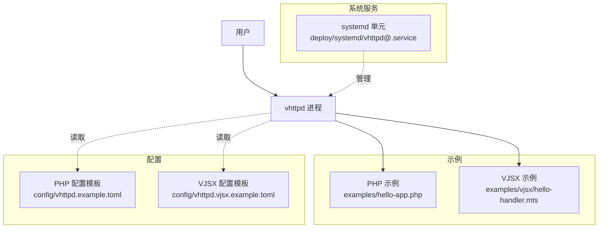
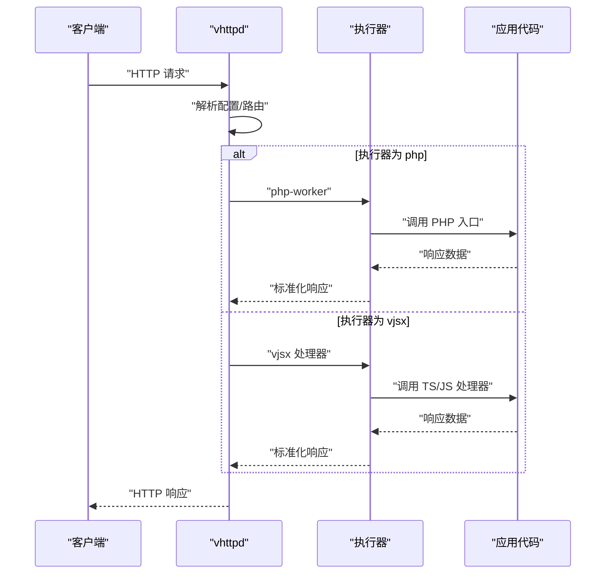
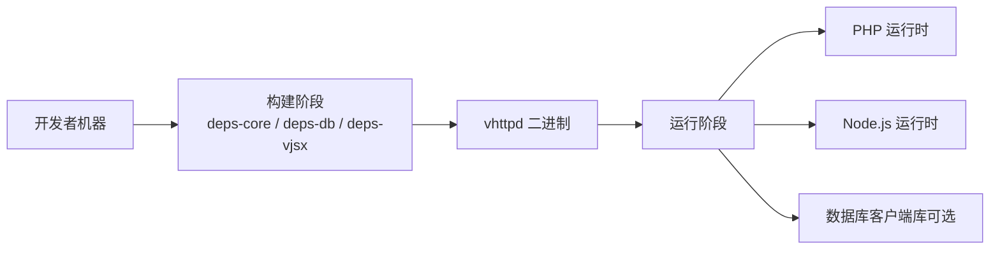

# 快速开始

<cite>
**本文引用的文件**
- [README.md](file://README.md)
- [config/vhttpd.example.toml](file://config/vhttpd.example.toml)
- [config/vhttpd.vjsx.example.toml](file://config/vhttpd.vjsx.example.toml)
- [examples/hello-app.php](file://examples/hello-app.php)
- [examples/vjsx/hello-handler.mts](file://examples/vjsx/hello-handler.mts)
- [src/config/args.v](file://src/config/args.v)
- [src/server.v](file://src/server.v)
- [deploy/systemd/vhttpd@.service](file://deploy/systemd/vhttpd@.service)
- [scripts/install_ubuntu_from_source.sh](file://scripts/install_ubuntu_from_source.sh)
</cite>

## 目录
1. [简介](#简介)
2. [项目结构](#项目结构)
3. [核心组件](#核心组件)
4. [架构总览](#架构总览)
5. [详细组件分析](#详细组件分析)
6. [依赖分析](#依赖分析)
7. [性能考虑](#性能考虑)
8. [故障排除指南](#故障排除指南)
9. [结论](#结论)
10. [附录](#附录)

## 简介
本指南面向首次接触 vhttpd 的用户，目标是帮助你在最短时间内完成环境准备、安装与运行，并通过两个最小示例（PHP Worker 与 VJSX）快速体验不同执行器模式。你将了解：
- 如何从源码构建或获取二进制
- 基本配置与启动参数
- 两种执行器模式的 Hello World 示例
- 常见问题的定位方法与验证步骤

vhttpd 是一个基于 veb 的独立应用运行时，既可作为 PHP 应用的执行宿主，也支持内嵌 TypeScript/JavaScript（VJSX）逻辑，同时提供 HTTP/WebSocket/流式响应等协议能力与运行时管理能力。

## 项目结构
仓库包含示例、配置模板、部署模板与文档。对于“快速开始”，你主要会用到以下路径：
- 示例应用与处理器
  - PHP: examples/hello-app.php
  - VJSX: examples/vjsx/hello-handler.mts
- 配置模板
  - PHP 示例: config/vhttpd.example.toml
  - VJSX 示例: config/vhttpd.vjsx.example.toml
- 服务管理模板
  - systemd: deploy/systemd/vhttpd@.service
- 构建与安装脚本
  - Ubuntu 一键安装脚本: scripts/install_ubuntu_from_source.sh
- 命令行帮助与参数解析
  - 帮助输出: src/server.v
  - CLI 工具函数: src/config/args.v

图表来源
- [README.md](file://README.md)
- [config/vhttpd.example.toml](file://config/vhttpd.example.toml)
- [config/vhttpd.vjsx.example.toml](file://config/vhttpd.vjsx.example.toml)
- [examples/hello-app.php](file://examples/hello-app.php)
- [examples/vjsx/hello-handler.mts](file://examples/vjsx/hello-handler.mts)
- [deploy/systemd/vhttpd@.service](file://deploy/systemd/vhttpd@.service)

章节来源
- [README.md](file://README.md)

## 核心组件
- 执行器模型
  - php-worker：外部 PHP 应用执行器，通过工作进程池处理请求
  - vjsx：内嵌 TypeScript/JavaScript 执行器，直接由 vhttpd 进程加载运行
- 配置与参数
  - TOML 配置文件优先级高于默认值，CLI 参数优先级最高
  - 支持环境变量与变量展开（如 ${env.NAME}、${section.key}）
- 服务管理
  - 推荐前台运行，交由 systemd/launchd 管理生命周期

章节来源
- [README.md](file://README.md)
- [src/config/args.v](file://src/config/args.v)
- [src/server.v](file://src/server.v)

## 架构总览
下图展示了 vhttpd 在“快速开始”场景下的简化交互：客户端访问 HTTP 接口，vhttpd 根据配置选择执行器（php 或 vjsx），将请求转发到对应应用并返回响应。

图表来源
- [README.md](file://README.md)
- [examples/hello-app.php](file://examples/hello-app.php)
- [examples/vjsx/hello-handler.mts](file://examples/vjsx/hello-handler.mts)

## 详细组件分析

### 从零开始：环境与安装
- 方式一：使用预编译二进制（推荐）
  - 参考 README 中的“CI Binaries”和“Distribution”说明，下载对应平台的打包产物，解压后按提示安装运行时库。
  - 若需要数据库客户端库，使用 db 运行时配置；否则 core 即可。
- 方式二：从源码构建
  - 安装基础依赖（core/db/vjsx 按需）
  - 构建开发版或生产版
  - 可选：Ubuntu 一键安装脚本可自动拉取源码、准备依赖并安装到本地 PATH

章节来源
- [README.md](file://README.md)
- [scripts/install_ubuntu_from_source.sh](file://scripts/install_ubuntu_from_source.sh)

### 基本配置与启动
- 使用 TOML 配置（推荐）
  - 加载顺序：默认值 -> TOML -> CLI 参数
  - 变量展开：支持 ${section.key} 与 ${env.NAME:-default}
  - 示例配置：
    - PHP 示例：config/vhttpd.example.toml
    - VJSX 示例：config/vhttpd.vjsx.example.toml
- 启动命令
  - 指定配置文件：./vhttpd --config /path/to/config.toml
  - 也可简写为 ./vhttpd /path/to/config.toml
- 常用启动参数（节选）
  - --host, --port：数据面监听地址与端口
  - --ssl-cert, --ssl-key：启用 HTTPS
  - --admin-host, --admin-port, --admin-token：管理面地址与鉴权
  - --event-log, --pid-file：事件日志与 PID 文件
  - --worker-autostart, --worker-cmd, --worker-socket, --worker-pool-size, --worker-queue-capacity, --worker-queue-timeout-ms, --worker-socket-prefix：工作进程相关
  - 更多参数见帮助输出

章节来源
- [README.md](file://README.md)
- [config/vhttpd.example.toml](file://config/vhttpd.example.toml)
- [config/vhttpd.vjsx.example.toml](file://config/vhttpd.vjsx.example.toml)
- [src/server.v](file://src/server.v)

### Hello World 示例：PHP Worker 模式
- 目标
  - 使用 PHP 执行器运行一个简单路由，返回文本或 JSON
- 前置条件
  - 已安装 PHP 与 vslim 扩展（示例配置中已给出路径占位）
  - 使用示例配置 config/vhttpd.example.toml
- 启动
  - ./vhttpd --config config/vhttpd.example.toml
- 验证
  - 访问 /hello/:name 查看文本响应
  - 访问 /api/meta 查看 JSON 元信息
- 关键实现位置
  - PHP 路由定义位于 examples/hello-app.php

章节来源
- [config/vhttpd.example.toml](file://config/vhttpd.example.toml)
- [examples/hello-app.php](file://examples/hello-app.php)
- [README.md](file://README.md)

### Hello World 示例：VJSX 模式
- 目标
  - 使用 VJSX 执行器运行一个内嵌处理器，返回结构化 JSON
- 前置条件
  - 已安装 Node.js（runtime_profile=node）
  - 使用示例配置 config/vhttpd.vjsx.example.toml
- 启动
  - ./vhttpd --config config/vhttpd.vjsx.example.toml
- 验证
  - 访问根路径或示例路由，查看返回的 JSON（包含 method/path/name 等字段）
- 关键实现位置
  - VJSX 处理器位于 examples/vjsx/hello-handler.mts

章节来源
- [config/vhttpd.vjsx.example.toml](file://config/vhttpd.vjsx.example.toml)
- [examples/vjsx/hello-handler.mts](file://examples/vjsx/hello-handler.mts)
- [README.md](file://README.md)

### 多站点与多监听（进阶）
- 可在同一进程中监听多个 host:port，每个站点独立选择执行器与配置
- 使用 [sites.<id>] 与可选的 [listeners.<id>] 组合
- 站点级 app 是统一别名，自动推断 executor（.php 为 php，否则 vjsx）
- 参考 README 中的多监听示例片段与 SITE_CONFIG_DSL 文档

章节来源
- [README.md](file://README.md)
- [docs/SITE_CONFIG_DSL.md](file://docs/SITE_CONFIG_DSL.md)

### 服务管理（systemd）
- 推荐使用 systemd 管理前台运行的 vhttpd 进程
- 官方模板：deploy/systemd/vhttpd@.service
- 典型流程
  - 复制模板到 /etc/systemd/system/vhttpd@.service
  - 放置配置文件到 /etc/vhttpd/<实例名>.toml
  - systemctl enable --now vhttpd@<实例名>
- macOS 可使用 launchd 模板（README 中有说明）

章节来源
- [README.md](file://README.md)
- [deploy/systemd/vhttpd@.service](file://deploy/systemd/vhttpd@.service)

## 依赖分析
- 构建依赖
  - core：基础构建依赖（OpenSSL、Boehm GC、pkg-config 等）
  - db：数据库客户端开发包（MySQL/PostgreSQL/SQLite）
  - vjsx：嵌入式 JS/TS 运行时（QuickJS 源码管理）
- 运行时依赖
  - PHP（php-worker 模式）
  - Node.js（vjsx 模式，runtime_profile=node）
  - 可选：数据库客户端库（可通过打包产物附带）

图表来源
- [README.md](file://README.md)

章节来源
- [README.md](file://README.md)

## 性能考虑
- 合理设置 worker 池大小与队列容量，避免过载导致 503/504
- 调整 read_timeout_ms 与 queue_timeout_ms 以匹配业务延迟
- 生产构建默认日志级别为 warn，可按需调整为 info/debug 用于排障
- 静态资源开启 assets 缓存可降低重复请求开销

[本节为通用建议，不直接分析具体文件]

## 故障排除指南
- 无法找到配置文件
  - 检查 --config 路径是否正确，或使用环境变量 VHTTPD_CONFIG
  - 确认 TOML 语法与变量展开是否生效
- 端口冲突或服务未启动
  - 检查 --host/--port 是否与已有服务冲突
  - 查看 event-log 与标准输出日志
- PHP 模式启动失败
  - 确认 php 可执行文件与 vslim 扩展路径正确
  - 确认 worker_entry/app_entry/extensions 存在且可访问
- VJSX 模式启动失败
  - 确认 runtime_profile 与 node 可用
  - 确认 app_entry/module_root/build_root 路径有效
- 管理面不可用
  - 检查 --admin-host/--admin-port/--admin-token 配置
  - 确保防火墙允许访问管理面端口

章节来源
- [README.md](file://README.md)
- [src/server.v](file://src/server.v)

## 结论
通过以上步骤，你应该已经成功：
- 安装并运行了 vhttpd
- 分别使用 PHP Worker 与 VJSX 执行器跑通了 Hello World
- 了解了基本配置结构与常用启动参数
- 掌握了 systemd 管理与常见问题的排查方法

下一步可探索多站点配置、WebSocket 与流式响应、MCP 集成等高级特性。

[本节为总结性内容，不直接分析具体文件]

## 附录
- 常用命令速查
  - 构建：make deps-core && make vhttpd（或 make prod）
  - 启动：./vhttpd --config <配置文件>
  - 帮助：./vhttpd --help
- 参考路径
  - 示例配置：config/vhttpd.example.toml、config/vhttpd.vjsx.example.toml
  - 示例应用：examples/hello-app.php、examples/vjsx/hello-handler.mts
  - 服务模板：deploy/systemd/vhttpd@.service

[本节为补充信息，不直接分析具体文件]