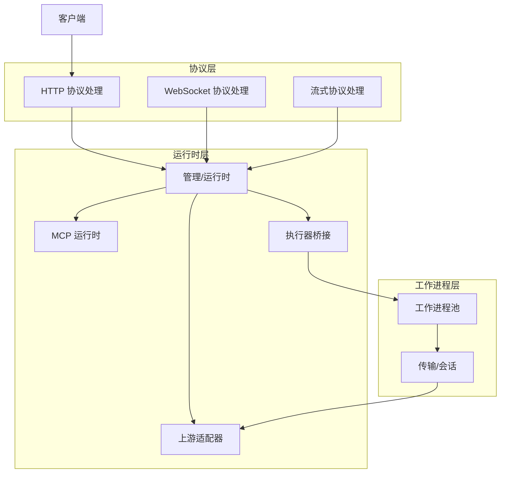
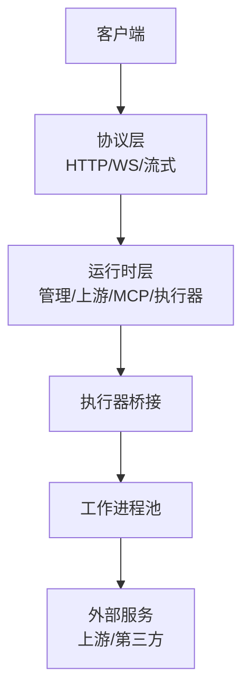
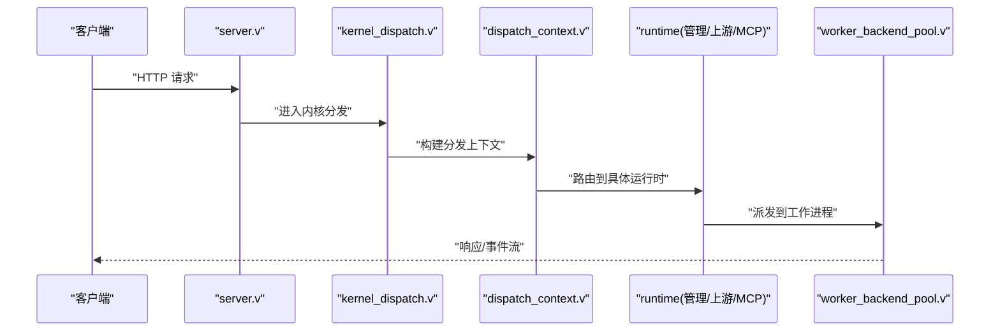
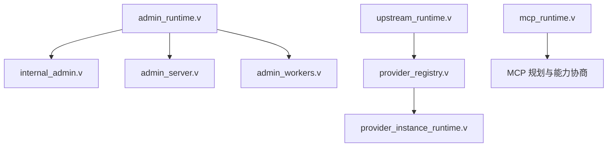
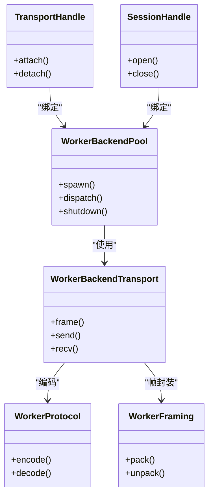
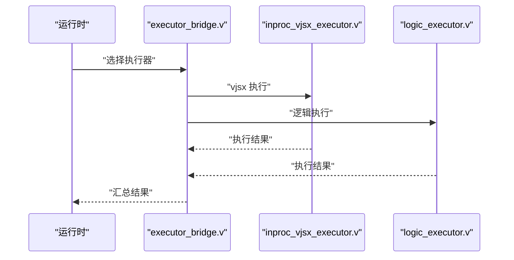
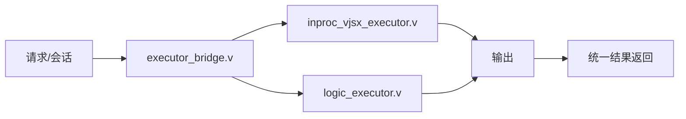
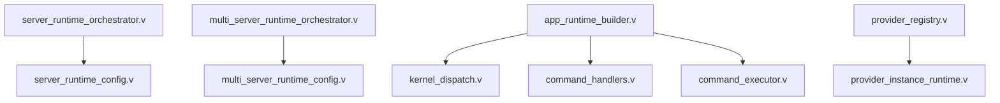

# 技术架构概览

<cite>
**本文引用的文件**
- [README.md](file://README.md)
- [OVERVIEW.md](file://docs/OVERVIEW.md)
- [ARCHITECTURE_REFACTOR_BASELINE.md](file://docs/ARCHITECTURE_REFACTOR_BASELINE.md)
- [EXECUTOR_MODES.md](file://docs/EXECUTOR_MODES.md)
- [MCP.md](file://docs/MCP.md)
- [WEBSOCKET_MVP_PLAN.md](file://docs/WEBSOCKET_MVP_PLAN.md)
- [STREAM_RUNTIME_PHASES.md](file://docs/STREAM_RUNTIME_PHASES.md)
- [VEB_REUSE_1_1_PLAN.md](file://docs/VEB_REUSE_1_1_PLAN.md)
- [main.v](file://src/main.v)
- [server.v](file://src/server.v)
- [worker_backend_transport.v](file://src/worker_backend_transport.v)
- [stream_runtime.v](file://src/stream_runtime.v)
- [upstream_runtime.v](file://src/upstream_runtime.v)
- [websocket_runtime.v](file://src/websocket_runtime.v)
- [mcp_runtime.v](file://src/mcp_runtime.v)
- [worker_backend_pool.v](file://src/worker_backend_pool.v)
- [admin_runtime.v](file://src/admin_runtime.v)
- [server_runtime_orchestrator.v](file://src/server_runtime_orchestrator.v)
- [multi_server_runtime_orchestrator.v](file://src/multi_server_runtime_orchestrator.v)
- [server_runtime_config.v](file://src/server_runtime_config.v)
- [multi_server_runtime_config.v](file://src/multi_server_runtime_config.v)
- [app_runtime_builder.v](file://src/app_runtime_builder.v)
- [executor_bridge.v](file://src/executor_bridge.v)
- [inproc_vjsx_executor.v](file://src/executor/inproc_vjsx_executor.v)
- [logic_executor.v](file://src/executor/logic_executor.v)
- [types.v](file://src/executor/types.v)
- [vjsx_host_loader.v](file://src/executor/vjsx_host_loader.v)
- [transport_handle.v](file://src/transport/transport_handle.v)
- [session_handle.v](file://src/transport/session_handle.v)
- [worker_pool.v](file://src/transport/worker_pool.v)
- [worker_protocol.v](file://src/transport/worker_protocol.v)
- [worker_framing.v](file://src/transport/worker_framing.v)
- [internal_admin.v](file://src/internal_admin.v)
- [admin_server.v](file://src/admin_server.v)
- [admin_workers.v](file://src/admin_workers.v)
- [codex_runtime.v](file://src/codex_runtime.v)
- [openai_runtime.v](file://src/openai_runtime.v)
- [feishu_runtime.v](file://src/feishu_runtime.v)
- [plugin_runtime.v](file://src/plugin_runtime.v)
- [provider_registry.v](file://src/provider_registry.v)
- [provider_instance_runtime.v](file://src/provider_instance_runtime.v)
- [db_runtime.v](file://src/db_runtime.v)
- [dispatch_context.v](file://src/dispatch_context.v)
- [command_executor.v](file://src/command_executor.v)
- [command_handlers.v](file://src/command_handlers.v)
- [kernel_dispatch.v](file://src/kernel_dispatch.v)
- [vjsx_host_signature.v](file://src/executor/vjsx_host_signature.v)
- [vjsx_host_signature_test.v](file://src/inproc_vjsx_host_signature_test.v)
</cite>

## 目录
1. [引言](#引言)
2. [项目结构](#项目结构)
3. [核心组件](#核心组件)
4. [架构总览](#架构总览)
5. [详细组件分析](#详细组件分析)
6. [依赖关系分析](#依赖关系分析)
7. [性能考量](#性能考量)
8. [故障排查指南](#故障排查指南)
9. [结论](#结论)
10. [附录](#附录)

## 引言
本文件面向 vhttpd 的技术架构，系统化阐述其作为“HTTP 家族网关/运行时”的整体设计：协议层（HTTP、WebSocket、流式协议）与运行时层（上游、工作进程池、管理/运行时、MCP）的分层结构；解释 veb 边界设计原则，说明 vhttpd 如何保持轻量并复用 veb/http/urllib；给出架构图解，展示客户端、vhttpd 运行时、工作进程与外部服务的交互关系；介绍核心组件职责分工，并讨论多执行器模式的设计思路与未来扩展性。

## 项目结构
vhttpd 采用模块化与分层组织方式：
- 协议与运行时：src 下按功能域划分，如 stream_runtime.v、websocket_runtime.v、upstream_runtime.v、mcp_runtime.v 等
- 工作进程与传输：src/transport 下包含 worker_pool.v、worker_protocol.v、worker_framing.v、transport_handle.v、session_handle.v 等
- 管理与内核：src 下的 admin_runtime.v、internal_admin.v、admin_server.v、admin_workers.v、server_runtime_orchestrator.v、multi_server_runtime_orchestrator.v 等
- 执行器与桥接：src/executor 下的 inproc_vjsx_executor.v、logic_executor.v、types.v、vjsx_host_loader.v、executor_bridge.v 等
- 应用与路由：app_runtime_builder.v、dispatch_context.v、kernel_dispatch.v、command_executor.v、command_handlers.v 等
- 配置与多实例：server_runtime_config.v、multi_server_runtime_config.v、server.v、main.v 等

**章节来源**
- [main.v](file://src/main.v)
- [server.v](file://src/server.v)
- [server_runtime_orchestrator.v](file://src/server_runtime_orchestrator.v)
- [multi_server_runtime_orchestrator.v](file://src/multi_server_runtime_orchestrator.v)

## 核心组件
- 协议与运行时
  - worker_backend_transport.v：工作进程后端传输抽象与帧协议
  - stream_runtime.v：流式协议运行时（含阶段化实现计划）
  - websocket_runtime.v：WebSocket 运行时（含 MVP 与消息分发计划）
  - upstream_runtime.v：上游适配运行时（HTTP/WS/流式上游）
  - mcp_runtime.v：MCP（Model Context Protocol）运行时
- 管理与内核
  - admin_runtime.v：管理/运行时核心
  - internal_admin.v：内部管理能力
  - admin_server.v：管理服务端点
  - admin_workers.v：管理侧工作进程管理
  - server_runtime_orchestrator.v / multi_server_runtime_orchestrator.v：单机/多机运行时编排
  - server_runtime_config.v / multi_server_runtime_config.v：运行时配置
- 执行器与桥接
  - inproc_vjsx_executor.v：内置 vjsx 执行器
  - logic_executor.v：逻辑执行器
  - executor_bridge.v：执行器桥接
  - executor/types.v、vjsx_host_loader.v、vjsx_host_signature.v
- 传输与会话
  - transport_handle.v、session_handle.v、worker_pool.v、worker_protocol.v、worker_framing.v
- 应用与调度
  - app_runtime_builder.v、dispatch_context.v、kernel_dispatch.v、command_executor.v、command_handlers.v
- 其他运行时
  - codex_runtime.v、openai_runtime.v、feishu_runtime.v、plugin_runtime.v、provider_registry.v、provider_instance_runtime.v、db_runtime.v

**章节来源**
- [worker_backend_transport.v](file://src/worker_backend_transport.v)
- [stream_runtime.v](file://src/stream_runtime.v)
- [websocket_runtime.v](file://src/websocket_runtime.v)
- [upstream_runtime.v](file://src/upstream_runtime.v)
- [mcp_runtime.v](file://src/mcp_runtime.v)
- [admin_runtime.v](file://src/admin_runtime.v)
- [server_runtime_orchestrator.v](file://src/server_runtime_orchestrator.v)
- [multi_server_runtime_orchestrator.v](file://src/multi_server_runtime_orchestrator.v)
- [inproc_vjsx_executor.v](file://src/executor/inproc_vjsx_executor.v)
- [logic_executor.v](file://src/executor/logic_executor.v)
- [executor_bridge.v](file://src/executor_bridge.v)
- [transport_handle.v](file://src/transport/transport_handle.v)
- [worker_pool.v](file://src/transport/worker_pool.v)
- [worker_protocol.v](file://src/transport/worker_protocol.v)
- [worker_framing.v](file://src/transport/worker_framing.v)
- [app_runtime_builder.v](file://src/app_runtime_builder.v)
- [dispatch_context.v](file://src/dispatch_context.v)
- [kernel_dispatch.v](file://src/kernel_dispatch.v)
- [command_executor.v](file://src/command_executor.v)
- [command_handlers.v](file://src/command_handlers.v)

## 架构总览
vhttpd 将“协议层”与“运行时层”清晰分离：
- 协议层负责接入与编解码：HTTP、WebSocket、流式协议
- 运行时层负责业务语义与外部集成：上游、MCP、管理、执行器
- 工作进程池与传输层提供可伸缩的后端承载与会话管理
- 多执行器模式支持在同一流程中组合不同执行器（如内置 vjsx 与逻辑执行器）

**图表来源**
- [server.v](file://src/server.v)
- [admin_runtime.v](file://src/admin_runtime.v)
- [upstream_runtime.v](file://src/upstream_runtime.v)
- [mcp_runtime.v](file://src/mcp_runtime.v)
- [inproc_vjsx_executor.v](file://src/executor/inproc_vjsx_executor.v)
- [logic_executor.v](file://src/executor/logic_executor.v)
- [worker_backend_pool.v](file://src/worker_backend_pool.v)

**章节来源**
- [OVERVIEW.md](file://docs/OVERVIEW.md)
- [ARCHITECTURE_REFACTOR_BASELINE.md](file://docs/ARCHITECTURE_REFACTOR_BASELINE.md)
- [EXECUTOR_MODES.md](file://docs/EXECUTOR_MODES.md)

## 详细组件分析

### 协议层：HTTP、WebSocket、流式协议
- HTTP：作为主要入口，接收请求并进入内核分发
- WebSocket：提供双向事件通道，配合消息分发与上游计划
- 流式协议：面向长连接与实时数据，具备阶段化实现与采样策略

**图表来源**
- [server.v](file://src/server.v)
- [kernel_dispatch.v](file://src/kernel_dispatch.v)
- [dispatch_context.v](file://src/dispatch_context.v)
- [admin_runtime.v](file://src/admin_runtime.v)
- [worker_backend_pool.v](file://src/worker_backend_pool.v)

**章节来源**
- [server.v](file://src/server.v)
- [kernel_dispatch.v](file://src/kernel_dispatch.v)
- [dispatch_context.v](file://src/dispatch_context.v)
- [WEBSOCKET_MVP_PLAN.md](file://docs/WEBSOCKET_MVP_PLAN.md)
- [STREAM_RUNTIME_PHASES.md](file://docs/STREAM_RUNTIME_PHASES.md)

### 运行时层：管理/运行时、上游、MCP
- 管理/运行时：admin_runtime.v 负责运行时生命周期与管理接口，internal_admin.v 提供内部能力，admin_server.v 暴露管理端点，admin_workers.v 管理管理侧工作进程
- 上游：upstream_runtime.v 统一对接外部上游（HTTP/WS/流式），结合 provider_registry.v 与 provider_instance_runtime.v 实现多提供商注册与实例化
- MCP：mcp_runtime.v 提供 MCP 协议运行时，配合 MCP 文档与能力协商计划

**图表来源**
- [admin_runtime.v](file://src/admin_runtime.v)
- [internal_admin.v](file://src/internal_admin.v)
- [admin_server.v](file://src/admin_server.v)
- [admin_workers.v](file://src/admin_workers.v)
- [upstream_runtime.v](file://src/upstream_runtime.v)
- [provider_registry.v](file://src/provider_registry.v)
- [provider_instance_runtime.v](file://src/provider_instance_runtime.v)
- [mcp_runtime.v](file://src/mcp_runtime.v)
- [MCP.md](file://docs/MCP.md)

**章节来源**
- [admin_runtime.v](file://src/admin_runtime.v)
- [internal_admin.v](file://src/internal_admin.v)
- [admin_server.v](file://src/admin_server.v)
- [admin_workers.v](file://src/admin_workers.v)
- [upstream_runtime.v](file://src/upstream_runtime.v)
- [provider_registry.v](file://src/provider_registry.v)
- [provider_instance_runtime.v](file://src/provider_instance_runtime.v)
- [mcp_runtime.v](file://src/mcp_runtime.v)
- [MCP.md](file://docs/MCP.md)

### 工作进程池与传输
- worker_backend_pool.v：工作进程池管理
- worker_backend_transport.v：后端传输与帧协议
- transport_handle.v / session_handle.v：传输句柄与会话句柄
- worker_protocol.v / worker_framing.v：协议与帧封装
- worker_pool.v：工作进程池基础设施

**图表来源**
- [worker_backend_pool.v](file://src/worker_backend_pool.v)
- [worker_backend_transport.v](file://src/worker_backend_transport.v)
- [transport_handle.v](file://src/transport/transport_handle.v)
- [session_handle.v](file://src/transport/session_handle.v)
- [worker_protocol.v](file://src/transport/worker_protocol.v)
- [worker_framing.v](file://src/transport/worker_framing.v)

**章节来源**
- [worker_backend_pool.v](file://src/worker_backend_pool.v)
- [worker_backend_transport.v](file://src/worker_backend_transport.v)
- [transport_handle.v](file://src/transport/transport_handle.v)
- [session_handle.v](file://src/transport/session_handle.v)
- [worker_protocol.v](file://src/transport/worker_protocol.v)
- [worker_framing.v](file://src/transport/worker_framing.v)

### 执行器与桥接
- inproc_vjsx_executor.v：内置 vjsx 执行器，负责 vjsx 主机加载与签名校验
- logic_executor.v：逻辑执行器，承载业务逻辑执行
- executor_bridge.v：执行器桥接，统一调度不同执行器
- executor/types.v、vjsx_host_loader.v、vjsx_host_signature.v：类型定义、主机加载与签名

**图表来源**
- [executor_bridge.v](file://src/executor_bridge.v)
- [inproc_vjsx_executor.v](file://src/executor/inproc_vjsx_executor.v)
- [logic_executor.v](file://src/executor/logic_executor.v)
- [types.v](file://src/executor/types.v)
- [vjsx_host_loader.v](file://src/executor/vjsx_host_loader.v)
- [vjsx_host_signature.v](file://src/executor/vjsx_host_signature.v)

**章节来源**
- [executor_bridge.v](file://src/executor_bridge.v)
- [inproc_vjsx_executor.v](file://src/executor/inproc_vjsx_executor.v)
- [logic_executor.v](file://src/executor/logic_executor.v)
- [types.v](file://src/executor/types.v)
- [vjsx_host_loader.v](file://src/executor/vjsx_host_loader.v)
- [vjsx_host_signature.v](file://src/executor/vjsx_host_signature.v)

### 多执行器模式与未来扩展
- 多执行器模式允许在同一请求/会话中组合不同执行器，以满足复杂场景（如 vjsx 前置渲染 + 逻辑执行后处理）
- 通过 executor_bridge.v 与 types.v 统一调度，便于扩展新执行器
- vjsx_host_signature.v 保证主机签名一致性，提升安全性与可追溯性

**图表来源**
- [executor_bridge.v](file://src/executor_bridge.v)
- [inproc_vjsx_executor.v](file://src/executor/inproc_vjsx_executor.v)
- [logic_executor.v](file://src/executor/logic_executor.v)
- [vjsx_host_signature.v](file://src/executor/vjsx_host_signature.v)

**章节来源**
- [EXECUTOR_MODES.md](file://docs/EXECUTOR_MODES.md)
- [vjsx_host_signature_test.v](file://src/inproc_vjsx_host_signature_test.v)

## 依赖关系分析
- 组件耦合与内聚
  - 协议层与运行时层通过内核分发与调度解耦
  - 管理/运行时与上游/MCP通过统一接口对接，降低外部依赖耦合
  - 工作进程池与传输层通过抽象接口隔离，便于替换与扩展
- 直接与间接依赖
  - server_runtime_orchestrator.v 与 multi_server_runtime_orchestrator.v 依赖运行时配置与编排
  - app_runtime_builder.v 依赖内核分发与命令处理器
  - provider_registry.v 与 provider_instance_runtime.v 形成上游提供商注册与实例化链路
- 外部依赖与集成点
  - veb/http/urllib 复用策略通过 veb 边界设计原则实现，避免重复造轮子
  - MCP、OpenAI、Codex、Feishu 等第三方能力通过各自运行时模块集成

**图表来源**
- [server_runtime_orchestrator.v](file://src/server_runtime_orchestrator.v)
- [server_runtime_config.v](file://src/server_runtime_config.v)
- [multi_server_runtime_orchestrator.v](file://src/multi_server_runtime_orchestrator.v)
- [multi_server_runtime_config.v](file://src/multi_server_runtime_config.v)
- [app_runtime_builder.v](file://src/app_runtime_builder.v)
- [kernel_dispatch.v](file://src/kernel_dispatch.v)
- [provider_registry.v](file://src/provider_registry.v)
- [provider_instance_runtime.v](file://src/provider_instance_runtime.v)
- [command_handlers.v](file://src/command_handlers.v)
- [command_executor.v](file://src/command_executor.v)

**章节来源**
- [server_runtime_orchestrator.v](file://src/server_runtime_orchestrator.v)
- [server_runtime_config.v](file://src/server_runtime_config.v)
- [multi_server_runtime_orchestrator.v](file://src/multi_server_runtime_orchestrator.v)
- [multi_server_runtime_config.v](file://src/multi_server_runtime_config.v)
- [app_runtime_builder.v](file://src/app_runtime_builder.v)
- [kernel_dispatch.v](file://src/kernel_dispatch.v)
- [provider_registry.v](file://src/provider_registry.v)
- [provider_instance_runtime.v](file://src/provider_instance_runtime.v)
- [command_handlers.v](file://src/command_handlers.v)
- [command_executor.v](file://src/command_executor.v)

## 性能考量
- 工作进程池与传输层的解耦设计，支持水平扩展与资源隔离
- 流式协议阶段化实现与采样策略有助于控制带宽与延迟
- 多执行器模式可在必要时进行并行或流水线化执行，提升吞吐
- veb 边界设计原则减少重复实现，提高代码复用度与维护效率

## 故障排查指南
- 管理与诊断
  - 使用 internal_admin.v 与 admin_server.v 检查运行时状态与健康状况
  - 通过 admin_workers.v 查看管理侧工作进程状态
- 调度与执行
  - 检查 kernel_dispatch.v 与 dispatch_context.v 的分发路径是否正确
  - 核对 command_executor.v 与 command_handlers.v 的命令处理链路
- 传输与会话
  - 检查 worker_backend_pool.v 与 worker_backend_transport.v 的连接与帧处理
  - 关注 transport_handle.v 与 session_handle.v 的会话生命周期
- 上游与 MCP
  - 核对 provider_registry.v 与 provider_instance_runtime.v 的注册与实例化
  - 按 MCP 文档与能力协商计划验证 MCP 运行时行为

**章节来源**
- [internal_admin.v](file://src/internal_admin.v)
- [admin_server.v](file://src/admin_server.v)
- [admin_workers.v](file://src/admin_workers.v)
- [kernel_dispatch.v](file://src/kernel_dispatch.v)
- [dispatch_context.v](file://src/dispatch_context.v)
- [command_executor.v](file://src/command_executor.v)
- [command_handlers.v](file://src/command_handlers.v)
- [worker_backend_pool.v](file://src/worker_backend_pool.v)
- [worker_backend_transport.v](file://src/worker_backend_transport.v)
- [transport_handle.v](file://src/transport/transport_handle.v)
- [session_handle.v](file://src/transport/session_handle.v)
- [provider_registry.v](file://src/provider_registry.v)
- [provider_instance_runtime.v](file://src/provider_instance_runtime.v)
- [MCP.md](file://docs/MCP.md)

## 结论
vhttpd 通过“协议层—运行时层—工作进程层”的清晰分层，实现了对 HTTP、WebSocket、流式协议的统一接入，并以管理/运行时、上游、MCP 为核心能力域，结合工作进程池与传输层，提供了高可扩展、低耦合的网关/运行时架构。多执行器模式进一步增强了灵活性与可演进性。遵循 veb 边界设计原则，vhttpd 在保持轻量的同时，有效复用现有生态能力，为未来扩展打下坚实基础。

## 附录
- veb 边界设计原则与复用策略参考：VEB_REUSE_1_1_PLAN.md
- WebSocket 运行时 MVP 与消息分发计划参考：WEBSOCKET_MVP_PLAN.md
- 流式运行时阶段化实现参考：STREAM_RUNTIME_PHASES.md
- MCP 运行时与能力协商参考：MCP.md
- 多执行器模式参考：EXECUTOR_MODES.md

**章节来源**
- [VEB_REUSE_1_1_PLAN.md](file://docs/VEB_REUSE_1_1_PLAN.md)
- [WEBSOCKET_MVP_PLAN.md](file://docs/WEBSOCKET_MVP_PLAN.md)
- [STREAM_RUNTIME_PHASES.md](file://docs/STREAM_RUNTIME_PHASES.md)
- [MCP.md](file://docs/MCP.md)
- [EXECUTOR_MODES.md](file://docs/EXECUTOR_MODES.md)