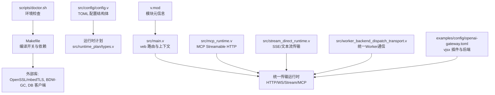
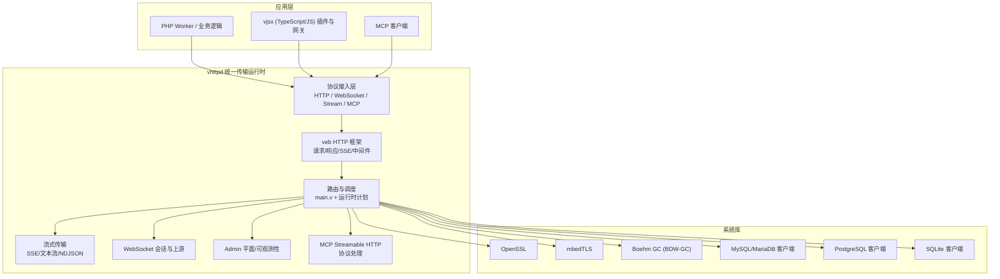
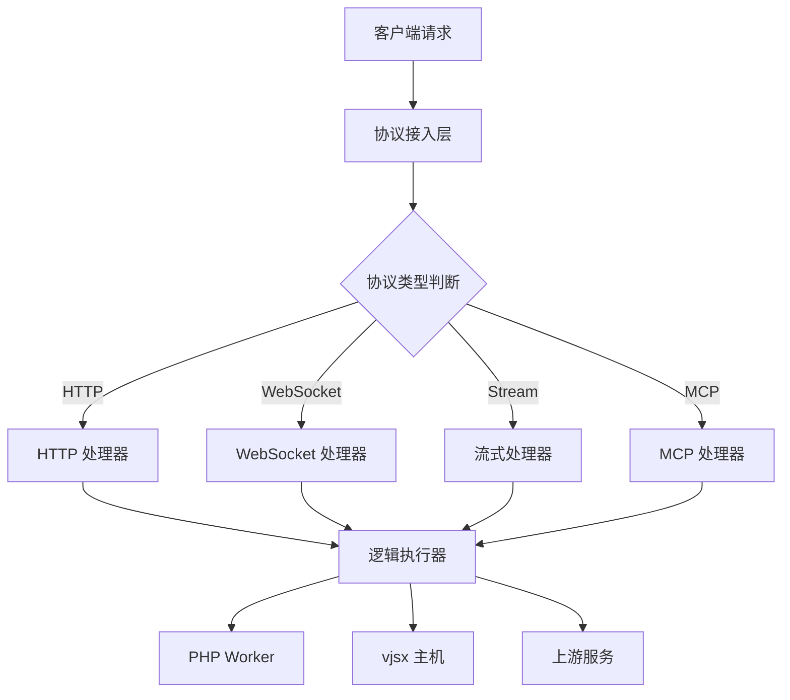
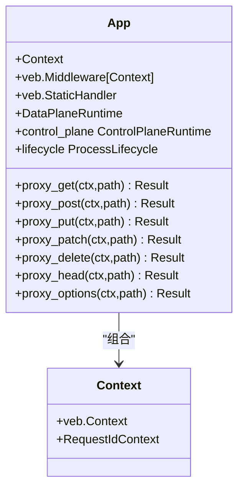
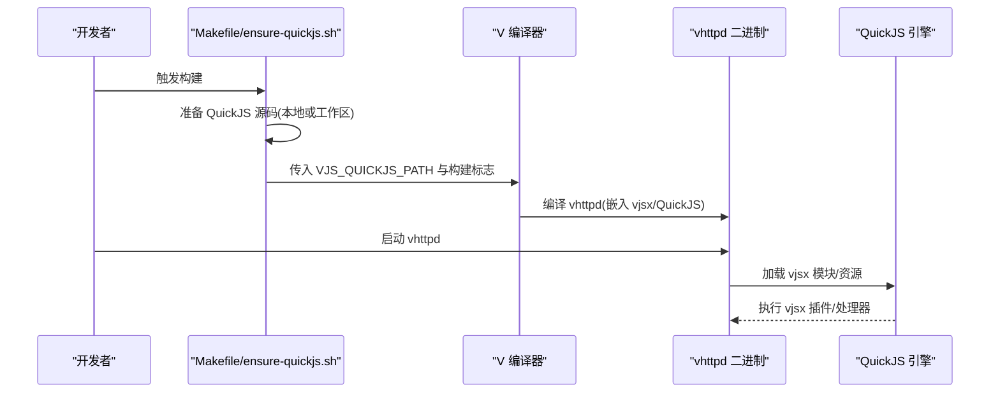
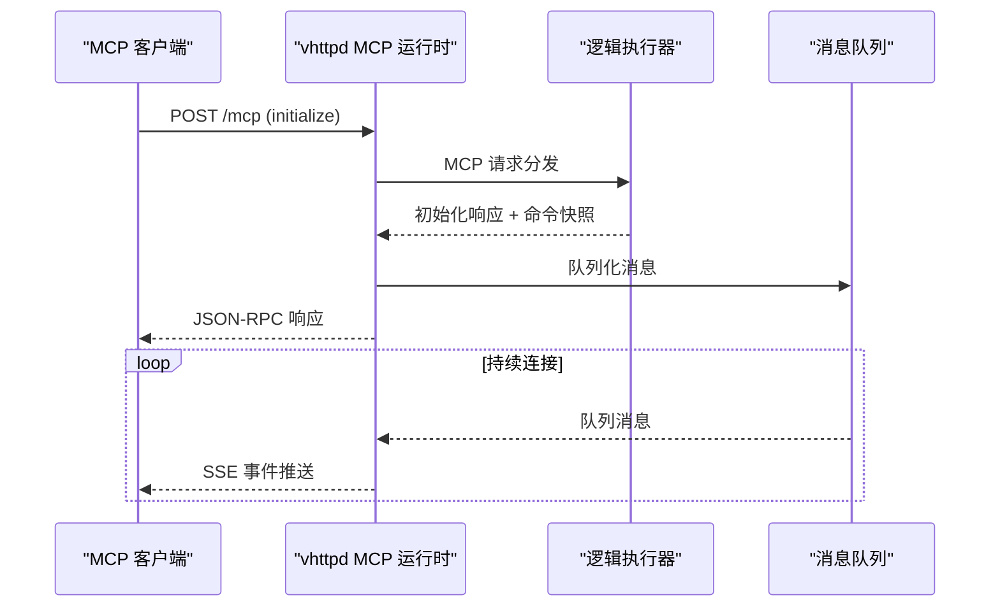
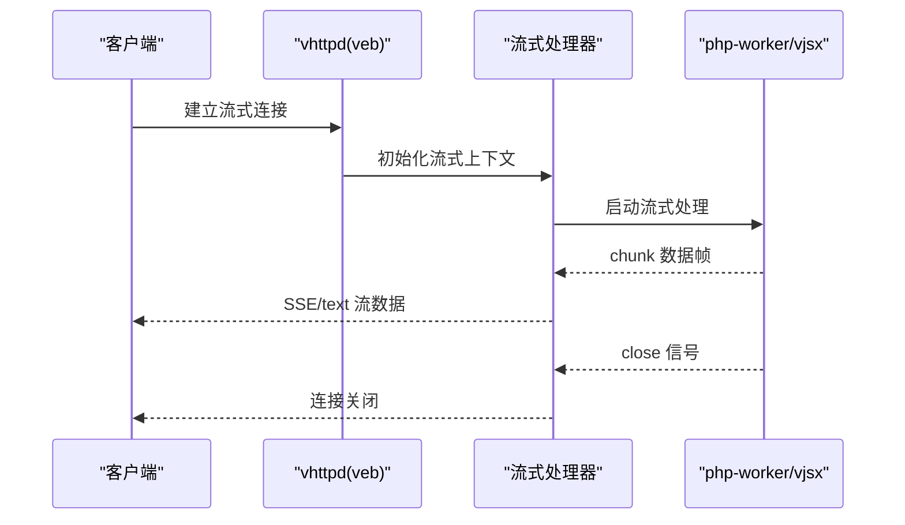
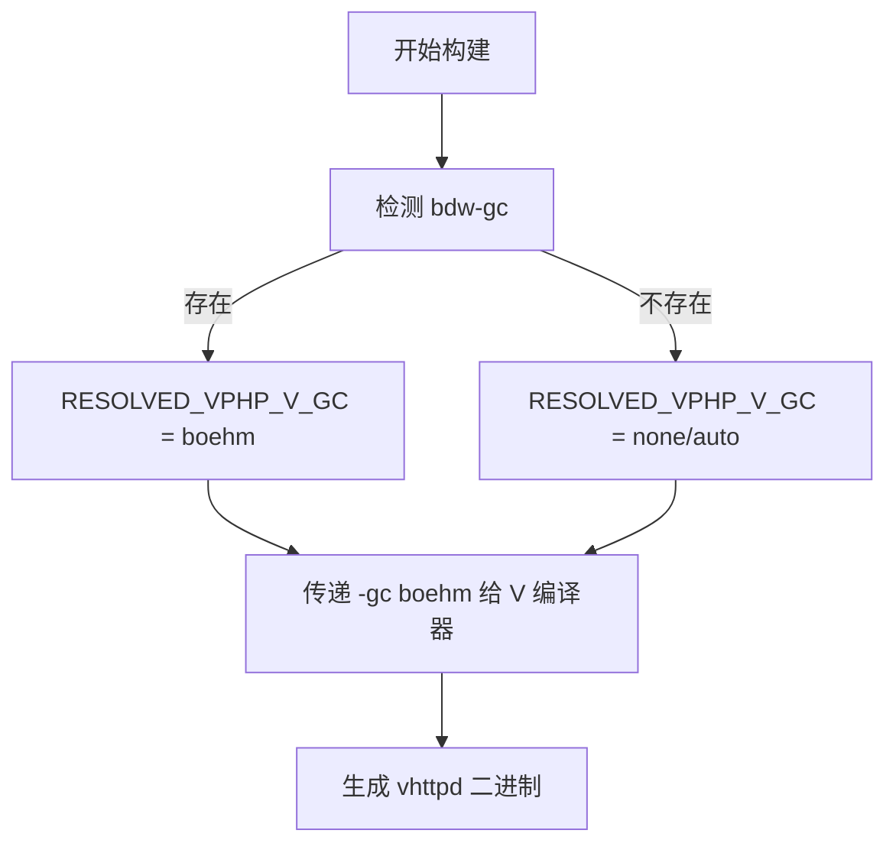
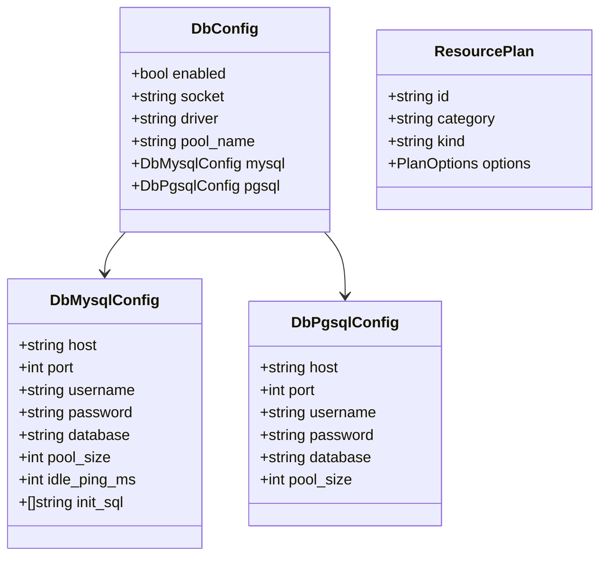
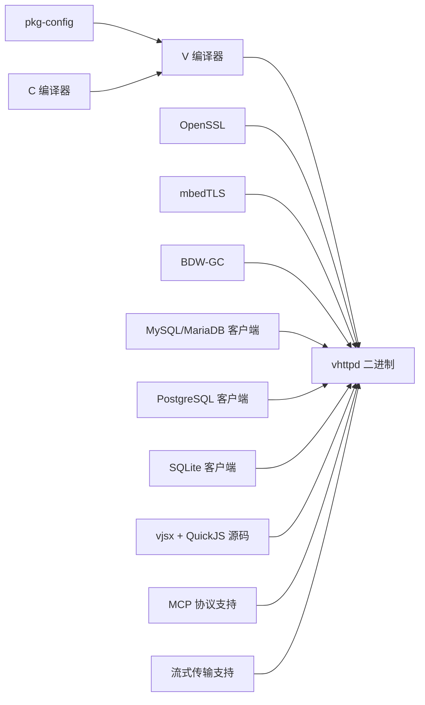

# 技术栈

<cite>
**本文引用的文件**   
- [README.md](file://README.md)
- [index.html](file://index.html)
- [Makefile](file://Makefile)
- [src/main.v](file://src/main.v)
- [v.mod](file://v.mod)
- [scripts/doctor.sh](file://scripts/doctor.sh)
- [src/config/config.v](file://src/config/config.v)
- [src/runtime_plan/types.v](file://src/runtime_plan/types.v)
- [src/mcp_runtime.v](file://src/mcp_runtime.v)
- [src/stream_direct_runtime.v](file://src/stream_direct_runtime.v)
- [src/worker_backend_dispatch_transport.v](file://src/worker_backend_dispatch_transport.v)
- [articles/01-overview.md](file://articles/01-overview.md)
- [examples/README.md](file://examples/README.md)
</cite>

## 更新摘要
**变更内容**   
- 更新了vhttpd作为统一传输运行时的核心定位，强调支持多种协议（HTTP、WebSocket、SSE、文本流、MCP Streamable HTTP）
- 强化了多协议统一接入的设计理念和技术实现
- 新增了MCP Streamable HTTP协议的详细说明
- 更新了架构概览以反映统一传输运行时的特性
- 增强了协议支持和运行时能力的描述

## 目录
1. [简介](#简介)
2. [项目结构](#项目结构)
3. [核心组件](#核心组件)
4. [架构总览](#架构总览)
5. [详细组件分析](#详细组件分析)
6. [依赖关系分析](#依赖关系分析)
7. [性能与内存管理](#性能与内存管理)
8. [构建工具链与环境要求](#构建工具链与环境要求)
9. [故障排查指南](#故障排查指南)
10. [结论](#结论)

## 简介
本技术栈概览聚焦 VHTTPD 的核心技术选型与集成方式，涵盖：
- **统一传输运行时**：vhttpd 不再仅仅是 PHP 应用服务器，而是成为协议和执行宿主，支持多种逻辑模型
- **多协议统一接入**：HTTP、WebSocket、SSE、text stream、MCP Streamable HTTP 的统一 ingress 和调度
- **语言与运行时**：V 语言、veb HTTP 框架、QuickJS（嵌入式 JavaScript 运行时）
- **TLS 支持**：OpenSSL 与 mbedTLS 双后端可选
- **内存管理**：Boehm GC（BDW-GC）作为默认或可选项
- **数据库客户端**：MySQL/MariaDB、PostgreSQL、SQLite（按构建开关启用）
- **构建与分发**：Makefile、pkg-config、CI 打包与二进制分发策略
- **运行期能力**：上游流编排、外部 worker 编排、嵌入式执行器、运行时/管理平面、协议适配器

该文档帮助开发者理解项目的技术基础、版本兼容性、依赖关系与扩展点，特别是 vhttpd 作为统一传输运行时的设计理念。

## 项目结构
从技术栈视角，关键位置如下：
- **入口与路由**：src/main.v 基于 veb 注册路由并委派到数据面运行时
- **配置模型**：src/config/config.v 定义 TOML 配置结构体（含 DB、OpenAI、Bridge 等）
- **运行时计划**：src/runtime_plan/types.v 描述 TLS、资源、引擎、适配器、转换器等运行时对象
- **MCP 运行时**：src/mcp_runtime.v 处理 MCP Streamable HTTP 协议
- **流式传输**：src/stream_direct_runtime.v 实现 SSE 和文本流的直接传输
- **Worker 传输**：src/worker_backend_dispatch_transport.v 提供统一的 worker 通信接口
- **构建脚本**：Makefile 控制编译开关（TLS 后端、DB、GC）、依赖安装与测试
- **环境检查**：scripts/doctor.sh 校验 v、pkg-config、openssl、bdw-gc 等
- **模块元信息**：v.mod 声明模块名与基路径
- **示例配置**：examples/config/openai-gateway.toml 展示 vjsx 插件与后端编排

**图表来源**
- [src/main.v:1-117](file://src/main.v#L1-L117)
- [src/config/config.v:1-55](file://src/config/config.v#L1-L55)
- [src/runtime_plan/types.v:65-155](file://src/runtime_plan/types.v#L65-L155)
- [src/mcp_runtime.v:1-138](file://src/mcp_runtime.v#L1-L138)
- [src/stream_direct_runtime.v:1-48](file://src/stream_direct_runtime.v#L1-L48)
- [src/worker_backend_dispatch_transport.v:47-80](file://src/worker_backend_dispatch_transport.v#L47-L80)
- [Makefile:1-199](file://Makefile#L1-L199)
- [scripts/doctor.sh:1-58](file://scripts/doctor.sh#L1-L58)
- [v.mod:1-7](file://v.mod#L1-L7)
- [examples/config/openai-gateway.toml:1-64](file://examples/config/openai-gateway.toml#L1-L64)

**章节来源**
- [README.md:1-800](file://README.md#L1-L800)
- [index.html:1-668](file://index.html#L1-L668)
- [src/main.v:1-117](file://src/main.v#L1-L117)
- [v.mod:1-7](file://v.mod#L1-L7)

## 核心组件
- **统一传输运行时**
  - vhttpd 现在被视为协议和执行宿主，支持多种逻辑模型：php-worker、vjsx、WebSocket upstream、stream-oriented runtimes
  - 在协议层仍然是 HTTP 服务器，但在此基础上支持 WebSocket、Stream responses（SSE、text stream）
  - 提供统一的 transport runtime，不再需要为不同协议搭建独立服务
- **V 语言与 veb 框架**
  - vhttpd 以 veb 为 HTTP 事实来源，复用 veb.Context、request_id、SSE 等能力，保持核心轻量，专注传输、worker 编排、流式与可观测性
- **QuickJS 嵌入（vjsx）**
  - 通过 vjsx 模块在构建时准备受控的 QuickJS 源码，提供嵌入式 TypeScript/JavaScript 执行器；支持多线程、TS 转译、内嵌资源
- **MCP Streamable HTTP**
  - 完整的 MCP 协议支持，包括 JSON-RPC 请求响应、SSE 会话模式、Session ID 管理、客户端能力协商
- **TLS 后端**
  - 默认 OpenSSL；可通过变量切换至 mbedTLS（保留长连接读超时参数）
- **内存管理**
  - 默认使用 Boehm GC（BDW-GC），由 Makefile 自动探测与注入；也可显式指定
- **数据库客户端**
  - 默认开启 DB 支持（MySQL/MariaDB、PostgreSQL、SQLite），可按需关闭
- **运行时计划与配置**
  - 通过 TOML 配置生成运行时计划（TLS、监听器、引擎、适配器、转换器、策略、提供者等）

**章节来源**
- [README.md:7-83](file://README.md#L7-L83)
- [articles/01-overview.md:138-163](file://articles/01-overview.md#L138-L163)
- [index.html:365-368](file://index.html#L365-L368)
- [README.md:152-174](file://README.md#L152-L174)
- [README.md:249-254](file://README.md#L249-L254)
- [src/mcp_runtime.v:11-138](file://src/mcp_runtime.v#L11-L138)
- [Makefile:1-36](file://Makefile#L1-L36)
- [src/config/config.v:255-311](file://src/config/config.v#L255-L311)
- [src/runtime_plan/types.v:65-155](file://src/runtime_plan/types.v#L65-L155)

## 架构总览
下图展示了 vhttpd 作为统一传输运行时的技术栈分层与交互：V/veb 作为网络与中间件层，QuickJS 作为嵌入式 JS 执行器，MCP 作为协议适配器，OpenSSL/mbedTLS 提供 TLS，Boehm GC 负责内存管理，DB 客户端按需链接。

**图表来源**
- [src/main.v:1-117](file://src/main.v#L1-L117)
- [src/mcp_runtime.v:1-138](file://src/mcp_runtime.v#L1-L138)
- [src/stream_direct_runtime.v:1-48](file://src/stream_direct_runtime.v#L1-L48)
- [Makefile:1-36](file://Makefile#L1-L36)
- [README.md:84-126](file://README.md#L84-L126)

## 详细组件分析

### 统一传输运行时
- **设计原则**
  - vhttpd 不再只是 PHP 应用服务器，而是成为协议和执行宿主
  - 在 HTTP 基础上支持 WebSocket、Stream responses、upstream streaming execution
  - 提供统一的 transport runtime，将 HTTP/WebSocket/stream 连接终止、worker 进程管理、上下游流生命周期管理整合在一起
- **多协议支持**
  - HTTP：传统请求响应模式
  - WebSocket：Phase 1（worker 拥有连接）和 Phase 2（vhttpd 拥有连接，worker 处理短事件）
  - Stream：SSE、text stream、NDJSON 等多种流式传输模式
  - MCP：Streamable HTTP 协议，支持 JSON-RPC 和 SSE 会话模式
- **运行时模式**
  - Plain HTTP：一次性请求 -> 一次性 worker 调用
  - Stream phase 1：worker 拥有实时流
  - Stream dispatch strategy：vhttpd 拥有下游，worker 处理 open/next/close
  - Stream phase 3（UpstreamPlan）：vhttpd 拥有下游和上游
  - WebSocket phase 1：worker 拥有实时 websocket 连接
  - WebSocket phase 2（websocket_dispatch）：vhttpd 拥有 websocket 连接，worker 处理短事件

**图表来源**
- [README.md:191-209](file://README.md#L191-L209)
- [articles/01-overview.md:144-163](file://articles/01-overview.md#L144-L163)

**章节来源**
- [README.md:7-83](file://README.md#L7-L83)
- [articles/01-overview.md:138-163](file://articles/01-overview.md#L138-L163)
- [README.md:191-209](file://README.md#L191-L209)

### V 语言与 veb 框架
- **设计原则**
  - vhttpd 尽量贴近 veb 与 V 标准 HTTP 能力，不重复造轮子；将重点放在传输、worker 编排、流生命周期与可观测性
- **关键实现**
  - main.v 中 App 组合 veb.Middleware 与 veb.StaticHandler，并通过 Context 注入 request_id
  - 路由方法代理到 HttpIngressRuntime.route，统一进入数据面运行时
- **扩展建议**
  - 优先复用 veb.sse、veb.request_id、静态资源处理等成熟能力；避免替换 vslim 的动态路由模型

**图表来源**
- [src/main.v:1-117](file://src/main.v#L1-L117)

**章节来源**
- [README.md:152-174](file://README.md#L152-L174)
- [src/main.v:1-117](file://src/main.v#L1-L117)

### QuickJS 嵌入（vjsx）
- **构建与依赖**
  - Makefile 通过 ensure-quickjs.sh 准备受控 QuickJS 源码；本地优先使用 ../quickjs，否则写入工作区 .deps/quickjs
  - 构建标志包含 build_quickjs，并在 CI 中以 VPHP_V_GC=boehm 构建
- **运行期能力**
  - 支持 TS 转译、多线程执行、内嵌资源；提供 vjsx Facade API（runtime、host api、snapshot 等）
- **配置与编排**
  - 示例 openai-gateway.toml 展示 vjsx 插件与后端编排，engine.kind=vjsx，thread_count 可调

**图表来源**
- [Makefile:21-26](file://Makefile#L21-L26)
- [Makefile:96-103](file://Makefile#L96-L103)
- [README.md:249-254](file://README.md#L249-L254)
- [examples/config/openai-gateway.toml:1-64](file://examples/config/openai-gateway.toml#L1-L64)

**章节来源**
- [Makefile:21-26](file://Makefile#L21-L26)
- [README.md:249-254](file://README.md#L249-L254)
- [examples/config/openai-gateway.toml:1-64](file://examples/config/openai-gateway.toml#L1-L64)

### MCP Streamable HTTP 协议支持
- **协议实现**
  - 完整的 MCP Streamable HTTP 支持，包括 POST /mcp 的 JSON-RPC 请求响应
  - GET /mcp 的 SSE 会话模式，支持 Mcp-Session-Id 绑定
  - 协议版本协商、客户端能力检测、Session 生命周期管理
- **核心功能**
  - JSON-RPC 请求处理：initialize、tools/list、采样能力等
  - SSE 消息队列：异步消息推送、错误处理、状态管理
  - 安全验证：Origin 检查、协议版本验证、请求体格式校验
- **集成特性**
  - 与现有 worker 系统无缝集成，支持 php-worker 和 vjsx 执行器
  - 命令快照机制：worker 返回的命令同步执行
  - 与飞书等上游服务的桥接支持

**图表来源**
- [src/mcp_runtime.v:11-138](file://src/mcp_runtime.v#L11-L138)
- [examples/README.md:218-266](file://examples/README.md#L218-L266)

**章节来源**
- [src/mcp_runtime.v:1-138](file://src/mcp_runtime.v#L1-L138)
- [examples/README.md:218-266](file://examples/README.md#L218-L266)
- [README.md:722-744](file://README.md#L722-L744)

### 流式传输支持
- **SSE 传输**
  - 通过 veb.sse 与 worker stream frames 实现 token streaming 场景
  - 支持 direct SSE 模式，直接处理 Unix socket 连接
- **文本流传输**
  - 统一的 text stream 支持，适用于 AI token streaming 等场景
  - 标准化的 start/chunk/error/end 传输语义
- **参考实现**
  - 文档明确使用 net.websocket、sync 通道与 veb.sse 作为参考

**图表来源**
- [src/stream_direct_runtime.v:11-48](file://src/stream_direct_runtime.v#L11-L48)
- [README.md:1447-1462](file://README.md#L1447-L1462)

**章节来源**
- [src/stream_direct_runtime.v:1-48](file://src/stream_direct_runtime.v#L1-L48)
- [README.md:1447-1462](file://README.md#L1447-L1462)

### TLS 支持（OpenSSL / mbedTLS）
- **默认后端**
  - 默认使用 OpenSSL（-d use_openssl）
- **备选后端**
  - 通过 V_TLS_BACKEND=mbedtls 切换至 mbedTLS，并设置长连接读超时参数
- **运行时计划**
  - TlsPlan/TlsCertificatePlan 描述证书与多主机绑定

**图表来源**
- [Makefile:11-16](file://Makefile#L11-L16)
- [README.md:267-271](file://README.md#L267-L271)
- [src/runtime_plan/types.v:65-78](file://src/runtime_plan/types.v#L65-L78)

**章节来源**
- [Makefile:11-16](file://Makefile#L11-L16)
- [README.md:267-271](file://README.md#L267-L271)
- [src/runtime_plan/types.v:65-78](file://src/runtime_plan/types.v#L65-L78)

### 内存管理（Boehm GC）
- **自动探测与注入**
  - Makefile 通过 pkg-config --exists bdw-gc 检测，若存在则启用 Boehm GC；也支持显式 VPHP_V_GC 覆盖
- **运行期影响**
  - 降低手动内存管理负担，提升开发效率与稳定性

**图表来源**
- [Makefile:7-10](file://Makefile#L7-L10)
- [scripts/doctor.sh:49-52](file://scripts/doctor.sh#L49-L52)

**章节来源**
- [Makefile:7-10](file://Makefile#L7-L10)
- [scripts/doctor.sh:49-52](file://scripts/doctor.sh#L49-L52)

### 数据库客户端集成
- **构建开关**
  - WITH_DB=1 默认启用 DB 支持；可设置为 0 关闭
- **配置结构**
  - DbConfig/DbMysqlConfig/DbPgsqlConfig 定义连接池、初始化 SQL、空闲心跳等
- **运行时计划**
  - ResourcePlan 用于抽象 DB 等资源引用

**图表来源**
- [src/config/config.v:275-311](file://src/config/config.v#L275-L311)
- [src/runtime_plan/types.v:103-109](file://src/runtime_plan/types.v#L103-L109)
- [Makefile:31-35](file://Makefile#L31-L35)

**章节来源**
- [src/config/config.v:275-311](file://src/config/config.v#L275-L311)
- [src/runtime_plan/types.v:103-109](file://src/runtime_plan/types.v#L103-L109)
- [Makefile:31-35](file://Makefile#L31-L35)

## 依赖关系分析
- **构建期依赖**
  - V 编译器、pkg-config、C 编译器
  - OpenSSL 或 mbedTLS（二选一）
  - BDW-GC（Boehm GC）
  - DB 客户端库（MySQL/MariaDB、PostgreSQL、SQLite，按 WITH_DB 开关）
  - vjsx 模块与受控 QuickJS 源码
- **运行期依赖**
  - 二进制优先加载打包的 runtime/libs（libssl/libcrypto/libgc/libmysqlclient/libpq 等）
  - 环境变量与 TOML 配置驱动行为（如 VJSX_ASSET_ROOT、VHTTPD_CONFIG）

**图表来源**
- [Makefile:1-36](file://Makefile#L1-L36)
- [README.md:332-346](file://README.md#L332-L346)
- [scripts/doctor.sh:49-52](file://scripts/doctor.sh#L49-L52)

**章节来源**
- [Makefile:1-36](file://Makefile#L1-L36)
- [README.md:332-346](file://README.md#L332-L346)
- [scripts/doctor.sh:49-52](file://scripts/doctor.sh#L49-L52)

## 性能与内存管理
- **内存管理**
  - 启用 Boehm GC 可降低手动管理成本，适合快速迭代与复杂对象图；生产环境可根据负载评估是否启用
- **并发与流式**
  - vjsx 多线程执行；WebSocket Phase 2 解耦连接与 worker 生命周期，提高吞吐与可扩展性
  - 统一的流式传输支持，优化 AI token streaming 等场景的性能
- **日志与追踪**
  - Admin 平面与事件日志便于定位问题；trace_id/request_id 贯穿请求链路
  - MCP 协议支持完整的请求追踪和会话管理

**章节来源**
- [Makefile:7-10](file://Makefile#L7-L10)
- [README.md:1447-1462](file://README.md#L1447-L1462)
- [src/main.v:25-56](file://src/main.v#L25-L56)
- [src/mcp_runtime.v:11-138](file://src/mcp_runtime.v#L11-L138)

## 构建工具链与环境要求
- **构建目标**
  - make vhttpd：默认启用 OpenSSL 与 DB 支持
  - make prod/build-prod：启用 -prod 优化
  - make deps-core/deps-vjsx/deps-db/deps-full：一键安装依赖
  - make doctor：检查 v、pkg-config、openssl、bdw-gc 及 vjsx 模块
- **环境变量与开关**
  - V_TLS_BACKEND：选择 TLS 后端
  - WITH_DB：控制 DB 支持
  - VPHP_V_GC：强制 GC 策略
  - VJS_QUICKJS_PATH：指向 QuickJS 源码
- **分发与运行**
  - 推荐分发打包工件，内含 runtime/libs；用户仅需 core/db 运行时配置
  - 通过 systemd/launchd 前台运行，实例化多配置

**章节来源**
- [Makefile:96-123](file://Makefile#L96-L123)
- [README.md:256-271](file://README.md#L256-L271)
- [README.md:376-419](file://README.md#L376-L419)
- [scripts/doctor.sh:1-58](file://scripts/doctor.sh#L1-L58)

## 故障排查指南
- **常见环境问题**
  - 缺少 v/pkg-config/OpenSSL/BDW-GC：使用 make doctor 诊断并按提示安装
  - vjsx 模块缺失：先执行 make deps-vjsx 确保 vjsx 与 QuickJS 源码就绪
  - TLS 后端不一致：确认 V_TLS_BACKEND 与系统库匹配
  - DB 客户端缺失：根据错误提示安装对应客户端库或使用打包工件
- **配置校验**
  - 路径解析失败：检查 TOML 中的 paths.root 与相对路径展开
  - 端口冲突/权限不足：调整 server.host/server.port 或进程用户
- **MCP 协议问题**
  - 协议版本不匹配：检查 MCP-Protocol-Version 头
  - Session 管理异常：验证 Mcp-Session-Id 头的正确性
  - Origin 限制：确认跨域配置正确

**章节来源**
- [scripts/doctor.sh:1-58](file://scripts/doctor.sh#L1-L58)
- [README.md:210-271](file://README.md#L210-L271)
- [src/config/config.v:1-55](file://src/config/config.v#L1-L55)
- [src/mcp_runtime.v:27-30](file://src/mcp_runtime.v#L27-L30)

## 结论
VHTTPD 以 V/veb 为核心，结合 QuickJS 嵌入式执行器、OpenSSL/mbedTLS 与 Boehm GC，形成高性能、可扩展且易于运维的统一传输运行时。通过统一的运行时计划与 TOML 配置，vhttpd 将 HTTP/WebSocket/SSE/MCP 与 PHP/vjsx 执行器整合在同一进程内，既满足现代 AI 与实时通信需求，又兼顾传统 PHP 生态的平滑演进。

**统一传输运行时的核心价值**：
- **协议统一**：不再需要为不同协议搭建独立服务，一个 runtime 承载所有协议
- **执行器灵活**：PHP worker 承载成熟业务，vjsx 处理快速变化的协议适配
- **流式优先**：一等公民的流式支持，特别适合 AI token streaming 场景
- **可观测运维**：完整的 admin plane 暴露运行时状态，便于监控和管理

开发者可在不破坏既有业务的前提下，逐步引入 vjsx 插件与流式能力，获得更一致的运行时体验与更强的可观测性。vhttpd 的设计使其成为构建数字生态系统（Digital Ecology Runtime）的理想选择。

**章节来源**
- [README.md:7-83](file://README.md#L7-L83)
- [articles/01-overview.md:138-163](file://articles/01-overview.md#L138-L163)
- [index.html:365-368](file://index.html#L365-L368)
- [README.md:191-209](file://README.md#L191-L209)