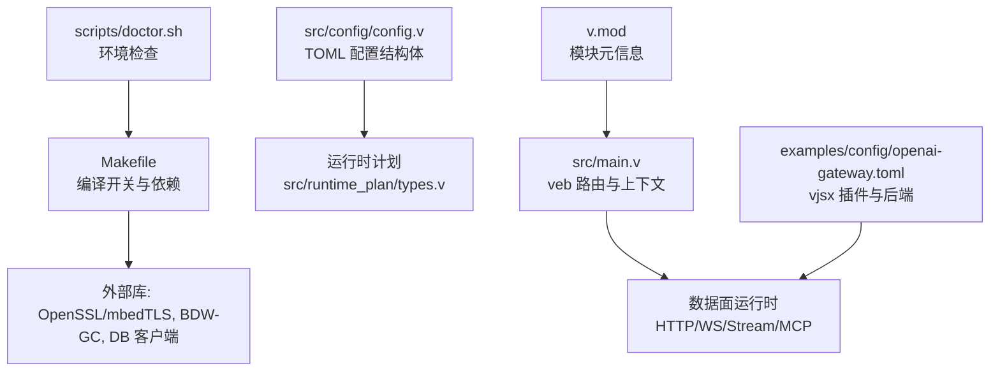
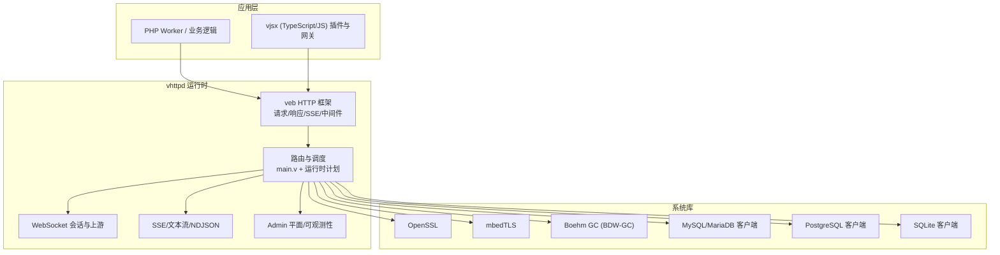
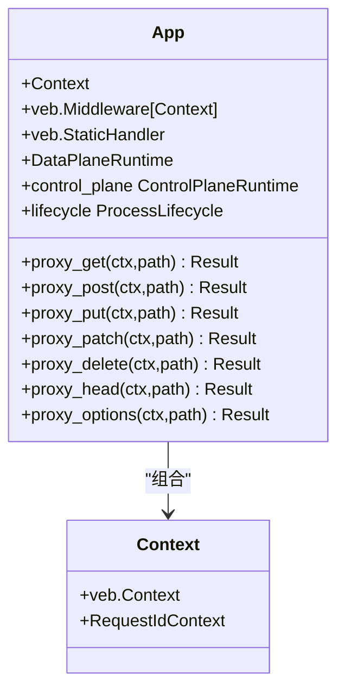
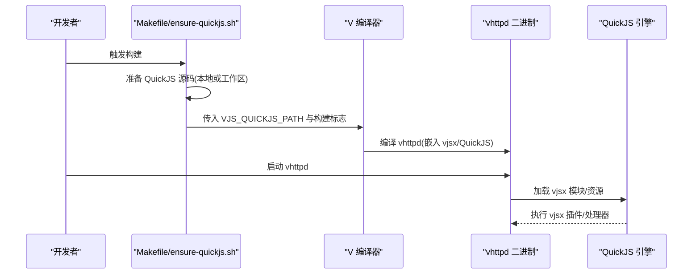
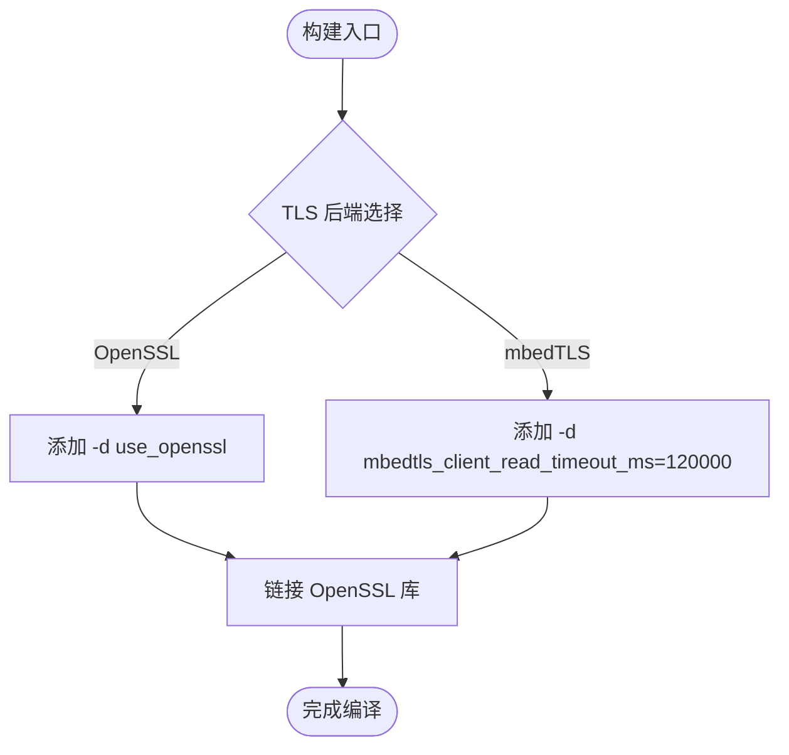
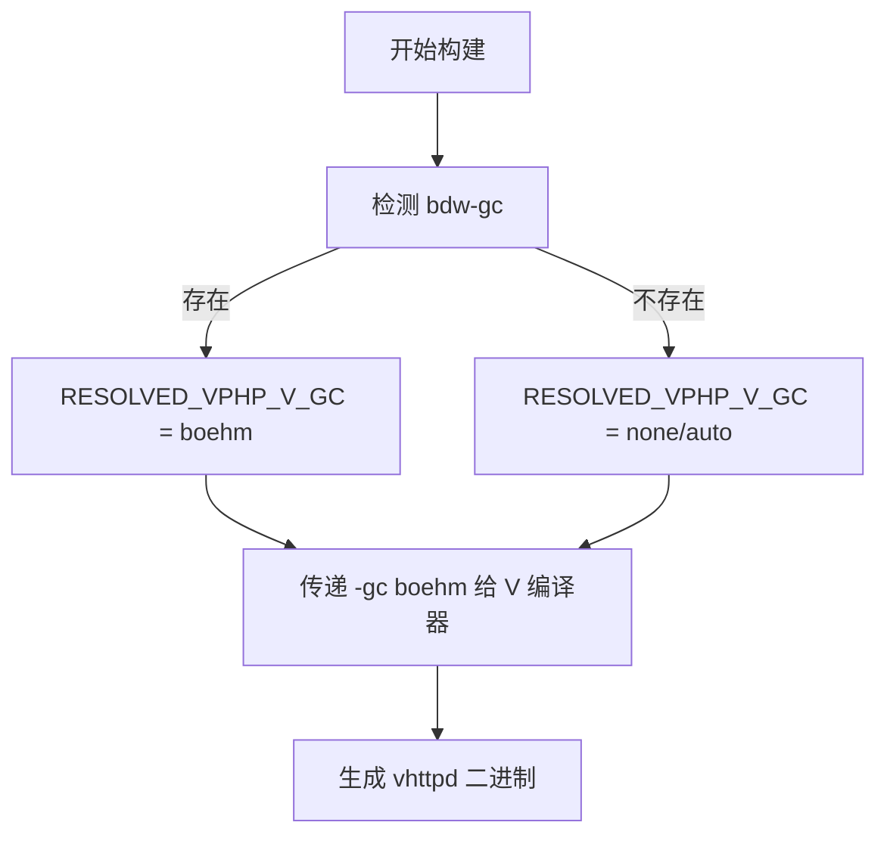
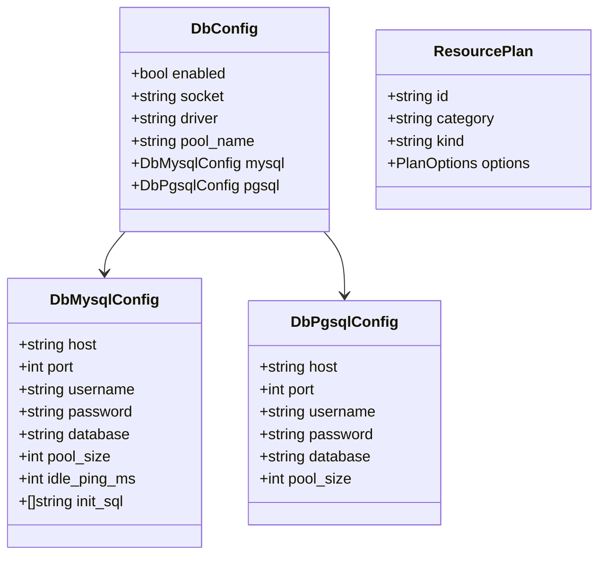
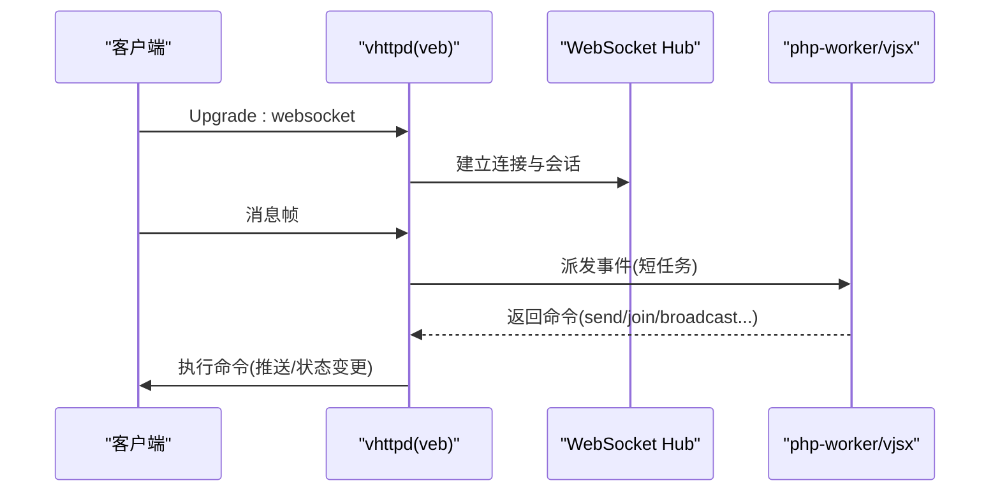
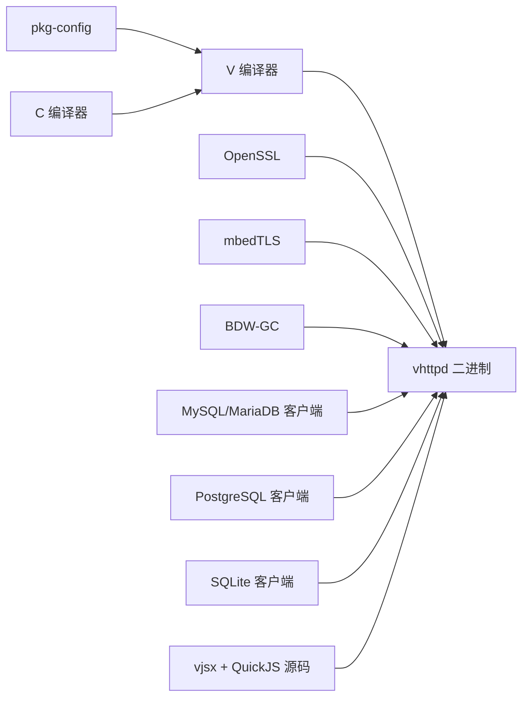

# 技术栈

<cite>
**本文引用的文件**   
- [README.md](file://README.md)
- [Makefile](file://Makefile)
- [src/main.v](file://src/main.v)
- [v.mod](file://v.mod)
- [scripts/doctor.sh](file://scripts/doctor.sh)
- [src/config/config.v](file://src/config/config.v)
- [src/runtime_plan/types.v](file://src/runtime_plan/types.v)
- [docs/VEB_REUSE_1_1_PLAN.md](file://docs/VEB_REUSE_1_1_PLAN.md)
- [docs/WEBSOCKET_PHASE2_IMPLEMENTATION_PLAN.md](file://docs/WEBSOCKET_PHASE2_IMPLEMENTATION_PLAN.md)
- [examples/config/openai-gateway.toml](file://examples/config/openai-gateway.toml)
</cite>

## 目录
1. [简介](#简介)
2. [项目结构](#项目结构)
3. [核心组件](#核心组件)
4. [架构总览](#架构总览)
5. [详细组件分析](#详细组件分析)
6. [依赖关系分析](#依赖关系分析)
7. [性能与内存管理](#性能与内存管理)
8. [构建工具链与环境要求](#构建工具链与环境要求)
9. [故障排查指南](#故障排查指南)
10. [结论](#结论)

## 简介
本技术栈概览聚焦 VHTTPD 的核心技术选型与集成方式，涵盖：
- 语言与运行时：V 语言、veb HTTP 框架、QuickJS（嵌入式 JavaScript 运行时）
- TLS 支持：OpenSSL 与 mbedTLS 双后端可选
- 内存管理：Boehm GC（BDW-GC）作为默认或可选项
- 数据库客户端：MySQL/MariaDB、PostgreSQL、SQLite（按构建开关启用）
- 构建与分发：Makefile、pkg-config、CI 打包与二进制分发策略
- 运行期能力：HTTP/WebSocket/SSE/MCP 统一接入，PHP worker 与 vjsx 执行器并存

该文档帮助开发者理解项目的技术基础、版本兼容性、依赖关系与扩展点。

## 项目结构
从技术栈视角，关键位置如下：
- 入口与路由：src/main.v 基于 veb 注册路由并委派到数据面运行时
- 配置模型：src/config/config.v 定义 TOML 配置结构体（含 DB、OpenAI、Bridge 等）
- 运行时计划：src/runtime_plan/types.v 描述 TLS、资源、引擎、适配器、转换器等运行时对象
- 构建脚本：Makefile 控制编译开关（TLS 后端、DB、GC）、依赖安装与测试
- 环境检查：scripts/doctor.sh 校验 v、pkg-config、openssl、bdw-gc 等
- 模块元信息：v.mod 声明模块名与基路径
- 示例配置：examples/config/openai-gateway.toml 展示 vjsx 插件与后端编排

图表来源
- [src/main.v:1-117](file://src/main.v#L1-L117)
- [src/config/config.v:1-55](file://src/config/config.v#L1-L55)
- [src/runtime_plan/types.v:65-155](file://src/runtime_plan/types.v#L65-L155)
- [Makefile:1-199](file://Makefile#L1-L199)
- [scripts/doctor.sh:1-58](file://scripts/doctor.sh#L1-L58)
- [v.mod:1-7](file://v.mod#L1-L7)
- [examples/config/openai-gateway.toml:1-64](file://examples/config/openai-gateway.toml#L1-L64)

章节来源
- [README.md:1-41](file://README.md#L1-L41)
- [src/main.v:1-117](file://src/main.v#L1-L117)
- [v.mod:1-7](file://v.mod#L1-L7)

## 核心组件
- V 语言与 veb 框架
  - vhttpd 以 veb 为 HTTP 事实来源，复用 veb.Context、request_id、SSE 等能力，保持核心轻量，专注传输、worker 编排、流式与可观测性
- QuickJS 嵌入（vjsx）
  - 通过 vjsx 模块在构建时准备受控的 QuickJS 源码，提供嵌入式 TypeScript/JavaScript 执行器；支持多线程、TS 转译、内嵌资源
- TLS 后端
  - 默认 OpenSSL；可通过变量切换至 mbedTLS（保留长连接读超时参数）
- 内存管理
  - 默认使用 Boehm GC（BDW-GC），由 Makefile 自动探测与注入；也可显式指定
- 数据库客户端
  - 默认开启 DB 支持（MySQL/MariaDB、PostgreSQL、SQLite），可按需关闭
- 运行时计划与配置
  - 通过 TOML 配置生成运行时计划（TLS、监听器、引擎、适配器、转换器、策略、提供者等）

章节来源
- [README.md:1416-1462](file://README.md#L1416-L1462)
- [README.md:210-271](file://README.md#L210-L271)
- [Makefile:1-36](file://Makefile#L1-L36)
- [src/config/config.v:255-311](file://src/config/config.v#L255-L311)
- [src/runtime_plan/types.v:65-155](file://src/runtime_plan/types.v#L65-L155)

## 架构总览
下图展示了 vhttpd 的技术栈分层与交互：V/veb 作为网络与中间件层，QuickJS 作为嵌入式 JS 执行器，OpenSSL/mbedTLS 提供 TLS，Boehm GC 负责内存管理，DB 客户端按需链接。

图表来源
- [src/main.v:1-117](file://src/main.v#L1-L117)
- [Makefile:1-36](file://Makefile#L1-L36)
- [README.md:210-271](file://README.md#L210-L271)

## 详细组件分析

### V 语言与 veb 框架
- 设计原则
  - vhttpd 尽量贴近 veb 与 V 标准 HTTP 能力，不重复造轮子；将重点放在传输、worker 编排、流生命周期与可观测性
- 关键实现
  - main.v 中 App 组合 veb.Middleware 与 veb.StaticHandler，并通过 Context 注入 request_id
  - 路由方法代理到 HttpIngressRuntime.route，统一进入数据面运行时
- 扩展建议
  - 优先复用 veb.sse、veb.request_id、静态资源处理等成熟能力；避免替换 vslim 的动态路由模型

图表来源
- [src/main.v:1-117](file://src/main.v#L1-L117)

章节来源
- [README.md:1-41](file://README.md#L1-L41)
- [docs/VEB_REUSE_1_1_PLAN.md:44-85](file://docs/VEB_REUSE_1_1_PLAN.md#L44-L85)
- [src/main.v:1-117](file://src/main.v#L1-L117)

### QuickJS 嵌入（vjsx）
- 构建与依赖
  - Makefile 通过 ensure-quickjs.sh 准备受控 QuickJS 源码；本地优先使用 ../quickjs，否则写入工作区 .deps/quickjs
  - 构建标志包含 build_quickjs，并在 CI 中以 VPHP_V_GC=boehm 构建
- 运行期能力
  - 支持 TS 转译、多线程执行、内嵌资源；提供 vjsx Facade API（runtime、host api、snapshot 等）
- 配置与编排
  - 示例 openai-gateway.toml 展示 vjsx 插件与后端编排，engine.kind=vjsx，thread_count 可调

图表来源
- [Makefile:21-26](file://Makefile#L21-L26)
- [Makefile:96-103](file://Makefile#L96-L103)
- [README.md:249-254](file://README.md#L249-L254)
- [examples/config/openai-gateway.toml:1-64](file://examples/config/openai-gateway.toml#L1-L64)

章节来源
- [Makefile:21-26](file://Makefile#L21-L26)
- [README.md:249-254](file://README.md#L249-L254)
- [docs/VJSX_FACADE_REFERENCE.md:1-70](file://docs/VJSX_FACADE_REFERENCE.md#L1-L70)
- [examples/config/openai-gateway.toml:1-64](file://examples/config/openai-gateway.toml#L1-L64)

### TLS 支持（OpenSSL / mbedTLS）
- 默认后端
  - 默认使用 OpenSSL（-d use_openssl）
- 备选后端
  - 通过 V_TLS_BACKEND=mbedtls 切换至 mbedTLS，并设置长连接读超时参数
- 运行时计划
  - TlsPlan/TlsCertificatePlan 描述证书与多主机绑定

图表来源
- [Makefile:11-16](file://Makefile#L11-L16)
- [README.md:267-271](file://README.md#L267-L271)
- [src/runtime_plan/types.v:65-78](file://src/runtime_plan/types.v#L65-L78)

章节来源
- [Makefile:11-16](file://Makefile#L11-L16)
- [README.md:267-271](file://README.md#L267-L271)
- [src/runtime_plan/types.v:65-78](file://src/runtime_plan/types.v#L65-L78)

### 内存管理（Boehm GC）
- 自动探测与注入
  - Makefile 通过 pkg-config --exists bdw-gc 检测，若存在则启用 Boehm GC；也支持显式 VPHP_V_GC 覆盖
- 运行期影响
  - 降低手动内存管理负担，提升开发效率与稳定性

图表来源
- [Makefile:7-10](file://Makefile#L7-L10)
- [scripts/doctor.sh:49-52](file://scripts/doctor.sh#L49-L52)

章节来源
- [Makefile:7-10](file://Makefile#L7-L10)
- [scripts/doctor.sh:49-52](file://scripts/doctor.sh#L49-L52)

### 数据库客户端集成
- 构建开关
  - WITH_DB=1 默认启用 DB 支持；可设置为 0 关闭
- 配置结构
  - DbConfig/DbMysqlConfig/DbPgsqlConfig 定义连接池、初始化 SQL、空闲心跳等
- 运行时计划
  - ResourcePlan 用于抽象 DB 等资源引用

图表来源
- [src/config/config.v:275-311](file://src/config/config.v#L275-L311)
- [src/runtime_plan/types.v:103-109](file://src/runtime_plan/types.v#L103-L109)
- [Makefile:31-35](file://Makefile#L31-L35)

章节来源
- [src/config/config.v:275-311](file://src/config/config.v#L275-L311)
- [src/runtime_plan/types.v:103-109](file://src/runtime_plan/types.v#L103-L109)
- [Makefile:31-35](file://Makefile#L31-L35)

### WebSocket 与流式协议
- WebSocket Phase 2
  - vhttpd 拥有连接，worker 仅处理短事件；通过命令列表驱动发送/加入房间/广播等
- SSE/文本流
  - 通过 veb.sse 与 worker stream frames 实现 token streaming 场景
- 参考实现
  - 文档明确使用 net.websocket、sync 通道与 veb.sse 作为参考

图表来源
- [docs/WEBSOCKET_PHASE2_IMPLEMENTATION_PLAN.md:51-121](file://docs/WEBSOCKET_PHASE2_IMPLEMENTATION_PLAN.md#L51-L121)
- [README.md:1447-1462](file://README.md#L1447-L1462)

章节来源
- [docs/WEBSOCKET_PHASE2_IMPLEMENTATION_PLAN.md:51-121](file://docs/WEBSOCKET_PHASE2_IMPLEMENTATION_PLAN.md#L51-L121)
- [README.md:1447-1462](file://README.md#L1447-L1462)

## 依赖关系分析
- 构建期依赖
  - V 编译器、pkg-config、C 编译器
  - OpenSSL 或 mbedTLS（二选一）
  - BDW-GC（Boehm GC）
  - DB 客户端库（MySQL/MariaDB、PostgreSQL、SQLite，按 WITH_DB 开关）
  - vjsx 模块与受控 QuickJS 源码
- 运行期依赖
  - 二进制优先加载打包的 runtime/libs（libssl/libcrypto/libgc/libmysqlclient/libpq 等）
  - 环境变量与 TOML 配置驱动行为（如 VJSX_ASSET_ROOT、VHTTPD_CONFIG）

图表来源
- [Makefile:1-36](file://Makefile#L1-L36)
- [README.md:332-346](file://README.md#L332-L346)
- [scripts/doctor.sh:49-52](file://scripts/doctor.sh#L49-L52)

章节来源
- [Makefile:1-36](file://Makefile#L1-L36)
- [README.md:332-346](file://README.md#L332-L346)
- [scripts/doctor.sh:49-52](file://scripts/doctor.sh#L49-L52)

## 性能与内存管理
- 内存管理
  - 启用 Boehm GC 可降低手动管理成本，适合快速迭代与复杂对象图；生产环境可根据负载评估是否启用
- 并发与流式
  - vjsx 多线程执行；WebSocket Phase 2 解耦连接与 worker 生命周期，提高吞吐与可扩展性
- 日志与追踪
  - Admin 平面与事件日志便于定位问题；trace_id/request_id 贯穿请求链路

章节来源
- [Makefile:7-10](file://Makefile#L7-L10)
- [docs/WEBSOCKET_PHASE2_IMPLEMENTATION_PLAN.md:51-121](file://docs/WEBSOCKET_PHASE2_IMPLEMENTATION_PLAN.md#L51-L121)
- [src/main.v:25-56](file://src/main.v#L25-L56)

## 构建工具链与环境要求
- 构建目标
  - make vhttpd：默认启用 OpenSSL 与 DB 支持
  - make prod/build-prod：启用 -prod 优化
  - make deps-core/deps-vjsx/deps-db/deps-full：一键安装依赖
  - make doctor：检查 v、pkg-config、openssl、bdw-gc 及 vjsx 模块
- 环境变量与开关
  - V_TLS_BACKEND：选择 TLS 后端
  - WITH_DB：控制 DB 支持
  - VPHP_V_GC：强制 GC 策略
  - VJS_QUICKJS_PATH：指向 QuickJS 源码
- 分发与运行
  - 推荐分发打包工件，内含 runtime/libs；用户仅需 core/db 运行时配置
  - 通过 systemd/launchd 前台运行，实例化多配置

章节来源
- [Makefile:96-123](file://Makefile#L96-L123)
- [README.md:256-271](file://README.md#L256-L271)
- [README.md:376-419](file://README.md#L376-L419)
- [scripts/doctor.sh:1-58](file://scripts/doctor.sh#L1-L58)

## 故障排查指南
- 常见环境问题
  - 缺少 v/pkg-config/OpenSSL/BDW-GC：使用 make doctor 诊断并按提示安装
  - vjsx 模块缺失：先执行 make deps-vjsx 确保 vjsx 与 QuickJS 源码就绪
  - TLS 后端不一致：确认 V_TLS_BACKEND 与系统库匹配
  - DB 客户端缺失：根据错误提示安装对应客户端库或使用打包工件
- 配置校验
  - 路径解析失败：检查 TOML 中的 paths.root 与相对路径展开
  - 端口冲突/权限不足：调整 server.host/server.port 或进程用户

章节来源
- [scripts/doctor.sh:1-58](file://scripts/doctor.sh#L1-L58)
- [README.md:210-271](file://README.md#L210-L271)
- [src/config/config.v:1-55](file://src/config/config.v#L1-L55)

## 结论
VHTTPD 以 V/veb 为核心，结合 QuickJS 嵌入式执行器、OpenSSL/mbedTLS 与 Boehm GC，形成高性能、可扩展且易于运维的传输运行时。通过统一的运行时计划与 TOML 配置，vhttpd 将 HTTP/WebSocket/SSE/MCP 与 PHP/vjsx 执行器整合在同一进程内，既满足现代 AI 与实时通信需求，又兼顾传统 PHP 生态的平滑演进。开发者可在不破坏既有业务的前提下，逐步引入 vjsx 插件与流式能力，获得更一致的运行时体验与更强的可观测性。