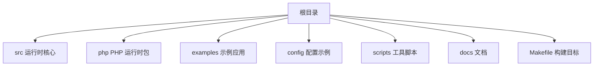
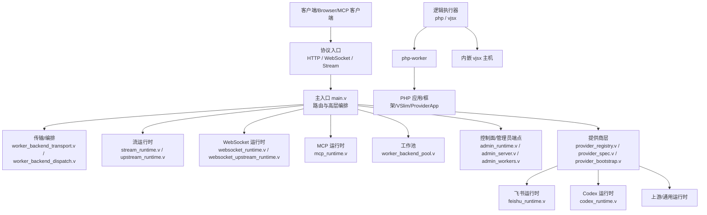
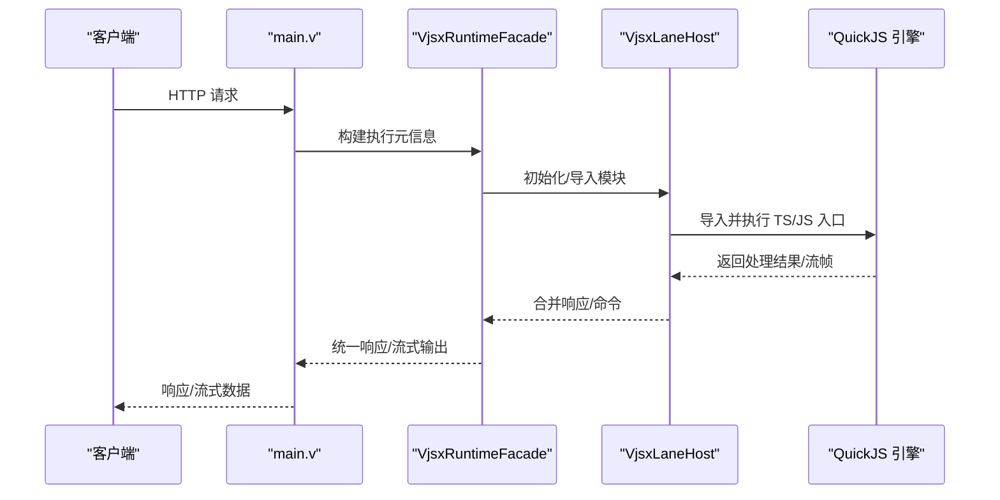
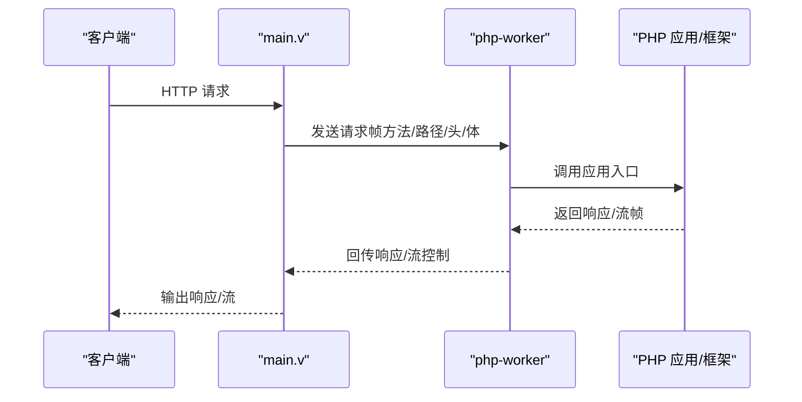
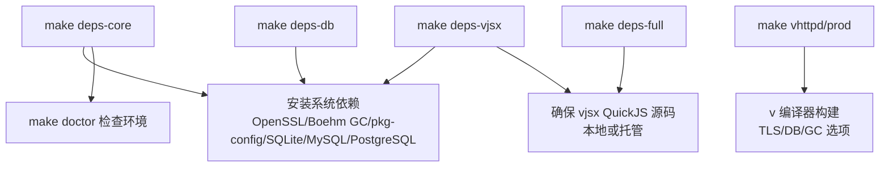
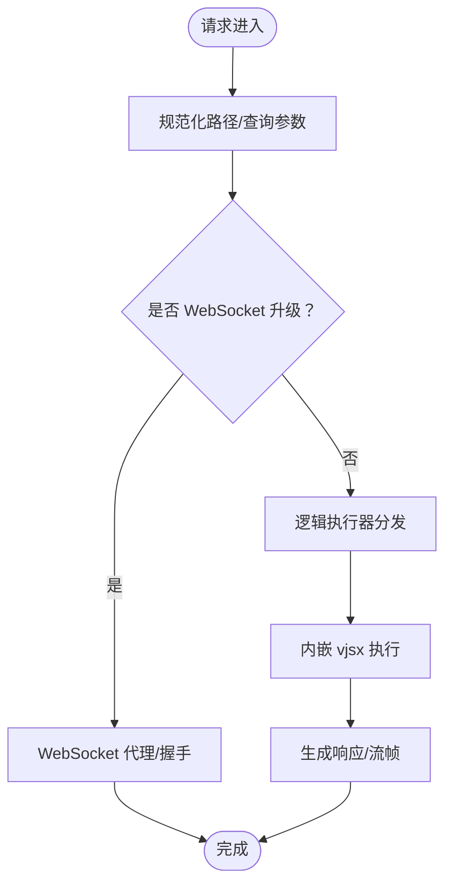

# 技术栈概览

<cite>
**本文档引用的文件**
- [README.md](file://README.md)
- [Makefile](file://Makefile)
- [v.mod](file://v.mod)
- [src/main.v](file://src/main.v)
- [src/executor/inproc_vjsx_executor.v](file://src/executor/inproc_vjsx_executor.v)
- [scripts/install_deps.sh](file://scripts/install_deps.sh)
- [scripts/doctor.sh](file://scripts/doctor.sh)
- [php/package/composer.json](file://php/package/composer.json)
- [config/vhttpd.example.toml](file://config/vhttpd.example.toml)
- [config/vhttpd.vjsx.example.toml](file://config/vhttpd.vjsx.example.toml)
- [examples/vjsx/hello-handler.mts](file://examples/vjsx/hello-handler.mts)
- [examples/hello-app.php](file://examples/hello-app.php)
- [docs/EXECUTOR_MODES.md](file://docs/EXECUTOR_MODES.md)
- [docs/RUNTIME_MODULE_MAP.md](file://docs/RUNTIME_MODULE_MAP.md)
- [docs/ARCHITECTURE_REFACTOR_BASELINE.md](file://docs/ARCHITECTURE_REFACTOR_BASELINE.md)
- [articles/01-overview.md](file://articles/01-overview.md)
</cite>

## 目录
1. [简介](#简介)
2. [项目结构](#项目结构)
3. [核心组件](#核心组件)
4. [架构总览](#架构总览)
5. [详细组件分析](#详细组件分析)
6. [依赖分析](#依赖分析)
7. [性能考量](#性能考量)
8. [故障排查指南](#故障排查指南)
9. [结论](#结论)
10. [附录](#附录)

## 简介
本文件面向 vhttpd 的技术栈与运行机制，系统阐述支撑其运行的核心技术栈与协作方式，包括：
- V 语言作为核心运行时语言的优势与定位
- TypeScript/JavaScript 通过内嵌 vjsx 执行器实现的嵌入式逻辑执行
- PHP 外部应用执行的兼容性与现代化改造
- 构建系统与依赖管理（Makefile 目标、安装脚本、诊断工具）
- 开发环境搭建与常见问题解决

vhttpd 是基于 V 语言与 veb 的 HTTP 家族网关/运行时，既终止 HTTP/WebSocket/Stream 连接，又统一管理 worker、上游流、MCP、Websocket 等运行时能力，并通过可插拔的逻辑执行器（php / vjsx）适配不同业务形态。

章节来源
- [README.md: 5-83:5-83](file://README.md#L5-L83)
- [articles/01-overview.md: 50-83:50-83](file://articles/01-overview.md#L50-L83)

## 项目结构
vhttpd 采用按职责分层的模块化组织方式，核心目录与职责概览如下：
- src：运行时核心模块（主入口、传输、工作池、Websocket、MCP、上游、控制面等）
- php：PHP 运行时包与 VSlim 适配层
- examples：多语言示例（PHP、Symfony、Laravel、WordPress、vjsx、Feishu Bot 等）
- config：示例配置（TOML）
- scripts：依赖安装、诊断与打包脚本
- docs：架构与运行模式文档
- Makefile：构建与测试目标

章节来源
- [v.mod: 1-7:1-7](file://v.mod#L1-L7)
- [docs/RUNTIME_MODULE_MAP.md: 33-77:33-77](file://docs/RUNTIME_MODULE_MAP.md#L33-L77)

## 核心组件
- V 语言与 veb：提供 HTTP/请求上下文、SSE、请求 ID 等运行时能力，vhttpd 保持薄层并复用这些能力。
- 逻辑执行器（Executors）：当前包含 php 与 vjsx 两类，分别对应“外部 worker 模式”和“内嵌执行模式”，二者通过统一的调度接口对接。
- 传输与编排：负责 worker 帧、流式分发、上游计划、MCP 会话与 WebSocket Hub。
- 控制面与管理员端点：暴露运行时快照、统计、worker 管理、上游状态等。
- PHP 适配层：通过 VSlim 与 vphp 包桥接到 PHP 应用生态。

章节来源
- [README.md: 27-83:27-83](file://README.md#L27-L83)
- [docs/EXECUTOR_MODES.md: 1-136:1-136](file://docs/EXECUTOR_MODES.md#L1-L136)
- [docs/RUNTIME_MODULE_MAP.md: 33-77:33-77](file://docs/RUNTIME_MODULE_MAP.md#L33-L77)

## 架构总览
vhttpd 的总体架构围绕“协议入口层 → 传输/编排层 → 运行时状态/控制层 → PHP 工作线程桥接层”的四层展开。请求从 HTTP/WebSocket/Stream 入口进入后，由高层编排决定是走外部 worker（php）还是内嵌执行（vjsx），并根据模式进行流式或上游处理。

图表来源
- [README.md: 84-126:84-126](file://README.md#L84-L126)
- [docs/RUNTIME_MODULE_MAP.md: 39-53:39-53](file://docs/RUNTIME_MODULE_MAP.md#L39-L53)

章节来源
- [README.md: 84-126:84-126](file://README.md#L84-L126)
- [docs/RUNTIME_MODULE_MAP.md: 39-53:39-53](file://docs/RUNTIME_MODULE_MAP.md#L39-L53)

## 详细组件分析

### V 语言与 veb 的优势
- 单二进制运行、无需额外语言运行时，部署简洁
- 性能与编译型特性适合运行时层（HTTP 入口、worker 调度、流转发、WebSocket 管理、统计）
- 与 veb/HTTP 栈强耦合，避免重复造轮子，专注于传输、编排、可观测性
- 设计边界清晰：业务逻辑交给执行器/worker/plugin，vhttpd core 专注运行时

章节来源
- [articles/01-overview.md: 53-68:53-68](file://articles/01-overview.md#L53-L68)
- [README.md: 152-173:152-173](file://README.md#L152-L173)

### TypeScript/JavaScript 内嵌执行器（vjsx）
- 在进程内执行，避免外部 worker 启动开销，适合 HTTP 与部分 WebSocket 上游场景
- 通过 QuickJS 引擎与 TypeScript 编译运行时，提供 Node 风格的运行时能力
- 提供 Facade API（ctx.runtime、ctx.json、ctx.created 等）简化响应构造
- 支持多执行通道（lane），具备签名探测、热身、错误恢复等机制

图表来源
- [src/executor/inproc_vjsx_executor.v: 3500-3526:3500-3526](file://src/executor/inproc_vjsx_executor.v#L3500-L3526)
- [src/executor/inproc_vjsx_executor.v: 4890-4919:4890-4919](file://src/executor/inproc_vjsx_executor.v#L4890-L4919)

章节来源
- [src/executor/inproc_vjsx_executor.v: 78-152:78-152](file://src/executor/inproc_vjsx_executor.v#L78-L152)
- [src/executor/inproc_vjsx_executor.v: 3500-3526:3500-3526](file://src/executor/inproc_vjsx_executor.v#L3500-L3526)
- [src/executor/inproc_vjsx_executor.v: 4890-4919:4890-4919](file://src/executor/inproc_vjsx_executor.v#L4890-L4919)
- [examples/vjsx/hello-handler.mts: 1-16:1-16](file://examples/vjsx/hello-handler.mts#L1-L16)

### PHP 外部应用执行（php-worker）
- 通过 Unix Socket 与 php-worker 通信，支持流式响应、SSE、WebSocket、MCP 等多种模式
- VSlim 扩展与 vphp 包提供 PSR-7/15 兼容与框架适配
- 支持扩展列表、CLI 参数注入、自动启动与重启退避策略

图表来源
- [README.md: 175-190:175-190](file://README.md#L175-L190)
- [docs/EXECUTOR_MODES.md: 25-81:25-81](file://docs/EXECUTOR_MODES.md#L25-L81)
- [config/vhttpd.example.toml: 28-67:28-67](file://config/vhttpd.example.toml#L28-L67)
- [php/package/composer.json: 12-29:12-29](file://php/package/composer.json#L12-L29)

章节来源
- [docs/EXECUTOR_MODES.md: 25-81:25-81](file://docs/EXECUTOR_MODES.md#L25-L81)
- [config/vhttpd.example.toml: 28-67:28-67](file://config/vhttpd.example.toml#L28-L67)
- [php/package/composer.json: 12-29:12-29](file://php/package/composer.json#L12-L29)
- [examples/hello-app.php: 1-49:1-49](file://examples/hello-app.php#L1-L49)

### 架构重构基线与模块映射
- 当前已形成稳定的模块边界：控制面、数据面、工作线程、运行时模块、提供商层、会话/传输句柄
- 下一步演进方向：强化 WorkerBackend 抽象、形成 Kernel 统一分发、分离 ProviderRuntime 所有权、整合会话与可观测性

章节来源
- [docs/ARCHITECTURE_REFACTOR_BASELINE.md: 37-53:37-53](file://docs/ARCHITECTURE_REFACTOR_BASELINE.md#L37-L53)
- [docs/ARCHITECTURE_REFACTOR_BASELINE.md: 348-424:348-424](file://docs/ARCHITECTURE_REFACTOR_BASELINE.md#L348-L424)
- [docs/RUNTIME_MODULE_MAP.md: 33-77:33-77](file://docs/RUNTIME_MODULE_MAP.md#L33-L77)

## 依赖分析

### 构建系统与 Makefile 目标
- 构建目标
  - build：准备构建源、调用 v 编译器，支持 TLS 后端选择（openssl/mbedtls）、DB 开关、GC 选择
  - vhttpd/prod/build-prod：默认启用 OpenSSL 与生产优化标志
  - build-db：显式开启 DB 支持
- 依赖安装目标
  - deps-core：安装基础系统依赖（OpenSSL、Boehm GC、pkg-config、数据库客户端头文件等）
  - deps-vjsx：在 core 基础上确保 vjsx QuickJS 源码可用
  - deps-db：数据库相关依赖（别名 db）
  - deps-full：同时满足 vjsx 与 db
  - doctor：检查命令、pkg-config、QuickJS 源码、数据库客户端工具等

图表来源
- [Makefile: 81-94:81-94](file://Makefile#L81-L94)
- [Makefile: 68-74:68-74](file://Makefile#L68-L74)
- [scripts/install_deps.sh: 50-84:50-84](file://scripts/install_deps.sh#L50-L84)
- [scripts/install_deps.sh: 104-115:104-115](file://scripts/install_deps.sh#L104-L115)
- [scripts/doctor.sh: 49-101:49-101](file://scripts/doctor.sh#L49-L101)

章节来源
- [Makefile: 1-139:1-139](file://Makefile#L1-L139)
- [scripts/install_deps.sh: 1-138:1-138](file://scripts/install_deps.sh#L1-L138)
- [scripts/doctor.sh: 1-108:1-108](file://scripts/doctor.sh#L1-L108)

### 依赖配置文件与选择策略
- core：仅安装运行 vhttpd 所需的基础系统库与工具
- vjsx：在 core 基础上确保 vjsx 与 QuickJS 源码，用于内嵌 JS/TS 执行
- db：数据库相关依赖（别名 db），用于启用 DB 支持
- full：同时满足 vjsx 与 db，适合需要内嵌执行与数据库能力的场景

章节来源
- [README.md: 210-247:210-247](file://README.md#L210-L247)
- [scripts/install_deps.sh: 117-135:117-135](file://scripts/install_deps.sh#L117-L135)

### 开发环境搭建与推荐步骤
- 安装依赖
  - 仅核心：make deps-core；随后 make doctor
  - 需要内嵌 vjsx：make deps-vjsx；随后 make doctor
  - 需要 DB：make deps-db 或 make deps-full
- 构建
  - make vhttpd（默认启用 OpenSSL 与 DB 支持）
  - make prod（生产优化，可选 mbedtls）
- 运行
  - 使用 TOML 配置（支持变量替换与多站点）
  - PHP 模式：指定 php.app_entry 与 php.worker_entry
  - vjsx 模式：指定 vjsx.app_entry 与 vjsx.module_root

章节来源
- [README.md: 210-278:210-278](file://README.md#L210-L278)
- [docs/EXECUTOR_MODES.md: 25-136:25-136](file://docs/EXECUTOR_MODES.md#L25-L136)
- [config/vhttpd.example.toml: 1-67:1-67](file://config/vhttpd.example.toml#L1-L67)
- [config/vhttpd.vjsx.example.toml: 1-67:1-67](file://config/vhttpd.vjsx.example.toml#L1-L67)

## 性能考量
- V 的编译型与内存安全特性，结合轻量的 worker 连接池与请求队列，相较传统 PHP-FPM 更轻量
- 内置 NDJSON 事件日志、流式分发与上游计划，有利于长连接与 AI token 流式体验
- 生产构建默认日志级别为 warn，可通过环境变量调整

章节来源
- [README.md: 175-190:175-190](file://README.md#L175-L190)
- [README.md: 268-272:268-272](file://README.md#L268-L272)

## 故障排查指南
- doctor 检查项
  - 必备命令：v、pkg-config
  - pkg-config：openssl、bdw-gc
  - vjsx：vjsx 目录存在、QuickJS 源码可用
  - 数据库：sqlite3、mysql_config/mariadb_config、pg_config
- 常见问题
  - QuickJS 源码缺失：运行 make deps-vjsx 或 doctor
  - 数据库客户端工具缺失：运行 make deps-db 或 doctor
  - TLS 后端不匹配：通过 V_TLS_BACKEND 选择 openssl 或 mbedtls
  - DB 支持关闭：使用 WITH_DB=0 显式禁用

章节来源
- [scripts/doctor.sh: 24-101:24-101](file://scripts/doctor.sh#L24-L101)
- [Makefile: 9-16:9-16](file://Makefile#L9-L16)
- [Makefile: 30-34:30-34](file://Makefile#L30-L34)

## 结论
vhttpd 通过 V 语言与 veb 的强绑定，将运行时层的复杂度集中在核心二进制中，配合可插拔的逻辑执行器（php 与 vjsx），既能承接成熟的 PHP 生态，又能拥抱现代嵌入式 JS/TS 执行。借助模块化的构建与依赖管理、完善的诊断工具与示例配置，vhttpd 为多协议、多运行时、多提供商的统一网关/运行时提供了清晰且可演进的架构路径。

## 附录

### 关键流程图：HTTP 请求到响应（vjsx 模式）

图表来源
- [src/main.v: 566-648:566-648](file://src/main.v#L566-L648)
- [src/executor/inproc_vjsx_executor.v: 3500-3526:3500-3526](file://src/executor/inproc_vjsx_executor.v#L3500-L3526)