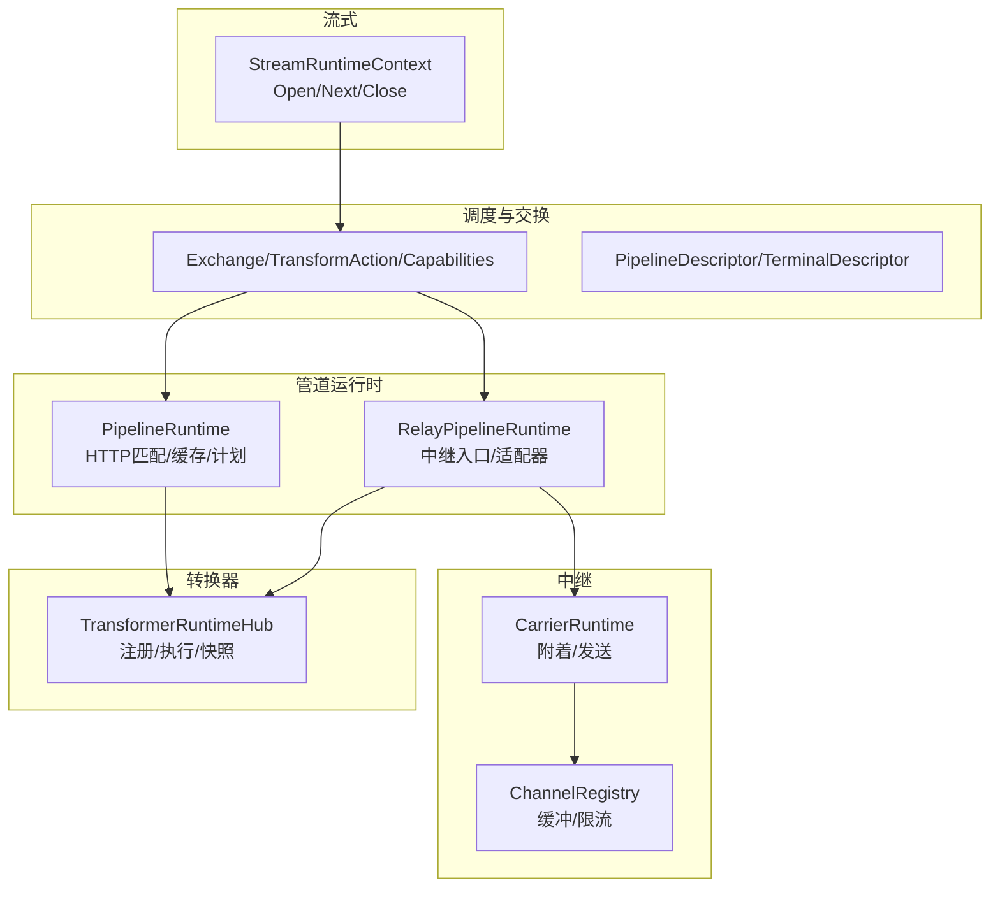
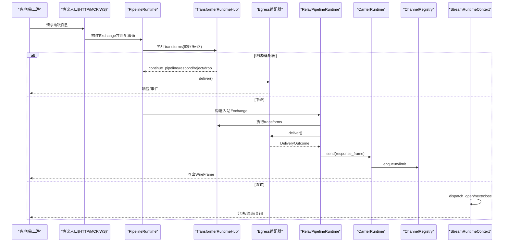
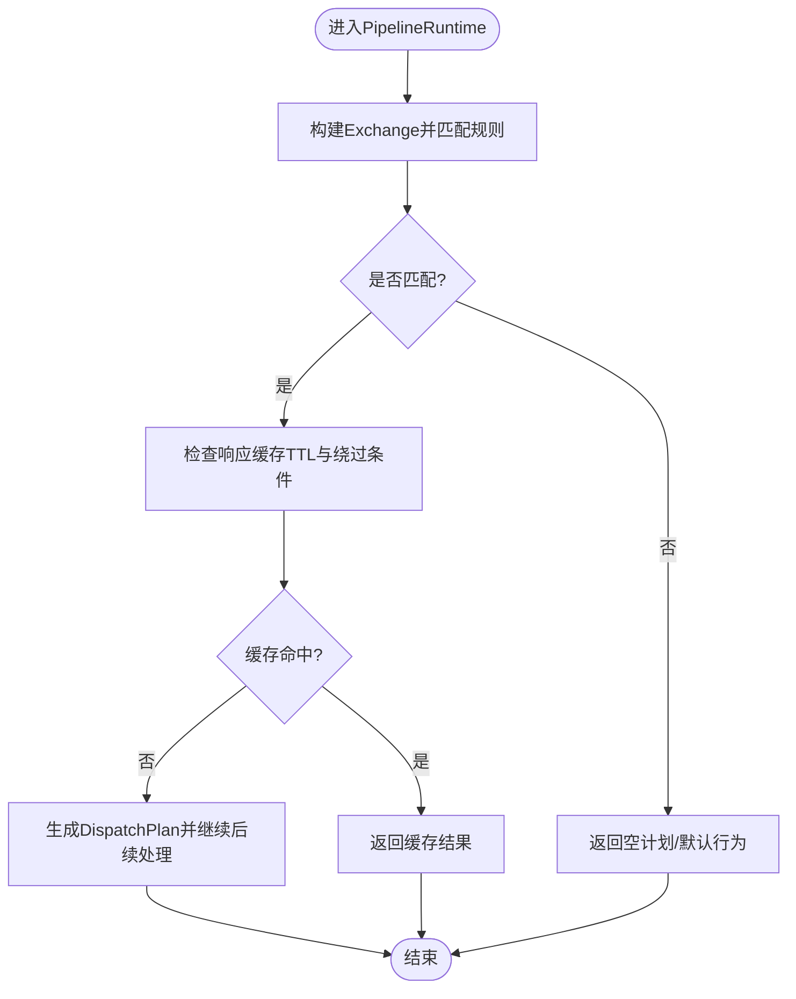
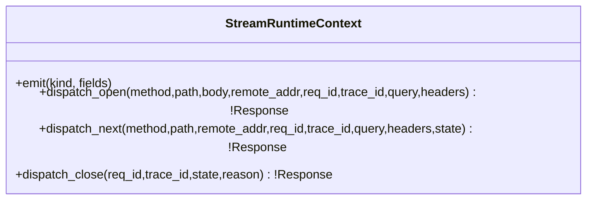
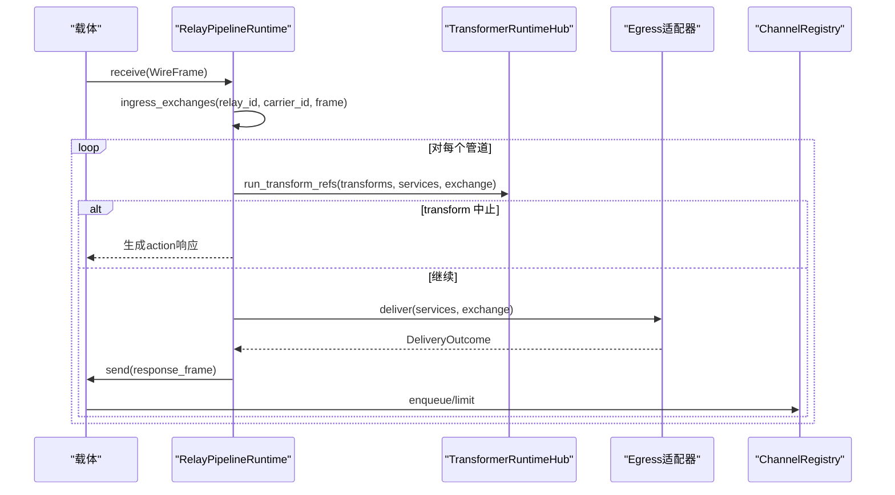
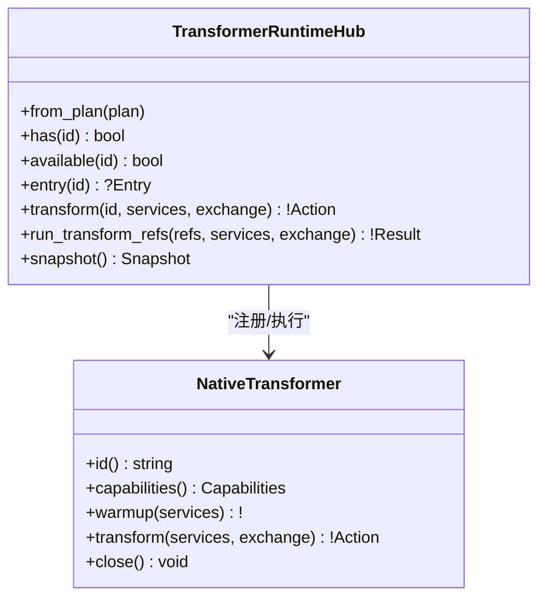
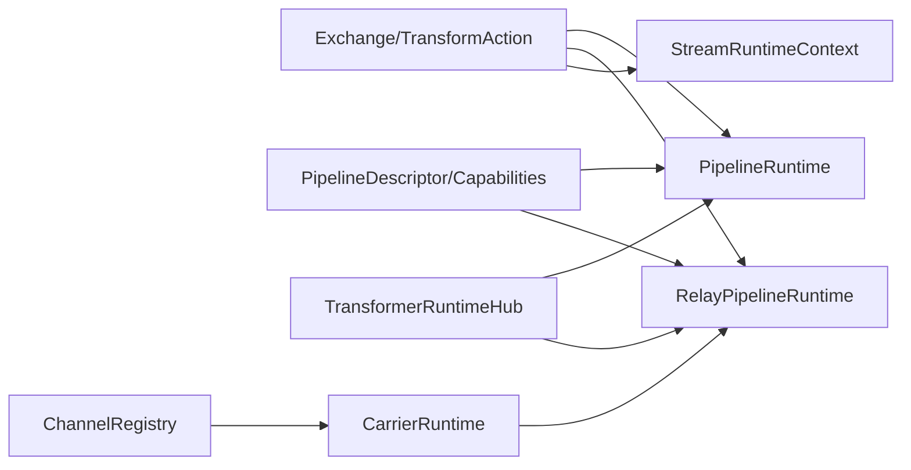

# 数据流模式

<cite>
**本文引用的文件**   
- [src/pipeline_runtime.v](file://src/pipeline_runtime.v)
- [src/relay_pipeline_runtime.v](file://src/relay_pipeline_runtime.v)
- [src/stream_runtime.v](file://src/stream_runtime.v)
- [src/transformer_runtime.v](file://src/transformer_runtime.v)
- [src/dispatch/exchange.v](file://src/dispatch/exchange.v)
- [src/dispatch/pipeline.v](file://src/dispatch/pipeline.v)
- [src/dispatch/runtime_services.v](file://src/dispatch/runtime_services.v)
- [src/relay/channel.v](file://src/relay/channel.v)
- [src/relay/carrier_runtime.v](file://src/relay/carrier_runtime.v)
- [src/upstream/transport/worker_pool.v](file://src/upstream/transport/worker_pool.v)
- [src/upstream/transport/error_classifier.v](file://src/upstream/transport/error_classifier.v)
- [src/admin_runtime_context.v](file://src/admin_runtime_context.v)
- [src/admin_runtime_graph.v](file://src/admin_runtime_graph.v)
- [docs/PROTOCOL_PIPELINE_IMPLEMENTATION_PLAN.md](file://docs/PROTOCOL_PIPELINE_IMPLEMENTATION_PLAN.md)
</cite>

## 目录
1. [简介](#简介)
2. [项目结构](#项目结构)
3. [核心组件](#核心组件)
4. [架构总览](#架构总览)
5. [详细组件分析](#详细组件分析)
6. [依赖关系分析](#依赖关系分析)
7. [性能与可扩展性](#性能与可扩展性)
8. [故障排查指南](#故障排查指南)
9. [结论](#结论)
10. [附录：自定义管道与转换器示例路径](#附录自定义管道与转换器示例路径)

## 简介
本文件聚焦 VHTTPD 的数据流模式，围绕以下四类运行时进行系统化说明：
- Pipeline Runtime（管道运行时）：分层数据处理、匹配路由、策略与转换链执行、终端适配。
- Stream Runtime（流式处理）：面向实时数据的 open/next/close 生命周期与状态传递。
- Relay Pipeline Runtime（中继管道）：跨进程/跨节点的数据转发，基于 WireFrame 的通道与背压缓冲。
- Transformer Runtime（转换器运行时）：可插拔的格式转换与协议桥接，支持能力声明与运行期快照。

文档将给出架构图与关键流程图，解释设计原理、适用场景与性能特点，并指出实现自定义管道与转换器的参考路径。同时覆盖背压控制、错误传播与监控指标收集等高级特性。

## 项目结构
VHTTPD 的数据流相关代码主要分布在如下模块：
- 调度与交换模型：dispatch 模块定义 Exchange、TransformAction、Capabilities 等核心类型，以及管道描述符与能力校验。
- 管道运行时：pipeline_runtime 负责 HTTP 请求匹配、缓存命中/回写、以及中继管道的入口映射。
- 中继管道：relay_pipeline_runtime 将外部帧转换为 Exchange，执行转换链与适配器输出，并通过载体发送响应。
- 流式运行时：stream_runtime 提供 Open/Next/Close 的上下文封装，对接内核分发。
- 转换器运行时：transformer_runtime 维护注册表、原生转换器实现与运行期快照。
- 中继通道与载体：relay/channel 管理通道缓冲与限流；relay/carrier_runtime 负责载体附着与发送。
- 上游传输与错误分类：upstream/transport 提供工作进程池管理与错误分类。
- 可观测性与图：admin_runtime_context 暴露队列深度、池大小等指标；admin_runtime_graph 生成运行时图。

图表来源
- [src/dispatch/exchange.v:1-160](file://src/dispatch/exchange.v#L1-L160)
- [src/dispatch/pipeline.v:1-119](file://src/dispatch/pipeline.v#L1-L119)
- [src/pipeline_runtime.v:1-224](file://src/pipeline_runtime.v#L1-L224)
- [src/relay_pipeline_runtime.v:1-437](file://src/relay_pipeline_runtime.v#L1-L437)
- [src/relay/channel.v:1-164](file://src/relay/channel.v#L1-L164)
- [src/relay/carrier_runtime.v:1-76](file://src/relay/carrier_runtime.v#L1-L76)
- [src/stream_runtime.v:1-48](file://src/stream_runtime.v#L1-L48)
- [src/transformer_runtime.v:1-344](file://src/transformer_runtime.v#L1-L344)

章节来源
- [src/dispatch/exchange.v:1-160](file://src/dispatch/exchange.v#L1-L160)
- [src/dispatch/pipeline.v:1-119](file://src/dispatch/pipeline.v#L1-L119)
- [src/pipeline_runtime.v:1-224](file://src/pipeline_runtime.v#L1-L224)
- [src/relay_pipeline_runtime.v:1-437](file://src/relay_pipeline_runtime.v#L1-L437)
- [src/relay/channel.v:1-164](file://src/relay/channel.v#L1-L164)
- [src/relay/carrier_runtime.v:1-76](file://src/relay/carrier_runtime.v#L1-L76)
- [src/stream_runtime.v:1-48](file://src/stream_runtime.v#L1-L48)
- [src/transformer_runtime.v:1-344](file://src/transformer_runtime.v#L1-L344)

## 核心组件
- Exchange 与 TransformAction：统一的数据交换体与转换动作，贯穿所有运行时。
- PipelineDescriptor：声明 ingress、transforms、policies、egress 及所需 Capabilities。
- TransformerRuntimeHub：从 RuntimePlan 装配转换器，支持原生与 VJSX 后端，提供 run_transform_refs 顺序执行与短路。
- RelayPipelineRuntime：将中继帧映射为 Exchange，执行转换链，调用适配器或终端，并将结果通过载体写出。
- StreamRuntimeContext：封装 Open/Next/Close 分发回调，供上层流式逻辑使用。
- ChannelRegistry：按 channel_id 管理缓冲队列与上限，提供 enqueue/drain/drain_returned 等接口。
- CarrierRuntime：载体附着、连接检查与发送，返回发送结果用于事件上报。

章节来源
- [src/dispatch/exchange.v:1-160](file://src/dispatch/exchange.v#L1-L160)
- [src/dispatch/pipeline.v:1-119](file://src/dispatch/pipeline.v#L1-L119)
- [src/transformer_runtime.v:1-344](file://src/transformer_runtime.v#L1-L344)
- [src/relay_pipeline_runtime.v:1-437](file://src/relay_pipeline_runtime.v#L1-L437)
- [src/stream_runtime.v:1-48](file://src/stream_runtime.v#L1-L48)
- [src/relay/channel.v:1-164](file://src/relay/channel.v#L1-L164)
- [src/relay/carrier_runtime.v:1-76](file://src/relay/carrier_runtime.v#L1-L76)

## 架构总览
下图展示四种数据流模式在系统中的交互关系与边界。

图表来源
- [src/pipeline_runtime.v:1-224](file://src/pipeline_runtime.v#L1-L224)
- [src/relay_pipeline_runtime.v:1-437](file://src/relay_pipeline_runtime.v#L1-L437)
- [src/transformer_runtime.v:1-344](file://src/transformer_runtime.v#L1-L344)
- [src/relay/carrier_runtime.v:1-76](file://src/relay/carrier_runtime.v#L1-L76)
- [src/relay/channel.v:1-164](file://src/relay/channel.v#L1-L164)
- [src/stream_runtime.v:1-48](file://src/stream_runtime.v#L1-L48)

## 详细组件分析

### Pipeline Runtime（管道运行时）
- 职责
  - 将协议请求标准化为 Exchange，匹配编译后的规则，计算目标路径与引擎。
  - 提供静态资源根、目录斜杠重定向、响应缓存命中/存储决策。
  - 为中继管道提供入口映射，按 relay_id 获取管道描述符集合。
- 关键点
  - match_http_request 将 HTTP 值转为 Exchange 并匹配规则。
  - http_response_cache_hit/store 根据规则 TTL、方法、请求绕过原因与交付结果决定是否缓存。
  - http_dispatch_plan 决定最终 target、executor 与 pipeline_id。
- 适用场景
  - 传统 HTTP 请求的分层处理、路由重写、缓存命中、终端/适配器选择。
- 性能特点
  - 内存中匹配与缓存，避免重复解析；命中时直接返回，降低延迟。

图表来源
- [src/pipeline_runtime.v:91-143](file://src/pipeline_runtime.v#L91-L143)
- [src/pipeline_runtime.v:174-223](file://src/pipeline_runtime.v#L174-L223)

章节来源
- [src/pipeline_runtime.v:1-224](file://src/pipeline_runtime.v#L1-L224)

### Stream Runtime（流式处理）
- 职责
  - 封装 emit、dispatch_open、dispatch_next、dispatch_close 回调，向上游暴露统一的流式上下文。
  - 将调用委托至内核分发函数，保持协议无关的流式语义。
- 关键点
  - StreamRuntimeContext 仅持有函数指针，便于在不同上下文中注入具体实现。
  - build_stream_runtime_context 将 App 的方法绑定到上下文。
- 适用场景
  - SSE/长轮询/自定义流式协议的生命周期管理。
- 性能特点
  - 轻量上下文对象，零拷贝传递状态 map，适合高频 next 调用。

图表来源
- [src/stream_runtime.v:1-48](file://src/stream_runtime.v#L1-L48)

章节来源
- [src/stream_runtime.v:1-48](file://src/stream_runtime.v#L1-L48)

### Relay Pipeline Runtime（中继管道）
- 职责
  - 将来自载体的 WireFrame 转换为 Exchange，按 relay_id 查找管道描述符并批量派发。
  - 执行 transforms，若中止则按 action 生成响应；否则调用 egress 适配器或终端。
  - 将 DeliveryOutcome 映射为响应帧，通过载体写出，并记录发送结果与事件。
- 关键点
  - ingress_exchanges 为每个管道描述符创建入站 Exchange。
  - dispatch_relay_ingress_frame 聚合多个管道的结果，逐一发送并上报事件。
  - relay_pipeline_outcome_from_delivery 将 response/accepted/failure 映射为 action/status/body/headers。
  - relay_channel 缓冲与限流：enqueue 失败即报错，drain/drain_returned 支持选择性回收。
- 适用场景
  - 跨进程/跨节点的协议桥接与事件转发，如 MCP/Feishu 桥接、内部服务间消息路由。
- 性能特点
  - 内存中 Exchange 传递，避免序列化；通道缓冲限制防止 OOM。

图表来源
- [src/relay_pipeline_runtime.v:97-168](file://src/relay_pipeline_runtime.v#L97-L168)
- [src/relay_pipeline_runtime.v:170-193](file://src/relay_pipeline_runtime.v#L170-L193)
- [src/relay_pipeline_runtime.v:332-361](file://src/relay_pipeline_runtime.v#L332-L361)
- [src/relay/channel.v:101-141](file://src/relay/channel.v#L101-L141)

章节来源
- [src/relay_pipeline_runtime.v:1-437](file://src/relay_pipeline_runtime.v#L1-L437)
- [src/relay/channel.v:1-164](file://src/relay/channel.v#L1-L164)

### Transformer Runtime（转换器运行时）
- 职责
  - 从 RuntimePlan 装配转换器，维护 native/vjsx 注册表，提供 has/available/entry/transform/run_transform_refs/snapshot。
  - 原生转换器实现如 feishu.event.summary、protocol.bridge，读取 payload/metadata 并写入 metadata 或返回 forward。
- 关键点
  - run_transform_refs 顺序执行，遇到非 continue 立即短路返回。
  - snapshot 暴露 total/available/native_count/vjsx_count 与条目能力字段。
  - capabilities 与 pipeline 能力校验确保输入/输出兼容。
- 适用场景
  - 协议桥接、事件摘要提取、元数据增强、格式转换。
- 性能特点
  - 原生转换器无额外进程开销；VJSX 复用现有引擎/lane 队列。

图表来源
- [src/transformer_runtime.v:67-139](file://src/transformer_runtime.v#L67-L139)
- [src/transformer_runtime.v:213-250](file://src/transformer_runtime.v#L213-L250)

章节来源
- [src/transformer_runtime.v:1-344](file://src/transformer_runtime.v#L1-L344)
- [src/dispatch/exchange.v:106-150](file://src/dispatch/exchange.v#L106-L150)
- [src/dispatch/pipeline.v:44-90](file://src/dispatch/pipeline.v#L44-L90)

## 依赖关系分析
- 低耦合的交换模型：Exchange/TransformAction/Capabilities 作为纯数据结构，被各运行时共享，避免引入协议细节。
- 管道描述符与能力校验：pipeline_capabilities_valid 与 missing_capabilities 保证 ingress/transform/egress 的能力契约。
- 中继与载体：relay_pipeline_runtime 依赖 carrier_runtime 与 channel_registry 完成背压与写出。
- 流式上下文：stream_runtime 仅依赖 transport.StreamDispatchResponse 等协议无关结构。
- 可观测性：transformer_runtime.snapshot 与 admin_runtime_context 暴露队列深度、池大小等指标，便于监控。

图表来源
- [src/dispatch/exchange.v:1-160](file://src/dispatch/exchange.v#L1-L160)
- [src/dispatch/pipeline.v:1-119](file://src/dispatch/pipeline.v#L1-L119)
- [src/pipeline_runtime.v:1-224](file://src/pipeline_runtime.v#L1-L224)
- [src/relay_pipeline_runtime.v:1-437](file://src/relay_pipeline_runtime.v#L1-L437)
- [src/relay/carrier_runtime.v:1-76](file://src/relay/carrier_runtime.v#L1-L76)
- [src/relay/channel.v:1-164](file://src/relay/channel.v#L1-L164)
- [src/stream_runtime.v:1-48](file://src/stream_runtime.v#L1-L48)
- [src/transformer_runtime.v:1-344](file://src/transformer_runtime.v#L1-L344)

章节来源
- [src/dispatch/exchange.v:1-160](file://src/dispatch/exchange.v#L1-L160)
- [src/dispatch/pipeline.v:1-119](file://src/dispatch/pipeline.v#L1-L119)
- [src/pipeline_runtime.v:1-224](file://src/pipeline_runtime.v#L1-L224)
- [src/relay_pipeline_runtime.v:1-437](file://src/relay_pipeline_runtime.v#L1-L437)
- [src/relay/carrier_runtime.v:1-76](file://src/relay/carrier_runtime.v#L1-L76)
- [src/relay/channel.v:1-164](file://src/relay/channel.v#L1-L164)
- [src/stream_runtime.v:1-48](file://src/stream_runtime.v#L1-L48)
- [src/transformer_runtime.v:1-344](file://src/transformer_runtime.v#L1-L344)

## 性能与可扩展性
- 背压控制
  - 中继通道：ChannelRegistry.enqueue 在 buffered.len >= buffer_limit 时报错，防止无限增长；drain/drain_returned 定期消费缓冲。
  - 载体发送：carrier_runtime.send_to_carrier 先检查 ready 与 connected，再发送，返回 ok/queued/error 以便上层统计。
  - 上游工作进程：error_classifier 将“队列满/超时”分类为 503/504 并带 error_class，便于快速定位瓶颈。
- 错误传播
  - 中继管道：transform 异常或未知 adapter/egress 会返回 failure outcome，包含 status、error、error_class。
  - 管道能力不匹配：pipeline_capability_issues 报告缺失能力，启动期即可发现配置问题。
- 监控指标
  - 管理员上下文暴露 worker_queue_depth、worker_pool_size、worker_backend_mode、worker_queue_capacity、worker_queue_timeout_ms、ws_hub_dispatch_mode 等。
  - 转换器快照暴露 registered transforms、backend kind、availability、capabilities。
  - 运行时图 admin_runtime_graph 可视化 listener/pipeline/adapter/engine/transform 的关系。

章节来源
- [src/relay/channel.v:101-141](file://src/relay/channel.v#L101-L141)
- [src/relay/carrier_runtime.v:57-76](file://src/relay/carrier_runtime.v#L57-L76)
- [src/upstream/transport/error_classifier.v:1-18](file://src/upstream/transport/error_classifier.v#L1-L18)
- [src/admin_runtime_context.v:78-104](file://src/admin_runtime_context.v#L78-L104)
- [src/transformer_runtime.v:167-211](file://src/transformer_runtime.v#L167-L211)
- [src/admin_runtime_graph.v:67-120](file://src/admin_runtime_graph.v#L67-L120)

## 故障排查指南
- 中继管道未找到
  - 现象：收到 404 且 error_class=relay_pipeline_not_found。
  - 排查：确认 relay_id 与管道描述符是否正确加载。
  - 参考路径：[src/relay_pipeline_runtime.v:97-117](file://src/relay_pipeline_runtime.v#L97-L117)
- 转换器不可用或未知
  - 现象：transformer unavailable 或 handler 缺失。
  - 排查：检查 RuntimePlan.transforms 与 handler 配置；查看 transformer 快照。
  - 参考路径：[src/transformer_runtime.v:162-165](file://src/transformer_runtime.v#L162-L165), [src/config/v2_plan_compiler_test.v:880-912](file://src/config/v2_plan_compiler_test.v#L880-L912)
- 通道缓冲溢出
  - 现象：relay_channel_buffer_full。
  - 排查：增大 buffer_limit 或优化下游消费速率；检查 drain 调用频率。
  - 参考路径：[src/relay/channel.v:108-113](file://src/relay/channel.v#L108-L113)
- 上游工作进程队列问题
  - 现象：503/504 与 error_class=worker_queue_full/timeout。
  - 排查：扩大 pool_size、调整 queue_capacity/timeout；观察 worker 存活与重启退避。
  - 参考路径：[src/upstream/transport/error_classifier.v:1-18](file://src/upstream/transport/error_classifier.v#L1-L18), [src/upstream/transport/worker_pool.v:204-218](file://src/upstream/transport/worker_pool.v#L204-L218)
- 能力不匹配导致拒绝
  - 现象：pipeline_capability_mismatch。
  - 排查：核对 ingress 与 transform/egress 的 Capabilities 需求。
  - 参考路径：[src/dispatch/pipeline.v:92-112](file://src/dispatch/pipeline.v#L92-L112)

章节来源
- [src/relay_pipeline_runtime.v:97-117](file://src/relay_pipeline_runtime.v#L97-L117)
- [src/transformer_runtime.v:162-165](file://src/transformer_runtime.v#L162-L165)
- [src/relay/channel.v:108-113](file://src/relay/channel.v#L108-L113)
- [src/upstream/transport/error_classifier.v:1-18](file://src/upstream/transport/error_classifier.v#L1-L18)
- [src/upstream/transport/worker_pool.v:204-218](file://src/upstream/transport/worker_pool.v#L204-L218)
- [src/dispatch/pipeline.v:92-112](file://src/dispatch/pipeline.v#L92-L112)

## 结论
VHTTPD 的数据流以 Exchange 为核心，通过 Pipeline/Relay/Stream/Transformer 四类运行时协同，实现了高内聚、低耦合、可扩展的处理链路。中继管道提供跨进程转发与背压保障，流式运行时简化了实时数据生命周期管理，转换器运行时提供了灵活的协议桥接与格式转换能力。配合能力校验、错误分类与丰富的运行时快照，系统在生产环境中具备良好的可观测性与稳定性。

## 附录：自定义管道与转换器示例路径
- 自定义转换器（原生）
  - 参考路径：在原生转换器分发处添加新 handler 分支，读取 exchange.payload/metadata，写入 metadata 或返回 continue/forward。
  - 参考文件：[src/transformer_runtime.v:230-250](file://src/transformer_runtime.v#L230-L250)
- 自定义转换器（VJSX）
  - 参考路径：通过 TransformerRuntimeHub.run_transform_refs 执行 VJSX 转换器，复用现有引擎/lane 队列。
  - 参考文件：[src/transformer_runtime.v:120-135](file://src/transformer_runtime.v#L120-L135)
- 自定义中继管道
  - 参考路径：在 RelayPipelineRuntime.new 中按 relay_id 组装管道描述符；在 dispatch_relay_ingress_frame 中处理入站帧与多管道派发。
  - 参考文件：[src/pipeline_runtime.v:58-75](file://src/pipeline_runtime.v#L58-L75), [src/relay_pipeline_runtime.v:97-134](file://src/relay_pipeline_runtime.v#L97-L134)
- 自定义流式处理器
  - 参考路径：实现 StreamRuntimeContext 的 dispatch_open/next/close 回调，并在上层业务中调用。
  - 参考文件：[src/stream_runtime.v:30-47](file://src/stream_runtime.v#L30-L47)
- 管道能力与配置校验
  - 参考路径：使用 pipeline_capability_errors/issues 进行启动期校验；V2 编译器拒绝缺少 handler 的 transform。
  - 参考文件：[src/dispatch/pipeline.v:97-112](file://src/dispatch/pipeline.v#L97-L112), [src/config/v2_plan_compiler_test.v:880-912](file://src/config/v2_plan_compiler_test.v#L880-L912)

章节来源
- [src/transformer_runtime.v:120-135](file://src/transformer_runtime.v#L120-L135)
- [src/transformer_runtime.v:230-250](file://src/transformer_runtime.v#L230-L250)
- [src/pipeline_runtime.v:58-75](file://src/pipeline_runtime.v#L58-L75)
- [src/relay_pipeline_runtime.v:97-134](file://src/relay_pipeline_runtime.v#L97-L134)
- [src/stream_runtime.v:30-47](file://src/stream_runtime.v#L30-L47)
- [src/dispatch/pipeline.v:97-112](file://src/dispatch/pipeline.v#L97-L112)
- [src/config/v2_plan_compiler_test.v:880-912](file://src/config/v2_plan_compiler_test.v#L880-L912)