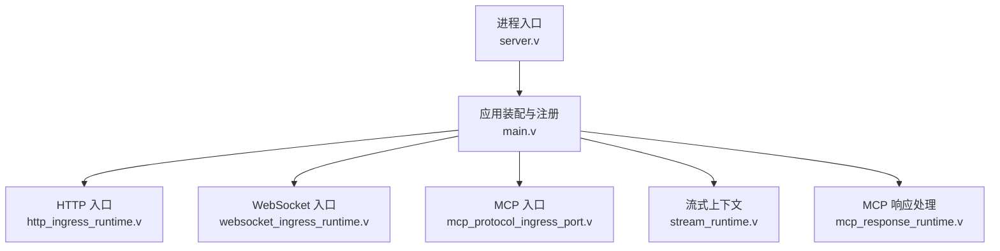
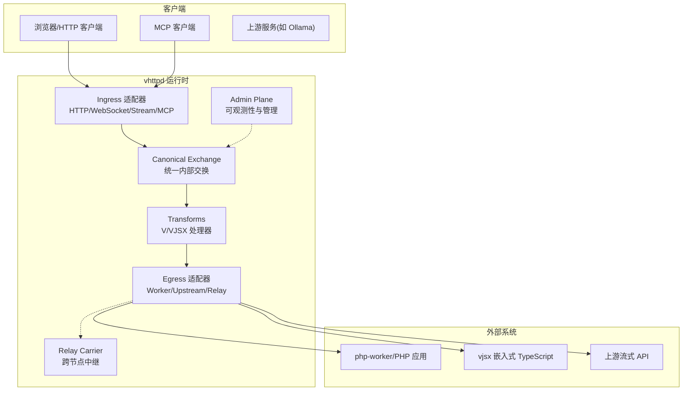
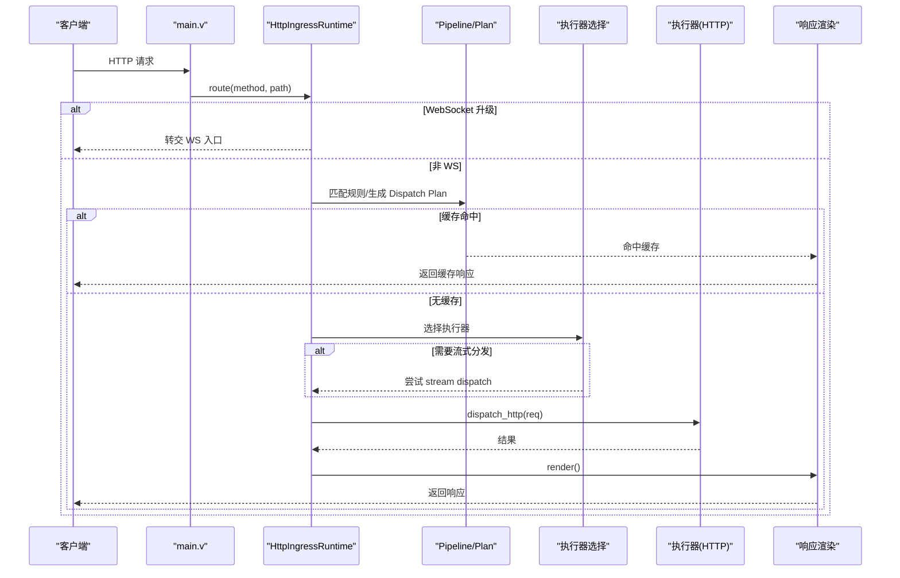
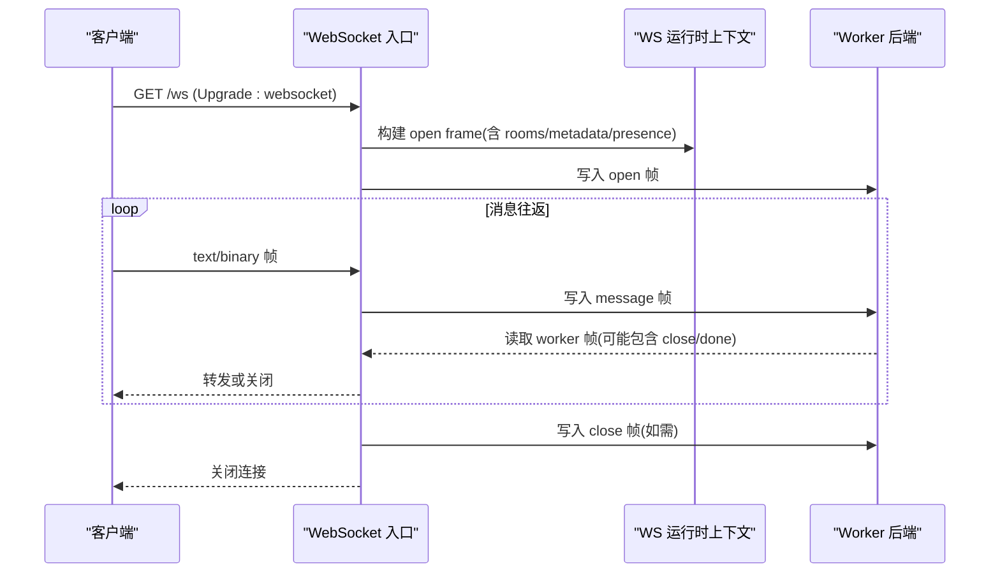
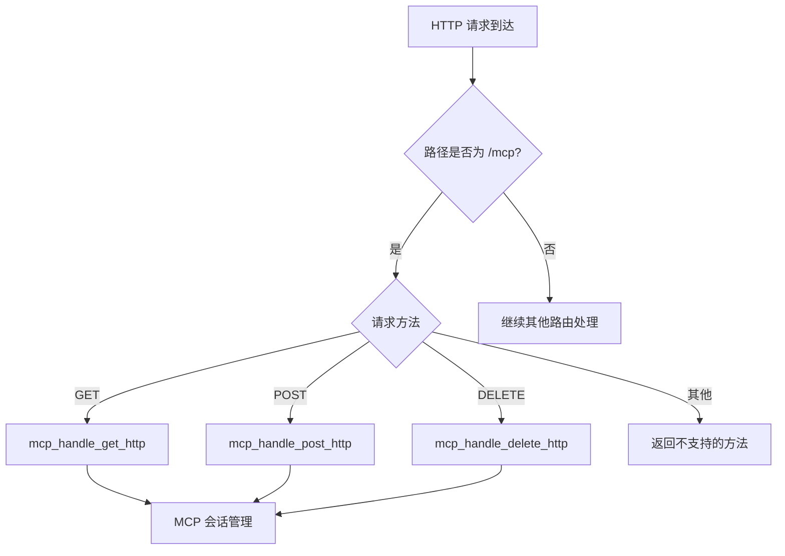
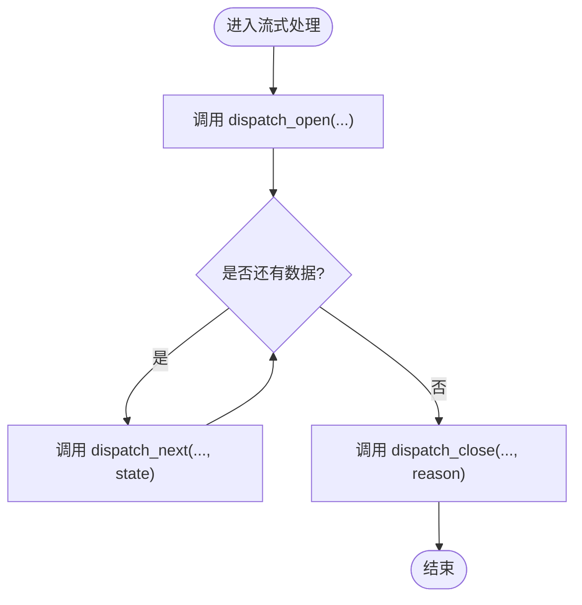
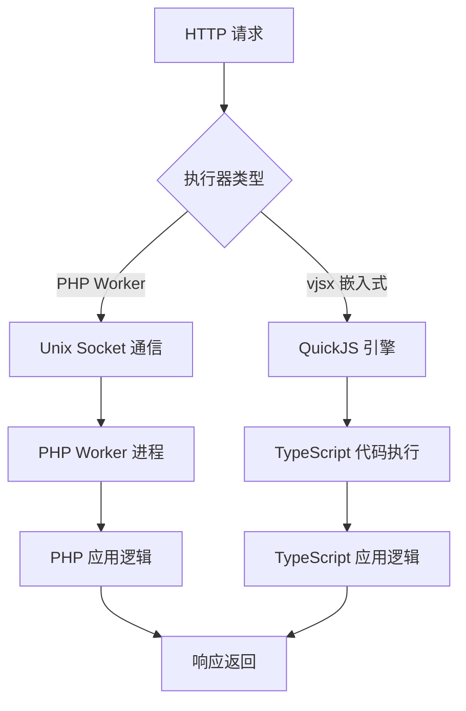
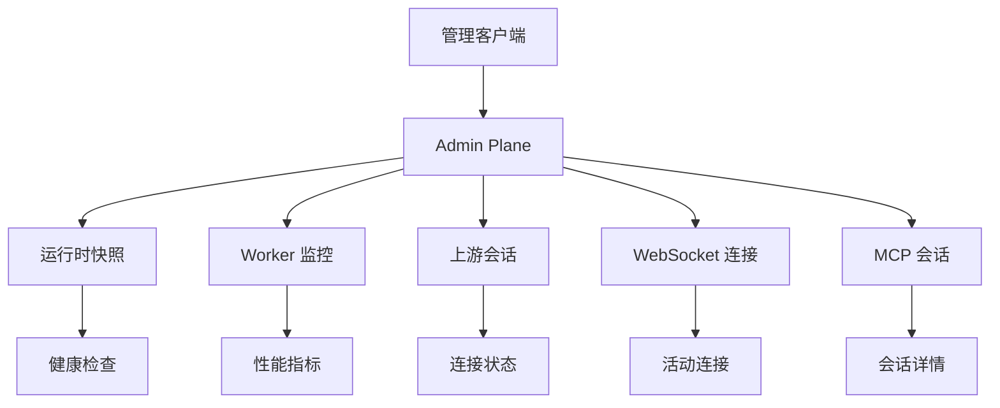
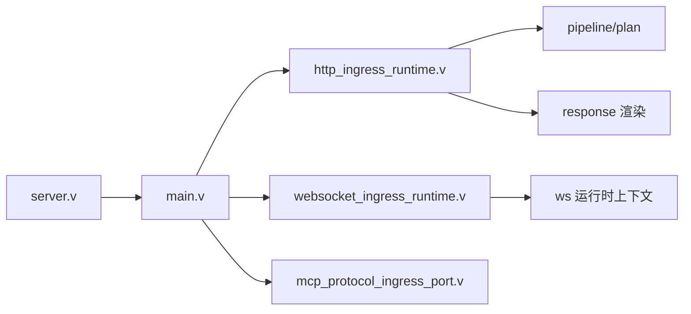

# 架构概览

<cite>
**本文引用的文件**   
- [index.html](file://index.html)
- [README.md](file://README.md)
- [admin_runtime.v](file://src/admin_runtime.v)
- [executor/types.v](file://src/executor/types.v)
- [executor/registry.v](file://src/executor/registry.v)
- [upstream/types.v](file://src/upstream/types.v)
- [server_logic_test.v](file://src/server_logic_test.v)
- [04-ai-streaming.md](file://articles/04-ai-streaming.md)
- [11-observability.md](file://articles/11-observability.md)
</cite>

## 更新摘要
**所做更改**   
- 更新了多执行器模型支持，强调 PHP workers 和 vjsx 嵌入式 TypeScript
- 增强了上游流编排功能，支持 AI token 流式处理
- 完善了管理端点和可观测性功能的描述
- 更新了系统架构图以反映新的执行器模式
- 增加了 vjsx 嵌入式执行器的详细说明

## 目录
1. [引言](#引言)
2. [项目结构](#项目结构)
3. [核心组件](#核心组件)
4. [架构总览](#架构总览)
5. [详细组件分析](#详细组件分析)
6. [依赖关系分析](#依赖关系分析)
7. [性能与可扩展性](#性能与可扩展性)
8. [故障排查指南](#故障排查指南)
9. [结论](#结论)
10. [附录：部署拓扑与基础设施](#附录部署拓扑与基础设施)

## 引言
vhttpd 是一个面向 PHP、TypeScript（vjsx）、AI 流式协议（SSE/MCP）以及 WebSocket 的 Transport Runtime。它不是传统业务框架，也不仅是反向代理，而是"协议入口 + 可编排运行时 + 跨节点中继"的统一网关层，负责终止 HTTP/WebSocket/Stream/MCP 连接、调度外部 worker（如 php-worker）或嵌入式宿主（如 vjsx），并暴露管理平面用于观测与控制。

设计原则要点：
- 以 veb 为 HTTP 事实来源，保持 vhttpd 薄且复用底层能力
- 将请求逻辑抽象为"执行器"，支持 php、vjsx 等未来扩展
- 通过统一 Exchange/Pipeline 连接不同协议，支持流式、双向会话、背压与可观测性

本节不直接分析具体代码文件，因此无章节来源。

## 项目结构
从源码视角，关键入口与职责如下：
- 进程启动与生命周期：server.v
- 顶层路由与编排：main.v
- 协议入口：HTTP 入口 http_ingress_runtime.v；WebSocket 入口 websocket_ingress_runtime.v；MCP 入口 mcp_protocol_ingress_port.v
- 流式处理上下文：stream_runtime.v
- MCP 响应处理：mcp_response_runtime.v



图表来源
- [server.v:1-200](file://src/server.v#L1-L200)
- [main.v:1-117](file://src/main.v#L1-L117)
- [http_ingress_runtime.v:1-146](file://src/http_ingress_runtime.v#L1-L146)
- [websocket_ingress_runtime.v:1-200](file://src/websocket_ingress_runtime.v#L1-L200)
- [stream_runtime.v:1-48](file://src/stream_runtime.v#L1-L48)
- [mcp_protocol_ingress_port.v:1-17](file://src/mcp_protocol_ingress_port.v#L1-L17)
- [mcp_response_runtime.v:1-38](file://src/mcp_response_runtime.v#L1-L38)

章节来源
- [server.v:1-200](file://src/server.v#L1-L200)
- [main.v:1-117](file://src/main.v#L1-L117)

## 核心组件
- Protocol Ingress（协议入口）
  - HTTP 入口：解析路径、查询、头部，匹配 Pipeline，决定缓存命中、流式分发或直接执行器调用
  - WebSocket 入口：握手协商、open/message/close 帧转发、presence/rooms 状态同步
  - MCP 入口：处理 Streamable HTTP 协议的 GET/POST/DELETE 请求
- Runtime Modules（运行时模块）
  - Stream 上下文：封装 open/next/close 分派回调，支撑 phase 1/2/3 流式模型
  - Upstream/WS Upstream/MCP：由上层运行时组合，遵循统一交换契约
- Logic Executors（逻辑执行器）
  - 统一接口：HTTP、WebSocket、Stream、MCP、WebSocket Upstream、WebSocket Event
  - 当前实现：php-cgi（外部 worker）、vjsx（内嵌宿主）
- Worker Backend（后端工作进程）
  - 通过 Unix Socket/FastCGI 与 php-worker 通信，维护池、队列、超时与错误分类

章节来源
- [http_ingress_runtime.v:31-139](file://src/http_ingress_runtime.v#L31-L139)
- [websocket_ingress_runtime.v:46-101](file://src/websocket_ingress_runtime.v#L46-L101)
- [mcp_protocol_ingress_port.v:7-17](file://src/mcp_protocol_ingress_port.v#L7-L17)
- [stream_runtime.v:7-48](file://src/stream_runtime.v#L7-L48)

## 架构总览
vhttpd 的高层目标是"协议对等、统一交换、可编程运行时"。在目标架构中，流量经 Ingress Adapter 标准化为 Canonical Exchange，经过零或多个 Transform，再由 Egress Adapter 发出；跨网络场景可通过 Relay Carrier 进行中继。

**更新** 新的落地页强调了多执行器模型，支持 PHP workers 和 vjsx 嵌入式 TypeScript，以及上游流编排用于 AI token 流式处理和通过管理端点进行全面可观测性。



图表来源
- [PROTOCOL_PIPELINE_RELAY_ARCHITECTURE.md:25-44](file://design-docs/PROTOCOL_PIPELINE_RELAY_ARCHITECTURE.md#L25-L44)
- [OVERVIEW.md:26-37](file://design-docs/OVERVIEW.md#L26-L37)

章节来源
- [PROTOCOL_PIPELINE_RELAY_ARCHITECTURE.md:25-44](file://design-docs/PROTOCOL_PIPELINE_RELAY_ARCHITECTURE.md#L25-L44)
- [OVERVIEW.md:26-37](file://design-docs/OVERVIEW.md#L26-L37)

## 详细组件分析

### HTTP 请求处理链路
- 入口：main.v 将所有 HTTP 方法统一路由到 HttpIngressRuntime.route
- 流程要点：
  - 识别 WebSocket 升级请求，转交 WebSocket 入口
  - 尝试协议级路由（如 MCP），命中则直接返回
  - 匹配编译期生成的 Pipeline，优先走缓存命中
  - 若无逻辑执行器，返回 404
  - 动态选择执行器（php/vjsx），必要时先尝试 stream dispatch
  - 最终渲染响应



图表来源
- [main.v:83-116](file://src/main.v#L83-L116)
- [http_ingress_runtime.v:31-139](file://src/http_ingress_runtime.v#L31-L139)

章节来源
- [main.v:83-116](file://src/main.v#L83-L116)
- [http_ingress_runtime.v:31-139](file://src/http_ingress_runtime.v#L31-L139)

### WebSocket 会话处理链路
- 入口：websocket_ingress_runtime.v
- 流程要点：
  - 校验 Upgrade 头与 key，拒绝非法升级
  - 若启用 dispatch 模式，走事件分发；否则走 session 直连
  - 与 worker 建立长连接，发送 open/frame/close/done 帧
  - 维护 presence/rooms/metadata，并在关闭时清理资源



图表来源
- [websocket_ingress_runtime.v:46-101](file://src/websocket_ingress_runtime.v#L46-L101)
- [websocket_ingress_runtime.v:279-339](file://src/websocket_ingress_runtime.v#L279-L339)
- [websocket_ingress_runtime.v:341-411](file://src/websocket_ingress_runtime.v#L341-L411)

章节来源
- [websocket_ingress_runtime.v:46-101](file://src/websocket_ingress_runtime.v#L46-L101)
- [websocket_ingress_runtime.v:279-339](file://src/websocket_ingress_runtime.v#L279-L339)
- [websocket_ingress_runtime.v:341-411](file://src/websocket_ingress_runtime.v#L341-L411)

### MCP 协议处理链路
- 入口：mcp_protocol_ingress_port.v
- 流程要点：
  - 处理 Streamable HTTP 协议的三个端点：GET /mcp、POST /mcp、DELETE /mcp
  - 根据请求方法路由到相应的 MCP 处理器
  - 集成到统一的 HTTP 路由管道中



图表来源
- [mcp_protocol_ingress_port.v:7-17](file://src/mcp_protocol_ingress_port.v#L7-L17)

章节来源
- [mcp_protocol_ingress_port.v:7-17](file://src/mcp_protocol_ingress_port.v#L7-L17)

### 流式处理上下文（Phase 1/2/3）
- 上下文封装了 emit、dispatch_open/next/close 回调，供上层运行时组合使用
- 典型用法：
  - Phase 1：worker 持有流，直接输出 start/chunk/error/end
  - Phase 2：vhttpd 持有下游连接，worker 处理 open/next/close
  - Phase 3：vhttpd 持有上下游，worker 返回 plan，vhttpd 自行连接上游出流



图表来源
- [stream_runtime.v:7-48](file://src/stream_runtime.v#L7-L48)

章节来源
- [stream_runtime.v:7-48](file://src/stream_runtime.v#L7-L48)

### 多执行器模型详解

**更新** vhttpd 现在支持两种主要的执行器模式：

#### PHP Worker 执行器
- 外部进程模式，通过 Unix Socket/FastCGI 与 php-worker 通信
- 适合成熟的 PHP 应用和框架（Laravel、Symfony、WordPress）
- 支持完整的流式响应和 WebSocket 处理

#### vjsx 嵌入式执行器
- 内嵌 TypeScript/JavaScript 执行环境，基于 QuickJS 引擎
- 无需 Node.js，零外部依赖
- 适合快速原型开发、轻量级网关和协议适配逻辑
- 支持多线程执行和并行处理



图表来源
- [executor/types.v:67-75](file://src/executor/types.v#L67-L75)
- [executor/registry.v:226-261](file://src/executor/registry.v#L226-L261)
- [server_logic_test.v:1723-1750](file://src/server_logic_test.v#L1723-L1750)

章节来源
- [executor/types.v:67-75](file://src/executor/types.v#L67-L75)
- [executor/registry.v:226-261](file://src/executor/registry.v#L226-L261)
- [server_logic_test.v:1723-1750](file://src/server_logic_test.v#L1723-L1750)

### 上游流编排与 AI Token 流式处理

**更新** vhttpd 提供了强大的上游流编排能力，专门针对 AI 应用场景：

#### Phase 3 Upstream Plan
- vhttpd 拥有下游和上游流的完整生命周期
- 自动映射上游 token 流为 SSE 或 text stream
- 支持 Ollama、OpenAI 等多种上游服务

#### 支持的 AI 服务
- **Ollama**: 本地 AI 模型代理，支持流式响应
- **OpenAI**: OpenAI-compatible gateway，支持 chat completions
- **自定义上游**: 通过 NDJSON 协议支持任意上游服务

```mermaid
sequenceDiagram
participant Client as "客户端"
participant Gateway as "vhttpd Gateway"
participant Upstream as "AI 上游服务"
Client->>Gateway : POST /chat (stream=true)
Gateway->>Upstream : 转发请求
loop Token Streaming
Upstream-->>Gateway : data : {"content" : "...", "done" : false}
Gateway-->>Client : data : {"content" : "...", "done" : false}
end
Upstream-->>Gateway : data : {"done" : true}
Gateway-->>Client : data : {"done" : true}
end
```

图表来源
- [upstream/types.v:22-64](file://src/upstream/types.v#L22-64)
- [04-ai-streaming.md:415-433](file://articles/04-ai-streaming.md#L415-L433)

章节来源
- [upstream/types.v:22-64](file://src/upstream/types.v#L22-64)
- [04-ai-streaming.md:415-433](file://articles/04-ai-streaming.md#L415-L433)

### 管理端点与可观测性

**更新** vhttpd 提供了全面的可观测性和管理能力：

#### 核心管理端点
- `/admin/runtime` - 运行时状态和能力标志
- `/admin/workers` - Worker 池状态监控
- `/admin/stats` - 运行时统计信息
- `/admin/events` - 事件流监控
- `/admin/runtime/upstreams` - 上游会话监控
- `/admin/runtime/websockets` - WebSocket 连接监控
- `/admin/runtime/mcp` - MCP 会话管理

#### 监控指标
- **HTTP 统计**: 请求总数、错误数、超时数、流式连接数
- **Worker 统计**: 等待数、拒绝数、超时数
- **上游统计**: 计划数、错误数
- **MCP 统计**: 会话过期、驱逐、丢弃等指标



图表来源
- [admin_runtime.v:7-20](file://src/admin_runtime.v#L7-L20)
- [admin_runtime.v:478-497](file://src/admin_runtime.v#L478-L497)
- [admin_runtime.v:499-517](file://src/admin_runtime.v#L499-L517)
- [admin_runtime.v:519-538](file://src/admin_runtime.v#L519-L538)

章节来源
- [admin_runtime.v:7-20](file://src/admin_runtime.v#L7-L20)
- [admin_runtime.v:478-497](file://src/admin_runtime.v#L478-L497)
- [admin_runtime.v:499-517](file://src/admin_runtime.v#L499-L517)
- [admin_runtime.v:519-538](file://src/admin_runtime.v#L519-L538)

### 技术决策与权衡
- 以 veb 为中心：复用 veb.Context/Request/Cookie/SSE，减少重复造轮子
- 执行器抽象：将 PHP、vjsx 等统一为同一接口，便于扩展新宿主
- 流式分层：phase 1/2/3 逐步解耦下游连接与 worker 生命周期，提升吞吐与弹性
- 多监听器与站点隔离：每个 site 拥有独立 executor 与 pipeline，简化多租户部署

章节来源
- [README.md:27-31](file://README.md#L27-L31)
- [README.md:191-209](file://README.md#L191-L209)
- [OVERVIEW.md:41-86](file://design-docs/OVERVIEW.md#L41-L86)

## 依赖关系分析
- 进程级依赖
  - server.v 负责全局锁层次、信号处理、单/多实例运行、注册与启动
  - main.v 提供顶层中间件、静态资源与通用 HTTP 路由
- 协议层依赖
  - http_ingress_runtime.v 依赖 dispatch、transport、pipeline 与 response 渲染
  - websocket_ingress_runtime.v 依赖 net.websocket、worker 帧编解码、ws 运行时上下文
  - mcp_protocol_ingress_port.v 集成到 HTTP 路由管道中



图表来源
- [server.v:1-200](file://src/server.v#L1-L200)
- [main.v:1-117](file://src/main.v#L1-L117)
- [http_ingress_runtime.v:1-146](file://src/http_ingress_runtime.v#L1-L146)
- [websocket_ingress_runtime.v:1-200](file://src/websocket_ingress_runtime.v#L1-L200)
- [mcp_protocol_ingress_port.v:1-17](file://src/mcp_protocol_ingress_port.v#L1-L17)

章节来源
- [server.v:1-200](file://src/server.v#L1-L200)
- [main.v:1-117](file://src/main.v#L1-L117)
- [http_ingress_runtime.v:1-146](file://src/http_ingress_runtime.v#L1-L146)
- [websocket_ingress_runtime.v:1-200](file://src/websocket_ingress_runtime.v#L1-L200)
- [mcp_protocol_ingress_port.v:1-17](file://src/mcp_protocol_ingress_port.v#L1-L17)

## 性能与可扩展性
- 性能特性
  - 有界队列与超时：当无空闲 worker 且队列未满时短暂等待；满队返回 503，超时报 504
  - 流式优化：phase 2/3 解耦下游连接与 worker 占用，降低长连接阻塞
  - 缓存命中：HTTP 管道命中缓存可直接返回，避免执行器开销
- 可扩展性
  - 执行器模型：新增宿主只需实现统一接口，无需改动入口与管线
  - 多监听器/站点：按站点隔离 executor 与 pipeline，便于横向扩展
  - 中继能力：通过 Relay Carrier 跨公网转发，形成分布式拓扑

章节来源
- [OVERVIEW.md:229-252](file://design-docs/OVERVIEW.md#L229-L252)
- [README.md:191-209](file://README.md#L191-L209)
- [PROTOCOL_PIPELINE_RELAY_ARCHITECTURE.md:25-44](file://design-docs/PROTOCOL_PIPELINE_RELAY_ARCHITECTURE.md#L25-L44)

## 故障排查指南
- 常见错误分类
  - 队列相关：x-vhttpd-error-class=worker_queue_full(503)、worker_queue_timeout(504)
  - 传输相关：transport_error、decode fastcgi response failed
  - WebSocket：upgrade_required、Bad Gateway、Forbidden、worker_bridge_*
- 定位建议
  - 查看 admin 运行时快照与统计端点
  - 关注 trace_id/request_id 关联日志
  - 检查 worker 池状态、队列容量与超时配置

章节来源
- [OVERVIEW.md:229-252](file://design-docs/OVERVIEW.md#L229-L252)
- [http_ingress_runtime.v:42-50](file://src/http_ingress_runtime.v#L42-L50)

## 结论
vhttpd 通过"协议入口 + 统一交换 + 可编程执行器 + 可观测管理面"的设计，将 HTTP/WebSocket/Stream/MCP 与 PHP/TS 宿主整合在同一运行时。其清晰的边界与可扩展的执行器模型，使其既能满足现有 PHP 负载，也能承载 AI 流式与实时通信等新形态。

本节不直接分析具体代码文件，因此无章节来源。

## 附录：部署拓扑与基础设施
- 进程模型
  - vhttpd 前台运行，推荐由 systemd/launchd 管理
  - 支持多监听器与多实例并行
- 依赖与打包
  - core/db/full 安装 profile；生产二进制预绑 RPATH 以便携带必要库
  - vjsx 资产嵌入，发布包无需额外第三方 JS 树
- 典型拓扑
  - 单机：vhttpd + php-worker + 本地 DB
  - 多机：public relay -> local vhttpd -> upstream/provider
  - 多站点：一个进程绑定多个 host:port，各自独立 executor/site

章节来源
- [README.md:367-411](file://README.md#L367-L411)
- [README.md:298-366](file://README.md#L298-L366)
- [README.md:533-603](file://README.md#L533-L603)