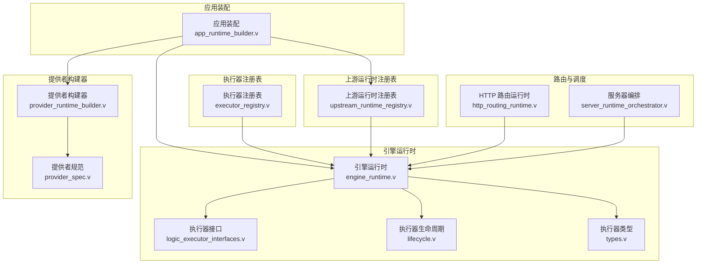
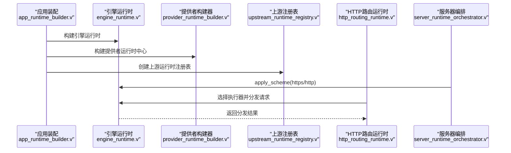
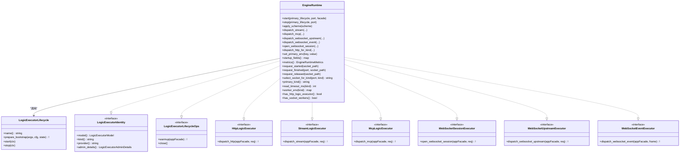
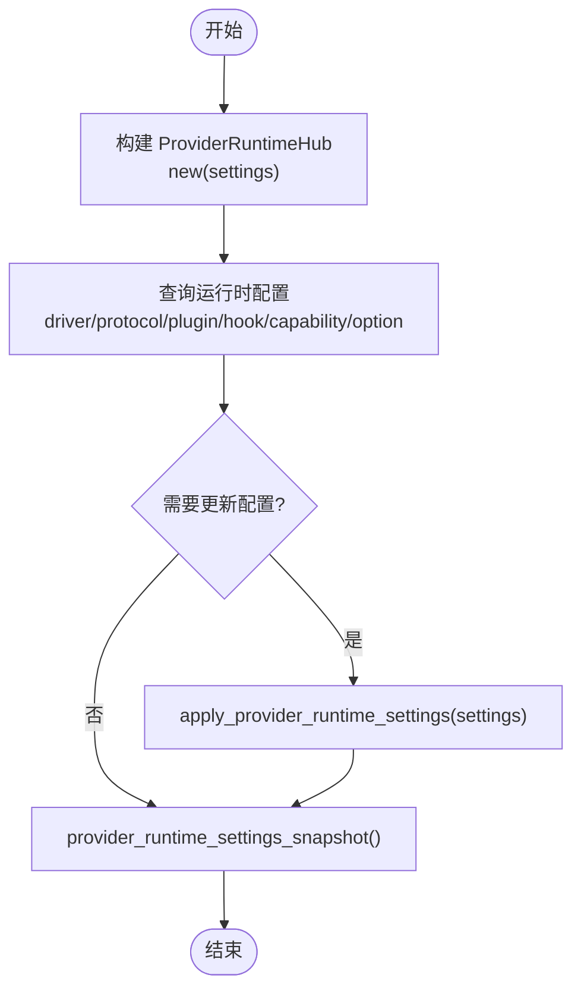
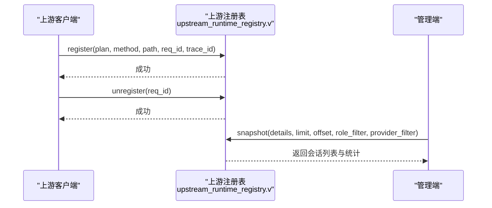
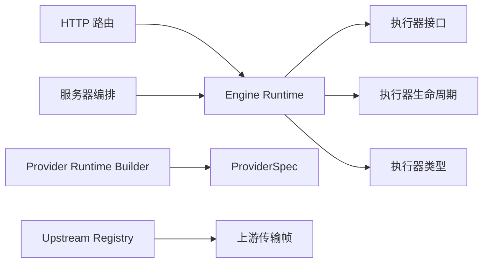

# 核心组件详解

<cite>
**本文引用的文件**   
- [engine_runtime.v](file://src/engine_runtime.v)
- [provider_runtime_builder.v](file://src/provider_runtime_builder.v)
- [executor_registry.v](file://src/executor_registry.v)
- [upstream_runtime_registry.v](file://src/upstream_runtime_registry.v)
- [app_runtime_builder.v](file://src/app_runtime_builder.v)
- [server_runtime_orchestrator.v](file://src/server_runtime_orchestrator.v)
- [http_routing_runtime.v](file://src/http_routing_runtime.v)
- [provider_spec.v](file://src/provider_spec.v)
- [executor/lifecycle.v](file://src/executor/lifecycle.v)
- [executor/logic_executor_interfaces.v](file://src/executor/logic_executor_interfaces.v)
- [executor/types.v](file://src/executor/types.v)
</cite>

## 目录
1. [简介](#简介)
2. [项目结构](#项目结构)
3. [核心组件](#核心组件)
4. [架构总览](#架构总览)
5. [详细组件分析](#详细组件分析)
6. [依赖关系分析](#依赖关系分析)
7. [性能考量](#性能考量)
8. [故障排查指南](#故障排查指南)
9. [结论](#结论)
10. [附录](#附录)

## 简介
本文件聚焦 VHTTPD 的四大核心组件：Engine Runtime（引擎运行时）、Provider Runtime Builder（提供者构建器）、Executor Registry（执行器注册表）与 Upstream Runtime Registry（上游运行时注册表）。文档从接口定义、配置选项、生命周期管理、错误处理机制入手，结合架构图与调用序列图，帮助开发者理解并扩展这些能力。

## 项目结构
围绕四个核心组件的代码主要分布在以下模块：
- 引擎运行时：负责协程调度、资源管理与多执行器编排
- 提供者构建器：集中管理外部服务集成（如 Feishu、Codex）的配置与运行时状态
- 执行器注册表：提供内置执行器规格快照，支撑管理面可见性
- 上游运行时注册表：维护外部连接会话、统计与快照

图表来源
- [app_runtime_builder.v:27-56](file://src/app_runtime_builder.v#L27-L56)
- [engine_runtime.v:1-200](file://src/engine_runtime.v#L1-L200)
- [provider_runtime_builder.v:1-133](file://src/provider_runtime_builder.v#L1-L133)
- [executor_registry.v:1-14](file://src/executor_registry.v#L1-L14)
- [upstream_runtime_registry.v:1-168](file://src/upstream_runtime_registry.v#L1-L168)
- [http_routing_runtime.v:53-110](file://src/http_routing_runtime.v#L53-L110)
- [server_runtime_orchestrator.v:96-142](file://src/server_runtime_orchestrator.v#L96-L142)

章节来源
- [app_runtime_builder.v:27-56](file://src/app_runtime_builder.v#L27-L56)
- [engine_runtime.v:1-200](file://src/engine_runtime.v#L1-L200)
- [provider_runtime_builder.v:1-133](file://src/provider_runtime_builder.v#L1-L133)
- [executor_registry.v:1-14](file://src/executor_registry.v#L1-L14)
- [upstream_runtime_registry.v:1-168](file://src/upstream_runtime_registry.v#L1-L168)
- [http_routing_runtime.v:53-110](file://src/http_routing_runtime.v#L53-L110)
- [server_runtime_orchestrator.v:96-142](file://src/server_runtime_orchestrator.v#L96-L142)

## 核心组件
本节概述各组件的职责与对外能力，后续章节将深入接口、配置、生命周期与错误处理。

- Engine Runtime（引擎运行时）
  - 职责：统一启动/停止逻辑执行器，协调主/附加执行器池，分发 HTTP/流/MCP/WebSocket 请求，维护工作进程队列指标与环境变量传播。
  - 关键能力：start/stop、apply_scheme、dispatch_*、metrics、worker 生命周期钩子。
- Provider Runtime Builder（提供者构建器）
  - 职责：集中解析与注入外部服务（Feishu、Codex）运行时设置，提供驱动/协议/插件/能力/钩子/选项查询，生成快照。
  - 关键能力：new、apply_provider_runtime_settings、snapshot、codex/feishu 状态初始化。
- Executor Registry（执行器注册表）
  - 职责：暴露内置执行器规格的管理面快照，便于 UI/CLI 展示可用执行器能力。
  - 关键能力：admin_logic_executor_specs_snapshot。
- Upstream Runtime Registry（上游运行时注册表）
  - 职责：维护外部连接会话（如 Ollama/NDJSON），记录计划总数/错误数，支持分页过滤快照。
  - 关键能力：register/unregister/note_error/snapshot/active_count/totals。

章节来源
- [engine_runtime.v:1-200](file://src/engine_runtime.v#L1-L200)
- [provider_runtime_builder.v:1-133](file://src/provider_runtime_builder.v#L1-L133)
- [executor_registry.v:1-14](file://src/executor_registry.v#L1-L14)
- [upstream_runtime_registry.v:1-168](file://src/upstream_runtime_registry.v#L1-L168)

## 架构总览
下图展示了核心组件在应用装配中的协作关系，以及它们与执行器、路由和服务器编排的交互。

图表来源
- [app_runtime_builder.v:27-56](file://src/app_runtime_builder.v#L27-L56)
- [engine_runtime.v:68-76](file://src/engine_runtime.v#L68-L76)
- [http_routing_runtime.v:53-110](file://src/http_routing_runtime.v#L53-L110)
- [server_runtime_orchestrator.v:96-142](file://src/server_runtime_orchestrator.v#L96-L142)

## 详细组件分析

### Engine Runtime（引擎运行时）
- 接口与能力
  - 生命周期：start/stop 通过 LogicExecutorLifecycle 回调执行，统一 warmup/close。
  - 环境传播：apply_scheme 向 worker 环境变量注入 scheme。
  - 分发：HTTP/Stream/MCP/WebSocket 等通过对应端口转发到具体执行器实现。
  - 指标：metrics 汇总队列等待/拒绝/超时、池大小、后端模式、队列容量/超时、流分发开关、生命周期阶段。
  - Worker 跟踪：request_started/request_finished/request_released 维护 in-flight 计数与最大请求数触发重启。
- 配置选项
  - 读取超时：read_timeout_ms(kind) 按 kind 区分主/附加执行器。
  - 环境变量：worker_env(kind) 返回对应执行器池的环境映射。
  - 模型与提供者：model()/provider() 用于管理面展示。
- 生命周期管理
  - start：先启动主执行器生命周期，再 warmup；随后遍历 additional 执行器执行相同流程。
  - stop：反向顺序停止并关闭执行器。
- 错误处理
  - warmup 失败时规范化错误消息并记录日志。
  - 未知 kind 或不可用执行器返回错误。
- 使用示例与最佳实践
  - 在 HTTPS 场景下，确保由服务器编排层调用 apply_scheme 以正确传播 scheme。
  - 对高并发场景，关注 metrics 中 queue_depth 与 pool_size，必要时调整队列容量与超时。
  - 利用 request_finished 的重启策略，合理设置 max_requests 避免内存泄漏累积。

图表来源
- [engine_runtime.v:1-200](file://src/engine_runtime.v#L1-L200)
- [executor/lifecycle.v:1-42](file://src/executor/lifecycle.v#L1-L42)
- [executor/logic_executor_interfaces.v:1-50](file://src/executor/logic_executor_interfaces.v#L1-L50)
- [executor/types.v:65-134](file://src/executor/types.v#L65-L134)

章节来源
- [engine_runtime.v:1-200](file://src/engine_runtime.v#L1-L200)
- [executor/lifecycle.v:1-42](file://src/executor/lifecycle.v#L1-L42)
- [executor/logic_executor_interfaces.v:1-50](file://src/executor/logic_executor_interfaces.v#L1-L50)
- [executor/types.v:65-134](file://src/executor/types.v#L65-L134)

### Provider Runtime Builder（提供者构建器）
- 接口与能力
  - 构造：new(settings) 初始化驱动/协议/插件/能力/钩子/选项映射，并构建 Codex/Feishu 状态。
  - 查询：provider_runtime_driver/protocol/plugin/hook/capability/option 提供按提供者名称的运行时配置访问。
  - 更新：apply_provider_runtime_settings 动态刷新配置并回填到已注册规范。
  - 快照：provider_runtime_settings_snapshot 输出当前运行时设置。
- 配置选项
  - runtime_drivers/runtime_protocols/runtime_plugins/runtime_capabilities/runtime_hooks/runtime_options 为键值映射，支持 per-provider 覆盖。
  - codex/feishu 子配置包含启用开关、URL、重试延迟、事件限制、桥接参数等。
- 生命周期管理
  - 无显式 start/stop，但可通过 apply_provider_runtime_settings 进行热更新。
- 错误处理
  - 未配置项回退默认值（例如 driver 缺省 'native'），避免空指针与异常。
- 使用示例与最佳实践
  - 在部署前通过 snapshot 校验配置一致性。
  - 针对 Feishu/Codex 分别设置 reconnect_delay_ms 与 flush_interval_ms，平衡稳定性与实时性。

图表来源
- [provider_runtime_builder.v:1-133](file://src/provider_runtime_builder.v#L1-L133)
- [provider_spec.v:1-61](file://src/provider_spec.v#L1-L61)

章节来源
- [provider_runtime_builder.v:1-133](file://src/provider_runtime_builder.v#L1-L133)
- [provider_spec.v:1-61](file://src/provider_spec.v#L1-L61)

### Executor Registry（执行器注册表）
- 接口与能力
  - admin_logic_executor_specs_snapshot：收集所有内置执行器规格，转换为管理面快照列表。
- 配置选项
  - 无直接配置项，行为取决于内置执行器规格集合。
- 生命周期管理
  - 无状态，按需生成快照。
- 错误处理
  - 无异常路径，仅聚合现有规格。
- 使用示例与最佳实践
  - 在管理面板中列出可用执行器，辅助用户选择 executor.kind。
  - 结合 engine_runtime.metrics 与 admin details 做能力对比。

章节来源
- [executor_registry.v:1-14](file://src/executor_registry.v#L1-L14)

### Upstream Runtime Registry（上游运行时注册表）
- 接口与能力
  - register/unregister：按 req_id 维护外部连接会话，记录方法/路径/传输/编解码/映射/流类型/来源等元信息。
  - note_error：累计计划错误数。
  - snapshot：支持 role/provider 过滤、分页排序，返回活跃会话清单与统计。
  - totals：返回 plans_total 与 plan_errors_total。
- 配置选项
  - 无直接配置项，行为受上游计划帧 transport.WorkerUpstreamPlanFrame 影响。
- 生命周期管理
  - 会话随 register/unregister 增删，注意清理以避免内存增长。
- 错误处理
  - 空 req_id 直接忽略；错误计数独立于会话，便于观测。
- 使用示例与最佳实践
  - 在长连接场景中，确保 unregister 在连接关闭时调用。
  - 使用 snapshot 的 limit/offset 控制管理面负载，避免全量扫描。

图表来源
- [upstream_runtime_registry.v:1-168](file://src/upstream_runtime_registry.v#L1-L168)

章节来源
- [upstream_runtime_registry.v:1-168](file://src/upstream_runtime_registry.v#L1-L168)

## 依赖关系分析
- 组件耦合
  - Engine Runtime 强依赖执行器接口与生命周期抽象，弱依赖路由与服务器编排。
  - Provider Runtime Builder 与 ProviderSpec 紧密耦合，提供运行时配置注入。
  - Upstream Runtime Registry 与上游传输帧解耦，通过通用字段描述会话。
- 外部依赖
  - 执行器接口定义位于 executor.* 模块，提供统一能力边界。
  - 服务器编排负责 scheme 传播与 HTTP 服务启动。
- 潜在循环依赖
  - 通过函数指针与闭包（如 LifecycleRuntimeContext）避免循环导入。
- 接口契约
  - 执行器需满足多个接口（HTTP/Stream/MCP/WebSocket），Engine Runtime 通过端口获取具体实现。

图表来源
- [engine_runtime.v:1-200](file://src/engine_runtime.v#L1-L200)
- [executor/logic_executor_interfaces.v:1-50](file://src/executor/logic_executor_interfaces.v#L1-L50)
- [executor/lifecycle.v:1-42](file://src/executor/lifecycle.v#L1-L42)
- [executor/types.v:65-134](file://src/executor/types.v#L65-L134)
- [provider_runtime_builder.v:1-133](file://src/provider_runtime_builder.v#L1-L133)
- [provider_spec.v:1-61](file://src/provider_spec.v#L1-L61)
- [upstream_runtime_registry.v:1-168](file://src/upstream_runtime_registry.v#L1-L168)
- [http_routing_runtime.v:53-110](file://src/http_routing_runtime.v#L53-L110)
- [server_runtime_orchestrator.v:96-142](file://src/server_runtime_orchestrator.v#L96-L142)

章节来源
- [engine_runtime.v:1-200](file://src/engine_runtime.v#L1-L200)
- [executor/logic_executor_interfaces.v:1-50](file://src/executor/logic_executor_interfaces.v#L1-L50)
- [executor/lifecycle.v:1-42](file://src/executor/lifecycle.v#L1-L42)
- [executor/types.v:65-134](file://src/executor/types.v#L65-L134)
- [provider_runtime_builder.v:1-133](file://src/provider_runtime_builder.v#L1-L133)
- [provider_spec.v:1-61](file://src/provider_spec.v#L1-L61)
- [upstream_runtime_registry.v:1-168](file://src/upstream_runtime_registry.v#L1-L168)
- [http_routing_runtime.v:53-110](file://src/http_routing_runtime.v#L53-L110)
- [server_runtime_orchestrator.v:96-142](file://src/server_runtime_orchestrator.v#L96-L142)

## 性能考量
- 队列与池
  - 关注 queue_depth、pool_size、queue_capacity、queue_timeout_ms，避免排队风暴。
- 流分发
  - stream_dispatch 开启时需评估主执行器压力，必要时拆分至附加执行器池。
- 上游会话
  - snapshot 分页与过滤可减少管理面开销；注意及时 unregister 释放资源。
- 环境变量
  - apply_scheme 仅在必要时调用，避免频繁变更导致 worker 上下文不一致。

## 故障排查指南
- 执行器预热失败
  - 现象：warmup 报错并记录日志。
  - 排查：检查执行器实现与入口配置，确认依赖库与运行环境。
- 未知执行器 kind
  - 现象：dispatch_http_for_kind 返回 unknown_executor_kind 错误。
  - 排查：确认路由规则与站点配置中的 executor.kind 是否匹配内置规格。
- 上游会话未清理
  - 现象：active_count 持续增长。
  - 排查：确保连接关闭时调用 unregister；检查错误路径是否遗漏。
- 队列积压
  - 现象：queue_waits_total/queue_timeouts_total 上升。
  - 排查：增大 pool_size 或优化执行器处理耗时；调整 queue_timeout_ms。

章节来源
- [engine_runtime.v:32-66](file://src/engine_runtime.v#L32-L66)
- [engine_runtime.v:202-208](file://src/engine_runtime.v#L202-L208)
- [upstream_runtime_registry.v:78-85](file://src/upstream_runtime_registry.v#L78-L85)
- [engine_runtime.v:234-249](file://src/engine_runtime.v#L234-L249)

## 结论
Engine Runtime、Provider Runtime Builder、Executor Registry 与 Upstream Runtime Registry 共同构成 VHTTPD 的核心运行时骨架。通过统一的执行器接口、灵活的提供者配置与健壮的上游会话管理，系统实现了可扩展、可观测且高性能的多协议处理能力。建议在生产环境中结合 metrics 与快照能力持续调优，并遵循生命周期与错误处理的最佳实践。

## 附录
- 相关参考
  - 执行器接口与类型定义：[executor/logic_executor_interfaces.v](file://src/executor/logic_executor_interfaces.v)、[executor/types.v](file://src/executor/types.v)
  - 执行器生命周期：[executor/lifecycle.v](file://src/executor/lifecycle.v)
  - 应用装配与路由：[app_runtime_builder.v](file://src/app_runtime_builder.v)、[http_routing_runtime.v](file://src/http_routing_runtime.v)
  - 服务器编排与 scheme 传播：[server_runtime_orchestrator.v](file://src/server_runtime_orchestrator.v)