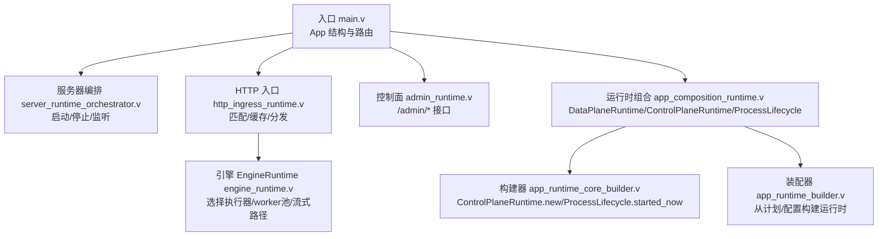
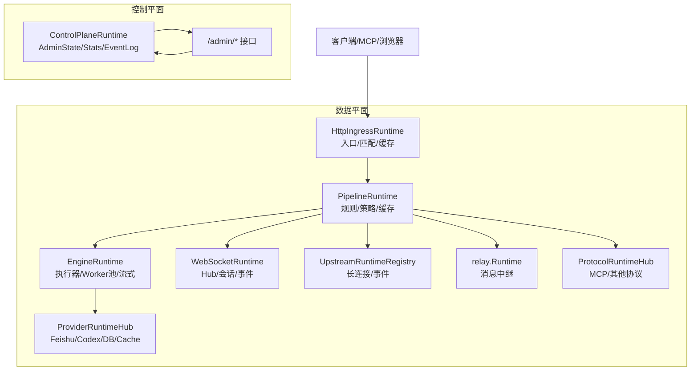
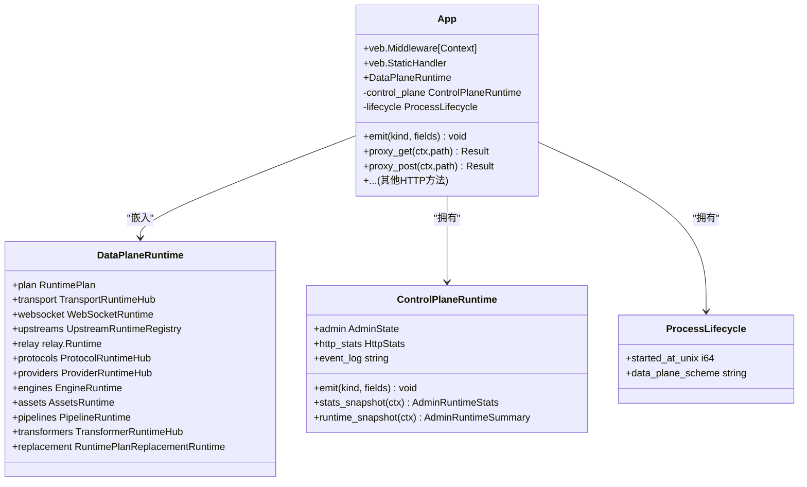
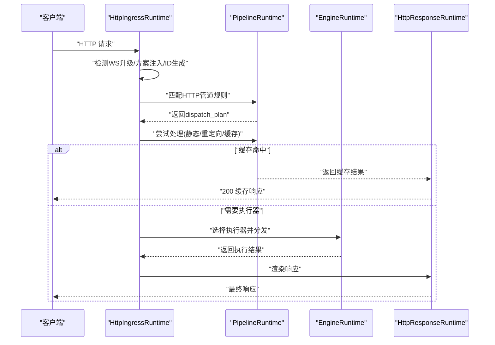
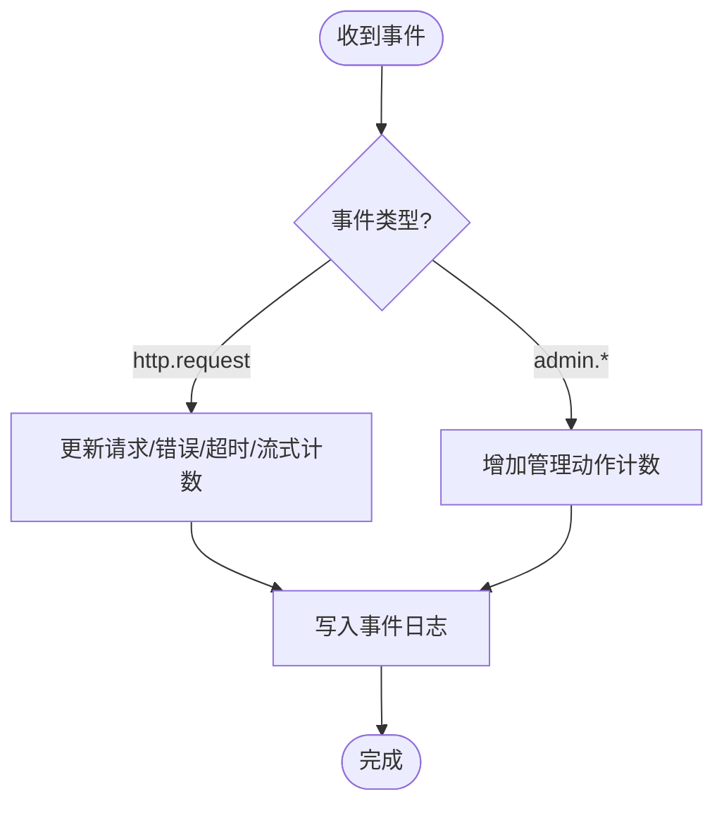
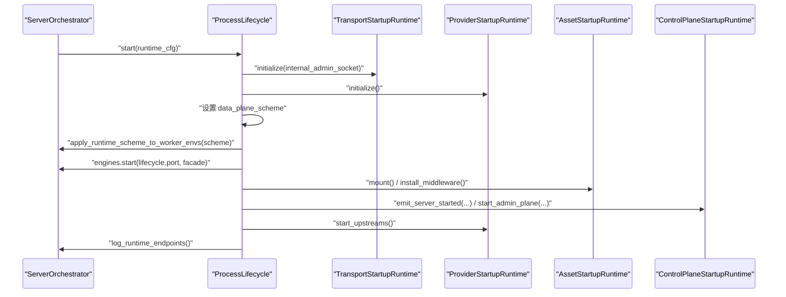
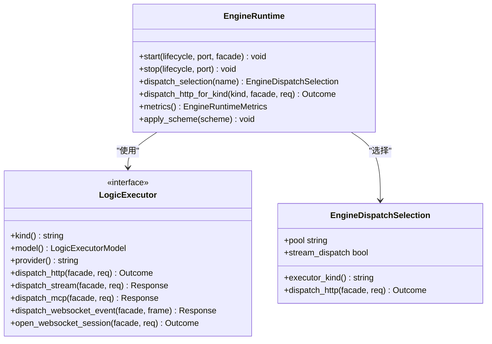
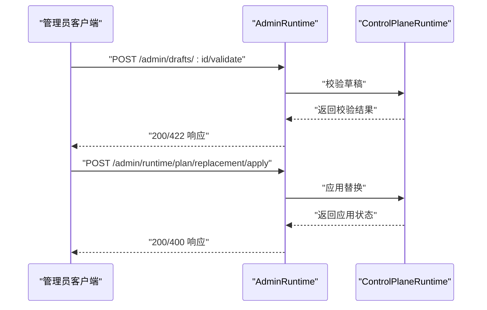
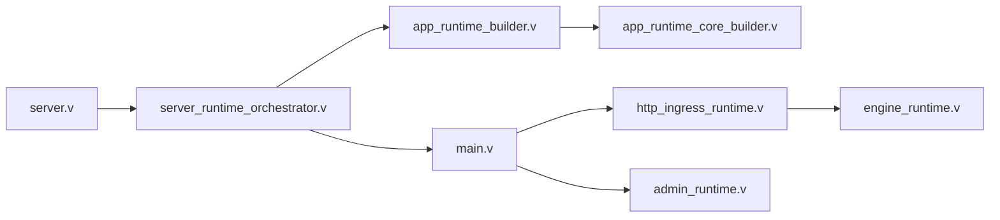

# 系统架构设计

<cite>
**本文引用的文件**   
- [README.md](file://README.md)
- [src/main.v](file://src/main.v)
- [src/app_composition_runtime.v](file://src/app_composition_runtime.v)
- [src/app_runtime_core_builder.v](file://src/app_runtime_core_builder.v)
- [src/server.v](file://src/server.v)
- [src/server_runtime_orchestrator.v](file://src/server_runtime_orchestrator.v)
- [src/engine_runtime.v](file://src/engine_runtime.v)
- [src/http_ingress_runtime.v](file://src/http_ingress_runtime.v)
- [src/admin_runtime.v](file://src/admin_runtime.v)
</cite>

## 目录
1. [引言](#引言)
2. [项目结构](#项目结构)
3. [核心组件](#核心组件)
4. [架构总览](#架构总览)
5. [详细组件分析](#详细组件分析)
6. [依赖关系分析](#依赖关系分析)
7. [性能与可扩展性](#性能与可扩展性)
8. [故障排查指南](#故障排查指南)
9. [结论](#结论)
10. [附录](#附录)

## 引言
本文件面向 VHTTPD 的系统架构设计，聚焦控制平面与数据平面的分离、模块化与插件化扩展机制。文档从整体到细节逐层展开：先给出高层架构图与职责划分，再深入到 App 主应用结构、DataPlaneRuntime 数据平面运行时、ControlPlaneRuntime 控制平面运行时、ProcessLifecycle 进程生命周期管理等关键组件的职责边界与交互方式，并解释分层设计的动机、权衡与通信契约。文末提供可操作的排障建议与最佳实践，帮助初学者快速理解，同时为有经验的开发者提供深入的技术细节。

## 项目结构
VHTTPD 采用“薄入口 + 厚运行时”的模块化组织方式：
- 入口与路由：main.v 定义 App 结构体与 HTTP 路由转发；server.v 负责启动、参数解析、信号处理与多实例编排；server_runtime_orchestrator.v 负责启动顺序与监听器绑定。
- 运行时组合：app_composition_runtime.v 定义 DataPlaneRuntime、ControlPlaneRuntime、ProcessLifecycle 三大运行时结构；app_runtime_core_builder.v 提供 ControlPlaneRuntime 构造与 ProcessLifecycle 初始化；app_runtime_builder.v 将配置/计划编译为运行时对象并装配各子系统。
- 协议与调度：http_ingress_runtime.v 统一 HTTP 入口、WebSocket 升级、管道匹配与引擎分发；engine_runtime.v 封装逻辑执行器（php/vjsx）与 worker 后端、流式分发、MCP/WebSocket 事件派发等。
- 管理面：admin_runtime.v 暴露 /admin/* 控制面 API，读取/写入运行时状态、草稿与替换流程。

图表来源
- [src/main.v:16-23](file://src/main.v#L16-L23)
- [src/server_runtime_orchestrator.v:55-84](file://src/server_runtime_orchestrator.v#L55-L84)
- [src/http_ingress_runtime.v:31-40](file://src/http_ingress_runtime.v#L31-L40)
- [src/engine_runtime.v:32-51](file://src/engine_runtime.v#L32-L51)
- [src/admin_runtime.v:7-20](file://src/admin_runtime.v#L7-L20)
- [src/app_composition_runtime.v:14-47](file://src/app_composition_runtime.v#L14-L47)
- [src/app_runtime_core_builder.v:7-23](file://src/app_runtime_core_builder.v#L7-L23)
- [src/app_runtime_builder.v:10-56](file://src/app_runtime_builder.v#L10-L56)

章节来源
- [src/main.v:16-23](file://src/main.v#L16-L23)
- [src/server.v:276-319](file://src/server.v#L276-L319)
- [src/server_runtime_orchestrator.v:55-84](file://src/server_runtime_orchestrator.v#L55-L84)
- [src/app_composition_runtime.v:14-47](file://src/app_composition_runtime.v#L14-L47)
- [src/app_runtime_core_builder.v:7-23](file://src/app_runtime_core_builder.v#L7-L23)
- [src/app_runtime_builder.v:10-56](file://src/app_runtime_builder.v#L10-L56)

## 核心组件
本节聚焦四大核心组件的职责边界与协作方式。

- App 主应用结构
  - 作为 veb.Middleware 与 veb.StaticHandler 的组合容器，持有 DataPlaneRuntime、ControlPlaneRuntime、ProcessLifecycle。
  - 通过中间件与静态资源处理器承载数据面请求，并通过 control_plane.emit 向控制面广播事件。
  - 所有 HTTP 方法均委托给 HttpIngressRuntime.route，实现统一的协议入口。

- DataPlaneRuntime 数据平面运行时
  - 聚合传输、WebSocket、上游、中继、协议、提供者、引擎、资源、管道、转换器、运行时计划替换等子系统。
  - 以 RuntimePlan 为核心，驱动请求匹配、缓存、响应渲染与执行器选择。
  - 对外暴露快照与诊断能力，供控制面查询。

- ControlPlaneRuntime 控制平面运行时
  - 维护 AdminState、HTTP 统计、事件日志路径。
  - emit 方法对 http.request 与 admin.* 事件进行计数与持久化。
  - 提供 stats_snapshot 与 runtime_snapshot 用于控制面查询。

- ProcessLifecycle 进程生命周期管理
  - 记录进程启动时间、数据平面 scheme（http/https）。
  - 在启动阶段设置 scheme 并注入到 worker 环境变量，确保下游一致。

章节来源
- [src/main.v:16-23](file://src/main.v#L16-L23)
- [src/app_composition_runtime.v:14-47](file://src/app_composition_runtime.v#L14-L47)
- [src/app_composition_runtime.v:49-87](file://src/app_composition_runtime.v#L49-L87)
- [src/app_runtime_core_builder.v:7-23](file://src/app_runtime_core_builder.v#L7-L23)

## 架构总览
VHTTPD 采用“控制平面/数据平面分离 + 模块化 + 插件化”的分层架构：
- 控制平面：独立于数据面，提供运行时观测、配置草稿、验证、差异预览、原子替换与最终化能力。
- 数据平面：基于 veb 的 HTTP 源，承担协议终止、管道匹配、缓存、执行器分发与响应渲染。
- 模块化：Transport、WebSocket、Upstream、Relay、Protocol、Provider、Engine、Pipeline、Transformer 等模块按职责解耦。
- 插件化：通过 LogicExecutor 模型抽象 php/vjsx 等执行器，支持未来新增宿主类型；Provider 与 Adapter 体系支撑外部集成。

图表来源
- [src/http_ingress_runtime.v:31-40](file://src/http_ingress_runtime.v#L31-L40)
- [src/engine_runtime.v:32-51](file://src/engine_runtime.v#L32-L51)
- [src/app_composition_runtime.v:14-47](file://src/app_composition_runtime.v#L14-L47)
- [src/admin_runtime.v:7-20](file://src/admin_runtime.v#L7-L20)

## 详细组件分析

### App 主应用结构
- 角色定位：App 是 veb 中间件栈与静态资源处理的宿主，内嵌 DataPlaneRuntime、ControlPlaneRuntime、ProcessLifecycle。
- 路由行为：所有 HTTP 方法统一委托给 HttpIngressRuntime.route，保证入口一致性。
- 事件发射：App.emit 调用 control_plane.emit，将 server.*、admin.* 等事件写入事件日志并更新统计。

图表来源
- [src/main.v:16-23](file://src/main.v#L16-L23)
- [src/app_composition_runtime.v:14-47](file://src/app_composition_runtime.v#L14-L47)
- [src/app_composition_runtime.v:49-87](file://src/app_composition_runtime.v#L49-L87)

章节来源
- [src/main.v:83-116](file://src/main.v#L83-L116)
- [src/app_composition_runtime.v:14-47](file://src/app_composition_runtime.v#L14-L47)
- [src/app_composition_runtime.v:49-87](file://src/app_composition_runtime.v#L49-L87)

### DataPlaneRuntime 数据平面运行时
- 职责边界：聚合运行时子系统，围绕 RuntimePlan 组织请求匹配、缓存、响应渲染与执行器选择。
- 关键能力：
  - 管道匹配与策略：根据方法、目标、查询、头部、主体、远端地址、trace_id/request_id 等维度匹配规则。
  - 缓存命中：对 GET/HEAD 且命中缓存的请求直接返回，降低延迟。
  - 执行器选择：根据 dispatch_plan.executor 动态选择主或附加执行器，支持流式分发优先尝试。
  - 响应渲染：统一渲染缓存命中、错误、流式、上游计划与普通响应。

图表来源
- [src/http_ingress_runtime.v:31-40](file://src/http_ingress_runtime.v#L31-L40)
- [src/http_ingress_runtime.v:56-139](file://src/http_ingress_runtime.v#L56-L139)
- [src/engine_runtime.v:140-155](file://src/engine_runtime.v#L140-L155)

章节来源
- [src/http_ingress_runtime.v:56-139](file://src/http_ingress_runtime.v#L56-L139)
- [src/engine_runtime.v:140-155](file://src/engine_runtime.v#L140-L155)

### ControlPlaneRuntime 控制平面运行时
- 职责边界：集中管理 AdminState、HTTP 统计与事件日志，提供统计快照与运行时快照。
- 事件处理：
  - http.request：累计请求数、错误数、超时数、流式数。
  - admin.*：累计管理动作数。
  - 将事件追加写入事件日志文件，便于离线分析与审计。
- 快照能力：stats_snapshot 与 runtime_snapshot 为控制面提供一致的只读视图。

图表来源
- [src/app_composition_runtime.v:49-77](file://src/app_composition_runtime.v#L49-L77)

章节来源
- [src/app_composition_runtime.v:49-87](file://src/app_composition_runtime.v#L49-L87)

### ProcessLifecycle 进程生命周期管理
- 职责边界：记录进程启动时间与数据平面 scheme（http/https），并在启动阶段将 scheme 注入到 worker 环境变量，确保下游一致。
- 启动流程：
  - 初始化传输与内部管理通道。
  - 启动提供者、挂载静态资源、安装中间件。
  - 启动控制面与上游提供者，输出运行端点日志。

图表来源
- [src/server_runtime_orchestrator.v:55-84](file://src/server_runtime_orchestrator.v#L55-L84)
- [src/engine_runtime.v:68-76](file://src/engine_runtime.v#L68-L76)

章节来源
- [src/server_runtime_orchestrator.v:55-84](file://src/server_runtime_orchestrator.v#L55-L84)
- [src/engine_runtime.v:68-76](file://src/engine_runtime.v#L68-L76)

### 插件化与执行器模型
- 执行器模型：LogicExecutor 抽象了不同宿主（php/vjsx/未来宿主）的统一接口，包括 HTTP 分发、流式分发、MCP 分发、WebSocket 事件分发与会话打开。
- 引擎运行时：EngineRuntime 统一管理主执行器与附加执行器，提供环境注入、指标采集、队列与 worker 生命周期管理。
- 插件扩展：通过 ProviderRuntimeHub 与 Adapter/Transform/Pipeline 等模块，支持外部协议与业务能力的插拔式接入。

图表来源
- [src/engine_runtime.v:32-51](file://src/engine_runtime.v#L32-L51)
- [src/engine_runtime.v:78-96](file://src/engine_runtime.v#L78-96)
- [src/engine_runtime.v:140-155](file://src/engine_runtime.v#L140-L155)

章节来源
- [src/engine_runtime.v:32-51](file://src/engine_runtime.v#L32-L51)
- [src/engine_runtime.v:78-96](file://src/engine_runtime.v#L78-96)
- [src/engine_runtime.v:140-155](file://src/engine_runtime.v#L140-L155)

### 控制面 API 与管理流程
- 运行时观测：/admin/runtime、/admin/events、/admin/runtime/graph、/admin/schema 等接口提供运行时状态、事件与模式图。
- 配置草稿与替换：/admin/drafts、/admin/config/files、/admin/runtime/plan/replacement 支持创建草稿、校验、差异预览、应用与最终化。
- 提供者与上游：/admin/runtime/provider-instances、/admin/runtime/upstreams、/admin/runtime/websockets、/admin/runtime/mcp 等接口提供运行时可见性。

图表来源
- [src/admin_runtime.v:293-310](file://src/admin_runtime.v#L293-L310)
- [src/admin_runtime.v:398-423](file://src/admin_runtime.v#L398-L423)

章节来源
- [src/admin_runtime.v:7-20](file://src/admin_runtime.v#L7-L20)
- [src/admin_runtime.v:293-310](file://src/admin_runtime.v#L293-L310)
- [src/admin_runtime.v:398-423](file://src/admin_runtime.v#L398-L423)

## 依赖关系分析
- 入口与编排：server.v 负责参数解析、单/多实例模式选择、信号处理与优雅退出；server_runtime_orchestrator.v 负责启动顺序与监听器绑定。
- 运行时装配：app_runtime_builder.v 从 RuntimePlan 与配置构建运行时对象，组装各子系统；app_runtime_core_builder.v 提供 ControlPlaneRuntime 构造与 ProcessLifecycle 初始化。
- 协议与调度：http_ingress_runtime.v 统一入口与分发；engine_runtime.v 封装执行器与 worker 后端。
- 控制面：admin_runtime.v 暴露 /admin/* 接口，读取/写入运行时状态与草稿。

图表来源
- [src/server.v:276-319](file://src/server.v#L276-L319)
- [src/server_runtime_orchestrator.v:55-84](file://src/server_runtime_orchestrator.v#L55-L84)
- [src/app_runtime_builder.v:10-56](file://src/app_runtime_builder.v#L10-L56)
- [src/app_runtime_core_builder.v:7-23](file://src/app_runtime_core_builder.v#L7-L23)
- [src/main.v:83-116](file://src/main.v#L83-L116)
- [src/http_ingress_runtime.v:31-40](file://src/http_ingress_runtime.v#L31-L40)
- [src/engine_runtime.v:32-51](file://src/engine_runtime.v#L32-L51)
- [src/admin_runtime.v:7-20](file://src/admin_runtime.v#L7-L20)

章节来源
- [src/server.v:276-319](file://src/server.v#L276-L319)
- [src/server_runtime_orchestrator.v:55-84](file://src/server_runtime_orchestrator.v#L55-L84)
- [src/app_runtime_builder.v:10-56](file://src/app_runtime_builder.v#L10-L56)
- [src/app_runtime_core_builder.v:7-23](file://src/app_runtime_core_builder.v#L7-L23)
- [src/main.v:83-116](file://src/main.v#L83-L116)
- [src/http_ingress_runtime.v:31-40](file://src/http_ingress_runtime.v#L31-L40)
- [src/engine_runtime.v:32-51](file://src/engine_runtime.v#L32-L51)
- [src/admin_runtime.v:7-20](file://src/admin_runtime.v#L7-L20)

## 性能与可扩展性
- 分层设计动机：
  - 控制面与数据面分离：避免管理操作影响数据面吞吐，提升稳定性与可观测性。
  - 模块化：各子系统职责清晰，便于独立演进与测试。
  - 插件化：通过执行器与提供者模型，支持新宿主与外部集成的低成本接入。
- 依赖关系与通信：
  - 数据面通过 PipelineRuntime 与 EngineRuntime 协作，减少耦合。
  - 控制面通过 ControlPlaneRuntime 的事件与快照接口获取运行时信息。
- 可扩展性：
  - 新增执行器：实现 LogicExecutor 接口，注册到 EngineRuntime。
  - 新增提供者：通过 ProviderRuntimeHub 与相关适配器/转换器接入。
  - 新增协议：通过 ProtocolRuntimeHub 与适配层扩展。

[本节为通用指导，不直接分析具体文件]

## 故障排查指南
- 启动失败：检查 server_runtime_orchestrator.v 中的预检绑定与 SSL 证书路径；确认端口可用与权限正确。
- 无逻辑执行器：当没有可用的 HTTP 执行器时，入口会返回 404；检查 EngineRuntime 是否成功启动与 socket 数量。
- 事件缺失：确认 ControlPlaneRuntime 的事件日志路径可写，且 emit 被正确调用。
- 管理面不可用：确认 admin_enabled 与 token 配置，以及 /admin/* 路由是否正确挂载。

章节来源
- [src/server_runtime_orchestrator.v:18-46](file://src/server_runtime_orchestrator.v#L18-L46)
- [src/http_ingress_runtime.v:42-50](file://src/http_ingress_runtime.v#L42-L50)
- [src/app_composition_runtime.v:49-77](file://src/app_composition_runtime.v#L49-L77)
- [src/admin_runtime.v:7-20](file://src/admin_runtime.v#L7-L20)

## 结论
VHTTPD 通过控制面与数据面分离、模块化与插件化的分层设计，实现了高内聚、低耦合的可扩展运行时平台。App 主应用结构作为统一入口，DataPlaneRuntime 组织数据面能力，ControlPlaneRuntime 提供管理与观测，ProcessLifecycle 管理进程生命周期。该架构既满足初学者快速上手的需求，也为高级用户提供了深入的扩展与优化空间。

[本节为总结性内容，不直接分析具体文件]

## 附录
- 参考文档与示例：
  - README.md 提供总体说明、运行方式与示例配置。
  - docs 目录下包含配置模型、架构重构基线、协议流水线实现计划等深度文档。

章节来源
- [README.md:1-800](file://README.md#L1-L800)