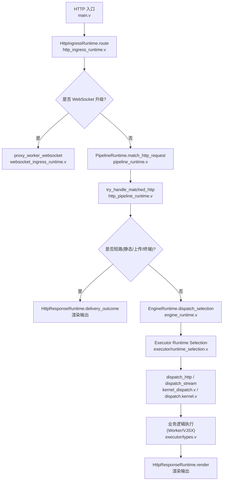
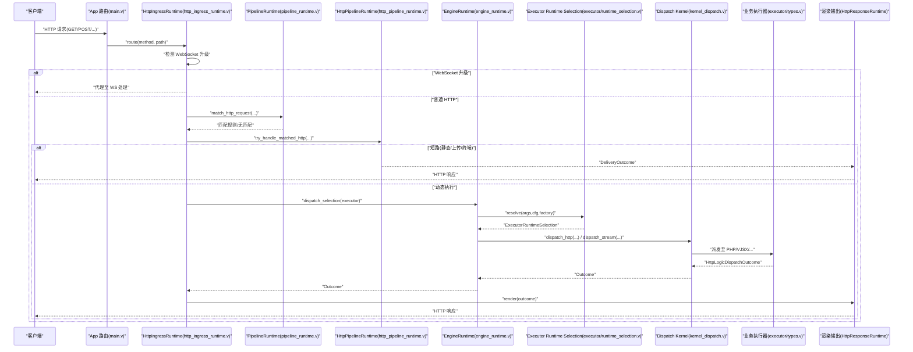
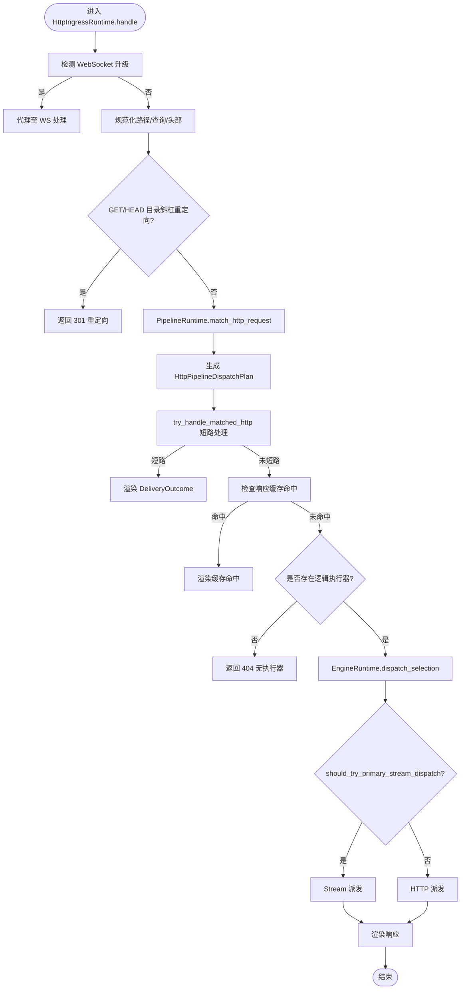
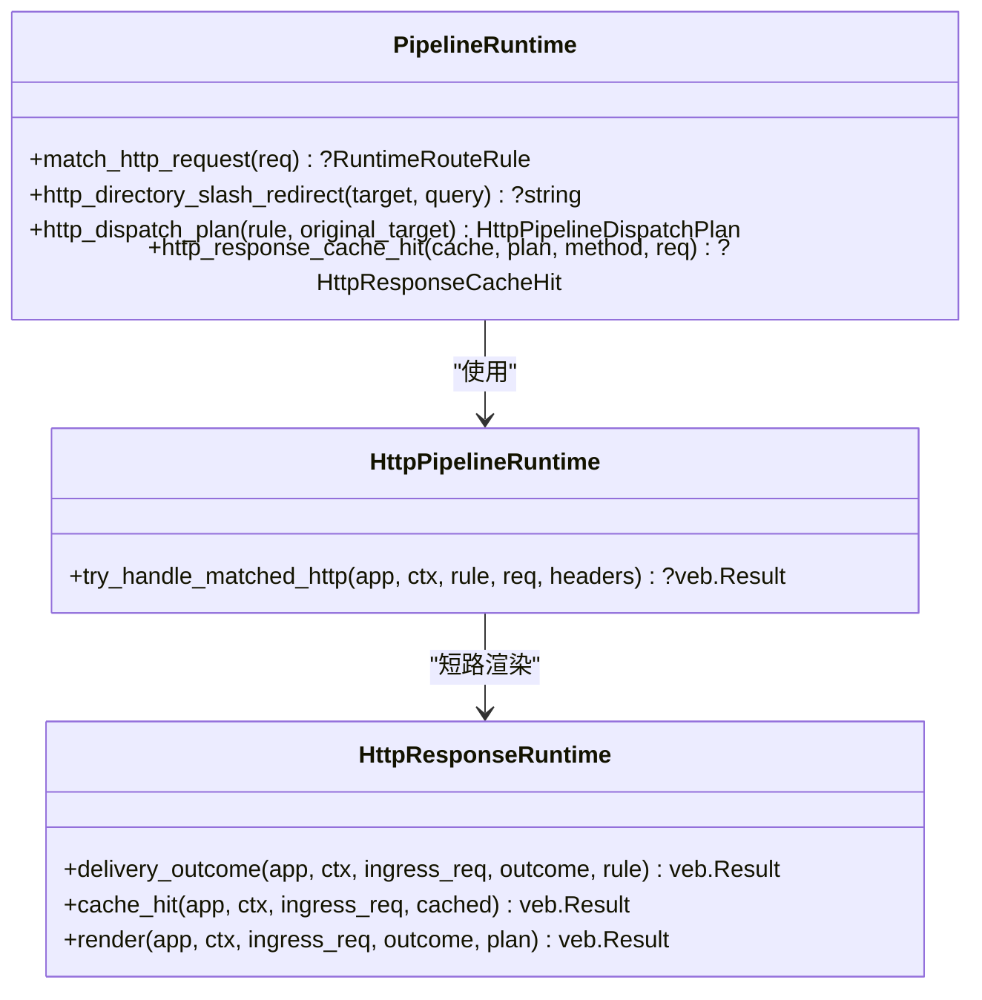
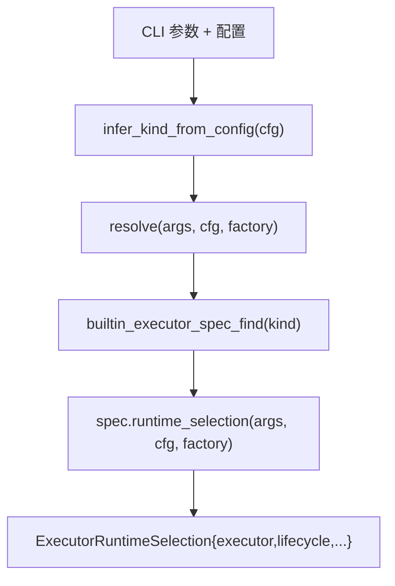
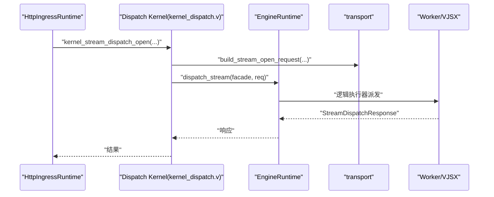
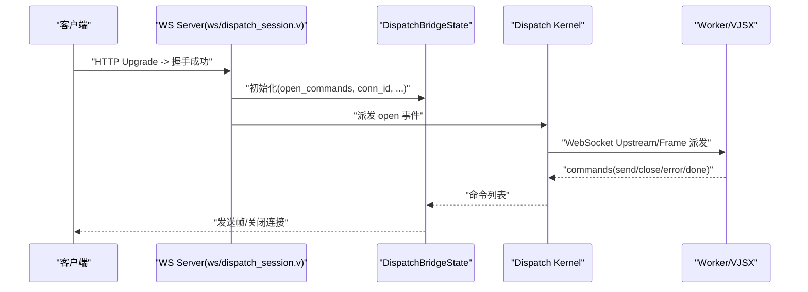
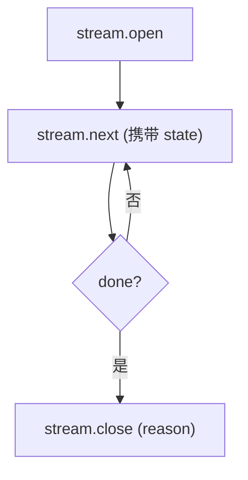
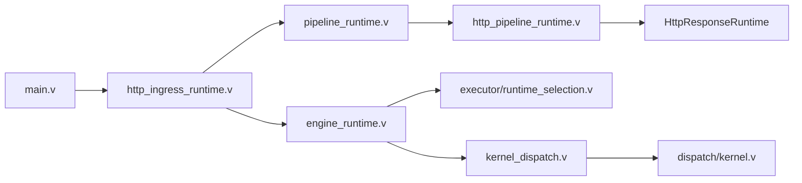

# 请求处理流程

<cite>
**本文引用的文件**   
- [src/main.v](file://src/main.v)
- [src/http_ingress_runtime.v](file://src/http_ingress_runtime.v)
- [src/pipeline_runtime.v](file://src/pipeline_runtime.v)
- [src/http_pipeline_runtime.v](file://src/http_pipeline_runtime.v)
- [src/engine_runtime.v](file://src/engine_runtime.v)
- [src/executor/runtime_selection.v](file://src/executor/runtime_selection.v)
- [src/executor/types.v](file://src/executor/types.v)
- [src/dispatch/kernel.v](file://src/dispatch/kernel.v)
- [src/kernel_dispatch.v](file://src/kernel_dispatch.v)
- [src/websocket_ingress_runtime.v](file://src/websocket_ingress_runtime.v)
- [src/ws/dispatch_session.v](file://src/ws/dispatch_session.v)
- [src/stream_runtime.v](file://src/stream_runtime.v)
- [docs/PROTOCOL_PIPELINE_IMPLEMENTATION_PLAN.md](file://docs/PROTOCOL_PIPELINE_IMPLEMENTATION_PLAN.md)
</cite>

## 目录
1. [简介](#简介)
2. [项目结构](#项目结构)
3. [核心组件](#核心组件)
4. [架构总览](#架构总览)
5. [详细组件分析](#详细组件分析)
6. [依赖关系分析](#依赖关系分析)
7. [性能考量](#性能考量)
8. [故障排查指南](#故障排查指南)
9. [结论](#结论)
10. [附录](#附录)

## 简介
本文面向 VHTTPD 的请求处理链路，系统化梳理从协议入口到业务逻辑执行的完整路径：HTTP/WebSocket/Stream 请求进入 → 路由匹配 → 执行器选择 → 管道处理 → 业务逻辑执行 → 响应返回。重点说明以下关键实现：
- HttpIngressRuntime 的 HTTP 入口与 WebSocket 升级分流
- Dispatch Kernel 的请求调度（HTTP/Stream/MCP/WebSocket）
- Executor Runtime Selection 的执行器选择策略（PHP、VJSX、禁用等）
- Pipeline 运行时对静态/上传/终端适配器的短路处理与缓存命中
- 中间件机制、上下文传递与错误处理策略
- 数据流与时序图，帮助开发者理解内部机制并提供调试技巧

## 项目结构
VHTTPD 采用“协议入口 + 管道匹配 + 引擎分发 + 渲染输出”的分层设计：
- 协议入口层：HTTP 路由代理、WebSocket 升级检测
- 管道匹配层：基于 RuntimePlan 编译的 HTTP 规则匹配、重定向、安全校验、静态/上传/终端适配器短路
- 引擎分发层：根据匹配结果选择具体执行器（PHP Worker、PHP-CGI、VJSX 内嵌、禁用）
- 渲染输出层：统一通过 DeliveryOutcome 渲染响应头、状态码、缓存标记、观测指标

图表来源
- [src/main.v:83-116](file://src/main.v#L83-L116)
- [src/http_ingress_runtime.v:31-139](file://src/http_ingress_runtime.v#L31-L139)
- [src/pipeline_runtime.v:91-143](file://src/pipeline_runtime.v#L91-L143)
- [src/http_pipeline_runtime.v:21-147](file://src/http_pipeline_runtime.v#L21-L147)
- [src/engine_runtime.v:140-155](file://src/engine_runtime.v#L140-L155)
- [src/executor/runtime_selection.v:23-30](file://src/executor/runtime_selection.v#L23-L30)
- [src/kernel_dispatch.v:9-16](file://src/kernel_dispatch.v#L9-L16)
- [src/dispatch/kernel.v:30-77](file://src/dispatch/kernel.v#L30-L77)
- [src/executor/types.v:15-35](file://src/executor/types.v#L15-L35)

章节来源
- [src/main.v:83-116](file://src/main.v#L83-L116)
- [src/http_ingress_runtime.v:31-139](file://src/http_ingress_runtime.v#L31-L139)
- [src/pipeline_runtime.v:91-143](file://src/pipeline_runtime.v#L91-L143)
- [src/http_pipeline_runtime.v:21-147](file://src/http_pipeline_runtime.v#L21-L147)
- [src/engine_runtime.v:140-155](file://src/engine_runtime.v#L140-L155)
- [src/executor/runtime_selection.v:23-30](file://src/executor/runtime_selection.v#L23-L30)
- [src/kernel_dispatch.v:9-16](file://src/kernel_dispatch.v#L9-L16)
- [src/dispatch/kernel.v:30-77](file://src/dispatch/kernel.v#L30-L77)
- [src/executor/types.v:15-35](file://src/executor/types.v#L15-L35)

## 核心组件
- HttpIngressRuntime：HTTP 入口统一处理，负责 WebSocket 升级分流、规范化目标路径、查询与头部解析、目录斜杠重定向、Pipeline 匹配与短路、缓存命中、执行器选择与派发、最终渲染。
- PipelineRuntime：将 HTTP 请求转换为 Exchange，进行规则匹配；提供目录重定向、静态根、Dispatch Plan 推导、入站请求构造、缓存命中/存储策略。
- HttpPipelineRuntime：对匹配到的规则执行前置检查（必需头、禁止查询、最大 Body）、Transforms、终端适配器（固定响应、拒绝、静态文件、上传、Provider Action、none），以及短路返回。
- EngineRuntime：按名称选择附加执行器或主执行器，封装 HTTP/Stream/MCP/WebSocket 派发接口，维护生命周期与指标。
- Executor Runtime Selection：根据配置与 CLI 参数推断执行器类型（php/vjsx/none），并构建对应生命周期与工厂。
- Dispatch Kernel：为 Stream/MCP/WebSocket 等事件构建标准化请求帧，并通过 App 门面调用 Engines 派发。
- 渲染输出：统一通过 DeliveryOutcome 渲染状态码、响应头、缓存标记、观测指标，保证一致性。

章节来源
- [src/http_ingress_runtime.v:31-139](file://src/http_ingress_runtime.v#L31-L139)
- [src/pipeline_runtime.v:91-143](file://src/pipeline_runtime.v#L91-L143)
- [src/http_pipeline_runtime.v:21-147](file://src/http_pipeline_runtime.v#L21-L147)
- [src/engine_runtime.v:140-155](file://src/engine_runtime.v#L140-L155)
- [src/executor/runtime_selection.v:23-30](file://src/executor/runtime_selection.v#L23-L30)
- [src/kernel_dispatch.v:9-16](file://src/kernel_dispatch.v#L9-L16)
- [src/dispatch/kernel.v:30-77](file://src/dispatch/kernel.v#L30-L77)

## 架构总览
下图展示一次典型 HTTP 请求在 VHTTPD 中的端到端流转，包括 WebSocket 升级分支与 Stream 派发分支。

图表来源
- [src/main.v:83-116](file://src/main.v#L83-L116)
- [src/http_ingress_runtime.v:31-139](file://src/http_ingress_runtime.v#L31-L139)
- [src/pipeline_runtime.v:91-143](file://src/pipeline_runtime.v#L91-L143)
- [src/http_pipeline_runtime.v:21-147](file://src/http_pipeline_runtime.v#L21-L147)
- [src/engine_runtime.v:140-155](file://src/engine_runtime.v#L140-L155)
- [src/executor/runtime_selection.v:23-30](file://src/executor/runtime_selection.v#L23-L30)
- [src/kernel_dispatch.v:9-16](file://src/kernel_dispatch.v#L9-L16)
- [src/executor/types.v:15-35](file://src/executor/types.v#L15-L35)

## 详细组件分析

### HTTP 入口与 WebSocket 分流（HttpIngressRuntime）
- 入口函数由 main.v 的多方法路由统一转发至 HttpIngressRuntime.route。
- route 中优先判断是否为 WebSocket 升级请求，若是则走 WS 代理路径；否则继续 HTTP 处理。
- handle 中完成：
  - 应用数据平面 scheme（X-Forwarded-Proto/X-Scheme）
  - 解析 req_id/trace_id、规范化 target、提取 query/headers
  - GET/HEAD 目录斜杠重定向
  - 通过 PipelineRuntime 匹配规则并生成 Dispatch Plan
  - 尝试管道短路（静态/上传/终端适配器）
  - 检查响应缓存命中
  - 若无逻辑执行器则返回 404
  - 选择执行器并派发（支持主执行器优先的 Stream 派发）
  - 最终渲染响应

图表来源
- [src/http_ingress_runtime.v:56-139](file://src/http_ingress_runtime.v#L56-L139)
- [src/pipeline_runtime.v:91-143](file://src/pipeline_runtime.v#L91-L143)
- [src/http_pipeline_runtime.v:21-147](file://src/http_pipeline_runtime.v#L21-L147)
- [src/engine_runtime.v:140-155](file://src/engine_runtime.v#L140-L155)

章节来源
- [src/main.v:83-116](file://src/main.v#L83-L116)
- [src/http_ingress_runtime.v:31-139](file://src/http_ingress_runtime.v#L31-L139)
- [src/pipeline_runtime.v:91-143](file://src/pipeline_runtime.v#L91-L143)
- [src/http_pipeline_runtime.v:21-147](file://src/http_pipeline_runtime.v#L21-L147)
- [src/engine_runtime.v:140-155](file://src/engine_runtime.v#L140-L155)

### 管道匹配与短路处理（PipelineRuntime & HttpPipelineRuntime）
- match_http_request 将 HTTP 值转换为 Exchange，交由已编译的规则进行匹配。
- try_handle_matched_http 执行：
  - 必需头检查（失败返回 403）
  - 禁止查询检查（失败返回 403）
  - 最大 Body 限制（超过返回 413）
  - 运行 Transform（可改写/拦截）
  - 终端适配器：固定状态码/重定向、静态文件、上传、Provider Action、none（阻塞）
  - 短路时直接渲染 DeliveryOutcome，避免进入执行器

图表来源
- [src/pipeline_runtime.v:91-143](file://src/pipeline_runtime.v#L91-L143)
- [src/http_pipeline_runtime.v:21-147](file://src/http_pipeline_runtime.v#L21-L147)

章节来源
- [src/pipeline_runtime.v:91-143](file://src/pipeline_runtime.v#L91-L143)
- [src/http_pipeline_runtime.v:21-147](file://src/http_pipeline_runtime.v#L21-L147)

### 执行器选择策略（Executor Runtime Selection）
- 选择依据：CLI 参数优先级 > 配置推断 > 内置规格
- 推断逻辑：若存在 php.worker_entry/app_entry 则为 php；若存在 vjsx.app_entry/module_root/build_root 则为 vjsx；否则 none
- 构建过程：根据 spec 构建对应生命周期与工厂，返回 ExecutorRuntimeSelection（包含 executor、worker_backend_mode、lifecycle）

图表来源
- [src/executor/runtime_selection.v:12-30](file://src/executor/runtime_selection.v#L12-L30)
- [src/executor/registry.v:138-145](file://src/executor/registry.v#L138-L145)
- [src/executor/registry.v:280-286](file://src/executor/registry.v#L280-L286)

章节来源
- [src/executor/runtime_selection.v:12-30](file://src/executor/runtime_selection.v#L12-L30)
- [src/executor/registry.v:138-145](file://src/executor/registry.v#L138-L145)
- [src/executor/registry.v:280-286](file://src/executor/registry.v#L280-L286)

### 调度内核（Dispatch Kernel）
- 为不同协议/事件构建标准化请求帧：
  - Stream：open/next/close
  - MCP：message
  - WebSocket：upstream/frame
- 通过 App 门面调用 Engines 派发，并在必要时包装命令快照与错误分类

图表来源
- [src/kernel_dispatch.v:97-106](file://src/kernel_dispatch.v#L97-L106)
- [src/dispatch/kernel.v:30-77](file://src/dispatch/kernel.v#L30-L77)
- [src/engine_runtime.v:177-180](file://src/engine_runtime.v#L177-L180)

章节来源
- [src/kernel_dispatch.v:97-106](file://src/kernel_dispatch.v#L97-L106)
- [src/dispatch/kernel.v:30-77](file://src/dispatch/kernel.v#L30-L77)
- [src/engine_runtime.v:177-180](file://src/engine_runtime.v#L177-L180)

### WebSocket 会话派发（ws/dispatch_session）
- 在握手成功后建立本地 WS Server，注册消息/关闭/附加回调
- 将 open_commands 作为初始命令下发，后续消息通过回调桥接到 worker 或 hub

图表来源
- [src/ws/dispatch_session.v:11-35](file://src/ws/dispatch_session.v#L11-L35)
- [src/kernel_dispatch.v:58-81](file://src/kernel_dispatch.v#L58-L81)

章节来源
- [src/ws/dispatch_session.v:11-35](file://src/ws/dispatch_session.v#L11-L35)
- [src/kernel_dispatch.v:58-81](file://src/kernel_dispatch.v#L58-L81)

### Stream 拉取模型（Stream Phase 2）
- 目标模型：vhttpd 持有流状态，周期性向 worker 派发 next，worker 返回增量数据与状态快照
- 生命周期：open → 多次 next → close（可选）
- 优势：无长连接占用 worker，状态无状态化，跨进程友好

图表来源
- [docs/STREAM_PHASE2_IMPLEMENTATION_PLAN.md:56-115](file://docs/STREAM_PHASE2_IMPLEMENTATION_PLAN.md#L56-L115)
- [src/stream_runtime.v:30-47](file://src/stream_runtime.v#L30-L47)

章节来源
- [docs/STREAM_PHASE2_IMPLEMENTATION_PLAN.md:56-115](file://docs/STREAM_PHASE2_IMPLEMENTATION_PLAN.md#L56-L115)
- [src/stream_runtime.v:30-47](file://src/stream_runtime.v#L30-L47)

### 中间件机制与上下文传递
- 中间件：App 嵌入 veb.Middleware[Context]，可在请求进入前后注入/修改 Context（如 request_id、trace_id）
- 上下文传递：
  - resolve_request_id/resolve_trace_id 从 URL 查询、Header、RequestID 中间件获取，缺失则生成
  - apply_data_plane_scheme 设置 X-Forwarded-Proto 与 X-Scheme
  - DispatchContext 在不同事件（Stream/MCP/WebSocket）中统一封装 session/payload/metadata/event

章节来源
- [src/main.v:10-13](file://src/main.v#L10-L13)
- [src/main.v:40-73](file://src/main.v#L40-L73)
- [src/http_ingress_runtime.v:141-145](file://src/http_ingress_runtime.v#L141-L145)
- [src/executor/types.v:268-313](file://src/executor/types.v#L268-L313)

### 错误处理策略
- 统一错误分类：Transport Error、Worker Runtime Error、Timeout、Queue Full/Timeout、Upstream Error 等
- 默认响应：根据错误类别映射到 502/500/504/503 等状态码，附带 x-vhttpd-error-class 与 trace_id
- 管道短路错误：required_header/denied_query/payload_too_large 等通过 reject_adapter 返回标准错误
- 渲染层：所有 DeliveryOutcome 均经过统一渲染，确保 header 与观测一致

章节来源
- [docs/failure_model.md:1-51](file://docs/failure_model.md#L1-L51)
- [src/http_pipeline_runtime.v:21-47](file://src/http_pipeline_runtime.v#L21-L47)
- [src/dispatch/kernel.v:12-28](file://src/dispatch/kernel.v#L12-L28)

## 依赖关系分析
- 入口依赖：main.v 依赖 HttpIngressRuntime 与 veb 中间件
- 管道依赖：PipelineRuntime 依赖 dispatch 契约与 runtime_plan 资源描述
- 引擎依赖：EngineRuntime 依赖 executor 接口与 worker 后端
- 调度依赖：Dispatch Kernel 依赖 transport 帧定义与 executor 派发端口
- 渲染依赖：HttpResponseRuntime 统一消费 DeliveryOutcome

图表来源
- [src/main.v:83-116](file://src/main.v#L83-L116)
- [src/http_ingress_runtime.v:31-139](file://src/http_ingress_runtime.v#L31-L139)
- [src/pipeline_runtime.v:91-143](file://src/pipeline_runtime.v#L91-L143)
- [src/http_pipeline_runtime.v:21-147](file://src/http_pipeline_runtime.v#L21-L147)
- [src/engine_runtime.v:140-155](file://src/engine_runtime.v#L140-L155)
- [src/executor/runtime_selection.v:23-30](file://src/executor/runtime_selection.v#L23-L30)
- [src/kernel_dispatch.v:9-16](file://src/kernel_dispatch.v#L9-L16)
- [src/dispatch/kernel.v:30-77](file://src/dispatch/kernel.v#L30-L77)

章节来源
- [src/main.v:83-116](file://src/main.v#L83-L116)
- [src/http_ingress_runtime.v:31-139](file://src/http_ingress_runtime.v#L31-L139)
- [src/pipeline_runtime.v:91-143](file://src/pipeline_runtime.v#L91-L143)
- [src/http_pipeline_runtime.v:21-147](file://src/http_pipeline_runtime.v#L21-L147)
- [src/engine_runtime.v:140-155](file://src/engine_runtime.v#L140-L155)
- [src/executor/runtime_selection.v:23-30](file://src/executor/runtime_selection.v#L23-L30)
- [src/kernel_dispatch.v:9-16](file://src/kernel_dispatch.v#L9-L16)
- [src/dispatch/kernel.v:30-77](file://src/dispatch/kernel.v#L30-L77)

## 性能考量
- 短路优化：静态文件、固定响应、上传、Provider Action 等在管道层短路，避免执行器开销
- 缓存命中：基于规则与请求特征的响应缓存，命中直接返回，减少后端压力
- 执行器选择：按名称选择附加执行器，支持主执行器优先的 Stream 派发，降低延迟
- 观察指标：统一记录 duration_ms、response_mode、stream_strategy、upstream_name 等，便于定位瓶颈

章节来源
- [src/http_pipeline_runtime.v:68-147](file://src/http_pipeline_runtime.v#L68-L147)
- [src/pipeline_runtime.v:174-223](file://src/pipeline_runtime.v#L174-L223)
- [src/engine_runtime.v:140-155](file://src/engine_runtime.v#L140-L155)

## 故障排查指南
- 确认 trace_id/request_id：入口层从 URL/Header/中间件解析，缺失自动生成，便于全链路追踪
- 检查管道短路原因：required_header/denied_query/payload_too_large 等会返回 403/413，查看日志中的 pipeline_id 与字段
- 执行器选择诊断：查看 engine_selection.executor_kind() 与 pool，确认是否命中预期执行器
- 错误分类与状态码：参考 failure_model，结合 x-vhttpd-error-class 与日志定位上游/队列/超时问题
- WebSocket/Stream 调试：通过 admin 端点查看活动、命令、发送结果与元数据，辅助定位

章节来源
- [src/main.v:40-73](file://src/main.v#L40-L73)
- [src/http_pipeline_runtime.v:21-47](file://src/http_pipeline_runtime.v#L21-L47)
- [src/engine_runtime.v:90-96](file://src/engine_runtime.v#L90-L96)
- [docs/failure_model.md:1-51](file://docs/failure_model.md#L1-L51)

## 结论
VHTTPD 的请求处理以“协议入口 + 管道匹配 + 引擎分发 + 统一渲染”为核心，实现了高可扩展性与一致性。通过 PipelineRuntime 的短路能力与响应缓存，显著降低执行器开销；通过 Executor Runtime Selection 与 Dispatch Kernel，灵活支持多种执行器与事件模型；通过统一的错误分类与渲染，保障可观测性与稳定性。建议在生产环境中充分利用管道短路、缓存策略与观测指标，并结合调试工具快速定位问题。

## 附录
- 相关文档：Protocol Pipeline 实现计划与阶段验收标准，涵盖 HTTP 垂直切片、能力校验、交付面抽象等
- 示例与测试：多场景测试覆盖路由替换、监听端口变更、Relay 地址变更等热更新行为

章节来源
- [docs/PROTOCOL_PIPELINE_IMPLEMENTATION_PLAN.md:989-1006](file://docs/PROTOCOL_PIPELINE_IMPLEMENTATION_PLAN.md#L989-L1006)