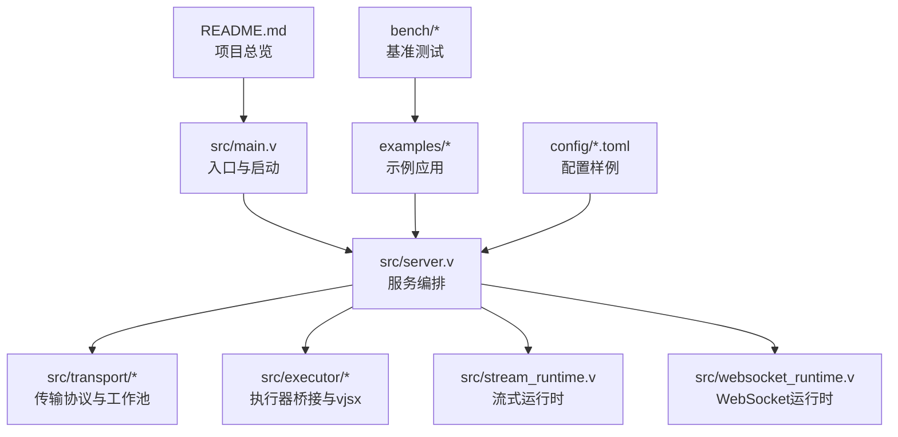
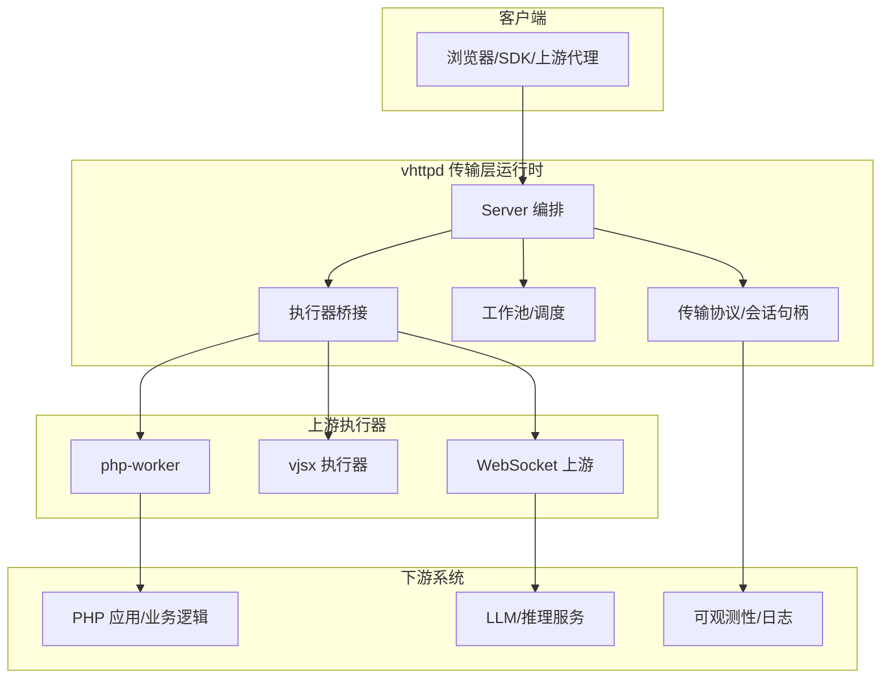
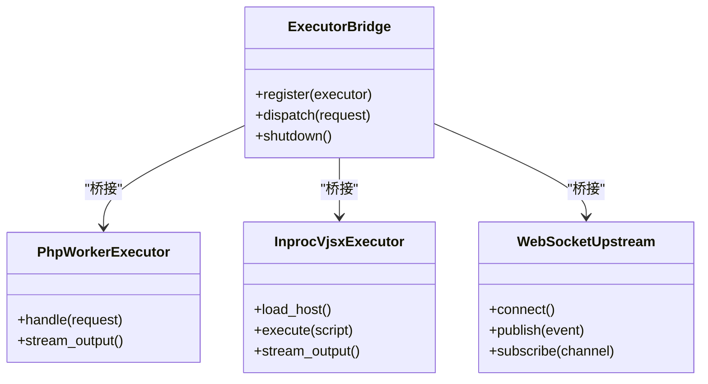
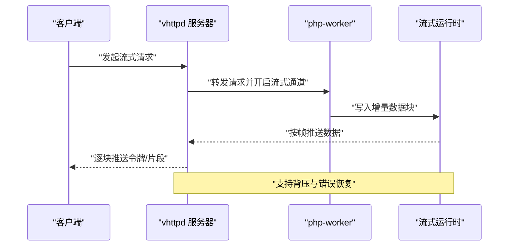
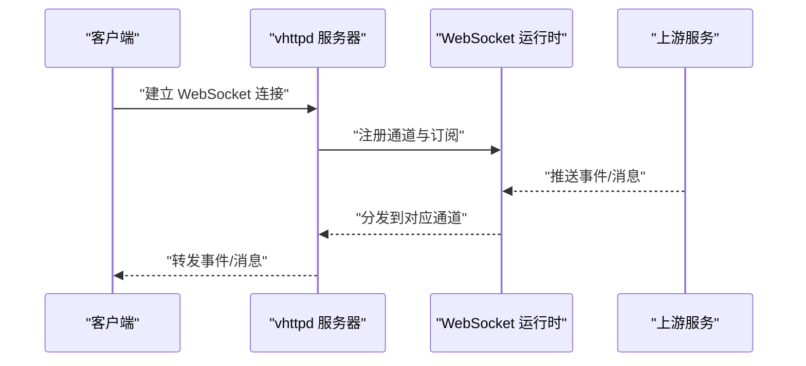
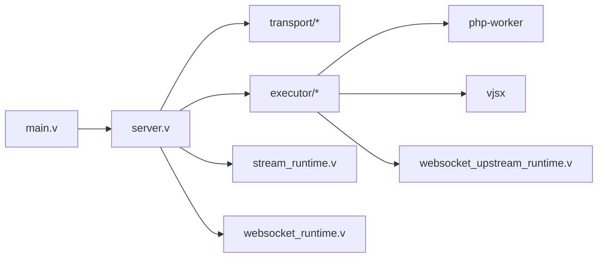

# 核心价值主张

<cite>
**本文引用的文件**
- [README.md](file://README.md)
- [articles/01-overview.md](file://articles/01-overview.md)
- [articles/03-php-apps.md](file://articles/03-php-apps.md)
- [articles/04-ai-streaming.md](file://articles/04-ai-streaming.md)
- [articles/08-vjsx-intro.md](file://articles/08-vjsx-intro.md)
- [docs/EXECUTOR_MODES.md](file://docs/EXECUTOR_MODES.md)
- [docs/STREAM_RUNTIME_PHASES.md](file://docs/STREAM_RUNTIME_PHASES.md)
- [docs/WEBSOCKET_UPSTREAM_PLAN.md](file://docs/WEBSOCKET_UPSTREAM_PLAN.md)
- [docs/WEBSOCKET_PHASE2_IMPLEMENTATION_PLAN.md](file://docs/WEBSOCKET_PHASE2_IMPLEMENTATION_PLAN.md)
- [docs/INTERNAL_HOST_SOCKET_PROTOCOL.md](file://docs/INTERNAL_HOST_SOCKET_PROTOCOL.md)
- [docs/TRANSPORT_CONTRACT.md](file://docs/TRANSPORT_CONTRACT.md)
- [src/main.v](file://src/main.v)
- [src/server.v](file://src/server.v)
- [src/transport/worker_protocol.v](file://src/transport/worker_protocol.v)
- [src/transport/worker_pool.v](file://src/transport/worker_pool.v)
- [src/executor/inproc_vjsx_executor.v](file://src/executor/inproc_vjsx_executor.v)
- [src/websocket_runtime.v](file://src/websocket_runtime.v)
- [src/websocket_upstream_runtime.v](file://src/websocket_upstream_runtime.v)
- [src/stream_runtime.v](file://src/stream_runtime.v)
- [examples/ai-stream-app.php](file://examples/ai-stream-app.php)
- [examples/stream-bench-app.php](file://examples/stream-bench-app.php)
- [bench/k6_stream.js](file://bench/k6_stream.js)
- [bench/k6_short.js](file://bench/k6_short.js)
- [config/vhttpd.example.toml](file://config/vhttpd.example.toml)
- [config/vhttpd.multi.example.toml](file://config/vhttpd.multi.example.toml)
- [config/vhttpd.vjsx.example.toml](file://config/vhttpd.vjsx.example.toml)
</cite>

## 目录
1. [引言](#引言)
2. [项目结构](#项目结构)
3. [核心组件](#核心组件)
4. [架构总览](#架构总览)
5. [详细组件分析](#详细组件分析)
6. [依赖关系分析](#依赖关系分析)
7. [性能考量](#性能考量)
8. [故障排查指南](#故障排查指南)
9. [结论](#结论)
10. [附录](#附录)

## 引言
本文件面向希望理解 vhttpd 核心价值主张的读者，系统阐述 vhttpd 作为“传输层运行时网关”的独特定位：它并非简单地替代 PHP-FPM，而是通过“多执行器架构”在传输层实现统一的运行时承载能力，从而在流式传输、应用 API 形状、传输语义等维度上显著优于传统 nginx + PHP-FPM 方案。vhttpd 的关键优势体现在：
- 统一的传输层运行时：以一致的协议和语义承载多种上游（PHP、vjsx、WebSocket 等），避免传统方案中“请求-响应”模型对流式场景的限制。
- 多执行器架构：通过 php-worker、vjsx、WebSocket 上游集成与流式运行时，实现更贴近业务的 API 形状与更低的端到端延迟。
- 针对令牌流式传输的优化：在 AI 对话、实时渲染等高吞吐、低延迟场景下，提供稳定且可扩展的流式体验。

## 项目结构
vhttpd 采用模块化与分层设计，围绕“传输层运行时”组织核心子系统：
- 文档与文章：提供高层概述、技术背景与场景化说明。
- 源码核心：包含服务器主流程、传输协议、执行器桥接、流式运行时、WebSocket 运行时等。
- 示例与基准：覆盖 PHP 应用、AI 流式、WebSocket 等典型场景，并提供压测脚本。
- 配置样例：展示单机、多实例与 vjsx 场景的部署形态。

图表来源
- [src/main.v](file://src/main.v)
- [src/server.v](file://src/server.v)
- [src/transport/worker_protocol.v](file://src/transport/worker_protocol.v)
- [src/executor/inproc_vjsx_executor.v](file://src/executor/inproc_vjsx_executor.v)
- [src/stream_runtime.v](file://src/stream_runtime.v)
- [src/websocket_runtime.v](file://src/websocket_runtime.v)
- [examples/ai-stream-app.php](file://examples/ai-stream-app.php)
- [bench/k6_stream.js](file://bench/k6_stream.js)
- [config/vhttpd.example.toml](file://config/vhttpd.example.toml)

章节来源
- [README.md](file://README.md)
- [articles/01-overview.md](file://articles/01-overview.md)

## 核心组件
- 传输层运行时与工作池
  - 负责建立与上游执行器（php-worker、vjsx、WebSocket）之间的稳定连接，管理帧格式与会话句柄，确保消息有序、可靠传递。
  - 关键点：内部主机套接字协议、工作池调度、会话句柄抽象。
- 执行器桥接
  - 将不同类型的执行器（如 php-worker、vjsx）纳入统一的运行时框架，屏蔽底层差异，暴露一致的应用 API 形状。
- 流式运行时
  - 面向令牌流式传输（如 AI 对话、实时渲染）进行专门优化，支持增量输出、背压控制与错误恢复。
- WebSocket 运行时
  - 提供事件总线与消息分发能力，支持双向通信与长连接场景。

章节来源
- [docs/INTERNAL_HOST_SOCKET_PROTOCOL.md](file://docs/INTERNAL_HOST_SOCKET_PROTOCOL.md)
- [src/transport/worker_protocol.v](file://src/transport/worker_protocol.v)
- [src/transport/worker_pool.v](file://src/transport/worker_pool.v)
- [src/executor/inproc_vjsx_executor.v](file://src/executor/inproc_vjsx_executor.v)
- [src/stream_runtime.v](file://src/stream_runtime.v)
- [src/websocket_runtime.v](file://src/websocket_runtime.v)

## 架构总览
vhttpd 的整体架构以“传输层运行时网关”为核心，向上提供统一的 API 形状，向下对接多种执行器与上游协议。其核心特征包括：
- 单一入口与多执行器并行：一个 vhttpd 实例可同时承载 PHP、vjsx、WebSocket 等多种执行器。
- 传输层抽象：通过内部协议与工作池，屏蔽执行器差异，实现一致的传输语义。
- 流式优先：针对令牌流式传输进行深度优化，降低延迟并提升稳定性。

图表来源
- [src/server.v](file://src/server.v)
- [src/transport/worker_protocol.v](file://src/transport/worker_protocol.v)
- [src/transport/worker_pool.v](file://src/transport/worker_pool.v)
- [src/executor/inproc_vjsx_executor.v](file://src/executor/inproc_vjsx_executor.v)
- [src/websocket_runtime.v](file://src/websocket_runtime.v)

## 详细组件分析

### 多执行器架构与执行器桥接
- 设计理念
  - 将“执行器”视为独立的运行单元，通过统一的桥接层接入，避免在 Nginx 层做过多协议转换与状态管理。
  - php-worker：承载 PHP 应用，复用现有生态；vjsx：提供内嵌 JS 运行时与前端交互能力；WebSocket：承载长连接与事件驱动场景。
- 关键实现
  - 执行器桥接负责注册、生命周期管理与调用转发；内部协议定义了执行器与 vhttpd 的通信契约。
  - vjsx 执行器通过内嵌宿主加载器与签名机制，确保安全与可追踪性。

图表来源
- [src/executor/inproc_vjsx_executor.v](file://src/executor/inproc_vjsx_executor.v)
- [src/executor/app_facade.v](file://src/executor/app_facade.v)
- [src/executor/types.v](file://src/executor/types.v)
- [src/executor/vjsx_host_loader.v](file://src/executor/vjsx_host_loader.v)
- [src/executor/vjsx_host_signature.v](file://src/executor/vjsx_host_signature.v)

章节来源
- [docs/EXECUTOR_MODES.md](file://docs/EXECUTOR_MODES.md)
- [src/executor/inproc_vjsx_executor.v](file://src/executor/inproc_vjsx_executor.v)
- [src/executor/app_facade.v](file://src/executor/app_facade.v)
- [src/executor/types.v](file://src/executor/types.v)
- [src/executor/vjsx_host_loader.v](file://src/executor/vjsx_host_loader.v)
- [src/executor/vjsx_host_signature.v](file://src/executor/vjsx_host_signature.v)

### 流式运行时与传输语义
- 流式运行时
  - 面向令牌流式传输（如 AI 对话、实时渲染）进行专门优化，支持增量输出、背压控制与错误恢复。
  - 内部协议定义了帧格式与流控策略，确保客户端能及时消费数据并维持稳定的传输速率。
- 传输语义对比
  - 传统 nginx + PHP-FPM：以“请求-响应”为主，中间件链路长、缓冲多、延迟高，难以满足低延迟流式场景。
  - vhttpd + php-worker：在传输层统一承载，减少中间环节，结合流式运行时实现更接近“事件驱动”的 API 形状。

图表来源
- [src/stream_runtime.v](file://src/stream_runtime.v)
- [src/transport/worker_protocol.v](file://src/transport/worker_protocol.v)
- [src/transport/worker_pool.v](file://src/transport/worker_pool.v)

章节来源
- [docs/STREAM_RUNTIME_PHASES.md](file://docs/STREAM_RUNTIME_PHASES.md)
- [src/stream_runtime.v](file://src/stream_runtime.v)
- [src/transport/worker_protocol.v](file://src/transport/worker_protocol.v)
- [src/transport/worker_pool.v](file://src/transport/worker_pool.v)

### WebSocket 上游集成与事件总线
- WebSocket 运行时
  - 提供事件总线与消息分发能力，支持双向通信与长连接场景，适用于聊天、协作、实时通知等。
- 上游计划
  - 计划逐步完善 WebSocket 的能力边界，包括消息路由、订阅管理与跨实例协调。

图表来源
- [src/websocket_runtime.v](file://src/websocket_runtime.v)
- [src/websocket_upstream_runtime.v](file://src/websocket_upstream_runtime.v)
- [docs/WEBSOCKET_UPSTREAM_PLAN.md](file://docs/WEBSOCKET_UPSTREAM_PLAN.md)
- [docs/WEBSOCKET_PHASE2_IMPLEMENTATION_PLAN.md](file://docs/WEBSOCKET_PHASE2_IMPLEMENTATION_PLAN.md)

章节来源
- [src/websocket_runtime.v](file://src/websocket_runtime.v)
- [src/websocket_upstream_runtime.v](file://src/websocket_upstream_runtime.v)
- [docs/WEBSOCKET_UPSTREAM_PLAN.md](file://docs/WEBSOCKET_UPSTREAM_PLAN.md)
- [docs/WEBSOCKET_PHASE2_IMPLEMENTATION_PLAN.md](file://docs/WEBSOCKET_PHASE2_IMPLEMENTATION_PLAN.md)

### 与 nginx + PHP-FPM 的对比
- 流式处理
  - nginx + PHP-FPM：受限于“请求-响应”模型，需要额外的缓存与轮询机制，导致延迟高、资源占用大。
  - vhttpd + php-worker：在传输层统一承载，结合流式运行时，实现真正的增量推送与低延迟。
- 应用 API 形状
  - nginx + PHP-FPM：API 形状受 HTTP 请求-响应约束，难以表达事件驱动与流式语义。
  - vhttpd：通过执行器桥接与流式运行时，可自然表达事件/流式 API，更贴近业务需求。
- 传输语义
  - nginx + PHP-FPM：中间环节多、协议栈复杂，易出现缓冲与阻塞。
  - vhttpd：统一的内部协议与工作池，简化传输链路，提升稳定性与可控性。

章节来源
- [docs/TRANSPORT_CONTRACT.md](file://docs/TRANSPORT_CONTRACT.md)
- [src/transport/worker_protocol.v](file://src/transport/worker_protocol.v)
- [src/transport/worker_pool.v](file://src/transport/worker_pool.v)

## 依赖关系分析
- 组件耦合与内聚
  - 服务器编排层与传输层高度内聚，通过统一协议与工作池解耦执行器差异。
  - 执行器桥接层承担“适配器”角色，向上提供一致接口，向下屏蔽实现细节。
- 外部依赖与集成点
  - PHP 应用生态：通过 php-worker 与现有 PHP 生态无缝衔接。
  - 观测性：传输层记录会话与帧级信息，便于监控与排障。
  - 配置：通过 TOML 配置文件定义执行器、上游与运行时参数。

图表来源
- [src/main.v](file://src/main.v)
- [src/server.v](file://src/server.v)
- [src/transport/worker_protocol.v](file://src/transport/worker_protocol.v)
- [src/executor/inproc_vjsx_executor.v](file://src/executor/inproc_vjsx_executor.v)
- [src/stream_runtime.v](file://src/stream_runtime.v)
- [src/websocket_runtime.v](file://src/websocket_runtime.v)
- [src/websocket_upstream_runtime.v](file://src/websocket_upstream_runtime.v)

章节来源
- [src/main.v](file://src/main.v)
- [src/server.v](file://src/server.v)
- [src/transport/worker_protocol.v](file://src/transport/worker_protocol.v)
- [src/executor/inproc_vjsx_executor.v](file://src/executor/inproc_vjsx_executor.v)
- [src/stream_runtime.v](file://src/stream_runtime.v)
- [src/websocket_runtime.v](file://src/websocket_runtime.v)
- [src/websocket_upstream_runtime.v](file://src/websocket_upstream_runtime.v)

## 性能考量
- 延迟与吞吐
  - 通过统一传输层与工作池，减少中间环节，降低端到端延迟；流式运行时支持增量推送，提高用户感知速度。
- 背压与稳定性
  - 内部协议与工作池具备背压控制能力，避免过载导致的丢包或阻塞。
- 基准与场景
  - 提供 K6 基准脚本用于短请求与流式场景的压测，便于对比传统方案与 vhttpd 的表现。
- 使用建议
  - 在高并发、低延迟、强流式的场景（如 AI 对话、实时渲染）优先选择 vhttpd + php-worker。
  - 结合配置样例（单机、多实例、vjsx）进行容量规划与部署优化。

章节来源
- [bench/k6_stream.js](file://bench/k6_stream.js)
- [bench/k6_short.js](file://bench/k6_short.js)
- [config/vhttpd.example.toml](file://config/vhttpd.example.toml)
- [config/vhttpd.multi.example.toml](file://config/vhttpd.multi.example.toml)
- [config/vhttpd.vjsx.example.toml](file://config/vhttpd.vjsx.example.toml)

## 故障排查指南
- 传输层问题
  - 检查内部协议与会话句柄状态，确认帧格式与流控策略是否正确。
  - 关注工作池的队列长度与执行器健康状态。
- 执行器问题
  - 核对执行器桥接注册情况与调用链路，定位具体失败点。
- 流式问题
  - 关注流式运行时的增量输出与错误恢复机制，确保客户端能够正确消费数据。
- WebSocket 问题
  - 检查通道注册、订阅与上游事件推送链路，验证消息分发与路由。

章节来源
- [docs/INTERNAL_HOST_SOCKET_PROTOCOL.md](file://docs/INTERNAL_HOST_SOCKET_PROTOCOL.md)
- [src/transport/worker_protocol.v](file://src/transport/worker_protocol.v)
- [src/transport/worker_pool.v](file://src/transport/worker_pool.v)
- [src/stream_runtime.v](file://src/stream_runtime.v)
- [src/websocket_runtime.v](file://src/websocket_runtime.v)

## 结论
vhttpd 的核心价值在于：以“传输层运行时网关”的身份，将多执行器（php-worker、vjsx、WebSocket）统一在一致的传输协议与运行时之上，从而在流式处理、应用 API 形状与传输语义方面全面超越传统 nginx + PHP-FPM 方案。对于需要低延迟、高吞吐与强流式能力的场景（如 AI 对话、实时渲染、协作应用），vhttpd 提供了更贴近业务需求、更稳定可靠的基础设施选择。

## 附录
- 场景化示例
  - AI 流式对话：通过流式运行时与 php-worker 实现低延迟增量输出。
  - vjsx 内嵌运行时：结合 vjsx 执行器与前端交互，快速构建动态界面。
  - WebSocket 事件总线：支撑长连接与事件驱动的协作与通知场景。
- 配置参考
  - 单机部署、多实例部署与 vjsx 场景的配置样例，便于快速落地。

章节来源
- [articles/04-ai-streaming.md](file://articles/04-ai-streaming.md)
- [articles/08-vjsx-intro.md](file://articles/08-vjsx-intro.md)
- [examples/ai-stream-app.php](file://examples/ai-stream-app.php)
- [examples/stream-bench-app.php](file://examples/stream-bench-app.php)
- [config/vhttpd.example.toml](file://config/vhttpd.example.toml)
- [config/vhttpd.multi.example.toml](file://config/vhttpd.multi.example.toml)
- [config/vhttpd.vjsx.example.toml](file://config/vhttpd.vjsx.example.toml)