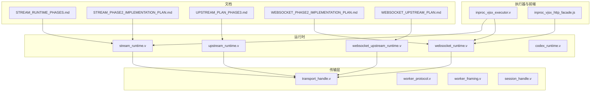
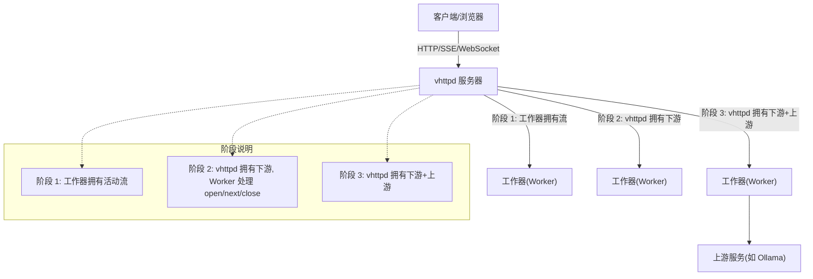
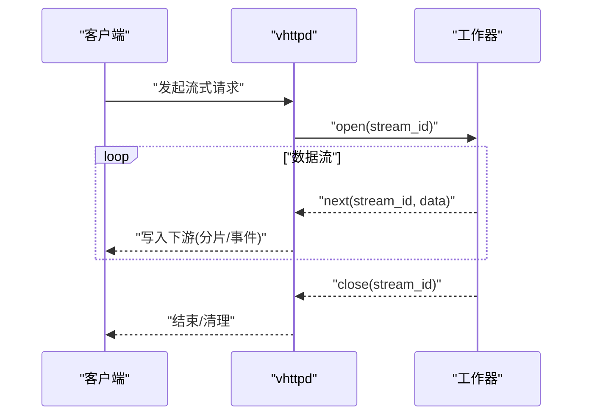
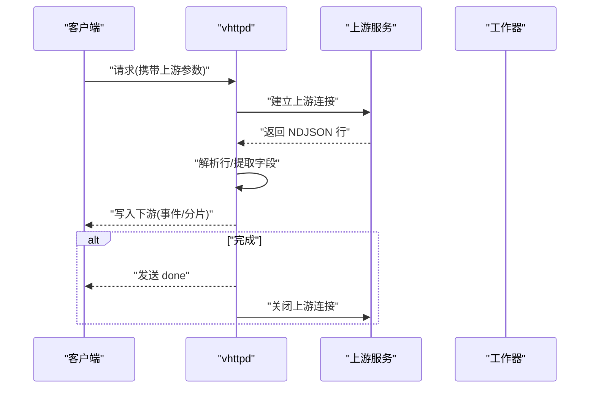
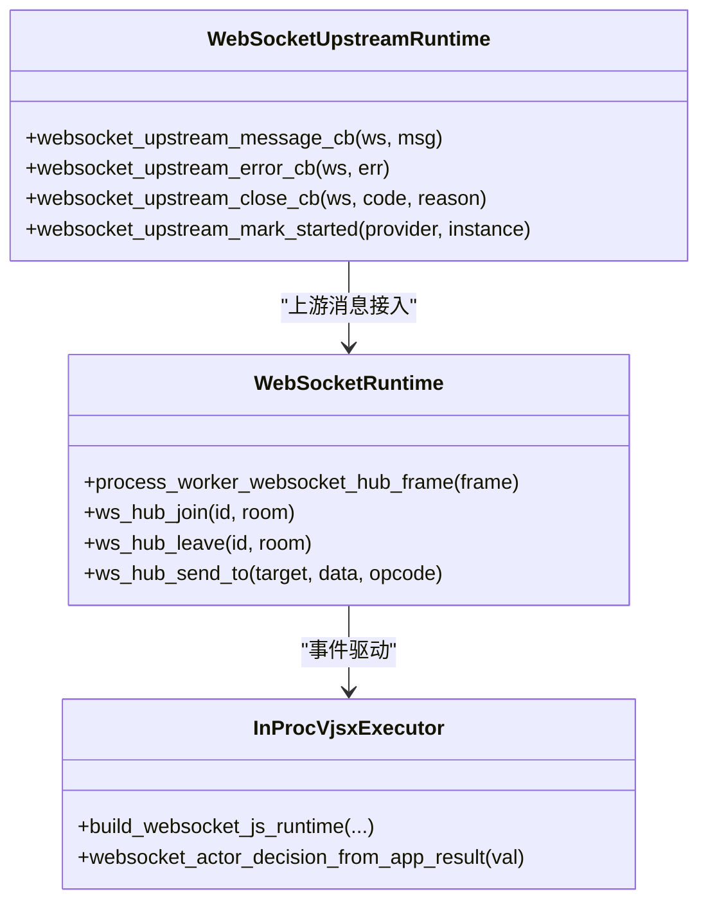
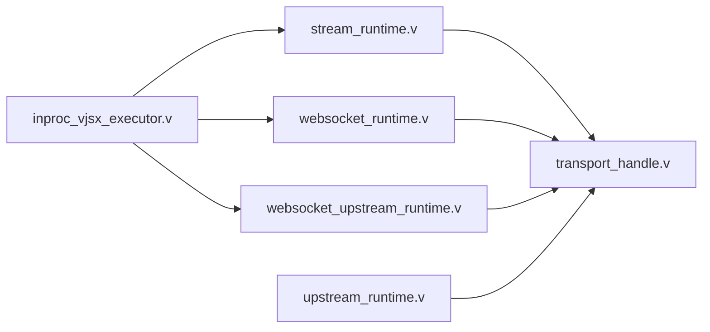

# 流式运行时模式

<cite>
**本文引用的文件**
- [README.md](file://README.md)
- [STREAM_RUNTIME_PHASES.md](file://docs/STREAM_RUNTIME_PHASES.md)
- [STREAM_PHASE2_IMPLEMENTATION_PLAN.md](file://docs/STREAM_PHASE2_IMPLEMENTATION_PLAN.md)
- [UPSTREAM_PLAN_PHASE3.md](file://docs/UPSTREAM_PLAN_PHASE3.md)
- [WEBSOCKET_PHASE2_IMPLEMENTATION_PLAN.md](file://docs/WEBSOCKET_PHASE2_IMPLEMENTATION_PLAN.md)
- [WEBSOCKET_UPSTREAM_PLAN.md](file://docs/WEBSOCKET_UPSTREAM_PLAN.md)
- [stream_runtime.v](file://src/stream_runtime.v)
- [websocket_runtime.v](file://src/websocket_runtime.v)
- [websocket_upstream_runtime.v](file://src/websocket_upstream_runtime.v)
- [upstream_runtime.v](file://src/upstream_runtime.v)
- [codex_runtime.v](file://src/codex_runtime.v)
- [inproc_vjsx_executor.v](file://src/executor/inproc_vjsx_executor.v)
- [inproc_vjsx_http_facade.js](file://src/inproc_vjsx_http_facade.js)
- [server_runtime_config.v](file://src/server_runtime_config.v)
- [server_runtime_orchestrator.v](file://src/server_runtime_orchestrator.v)
- [worker_backend_runtime.v](file://src/worker_backend_runtime.v)
- [worker_backend_pool.v](file://src/worker_backend_pool.v)
- [worker_backend_dispatch.v](file://src/worker_backend_dispatch.v)
- [worker_backend_transport.v](file://src/worker_backend_transport.v)
- [transport_handle.v](file://src/transport/transport_handle.v)
- [worker_protocol.v](file://src/transport/worker_protocol.v)
- [worker_framing.v](file://src/transport/worker_framing.v)
- [session_handle.v](file://src/transport/session_handle.v)
- [ai-stream-app.php](file://examples/ai-stream-app.php)
- [stream-bench-app.php](file://examples/stream-bench-app.php)
- [stream-dispatch-app.php](file://examples/stream-dispatch-app.php)
- [websocket_echo_app.php](file://examples/websocket_echo_app.php)
- [ai-stream.toml](file://examples/config/ai-stream.toml)
- [stream-bench.toml](file://examples/config/stream-bench.toml)
- [stream-dispatch.toml](file://examples/config/stream-dispatch.toml)
- [websocket-echo.toml](file://examples/config/websocket-echo.toml)
</cite>

## 目录
1. [引言](#引言)
2. [项目结构](#项目结构)
3. [核心组件](#核心组件)
4. [架构总览](#架构总览)
5. [详细组件分析](#详细组件分析)
6. [依赖关系分析](#依赖关系分析)
7. [性能考量](#性能考量)
8. [故障排除指南](#故障排除指南)
9. [结论](#结论)
10. [附录](#附录)

## 引言
本文件系统性梳理 vhttpd 的流式运行时模式家族，覆盖以下模式与阶段：
- 普通 HTTP（短请求->短工作调用）
- 流式阶段 1（工作器拥有活动流）
- 流式调度策略（vhttpd 拥有下游，工作器处理 open/next/close）
- 流式阶段 3（vhttpd 拥有下游和上游）
- WebSocket 阶段 1/2 的区别

重点阐述各阶段在“连接/流生命周期”上的耦合度差异：阶段 1 简单但生命周期仍绑定工作器占用；阶段 2 将客户端侧连接与工作器生命周期解耦；阶段 3 进一步将上游实时流也与工作器生命周期解耦。并给出适用场景、性能特征与配置要点，以及最佳实践与故障排除建议。

## 项目结构
围绕流式运行时的关键模块与文档如下：
- 文档层：流式运行时阶段说明、阶段 2 实现计划、阶段 3 上游计划、WebSocket 阶段 2 计划与上游计划
- 核心运行时：流式运行时、WebSocket 运行时、WebSocket 上游运行时、上游运行时、Codex 运行时
- 执行器与宿主：内置 vjsx 执行器、HTTP 前端桥接
- 传输层：会话与传输句柄、工作器协议与编帧
- 示例与配置：AI 流示例、流压测、流分发、WebSocket 回显等

**图表来源**
- [STREAM_RUNTIME_PHASES.md](file://docs/STREAM_RUNTIME_PHASES.md)
- [STREAM_PHASE2_IMPLEMENTATION_PLAN.md](file://docs/STREAM_PHASE2_IMPLEMENTATION_PLAN.md)
- [UPSTREAM_PLAN_PHASE3.md](file://docs/UPSTREAM_PLAN_PHASE3.md)
- [WEBSOCKET_PHASE2_IMPLEMENTATION_PLAN.md](file://docs/WEBSOCKET_PHASE2_IMPLEMENTATION_PLAN.md)
- [WEBSOCKET_UPSTREAM_PLAN.md](file://docs/WEBSOCKET_UPSTREAM_PLAN.md)
- [stream_runtime.v](file://src/stream_runtime.v)
- [websocket_runtime.v](file://src/websocket_runtime.v)
- [websocket_upstream_runtime.v](file://src/websocket_upstream_runtime.v)
- [upstream_runtime.v](file://src/upstream_runtime.v)
- [inproc_vjsx_executor.v](file://src/executor/inproc_vjsx_executor.v)
- [inproc_vjsx_http_facade.js](file://src/inproc_vjsx_http_facade.js)
- [transport_handle.v](file://src/transport/transport_handle.v)
- [worker_protocol.v](file://src/transport/worker_protocol.v)
- [worker_framing.v](file://src/transport/worker_framing.v)
- [session_handle.v](file://src/transport/session_handle.v)

**章节来源**
- [README.md:191-239](file://README.md#L191-L239)

## 核心组件
- 流式运行时（stream_runtime.v）：负责将工作器产生的流数据写入下游连接，支持 SSE/Chunked 等输出格式，并维护流状态与生命周期。
- WebSocket 运行时（websocket_runtime.v）：管理 WebSocket Hub，处理 join/leave/send/broadcast 等事件，协调工作器与客户端之间的消息转发。
- WebSocket 上游运行时（websocket_upstream_runtime.v）：负责与上游 WebSocket 服务建立连接，接收消息回调并在断开时上报错误或关闭原因。
- 上游运行时（upstream_runtime.v）：解析上游返回的行缓冲（如 Ollama 的 NDJSON），提取字段并按 SSE 或分块方式写回下游，支持 done 终止标记。
- Codex 运行时（codex_runtime.v）：提供流目标解析与实例定位能力，用于多实例/线程场景下的流路由与查找。
- 内置 vjsx 执行器（inproc_vjsx_executor.v）：在嵌入式宿主中运行 JS/TS 应用，构建 WebSocket 运行时能力与能力声明。
- 传输层（transport_handle.v、worker_protocol.v、worker_framing.v、session_handle.v）：抽象会话与工作器通信协议，定义帧格式与编解码规则。

**章节来源**
- [stream_runtime.v](file://src/stream_runtime.v)
- [websocket_runtime.v](file://src/websocket_runtime.v)
- [websocket_upstream_runtime.v](file://src/websocket_upstream_runtime.v)
- [upstream_runtime.v](file://src/upstream_runtime.v)
- [codex_runtime.v](file://src/codex_runtime.v)
- [inproc_vjsx_executor.v](file://src/executor/inproc_vjsx_executor.v)
- [transport_handle.v](file://src/transport/transport_handle.v)
- [worker_protocol.v](file://src/transport/worker_protocol.v)
- [worker_framing.v](file://src/transport/worker_framing.v)
- [session_handle.v](file://src/transport/session_handle.v)

## 架构总览
下图展示 vhttpd 在不同流式阶段中的角色分工与数据流向：

**图表来源**
- [README.md:191-239](file://README.md#L191-L239)
- [STREAM_RUNTIME_PHASES.md](file://docs/STREAM_RUNTIME_PHASES.md)
- [UPSTREAM_PLAN_PHASE3.md](file://docs/UPSTREAM_PLAN_PHASE3.md)

## 详细组件分析

### 流式阶段 1：工作器拥有活动流
- 角色与职责
  - vhttpd 接收请求后，直接将“活动流”交由工作器持有并处理。
  - 客户端通过长连接持续接收来自工作器的数据片段。
- 生命周期耦合
  - 连接/流生命周期与工作器占用强绑定，工作器退出会导致流中断。
- 典型适用场景
  - 简单的实时流输出（如内部服务直连），对扩展性要求不高。
- 性能特征
  - 低延迟，无额外中间层；但并发受工作器数量限制。
- 配置要点
  - 关注工作器线程数与最大请求数，避免阻塞。
  - 合理设置超时与重试策略，确保工作器可用性。

**章节来源**
- [README.md:191-239](file://README.md#L191-L239)

### 流式调度策略（阶段 2）：vhttpd 拥有下游，Worker 处理 open/next/close
- 角色与职责
  - vhttpd 负责与下游（客户端）的连接与帧写入。
  - 工作器仅负责业务逻辑的 open/next/close 事件驱动。
- 生命周期解耦
  - 客户端侧连接不再绑定到工作器占用，提升可伸缩性与稳定性。
- 典型适用场景
  - 可重放或合成的 SSE/文本流，如日志聚合、事件广播。
- 性能特征
  - 下游写入与业务处理分离，降低工作器压力；需关注 vhttpd 的背压与缓冲。
- 配置要点
  - 调整下游写入缓冲与刷新策略，避免内存膨胀。
  - 为 open/next/close 事件设计幂等与重试机制。

**图表来源**
- [STREAM_PHASE2_IMPLEMENTATION_PLAN.md](file://docs/STREAM_PHASE2_IMPLEMENTATION_PLAN.md)
- [stream_runtime.v](file://src/stream_runtime.v)

**章节来源**
- [STREAM_PHASE2_IMPLEMENTATION_PLAN.md](file://docs/STREAM_PHASE2_IMPLEMENTATION_PLAN.md)
- [stream_runtime.v](file://src/stream_runtime.v)

### 流式阶段 3（UpstreamPlan）：vhttpd 拥有下游和上游
- 角色与职责
  - vhttpd 同时管理下游（客户端）与上游（外部服务，如 Ollama）。
  - 解析上游返回的行缓冲（如 NDJSON），提取 token 并写入下游。
- 生命周期解耦
  - 不仅客户端连接与工作器解耦，上游实时流也与工作器解耦，进一步提升弹性。
- 典型适用场景
  - 实时上游 token 流（如大模型推理），需要高吞吐与低延迟。
- 性能特征
  - 需要高效解析与转发，注意上游连接复用与背压控制。
- 配置要点
  - 上游连接池与超时参数，行缓冲与字段映射策略。
  - SSE/Chunked 输出格式选择与事件类型配置。

**图表来源**
- [UPSTREAM_PLAN_PHASE3.md](file://docs/UPSTREAM_PLAN_PHASE3.md)
- [upstream_runtime.v](file://src/upstream_runtime.v)
- [stream_runtime.v](file://src/stream_runtime.v)

**章节来源**
- [UPSTREAM_PLAN_PHASE3.md](file://docs/UPSTREAM_PLAN_PHASE3.md)
- [upstream_runtime.v](file://src/upstream_runtime.v)
- [stream_runtime.v](file://src/stream_runtime.v)

### WebSocket 阶段 1 与阶段 2 的区别
- 阶段 1（Worker 拥有连接）
  - 工作器维持完整的 WebSocket 连接，适合轻量级 MVP。
  - 生命周期与工作器绑定，扩展性受限。
- 阶段 2（vhttpd 拥有连接，Worker 处理事件）
  - vhttpd 负责连接生命周期与消息分发，Worker 仅处理短事件。
  - 提升可伸缩性与稳定性，适合大规模消息场景。
- 能力声明与前端桥接
  - vjsx 执行器在运行时声明能力，WebSocket 场景启用 websocketDispatch，禁用其他能力。
  - 前端可通过宿主 API 与 vhttpd 协作，实现统一的事件分发。

**图表来源**
- [websocket_runtime.v](file://src/websocket_runtime.v)
- [websocket_upstream_runtime.v](file://src/websocket_upstream_runtime.v)
- [inproc_vjsx_executor.v](file://src/executor/inproc_vjsx_executor.v)

**章节来源**
- [WEBSOCKET_PHASE2_IMPLEMENTATION_PLAN.md](file://docs/WEBSOCKET_PHASE2_IMPLEMENTATION_PLAN.md)
- [WEBSOCKET_UPSTREAM_PLAN.md](file://docs/WEBSOCKET_UPSTREAM_PLAN.md)
- [websocket_runtime.v](file://src/websocket_runtime.v)
- [websocket_upstream_runtime.v](file://src/websocket_upstream_runtime.v)
- [inproc_vjsx_executor.v](file://src/executor/inproc_vjsx_executor.v)
- [inproc_vjsx_http_facade.js](file://src/inproc_vjsx_http_facade.js)

## 依赖关系分析
- 运行时与传输层
  - 流式与 WebSocket 运行时均依赖传输层提供的会话与帧协议，保证跨进程/跨网络的稳定通信。
- 执行器与运行时
  - 内置 vjsx 执行器为运行时提供 JS/TS 环境与能力声明，支撑 WebSocket 与流式场景的业务逻辑。
- 上游与下游
  - 阶段 3 中上游运行时负责解析上游数据并写入下游，形成“上游解析 -> 下游写入”的闭环。

**图表来源**
- [stream_runtime.v](file://src/stream_runtime.v)
- [websocket_runtime.v](file://src/websocket_runtime.v)
- [websocket_upstream_runtime.v](file://src/websocket_upstream_runtime.v)
- [upstream_runtime.v](file://src/upstream_runtime.v)
- [inproc_vjsx_executor.v](file://src/executor/inproc_vjsx_executor.v)
- [transport_handle.v](file://src/transport/transport_handle.v)

**章节来源**
- [stream_runtime.v](file://src/stream_runtime.v)
- [websocket_runtime.v](file://src/websocket_runtime.v)
- [websocket_upstream_runtime.v](file://src/websocket_upstream_runtime.v)
- [upstream_runtime.v](file://src/upstream_runtime.v)
- [inproc_vjsx_executor.v](file://src/executor/inproc_vjsx_executor.v)
- [transport_handle.v](file://src/transport/transport_handle.v)

## 性能考量
- 阶段 1
  - 优点：低延迟，实现简单。
  - 风险：并发受工作器限制，连接中断即流中断。
- 阶段 2
  - 优点：下游写入与业务处理分离，可横向扩展。
  - 关注点：缓冲区大小、刷新频率、背压控制与错误恢复。
- 阶段 3
  - 优点：上游实时流与工作器解耦，弹性更强。
  - 关注点：上游连接池、NDJSON 解析效率、SSE/Chunked 输出策略。
- WebSocket
  - 阶段 2 通过 hub 管理房间与广播，需控制消息聚合与去重，避免风暴。

[本节为通用性能讨论，不直接分析具体文件]

## 故障排除指南
- 常见问题与定位
  - 流中断：检查工作器是否异常退出或被抢占；确认 open/next/close 事件链路完整。
  - 上游解析失败：核对字段路径与事件类型，确认 NDJSON 行完整性。
  - WebSocket 发送失败：检查 Hub 的 send_to 结果与目标连接状态。
  - 生命周期解耦失效：确认阶段 2/3 的配置是否正确启用 vhttpd 对下游/上游的接管。
- 建议排查步骤
  - 启用详细日志，观察从请求到下游写入的全链路。
  - 使用示例应用进行最小化复现（如 AI 流示例、WebSocket 回显）。
  - 分别验证 open/next/close 与上游消息回调的处理逻辑。
- 相关实现参考
  - WebSocket Hub 命令处理与失败反馈。
  - 上游运行时的行缓冲消费与 done 终止处理。
  - 流运行时的下游写入与 SSE/Chunked 输出。

**章节来源**
- [websocket_runtime.v:745-791](file://src/websocket_runtime.v#L745-L791)
- [websocket_upstream_runtime.v:699-744](file://src/websocket_upstream_runtime.v#L699-L744)
- [upstream_runtime.v:100-143](file://src/upstream_runtime.v#L100-L143)
- [stream_runtime.v](file://src/stream_runtime.v)

## 结论
- 阶段 1 最简单但耦合度最高，适合轻量场景。
- 阶段 2 将客户端连接与工作器解耦，显著提升可伸缩性。
- 阶段 3 进一步将上游实时流与工作器解耦，满足高吞吐实时流需求。
- WebSocket 阶段 2 通过 Hub 与事件驱动，实现大规模消息场景的稳定与弹性。
- 选择合适阶段需综合考虑业务复杂度、扩展需求与运维成本。

[本节为总结性内容，不直接分析具体文件]

## 附录
- 示例与配置
  - AI 流示例与配置：演示阶段 2/3 的典型用法。
  - 流压测与分发示例：验证不同阶段的吞吐与延迟表现。
  - WebSocket 回显示例：验证阶段 2 的消息分发与 Hub 功能。
- 相关文档
  - 流式运行时阶段说明、阶段 2 实现计划、阶段 3 上游计划、WebSocket 阶段 2 计划与上游计划。

**章节来源**
- [ai-stream-app.php](file://examples/ai-stream-app.php)
- [stream-bench-app.php](file://examples/stream-bench-app.php)
- [stream-dispatch-app.php](file://examples/stream-dispatch-app.php)
- [websocket_echo_app.php](file://examples/websocket_echo_app.php)
- [ai-stream.toml](file://examples/config/ai-stream.toml)
- [stream-bench.toml](file://examples/config/stream-bench.toml)
- [stream-dispatch.toml](file://examples/config/stream-dispatch.toml)
- [websocket-echo.toml](file://examples/config/websocket-echo.toml)
- [STREAM_RUNTIME_PHASES.md](file://docs/STREAM_RUNTIME_PHASES.md)
- [STREAM_PHASE2_IMPLEMENTATION_PLAN.md](file://docs/STREAM_PHASE2_IMPLEMENTATION_PLAN.md)
- [UPSTREAM_PLAN_PHASE3.md](file://docs/UPSTREAM_PLAN_PHASE3.md)
- [WEBSOCKET_PHASE2_IMPLEMENTATION_PLAN.md](file://docs/WEBSOCKET_PHASE2_IMPLEMENTATION_PLAN.md)
- [WEBSOCKET_UPSTREAM_PLAN.md](file://docs/WEBSOCKET_UPSTREAM_PLAN.md)