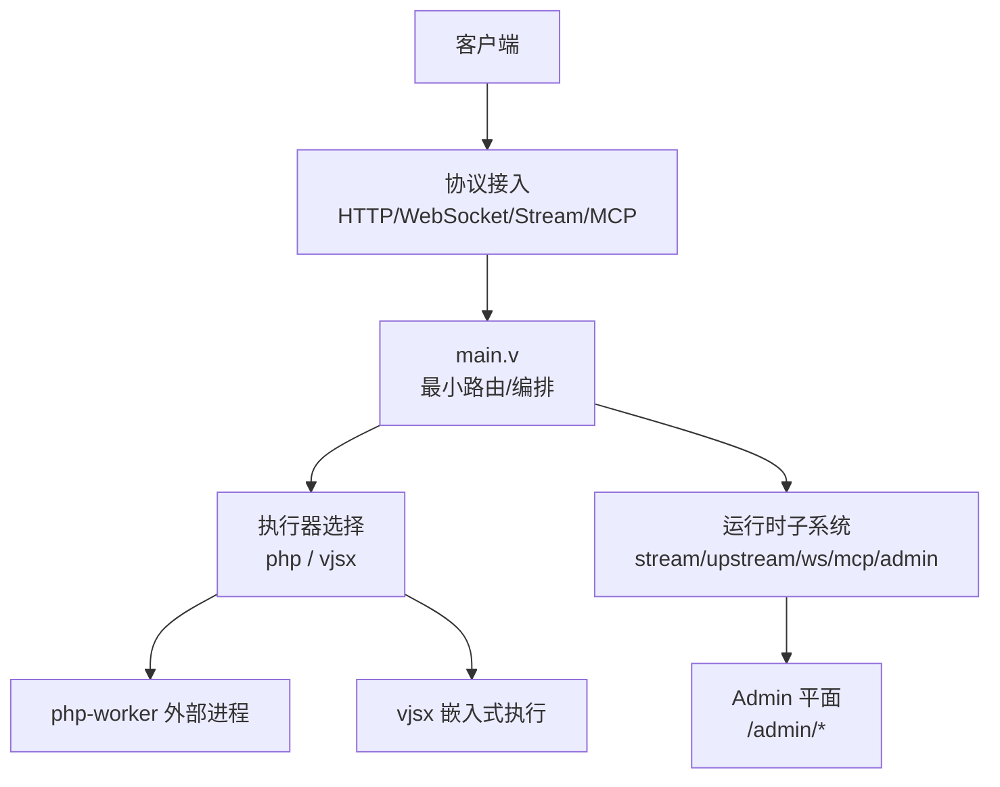
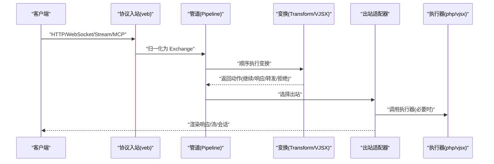
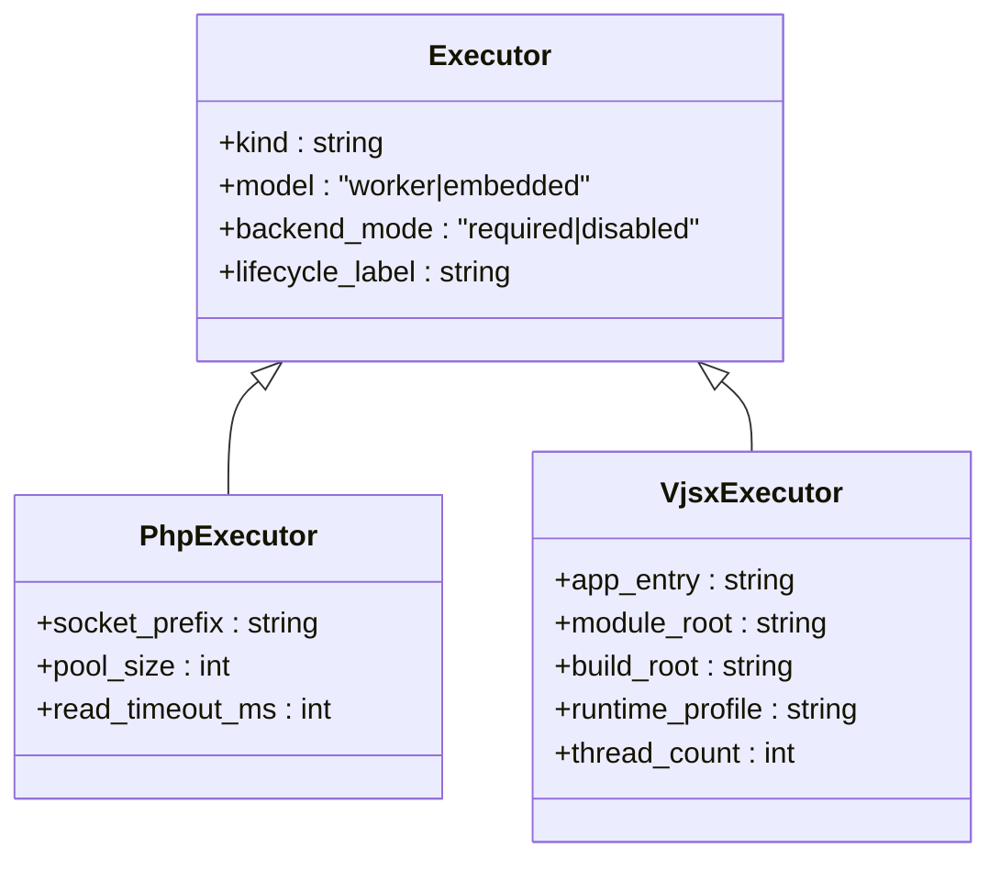
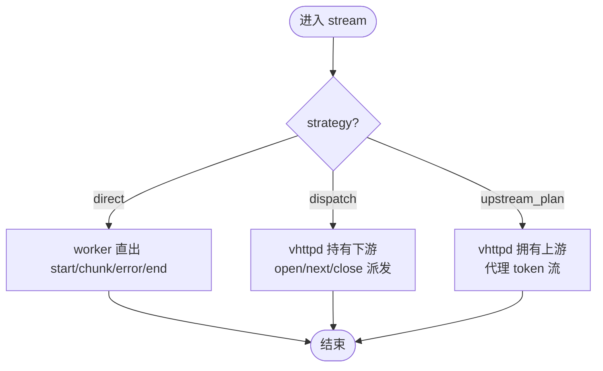
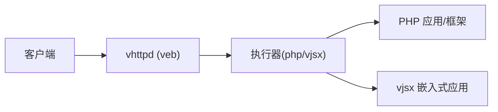
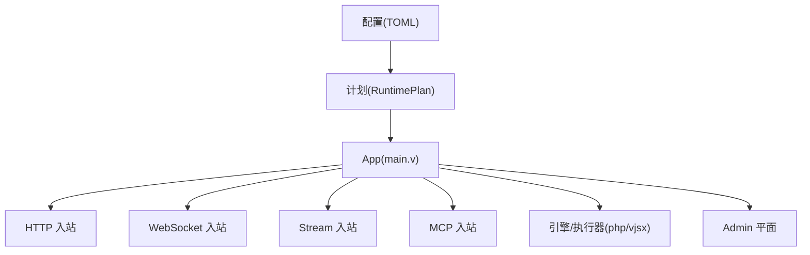

# 项目介绍

<cite>
**本文引用的文件列表**
- [README.md](file://README.md)
- [OVERVIEW.md](file://docs/OVERVIEW.md)
- [EXECUTOR_MODES.md](file://docs/EXECUTOR_MODES.md)
- [PROTOCOL_PIPELINE_IMPLEMENTATION_PLAN.md](file://docs/PROTOCOL_PIPELINE_IMPLEMENTATION_PLAN.md)
- [01-overview.md](file://articles/01-overview.md)
- [main.v](file://src/main.v)
- [vhttpd.example.toml](file://config/vhttpd.example.toml)
</cite>

## 目录
1. [引言](#引言)
2. [项目结构](#项目结构)
3. [核心组件](#核心组件)
4. [架构总览](#架构总览)
5. [详细组件分析](#详细组件分析)
6. [依赖关系分析](#依赖关系分析)
7. [性能与可观测性](#性能与可观测性)
8. [故障排查指南](#故障排查指南)
9. [结论](#结论)
10. [附录：术语与参考](#附录术语与参考)

## 引言
vhttpd 是一个基于 V 语言与 veb 构建的独立运行时，定位从“传统 PHP 应用服务器”演进为“多协议执行主机”。它不再只关注 HTTP 请求转发，而是统一承载 HTTP、WebSocket、流式响应（SSE/text）、MCP Streamable HTTP 以及 WebSocket upstream（如飞书）等协议形态，并通过统一的执行器模型调度外部 PHP Worker 与嵌入式 vjsx 逻辑。其核心价值主张是：以轻量、稳定的 transport/runtime 层，将协议入口、连接与流生命周期、worker 编排、插件宿主与可观测性整合在一个进程内，从而降低现代应用的系统碎片化。

- 为什么选择保持轻量级设计：vhttpd 刻意贴近 veb 作为 HTTP 事实来源，复用 veb/http/urllib 的能力，自身聚焦传输、worker 编排、流与可观测性，避免重复造轮子，确保稳定与可维护性。
- 与 veb 的关系：veb 提供 HTTP 上下文、请求 ID、SSE 格式化等基础能力；vhttpd 在其之上扩展 worker 池、stream 阶段、upstream plan、MCP、WebSocket 与 admin 面。
- 与传统 nginx + PHP-FPM 的差异：vhttpd 通过统一的 worker stream frames 和明确的 start/chunk/error/end 契约，为 PHP 应用提供更一致的流式体验，减少跨层缓冲与时延调优成本。

章节来源
- [README.md:1-41](file://README.md#L1-L41)
- [README.md:152-189](file://README.md#L152-L189)
- [01-overview.md:1-68](file://articles/01-overview.md#L1-L68)

## 项目结构
vhttpd 采用“协议内核 + 执行器 + 运行面”的分层组织方式：
- 顶层入口 main.v 仅保留最小路由与编排职责，将具体处理委托给各运行时模块。
- 运行面（Surface）包括 http、stream、websocket、mcp、websocket_upstream，每种运行面有对应的 ingress/egress 与状态管理。
- 执行器（Executor）抽象了逻辑执行边界，当前内置 php（外部 worker）与 vjsx（嵌入式）。
- 配置采用 TOML-first，支持多监听器与站点级覆盖，executor 选择与 worker 策略在配置中显式表达。

图表来源
- [main.v:1-117](file://src/main.v#L1-L117)
- [OVERVIEW.md:14-53](file://docs/OVERVIEW.md#L14-L53)

章节来源
- [main.v:1-117](file://src/main.v#L1-L117)
- [OVERVIEW.md:14-53](file://docs/OVERVIEW.md#L14-L53)

## 核心组件
- 执行器（Executor）
  - php：通过 Unix Socket 与外部 php-worker 通信，适合现有 PHP 生态（VSlim/Laravel/Symfony/WordPress）。
  - vjsx：嵌入式 TypeScript/JavaScript 执行器，适合快速变化的网关、Bot、协议适配与胶水逻辑。
- 协议运行面（Surface）
  - http：普通请求/响应。
  - stream：direct/dispatch/upstream_plan 三种阶段，分别对应 worker 直出、vhttpd 持有下游并派发 open/next/close、vhttpd 拥有上游并代理 token 流。
  - websocket：phase 1 与 phase 2 dispatch 两种模式，前者由 worker 持有连接，后者由 vhttpd 持有连接并派发事件。
  - mcp：Streamable HTTP，POST/GET/DELETE /mcp。
  - websocket_upstream：出站长连接（如飞书），接收事件并桥接到 worker。
- 运行时子系统
  - stream_runtime、upstream_runtime、websocket_runtime、mcp_runtime、admin_runtime 等，各自负责对应运行面的入站、会话/队列、交付与快照。
- 配置与多监听器
  - TOML-first，支持变量展开、路径别名、站点级覆盖与 executor 切换。

章节来源
- [EXECUTOR_MODES.md:1-136](file://docs/EXECUTOR_MODES.md#L1-L136)
- [OVERVIEW.md:75-116](file://docs/OVERVIEW.md#L75-L116)
- [README.md:191-209](file://README.md#L191-L209)

## 架构总览
vhttpd 的目标架构围绕“协议管道 + 可编程运行时 + 跨节点中继”展开：
- 协议入站适配器将不同协议归一化为内部 Exchange。
- 管道（Pipeline）按序执行 Transform（原生 V 或 VJSX），不直接持有网络对象。
- 出站适配器将结果渲染到目标协议或中继通道。
- 控制面暴露运行时快照与操作接口。

图表来源
- [PROTOCOL_PIPELINE_IMPLEMENTATION_PLAN.md:367-406](file://docs/PROTOCOL_PIPELINE_IMPLEMENTATION_PLAN.md#L367-L406)
- [OVERVIEW.md:24-37](file://docs/OVERVIEW.md#L24-L37)

章节来源
- [PROTOCOL_PIPELINE_IMPLEMENTATION_PLAN.md:367-406](file://docs/PROTOCOL_PIPELINE_IMPLEMENTATION_PLAN.md#L367-L406)
- [OVERVIEW.md:24-37](file://docs/OVERVIEW.md#L24-L37)

## 详细组件分析

### 执行器模型与模式
- 两个正交维度：
  - logic_executor_model：worker 或 embedded。
  - worker_backend_mode：required 或 disabled。
- 运行时可见性：logic_executor_lifecycle 标识具体启动/关闭路径。
- 当前内置：
  - php：worker 模式，Unix Socket 与 php-worker 通信。
  - vjsx：embedded 模式，进程内执行 TS/JS。

图表来源
- [EXECUTOR_MODES.md:1-136](file://docs/EXECUTOR_MODES.md#L1-L136)

章节来源
- [EXECUTOR_MODES.md:1-136](file://docs/EXECUTOR_MODES.md#L1-L136)

### 协议运行面与阶段
- stream 阶段
  - direct：worker 直接持有流并输出 chunk。
  - dispatch：vhttpd 持有下游连接，worker 处理 open/next/close。
  - upstream_plan：worker 返回 plan，vhttpd 自己连接上游并出流（例如 Ollama）。
- websocket
  - phase 1：worker 持有连接。
  - phase 2：vhttpd 持有连接，worker 处理短事件。
- mcp：Streamable HTTP，/mcp 端点。
- websocket_upstream：出站长连接（如飞书），事件回推至 worker。

图表来源
- [OVERVIEW.md:75-116](file://docs/OVERVIEW.md#L75-L116)
- [README.md:191-209](file://README.md#L191-L209)

章节来源
- [OVERVIEW.md:75-116](file://docs/OVERVIEW.md#L75-L116)
- [README.md:191-209](file://README.md#L191-L209)

### 与 veb 的关系与轻量原则
- veb 作为 HTTP 事实来源：Context、Request、Cookie、request_id、SSE 格式等均由 veb 提供。
- vhttpd 专注传输、worker 编排、流与可观测性，避免重复实现 HTTP 栈。
- 这使得 vhttpd 更轻、更易维护，且能直接受益于 V 的 HTTP/runtime 栈。

图表来源
- [README.md:152-173](file://README.md#L152-L173)

章节来源
- [README.md:152-173](file://README.md#L152-L173)

### 与 nginx + PHP-FPM 的对比
- 流式支持：nginx + PHP-FPM 需要多层缓冲与时限调优；vhttpd + php-worker 提供统一的 worker stream frames 契约。
- 应用 API：vhttpd 提供统一的 StreamResponse（text/sse），减少框架差异。
- 调试面：集中在 vhttpd 与 worker 边界，便于定位问题。
- 适用场景：AI token 流、长连接、Bot、MCP、OpenAI Gateway 等。

章节来源
- [README.md:175-189](file://README.md#L175-L189)
- [01-overview.md:69-103](file://articles/01-overview.md#L69-L103)

### 典型用例与适用场景
- PHP 业务系统现代化：Laravel/Symfony/WordPress 获得 SSE、WebSocket、MCP、Upstream 流等现代能力。
- AI 网关与代理：Ollama Proxy、OpenAI-compatible Gateway、Codex 集成。
- Bot 与事件驱动：飞书长连接事件订阅与消息发送。
- 轻量插件层：用 vjsx 编写协议适配、胶水代码与快速变化逻辑。

章节来源
- [01-overview.md:134-163](file://articles/01-overview.md#L134-L163)
- [README.md:45-83](file://README.md#L45-L83)

## 依赖关系分析
- 顶层入口 main.v 仅做最小路由与编排，所有协议处理下沉到专用运行时模块。
- 配置编译期产出不可变计划（RuntimePlan），运行时消费该计划进行装配与校验。
- 执行器与适配器通过统一接口解耦，避免耦合到具体协议或语言。

图表来源
- [PROTOCOL_PIPELINE_IMPLEMENTATION_PLAN.md:338-366](file://docs/PROTOCOL_PIPELINE_IMPLEMENTATION_PLAN.md#L338-L366)
- [main.v:83-116](file://src/main.v#L83-L116)

章节来源
- [PROTOCOL_PIPELINE_IMPLEMENTATION_PLAN.md:338-366](file://docs/PROTOCOL_PIPELINE_IMPLEMENTATION_PLAN.md#L338-L366)
- [main.v:83-116](file://src/main.v#L83-L116)

## 性能与可观测性
- 性能要点
  - 无每阶段序列化：原生阶段共享 Exchange，VJSX 边界仅一次编码。
  - 编译期决策：正则、引用解析、能力校验均在启动时完成。
  - 有界并发：引擎、变换队列、中继通道、流缓冲均有上限。
  - 复制预算：避免不必要的拷贝，仅在所有权边界外拷贝。
- 可观测性
  - 结构化事件日志（NDJSON）。
  - Admin 平面暴露运行时快照、worker 统计、活跃会话、队列状态等。
  - 请求追踪：request_id/trace_id 贯穿管道。

章节来源
- [PROTOCOL_PIPELINE_IMPLEMENTATION_PLAN.md:621-687](file://docs/PROTOCOL_PIPELINE_IMPLEMENTATION_PLAN.md#L621-L687)
- [OVERVIEW.md:199-252](file://docs/OVERVIEW.md#L199-L252)

## 故障排查指南
- 常见问题定位
  - 队列满：返回 503，错误类 x-vhttpd-error-class: worker_queue_full。
  - 队列等待超时：返回 504，错误类 x-vhttpd-error-class: worker_queue_timeout。
  - 执行器未就绪：检查 executor.kind 与 worker 配置是否匹配。
  - 流式异常：确认 stream.strategy 与 worker 返回帧是否符合契约。
- 建议步骤
  - 查看 /admin/runtime 与 /admin/workers 快照。
  - 检查 event log 与 trace_id 关联日志。
  - 使用示例配置与最小复现用例验证。

章节来源
- [OVERVIEW.md:229-252](file://docs/OVERVIEW.md#L229-L252)
- [README.md:428-436](file://README.md#L428-L436)

## 结论
vhttpd 的核心价值在于：
- 作为 transport runtime，统一承载 HTTP、WebSocket、SSE、MCP、upstream stream 等协议形态。
- 让 PHP 在现代运行时场景中受益，同时保留成熟生态。
- 通过 vjsx 提供 TypeScript 插件层，使快速变化的协议与集成逻辑得以灵活扩展。
- 以轻量设计与清晰的边界，降低系统碎片化，提升可观测性与可运维性。

[本节不直接分析具体文件]

## 附录：术语与参考
- Surface：运行面，如 http/stream/websocket/mcp/websocket_upstream。
- Executor：执行器，如 php/vjsx。
- Pipeline：协议管道，包含入站、变换、出站。
- Exchange：协议无关的内部数据载体。
- Admin Plane：管理平面，用于运行时观察与控制。

章节来源
- [OVERVIEW.md:41-86](file://docs/OVERVIEW.md#L41-L86)
- [EXECUTOR_MODES.md:1-22](file://docs/EXECUTOR_MODES.md#L1-L22)