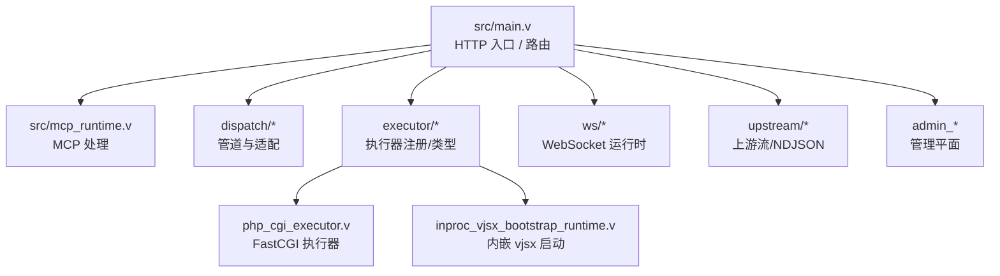
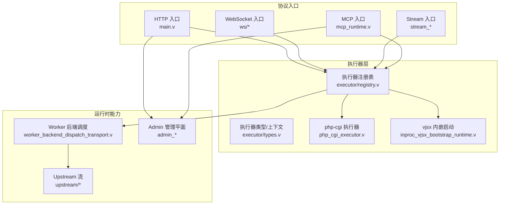
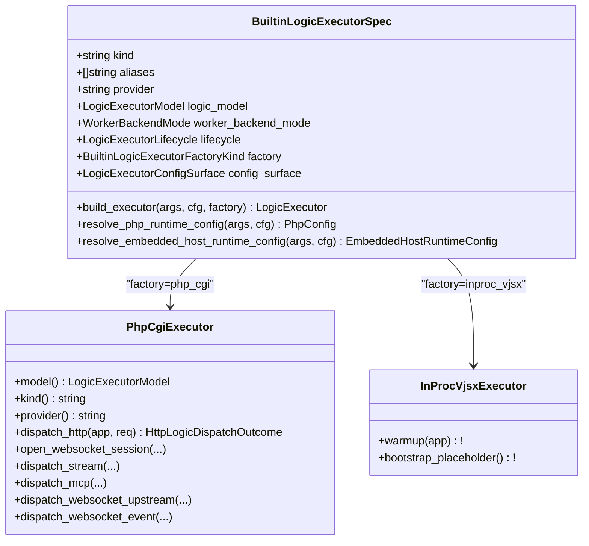
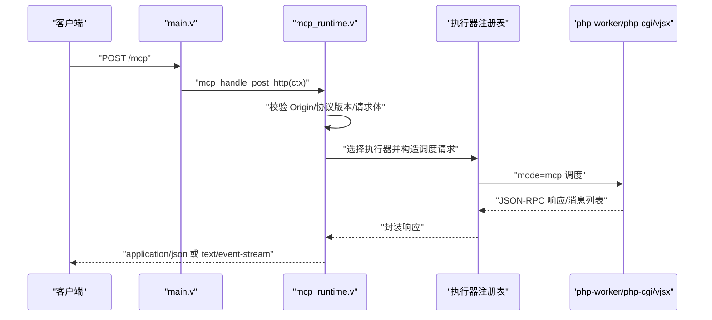
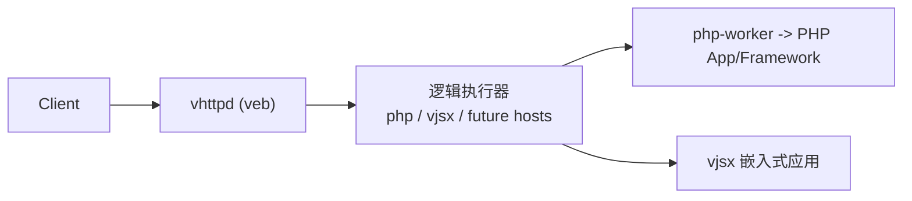
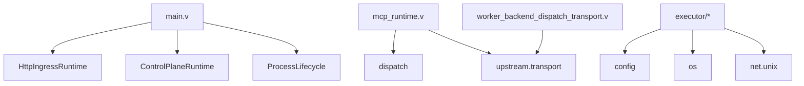

# 项目概述

<cite>
**本文引用的文件**   
- [README.md](file://README.md)
- [articles/01-overview.md](file://articles/01-overview.md)
- [docs/OVERVIEW.md](file://docs/OVERVIEW.md)
- [src/main.v](file://src/main.v)
- [src/mcp_runtime.v](file://src/mcp_runtime.v)
- [src/executor/registry.v](file://src/executor/registry.v)
- [src/executor/types.v](file://src/executor/types.v)
- [src/executor/php_cgi_executor.v](file://src/executor/php_cgi_executor.v)
- [src/executor/inproc_vjsx_bootstrap_runtime.v](file://src/executor/inproc_vjsx_bootstrap_runtime.v)
- [src/worker_backend_dispatch_transport.v](file://src/worker_backend_dispatch_transport.v)
- [docs/EXECUTOR_MODES.md](file://docs/EXECUTOR_MODES.md)
- [docs/MCP_MVP_PLAN.md](file://docs/MCP_MVP_PLAN.md)
</cite>

## 目录
1. [引言](#引言)
2. [项目结构](#项目结构)
3. [核心组件](#核心组件)
4. [架构总览](#架构总览)
5. [详细组件分析](#详细组件分析)
6. [依赖关系分析](#依赖关系分析)
7. [性能与可观测性](#性能与可观测性)
8. [故障排查指南](#故障排查指南)
9. [结论](#结论)
10. [附录：使用场景与部署示例](#附录使用场景与部署示例)

## 引言
vhttpd 的定位已从“PHP 应用服务器”演进为“多协议执行主机”。它不再只关注 HTTP，而是统一承载 HTTP、WebSocket、流式响应（SSE/text）、MCP Streamable HTTP 以及 WebSocket upstream（如飞书）等协议形态，并通过统一的执行器模型调度 PHP Worker 与 vjsx 嵌入式逻辑。其核心价值在于：
- 将协议入口与应用逻辑解耦：vhttpd 专注 transport、worker 编排、流生命周期与可观测性；业务逻辑由外部 worker 或嵌入式宿主承担。
- 以 veb 为 HTTP 事实来源，保持内核轻量：复用 veb/http/urllib，避免重复造轮子。
- 面向 AI 时代的应用形态：token streaming、长连接事件、MCP 工具调用、Bot 集成等能力在同一个运行时中协同工作。

从传统 PHP 应用服务器向协议和执行主机的演进路径清晰可见：早期围绕 PHP-FPM 的短请求模型，逐步引入 php-worker 统一流式契约，再叠加 vjsx 作为快速演进的插件层，最终形成“协议面 + 运行面 + 管理面”三位一体的主机形态。

**章节来源**
- [README.md:1-82](file://README.md#L1-L82)
- [articles/01-overview.md:1-83](file://articles/01-overview.md#L1-L83)
- [docs/OVERVIEW.md:1-39](file://docs/OVERVIEW.md#L1-L39)

## 项目结构
仓库采用按职责划分的模块化组织方式，核心代码集中在 src 下，文档与示例分别位于 docs 与 examples 目录。关键入口与模块：
- 顶层入口与路由分发：main.v
- 协议处理与运行时：mcp_runtime.v、websocket_*、stream_*、upstream_* 等
- 执行器注册与类型：executor/*
- 配置与计划：config/*
- 管理与统计：admin_*、*_runtime.v
- 示例与配置：examples/*、config/*

**图表来源**
- [src/main.v:83-116](file://src/main.v#L83-L116)
- [src/mcp_runtime.v:1-39](file://src/mcp_runtime.v#L1-L39)
- [src/executor/registry.v:65-127](file://src/executor/registry.v#L65-L127)
- [src/executor/php_cgi_executor.v:1-118](file://src/executor/php_cgi_executor.v#L1-L118)
- [src/executor/inproc_vjsx_bootstrap_runtime.v:1-42](file://src/executor/inproc_vjsx_bootstrap_runtime.v#L1-L42)

**章节来源**
- [src/main.v:1-117](file://src/main.v#L1-L117)
- [docs/OVERVIEW.md:272-296](file://docs/OVERVIEW.md#L272-L296)

## 核心组件
- 执行器注册表与类型
  - 内置执行器：php、php-cgi、vjsx、none
  - 每个执行器声明 model（worker/embedded）、worker_backend_mode（required/disabled）、lifecycle、factory 与配置表面
  - 提供构建执行器、解析配置、生成命令与环境变量的辅助方法
- 执行器接口与调度上下文
  - 定义 HTTP/WebSocket/MCP/Stream 的统一调度类型与结果
  - 暴露 Admin 统计摘要、队列状态、活跃会话计数等
- MCP 运行时
  - 校验 Origin、协议版本、请求体，转发到 worker 并返回 JSON/SSE
- 内嵌 vjsx 启动
  - 初始化 lanes、签名刷新、预热请求，确保热路径就绪
- FastCGI 执行器
  - 通过 Unix socket 与 php-cgi 进程通信，编码/解码 FastCGI 请求/响应

**章节来源**
- [src/executor/registry.v:65-127](file://src/executor/registry.v#L65-L127)
- [src/executor/types.v:65-115](file://src/executor/types.v#L65-L115)
- [src/mcp_runtime.v:11-39](file://src/mcp_runtime.v#L11-L39)
- [src/executor/inproc_vjsx_bootstrap_runtime.v:5-41](file://src/executor/inproc_vjsx_bootstrap_runtime.v#L5-L41)
- [src/executor/php_cgi_executor.v:42-82](file://src/executor/php_cgi_executor.v#L42-L82)

## 架构总览
vhttpd 的核心设计原则：
- 协议对等：HTTP、WebSocket、Stream、MCP 作为对等适配器接入，不将其他协议降级为 HTTP 分支
- 传输与业务分离：vhttpd 负责连接终止、worker 编排、流生命周期与可观测性；业务逻辑交由执行器
- 基于 veb 的轻量边界：复用 veb.Context、request_id、SSE 格式化等能力，保持内核薄且稳定

**图表来源**
- [src/main.v:83-116](file://src/main.v#L83-L116)
- [src/mcp_runtime.v:11-39](file://src/mcp_runtime.v#L11-L39)
- [src/executor/registry.v:65-127](file://src/executor/registry.v#L65-L127)
- [src/executor/types.v:65-115](file://src/executor/types.v#L65-L115)
- [src/executor/php_cgi_executor.v:42-82](file://src/executor/php_cgi_executor.v#L42-L82)
- [src/executor/inproc_vjsx_bootstrap_runtime.v:5-41](file://src/executor/inproc_vjsx_bootstrap_runtime.v#L5-L41)
- [src/worker_backend_dispatch_transport.v:47-80](file://src/worker_backend_dispatch_transport.v#L47-L80)

**章节来源**
- [docs/PROTOCOL_PIPELINE_RELAY_ARCHITECTURE.md:46-67](file://docs/PROTOCOL_PIPELINE_RELAY_ARCHITECTURE.md#L46-L67)
- [README.md:27-31](file://README.md#L27-L31)

## 详细组件分析

### 执行器模式：PHP Worker 与 vjsx 嵌入式
- 执行器规格
  - kind/aliases/provider/logic_model/worker_backend_mode/lifecycle/factory/config_surface
  - 支持 none、php、php-cgi、vjsx 四种内置规格
- 配置解析与构造
  - resolve_php_runtime_config：合并 CLI 覆盖项，验证 worker_entry/app_entry/extensions
  - resolve_embedded_host_runtime_config：解析 vjsx app/module/build/signature/profile/thread_count 等
  - build_executor：根据 factory 选择 SocketWorker/PhpCgi/InProcVjsx
- 行为差异
  - php/php-cgi：需要 worker backend，支持 HTTP 请求；php-cgi 不支持 WS/Stream/MCP
  - vjsx：embedded 模型，自动禁用 worker sockets，当前仅支持 HTTP 与 websocket_upstream 调度

**图表来源**
- [src/executor/registry.v:65-127](file://src/executor/registry.v#L65-L127)
- [src/executor/php_cgi_executor.v:1-118](file://src/executor/php_cgi_executor.v#L1-L118)
- [src/executor/inproc_vjsx_bootstrap_runtime.v:5-41](file://src/executor/inproc_vjsx_bootstrap_runtime.v#L5-L41)

**章节来源**
- [docs/EXECUTOR_MODES.md:1-136](file://docs/EXECUTOR_MODES.md#L1-L136)
- [src/executor/registry.v:176-224](file://src/executor/registry.v#L176-L224)
- [src/executor/registry.v:263-286](file://src/executor/registry.v#L263-L286)

### 协议处理能力：HTTP/WebSocket/流式响应/MCP
- HTTP
  - main.v 将所有 HTTP 方法路由到 HttpIngressRuntime.route，完成入站规范化与后续分发
- WebSocket
  - ws/* 提供 hub/rooms/presence 等运行时能力，配合 executor 进行事件派发
- 流式响应
  - stream_runtime.v 实现 direct/dispatch/upstream_plan 三阶段语义
  - worker 侧通过 start/chunk/error/end 帧或 open/next/close 回调参与流控制
- MCP
  - mcp_runtime.v 校验 Origin/协议版本/请求体，转发到 worker 并返回 JSON 或 SSE
  - MVP 规划明确 POST/GET/DELETE 端点与 Session 所有权归属 vhttpd

**图表来源**
- [src/main.v:83-116](file://src/main.v#L83-L116)
- [src/mcp_runtime.v:11-39](file://src/mcp_runtime.v#L11-L39)
- [docs/MCP_MVP_PLAN.md:167-214](file://docs/MCP_MVP_PLAN.md#L167-L214)

**章节来源**
- [docs/OVERVIEW.md:75-86](file://docs/OVERVIEW.md#L75-L86)
- [docs/MCP_MVP_PLAN.md:311-368](file://docs/MCP_MVP_PLAN.md#L311-L368)

### 架构设计原则与 veb 的关系
- 以 veb 为 HTTP 事实来源：veb.Context、request_id 中间件、SSE 格式化均由 veb 提供
- vhttpd 保持薄层：聚焦 transport、worker orchestration、stream lifecycle、observability
- 协议对等与可扩展：新增协议只需实现适配器，无需侵入核心数据路径

**图表来源**
- [README.md:167-173](file://README.md#L167-L173)

**章节来源**
- [README.md:27-31](file://README.md#L27-L31)
- [articles/01-overview.md:53-67](file://articles/01-overview.md#L53-L67)

## 依赖关系分析
- 内部依赖
  - main.v 依赖 HttpIngressRuntime、ControlPlaneRuntime、ProcessLifecycle
  - mcp_runtime.v 依赖 dispatch、transport、veb
  - executor/* 依赖 config、os、net.unix、upstream.transport
  - worker_backend_dispatch_transport.v 负责与 php-worker/php-cgi 的帧编解码与读写
- 外部依赖
  - veb：HTTP 上下文、中间件、SSE 格式化
  - V 标准库：net.http、net.unix、time、json、os

**图表来源**
- [src/main.v:1-23](file://src/main.v#L1-L23)
- [src/mcp_runtime.v:1-8](file://src/mcp_runtime.v#L1-L8)
- [src/executor/registry.v:1-5](file://src/executor/registry.v#L1-L5)
- [src/worker_backend_dispatch_transport.v:47-80](file://src/worker_backend_dispatch_transport.v#L47-L80)

**章节来源**
- [src/main.v:1-23](file://src/main.v#L1-L23)
- [src/mcp_runtime.v:1-8](file://src/mcp_runtime.v#L1-L8)
- [src/executor/registry.v:1-5](file://src/executor/registry.v#L1-L5)
- [src/worker_backend_dispatch_transport.v:47-80](file://src/worker_backend_dispatch_transport.v#L47-L80)

## 性能与可观测性
- 性能特性
  - 编译型二进制，低开销的 HTTP 入口与 worker 调度
  - 有界队列与超时控制：worker.queue_capacity、queue_timeout_ms，满队返回 503，等待超时返回 504
  - 流式优化：统一 start/chunk/error/end 与 open/next/close 语义，减少跨层缓冲与调优成本
- 可观测性
  - Admin 平面暴露 runtime summary、worker stats、active sessions、upstreams、MCP 会话等
  - 事件日志 NDJSON，便于集中采集与分析
  - 追踪 ID 透传：x-request-id/x-trace-id/request_id 字段归一化

**章节来源**
- [docs/OVERVIEW.md:229-252](file://docs/OVERVIEW.md#L229-L252)
- [src/main.v:40-73](file://src/main.v#L40-L73)

## 故障排查指南
- 常见错误分类
  - worker_queue_full：队列已满，返回 503
  - worker_queue_timeout：队列等待超时，返回 504
  - origin_forbidden：MCP 请求 Origin 未允许
  - empty_body：MCP JSON-RPC 请求体为空
  - worker_unavailable：MCP 需要配置的逻辑执行器但不可用
- 定位建议
  - 查看 /admin/runtime 与 /admin/workers 获取队列深度与 worker 状态
  - 检查 executor.kind 与 worker.backend_mode 是否匹配预期
  - 核对 vjsx 的 app_entry/module_root/build_root 是否存在
  - 确认 php-cgi 的扩展与入口路径有效

**章节来源**
- [docs/OVERVIEW.md:229-252](file://docs/OVERVIEW.md#L229-L252)
- [src/mcp_runtime.v:22-39](file://src/mcp_runtime.v#L22-L39)
- [src/executor/registry.v:300-323](file://src/executor/registry.v#L300-L323)

## 结论
vhttpd 通过“协议面 + 执行器 + 运行面”的分层设计，将传统 PHP 应用服务器升级为现代多协议执行主机。它以 veb 为事实来源保持内核轻量，以执行器抽象兼容 PHP Worker 与 vjsx 嵌入式逻辑，并以统一的流式与长连接能力支撑 AI 时代的 token streaming、MCP 工具调用与 Bot 集成。对于初学者，可从“什么是 vhttpd、支持哪些运行面、常用路径有哪些”入手；对于有经验的开发者，可深入执行器注册表、MCP 运行时与 worker 后端调度，理解其在生产环境中的可观测性与稳定性保障。

[本节不直接分析具体文件，故无章节来源]

## 附录：使用场景与部署示例
- 典型使用场景
  - PHP 应用获得现代 transport 能力：SSE/token streaming、WebSocket、AI gateway
  - TypeScript 插件层：OpenAI-compatible gateway、Ollama proxy、DashScope coding plugin、Feishu event adapter
  - 统一网关：HTTP、WebSocket、SSE、MCP、upstream stream 在同一运行时协同
- 部署要点
  - Linux：systemd 实例单元，例如 vhttpd@prod 对应 /etc/vhttpd/prod.toml
  - macOS：launchd plist，设置 EnvironmentVariables.VHTTPD_CONFIG
  - 多监听器：同一进程绑定多个 host:port，每个 site 独立 executor 与 app
  - 打包分发：优先使用 CI 产物，包含 runtime/libs 与安装脚本，用户仅需 core/db/full 配置

**章节来源**
- [README.md:367-411](file://README.md#L367-L411)
- [README.md:533-603](file://README.md#L533-L603)
- [README.md:298-366](file://README.md#L298-L366)