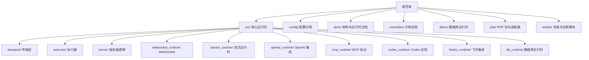
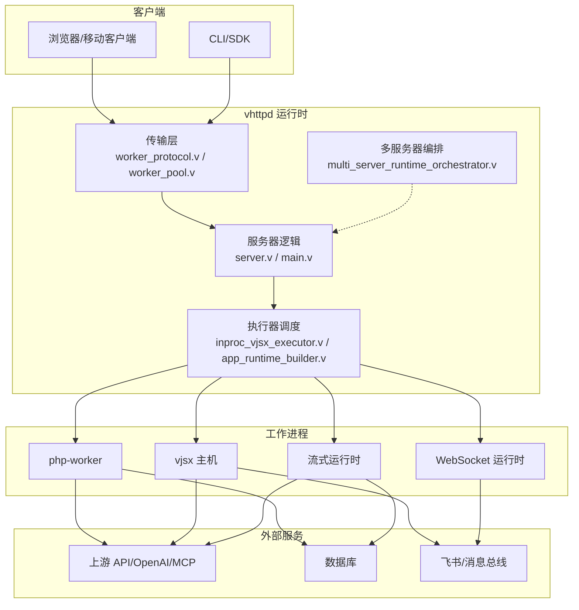
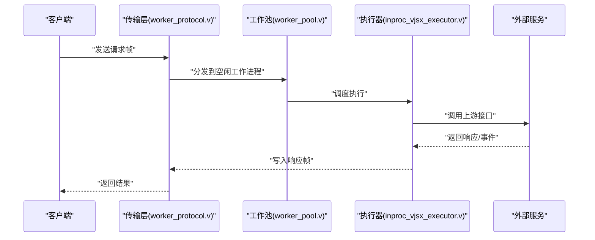
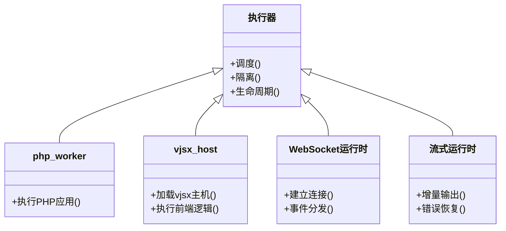
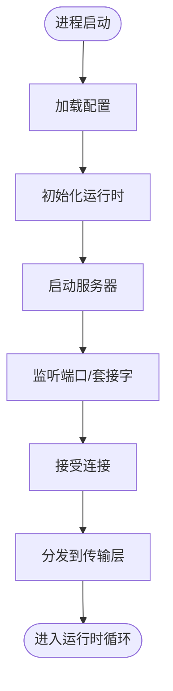
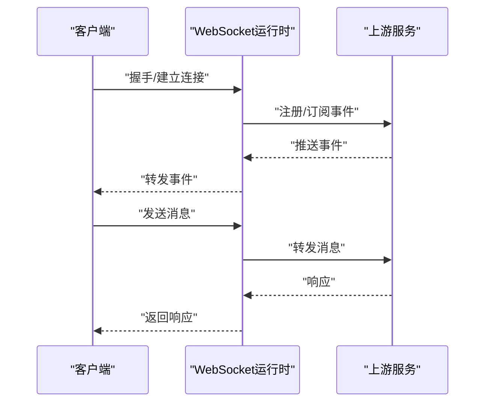
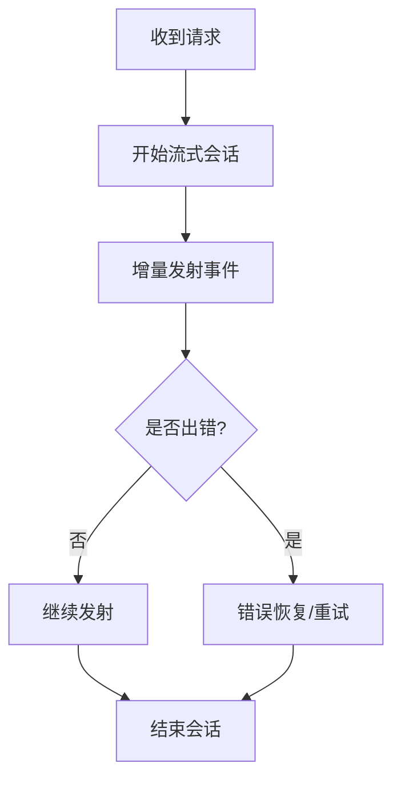
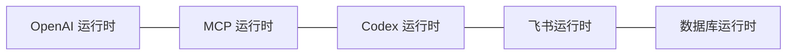
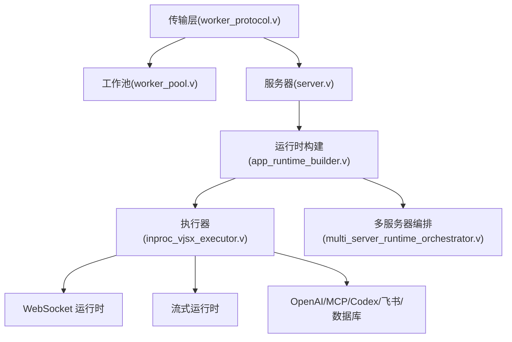

# 项目概述

<cite>
**本文引用的文件**
- [README.md](file://README.md)
- [OVERVIEW.md](file://docs/OVERVIEW.md)
- [EXECUTOR_MODES.md](file://docs/EXECUTOR_MODES.md)
- [TRANSPORT_CONTRACT.md](file://docs/transport_contract.md)
- [INTERNAL_HOST_SOCKET_PROTOCOL.md](file://docs/INTERNAL_HOST_SOCKET_PROTOCOL.md)
- [main.v](file://src/main.v)
- [server.v](file://src/server.v)
- [worker_protocol.v](file://src/transport/worker_protocol.v)
- [worker_pool.v](file://src/transport/worker_pool.v)
- [inproc_vjsx_executor.v](file://src/executor/inproc_vjsx_executor.v)
- [app_runtime_builder.v](file://src/app_runtime_builder.v)
- [multi_server_runtime_orchestrator.v](file://src/multi_server_runtime_orchestrator.v)
- [websocket_runtime.v](file://src/websocket_runtime.v)
- [websocket_upstream_runtime.v](file://src/websocket_upstream_runtime.v)
- [stream_runtime.v](file://src/stream_runtime.v)
- [openai_runtime.v](file://src/openai_runtime.v)
- [mcp_runtime.v](file://src/mcp_runtime.v)
- [codex_runtime.v](file://src/codex_runtime.v)
- [feishu_runtime.v](file://src/feishu_runtime.v)
- [db_runtime.v](file://dbsrc/db_runtime.v)
- [vjsx_host_signature.v](file://src/executor/vjsx_host_signature.v)
- [vjsx_host_loader.v](file://src/executor/vjsx_host_loader.v)
- [app_facade.v](file://src/executor/app_facade.v)
- [types.v](file://src/executor/types.v)
- [vhttpd.example.toml](file://config/vhttpd.example.toml)
- [vhttpd.multi.example.toml](file://config/vhttpd.multi.example.toml)
- [vjsx example config](file://config/vhttpd.vjsx.example.toml)
- [hello-app.php](file://examples/hello-app.php)
- [stream-dispatch-app.php](file://examples/stream-dispatch-app.php)
- [websocket_echo_app.php](file://examples/websocket_echo_app.php)
- [codexbot-app/app.php](file://examples/codexbot-app/app.php)
- [laravel/app.php](file://examples/laravel/app.php)
- [symfony/app.php](file://examples/symfony/app.php)
- [wordpress/app.php](file://examples/wordpress/app.php)
- [ollama-proxy-app.php](file://examples/ollama-proxy-app.php)
- [mcp-app.php](file://examples/mcp-app.php)
- [mcp-feishu-app.php](file://examples/mcp-feishu-app.php)
- [feishu-bot-mcp-app.php](file://examples/feishu-bot-mcp-app.php)
- [ai-stream-app.php](file://examples/ai-stream-app.php)
- [run_demo.sh](file://examples/run_demo.sh)
</cite>

## 目录
1. [引言](#引言)
2. [项目结构](#项目结构)
3. [核心组件](#核心组件)
4. [架构总览](#架构总览)
5. [详细组件分析](#详细组件分析)
6. [依赖分析](#依赖分析)
7. [性能考虑](#性能考虑)
8. [故障排查指南](#故障排查指南)
9. [结论](#结论)
10. [附录](#附录)

## 引言
vhttpd 是一个“传输层运行时网关”，其核心价值在于：通过统一的传输协议与多执行器架构，将不同语言与生态的应用（如 PHP、TypeScript/JavaScript、V）无缝接入到同一运行时内核中，实现跨语言、跨协议、跨上游服务的一体化编排。它既可作为传统 PHP-FPM 的现代化替代方案，也能承载现代前端应用与 AI 流式场景，提供高性能、可观测、可扩展的运行时基础设施。

- 与传统 PHP-FPM 的差异：
  - 传输层抽象：不再局限于 FastCGI，而是通过统一的内部传输协议与工作进程通信，支持更灵活的控制流与数据流。
  - 多执行器：在同一进程中并行或串行调度多种执行模型（php-worker、vjsx、WebSocket、流式运行时等），实现“一网打尽”的应用形态。
  - veb 边界：通过 veb（虚拟执行边界）隔离不同应用域，确保安全与资源控制。
  - 可观测性与可观测：内置日志、状态存储、命令处理与生命周期管理，便于运维与调试。

## 项目结构
仓库采用按功能域划分的模块化组织方式，核心代码位于 src/，配置示例在 config/，运行时文档在 docs/，示例应用在 examples/，数据库相关在 dbsrc/，PHP 包在 php/。

**图表来源**
- [main.v](file://src/main.v)
- [server.v](file://src/server.v)
- [worker_protocol.v](file://src/transport/worker_protocol.v)
- [inproc_vjsx_executor.v](file://src/executor/inproc_vjsx_executor.v)

**章节来源**
- [README.md](file://README.md)
- [main.v](file://src/main.v)

## 核心组件
- 传输层与工作池
  - 负责客户端请求与工作进程之间的帧协议、会话句柄与分发。
  - 关键文件：[worker_protocol.v](file://src/transport/worker_protocol.v)、[worker_pool.v](file://src/transport/worker_pool.v)
- 服务器与启动
  - 入口程序与服务器逻辑，负责初始化、配置加载与生命周期管理。
  - 关键文件：[main.v](file://src/main.v)、[server.v](file://src/server.v)
- 多执行器与 veb 边界
  - 支持 php-worker、vjsx、WebSocket、流式运行时等多种执行模式，并通过 veb 边界进行隔离与编排。
  - 关键文件：[EXECUTOR_MODES.md](file://docs/EXECUTOR_MODES.md)、[inproc_vjsx_executor.v](file://src/executor/inproc_vjsx_executor.v)、[vjsx_host_signature.v](file://src/executor/vjsx_host_signature.v)、[vjsx_host_loader.v](file://src/executor/vjsx_host_loader.v)
- 应用运行时构建器
  - 将配置映射为具体运行时实例，协调各子系统。
  - 关键文件：[app_runtime_builder.v](file://src/app_runtime_builder.v)
- 多服务器编排
  - 支持多实例/多站点编排，实现横向扩展与隔离。
  - 关键文件：[multi_server_runtime_orchestrator.v](file://src/multi_server_runtime_orchestrator.v)
- 特定运行时
  - WebSocket、流式、OpenAI、MCP、Codex、飞书、数据库等运行时模块。
  - 关键文件：[websocket_runtime.v](file://src/websocket_runtime.v)、[stream_runtime.v](file://src/stream_runtime.v)、[openai_runtime.v](file://src/openai_runtime.v)、[mcp_runtime.v](file://src/mcp_runtime.v)、[codex_runtime.v](file://src/codex_runtime.v)、[feishu_runtime.v](file://src/feishu_runtime.v)、[db_runtime.v](file://dbsrc/db_runtime.v)

**章节来源**
- [worker_protocol.v](file://src/transport/worker_protocol.v)
- [worker_pool.v](file://src/transport/worker_pool.v)
- [main.v](file://src/main.v)
- [server.v](file://src/server.v)
- [EXECUTOR_MODES.md](file://docs/EXECUTOR_MODES.md)
- [inproc_vjsx_executor.v](file://src/executor/inproc_vjsx_executor.v)
- [vjsx_host_signature.v](file://src/executor/vjsx_host_signature.v)
- [vjsx_host_loader.v](file://src/executor/vjsx_host_loader.v)
- [app_runtime_builder.v](file://src/app_runtime_builder.v)
- [multi_server_runtime_orchestrator.v](file://src/multi_server_runtime_orchestrator.v)
- [websocket_runtime.v](file://src/websocket_runtime.v)
- [stream_runtime.v](file://src/stream_runtime.v)
- [openai_runtime.v](file://src/openai_runtime.v)
- [mcp_runtime.v](file://src/mcp_runtime.v)
- [codex_runtime.v](file://src/codex_runtime.v)
- [feishu_runtime.v](file://src/feishu_runtime.v)
- [db_runtime.v](file://dbsrc/db_runtime.v)

## 架构总览
vhttpd 的整体架构围绕“传输层运行时网关”展开：客户端通过统一传输协议连接到 vhttpd 运行时，运行时根据配置选择合适的执行器（php-worker、vjsx、WebSocket、流式等），并在 veb 边界内隔离执行。执行器与外部服务（如上游 API、数据库、消息总线）交互，最终将响应返回给客户端。

**图表来源**
- [worker_protocol.v](file://src/transport/worker_protocol.v)
- [worker_pool.v](file://src/transport/worker_pool.v)
- [server.v](file://src/server.v)
- [main.v](file://src/main.v)
- [inproc_vjsx_executor.v](file://src/executor/inproc_vjsx_executor.v)
- [app_runtime_builder.v](file://src/app_runtime_builder.v)
- [multi_server_runtime_orchestrator.v](file://src/multi_server_runtime_orchestrator.v)
- [openai_runtime.v](file://src/openai_runtime.v)
- [mcp_runtime.v](file://src/mcp_runtime.v)
- [codex_runtime.v](file://src/codex_runtime.v)
- [feishu_runtime.v](file://src/feishu_runtime.v)
- [db_runtime.v](file://dbsrc/db_runtime.v)
- [websocket_runtime.v](file://src/websocket_runtime.v)
- [stream_runtime.v](file://src/stream_runtime.v)

## 详细组件分析

### 传输层与工作池
- 传输协议
  - 定义了客户端与工作进程之间的帧格式、会话句柄与控制消息，保证请求/响应的有序与可靠传递。
  - 关键文件：[TRANSPORT_CONTRACT.md](file://docs/transport_contract.md)、[worker_protocol.v](file://src/transport/worker_protocol.v)
- 工作池
  - 管理工作进程生命周期、队列与负载均衡，支持多执行器并发调度。
  - 关键文件：[worker_pool.v](file://src/transport/worker_pool.v)

**图表来源**
- [worker_protocol.v](file://src/transport/worker_protocol.v)
- [worker_pool.v](file://src/transport/worker_pool.v)
- [inproc_vjsx_executor.v](file://src/executor/inproc_vjsx_executor.v)

**章节来源**
- [TRANSPORT_CONTRACT.md](file://docs/transport_contract.md)
- [worker_protocol.v](file://src/transport/worker_protocol.v)
- [worker_pool.v](file://src/transport/worker_pool.v)

### 多执行器架构与 veb 边界
- 执行器模式
  - 支持 php-worker、vjsx、WebSocket、流式运行时等多种模式，满足从传统 PHP 到现代前端与 AI 场景的需求。
  - 关键文件：[EXECUTOR_MODES.md](file://docs/EXECUTOR_MODES.md)
- veb 边界
  - 通过 veb（虚拟执行边界）对不同应用域进行隔离，确保资源控制与安全。
  - 关键文件：[vjsx_host_signature.v](file://src/executor/vjsx_host_signature.v)、[vjsx_host_loader.v](file://src/executor/vjsx_host_loader.v)
- 应用门面
  - 统一对外接口，屏蔽底层执行细节。
  - 关键文件：[app_facade.v](file://src/executor/app_facade.v)、[types.v](file://src/executor/types.v)

**图表来源**
- [EXECUTOR_MODES.md](file://docs/EXECUTOR_MODES.md)
- [inproc_vjsx_executor.v](file://src/executor/inproc_vjsx_executor.v)
- [websocket_runtime.v](file://src/websocket_runtime.v)
- [stream_runtime.v](file://src/stream_runtime.v)

**章节来源**
- [EXECUTOR_MODES.md](file://docs/EXECUTOR_MODES.md)
- [vjsx_host_signature.v](file://src/executor/vjsx_host_signature.v)
- [vjsx_host_loader.v](file://src/executor/vjsx_host_loader.v)
- [app_facade.v](file://src/executor/app_facade.v)
- [types.v](file://src/executor/types.v)

### 服务器与启动流程
- 启动入口
  - main.v 负责解析参数、加载配置、初始化运行时与服务器。
- 服务器逻辑
  - server.v 实现监听、接收、路由与关闭钩子，配合传输层完成端到端请求处理。

**图表来源**
- [main.v](file://src/main.v)
- [server.v](file://src/server.v)

**章节来源**
- [main.v](file://src/main.v)
- [server.v](file://src/server.v)

### 特定运行时详解

#### WebSocket 运行时
- 功能：支持 WebSocket 连接、事件分发与上游集成。
- 关键文件：[websocket_runtime.v](file://src/websocket_runtime.v)、[websocket_upstream_runtime.v](file://src/websocket_upstream_runtime.v)

**图表来源**
- [websocket_runtime.v](file://src/websocket_runtime.v)
- [websocket_upstream_runtime.v](file://src/websocket_upstream_runtime.v)

**章节来源**
- [websocket_runtime.v](file://src/websocket_runtime.v)
- [websocket_upstream_runtime.v](file://src/websocket_upstream_runtime.v)

#### 流式运行时
- 功能：支持增量输出、事件驱动与错误恢复，适用于 AI 流式对话与实时渲染。
- 关键文件：[stream_runtime.v](file://src/stream_runtime.v)

**图表来源**
- [stream_runtime.v](file://src/stream_runtime.v)

**章节来源**
- [stream_runtime.v](file://src/stream_runtime.v)

#### OpenAI/MCP/Codex/飞书/数据库运行时
- OpenAI 运行时：对接 OpenAI 生态，支持消息聚合与能力协商。
- MCP 运行时：实现 MCP 协议的发现、能力协商与工具调用。
- Codex 运行时：面向 Codex 应用的专用运行时。
- 飞书运行时：集成飞书卡片、消息与审批等能力。
- 数据库运行时：提供数据库访问与事务支持。

**图表来源**
- [openai_runtime.v](file://src/openai_runtime.v)
- [mcp_runtime.v](file://src/mcp_runtime.v)
- [codex_runtime.v](file://src/codex_runtime.v)
- [feishu_runtime.v](file://src/feishu_runtime.v)
- [db_runtime.v](file://dbsrc/db_runtime.v)

**章节来源**
- [openai_runtime.v](file://src/openai_runtime.v)
- [mcp_runtime.v](file://src/mcp_runtime.v)
- [codex_runtime.v](file://src/codex_runtime.v)
- [feishu_runtime.v](file://src/feishu_runtime.v)
- [db_runtime.v](file://dbsrc/db_runtime.v)

## 依赖分析
- 内部耦合
  - 传输层与工作池是核心枢纽，其他模块通过它们与工作进程交互。
  - 执行器与运行时模块之间存在清晰的接口契约，便于替换与扩展。
- 外部依赖
  - 通过配置文件（如 vhttpd.example.toml、vjsx example config）声明上游服务与运行时参数。
  - 示例应用展示了如何在不同框架（Laravel/Symfony/WordPress）与工具链（OpenAI/MCP/飞书/数据库）中集成。

**图表来源**
- [worker_protocol.v](file://src/transport/worker_protocol.v)
- [worker_pool.v](file://src/transport/worker_pool.v)
- [server.v](file://src/server.v)
- [app_runtime_builder.v](file://src/app_runtime_builder.v)
- [inproc_vjsx_executor.v](file://src/executor/inproc_vjsx_executor.v)
- [websocket_runtime.v](file://src/websocket_runtime.v)
- [stream_runtime.v](file://src/stream_runtime.v)
- [openai_runtime.v](file://src/openai_runtime.v)
- [mcp_runtime.v](file://src/mcp_runtime.v)
- [codex_runtime.v](file://src/codex_runtime.v)
- [feishu_runtime.v](file://src/feishu_runtime.v)
- [db_runtime.v](file://dbsrc/db_runtime.v)
- [multi_server_runtime_orchestrator.v](file://src/multi_server_runtime_orchestrator.v)

**章节来源**
- [worker_protocol.v](file://src/transport/worker_protocol.v)
- [worker_pool.v](file://src/transport/worker_pool.v)
- [server.v](file://src/server.v)
- [app_runtime_builder.v](file://src/app_runtime_builder.v)
- [inproc_vjsx_executor.v](file://src/executor/inproc_vjsx_executor.v)
- [websocket_runtime.v](file://src/websocket_runtime.v)
- [stream_runtime.v](file://src/stream_runtime.v)
- [openai_runtime.v](file://src/openai_runtime.v)
- [mcp_runtime.v](file://src/mcp_runtime.v)
- [codex_runtime.v](file://src/codex_runtime.v)
- [feishu_runtime.v](file://src/feishu_runtime.v)
- [db_runtime.v](file://dbsrc/db_runtime.v)
- [multi_server_runtime_orchestrator.v](file://src/multi_server_runtime_orchestrator.v)

## 性能考虑
- 传输层优化
  - 使用帧协议减少解析开销，结合工作池的并发调度提升吞吐。
- 执行器隔离
  - veb 边界降低上下文切换成本，避免跨应用干扰。
- 流式运行时
  - 增量输出与背压控制有助于降低内存峰值与延迟抖动。
- 多服务器编排
  - 横向扩展与站点隔离提升整体可用性与稳定性。

## 故障排查指南
- 启动与配置
  - 检查配置文件（vhttpd.example.toml、vjsx example config）是否正确加载。
  - 关注启动日志与服务器关闭钩子，定位异常退出原因。
- 传输层问题
  - 核对传输协议与工作池状态，确认帧格式与会话句柄是否匹配。
- 执行器与运行时
  - 查看执行器调度日志与运行时生命周期事件，定位阻塞或异常。
- 示例验证
  - 使用示例应用（如 hello-app.php、stream-dispatch-app.php、websocket_echo_app.php）快速复现问题。

**章节来源**
- [vhttpd.example.toml](file://config/vhttpd.example.toml)
- [vjsx example config](file://config/vhttpd.vjsx.example.toml)
- [hello-app.php](file://examples/hello-app.php)
- [stream-dispatch-app.php](file://examples/stream-dispatch-app.php)
- [websocket_echo_app.php](file://examples/websocket_echo_app.php)
- [run_demo.sh](file://examples/run_demo.sh)

## 结论
vhttpd 通过“传输层运行时网关”的设计，将多执行器与 veb 边界有机结合，实现了对 PHP、TypeScript/JavaScript、V 等多语言应用的统一编排。相比传统 PHP-FPM，它提供了更强的扩展性、可观测性与跨协议能力，适合现代 Web 与 AI 场景的复杂需求。建议在生产环境中结合多服务器编排与流式运行时特性，进一步提升性能与用户体验。

## 附录

### 技术栈概览
- 核心语言与框架
  - V 语言：运行时内核与执行器实现。
  - TypeScript/JavaScript：前端应用与 vjsx 主机。
  - PHP：传统应用与适配器。
- 运行时与协议
  - 传输层协议与工作池。
  - veb 边界与执行器门面。
- 上游集成
  - OpenAI/MCP、飞书、数据库、WebSocket、流式 API 等。

### 支持的执行模型与示例
- php-worker：传统 PHP 应用（Laravel/Symfony/WordPress）。
- vjsx：前端应用与交互逻辑。
- WebSocket 上游集成：实时事件与消息分发。
- 流式运行时：AI 对话与增量输出。

**章节来源**
- [EXECUTOR_MODES.md](file://docs/EXECUTOR_MODES.md)
- [laravel/app.php](file://examples/laravel/app.php)
- [symfony/app.php](file://examples/symfony/app.php)
- [wordpress/app.php](file://examples/wordpress/app.php)
- [ollama-proxy-app.php](file://examples/ollama-proxy-app.php)
- [mcp-app.php](file://examples/mcp-app.php)
- [mcp-feishu-app.php](file://examples/mcp-feishu-app.php)
- [feishu-bot-mcp-app.php](file://examples/feishu-bot-mcp-app.php)
- [ai-stream-app.php](file://examples/ai-stream-app.php)
- [codexbot-app/app.php](file://examples/codexbot-app/app.php)