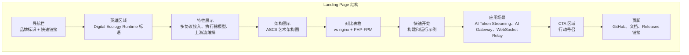
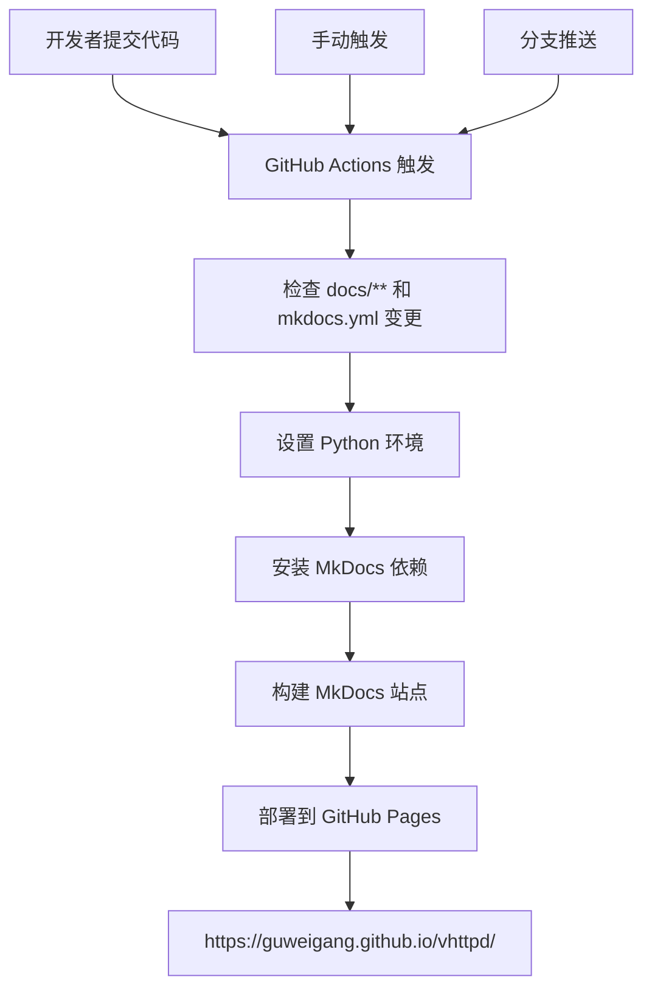
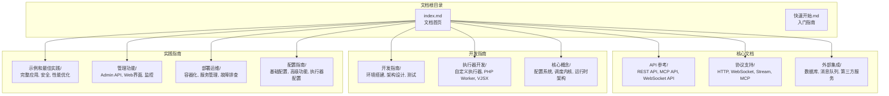
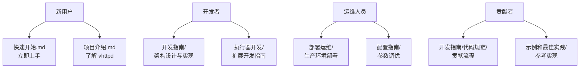
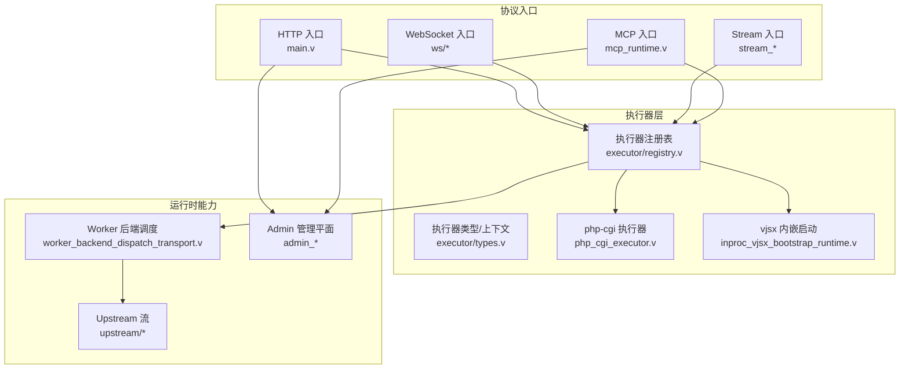
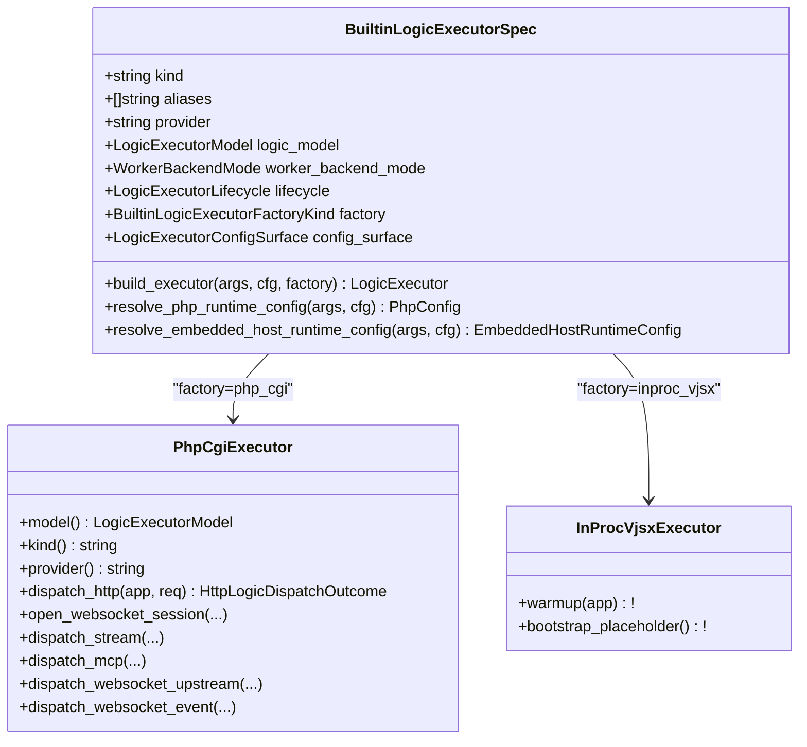
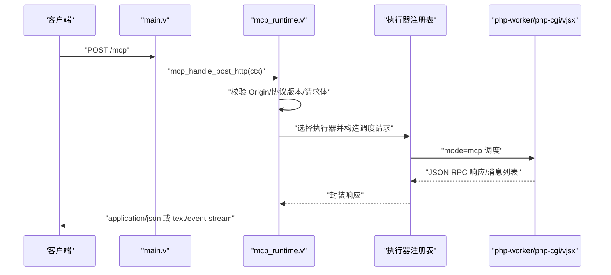
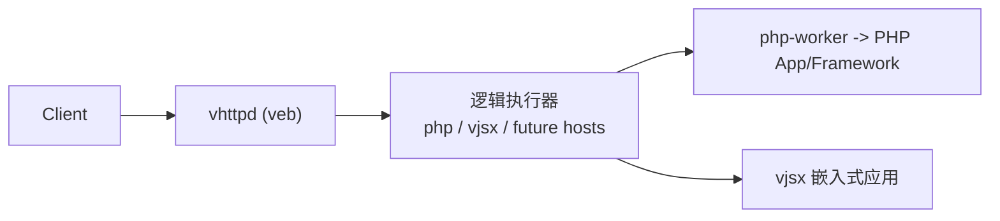
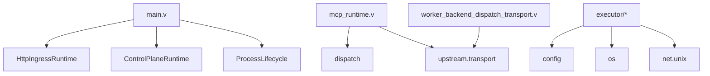

# 项目概述

<cite>
**本文引用的文件**   
- [README.md](file://README.md)
- [mkdocs.yml](file://mkdocs.yml)
- [.github/workflows/mkdocs.yml](file://.github/workflows/mkdocs.yml)
- [docs/index.md](file://docs/index.md)
- [index.html](file://index.html)
- [assets/vhttpd_logo.png](file://assets/vhttpd_logo.png)
- [src/main.v](file://src/main.v)
- [design-docs/OVERVIEW.md](file://design-docs/OVERVIEW.md)
- [design-docs/ARCHITECTURE_REFACTOR_BASELINE.md](file://design-docs/ARCHITECTURE_REFACTOR_BASELINE.md)
</cite>

## 更新摘要
**所做更改**   
- 新增了完整的 Landing Page（index.html）作为 vhttpd 的主要入口点，展示其作为"数字生态运行时"的能力
- 更新了文档基础设施章节，反映从 mdBook 到 MkDocs 的迁移
- 新增了完整的 GitHub Actions 自动化部署工作流说明
- 更新了文档站点部署流程和访问地址
- 重新组织了文档导航结构，支持更丰富的内容组织
- 增强了文档系统的现代化特性说明

## 目录
1. [引言](#引言)
2. [Landing Page 与数字生态运行时](#landing-page-与数字生态运行时)
3. [文档基础设施重构](#文档基础设施重构)
4. [核心组件](#核心组件)
5. [架构总览](#架构总览)
6. [详细组件分析](#详细组件分析)
7. [依赖关系分析](#依赖关系分析)
8. [性能与可观测性](#性能与可观测性)
9. [故障排查指南](#故障排查指南)
10. [结论](#结论)
11. [附录：使用场景与部署示例](#附录使用场景与部署示例)

## 引言
vhttpd 的定位已从"PHP 应用服务器"演进为"多协议执行主机"。它不再只关注 HTTP，而是统一承载 HTTP、WebSocket、流式响应（SSE/text）、MCP Streamable HTTP 以及 WebSocket upstream（如飞书）等协议形态，并通过统一的执行器模型调度 PHP Worker 与 vjsx 嵌入式逻辑。其核心价值在于：
- 将协议入口与应用逻辑解耦：vhttpd 专注 transport、worker 编排、流生命周期与可观测性；业务逻辑由外部 worker 或嵌入式宿主承担。
- 以 veb 为 HTTP 事实来源，保持内核轻量：复用 veb/http/urllib，避免重复造轮子。
- 面向 AI 时代的应用形态：token streaming、长连接事件、MCP 工具调用、Bot 集成等能力在同一个运行时中协同工作。

从传统 PHP 应用服务器向协议和执行主机的演进路径清晰可见：早期围绕 PHP-FPM 的短请求模型，逐步引入 php-worker 统一流式契约，再叠加 vjsx 作为快速演进的插件层，最终形成"协议面 + 运行面 + 管理面"三位一体的主机形态。

**章节来源**
- [README.md:1-82](file://README.md#L1-L82)
- [design-docs/OVERVIEW.md:1-39](file://design-docs/OVERVIEW.md#L1-L39)

## Landing Page 与数字生态运行时

### 现代化 Landing Page 设计
vhttpd 现在提供了一个全面的 Landing Page（index.html），作为项目的数字生态运行时入口点。这个现代化的 Web 界面展示了 vhttpd 的核心能力和设计理念：



**图表来源**
- [index.html:342-357](file://index.html#L342-L357)
- [index.html:360-387](file://index.html#L360-L387)
- [index.html:390-431](file://index.html#L390-L431)
- [index.html:434-469](file://index.html#L434-L469)
- [index.html:472-527](file://index.html#L472-L527)
- [index.html:530-582](file://index.html#L530-L582)
- [index.html:585-635](file://index.html#L585-L635)
- [index.html:638-651](file://index.html#L638-L651)
- [index.html:654-664](file://index.html#L654-L654)

### 核心特性展示
Landing Page 重点展示了 vhttpd 的六大核心特性：

1. **多协议接入**：HTTP、WebSocket、SSE、text stream、MCP Streamable HTTP — 统一 ingress，统一调度
2. **多执行器模型**：PHP worker 承载成熟业务，vjsx 嵌入式 TypeScript 处理快速变化的协议适配与插件逻辑
3. **上游流编排**：原生支持 Ollama、OpenAI 等上游 token stream，自动映射为下游 SSE 或 text stream
4. **AI Gateway**：OpenAI-compatible gateway、Ollama proxy、MCP server — 一个 runtime 全部承载
5. **WebSocket Upstream**：飞书等长连接事件入口作为上游 provider，事件自动路由到 worker，支持 MCP 桥接
6. **可观测运维**：Admin plane 暴露 worker pool、queue、upstream sessions、MCP sessions、runtime stats

### 交互式终端演示
页面包含一个模拟终端，展示了 vhttpd 的简洁启动方式：

```bash
# 一行启动 PHP 应用
$ ./vhttpd --config config/vhttpd.example.toml

# 或一行启动 TypeScript 应用  
$ ./vhttpd --executor vjsx --vjsx-entry app.mts
```

### 技术栈与品牌视觉
- **品牌标识**：使用 assets/vhttpd_logo.png 作为品牌视觉元素
- **设计风格**：深色主题，现代科技感，渐变色彩方案
- **响应式设计**：支持移动端和桌面端的自适应布局
- **动画效果**：平滑滚动、渐入动画、悬停效果

**章节来源**
- [index.html:1-668](file://index.html#L1-L668)
- [assets/vhttpd_logo.png](file://assets/vhttpd_logo.png)

## 文档基础设施重构

### MkDocs 系统引入
项目现已完成从 mdBook 到 MkDocs 的文档基础设施迁移，提供了现代化的文档构建和部署体验：

```yaml
site_name: vhttpd 文档
site_url: https://guweigang.github.io/vhttpd/
theme:
  name: material
  language: zh
plugins:
  - search
markdown_extensions:
  - pymdownx.superfences:
      custom_fences:
        - name: mermaid
          class: mermaid
          format: !!python/name:pymdownx.superfences.fence_code_format
```

### 自动化部署工作流
项目集成了完整的 GitHub Actions 自动化部署流程，支持在推送代码时自动构建和部署文档站点：



**图表来源**
- [.github/workflows/mkdocs.yml:1-51](file://.github/workflows/mkdocs.yml#L1-L51)

### 文档结构重组
新的 MkDocs 文档结构支持更丰富的内容组织和导航：



**图表来源**
- [mkdocs.yml:14-252](file://mkdocs.yml#L14-L252)

### 现代化特性
新的文档系统提供了以下现代化特性：
- **Material Design 主题**：专业的中文支持，响应式设计
- **Mermaid 图表支持**：原生支持架构图和数据流图
- **全文搜索**：内置搜索引擎，快速定位文档内容
- **多级导航**：清晰的文档层次结构和面包屑导航
- **版本控制集成**：与 Git 工作流无缝集成

### 文档导航优化
新的文档结构支持多种阅读路径：



**图表来源**
- [mkdocs.yml:14-252](file://mkdocs.yml#L14-L252)

**章节来源**
- [mkdocs.yml:1-252](file://mkdocs.yml#L1-L252)
- [.github/workflows/mkdocs.yml:1-51](file://.github/workflows/mkdocs.yml#L1-L51)
- [docs/index.md:1-15](file://docs/index.md#L1-L15)

## 核心组件
- 执行器注册表与类型
  - 内置执行器：php、php-cgi、vjsx、none
  - 每个执行器声明 model（worker/embedded）、worker_backend_mode（required/disabled）、lifecycle、factory 与配置表面
  - 提供构建执行器、解析配置、生成命令与环境变量的辅助方法
- 执行器接口与调度上下文
  - 定义 HTTP/WebSocket/MCP/Stream 的统一调度类型与结果
  - 暴露 Admin 统计摘要、队列状态、活跃会话计数等
- MCP 运行时
  - 校验 Origin、协议版本、请求体，转发到 worker 并返回 JSON/SSE
- 内嵌 vjsx 启动
  - 初始化 lanes、签名刷新、预热请求，确保热路径就绪
- FastCGI 执行器
  - 通过 Unix socket 与 php-cgi 进程通信，编码/解码 FastCGI 请求/响应

**章节来源**
- [src/main.v:1-117](file://src/main.v#L1-L117)
- [design-docs/ARCHITECTURE_REFACTOR_BASELINE.md:37-53](file://design-docs/ARCHITECTURE_REFACTOR_BASELINE.md#L37-L53)

## 架构总览
vhttpd 的核心设计原则：
- 协议对等：HTTP、WebSocket、Stream、MCP 作为对等适配器接入，不将其他协议降级为 HTTP 分支
- 传输与业务分离：vhttpd 负责连接终止、worker 编排、流生命周期与可观测性；业务逻辑交由执行器
- 基于 veb 的轻量边界：复用 veb.Context、request_id、SSE 格式化等能力，保持内核薄且稳定



**图表来源**
- [src/main.v:83-116](file://src/main.v#L83-L116)
- [design-docs/ARCHITECTURE_REFACTOR_BASELINE.md:39-53](file://design-docs/ARCHITECTURE_REFACTOR_BASELINE.md#L39-L53)

**章节来源**
- [README.md:27-31](file://README.md#L27-L31)
- [design-docs/ARCHITECTURE_REFACTOR_BASELINE.md:156-200](file://design-docs/ARCHITECTURE_REFACTOR_BASELINE.md#L156-L200)

## 详细组件分析

### 执行器模式：PHP Worker 与 vjsx 嵌入式
- 执行器规格
  - kind/aliases/provider/logic_model/worker_backend_mode/lifecycle/factory/config_surface
  - 支持 none、php、php-cgi、vjsx 四种内置规格
- 配置解析与构造
  - resolve_php_runtime_config：合并 CLI 覆盖项，验证 worker_entry/app_entry/extensions
  - resolve_embedded_host_runtime_config：解析 vjsx app/module/build/signature/profile/thread_count 等
  - build_executor：根据 factory 选择 SocketWorker/PhpCgi/InProcVjsx
- 行为差异
  - php/php-cgi：需要 worker backend，支持 HTTP 请求；php-cgi 不支持 WS/Stream/MCP
  - vjsx：embedded 模型，自动禁用 worker sockets，当前仅支持 HTTP 与 websocket_upstream 调度



**图表来源**
- [src/main.v:15-23](file://src/main.v#L15-L23)
- [design-docs/ARCHITECTURE_REFACTOR_BASELINE.md:97-109](file://design-docs/ARCHITECTURE_REFACTOR_BASELINE.md#L97-L109)

**章节来源**
- [design-docs/EXECUTOR_MODES.md:1-136](file://design-docs/EXECUTOR_MODES.md#L1-L136)

### 协议处理能力：HTTP/WebSocket/流式响应/MCP
- HTTP
  - main.v 将所有 HTTP 方法路由到 HttpIngressRuntime.route，完成入站规范化与后续分发
- WebSocket
  - ws/* 提供 hub/rooms/presence 等运行时能力，配合 executor 进行事件派发
- 流式响应
  - stream_runtime.v 实现 direct/dispatch/upstream_plan 三阶段语义
  - worker 侧通过 start/chunk/error/end 帧或 open/next/close 回调参与流控制
- MCP
  - mcp_runtime.v 校验 Origin/协议版本/请求体，转发到 worker 并返回 JSON 或 SSE
  - MVP 规划明确 POST/GET/DELETE 端点与 Session 所有权归属 vhttpd



**图表来源**
- [src/main.v:83-116](file://src/main.v#L83-L116)

**章节来源**
- [design-docs/OVERVIEW.md:75-86](file://design-docs/OVERVIEW.md#L75-L86)

### 架构设计原则与 veb 的关系
- 以 veb 为 HTTP 事实来源：veb.Context、request_id 中间件、SSE 格式化均由 veb 提供
- vhttpd 保持薄层：聚焦 transport、worker orchestration、stream lifecycle、observability
- 协议对等与可扩展：新增协议只需实现适配器，无需侵入核心数据路径



**图表来源**
- [README.md:167-173](file://README.md#L167-L173)

**章节来源**
- [README.md:27-31](file://README.md#L27-L31)
- [articles/01-overview.md:53-67](file://articles/01-overview.md#L53-L67)

## 依赖关系分析
- 内部依赖
  - main.v 依赖 HttpIngressRuntime、ControlPlaneRuntime、ProcessLifecycle
  - mcp_runtime.v 依赖 dispatch、transport、veb
  - executor/* 依赖 config、os、net.unix、upstream.transport
  - worker_backend_dispatch_transport.v 负责与 php-worker/php-cgi 的帧编解码与读写
- 外部依赖
  - veb：HTTP 上下文、中间件、SSE 格式化
  - V 标准库：net.http、net.unix、time、json、os



**图表来源**
- [src/main.v:1-23](file://src/main.v#L1-L23)

**章节来源**
- [src/main.v:1-23](file://src/main.v#L1-L23)

## 性能与可观测性
- 性能特性
  - 编译型二进制，低开销的 HTTP 入口与 worker 调度
  - 有界队列与超时控制：worker.queue_capacity、queue_timeout_ms，满队返回 503，等待超时返回 504
  - 流式优化：统一 start/chunk/error/end 与 open/next/close 语义，减少跨层缓冲与调优成本
- 可观测性
  - Admin 平面暴露 runtime summary、worker stats、active sessions、upstreams、MCP 会话等
  - 事件日志 NDJSON，便于集中采集与分析
  - 追踪 ID 透传：x-request-id/x-trace-id/request_id 字段归一化

**章节来源**
- [design-docs/OVERVIEW.md:229-252](file://design-docs/OVERVIEW.md#L229-L252)
- [src/main.v:40-73](file://src/main.v#L40-L73)

## 故障排查指南
- 常见错误分类
  - worker_queue_full：队列已满，返回 503
  - worker_queue_timeout：队列等待超时，返回 504
  - origin_forbidden：MCP 请求 Origin 未允许
  - empty_body：MCP JSON-RPC 请求体为空
  - worker_unavailable：MCP 需要配置的逻辑执行器但不可用
- 定位建议
  - 查看 /admin/runtime 与 /admin/workers 获取队列深度与 worker 状态
  - 检查 executor.kind 与 worker.backend_mode 是否匹配预期
  - 核对 vjsx 的 app_entry/module_root/build_root 是否存在
  - 确认 php-cgi 的扩展与入口路径有效

**章节来源**
- [design-docs/OVERVIEW.md:229-252](file://design-docs/OVERVIEW.md#L229-L252)

## 结论
vhttpd 通过"协议面 + 执行器 + 运行面"的分层设计，将传统 PHP 应用服务器升级为现代多协议执行主机。它以 veb 为事实来源保持内核轻量，以执行器抽象兼容 PHP Worker 与 vjsx 嵌入式逻辑，并以统一的流式与长连接能力支撑 AI 时代的 token streaming、MCP 工具调用与 Bot 集成。对于初学者，可从"什么是 vhttpd、支持哪些运行面、常用路径有哪些"入手；对于有经验的开发者，可深入执行器注册表、MCP 运行时与 worker 后端调度，理解其在生产环境中的可观测性与稳定性保障。

随着文档基础设施从 mdBook 迁移到 MkDocs，现在有了更完善的文档系统和自动化部署流程。新的文档站点 https://guweigang.github.io/vhttpd/ 提供了更好的用户体验，包括 Material Design 主题、Mermaid 图表支持、全文搜索等功能，帮助不同角色的用户快速找到所需信息。

全新的 Landing Page（index.html）进一步提升了项目的专业形象，通过现代化的 Web 界面展示了 vhttpd 作为"数字生态运行时"的完整能力，包括多协议支持、AI 网关、WebSocket 中继等核心特性，为用户提供了直观的项目概览和快速入门体验。

## 附录：使用场景与部署示例
- 典型使用场景
  - PHP 应用获得现代 transport 能力：SSE/token streaming、WebSocket、AI gateway
  - TypeScript 插件层：OpenAI-compatible gateway、Ollama proxy、DashScope coding plugin、Feishu event adapter
  - 统一网关：HTTP、WebSocket、SSE、MCP、upstream stream 在同一运行时协同
- 部署要点
  - Linux：systemd 实例单元，例如 vhttpd@prod 对应 /etc/vhttpd/prod.toml
  - macOS：launchd plist，设置 EnvironmentVariables.VHTTPD_CONFIG
  - 多监听器：同一进程绑定多个 host:port，每个 site 独立 executor 与 app
  - 打包分发：优先使用 CI 产物，包含 runtime/libs 与安装脚本，用户仅需 core/db/full 配置
- 文档部署
  - 自动构建：推送代码到 main/master/refactor/v2 分支时自动触发
  - 手动触发：支持 workflow_dispatch 手动构建文档
  - 访问地址：https://guweigang.github.io/vhttpd/
- Landing Page 部署
  - 静态文件：index.html 位于项目根目录，可直接通过 HTTP 服务器访问
  - 资源文件：assets/vhttpd_logo.png 提供品牌视觉元素
  - 响应式设计：支持移动端和桌面端的自适应显示

**章节来源**
- [README.md:367-411](file://README.md#L367-L411)
- [README.md:533-603](file://README.md#L533-L603)
- [README.md:298-366](file://README.md#L298-L366)
- [.github/workflows/mkdocs.yml:1-51](file://.github/workflows/mkdocs.yml#L1-L51)
- [index.html:1-668](file://index.html#L1-L668)
- [assets/vhttpd_logo.png](file://assets/vhttpd_logo.png)