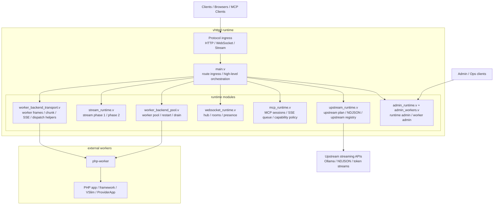
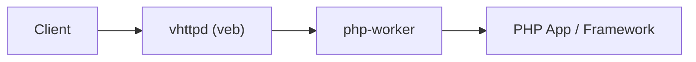

# VHTTPD (Standalone Runtime for PHP Apps)

`vhttpd` is an independent HTTP runtime built on `veb`.

Documentation entry:

- overview: [docs/OVERVIEW.md](/Users/guweigang/Source/vhttpd/docs/OVERVIEW.md)

- HTTP server runs as a standalone V CLI process.
- PHP userland controls app bootstrap and request handling through workers.
- `vhttpd` can front any PHP application shape (custom app, framework app, or adapter-based app).

Core design rule:

- `veb` is the HTTP source of truth.
- `vhttpd` stays thin and reuses `veb` / `http` / `urllib`.
- `vhttpd` focuses on transport, worker orchestration, streaming, and observability.

## What vhttpd Is

`vhttpd` can be understood as an HTTP-family gateway/runtime.

At the protocol layer it is still an HTTP server, but on top of HTTP it also supports:

- WebSocket
- Stream responses
  - SSE
  - text stream

On top of those connection protocols, `vhttpd` also provides runtime capabilities:

- upstream streaming execution
  - for example phase-3 `UpstreamPlan`, where `vhttpd` owns the live upstream stream
- external worker orchestration
  - today primarily `php-worker`
- worker transport and worker pool management
- runtime/admin observability
- protocol adapters such as MCP Streamable HTTP
- outbound websocket upstreams such as Feishu long-connection event delivery

So the easiest mental model is:

- `vhttpd` is not a business framework
- `vhttpd` is not just a thin reverse proxy either
- `vhttpd` is a transport/runtime layer that:
  - terminates HTTP/WebSocket/stream connections
  - manages worker processes
  - can own downstream and upstream stream lifecycles
  - exposes runtime state through admin endpoints

In short:

- protocol side: HTTP, WebSocket, stream
- runtime side: upstream, worker pool, admin/runtime, MCP



## Specs

- Documentation overview: [OVERVIEW.md](/Users/guweigang/Source/vhttpd/docs/OVERVIEW.md)
- PSR-7/15 support matrix: [psr_support.md](/Users/guweigang/Source/vhttpd/docs/psr_support.md)
- Failure/timeout model: [failure_model.md](/Users/guweigang/Source/vhttpd/docs/failure_model.md)
- Worker transport contract: [transport_contract.md](/Users/guweigang/Source/vhttpd/docs/transport_contract.md)
- Runtime module map: [RUNTIME_MODULE_MAP.md](/Users/guweigang/Source/vhttpd/docs/RUNTIME_MODULE_MAP.md)
- Major struct relationship map: [STRUCT_RELATIONSHIP_MAP.md](/Users/guweigang/Source/vhttpd/docs/STRUCT_RELATIONSHIP_MAP.md)
- Architecture refactor baseline: [ARCHITECTURE_REFACTOR_BASELINE.md](/Users/guweigang/Source/vhttpd/docs/ARCHITECTURE_REFACTOR_BASELINE.md)
- Feishu runtime compatibility plan: [FEISHU_RUNTIME_COMPATIBILITY_PLAN.md](/Users/guweigang/Source/vhttpd/docs/FEISHU_RUNTIME_COMPATIBILITY_PLAN.md)
- Feishu gateway removal batches: [FEISHU_GATEWAY_REMOVAL_PLAN.md](/Users/guweigang/Source/vhttpd/docs/FEISHU_GATEWAY_REMOVAL_PLAN.md)
- VSlim envelope/map contract: [/Users/guweigang/Source/vphpx/vslim/docs/protocol.md](/Users/guweigang/Source/vphpx/vslim/docs/protocol.md)
- MVP 1.0 operations runbook (TOML-first): [MVP_1_0_RUNBOOK.md](/Users/guweigang/Source/vhttpd/docs/MVP_1_0_RUNBOOK.md)
- MVP 1.0 PR-ready checklist: [MVP_1_0_PR_READY.md](/Users/guweigang/Source/vhttpd/docs/MVP_1_0_PR_READY.md)
- veb reuse roadmap (1.1): [VEB_REUSE_1_1_PLAN.md](/Users/guweigang/Source/vhttpd/docs/VEB_REUSE_1_1_PLAN.md)
- Upstream stream plan (phase 3): [UPSTREAM_PLAN_PHASE3.md](/Users/guweigang/Source/vhttpd/docs/UPSTREAM_PLAN_PHASE3.md)
- Stream runtime phases: [STREAM_RUNTIME_PHASES.md](/Users/guweigang/Source/vhttpd/docs/STREAM_RUNTIME_PHASES.md)
- MCP overview: [MCP.md](/Users/guweigang/Source/vhttpd/docs/MCP.md)
- MCP runbook: [MCP_RUNBOOK.md](/Users/guweigang/Source/vhttpd/docs/MCP_RUNBOOK.md)
- MCP MVP plan: [MCP_MVP_PLAN.md](/Users/guweigang/Source/vhttpd/docs/MCP_MVP_PLAN.md)
- WebSocket upstream plan: [WEBSOCKET_UPSTREAM_PLAN.md](/Users/guweigang/Source/vhttpd/docs/WEBSOCKET_UPSTREAM_PLAN.md)
- Binary build workflow: pending re-home into this split repo

## Why vhttpd stays close to veb

This boundary is intentional.

- `vhttpd`
  - stays as close to `veb` as possible
  - uses `veb.Context`, `http.Request`, `urllib`, and `http.Cookie` as source of truth
  - benefits directly from V's HTTP/runtime stack

Release rule:

- `veb` remains the HTTP/runtime source.
- request id is handled by `veb.request_id` middleware.
- SSE stream formatting/headers are handled by `veb.sse`.



## Why this matters in PHP (vs nginx + PHP-FPM)

`nginx + PHP-FPM` can stream too, but stream behavior is often sensitive to buffering and timeout settings across layers.
`vhttpd + php-worker` focuses on a unified streaming contract for PHP apps.

| Dimension | nginx + PHP-FPM | vhttpd + php-worker |
|---|---|---|
| Streaming support | Possible, often infra-tuning heavy | First-class via worker stream frames |
| App API shape | Framework/flush specific | Unified `VPhp\\VHttpd\\PhpWorker\\StreamResponse` (`text`/`sse`) |
| Transport semantics | Indirect through proxy/FPM behavior | Explicit `start/chunk/error/end` contract |
| AI token streaming path | Often ad-hoc per project | Reusable runtime pattern |
| Debug surface | Split across multiple components | Concentrated at worker boundary |

This does not replace nginx by itself.
It gives PHP applications a consistent runtime transport for request/response plus token streaming workloads.

## Runtime Modes

Current `vhttpd` can be understood as a small family of runtime modes:

| Mode | Worker ownership | Typical use |
|---|---|---|
| Plain HTTP | one short request -> one short worker call | normal request/response |
| Stream phase 1 | worker owns the live stream | simple `StreamResponse` |
| Stream dispatch strategy | `vhttpd` owns downstream, worker handles `open/next/close` | replayable or synthetic SSE/text |
| Stream phase 3 (`UpstreamPlan`) | `vhttpd` owns downstream and upstream | live upstream token streams such as Ollama |
| WebSocket phase 1 | worker owns the live websocket connection | simple websocket MVP |
| WebSocket phase 2 (`websocket_dispatch`) | `vhttpd` owns the websocket connection, worker handles short events | scalable websocket messaging |

Practical summary:

- phase 1 modes are simpler, but connection/stream lifetime is still tied to worker occupancy
- phase 2 modes decouple the client-side connection from worker lifetime
- stream phase 3 also decouples the upstream live stream from worker lifetime

## Build

```bash
cd vhttpd
make vhttpd
# or build production binary
make prod
# alias
make build-prod
```

`make vhttpd` now builds with `-d use_openssl` by default.
If you need the previous mbedtls path, use `make vhttpd V_TLS_BACKEND=mbedtls`; that path still adds `-d mbedtls_client_read_timeout_ms=120000` for long-lived Feishu websocket connections.
`make prod` / `make build-prod` use the same TLS backend selection and additionally enable V `-prod`.
`prod` build defaults runtime logs to `warn` (warnings + errors). You can override with `VHTTPD_LOG_LEVEL=debug|info|warn|error|fatal`.

## CI Binaries

GitHub Actions can build direct executables for:

- Linux (`linux-amd64`)
- macOS (`macos-amd64`, `macos-arm64`)

Workflow file:

```text
.github/workflows/vhttpd-binaries.yml
```

Release options:

1. Tag push (fully automatic):

```bash
git tag vhttpd-0.1.0
git push origin vhttpd-0.1.0
```

2. Manual dispatch:
- open Actions -> `Build vhttpd binaries`
- click `Run workflow`
- set `release_tag` (optional) to publish release assets in the same run

Release notes are auto-generated by GitHub and prefixed with a short artifact summary.

## Run

```bash
./vhttpd --host 127.0.0.1 --port 18081 \
  --pid-file /tmp/vhttpd.pid \
  --event-log /tmp/vhttpd.events.ndjson \
  --worker-read-timeout-ms 3000
```

### TOML config (recommended)

`vhttpd` now supports `--config` (and `VHTTPD_CONFIG`) using V's native TOML module.

- load order: defaults -> TOML config -> CLI args
- precedence: CLI args always override config file values
- variable expansion in TOML string fields:
  - `${section.key}` (for example `${server.port}`)
  - `${env.NAME}` and `${env.NAME:-default}`

Example:

```toml
[paths]
root = "."
php_app = "examples/hello-app.php"
php_worker = "php/package/bin/php-worker"
vslim_ext = "../vphpx/vslim/vslim.so"
web_root = "examples/public"

[server]
host = "0.0.0.0"
port = 19881

[files]
pid_file = "tmp/vhttpd_${server.port}.pid"
event_log = "tmp/vhttpd_${server.port}.events.ndjson"

[runtime]
timezone = "Asia/Shanghai"

[worker]
autostart = true
pool_size = 4
socket = "${env.VHTTPD_SOCKET:-tmp/vslim_worker.sock}"
read_timeout_ms = 3000
queue_capacity = 128
queue_timeout_ms = 250
max_requests = 5000
restart_backoff_ms = 500
restart_backoff_max_ms = 8000

[executor]
kind = "php"

[php]
bin = "php"
worker_entry = "${paths.php_worker}"
app_entry = "${paths.php_app}"
extensions = ["${paths.vslim_ext}"]
args = ["-d", "memory_limit=512M"]

[worker.env]
APP_ENV = "dev"

[admin]
host = "127.0.0.1"
port = 19981
token = "change-me"

[assets]
enabled = false
prefix = "/assets"
root = "${paths.web_root}"
cache_control = "public, max-age=3600"

[feishu]
enabled = false
open_base_url = "https://open.feishu.cn/open-apis"
reconnect_delay_ms = 3000
token_refresh_skew_seconds = 60
recent_event_limit = 20

[feishu.main]
app_id = "${env.FEISHU_APP_ID:-}"
app_secret = "${env.FEISHU_APP_SECRET:-}"

[feishu.openclaw]
app_id = "${env.FEISHU_OPENCLAW_APP_ID:-}"
app_secret = "${env.FEISHU_OPENCLAW_APP_SECRET:-}"
```

Note: variable expansion currently applies to TOML string fields.

Run with config:

```bash
./vhttpd --config /Users/guweigang/Source/vhttpd/config/vhttpd.example.toml
```

Shorthand is also supported:

```bash
./vhttpd /Users/guweigang/Source/vhttpd/config/vhttpd.example.toml
```

`[php]` defines the PHP runtime bootstrap. When `worker.cmd` is empty and `[executor].kind = "php"`, `vhttpd` builds the worker command automatically from `[php]`. If `worker.cmd` is set, it stays an explicit override.

PHP-specific CLI overrides are also available: `--php-bin`, `--php-worker-entry`, `--php-app-entry`, repeatable `--php-extension`, and repeatable `--php-arg`.

When `vhttpd` is generating the PHP worker command from `[php]`, it now fails fast if `worker_entry`, `app_entry`, or any configured `extensions` path is missing. That keeps PHP bootstrap mistakes visible at startup instead of turning into a later worker-launch failure.

`[worker.env]` entries are injected into the php-worker process environment, so they are readable via `getenv()` in PHP. `VHTTPD_APP` is auto-populated from `[php].app_entry` when present.

`[paths]` lets you define reusable path aliases. Values that start with `/` are treated as absolute paths and kept as-is. Other path values are resolved against `[paths].root`, and `[paths].root` itself is resolved against the config file directory.

`[runtime].timezone` controls the `vhttpd` process timezone (log/display side). If omitted, `vhttpd` falls back to `VHTTPD_TZ`, then `TZ`, then `Asia/Shanghai`.

Mode-specific config guidance for both `php` and `vjsx` is available at [docs/EXECUTOR_MODES.md](/Users/guweigang/Source/vhttpd/docs/EXECUTOR_MODES.md).

### In-Proc vjsx Mode

`vhttpd` now has an additive in-process logic path for `vjsx`.

- default mode is `php`
- switch explicitly with `[executor].kind = "vjsx"` or `--executor vjsx`
- in this mode, worker sockets and worker autostart are disabled automatically
- current scope is HTTP dispatch plus `websocket_upstream` dispatch; stream/websocket session worker modes and MCP remain intentionally disabled
- transpiled module cache is kept under the system temp directory instead of next to your source files
- the in-proc facade exposes `ctx.runtime.emit()` and read-only `ctx.runtime.snapshot()`
- the in-proc facade also exposes semantic response helpers like `ctx.created()`, `ctx.noContent()`, `ctx.badRequest()`, and `ctx.notFound()`
- response helpers also include `ctx.accepted()`, `ctx.unprocessableEntity()`, and `ctx.problem()` for structured problem responses
- request environment fields like `ctx.target`, `ctx.href`, `ctx.origin`, `ctx.ip`, `ctx.host`, and `ctx.runtime.request` are available without handing TS mutable server internals
- request negotiation helpers like `ctx.contentType()`, `ctx.accepts()`, `ctx.isJson()`, `ctx.isHtml()`, `ctx.wantsJson()`, and `ctx.wantsHtml()` are available for lightweight content negotiation

Minimal config example:

```toml
[paths]
root = "."
vjsx_app = "examples/vjsx/hello-handler.mts"
vjsx_root = "examples/vjsx"

[executor]
kind = "vjsx"

[vjsx]
app_entry = "${paths.vjsx_app}"
module_root = "${paths.vjsx_root}"
runtime_profile = "node"
thread_count = 2
```

You can also start it from CLI:

```bash
./vhttpd \
  --executor vjsx \
  --vjsx-entry /Users/guweigang/Source/vhttpd/examples/vjsx/hello-handler.mts \
  --vjsx-runtime-profile node \
  --vjsx-thread-count 2
```

There is also a ready-to-run example config at [config/vhttpd.vjsx.example.toml](/Users/guweigang/Source/vhttpd/config/vhttpd.vjsx.example.toml).

A step-by-step local verification guide is available at [docs/INPROC_VJSX_RUNBOOK.md](/Users/guweigang/Source/vhttpd/docs/INPROC_VJSX_RUNBOOK.md).

A facade-level API summary is available at [docs/VJSX_FACADE_REFERENCE.md](/Users/guweigang/Source/vhttpd/docs/VJSX_FACADE_REFERENCE.md), a richer HTTP example handler is available at [examples/vjsx/api-demo-handler.mts](/Users/guweigang/Source/vhttpd/examples/vjsx/api-demo-handler.mts), and a TS bot-shaped entry example is available at [examples/vjsx/bot-entry.mts](/Users/guweigang/Source/vhttpd/examples/vjsx/bot-entry.mts).

### WebSocket Upstream MVP

`vhttpd` now has an initial outbound websocket upstream runtime, with Feishu as the first provider:

- it treats long-lived outbound websocket links as an `upstream` transport family
- it exposes generic runtime visibility at `GET /admin/runtime/upstreams/websocket`
- it exposes generic recent-event visibility at `GET /admin/runtime/upstreams/websocket/events`
- it exposes worker activity visibility at `GET /admin/runtime/upstreams/websocket/activities`
- it exposes generic send commands at `POST /gateway/upstreams/websocket/send`
- it keeps a compatibility/debug send endpoint at `POST /admin/runtime/upstreams/websocket/send`
- it exposes an internal fixture provider at `POST /admin/runtime/upstreams/websocket/fixture/emit` for worker-bridge and admin-snapshot testing without a real upstream
- it also exposes provider-specific visibility at `GET /admin/runtime/feishu`
- it exposes a Feishu chat/target snapshot at `GET /admin/runtime/feishu/chats`
- the current Feishu provider can run multiple named apps from TOML, for example `feishu.main` and `feishu.openclaw`
- the current Feishu provider auto-acks incoming event frames
- it exposes a provider-specific send API at `POST /gateway/feishu/messages`
- it keeps a provider-specific compatibility/debug send API at `POST /admin/runtime/feishu/messages`

Current Feishu long-connection scope:

- long connection is used for event subscriptions such as `im.message.receive_v1`
- callback subscriptions such as interactive card actions are not part of the current Feishu websocket path
- interactive card actions are handled through the separate HTTP callback ingress below, then bridged into the same worker contract

Feishu callback ingress:

- `POST /callbacks/feishu`
- `POST /callbacks/feishu/:app`
- supports `url_verification` challenge response
- validates the callback `token` against `feishu.<app>.verification_token` when configured
- forwards non-challenge callbacks into the existing worker bridge so the same Feishu helpers can parse card actions and build `send` or `update` commands

For active outbound sends, Feishu `chat_id` values are usually learned from prior inbound events. `GET /admin/runtime/feishu/chats` folds recent event history into a per-app chat snapshot keyed by `instance + chat_id`, so you can discover private chats and group chats before calling gateway send APIs or MCP tools.

Current `vhttpd` surfaces are split roughly like this:

- `/admin/...`
  - runtime snapshots, worker control, and debug views
- `/gateway/...`
  - outbound upstream/provider send APIs
  - reserved for built-in gateway capabilities so application-facing `/api/...` routes stay available to the php app
- `/callbacks/feishu...`
  - Feishu callback ingress
- `/mcp`
  - MCP transport
- `/:path...`
  - normal proxied/data-plane HTTP dispatch

MCP can now bridge into the same gateway send path without exposing non-standard fields to MCP clients:

- MCP JSON-RPC responses remain standard on the wire
- php-worker may return internal `commands` alongside an `mcp` result envelope
- `vhttpd` executes those commands synchronously after the worker responds
- Feishu MCP tools are opt-in; the default [php/app.php](/Users/guweigang/Source/vhttpd/php/app.php) does not register them
- enable them explicitly with `VPhp\VHttpd\Upstream\WebSocket\Feishu\McpToolset::register(...)`, or use [mcp-feishu-app.php](/Users/guweigang/Source/vhttpd/examples/mcp-feishu-app.php)
- Feishu MCP tools discover runtime data explicitly via `VPhp\VHttpd\VHttpd::admin()->get(...)`, instead of `vhttpd` injecting Feishu-specific context into every `/mcp` request
- active PHP-side Feishu sends/uploads can use `VPhp\VHttpd\VHttpd::gateway('feishu')`; the internal host socket framing is documented in [INTERNAL_HOST_SOCKET_PROTOCOL.md](/Users/guweigang/Source/vhttpd/docs/INTERNAL_HOST_SOCKET_PROTOCOL.md)
- `feishu.send_text` returns a normal MCP tool result plus an internal Feishu gateway command built with `VPhp\VHttpd\Upstream\WebSocket\Feishu\Command::sendTextTo(...)`

Cherry Studio validation flow:

1. learn at least one Feishu chat first
   - send a message to the bot from Feishu
   - verify `GET /admin/runtime/feishu/chats?instance=main` returns a `chat_id`
2. point `VHTTPD_APP` at the combined bootstrap
   - [feishu-bot-mcp-app.php](/Users/guweigang/Source/vhttpd/examples/feishu-bot-mcp-app.php)
3. restart `vhttpd`
4. in Cherry Studio, add an MCP server with `streamableHttp`
   - URL: `http://127.0.0.1:19881/mcp`
5. first call `feishu.list_chats`
6. then call `feishu.send_text`

The combined bootstrap keeps all three surfaces active at once:

- normal HTTP app dispatch
- Feishu bot websocket/callback handling
- explicit Feishu MCP tools

The default [feishu-bot.toml](/Users/guweigang/Source/vhttpd/examples/config/feishu-bot.toml) can be switched to the combined bootstrap by setting:

```toml
[worker.env]
VHTTPD_APP = "/Users/guweigang/Source/vhttpd/examples/feishu-bot-mcp-app.php"
```

Cherry Studio prompts that work well:

```text
先调用 feishu.list_chats，列出 instance=main 的 chats，只返回 chat_id 和 chat_type。
```

```text
调用 feishu.send_text，instance 使用 main，chat_id 使用 oc_xxx，text 使用“来自 Cherry Studio 的 MCP 验证消息”。
```

Example send payload:

```json
{
  "provider": "feishu",
  "app": "main",
  "target_type": "chat_id",
  "target": "oc_xxx",
  "message_type": "text",
  "text": "hello from vhttpd"
}
```

For simple non-text Feishu messages, `vhttpd` also accepts structured `content_fields` and builds the provider `content` JSON for you:

```json
{
  "provider": "feishu",
  "app": "main",
  "target_type": "chat_id",
  "target": "oc_xxx",
  "message_type": "image",
  "content_fields": {
    "image_key": "img_v2_xxx"
  }
}
```

Use raw `content` for complex Feishu payloads such as `post` or `interactive` card messages.

When a websocket upstream event arrives and worker sockets are configured, `vhttpd` forwards it to `php-worker` with `mode=websocket_upstream`.

Your PHP bootstrap can handle it by returning a `websocket_upstream` entry:

```php
return [
    'websocket_upstream' => static function (array $frame): array {
        return [
            'handled' => true,
            'commands' => [
                [
                    'event' => 'send',
                    'provider' => $frame['provider'] ?? 'feishu',
                    'instance' => $frame['instance'] ?? 'main',
                    'target_type' => 'chat_id',
                    'target' => $frame['target'] ?? '',
                    'message_type' => 'text',
                    'text' => 'ack from php-worker',
                ],
            ],
        ];
    },
];
```

For PHP workers, [BotAdapter.php](/Users/guweigang/Source/vhttpd/php/package/src/VSlim/App/Feishu/BotAdapter.php) now provides both:

- `parseEvent()` for a normalized inbound Feishu event envelope across `message`, `action`, and generic event dispatches
- `parseMessage()` for a normalized inbound Feishu message envelope across multiple `message_type` values
- `parseCardAction()` for interactive card callbacks such as `card.action.trigger`
- `parseEventObject()`, `parseMessageObject()`, `parseTextMessageObject()`, and `parseCardActionObject()` for object-based worker code using `VPhp\VHttpd\Upstream\WebSocket\Feishu\Event` and `VPhp\VHttpd\Upstream\WebSocket\Feishu\Message`
- `buildSendCommand()` for standard `send` commands, including `content_fields` for simple message types and raw `content` for complex payloads
- `buildUpdateCommand()` and `buildUpdateInteractiveCommand()` for websocket upstream `update` commands that target either `message_id` or callback `token`
- `buildPostCommand()` and `buildInteractiveCommand()` so workers can build Feishu `post` and card messages from PHP arrays instead of hand-written JSON strings

For app-layer business logic, the preferred PHP API is now object-based:

- [Event.php](/Users/guweigang/Source/vhttpd/php/package/src/VHttpd/Upstream/WebSocket/Feishu/Event.php)
- [Message.php](/Users/guweigang/Source/vhttpd/php/package/src/VHttpd/Upstream/WebSocket/Feishu/Message.php)
- [Command.php](/Users/guweigang/Source/vhttpd/php/package/src/VHttpd/Upstream/WebSocket/Feishu/Command.php)
- [Feishu event views](/Users/guweigang/Source/vhttpd/php/package/src/VHttpd/Upstream/WebSocket/Feishu/Event)
- [Feishu message views](/Users/guweigang/Source/vhttpd/php/package/src/VHttpd/Upstream/WebSocket/Feishu/Message)
- [Feishu command views](/Users/guweigang/Source/vhttpd/php/package/src/VHttpd/Upstream/WebSocket/Feishu/Command)
- [BotHandler.php](/Users/guweigang/Source/vhttpd/php/package/src/VSlim/App/Feishu/BotHandler.php)
- [AbstractBotHandler.php](/Users/guweigang/Source/vhttpd/php/package/src/VSlim/App/Feishu/AbstractBotHandler.php)
- [BotApp.php](/Users/guweigang/Source/vhttpd/php/package/src/VSlim/App/Feishu/BotApp.php)

That lets `vhttpd` stay responsible for transport and protocol, while PHP worker code assembles Feishu business semantics and returns low-level commands only at the edge.

Recommended application structure:

- [php/app.php](/Users/guweigang/Source/vhttpd/php/app.php)
  - thin bootstrap only
  - wires `BotApp` to your app handler
- [php/app/MyFeishuBot.php](/Users/guweigang/Source/vhttpd/php/app/MyFeishuBot.php)
  - the default bot handler template
  - the place to customize bot behavior
- [php/app/FeishuBotDemo.php](/Users/guweigang/Source/vhttpd/php/app/FeishuBotDemo.php)
  - compatibility demo wrapper around `MyFeishuBot`
- [BotApp.php](/Users/guweigang/Source/vhttpd/php/package/src/VSlim/App/Feishu/BotApp.php)
  - package bridge from low-level websocket/callback frames to typed Feishu objects

Minimal bootstrap:

```php
$feishuBotApp = new \VPhp\VSlim\App\Feishu\BotApp(
    new \VHttpd\App\MyFeishuBot(),
);

return [
    'websocket_upstream' => static fn (array $frame): array => $feishuBotApp->handle($frame),
];
```

Minimal handler:

```php
use VPhp\VHttpd\Upstream\WebSocket\Feishu\Command;
use VPhp\VHttpd\Upstream\WebSocket\Feishu\Event\CardActionEvent;
use VPhp\VHttpd\Upstream\WebSocket\Feishu\Message\TextMessage;
use VPhp\VSlim\App\Feishu\AbstractBotHandler;
use VPhp\VSlim\App\Feishu\BotApp;

final class BotHandler extends AbstractBotHandler
{
    public function onTextMessage(TextMessage $message): ?Command
    {
        if ($message->text() === 'ping') {
            return Command::replyText($message, 'pong');
        }

        return null;
    }

    public function onCardAction(CardActionEvent $event): ?Command
    {
        return null;
    }
}

$bot = new BotApp(new BotHandler());

return [
    'websocket_upstream' => static fn (array $frame): array => $bot->handle($frame),
];
```

In practice, customizing the bot usually means editing [MyFeishuBot.php](/Users/guweigang/Source/vhttpd/php/app/MyFeishuBot.php) and replacing the demo branches with your own business logic.

For most apps, extending [AbstractBotHandler.php](/Users/guweigang/Source/vhttpd/php/package/src/VSlim/App/Feishu/AbstractBotHandler.php) is the easiest starting point, because you only need to override the message types you actually care about.

Common handler patterns:

```php
public function onTextMessage(TextMessage $message): ?Command
{
    return match ($message->text()) {
        'ping', '/ping' => Command::replyText($message, 'pong'),
        default => null,
    };
}
```

```php
public function onCardAction(CardActionEvent $event): ?Command
{
    return Command::updateInteractive(
        $event,
        InteractiveCard::create('updated')
            ->wideScreen()
            ->header(CardHeader::create(PlainText::create('updated')))
            ->markdown('approved'),
    );
}
```

Common object-side command factories now include:

- `Command::replyText($message, 'pong')`
- `Command::sendText($message, 'hello')`
- `Command::sendImage($message, 'img_v2_xxx')`
- `Command::sendPost($message, $postArray)`
- `Command::sendInteractive($message, $cardArray)`
- `Command::updateText($event, 'updated')`
- `Command::updateInteractive($event, $cardArray)`

`Command` remains the preferred business-facing return type. If you need typed command views after construction, use:

- `Command::sendText($message, 'hello')->asSend()`
- `Command::updateInteractive($event, $cardArray)->asUpdate()`

Typed command views expose command-oriented helpers such as:

- `SendCommand::text()`, `imageKey()`, `fileKey()`, `uuid()`, `decodedContent()`
- `UpdateCommand::text()`, `isTokenTarget()`, `isMessageIdTarget()`, `isInteractive()`

`Event`, `Message`, `Command`, and their typed views all implement `JsonSerializable`, so debug code can use `json_encode($object)` directly when needed.

For richer outbound payloads, you can also use value objects instead of raw arrays:

- [InteractiveCard.php](/Users/guweigang/Source/vhttpd/php/package/src/VHttpd/Upstream/WebSocket/Feishu/Content/InteractiveCard.php)
- [PostContent.php](/Users/guweigang/Source/vhttpd/php/package/src/VHttpd/Upstream/WebSocket/Feishu/Content/PostContent.php)
- [CardActionValue.php](/Users/guweigang/Source/vhttpd/php/package/src/VHttpd/Upstream/WebSocket/Feishu/Content/CardActionValue.php)
- [CardButton.php](/Users/guweigang/Source/vhttpd/php/package/src/VHttpd/Upstream/WebSocket/Feishu/Content/CardButton.php)
- [CardMarkdown.php](/Users/guweigang/Source/vhttpd/php/package/src/VHttpd/Upstream/WebSocket/Feishu/Content/CardMarkdown.php)
- [CardActionBlock.php](/Users/guweigang/Source/vhttpd/php/package/src/VHttpd/Upstream/WebSocket/Feishu/Content/CardActionBlock.php)

Example:

```php
use VPhp\VHttpd\Upstream\WebSocket\Feishu\Command;
use VPhp\VHttpd\Upstream\WebSocket\Feishu\Content\CardActionBlock;
use VPhp\VHttpd\Upstream\WebSocket\Feishu\Content\CardActionValue;
use VPhp\VHttpd\Upstream\WebSocket\Feishu\Content\CardButton;
use VPhp\VHttpd\Upstream\WebSocket\Feishu\Content\CardHeader;
use VPhp\VHttpd\Upstream\WebSocket\Feishu\Content\CardMarkdown;
use VPhp\VHttpd\Upstream\WebSocket\Feishu\Content\InteractiveCard;
use VPhp\VHttpd\Upstream\WebSocket\Feishu\Content\PlainText;

$card = InteractiveCard::create('demo card')
    ->wideScreen()
    ->header(CardHeader::create(PlainText::create('demo card')))
    ->element(CardMarkdown::create('Click to continue.'))
    ->element(CardActionBlock::create(
        CardButton::primary(PlainText::create('Approve'), CardActionValue::action('approve')),
    ));

return Command::sendInteractive($message, $card);
```

Typed message and event routing is handled inside [BotApp.php](/Users/guweigang/Source/vhttpd/php/package/src/VSlim/App/Feishu/BotApp.php) via:

- [Feishu\Message\Factory.php](/Users/guweigang/Source/vhttpd/php/package/src/VHttpd/Upstream/WebSocket/Feishu/Message/Factory.php)
- [Feishu\Event\Factory.php](/Users/guweigang/Source/vhttpd/php/package/src/VHttpd/Upstream/WebSocket/Feishu/Event/Factory.php)

That keeps the handler contract explicit without duplicating message-type branching in application bootstrap code.

For the current Feishu provider, `update` supports both `message_id` and callback `token`.
`interactive` card updates triggered from callbacks use the delayed card update flow, while other message updates use the standard message update flow.

Object handlers may also implement `handleWebSocketUpstream(array $frame)` or `handle_websocket_upstream(array $frame)`. Legacy `...Dispatch` variants remain supported for compatibility.

The default [php/app.php](/Users/guweigang/Source/vhttpd/php/app.php) now includes a minimal Feishu bot handler:

- send `ping` or `/ping` to the bot, it replies with `pong`
- send `/vhttpd hello`, it replies with `vhttpd websocket upstream demo (<app>): hello`
- send `/card`, it replies with a clickable interactive demo card
- click the demo card button through the Feishu callback ingress, it updates the original card in place
- it wires [BotApp.php](/Users/guweigang/Source/vhttpd/php/package/src/VSlim/App/Feishu/BotApp.php) to [MyFeishuBot.php](/Users/guweigang/Source/vhttpd/php/app/MyFeishuBot.php)
- user customization happens in [MyFeishuBot.php](/Users/guweigang/Source/vhttpd/php/app/MyFeishuBot.php), while package code keeps protocol and command assembly reusable

For worker bridge debugging, inspect `GET /admin/runtime/upstreams/websocket/activities?provider=feishu&instance=main` to see:

- the inbound event summary forwarded to `php-worker`
- whether the worker marked it as `handled`
- which `commands` the worker returned
- whether each command was actually sent or failed in `vhttpd`
- any `metadata` tags that traveled with the event or command
- `source_activity_id` and `source_command_index` so each send command can be traced back to the exact upstream activity entry

For internal testing, you can inject a synthetic event through the fixture provider:

```json
{
  "instance": "fixture-main",
  "trace_id": "trace-fixture-1",
  "event_type": "fixture.message",
  "message_id": "fixture-evt-1",
  "target_type": "fixture_target",
  "target": "room-1",
  "payload": "{\"text\":\"hello fixture\"}",
  "metadata": {
    "source": "manual-debug"
  }
}
```

POST it to `POST /admin/runtime/upstreams/websocket/fixture/emit`, then inspect:

- `GET /admin/runtime/upstreams/websocket?provider=fixture&instance=fixture-main`
- `GET /admin/runtime/upstreams/websocket/events?provider=fixture&instance=fixture-main`
- `GET /admin/runtime/upstreams/websocket/activities?provider=fixture&instance=fixture-main`

### Managed worker mode

`vhttpd` can also supervise PHP workers directly:

```bash
./vhttpd --host 127.0.0.1 --port 19880 \
  --pid-file /tmp/vhttpd.pid \
  --event-log /tmp/vhttpd.events.ndjson \
  --worker-socket /tmp/vslim_worker.sock \
  --worker-autostart 1 \
  --worker-cmd 'php -d extension=/Users/guweigang/Source/vphpx/vslim/vslim.so /Users/guweigang/Source/vhttpd/php/package/bin/php-worker'
```

This gives you a single command that boots:

- `vhttpd`
- `php/package/bin/php-worker`
- your PHP application entry

### Managed worker pool (MVP)

`vhttpd` now supports a basic `1:N` managed worker mode.

Key flags:

- `--worker-pool-size N`
- `--worker-socket /tmp/vslim_worker.sock` (when pool-size > 1, final sockets become `/tmp/vslim_worker_0.sock`, ...)
- `--worker-sockets /tmp/a.sock,/tmp/b.sock` (explicit list, overrides pool-size generation)
- `--worker-max-requests N` (restart each worker after N served requests)
- `--worker-restart-backoff-ms 500`
- `--worker-restart-backoff-max-ms 8000`
- `--admin-host 127.0.0.1` (control plane bind host, disabled when `--admin-port` is `0`)
- `--admin-port 19981` (control plane port; when enabled, `/admin/*` is removed from data plane port)
- `--admin-token your-secret` (optional header/query token for admin plane)

When `--worker-pool-size > 1`, `vhttpd` auto-injects `--socket` into `--worker-cmd` when absent.
`{socket}` placeholder is optional and only needed if you want explicit inline control.

```bash
./vhttpd --host 127.0.0.1 --port 19880 \
  --pid-file /tmp/vhttpd.pid \
  --event-log /tmp/vhttpd.events.ndjson \
  --worker-pool-size 4 \
  --worker-socket /tmp/vslim_worker.sock \
  --worker-autostart 1 \
  --worker-max-requests 5000 \
  --worker-cmd 'php -d extension=/Users/guweigang/Source/vphpx/vslim/vslim.so /Users/guweigang/Source/vhttpd/php/package/bin/php-worker'
```

Endpoints:

- `GET /health` -> `OK`
- direct requests are proxied to the PHP worker as-is:
  - `GET /hello/codex`
  - `GET /go/nova`
  - `GET /api/meta`
- optional static assets (when `[assets].enabled=true`) are served directly by `veb` on data plane:
  - implemented via `veb.StaticHandler` (`mount_static_folder_at`)
  - `GET /assets/app.js`
  - `HEAD /assets/app.js`
- `GET /events/stream` returns SSE ping events for observability/debug:
  - `/events/stream?count=3&interval_ms=150`
  - `/events/stream?request_id=req-demo`
- `GET /admin/workers` returns runtime worker pool status (alive/draining/inflight/restarts)
  - on data plane port: available only when admin plane is disabled
  - on admin plane port: always available (optionally token-protected)
- `GET /admin/stats` returns runtime counters (total/error/timeout/stream/admin actions)
- `GET /admin/runtime` returns runtime capability flags plus active websocket/upstream/MCP counts
  - also includes worker queue settings and queue counters
- `GET /admin/runtime/upstreams` returns active phase-3 upstream sessions
- `GET /admin/runtime/websockets` returns active websocket connections and room membership
- `GET /admin/runtime/mcp` returns active MCP session summaries and detail snapshots
- `POST /admin/workers/restart?id=<worker_id>` restarts a single worker
- `POST /admin/workers/restart/all` restarts all workers
- `/dispatch` is kept as a debug bridge endpoint (this one uses query `method/path` on purpose):
  - `GET /dispatch?method=GET&path=/users/42`
  - `HEAD /dispatch?method=GET&path=/go/nova`
  - `GET /dispatch?method=POST&path=/health`
  - `GET /dispatch?method=GET&path=/panic`

For local smoke tests, prefer bypassing shell/system proxies:

```bash
curl --noproxy '*' -i http://127.0.0.1:19881/hello/codex
curl --noproxy '*' -i http://127.0.0.1:19881/go/nova
curl --noproxy '*' -i -H 'Host: demo.local' http://127.0.0.1:19881/api/meta
curl --noproxy '*' -N "http://127.0.0.1:19881/events/stream?count=2&interval_ms=0&request_id=req-demo"

# Admin plane on separate port (recommended for production)
./vhttpd --host 0.0.0.0 --port 19881 \
  --admin-host 127.0.0.1 --admin-port 19981 \
  --admin-token change-me \
  --worker-pool-size 4 --worker-socket /tmp/vslim_worker.sock --worker-autostart 1 \
  --worker-cmd 'php -d extension=/Users/guweigang/Source/vphpx/vslim/vslim.so /Users/guweigang/Source/vhttpd/php/package/bin/php-worker'

curl --noproxy '*' -s -H 'x-vhttpd-admin-token: change-me' http://127.0.0.1:19981/admin/workers
```

## Admin API (Control Plane)

Scope in current MVP:

- control plane supports runtime observability plus worker restart operations
- scale in/out and graceful shutdown orchestration are still external responsibilities

Available endpoints:

- `GET /health`
  - admin plane liveness check
  - response: `200 OK`
- `GET /admin/workers`
  - returns worker pool runtime snapshot
  - response content type: `application/json; charset=utf-8`
- `GET /admin/stats`
  - returns process-level runtime counters
  - response content type: `application/json; charset=utf-8`
- `GET /admin/runtime`
  - returns runtime capabilities and active connection/session counts
  - response content type: `application/json; charset=utf-8`
- `GET /admin/runtime/upstreams`
  - returns active phase-3 upstream sessions
  - default is summary-only; add `?details=1`
  - supports `limit` and `offset`
  - response content type: `application/json; charset=utf-8`
- `GET /admin/runtime/websockets`
  - returns active websocket connections and room snapshots
  - default is summary-only; add `?details=1`
  - supports `limit`, `offset`, `room`, and `conn_id`
  - response content type: `application/json; charset=utf-8`
- `GET /admin/runtime/mcp`
  - returns active MCP session snapshots
  - default is summary-only; add `?details=1`
  - supports `limit`, `offset`, `session_id`, and `protocol_version`
  - response content type: `application/json; charset=utf-8`
- `DELETE /mcp`
  - terminates a single MCP session
  - requires `Mcp-Session-Id` header or `session_id` query
  - response content type: `application/json; charset=utf-8`
- `POST /admin/workers/restart?id=<worker_id>`
  - restart a single managed worker by ID
  - returns updated worker runtime state in JSON
- `POST /admin/workers/restart/all`
  - restart all managed workers in the pool
  - returns number of restarted workers

Auth model:

- when `--admin-token` (or `[admin].token`) is empty:
  - admin endpoints are open on admin port
- when token is set:
  - send header `x-vhttpd-admin-token: <token>`
  - or query `?admin_token=<token>`
  - missing/invalid token returns `403 Forbidden`

Port exposure model:

- with `--admin-port 0` (disabled):
  - `/admin/*` is served on data plane port
- with `--admin-port > 0` (enabled):
  - `/admin/*` is removed from data plane (`404`)
  - `/admin/*` is served only on admin plane host/port

`GET /admin/workers` response fields:

- top-level:
  - `worker_autostart`: whether managed worker mode is enabled
  - `worker_pool_size`: configured socket/pool size
  - `worker_rr_index`: current round-robin cursor
  - `worker_max_requests`: restart threshold (`0` means disabled)
  - `worker_sockets`: resolved worker socket list
  - `workers`: per-worker runtime states
- per worker item:
  - `id`: worker index
  - `socket`: unix socket path
  - `alive`: process liveness
  - `draining`: whether worker is marked drain-only
  - `inflight_requests`: active in-progress requests
  - `served_requests`: total served requests (cumulative)
  - `restart_count`: restart count since startup
  - `next_retry_ts`: next retry timestamp when restart is backoff-scheduled

`GET /admin/stats` response fields:

- `started_at_unix`: process start timestamp (unix seconds)
- `uptime_seconds`: server uptime in seconds
- `http_requests_total`: total `http.request` events
- `http_errors_total`: `status >= 400` request count
- `http_timeouts_total`: requests classified as timeout (`error_class=timeout`)
- `http_streams_total`: stream-mode responses count
- `admin_actions_total`: `admin.*` events count (restart actions, etc.)
- `upstream_plans_total`: started stream upstream-plan sessions
- `upstream_plan_errors_total`: stream upstream-plan validation/execution errors
- `mcp_sessions_expired_total`: MCP sessions removed by TTL pruning
- `mcp_sessions_evicted_total`: MCP sessions evicted because `max_sessions` was hit
- `mcp_pending_dropped_total`: queued MCP messages dropped by per-session pending cap

`GET /admin/runtime` response fields:

- `started_at_unix`: process start timestamp (unix seconds)
- `uptime_seconds`: server uptime in seconds
- `worker_pool_size`: configured worker socket count
- `worker_queue_capacity`: configured request queue capacity
- `worker_queue_timeout_ms`: configured queue wait timeout
- `worker_queue_depth`: current waiting request count
- `capabilities`: enabled runtime surfaces and strategies (`stream`, `stream_direct`, `stream_dispatch`, `stream_upstream_plan`, `websocket`, `mcp`, etc.)
- `active_websockets`: current websocket connections held by `vhttpd`
- `active_upstreams`: current active phase-3 upstream sessions
- `active_mcp_sessions`: current active MCP sessions tracked by `vhttpd`
- `stats`: embedded `/admin/stats` snapshot

Additional queue counters under `stats`:

- `worker_queue_waits_total`
- `worker_queue_rejected_total`
- `worker_queue_timeouts_total`

`GET /admin/runtime/upstreams` response fields:

- `active_count`: number of active upstream sessions
- `returned_count`: number of sessions returned in this response
- `details`: whether `sessions[]` is expanded
- `limit`, `offset`: applied pagination window
- `sessions[]`: active session list
  - `id`, `request_id`, `trace_id`
  - `method`, `path`, `name`
  - `transport`, `codec`, `mapper`, `stream_type`, `source`
  - `started_at_unix`

`GET /admin/runtime/websockets` response fields:

- `active_connections`: websocket connections currently owned by `vhttpd`
- `active_rooms`: room count in the local websocket hub
- `returned_connections`, `returned_rooms`: counts returned in this response
- `details`: whether `connections[]` and `rooms[]` are expanded
- `limit`, `offset`: applied pagination window
- `room_filter`, `conn_id`: applied filters
- `connections[]`: per-connection snapshot
  - `id`, `request_id`, `trace_id`, `path`
  - `rooms[]`
  - `metadata`
- `rooms[]`: per-room snapshot
  - `name`
  - `member_count`
  - `members[]`

`GET /admin/runtime/mcp` response fields:

- `active_sessions`: MCP sessions currently tracked by `vhttpd`
- `returned_sessions`: number of sessions returned in this response
- `details`: whether `sessions[]` is expanded
- `limit`, `offset`: applied pagination window
- `session_id`, `protocol_version`: applied filters
- `max_sessions`: configured MCP session cap
- `max_pending_messages`: configured per-session pending queue cap
- `session_ttl_seconds`: configured MCP session TTL
- `allowed_origins`: configured MCP `Origin` allowlist
- `sessions[]`: per-session snapshot
  - `id`, `protocol_version`
  - `request_id`, `trace_id`, `path`
  - `started_at_unix`, `last_activity_unix`
  - `pending_count`
  - `connected`

Example:

```bash
curl --noproxy '*' -s -H 'x-vhttpd-admin-token: change-me' \
  http://127.0.0.1:19981/admin/workers | jq .

curl --noproxy '*' -s -H 'x-vhttpd-admin-token: change-me' \
  http://127.0.0.1:19981/admin/stats | jq .

curl --noproxy '*' -s -H 'x-vhttpd-admin-token: change-me' \
  http://127.0.0.1:19981/admin/runtime | jq .

curl --noproxy '*' -s -H 'x-vhttpd-admin-token: change-me' \
  http://127.0.0.1:19981/admin/runtime/upstreams | jq .

curl --noproxy '*' -s -H 'x-vhttpd-admin-token: change-me' \
  'http://127.0.0.1:19981/admin/runtime/upstreams?details=1&limit=20&offset=0' | jq .

curl --noproxy '*' -s -H 'x-vhttpd-admin-token: change-me' \
  http://127.0.0.1:19981/admin/runtime/websockets | jq .

curl --noproxy '*' -s -H 'x-vhttpd-admin-token: change-me' \
  'http://127.0.0.1:19981/admin/runtime/websockets?details=1&limit=20&room=lobby' | jq .

curl --noproxy '*' -s -H 'x-vhttpd-admin-token: change-me' \
  http://127.0.0.1:19981/admin/runtime/mcp | jq .

curl --noproxy '*' -s -H 'x-vhttpd-admin-token: change-me' \
  'http://127.0.0.1:19981/admin/runtime/mcp?details=1&limit=20' | jq .

curl --noproxy '*' -s -X DELETE \
  -H 'Origin: http://127.0.0.1:19895' \
  -H 'Mcp-Session-Id: mcp_123' \
  http://127.0.0.1:19895/mcp | jq .

# restart worker id=2
curl --noproxy '*' -s -X POST -H 'x-vhttpd-admin-token: change-me' \
  'http://127.0.0.1:19981/admin/workers/restart?id=2' | jq .

# restart all workers
curl --noproxy '*' -s -X POST -H 'x-vhttpd-admin-token: change-me' \
  'http://127.0.0.1:19981/admin/workers/restart/all' | jq .
```

## Request ID contract

- every response includes `x-request-id`
- request id resolve order:
  - query `request_id`
  - header `x-request-id`
  - auto-generated `req-<unix_micro>`
- `x-request-id` is also copied into event log rows for correlation

## PHP Userland scheduling

Use the package `Manager` class:

```php
<?php
require __DIR__ . '/php/package/src/VHttpd/Manager.php';

$mgr = new VPhp\VHttpd\Manager(
    __DIR__ . '/vhttpd',
    '127.0.0.1',
    18081,
    '/tmp/vhttpd.pid',
    '/tmp/vhttpd.events.ndjson',
    '/tmp/vhttpd.stdout.log'
);

$mgr->start();
if ($mgr->waitUntilReady()) {
    echo file_get_contents($mgr->baseUrl() . '/health');
}
print_r($mgr->events(20));
$mgr->stop();
```

## PHP package and namespace

`httpd` 目录下的 PHP 依赖支持统一命名空间根：`VPhp\\VHttpd\\*` 和 `VPhp\\VSlim\\*`。

Composer package:

- package root: [php-package](/Users/guweigang/Source/vhttpd/php/package)
- package manifest: [php-package/composer.json](/Users/guweigang/Source/vhttpd/php/package/composer.json)
- package name: `vphpext/vhttpd`

Primary classes:

- `VPhp\\VHttpd\\Manager`
- `VPhp\\VHttpd\\Psr7Adapter`
- `VPhp\\VSlim\\Psr7Adapter`
- `VPhp\\VHttpd\\PhpWorker\\Server`
- `VPhp\\VHttpd\\PhpWorker\\Client`
- `VPhp\\VHttpd\\PhpWorker\\StreamResponse`
- `VPhp\\VHttpd\\PhpWorker\\App`
- `VPhp\\VHttpd\\PhpWorker\\Connection`
- `VPhp\\VSlim\\Stream\\Response`
- `VPhp\\VSlim\\Stream\\Factory`
- `VPhp\\VSlim\\Stream\\OllamaClient`
- `VPhp\\VSlim\\Stream\\NdjsonDecoder`
- `VPhp\\VSlim\\Stream\\SseEncoder`
- `VPhp\\VSlim\\DbGateway\\PDO`
- `VPhp\\VSlim\\DbGateway\\PDOStatement`

Composer bin entrypoints:

- `vendor/bin/php-worker`
- `vendor/bin/php-worker-client`

Package source layout:

- `php/package/src/VHttpd/*`
  `Manager`、`Psr7Adapter`、`PhpWorker/*`
- `php/package/src/VSlim/Psr7Adapter.php`
- `php/package/src/VSlim/Stream/*`
- `php/package/src/VSlim/DbGateway/*`

## Current direction

The active integration path is:

```text
vhttpd -> php/package/bin/php-worker -> vslim_handle_request(...)
```

That keeps:

- `vhttpd` as the `veb`-based network/runtime layer
- `php/package/bin/php-worker` as the PHP worker boundary
- `vslim` as the framework dispatch layer

## Worker streaming modes

`php/package/bin/php-worker` now supports stream frames, not just one-shot JSON responses:

- `stream_type=sse`: forwarded as true SSE over `veb.sse`
- `stream_type=text` (or others): passthrough mode, chunk-by-chunk to client (not buffered/aggregated)

This enables AI/token streaming style workloads in addition to normal request/response handlers.

## WebSocket MVP

`vhttpd` now also has a first WebSocket bridge MVP:

- `vhttpd` detects `Upgrade: websocket`
- it reuses V's `net.websocket` implementation for handshake and frame handling
- websocket events are bridged to `php-worker` using `mode=websocket` frames

PHP-side helper classes:

- `VPhp\\VHttpd\\PhpWorker\\App`
- `VPhp\\VHttpd\\PhpWorker\\Connection`

Minimal demo:

- [`/Users/guweigang/Source/vhttpd/examples/websocket_echo_app.php`](/Users/guweigang/Source/vhttpd/examples/websocket_echo_app.php)

Design notes:

- [`/Users/guweigang/Source/vhttpd/docs/WEBSOCKET_MVP_PLAN.md`](/Users/guweigang/Source/vhttpd/docs/WEBSOCKET_MVP_PLAN.md)
- [`/Users/guweigang/Source/vhttpd/docs/WEBSOCKET_EVENT_BUS_PLAN.md`](/Users/guweigang/Source/vhttpd/docs/WEBSOCKET_EVENT_BUS_PLAN.md)
- [`/Users/guweigang/Source/vhttpd/docs/WEBSOCKET_MESSAGE_DISPATCH_PLAN.md`](/Users/guweigang/Source/vhttpd/docs/WEBSOCKET_MESSAGE_DISPATCH_PLAN.md)
- [`/Users/guweigang/Source/vhttpd/docs/WEBSOCKET_PHASE2_IMPLEMENTATION_PLAN.md`](/Users/guweigang/Source/vhttpd/docs/WEBSOCKET_PHASE2_IMPLEMENTATION_PLAN.md)
- [`/Users/guweigang/Source/vhttpd/docs/STREAM_PHASE2_IMPLEMENTATION_PLAN.md`](/Users/guweigang/Source/vhttpd/docs/STREAM_PHASE2_IMPLEMENTATION_PLAN.md)

### StreamResponse contract for any PHP framework

`VPhp\\VHttpd\\PhpWorker\\StreamResponse` is intentionally a `vhttpd` runtime contract (not a VSlim-only type).
Any framework behind `vhttpd -> php/package/bin/php-worker` can return this object to stream chunks/tokens.

Minimal app return contract:

```php
use VPhp\VHttpd\PhpWorker\StreamResponse;

return function (array $envelope) {
    $prompt = (string)($envelope['query']['prompt'] ?? 'hello');
    $events = (function () use ($prompt) {
        foreach (str_split($prompt) as $idx => $ch) {
            yield [
                'event' => 'token',
                'id' => 'tok-' . ($idx + 1),
                'data' => $ch,
            ];
        }
    })();
    return StreamResponse::sse($events, 200, ['x-stream-source' => 'vhttpd-app']);
};
```

Notes:

- `StreamResponse::sse(...)` emits true SSE frames.
- `StreamResponse::text(...)` emits passthrough text chunks.
- Keep this class in `vhttpd/php/package/src/VHttpd/PhpWorker`; do not duplicate it in each framework adapter.

## Final request envelope

`vhttpd` now forwards a single structured request shape derived from `veb.Context`
and `net.http.Request`. This is the transport contract for:

- `vhttpd -> php/package/bin/php-worker`
- `php/package/bin/php-worker -> vslim_handle_request(...)`
- `VPhp\\VSlim\\Psr7Adapter::dispatch(...)`

Current envelope shape:

```php
[
    'method' => 'GET',
    'path' => '/users/42?trace_id=worker',
    'body' => '',
    'scheme' => 'https',
    'host' => 'example.test',
    'port' => '443',
    'protocol_version' => '1.1',
    'remote_addr' => '127.0.0.1',
    'headers' => [
        'content-type' => 'application/json',
        'x-request-id' => 'abc',
    ],
    'cookies' => [
        'sid' => 'cookie-7',
    ],
    'query' => [
        'trace_id' => 'worker',
    ],
    'attributes' => [],
    'server' => [
        'host' => 'example.test',
        'port' => '443',
        'remote_addr' => '127.0.0.1',
        'method' => 'GET',
        'url' => '/users/42?trace_id=worker',
    ],
    'uploaded_files' => [],
]
```

Field notes:

- `path` is still the canonical request target.
- `query` is carried separately to avoid reparsing downstream.
- `headers` are normalized to lower-case names at the worker boundary.
- `cookies` are derived from the original `http.Request` headers via `http.read_cookies(...)`.
- `server` is lightweight metadata copied from the `veb/http` request layer.
- `uploaded_files` is reserved for future worker-side hydration; it stays structured even when empty.

Compatibility note:

- older `*_json` fields are intentionally removed
- first release uses the array envelope only
- if a caller still sends the old shape, it is now considered invalid input

## VSlim map dispatch contract

When a PHP app chooses `VSlim\App::dispatch_envelope_map(...)`, the return shape is:

- `status` (stringified integer)
- `body` (string)
- `content_type` (string)
- `headers_<lowercase-name>` (string; one key per response header)

Common propagated headers:

- `headers_x-request-id`
- `headers_x-trace-id`
- `headers_x-vhttpd-trace-id`

Typical worker-side normalization pattern:

```php
$map = $app->dispatch_envelope_map($envelope);
$headers = [];
foreach ($map as $k => $v) {
    if (str_starts_with((string)$k, 'headers_')) {
        $headers[substr((string)$k, 8)] = (string)$v;
    }
}
if (!isset($headers['content-type'])) {
    $headers['content-type'] = (string)($map['content_type'] ?? 'text/plain; charset=utf-8');
}
```

Then return normalized worker envelope:

```php
[
  'status' => (int)($map['status'] ?? '500'),
  'content_type' => (string)($map['content_type'] ?? 'text/plain; charset=utf-8'),
  'headers' => $headers,
  'body' => (string)($map['body'] ?? ''),
]
```

## Optional PSR-7 bridge

`php/package/bin/php-worker` now loads the package PSR-7 adapter directly.

If the runtime detects a supported PSR-17 style factory implementation, it can build a real
PSR-7-style server request from the request envelope before dispatching deeper into userland.

Current built-in factory detection covers:

- `Nyholm\\Psr7\\Factory\\Psr17Factory`
- `GuzzleHttp\\Psr7\\HttpFactory`
- `Laminas\\Diactoros\\RequestFactory` + `Laminas\\Diactoros\\StreamFactory`

This keeps `vhttpd` transport-generic while letting the worker boundary move toward PSR-7.

If `php/package/bin/php-worker` finds an app bootstrap file (`VHTTPD_APP` or `php/app.php`), it will:

- load the returned callable
- build a PSR-7 request when a supported PSR-17 factory is available
- dispatch the request into that app callable
- normalize a PSR-7-style response back into the worker transport envelope

## VSlim adapter

`VPhp\\VSlim\\Psr7Adapter` provides a small PHP-side bridge that can:

- convert a PSR-7 style request object into `VSlim\Request`
- dispatch that request through `VSlim\App`
- keep `vslim` native while letting `php/package/bin/php-worker` speak PSR-7 at the edge

`app.php` uses this adapter by default when the worker receives a PSR-7 request object.

## Writing your own `app.php`

`php/package/bin/php-worker` looks for an app bootstrap in this order:

1. `VHTTPD_APP`
2. `vhttpd/php/app.php`

The bootstrap file should `return` a callable. The worker will call it like this:

- with a PSR-7 request object and the raw envelope when a supported PSR-17 factory is available
- with the raw envelope only when no PSR-7 factory is available

It may also return a `VSlim\App` instance directly. In that case, the worker will:

- dispatch through `VPhp\\VSlim\\Psr7Adapter::dispatch(...)` when a PSR-7 request is available
- otherwise hydrate a `VSlim\Request` from the envelope and call `VSlim\App->dispatch_request(...)`

### Simplest `vslim` app

```php
<?php
declare(strict_types=1);

require_once __DIR__ . '/php/package/src/VSlim/Psr7Adapter.php';

return static function (mixed $request, array $envelope = []): VSlim\Response|array {
    $app = VSlim\App::demo();

    if (is_object($request)) {
        return \VPhp\VSlim\Psr7Adapter::dispatch($app, $request);
    }

    if (is_array($request)) {
        return vslim_handle_request($request);
    }

    return [
        'status' => 500,
        'content_type' => 'text/plain; charset=utf-8',
        'body' => 'No request payload available',
    ];
};
```

### Returning a `VSlim\App` directly

```php
<?php
declare(strict_types=1);

$app = new VSlim\App();

$app->get('/hello/:name', function (VSlim\Request $req) {
    return new VSlim\Response(
        200,
        'Hello, ' . $req->param('name'),
        'text/plain; charset=utf-8'
    );
});

return $app;
```

This is the recommended first-release shape:

- `vhttpd` stays close to `veb`
- `php/package/bin/php-worker` loads your bootstrap
- your bootstrap returns a `VSlim\App`
- `VSlim\App` owns runtime routing and hooks

### Lifecycle semantics

When your bootstrap returns a `VSlim\App`, request flow is:

```text
before hooks -> route handler -> after hooks
```

Return contract:

- `before()` returns `null`
  - continue dispatch
- `before()` returns `VSlim\Response` / `array` / `string`
  - short-circuit route dispatch
  - still flows into `after()`
- `after()` returns `null`
  - keep current response
- `after()` returns `VSlim\Response` / `array` / `string`
  - replace current response
- `before()/route/after()` throws
  - the PHP exception is not swallowed
  - it bubbles to the worker boundary
- invalid return values
  - normalize to `500 Invalid route response`

Execution order:

```text
app before -> matching group before -> route -> app after -> matching group after
```

This ordering is covered by:

- [/Users/guweigang/Source/vphpx/vslim/tests/test_php_hook_order.phpt](/Users/guweigang/Source/vphpx/vslim/tests/test_php_hook_order.phpt)

### Minimal custom app

```php
<?php
declare(strict_types=1);

$app = new VSlim\App();

$app->before(function (VSlim\Request $req) {
    if ($req->path === '/blocked') {
        return new VSlim\Response(403, 'blocked', 'text/plain; charset=utf-8');
    }
    return null;
});

$app->get('/hello/:name', function (VSlim\Request $req) {
    return new VSlim\Response(
        200,
        'Hello, ' . $req->param('name'),
        'text/plain; charset=utf-8'
    );
});

$app->after(function (VSlim\Request $req, VSlim\Response $res) {
    $res->set_header('x-runtime', 'vslim');
    return $res;
});

return $app;
```

There is also a ready-to-run example at:

- [/Users/guweigang/Source/vhttpd/examples/hello-app.php](/Users/guweigang/Source/vhttpd/examples/hello-app.php)

You can point the worker at it with:

```bash
export VHTTPD_APP=/Users/guweigang/Source/vhttpd/examples/hello-app.php
```

This example also demonstrates:

- named routes
- `url_for(...)`
- `redirect_to(...)`
- app-level `before()` / `after()`

### Returning a PSR-7-style response object

If your callable returns an object with:

- `getStatusCode()`
- `getHeaders()`
- `getBody()`

the worker will normalize it back into the transport envelope.

This means you can place a PSR-7-oriented app behind `vhttpd` without changing `vhttpd` itself.

### Returning an array directly

You can also skip response objects and return:

```php
[
    'status' => 200,
    'content_type' => 'application/json; charset=utf-8',
    'headers' => ['x-demo' => 'yes'],
    'body' => '{"ok":true}',
]
```

or just return a plain string:

```php
return 'hello from php-worker';
```

The worker will normalize these into the same wire format used by `vhttpd`.
