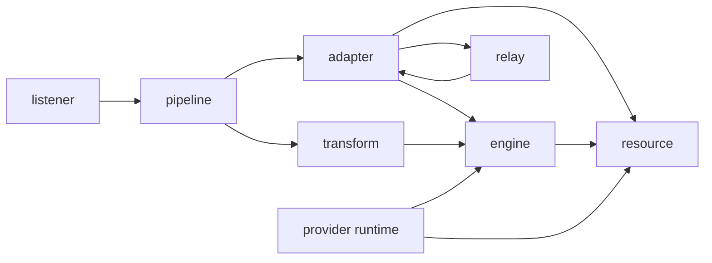

# Admin Control Plane Plan

## Purpose

vhttpd now has a V2 configuration model with stable domains for `listeners`, `control`, `observability`, `resources`, `engines`, `adapters`, `transforms`, `pipelines`, and `relays` in [Configuration Model V2](./CONFIGURATION_MODEL_V2.md). The admin control plane should expose those same domains as editable and observable runtime objects instead of inventing a separate site-specific UI model.

The admin is not only a page for editing TOML. It is a control-plane application for inspecting the compiled runtime plan, creating safe draft changes, validating those changes, applying them through runtime replacement, and observing the live system.

## Product Scope

The first complete admin experience should cover these areas:

| Area | User task | Runtime object |
| --- | --- | --- |
| Dashboard | See health, traffic, errors, active sessions, and recent changes | runtime snapshots and event stream |
| Plan | Inspect current compiled plan and pending draft diff | `RuntimePlan` |
| Resources | Manage DB, cache, storage, secrets, provider resources | `resources` |
| Listeners | Manage bind addresses, protocols, TLS, and ingress ownership | `listeners` |
| Pipelines | Build and modify ingress-match-transform-egress flows | `pipelines` |
| Relays | Manage public/local relay links, tunnels, MCP relay, and carrier state | `relays` |
| Adapters | Manage protocol/provider/upstream/static/upload endpoints | `adapters` |
| Transforms | Manage native and VJSX transform references | `transforms` |
| VJSX plugins | Inspect plugins, hooks, hot reload state, diagnostics, and hook metrics | `engines` plus plugin metadata |
| Deployments | Preview, apply, finalize, cancel, and audit runtime replacements | replacement lifecycle |
| Events | Inspect admin operations, runtime errors, reloads, relay disconnects, hook failures | admin event log |

## Design Principles

1. The admin UI follows the V2 vocabulary. If a thing is configured as a listener, resource, adapter, transform, pipeline, relay, or engine, the admin should use the same name and same reference model.
2. Native V owns transport, runtime lifecycle, plan compilation, validation, persistence, and atomic replacement.
3. VJSX owns the admin application UI and product workflow: forms, graph views, wizards, plugin diagnostics, and user-facing validation rendering.
4. The UI edits drafts, not the live runtime directly.
5. Plan changes flow through validate, diff, apply, finalize, or cancel.
6. Metrics and events are observable state, not configuration. They can be persisted for admin usability but should not become runtime source of truth.

## Source Of Truth Model

The recommended model is layered:

```text
TOML / deployment config
  -> config compiler
  -> current RuntimePlan
  -> runtime modules

Admin draft
  -> validate and compile
  -> preview diff
  -> runtime replacement apply
  -> finalize or cancel
```

TOML or deployment-managed config remains the declarative source for bootstrapping. The admin persists drafts, revisions, deployment records, audit events, and selected observability history. It should not immediately replace deployment configuration as the only source of truth.

This keeps the admin compatible with file-based deployments while still enabling interactive configuration authoring.

## Persistence Strategy

The first implementation should introduce an embedded `admin_state_store`, not a new external database dependency.

Default storage:

```text
.var/vhttpd/admin/
  drafts/
    draft_<id>.json
  revisions/
    revision_<id>.json
  deployments/
    deployment_<id>.json
  events.jsonl
  metrics-ring.json
```

Rules:

- Drafts, revisions, and deployments are JSON documents.
- Events are append-only JSONL records.
- Writes use temporary file plus atomic rename.
- Startup scans the directory and rebuilds lightweight indexes.
- Recent metrics use an in-memory ring buffer and optional periodic snapshot to disk.
- High-volume metrics are summarized before persistence.

The storage driver should be configurable but default to file storage:

```toml
[control.state]
driver = "file"
path = ".var/vhttpd/admin"
```

A later SQLite or DB-backed implementation can be added behind the same interface:

```toml
[control.state]
driver = "sqlite"
path = ".var/vhttpd/admin/state.sqlite"
```

The first version should not require SQLite, npm database packages, or a new service.

## Native Store Interface

Native V should expose a small persistent control-plane store:

```text
admin_state_store
  get(namespace, key)
  put(namespace, key, value)
  delete(namespace, key)
  list(namespace)
  append_event(event)
  list_events(filter)
  create_draft(plan_or_config, metadata)
  create_revision(plan, metadata)
  create_deployment(replacement_state, metadata)
```

Suggested namespaces:

| Namespace | Content |
| --- | --- |
| `drafts` | Admin-authored plan/config drafts |
| `revisions` | Finalized plan snapshots and metadata |
| `deployments` | Apply/finalize/cancel lifecycle records |
| `events` | Append-only admin and runtime events |
| `metrics` | Optional low-frequency snapshots |
| `preferences` | UI preferences and saved filters |

VJSX should call this through host/admin APIs. It should not directly write `.var/vhttpd/admin` files.

## Admin API Surface

The admin backend should expose stable APIs for the VJSX application.

### Runtime Read APIs

```text
GET /admin/runtime
GET /admin/runtime/plan
GET /admin/runtime/graph
GET /admin/runtime/resources
GET /admin/runtime/listeners
GET /admin/runtime/pipelines
GET /admin/runtime/relays
GET /admin/runtime/adapters
GET /admin/runtime/transforms
GET /admin/runtime/vjsx
GET /admin/events
GET /admin/metrics
```

`/admin/runtime/graph` should return nodes and edges for listeners, pipelines, transforms, adapters, relays, resources, engines, and providers. This graph powers both topology visualization and impact analysis before a change.

### Schema APIs

```text
GET /admin/schema
GET /admin/schema/resources/:kind
GET /admin/schema/listeners/:protocol
GET /admin/schema/adapters/:kind
GET /admin/schema/transforms/:kind
GET /admin/schema/relays/:kind
```

The schema API lets the VJSX UI generate forms from native-known validation metadata. This avoids duplicating every config rule in TypeScript.

### Draft And Validation APIs

```text
GET /admin/drafts
POST /admin/drafts
GET /admin/drafts/:id
PUT /admin/drafts/:id
DELETE /admin/drafts/:id
POST /admin/drafts/:id/validate
GET /admin/drafts/:id/diff
```

Validation compiles the draft into a candidate runtime plan without changing the live runtime.

### Replacement APIs

Existing replacement lifecycle endpoints should remain the commit path:

```text
POST /admin/runtime/plan/replacement/apply
POST /admin/runtime/plan/replacement/finalize
POST /admin/runtime/plan/replacement/cancel
GET /admin/runtime/plan/replacement/state
```

The admin UI should treat replacement as a deployment state machine:

```text
draft -> validated -> applied -> finalized
                  \-> apply_failed
applied -> canceled
```

### VJSX Plugin APIs

```text
GET /admin/vjsx/plugins
GET /admin/vjsx/plugins/:id
POST /admin/vjsx/plugins/:id/reload
GET /admin/vjsx/hooks
GET /admin/vjsx/hooks/:id/metrics
GET /admin/vjsx/errors
```

The first version should manage plugin metadata, hook mapping, reload, status, and diagnostics. Online code editing can come later.

## VJSX Admin Application

The admin UI should be a VJSX application served by vhttpd. Native provides host APIs; VJSX renders the product experience.

Initial pages:

1. Dashboard
2. Runtime Plan
3. Graph
4. Resources
5. Listeners
6. Pipelines
7. Relays
8. VJSX Plugins
9. Deployments
10. Events

The UI should favor dense operational screens over marketing-style pages. It should be useful for repeated operator work: compare, edit, validate, apply, inspect, and recover.

Form editing should support both modes:

- guided form mode for known schemas
- advanced structured editor mode for raw draft sections

## Object Relationships



Admin graph edges should be typed, for example `ingress`, `uses_transform`, `egress`, `uses_engine`, `uses_resource`, `uses_relay`, and `provider_hook`.

## Implementation Phases

### Phase 1: Native Admin State And Graph

- Add `admin_state_store` file driver.
- Add event append/list APIs.
- Add draft CRUD APIs.
- Add validation and diff APIs for drafts.
- Add `/admin/runtime/graph`.
- Add tests for atomic writes, recovery, draft validation, and graph output.

### Phase 2: Read-Only Admin VJSX App

- Serve VJSX admin app from the control plane.
- Implement Dashboard, Runtime Plan, Graph, Deployments, Events.
- Use existing runtime snapshots and replacement state.
- Display current listeners, pipelines, relays, resources, adapters, transforms, and VJSX plugins.

### Phase 3: Form Editing

- Add schema metadata APIs for each editable domain.
- Implement form editors for resources, listeners, pipelines, adapters, transforms, and relays.
- Save edits as drafts.
- Validate and show native compiler errors inline.
- Show graph impact and diff before apply.

### Phase 4: Replacement Workflow

- Wire draft diff to replacement apply.
- Add finalize/cancel UX.
- Persist deployment records and revision snapshots.
- Show deployment history and rollback candidates.

### Phase 5: VJSX Plugin Operations

- Add plugin list, hook list, reload, diagnostics, and hook metrics.
- Show hot reload results and last error per plugin.
- Show hook-level latency, error count, and recent failure samples.

### Phase 6: Observability Deep Views

- Add metrics ring snapshots.
- Add per-pipeline latency/error/throughput views.
- Add relay connection detail views.
- Add MCP session and request tracing views.
- Add filters and saved views.

## Non-Goals For The First Version

- Multi-user RBAC beyond a simple admin token or existing control authorization.
- Full online code editor for TypeScript/VJSX.
- External database requirement.
- Cluster-wide consensus or leader election.
- Replacing deployment-managed TOML as the only configuration source.
- High-cardinality metrics storage.

## Open Decisions

1. Should finalized admin revisions be exportable back to TOML immediately, or only stored as JSON plan snapshots first?
2. Should admin-authored drafts store raw V2 config, compiled runtime plan, or both?
3. Should the VJSX admin app be mounted under the existing control listener only, or can it be mounted behind a normal HTTP listener with strict auth?
4. Should schema metadata be hand-written per domain first, or generated from config structs where practical?
5. Should event retention be size-based, time-based, or both?

## First Engineering Task

Start with the native foundation:

1. Implement `src/admin_state_store/` with file-backed namespaces and JSONL events.
2. Add admin endpoints for draft CRUD, event list/append, and runtime graph.
3. Add tests that run without external services or new dependencies.
4. Keep DevSpace-specific relay examples out of this workstream unless explicitly resumed.
