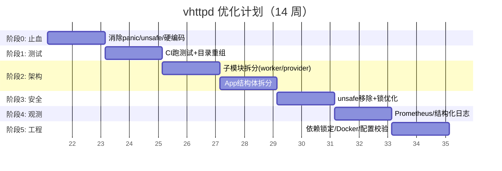

# vhttpd 项目全量分析报告

基于对 `vhttpd` 项目源代码、构建系统、测试套件、CI/CD 及文档的深度分析，我从 **8 个维度**梳理了现状与改进建议。

---

## 1. 架构与模块组织

### 现状
- **单一 `main` 模块**：整个 `src/` 下约 60+ 个 `.v` 文件全部属于 `module main`，没有子模块边界。
- **App 结构体膨胀**：`App` 承载了 HTTP 服务器、Worker 连接池、WebSocket Hub、MCP 会话、Feishu/Codex 运行时、OpenAI 网关等数十个职责。
- **巨型文件**：`codex_runtime.v`、`feishu_runtime.v`、`inproc_vjsx_executor.v`、`websocket_runtime.v` 等文件预计超过 2000 行。

### 建议
| 优先级 | 改进项 |
|--------|--------|
| 🔴 高 | **按领域拆分子模块**：如 `server/`、`worker/`、`provider/feishu/`、`provider/codex/`、`executor/`、`admin/`。V 语言的模块系统支持 `import server`，这能大幅缩短单个文件的行数并隐藏内部实现。 |
| 🔴 高 | **解耦 App 结构体**：将各子系统的状态从 `App` 中抽取为独立结构体（如 `FeishuRuntime`、`CodexRuntime`、`WebSocketHub`），通过组合或接口与主 App 交互，而非全部平铺在 `App` 的 `pub mut` 字段中。 |
| 🟡 中 | **内核调度层瘦身**：`kernel_dispatch.v` 目前包含大量工厂方法和分发逻辑，建议将各类 `from_xxx_dispatch` 的工厂方法下沉到各自的请求结构体文件中。 |

---

## 2. 内存安全与 `unsafe` 使用

### 现状
- `unsafe { nil }` 出现 **40+ 次**，用于初始化裸指针（`&App`、`&ws.Client`、`&unix.StreamListener` 等）。
- 多处通过 `unsafe { conn }` 将 `&websocket.Client` 裸指针存入 `map[string]&websocket.Client`。
- `admin_server.v` 中的 `AdminApp` 通过 `unsafe { shared_app }` 共享 `App` 指针。

### 建议
| 优先级 | 改进项 |
|--------|--------|
| 🔴 高 | **引入 `?&T` / `Option[T]` 替代裸 nil**：对于可能未初始化的引用，使用 V 的可选类型 `?&App`，强制所有调用点处理 `none` 情况，消除 `isnil` 检查。 |
| 🔴 高 | **用 `shared` 或 `chan` 替代裸指针跨线程共享**：`feishu_card_bridge` 中将 `&websocket.Client` 裸指针存入 map 并在锁保护下使用，仍有 UAF 风险。建议将 WebSocket 连接句柄封装为带引用计数的类型，或仅传递 `conn_id` 而非裸指针。 |
| 🟡 中 | **审查 `feishu_runtime` 和 `codex_runtime` 中的 `unsafe`**：这两个文件是业务核心且最复杂，任何 UAF 或数据竞争都会导致线上崩溃。建议增加 Miri 风格的运行时检测（如 V 的 `-fsanitize=thread` 等，若支持）或代码审查清单。 |

---

## 3. 并发与锁管理

### 现状
- `App` 拥有 **8+ 个独立的 mutex**：`mu`、`feishu_mu`、`ws_hub_mu`、`upstream_mu`、`mcp_mu`、`pool_mu`、`feishu_card_bridge_mu`、`feishu_card_bridge_send_mu`。
- 锁的获取顺序未显式文档化，存在潜在死锁风险（如 `admin_stats_snapshot` 中先后获取 `app.mu`、`ws_hub_mu`、`upstream_mu`、`mcp_mu`、`pool_mu`）。
- `InProcVjsxExecutor` 的 lane 模型使用 `sync.Mutex` 保护 slot，但 WebSocket affinity 迁移涉及跨 lane 状态修改。

### 建议
| 优先级 | 改进项 |
|--------|--------|
| 🔴 高 | **统一锁层级并文档化**：定义全局锁获取顺序（如 `mu > feishu_mu > ws_hub_mu`），并在代码注释中强制说明。引入锁顺序 linter 或运行时断言检测逆序加锁。 |
| 🔴 高 | **用 `sync.RwMutex` 替换纯读场景的 `Mutex`**：`admin_stats_snapshot` 中多个统计量是只读聚合，使用读锁可提升并发度。 |
| 🟡 中 | **Lane 模型引入无锁队列**：对于 vjsx executor 中 lane 与 task slot 的通信，考虑使用 `chan` 替代 `Mutex + ready bool`，这更符合 V 的并发哲学且减少竞态。 |

---

## 4. 错误处理与韧性

### 现状
- 存在大量 `or {}` 静默吞错：如 `conn.close() or {}`、`ctx.set_custom_header(...) or {}`。
- `provider_registry.v` 中废弃的包装函数直接 `panic`，任何旧代码调用都会导致进程退出。
- 测试代码中大量使用 `panic(err)`，但部分测试文件被包含在生产构建的排除列表中。

### 建议
| 优先级 | 改进项 |
|--------|--------|
| 🔴 高 | **消除生产代码中的裸 panic**：废弃函数应返回 `error` 或 `!` 类型，而非 panic。V 的 `panic` 不可恢复，对于服务器程序是致命的。 |
| 🔴 高 | **统一错误分类体系**：目前错误消息多为自由文本（如 `'transport_error: decode worker response failed'`）。建议建立结构化错误枚举（`WorkerError`、`CodexError`、`FeishuError`），每个错误包含 `error_class`、`retryable`、`log_level`。 |
| 🟡 中 | **审计所有 `or {}`**：对每个静默错误点补充注释说明为何可以安全忽略，或改为发射 `warning` 级别日志。例如 `conn.close() or { log.warn(...) }`。 |

---

## 5. 配置管理与 CLI

### 现状
- `config.v` 同时处理 TOML 解析、命令行参数解析、环境变量回退，逻辑复杂。
- `known_long_flags` 数组与实际的 `arg_xxx` 解析函数存在维护不一致的风险。
- 配置路径中包含绝对路径硬编码（`vhttpd.toml` 中 `/Users/guweigang/Source/...`）。

### 建议
| 优先级 | 改进项 |
|--------|--------|
| 🟡 中 | **引入配置校验层**：在 `load_vhttpd_config` 后增加 `validate_config` 阶段，检查互斥项（如 `executor = 'php'` 时 `php_bin` 必须存在）、端口冲突、路径可写性等，尽早失败并提供清晰错误信息。 |
| 🟡 中 | **使用代码生成或宏维护 CLI flags**：目前 `known_long_flags` 和 `print_vhttpd_help()` 是手动维护的字符串列表，极易与 `resolve_server_runtime_config` 中的实际解析逻辑脱节。可考虑用结构体标签反射生成帮助文本（V 支持 `@[flag: '...']` 风格标签）。 |
| 🟢 低 | **清理硬编码路径**：`vhttpd.toml` 中的 `cmd` 和 `extension` 路径应为相对路径或通过环境变量注入，避免在不同机器上无法直接运行。 |

---

## 6. 测试工程

### 现状
- 测试文件全部与源码混放在 `src/` 中，命名风格多样：`*_test.v`、`test_*.v`、`*_test_helpers.v`。
- Makefile 中将测试分为 `test-fast`、`test-inproc`、`test-codexbot` 等类别，手动维护文件列表。
- 缺少覆盖率报告和基准测试（`bench/` 目录存在但仅含外部压测脚本，没有 V 的 `@benc`h 测试）。

### 建议
| 优先级 | 改进项 |
|--------|--------|
| 🔴 高 | **引入测试目录隔离**：将测试文件移至 `tests/unit/`、`tests/integration/`、`tests/inproc/`，通过 `v test tests/` 递归运行，避免 Makefile 中硬编码文件列表。 |
| 🟡 中 | **增加覆盖率门禁**：在 CI 的 `vhttpd-binaries.yml` 中增加 `v -coverage test`（或 V 支持的等效选项），要求核心模块（`kernel_dispatch`、`worker_backend`、`logic_executor`）覆盖率不低于 60%。 |
| 🟡 中 | **补充 Mock 与契约测试**：`CodexCommandHandler` 和 `FeishuCommandHandler` 直接依赖 `app` 的完整状态，难以单元测试。建议为 `App` 提取接口（如 `CodexRuntimeHost`），测试时注入 mock。 |
| 🟢 低 | **将 `assert false` 改为 `t.fail()` 风格**：V 的测试框架支持 `assert` 但推荐使用更丰富的测试断言，便于输出差异信息。 |

---

## 7. 可观测性与运维

### 现状
- 有事件日志（`event_log` NDJSON）和 Admin API `/admin/runtime/*`，但指标未暴露为 Prometheus/OpenMetrics 格式。
- 日志大量使用 emoji 和中文描述（如 `📩`、`📤`、`🧩`），在集中日志系统中可能造成编码或搜索问题。
- 日志级别由环境变量 `VHTTPD_LOG_LEVEL` 控制，但缺乏按模块/Provider 的细粒度控制。

### 建议
| 优先级 | 改进项 |
|--------|--------|
| 🟡 中 | **增加 `/admin/metrics` 端点**：将 `AdminRuntimeStats` 序列化为 Prometheus text format，便于接入 Grafana/Alertmanager。 |
| 🟡 中 | **结构化日志标准化**：事件日志已是 NDJSON，但文本日志仍是自由格式。建议所有 `log.info`/`log.error` 输出也支持 JSON 模式（通过 `VHTTPD_LOG_FORMAT=json`），去除 emoji，用 `provider=codex event=frame_received` 等可过滤字段。 |
| 🟢 低 | **按模块日志级别控制**：支持 `VHTTPD_LOG_LEVEL_codex=debug`、`VHTTPD_LOG_LEVEL_feishu=warn` 等环境变量，避免在高负载下被 debug 日志淹没。 |

---

## 8. 构建、CI/CD 与依赖

### 现状
- Makefile 条件编译复杂：`WITH_DB`、`V_GC_FLAG`、`V_TLS_FLAGS`、`VJSX_FLAGS` 等交叉组合。
- CI 的 `vhttpd-binaries.yml` 仅做构建和冒烟测试（`--help`），**不运行任何单元测试**。
- 依赖 `vjsx` 和 `quickjs` 的方式涉及 Git 克隆和符号链接，没有版本锁定（`--depth=1`）。

### 建议
| 优先级 | 改进项 |
|--------|--------|
| 🔴 高 | **CI 增加测试阶段**：在构建产物前，运行 `make test-fast` 和至少一组集成测试，防止带 bug 的代码进入 release artifact。 |
| 🔴 高 | **引入依赖版本锁定**：为 `vjsx`、`quickjs` 和 V 编译器本身建立 `deps.lock` 或 git submodule commit pin，避免 `--depth=1` 导致的不 reproducible build。 |
| 🟡 中 | **Makefile 模块化**：将 `VJSX_FLAGS`、`V_DB_FLAGS` 等逻辑拆分到 `mk/*.mk` 文件，主 Makefile 仅做入口聚合，降低维护复杂度。 |
| 🟢 低 | **提供容器化构建**：增加 `Dockerfile`（多阶段构建基于 `vlang/vlang` 或 Alpine），消除 macOS/Linux 上 Homebrew/apt 的环境差异，简化贡献者上手。 |

---

## 总结：优先行动清单

| 序号 | 行动 | 影响 | 工作量 |
|------|------|------|--------|
| 1 | 将 `provider_registry.v`、`provider_bootstrap.v` 中的裸 `panic` 改为返回 `error` | 稳定性 | 小 |
| 2 | 为 CI 增加 `make test-fast` 和 `test-inproc` 步骤 | 质量门禁 | 小 |
| 3 | 引入依赖版本锁定（`vjsx`、`quickjs` commit pin） | 可复现构建 | 小 |
| 4 | 统一锁层级并增加文档/断言 | 并发安全 | 中 |
| 5 | 将 `App` 按领域拆分为子结构体，逐步迁移到子模块 | 可维护性 | 大 |
| 6 | 用 `?&T` 和 `chan` 替代高频 `unsafe` 模式 | 内存安全 | 大 |

如需，我可以针对上述任一方向（如 **子模块拆分**、**CI 测试门禁** 或 **锁层级重构**）给出具体的代码级实施方案。

## vhttpd 项目总结：优势与不足

---

### 一、项目定位

`vhttpd` 是一个基于 **V 语言（Vlang）** 编写的高性能 HTTP 守护进程兼运行时工具包。它试图替代传统的 **nginx + PHP-FPM** 组合，同时内嵌了 **QuickJS（vjsx）** 运行时、飞书（Feishu）Bot 网关、OpenAI/Codex AI 代理、WebSocket Hub、MCP（Model Context Protocol）服务端等能力，定位是 **"面向 AI 时代的全栈应用服务器"**。

---

### 二、核心优势

#### 1. **双运行时架构：PHP + JavaScript/TypeScript**
- 既支持通过 **Unix Domain Socket** 与传统 PHP Worker 通信（兼容 VSlim/Symfony/Laravel），又支持 **内嵌 QuickJS** 直接执行 JS/TS（vjsx）。
- 这让同一进程既能跑传统 Web 应用，又能跑现代化 AI Agent/Bot 逻辑。

#### 2. **协议覆盖全面**
- HTTP/1.1、WebSocket、SSE（Server-Sent Events）、Chunked Stream、MCP、OpenAI 代理网关全部原生支持，不是反向代理而是内核级调度。

#### 3. **开箱即用的 Provider 生态**
- **Feishu**：飞书事件订阅、消息收发、卡片交互、Stream 模式、Token 自动刷新。
- **Codex**：OpenAI Codex CLI 的 WebSocket 桥接、thread/resume/turn 生命周期管理。
- **Ollama/DB/OpenAI**：上游代理、数据库 Unix socket 桥。
- 适合快速搭建企业级 AI Bot。

#### 4. **控制平面（Admin API）**
- 独立 `/admin/runtime` 端点，可实时查看 worker 池、WebSocket 连接、MCP 会话、Codex 实例、Provider 状态，具备运维友好的可观测性雏形。

#### 5. **V 语言的性能红利**
- 编译型、内存安全（理论上）、启动快、二进制体积小。相比 PHP-FPM 的进程池模型，其 Worker 连接池 + 请求队列机制更轻量。

#### 6. **事件驱动与流式处理**
- 内置 NDJSON 事件日志、stream dispatch、upstream plan 等机制，对长连接和流式 AI 响应（如 ChatGPT 打字机效果）支持较好。

---

### 三、主要不足

#### 1. **代码组织：单体泥潭**
- **单一模块**：60+ 源文件全部属于 `module main`，没有子模块边界。
- **神对象（God Object）**：`App` 结构体承载了 HTTP 服务器、Worker 池、WebSocket Hub、MCP 会话、Feishu 运行时、Codex 运行时、OpenAI 网关等几十种状态，耦合极重。
- **巨型文件**：`feishu_runtime.v`、`codex_runtime.v`、`inproc_vjsx_executor.v`、`websocket_runtime.v` 等预计均超过 2000 行，维护成本高。

#### 2. **内存安全：`unsafe` 泛滥**
- 出现 **40+ 次** `unsafe { nil }`，大量使用裸指针（`&App`、`&ws.Client`、`&unix.StreamListener`）跨 goroutine 共享。
- `feishu_card_bridge` 中将 `&websocket.Client` 裸指针存入 `map` 并在锁保护下读写，存在 **UAF（Use-After-Free）** 和悬空指针风险。

#### 3. **并发模型：手动锁管理粗糙**
- `App` 拥有 **8+ 个独立 mutex**（`mu`、`feishu_mu`、`ws_hub_mu`、`upstream_mu`、`mcp_mu`、`pool_mu` 等）。
- 锁的获取顺序未文档化，存在潜在死锁风险；大量场景该用 `RwMutex` 却用了 `Mutex`。

#### 4. **错误处理缺乏统一策略**
- 废弃函数直接 `panic`，导致线上不可恢复崩溃。
- 大量 `conn.close() or {}`、`ctx.set_custom_header(...) or {}` **静默吞错**，隐藏故障根因。
- 错误消息多为自由文本字符串，无结构化分类（如 retryable / fatal）。

#### 5. **测试工程薄弱**
- **CI 不跑任何单元测试**（仅做构建 + `--help` 冒烟）。
- 测试文件与源码混杂在 `src/` 中，Makefile 手动硬编码测试文件列表。
- 缺乏 Mock 机制，Handler 直接依赖完整的 `App` 状态，单元测试难以隔离。

#### 6. **构建与依赖管理脆弱**
- Makefile 条件编译逻辑复杂（`WITH_DB`、`V_GC_FLAG`、`V_TLS_FLAGS`、`VJSX_FLAGS` 交叉组合）。
- 依赖 `vjsx` 和 `quickjs` 使用 `git clone --depth=1`，**无版本锁定**，构建不可复现。
- 无 Dockerfile，跨平台构建依赖 macOS Homebrew / Linux apt 环境。

#### 7. **可观测性不统一**
- 日志大量使用 emoji 和中英文混写（`📩`、`📤`、`🧩`），在集中日志系统（ELK/Loki）中检索困难。
- 仅有 NDJSON 事件日志，**无 Prometheus / OpenMetrics 指标暴露**。
- 缺少按模块（Provider）细粒度的日志级别控制。

#### 8. **配置与 CLI 维护成本高**
- `config.v` 同时承担 TOML 解析、环境变量回退、CLI 参数解析，逻辑臃肿。
- `known_long_flags` 数组与实际解析函数手工同步，极易遗漏或错位。

---

### 四、一句话评价

> **vhttpd 是一个功能极具野心、架构前沿（AI Native）但工程化尚未跟上功能增长速度的项目。**  
> 它的**功能边界和场景适配能力**远超同类轻量 HTTP 服务器，但**代码组织、内存安全、测试覆盖和构建可复现性**是当前最大的技术债，需要在演进中尽快偿还，否则随着 Provider 和 Executor 继续增加，维护成本将指数级上升。


# vhttpd 优化执行计划（Roadmap）

基于前述分析，制定 **14 周增量演进计划**。原则：**先止血稳定，再筑基测试，后结构重组，最后工程化打磨**。避免一次性重写导致功能回归。

---

## 阶段 0：止血与稳定性（Week 1–2）
**目标**：消除线上不可恢复崩溃风险，堵住最明显的安全与运维漏洞。

| 优先级 | 任务 | 具体动作 | 验收标准 |
|--------|------|----------|----------|
| 🔴 P0 | **消除生产代码 panic** | 1. `provider_registry.v` 中废弃函数由 `panic` 改为返回 `error` 或 `!` 类型<br>2. 全局搜索 `panic(`（排除测试文件），逐一评估替换为 `return error(...)` | `grep -v "_test.v" src/*.v \| grep "panic("` 结果为空 |
| 🔴 P0 | **审计静默错误 `or {}`** | 1. 全局搜索 `or {}`（排除测试）<<br>2. 对 I/O 操作（`conn.close`、`write_file`、`set_header`）至少补充 `log.warn` 记录错误原因<br>3. 建立规则：只有纯释放资源且无副作用的才可静默忽略 | 所有 `or {}` 行尾有注释 `// safe to ignore: reason` 或日志输出 |
| 🔴 P0 | **清理硬编码路径** | `vhttpd.toml` 中 `worker.cmd` 的绝对路径改为相对路径或 `${env.VHTTPD_HOME}` 占位符；补充 `.env.example` | 新 clone 的项目在 macOS/Linux 上可直接 `make build` 通过（路径由 env 注入） |
| 🟡 P1 | **锁顺序文档化** | 1. 在 `src/server.v` 顶部注释中定义全局锁层级（如 `mu > feishu_mu > ws_hub_mu > upstream_mu > mcp_mu > pool_mu`）<<br>2. 在同时获取多锁的函数内加 `assert` 风格注释说明顺序 | 所有涉及多锁的函数有 `@lock_order:` 注释；代码审查强制检查 |

**阶段交付物**：热修复 PR，CI 通过即可合并，不改动架构。

---

## 阶段 1：测试与质量门禁（Week 3–4）
**目标**：建立“测试不通过即无法发布”的防御体系，为后续重构提供安全网。

| 优先级 | 任务 | 具体动作 | 验收标准 |
|--------|------|----------|----------|
| 🔴 P0 | **CI 跑测试** | 在 `.github/workflows/vhttpd-binaries.yml` 的 `Build production binary` 步骤前增加：<br>`make test-fast` 和 `make test-inproc` | CI 日志显示测试通过，任一测试失败则阻断构建 |
| 🔴 P0 | **测试目录重组** | 1. 新建 `tests/unit/`、`tests/inproc/`、`tests/codexbot/`<br>2. 将现有 `*_test.v` 按类别迁移<br>3. 修改 Makefile：由硬编码文件列表改为 `v test tests/` 递归执行 | `make test` 等价于 `v test tests/`，无需维护文件列表 |
| 🟡 P1 | **核心模块单元测试补全** | 针对 `worker_backend_pool.v`、`worker_backend_queue.v`、`kernel_dispatch.v`、`command_executor.v` 编写纯单元测试（不依赖完整 App 启动） | 上述 4 个文件行覆盖率 ≥ 60%（以 V 的 `-coverage` 或手动统计为准） |
| 🟡 P1 | **引入 Host 接口** | 为 `CodexCommandHandler`、`FeishuCommandHandler` 提取只读接口（如 `ICodexRuntimeHost`），测试时注入 Mock，解除对 `App` 的强依赖 | `CodexCommandHandler.execute` 的测试可在不初始化完整 App 的情况下运行 |
| 🟢 P2 | **冒烟测试增强** | CI 中 `Smoke test` 步骤增加：启动 `./vhttpd --config examples/config/minimal.toml`，`curl -sf http://127.0.0.1:8081/healthz`（或等效端点），验证进程正常响应后关闭 | CI 中验证二进制不是“只能打印 help” |

**阶段交付物**：测试基础设施 PR + CI 配置 PR。

---

## 阶段 2：架构解耦与模块化（Week 5–8）
**目标**：打破 `module main` 单体结构，将 `App` 神对象拆分为领域子系统。

### 2.1 子模块拆分（Week 5–6）

按以下结构新建目录并逐步迁移代码，**保持对外接口兼容**：

```
src/
├── main.v              # 入口、CLI、全局常量
├── server.v            # veb App 壳、路由挂载
├── common/             # 配置解析、日志、工具
│   ├── config.v
│   ├── runtime_logger.v
│   └── jsonutils/
├── worker/             # Worker 进程池 + Unix Socket 传输
│   ├── backend_pool.v
│   ├── backend_queue.v
│   └── transport.v
├── executor/           # 逻辑执行器调度
│   ├── logic_executor.v
│   ├── executor_lifecycle.v
│   └── kernel_dispatch.v
├── provider/           # 各上游 Provider
│   ├── registry.v
│   ├── bootstrap.v
│   ├── feishu/
│   │   ├── runtime.v
│   │   ├── card_bridge.v
│   │   └── command_handler.v
│   ├── codex/
│   │   ├── runtime.v
│   │   └── command_handler.v
│   ├── openai/
│   │   └── runtime.v
│   └── db/
│       └── runtime.v
├── websocket/          # WebSocket Hub + Bridge
│   ├── hub.v
│   ├── runtime.v
│   └── upstream.v
├── admin/              # 管理 API
│   ├── runtime_api.v
│   └── server.v
└── mcp/                # MCP 会话管理
    └── runtime.v
```

**迁移策略**：
- 每个子目录添加 `module vhttpd.xxx`（如 `module vhttpd.worker`）。
- `main.v` 通过 `import vhttpd.worker` 使用，不直接访问内部符号。
- **先迁移无副作用的辅助模块**（`jsonutils` -> `common`），**再迁移核心业务**（`provider/feishu`）。

### 2.2 App 结构体拆分（Week 7–8）

将 `App` 的 `pub mut` 字段按领域提取为独立结构体，通过 **组合** 保留在 `App` 中：

```v
pub struct App {
    veb.Middleware[Context]
    veb.StaticHandler
pub mut:
    // 将原来平铺的 40+ 个字段收拢到子系统
    worker      &worker.BackendState
    ws_hub      &websocket.HubState
    feishu      &feishu.RuntimeState
    codex       &codex.RuntimeState
    mcp         &mcp.SessionManager
    openai      &openai.GatewayState
    admin       &admin.Config
    // ... 仅保留真正的 HTTP 路由相关字段
}
```

**关键动作**：
- 每个子系统结构体放在对应子模块内，拥有独立的 `mu`。
- `provider_bootstrap.v` 改为遍历 `app.providers` 列表，而非硬编码 if/else。
- 确保 **Admin API** 仍能通过 `app.feishu.snapshot()` 等方式聚合数据。

**阶段交付物**：模块化重构 PR（建议拆成多个小 PR：一个模块一个 PR，降低 review 压力）。

---

## 阶段 3：内存安全与并发重构（Week 9–10）
**目标**：将 `unsafe` 和手动锁模式逐步替换为 V 语言的惯用安全模式。

| 优先级 | 任务 | 具体动作 | 验收标准 |
|--------|------|----------|----------|
| 🔴 P0 | **AdminApp shared 指针安全化** | `admin_server.v` 的 `AdminApp.shared` 从 `&App = unsafe { nil }` 改为 `shared &App`（V 的 `shared` 类型支持原子引用计数和自动锁），或改为 `chan &App` 传递事件 | `admin_server.v` 中不再有 `unsafe` 关键字 |
| 🔴 P0 | **WebSocket Client 裸指针移除** | `feishu_card_bridge.v` 中 `map[string]&websocket.Client` 改为不存储裸指针，而是存储 `client_id`，发送时通过 Hub 的 `chan` 路由或从 Hub 的受锁保护的管理表中安全获取 | `feishu_card_bridge.v` 无 `unsafe` |
| 🟡 P1 | **Codex 连接裸指针包装** | `codex_runtime.v` 的 `conn &ws.Client = unsafe { nil }` 改为 `mut conn ?&ws.Client`（可选引用），断开时置 `none` 而非 `unsafe { nil }` | `codex_runtime.v` 中 `unsafe` 仅剩与 QuickJS C API 交互部分（不可避免） |
| 🟡 P1 | **读锁优化** | 将 `admin_stats_snapshot`、`admin_runtime_snapshot` 等只读聚合场景中的 `Mutex` 改为 `sync.RwMutex` | 性能对比：并发 100 个 Admin 请求时，CPU 占用下降（粗略基准） |
| 🟡 P1 | **vjsx Lane 通信 chan 化** | `inproc_vjsx_executor.v` 中 lane worker 与 task slot 的 `Mutex + ready bool` 模式，改为 `chan InProcVjsxTask` 和 `chan InProcVjsxResult` | lane 调度逻辑消除 `slot.mu` 和 `ready` 字段 |

**阶段交付物**：安全重构 PR，需配合阶段 1 的测试用例确保行为一致。

---

## 阶段 4：可观测性与运维（Week 11–12）
**目标**：让 vhttpd 在企业生产环境的监控和日志系统中可被有效运维。

| 优先级 | 任务 | 具体动作 | 验收标准 |
|--------|------|----------|----------|
| 🔴 P0 | **Prometheus 指标端点** | 新增 `@['/admin/metrics'; get]`，将 `AdminRuntimeStats` 输出为 Prometheus text format（如 `vhttpd_http_requests_total`、`vhttpd_worker_queue_depth`） | `curl /admin/metrics` 返回有效 Prometheus 文本，可被 Grafana 抓取 |
| 🟡 P1 | **结构化日志模式** | 支持 `VHTTPD_LOG_FORMAT=json` 环境变量；当启用时，`log.info` 等输出 JSON（包含 `ts`、`level`、`module`、`msg` 字段），并去除 emoji | 设置 env 后，日志输出为单行 NDJSON，无 emoji |
| 🟡 P1 | **模块级日志级别** | 支持 `VHTTPD_LOG_LEVEL=warn`（全局），`VHTTPD_LOG_LEVEL_codex=debug`（模块覆盖），`VHTTPD_LOG_LEVEL_feishu=error` | 运行时可控制 Codex 的详细调试，同时抑制 Feishu 的冗余输出 |
| 🟢 P2 | **事件日志保留策略** | `event_log` 当前只追加，增加按大小/时间轮转的配置项（或文档说明配合 `logrotate`） | README 中补充生产环境日志切割建议 |

**阶段交付物**：可观测性增强 PR。

---

## 阶段 5：构建、配置与分发（Week 13–14）
**目标**：让项目可复现构建、易配置、易分发。

| 优先级 | 任务 | 具体动作 | 验收标准 |
|--------|------|----------|----------|
| 🔴 P0 | **依赖版本锁定** | 为 `vjsx` 和 `quickjs` 引入 Git submodule 或 `deps.lock` 文件，记录精确 commit hash；CI 中替换 `--depth=1` 为锁定版本 | 任意时间点重新触发 CI 构建，产物字节级一致（或接近） |
| 🟡 P1 | **Makefile 模块化** | 将 `VJSX_FLAGS`、`V_DB_FLAGS`、`V_TLS_FLAGS` 等逻辑拆分到 `mk/flags.mk`、`mk/deps.mk`，主 Makefile 保持简洁 | Makefile 行数 < 100 行，复杂逻辑下放 |
| 🟡 P1 | **配置校验层** | `load_vhttpd_config` 后增加 `validate!(cfg)`，检查：<br>- `executor == 'php'` 时 `php_bin` 必须存在<br>- `port` 不冲突<br>- `assets_root_real` 目录存在 | 提供无效配置时，启动失败并输出人类可读的校验错误列表 |
| 🟢 P2 | **CLI 自动维护** | 用 V 的结构体标签和反射（或代码生成脚本）自动从配置结构体生成 `--help` 文本和 `known_long_flags`，避免手工同步 | 新增配置字段后，无需修改 `server.v` 的 CLI 相关代码即可自动出现在 `--help` 中 |
| 🟢 P2 | **Docker 多阶段构建** | 新增 `Dockerfile`：<br>Stage 1: 基于 `debian:bookworm-slim` 安装 V + deps 编译<br>Stage 2: 基于 `scratch` 或 `distroless` 复制二进制和 runtime libs | `docker build -t vhttpd .` 成功，镜像 < 50MB |

**阶段交付物**：工程化 PR（构建系统 + 容器化 + 配置校验）。

---

## 路线图总览（甘特图式）



---

## 风险与应对

| 风险 | 影响 | 应对 |
|------|------|------|
| 模块化重构导致 API 不兼容 | 🔴 高 | 每个子模块 PR 单独提测；保留 `src/` 下的 `pub` 代理函数作为兼容层，标记 `@[deprecated]`，下个主版本移除 |
| `unsafe` 移除后性能下降 | 🟡 中 | 在阶段 3 引入前后基准测试（`bench/` 或 V 的 `@benc`h），性能回退 > 5% 则回滚并寻找替代方案 |
| 测试覆盖不足导致重构回归 | 🔴 高 | 严格执行阶段 1：在阶段 2 开始前，核心模块必须有测试覆盖；重构 PR 要求“测试先行” |
| V 语言版本升级破坏构建 | 🟡 中 | CI 中锁定 V 编译器 commit（如当前从 fork 的 V repo clone），与 vjsx/quickjs 一同纳入 `deps.lock` |
