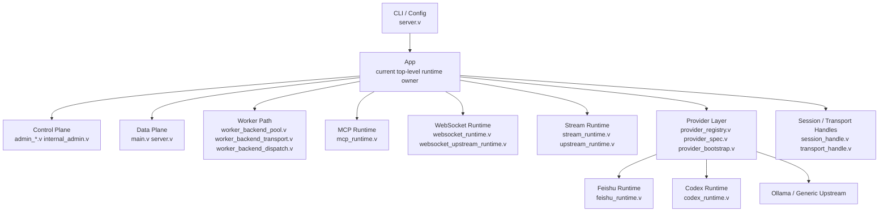
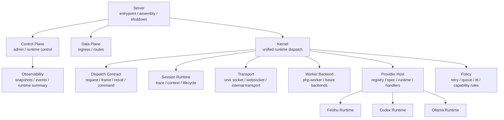

# vhttpd Architecture Refactor Baseline

This document captures the current architectural state of `vhttpd`, the main abstraction gaps that still remain after the recent runtime refactor, and a practical refactor sequence for the next iteration.

The goal is not to force a perfect abstract model up front. The goal is to:

- preserve the seams that already emerged in the codebase
- avoid over-abstracting concepts that do not exist yet
- make future iteration require smaller, more local changes
- support future worker backends beyond `php-worker`

## Current Read

The current repository already shows a meaningful shift away from a single `main.v` / `server.v` style runtime blob.

Important seams already exist:

- server/bootstrap: `src/server.v`
- control/admin runtime: `src/admin_runtime.v`, `src/admin_server.v`, `src/admin_workers.v`, `src/internal_admin.v`
- provider registration/spec/bootstrap: `src/provider_registry.v`, `src/provider_spec.v`, `src/provider_bootstrap.v`
- worker transport/pool/dispatch: `src/worker_backend_transport.v`, `src/worker_backend_pool.v`, `src/worker_backend_dispatch.v`
- runtime modules: `src/mcp_runtime.v`, `src/stream_runtime.v`, `src/websocket_runtime.v`, `src/websocket_upstream_runtime.v`, `src/upstream_runtime.v`
- context handles: `src/session_handle.v`, `src/transport_handle.v`
- pure V seam tests: `src/provider_registry_test.v`, `src/provider_bootstrap_test.v`, `src/websocket_upstream_runtime_test.v`, `src/codex_runtime_test.v`

Recent progress has also started to materialize `ProviderHost` as the provider-side control-plane owner for provider names, specs, and runtime snapshots.

That means the refactor direction is correct. The system is no longer only organized around protocol entrypoints.

At the same time, the refactor is not finished yet:

- `App` is still the main runtime state owner
- `Provider` is still mostly an adapter surface, not a true runtime owner
- `Kernel` is still an intent rather than a first-class module boundary
- `schedule` is not a real subsystem in the current codebase and should not be abstracted yet

## Current Layer Map

## What Is Already Working

### 1. Concepts are being named explicitly

The current codebase already distinguishes:

- provider
- runtime
- worker
- transport
- session
- command execution

That is a major improvement over keeping all runtime behavior inside entrypoint files.

### 2. Provider spec is becoming a stable seam

`src/provider_spec.v` is the strongest abstraction signal in the current refactor.

It already models:

- route kind
- command matching
- command handler
- runtime hooks
- provider relationship

This is close to a real extensibility surface.

### 3. Pure V test seams have started to appear

This is important because architectural refactors become durable only when tests move closer to the seams being introduced.

Current examples:

- `src/provider_registry_test.v`
- `src/provider_bootstrap_test.v`
- `src/websocket_upstream_runtime_test.v`
- `src/codex_runtime_test.v`

## Main Gaps

### 1. `App` still owns too much runtime state

`src/server.v` still builds a very large `App` instance that directly holds:

- worker sockets, queue, restart, timeout, env
- MCP session state
- websocket hub state
- provider registry and provider specs
- Feishu runtime state
- Codex runtime state
- asset/admin/internal admin state

This means the runtime seams exist, but ownership has not moved far enough yet.

### 2. `Provider` is still mostly an adapter concept

`src/provider_registry.v` currently defines a useful `Provider` interface, but the concrete provider implementations are still mostly thin delegators or no-op lifecycle adapters.

That means:

- provider naming exists
- provider lifecycle exists in shape
- provider runtime ownership is not fully separated yet

### 3. `Kernel` does not yet exist as a first-class owner

There are multiple files that already look like kernel responsibilities:

- `src/worker_backend_dispatch.v`
- `src/worker_backend_queue.v`
- `src/mcp_runtime.v`
- `src/stream_runtime.v`
- `src/websocket_upstream_runtime.v`

But they are still perceived as runtime helpers rather than a single coordinating runtime layer.

### 4. `schedule` is not a mature concept in this repository

There are scheduling-like behaviors today:

- worker restart backoff
- queue timeout
- reconnect delay
- flush loops

But there is no coherent scheduler subsystem yet. Do not create one just for conceptual symmetry.

### 5. Session and transport are named, but not yet central lifecycle owners

`src/session_handle.v` and `src/transport_handle.v` are good starts, but they are still metadata handles more than active runtime boundaries.

They do not yet centralize:

- creation
- ownership
- propagation
- cleanup
- observability

## Concepts That Should Be First-Class

The most useful architectural concepts in the current codebase are:

### 1. Server

Responsibilities:

- process entrypoint
- config load
- runtime assembly
- startup and shutdown

The server should remain an assembler, not a long-term owner of most runtime behavior.

### 2. Control Plane

Responsibilities:

- admin endpoints
- internal admin socket
- runtime snapshot
- worker/provider runtime control

Current files:

- `src/admin_runtime.v`
- `src/admin_server.v`
- `src/admin_workers.v`
- `src/internal_admin.v`

### 3. Data Plane

Responsibilities:

- external HTTP / WebSocket / MCP / stream ingress
- route normalization
- handoff into kernel

### 4. Kernel

Responsibilities:

- unified dispatch decisions
- coordination across worker backend, provider runtime, session, and transport
- common runtime policies
- mode routing across `http`, `stream`, `mcp`, and `websocket_upstream`

This is the most important concept that is still only partially materialized.

### 5. Dispatch Contract

Responsibilities:

- internal request/frame/result/command schemas
- stable runtime contract between ingress, kernel, worker backends, and providers

Without this seam, every new runtime mode or backend causes broad code changes.

### 6. Worker Backend

Responsibilities:

- start/stop worker instances
- dispatch work
- read results
- health and pool lifecycle
- restart/backoff integration

This is more important than `schedule`, because the project already needs it.

`php-worker` should become one implementation of a generic worker backend concept.

### 7. Transport

Responsibilities:

- connection and wire semantics
- unix socket / websocket / internal frame transport
- transport-level lifecycle and errors

### 8. Session

Responsibilities:

- request context
- trace propagation
- provider/transport association
- lifecycle visibility

### 9. Provider

Responsibilities:

- capability-facing abstraction for an upstream or integration family
- registration and discovery
- provider-specific command routing

### 10. Provider Runtime

Responsibilities:

- provider connection state
- reconnect / heartbeat / normalization
- runtime snapshot
- provider-owned lifecycle

This should be distinguished from `Provider` itself.

### 11. Provider Command Handler

Responsibilities:

- bridge internal commands to provider-specific actions

This is already present and is worth preserving as a seam.

### 12. Policy

Responsibilities:

- retry/backoff
- queue timeout
- capability enforcement
- TTL / allowlists / origin rules

This does not need a separate subsystem immediately, but it should remain identifiable as policy rather than accidental control flow.

### 13. Observability

Responsibilities:

- runtime snapshots
- event log
- request/session visibility
- provider/worker state reporting

### 14. Resource Lifecycle

Responsibilities:

- sockets
- worker processes
- ws connections
- pending queues
- sessions
- internal admin socket

Each resource should eventually have a clear answer to:

- who creates it
- who owns it
- who cleans it up
- who reports its state

## Concepts That Should Not Be Forced Yet

### `schedule`

Do not introduce a first-class scheduler abstraction yet.

There is not enough coherent scheduling behavior in the current codebase to justify it. Existing timing logic is still local policy:

- restart backoff
- reconnect delay
- timeout
- periodic flushing

If a real scheduler emerges later, it can be extracted then.

## Target Module Shape

## Minimal Refactor Sequence

The next iteration should focus on the smallest sequence that creates real architectural leverage.

### Phase 1: Stabilize `WorkerBackend`

Reason:

- future runtime evolution will likely need non-PHP workers
- current code still assumes `php-worker` too directly

Goal:

- make worker management generic
- treat `php-worker` as one backend implementation

Primary files:

- `src/worker_backend_pool.v`
- `src/worker_backend_transport.v`
- `src/worker_backend_dispatch.v`

Desired outcome:

- server/kernel dispatch through a worker backend abstraction
- fake backends become easy to test in pure V

### Phase 2: Materialize `Kernel`

Reason:

- current runtime dispatch responsibilities are still spread across many files without a clear owner

Goal:

- move unified dispatch ownership away from `server`
- make session/policy/routing decisions feel like kernel behavior

Primary files:

- `src/worker_backend_dispatch.v`
- `src/worker_backend_queue.v`
- `src/mcp_runtime.v`
- `src/stream_runtime.v`
- `src/websocket_runtime.v`
- `src/websocket_upstream_runtime.v`

Desired outcome:

- data plane hands off quickly into kernel
- runtime mode handling shares stable internal contracts

### Phase 3: Separate `ProviderRuntime` ownership

Reason:

- providers are currently named but not fully state-owning

Goal:

- distinguish provider capability from provider runtime state
- stop treating provider implementations as mostly no-op adapters

Primary files:

- `src/provider_registry.v`
- `src/provider_spec.v`
- `src/provider_bootstrap.v`
- `src/feishu_runtime.v`
- `src/codex_runtime.v`

Desired outcome:

- provider runtime owns more of its own state and lifecycle
- kernel interacts with a provider host rather than raw `App` runtime fields

### Phase 4: Consolidate session, policy, and observability

Reason:

- these become easier to stabilize after worker backend and kernel are real seams

Goal:

- unify context propagation
- make snapshots and runtime reporting more systematic
- reduce policy scattering

## Testing Guidance

Architectural refactors should add tests closer to the seam being introduced.

Recommended test layers:

### 1. Pure V unit tests

Examples:

- small helpers
- lightweight JSON scanners
- policy logic

### 2. Pure V seam tests

Examples:

- provider registry behavior
- provider bootstrap behavior
- worker backend contract tests
- kernel route decision tests

### 3. Contract tests

Examples:

- worker dispatch contracts
- command/result/frame normalization
- provider handler contracts

### 4. Full integration tests

Examples:

- HTTP
- WebSocket
- MCP
- managed worker / socket integration

## Practical Baseline

If only one new abstraction is fully completed next, it should be `WorkerBackend`.

That single step will:

- reduce direct coupling to `php-worker`
- create a path for future backends
- make kernel extraction more natural
- force cleaner dispatch boundaries
- enable stronger pure V tests

In short:

- do not force `schedule`
- prioritize `WorkerBackend`
- then make `Kernel` real
- then let `ProviderRuntime` become a true owner
